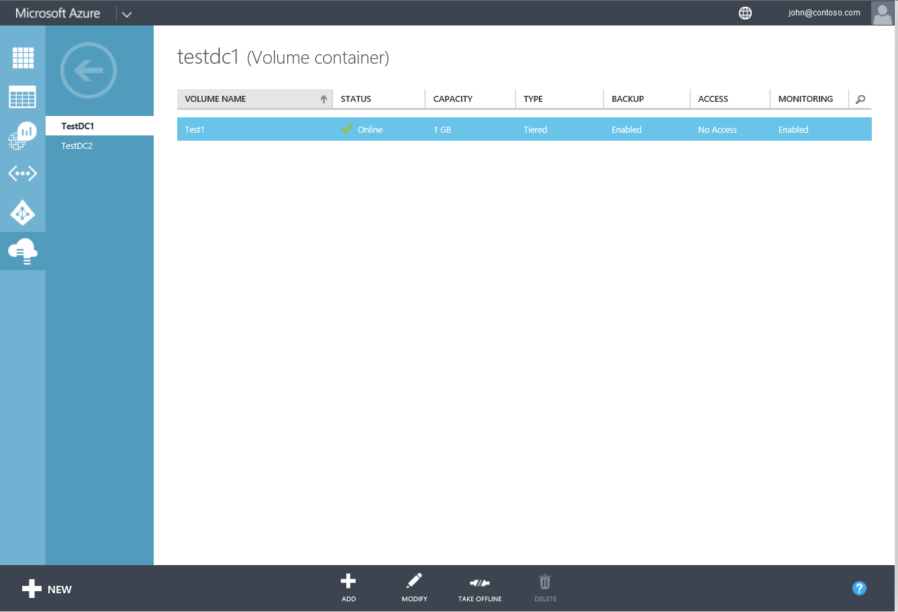
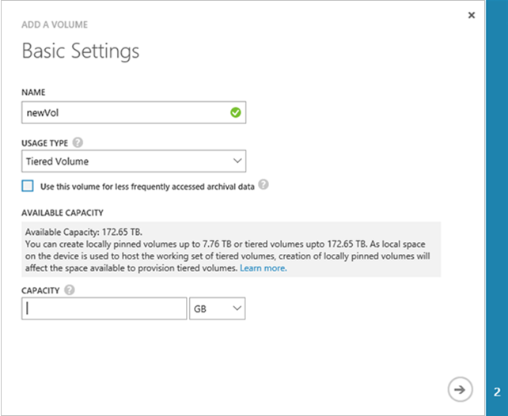
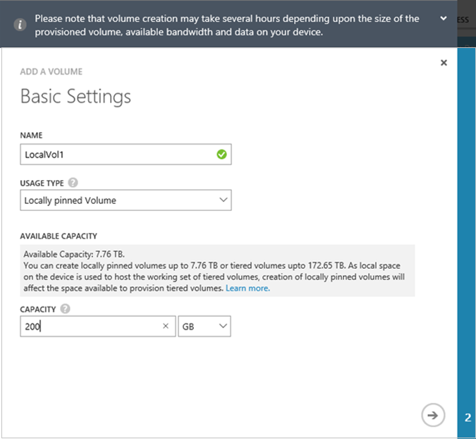
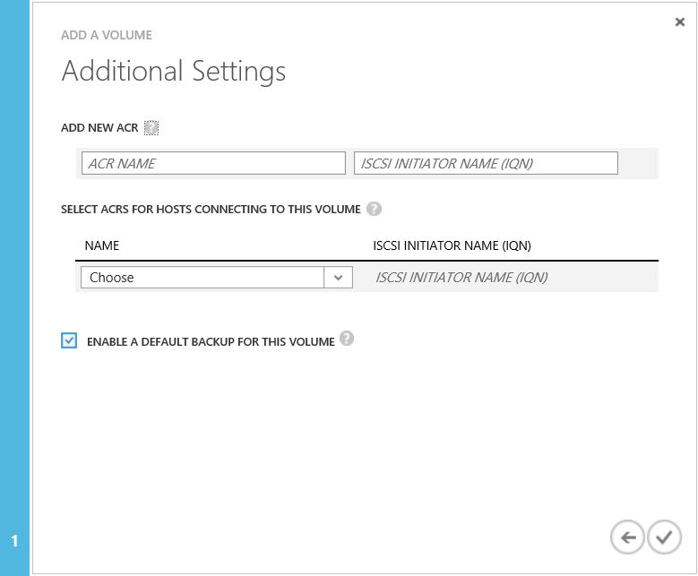
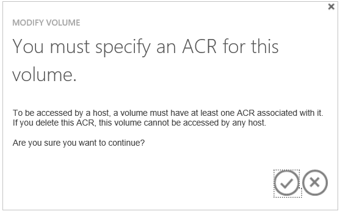
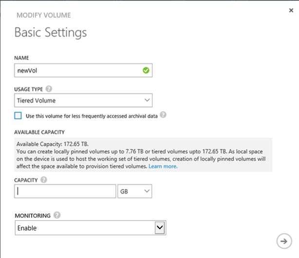
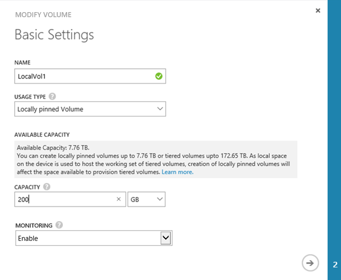

<properties
   pageTitle="Verwalten Ihrer StorSimple Datenmengen (U2) | Microsoft Azure"
   description="Wird erläutert, wie Sie hinzufügen, ändern, überwachen und Löschen von StorSimple Datenmengen, und wie sie bei Bedarf offline schalten."
   services="storsimple"
   documentationCenter="NA"
   authors="alkohli"
   manager="carmonm"
   editor="" />
<tags 
   ms.service="storsimple"
   ms.devlang="NA"
   ms.topic="article"
   ms.tgt_pltfrm="NA"
   ms.workload="NA"
   ms.date="10/28/2016"
   ms.author="alkohli" />

# Verwenden Sie den Dienst StorSimple Manager zum Verwalten von Datenmengen (Update 2)

[AZURE.INCLUDE [storsimple-version-selector-manage-volumes](../../includes/storsimple-version-selector-manage-volumes.md)]

## (Übersicht)

In diesem Lernprogramm wird erläutert, wie den StorSimple Manager-Dienst verwenden, erstellen und Verwalten von Datenmengen auf dem Gerät StorSimple und StorSimple virtuelles Gerät mit Update 2 installiert werden.

Der StorSimple-Manager ist eine Erweiterung in der klassischen Azure Portal, in dem Sie Ihre Lösung StorSimple über eine einzige Web-Oberfläche verwalten kann. Neben der Verwaltung von Datenmengen aus, können Sie den Dienst StorSimple Manager erstellen und verwalten StorSimple Services, anzeigen und Verwalten von Geräten, Benachrichtigungen anzeigen und anzeigen und Verwalten von Sicherung Richtlinien und die Sicherung Katalog.

## Volumetypen

StorSimple Datenmengen sind möglich:

- **Lokal angehefteten Datenmengen**: Daten in diese Datenträger bleibt auf dem lokalen StorSimple Gerät zu jeder Zeit.
- **Tiered Datenmengen**: Daten in diese Datenträger können Effekts in der Cloud.

Eine Archivierung Lautstärke ist eine Art gestufte Lautstärke an. Deduplication Ausschnitt vergrößert verwendet für Archivierung Datenmengen kann das Gerät größere Segmente von Daten in der Cloud zu übertragen. 

Falls erforderlich, Sie die Lautstärke ändern können Typ lokal, gestuft oder von gestuft an lokale. Weitere Informationen zum [Ändern der Lautstärke Typ](#change-the-volume-type)wechseln.

### Lokal angeheftete Datenmengen

Lokal angeheftete Datenmengen vollständig bereitgestellte Datenmengen sind, die nicht in der Cloud Datenebenen durchführen, garantiert für die primäre Daten, unabhängig von Cloud-Konnektivität inkrementell lokale. Daten auf lokal angeheftete Datenmengen ist nicht deduplizierte und komprimiert; jedoch sind Momentaufnahmen der lokal angeheftete Datenmengen deduplizierte. 

Lokal angeheftete Datenmengen sind vollständig nach der Bereitstellung; Daher müssen Sie genügend Speicherplatz auf Ihrem Gerät verfügen, wenn Sie diese erstellen. Sie können bis zu einer Größe von 8 TB auf dem Gerät StorSimple 8100 und 20 TB auf dem Gerät 8600 lokal angeheftete Datenmengen bereitstellen. Verbleibenden lokalen Speicherplatz auf dem Gerät für Momentaufnahmen, Metadaten und Datenverarbeitung reserviert und StorSimple. Sie können die Größe des ein lokales angeheftete Volume maximal verfügbaren Speicherplatz erhöhen, jedoch können nicht verringern der Größe eines Datenträgers einmal erstellt.

Wenn Sie ein lokales angeheftete Volume erstellen, wird der verfügbare Platz für die Erstellung von gestufte Datenmengen verringert. Auch im umgekehrten Fall gilt: Wenn Sie vorhandene gestufte Datenmengen haben, wird der Speicherplatz für lokales erstellen Datenmengen angehefteten kleiner als der oben genannten Höchstgrenzen bei sein. Weitere Informationen zu lokalen Datenmengen finden Sie in den [häufig gestellten Fragen auf lokal angeheftete Datenmengen](storsimple-local-volume-faq.md).   

### Gestufte Datenmengen

Gestufte Datenträger sind Speicherdefizite Datenmengen, in dem die häufig verwendeter Daten auf dem Gerät lokale bleibt und weniger häufig verwendeten Daten automatisch in die Cloud gestuft ist. Dünne bereitgestellt wird eine Virtualisierungstechnologie in der verfügbaren Speicher überschreitet physische Ressourcen angezeigt wird. Statt reserviert werden über genügend Speicherplatz im voraus, verwendet StorSimple nur genügend Speicherplatz zum aktuellen erfüllen reserviert dünnen bereitgestellt. Flexible Art der Cloud-Speicher erleichtert dieser Ansatz, da StorSimple vergrößern oder verkleinern Cloud-Speicher, um erweitert ändern kann.

Wenn Sie die Lautstärke gestufte für archivierte Daten verwenden, ändert sich Aktivieren des Kontrollkästchens **diesem Handbuch für weniger häufig verwendeter Archivierung Daten verwenden** die Deduplication Textbaustein Größe für die Lautstärke in 512 KB. Wenn Sie nicht diese Option auswählen, wird die entsprechende gestufte Lautstärke eine Abschnittsgröße von 64 KB verwendet. Eine größere Deduplication Textbaustein Größe ermöglicht das Gerät, um die Übertragung von großen Archivierung Daten in der Cloud zu beschleunigen.

>[AZURE.NOTE] Archivierung Datenmengen mit einer Version vor dem Update 2 StorSimple erstellt werden mit der Archivierung mit aktiviertem Kontrollkästchen als gestufte importiert werden.

### Bereitgestellte Kapazität

Schlagen Sie in der folgenden Tabelle für maximale bereitgestellte Kapazität für jeden Gerät und Lautstärke. (Beachten Sie, dass lokal angeheftete Datenmengen nicht auf einem virtuellen Gerät verfügbar sind.)

|             | Maximale gestufte Lautstärke Größe | Lokales Maximum angehefteten Lautstärke Größe |
|-------------|----------------------------|------------------------------------|
| **Physische Geräte** |       |       |
| 8100                 | 64 TB | 8 TB |
| 8600                 | 64 TB | 20 TB |
| **Virtuelle Geräte**  |       |       |
| 8010                | 30 TB | N/V   |
| 8020               | 64 TB | N/V   |

## Der Datenträger-Seite

Die Seite **Datenmengen** können Sie die Datenmengen Speicher verwalten, die auf dem Gerät Microsoft Azure StorSimple für Ihre Initiatoren (Server) bereitgestellt werden. Es wird die Liste der Datenträger auf Ihrem Gerät StorSimple angezeigt.

 

Ein Volume besteht aus einer Reihe von Attributen:

- **Volumen-Name** – einen beschreibenden Namen, die eindeutig sein muss, und hilft beim Identifizieren und der Lautstärke. Dieser Name wird auch in Berichten Überwachung, wenn Sie auf einem bestimmten Volume Filtern verwendet.

- **Status** – können online oder offline sein. Wenn ein Volume offline ist, ist es nicht sichtbar Initiatoren (Server), die Zugriff auf den Datenträger verwenden dürfen.

- **Kapazität** – gibt an, die Gesamtmenge der Daten, die vom Initiator (Server) gespeichert werden können. Lokal angehefteten Datenmengen sind vollständig bereitgestellt und auf dem Gerät StorSimple befinden. Gestufte Datenmengen werden Thin Provisioning nach der Bereitstellung und die Daten ist deduplizierte. Mit Speicherdefizite Datenmengen wird nicht Ihr Gerät physische Speicherkapazität intern oder in der Cloud entsprechend konfiguriert Volume-Kapazität vorab zuweisen. Die Lautstärke Kapazität reserviert und bei Bedarf verbraucht.

- **Typ** – gibt an, ob die Lautstärke **Tiered** (die Standardeinstellung) oder **lokal fixiert**ist.

- **Zusätzliche** – gibt an, ob eine Sicherung Standardrichtlinie für die Lautstärke vorhanden ist.

- **Access** – gibt an, die Initiatoren (Server), die Zugriff auf diesem Handbuch zulässig ist. Initiatoren, die keine Mitglieder der Access-Steuerelement-Eintrag (ACR) sind, die die Lautstärke zugeordnet ist werden die Lautstärke nicht angezeigt werden.

- **Überwachung** – gibt an, ob ein Volume überwacht wird. Ein Volume haben die Überwachung standardmäßig aktiviert, wenn sie erstellt wurde. Wird, jedoch die Überwachung, für ein Volume datenbeschriftungsreihe deaktiviert werden. Führen Sie zum Aktivieren der Überwachung für einen Datenträger, die Anweisungen im [Monitor einen Datenträger](#monitor-a-volume)aus. 

Verwenden Sie die Anweisungen in diesem Lernprogramm, um die folgenden Aufgaben ausführen:

- Hinzufügen eines Datenträgers 
- Ein Volume bearbeiten 
- Ändern Sie den Typ der Lautstärke
- Löschen eines Datenträgers 
- Offlineschalten einer Lautstärke 
- Überwachen Sie einen Datenträger 

## Hinzufügen eines Datenträgers

Sie während der Bereitstellung Ihrer Lösung StorSimple [ein Volume erstellt](storsimple-deployment-walkthrough-u2.md#step-6-create-a-volume) . Hinzufügen eines Datenträger ist ein ähnliches Verfahren.

#### Hinzufügen ein Datenträgers

1. Klicken Sie auf der Seite **Geräte** wählen Sie das Gerät, doppelklicken Sie darauf, und klicken Sie dann auf der Registerkarte **Lautstärke Container** .

2. Wählen Sie einen Volumen-Container aus der Liste aus, und doppelklicken Sie darauf Zugriff auf die Datenmengen, die den Container zugeordnet.

3. Klicken Sie auf **Hinzufügen** , am unteren Rand der Seite. Hinzufügen, die eine Volumen-Assistent wird gestartet.

     

4. Hinzufügen eines Assistenten Lautstärke, klicken Sie unter **Grundlegende Einstellungen**führen Sie folgende Schritte aus:

  1. Geben Sie einen **Namen** für die Lautstärke ein.
  2. Wählen Sie einen **Typ Verwendung** aus der Dropdownliste aus. Für Auslastung, die Daten sein müssen jederzeit zur Verfügung stehen lokal auf dem Gerät, und wählen **Lokales angehefteten**. Wählen Sie für alle anderen Typen von Daten **Tiered**aus. (**Tiered** ist der Standardwert.)
  3. Wenn Sie in Schritt 2 **Tiered** ausgewählt haben, können Sie das Kontrollkästchen **diesem Handbuch für weniger häufig verwendeter Archivierung Daten verwenden** , um eine Archivierung Lautstärke konfigurieren auswählen.
  4. Geben Sie die **Kapazität nach der Bereitstellung** für die Lautstärke in GB oder TB. Maximale Größe für jeden Gerät und Lautstärke finden Sie unter [Kapazität bereitgestellt](#provisioned-capacity) . Schauen Sie sich die **Verfügbare Kapazität** , um festzustellen, wie viel Speicherplatz auf Ihrem Gerät tatsächlich verfügbar ist.

5. Klicken Sie auf das Pfeilsymbol. Wenn Sie ein lokales angeheftete Volume konfigurieren, sehen Sie die folgende Meldung angezeigt.

    
   
5. Klicken Sie auf das Pfeilsymbol erneut, um zu der Seite **Weitere Einstellungen** zu wechseln.

     

6. Fügen Sie einen neuen Eintrag für Access-Steuerelement (ACR), klicken Sie unter **Zusätzliche Einstellungen**:
  
  1. Wählen Sie eine Access-Steuerelement-Eintrag (ACR) aus der Dropdownliste aus. Alternativ können Sie eine neue ACR hinzufügen. ACRs bestimmen, welche Hosts Ihre Datenmengen zugreifen können, indem Sie den Host IQN mit, die in den Eintrag aufgeführt. Wenn Sie eine ACR nicht angeben, werden Sie die folgende Meldung angezeigt.

        

  2. Es empfiehlt sich, dass Sie das Kontrollkästchen **Standard Sicherung für diesen Datenträger aktivieren** .
  3. Klicken Sie auf das Symbol "Überprüfen"  um die Lautstärke mit den angegebenen Einstellungen zu erstellen.

Die neue Lautstärke kann nun verwenden.

>[AZURE.NOTE] Wenn Sie ein lokales angeheftete Volume erstellen und erstellen Sie dann ein anderes lokal angeheftete Volume sofort anschließend das Volume erstellen, die Aufträge sequenziell ausgeführt werden. Der erste Auftrag zum Volume erstellen muss enden vor dem Beginn des nächsten Auftrags zum Volume erstellen

## Ein Volume bearbeiten

Ändern Sie einen Datenträger, wenn Sie erweitern oder Ändern der Hosts, die die Lautstärke zugreifen müssen.

> [AZURE.IMPORTANT] 
>
> - Wenn Sie die Größe der Lautstärke auf dem Gerät ändern, muss die Lautstärke Größe auf dem Host ebenfalls geändert werden. 
> - Die hier beschriebenen Schritte für Host angeordneten sind für Windows Server 2012 (2012R2). Es werden Verfahren für Linux oder andere Hostbetriebssysteme unterscheiden. Schlagen Sie in Ihrem Host Betriebssystem Anweisungen, beim Ändern der Lautstärke auf einem Host mit einem anderen Betriebssystem. 

#### So ändern Sie einen Datenträger

1. Klicken Sie auf der Seite **Geräte** wählen Sie das Gerät, doppelklicken Sie darauf, und klicken Sie dann auf der Registerkarte **Lautstärke Container** .

2. Wählen Sie einen Container Lautstärke aus der Liste aus, und doppelklicken Sie darauf zum Anzeigen der Datenmengen mit den Container verbunden ist.

3. Wählen Sie einen Datenträger aus, und klicken Sie am unteren Rand der Seite, auf **Ändern**. Der Assistent zum Ändern von Volume wird gestartet.

4. Im Assistenten ändern Lautstärke klicken Sie unter **Grundlegende Einstellungen**können Sie Folgendes ein:

  - Bearbeiten Sie den **Namen**ein.
  - Konvertieren Sie den **Typ der Verwendung** von lokal angehefteten zu gestuft oder von gestuft, um lokal angehefteten (Weitere Informationen finden Sie unter [Ändern der Lautstärke Typ](#change-the-volume-type) ).
  - Erhöhen der **Kapazität nach der Bereitstellung**. Die **Nach der Bereitstellung Kapazität** können nur erhöht werden. Sie können keinen Datenträger komprimieren, nachdem sie erstellt wurde.

5. Klicken Sie unter **Zusätzliche Einstellungen**können Sie die ACR ändern, vorausgesetzt, dass die Lautstärke offline ist. Wenn die Lautstärke online ist, müssen Sie es zuerst offline schalten. Verweisen Sie auf die Schritte in [einen Datenträger offline nehmen](#take-a-volume-offline) vor der ACR ändern.

    > [AZURE.NOTE] Sie können die Option **aktivieren eine Sicherung Standard** für die Lautstärke nicht ändern.

6. Die Änderungen zu speichern, indem Sie auf das Symbol "Überprüfen" . Im klassische Azure-Portal wird eine Aktualisierung umfangreicher Nachrichten angezeigt. Es wird eine Erfolgsmeldung angezeigt, wenn die Lautstärke erfolgreich aktualisiert wurde.

7. Wenn Sie ein Volume erweitern sind, führen Sie die folgenden Schritte auf Ihrem Windows-Hostcomputer:

   1. Wechseln Sie zu dem **Computermanagement** ->**Datenträger Verwaltung**.
   2. Mit der rechten Maustaste **Datenträger Verwaltung** , und wählen Sie die **Datenträger neu einlesen**.
   3. Wählen Sie in der Liste der Datenträger die Lautstärke, die aktualisiert, mit der rechten Maustaste, und wählen Sie dann **Volume erweitern**. Die Lautstärke erweitern-Assistent wird gestartet. Klicken Sie auf **Weiter**.
   4. Führen Sie im Assistenten die Standardwerte annehmen. Nachdem der Assistent abgeschlossen ist, sollte die Lautstärke die höhere Größe anzeigen.

    >[AZURE.NOTE] Wenn Sie ein lokales angeheftete Volume zu erweitern, und blenden Sie dann angehefteten ein anderes lokales Volume sofort, danach die Lautstärke erläuterten Einzelvorgänge sequenziell ausführen. Der erste Volume erläuterten Auftrag muss enden, vor der nächste Volume erläuterten Auftrag beginnen kann.

 **Video verfügbar**

Um ein Video zur Verfügung, die veranschaulicht, wie ein Volume zu erweitern, klicken Sie auf [hier](https://azure.microsoft.com/documentation/videos/expand-a-storsimple-volume/).

## Ändern Sie den Typ der Lautstärke

Sie können die Lautstärke Art aus Abstufung auf lokal angehefteten oder aus angehefteten lokal zu gestufte. Diese Konvertierung sollten jedoch keines häufig verwendeten vorkommen. Einige Konvertieren eines Datenträgers aus Gründen Abstufung auf lokal angehefteten:

- Lokale Garantien hinsichtlich der datenverfügbarkeit von und Leistung
- Verzicht auf Cloud Wartezeiten und Cloud Netzwerkkonnektivitätsprobleme vor.

Normalerweise sind kleine vorhandenen Datenmengen, die Sie häufig zugreifen möchten. Ein lokales angeheftete Volume wird vollständig bereitgestellt werden, wenn sie erstellt wurde. Wenn Sie eine gestufte Lautstärke auf einen Datenträger lokal angeheftete konvertieren, überprüft StorSimple an, dass Sie genügend Speicherplatz auf Ihrem Gerät verfügen, bevor sie die Konvertierung zu starten. Wenn Sie nicht genügend Speicherplatz verfügen, wird eine Fehlermeldung, und der Vorgang wird abgebrochen werden. 

> [AZURE.NOTE] Bevor Sie eine Konvertierung von lokal fixiert gestuft beginnen, stellen Sie sicher, dass Sie die erforderlichen Platz Ihrer aufgrund der Ergebnisse in Betracht ziehen. 

Möglicherweise möchten ein lokal angeheftete Volume auf einen Datenträger gestufte ändern, wenn Sie mehr Platz zum Bereitstellen von anderen Datenmengen benötigen. Wenn Sie die lokal angeheftete Lautstärke, gestuft, die verfügbare Kapazität für die Gerät erhöht, um die Größe der veröffentlichten Kapazität konvertieren. Wenn Netzwerkkonnektivitätsprobleme vor die Konvertierung eines Datenträgers aus dem lokalen Typ auf den gestufte verhindern möchten, wird die lokale Lautstärke bis zum Abschluss der Konvertierung Eigenschaften eines gestufte Datenträgers aufweisen. Dies liegt daran einiger Daten in der Cloud verschüttet haben können. Diese verschütteten Daten weiterhin lokale Speicherplatz auf dem Gerät beanspruchen, die freigegeben werden kann, bis der Vorgang neu gestartet und ausgeführt wird.

>[AZURE.NOTE] Konvertieren eines Datenträgers kann einige Zeit dauern, und Sie können eine Konvertierung nach dem Start nicht abbrechen. Die Lautstärke online bleibt, während der Konvertierung, und Sie können die erforderlichen Sicherungskopien, aber nicht möglich, erweitern Sie oder stellen Sie die Lautstärke wieder her, während die Konvertierung stattfindet.  

Konvertierung in eine gestufte auf einen Datenträger lokal angeheftete kann Gerät Leistung beeinträchtigen. Darüber hinaus können die folgenden Faktoren mehr Zeit benötigt wird, um die Konvertierung abzuschließen:

- Es ist nicht genügend Bandbreite ein.

- Es gibt keine aktuelle Sicherung aus.

Um die Effekte zu minimieren, die folgenden Faktoren möglicherweise:

- Überprüfen Sie Ihre Bandbreite Richtlinien begrenzungsebene, und stellen Sie sicher, dass eine dedizierte 40/s Bandbreite verfügbar ist.
- Planen der Konvertierung für Zeiten an.
- Führen Sie eine Momentaufnahme der Cloud, bevor Sie die Konvertierung zu starten.

Wenn Sie mehrere Datenmengen (unterstützt verschiedene Auslastung) konvertieren, sollten Sie die Lautstärke Konvertierung priorisieren, sodass die höhere Priorität Datenmengen zuerst konvertiert werden. Angenommen, sollten Sie vor dem Konvertieren von Datenmengen mit Datei freigeben Auslastung Datenmengen, die virtuellen Computern (virtuellen Computern) hosten oder Datenmengen mit SQL-Auslastung konvertieren.

#### So ändern Sie den Typ der Lautstärke

1. Klicken Sie auf der Seite **Geräte** wählen Sie das Gerät, doppelklicken Sie darauf, und klicken Sie dann auf der Registerkarte **Lautstärke Container** .

2. Wählen Sie einen Container Lautstärke aus der Liste aus, und doppelklicken Sie darauf zum Anzeigen der Datenmengen mit den Container verbunden ist.

3. Wählen Sie einen Datenträger aus, und klicken Sie am unteren Rand der Seite, auf **Ändern**. Der Assistent zum Ändern von Volume wird gestartet.

4. Ändern Sie den Verwendungstyp auf der Seite **Einstellungen für grundlegende** , indem Sie den neuen Typ aus der Dropdownliste **Typ Verwendung** auswählen.

    - Wenn Sie den Typ **lokal**fixiert ändern, wird StorSimple angezeigt, wenn Sie über ausreichend Kapazität überprüfen.
    - Wenn Sie den Typ auf **Tiered** ändern, und diese Lautstärke für archivierte Daten verwendet werden, aktivieren Sie das Kontrollkästchen **diesem Handbuch für weniger häufig verwendeter Archivierung Daten verwenden** .

        

5. Klicken Sie auf das Pfeilsymbol  , um die Seite **Zusätzliche Einstellungen** anzuzeigen. Wenn Sie ein lokales angeheftete Volume konfigurieren, wird die folgende Meldung angezeigt.

    

6. Klicken Sie auf das Pfeilsymbol  erneut auf Weiter.

7. Klicken Sie auf das Symbol "Überprüfen"  um die Konvertierung zu starten. Azure-Portal wird eine Aktualisierung umfangreicher Nachrichten angezeigt. Es wird eine Erfolgsmeldung angezeigt, wenn die Lautstärke erfolgreich aktualisiert wurde.

## Offlineschalten einer Lautstärke

Möglicherweise müssen Sie einen Datenträger offline zu schalten, wenn Sie planen, ihn ändern oder löschen Sie ihn. Wenn ein Volume offline ist, ist es nicht für Lese-und Schreibzugriff verfügbar. Sie müssen die Lautstärke offline sowohl auf dem Host als auch auf dem Gerät ausführen. 

#### Um einen Datenträger offline zu schalten.

1. Stellen Sie sicher, dass die Lautstärke in Frage nicht verwendet, bevor sie das Offlineschalten ist.

2. Nehmen Sie die Lautstärke offline auf dem Host ersten. Dadurch werden mögliche Risiko einer Beschädigung der Daten auf dem Datenträger aus. Spezielle Schritte finden Sie in den Anweisungen für Ihr Hostbetriebssystem.

3. Nachdem der Host offline ist, führen Sie die Lautstärke auf dem Gerät offline durch Ausführen der folgenden Schritte:

  1. Klicken Sie auf der Seite **Geräte** wählen Sie das Gerät, doppelklicken Sie darauf, und klicken Sie dann auf der Registerkarte **Lautstärke Container** . Die Registerkarte **Lautstärke Container** Listen in Tabellenform die Lautstärke-Container, die dem Gerät zugeordnet sind.
  2. Wählen Sie einen Container Lautstärke, und klicken Sie darauf, um eine Liste aller Datenträger innerhalb des Containers anzuzeigen.
  3. Wählen Sie einen Datenträger aus, und klicken Sie auf **offline schalten**.
  4. Wenn Sie zur Bestätigung aufgefordert werden, klicken Sie auf **Ja**. Die Lautstärke sollten jetzt offline sein.

    Nachdem Sie ein Datenträger offline ist, wird die Option **Online schalten** verfügbar.

> [AZURE.NOTE] Der Befehl **Offline nehmen** sendet eine Anforderung an das Gerät, um die Lautstärke offline zu schalten. Wenn Hosts die Lautstärke weiterhin verwenden möchten, dies führt zu fehlerhaften Verbindungen, aber die Lautstärke Offlineschalten tritt nicht. 

## Löschen eines Datenträgers

> [AZURE.IMPORTANT] Sie können ein Volume löschen, nur, wenn sie offline ist.

Führen Sie die folgenden Schritte aus, um ein Volume zu löschen.

#### So löschen Sie einen Datenträger

1. Klicken Sie auf der Seite **Geräte** wählen Sie das Gerät, doppelklicken Sie darauf, und klicken Sie dann auf der Registerkarte **Lautstärke Container** .

2. Wählen Sie den Lautstärke Container, der die Lautstärke enthält, die Sie löschen möchten. Klicken Sie auf den Container Lautstärke zum Aufrufen der Seite **Datenmengen** .

3. Alle Datenträger, die diesem Container zugeordnet werden in einem tabellarischen Format angezeigt. Überprüfen Sie den Status des Datenträgers, die Sie löschen möchten. Wenn die Lautstärke, die Sie löschen möchten, nicht offline ist, in den Offlinebetrieb wechseln zuerst die Schritte in [einen Datenträger offline nehmen](#take-a-volume-offline).

4. Nachdem Sie die Lautstärke offline ist, klicken Sie auf am unteren Rand der Seite **Löschen** .

5. Wenn Sie zur Bestätigung aufgefordert werden, klicken Sie auf **Ja**. Die Lautstärke wird jetzt gelöscht und die Seite **Datenmengen** wird die aktualisierte Liste der Datenträger innerhalb des Containers angezeigt.

    >[AZURE.NOTE]Wenn Sie ein lokales angeheftete Volume löschen, der verfügbaren Speicherplatz für neue Datenmengen möglicherweise nicht sofort aktualisiert. Der Dienst StorSimple-Manager wird im lokalen Speicherplatz regelmäßig aktualisiert. Es wird empfohlen, dass Sie warten Sie einige Minuten, bevor Sie versuchen, das neue Volume erstellt.  Darüber hinaus, wenn Sie ein lokales angeheftete Volume löschen, und löschen Sie ein anderes lokal angehefteten Lautstärke sofort danach das Löschen der Datenträger, der Aufträge sequenziell ausgeführt werden. Der erste Lautstärke Löschvorgang Auftrag muss enden, vor der nächste Lautstärke Löschvorgang Auftrag beginnen kann.
 
## Überwachen von einem volume

Volumen Überwachung können Sie zum Erfassen von I/O-bezogene Statistiken für einen Datenträger. Überwachung wird standardmäßig für die ersten 32 Datenträger aktiviert, die Sie erstellen. Überwachen von zusätzlichen Datenmengen ist standardmäßig deaktiviert. Überwachung der duplizierten Datenmengen ist auch standardmäßig deaktiviert.

Führen Sie die folgenden Schritte aus, zum Aktivieren oder deaktivieren Sie die Überwachung für einen Datenträger.

#### So aktivieren oder deaktivieren die Lautstärke für die Überwachung

1. Klicken Sie auf der Seite **Geräte** wählen Sie das Gerät, doppelklicken Sie darauf, und klicken Sie dann auf der Registerkarte **Lautstärke Container** .

2. Wählen Sie den Lautstärke Container, in dem sich die Lautstärke befindet, und klicken Sie dann auf den Container Lautstärke zum Aufrufen der Seite **Datenmengen** .

3. Alle Datenträger, die diesem Container zugeordnet werden im tabellarische Anzeigen aufgelistet. Klicken Sie auf, und wählen Sie die Lautstärke oder Volumen klonen.

4. Klicken Sie am unteren Rand der Seite auf **Ändern**.

5. Wählen Sie im Assistenten Lautstärke ändern, klicken Sie unter **Grundlegende Einstellungen**aus der Dropdownliste **Überwachung** **Aktivieren** oder **Deaktivieren** .

## Nächste Schritte

- Erfahren Sie, wie [datenbeschriftungsreihe ein StorSimple Volume](storsimple-clone-volume.md).

- Erfahren Sie, wie der Dienst StorSimple Manager zum Verwalten von Ihrem Geräts StorSimple zu [verwenden](storsimple-manager-service-administration.md).

 
