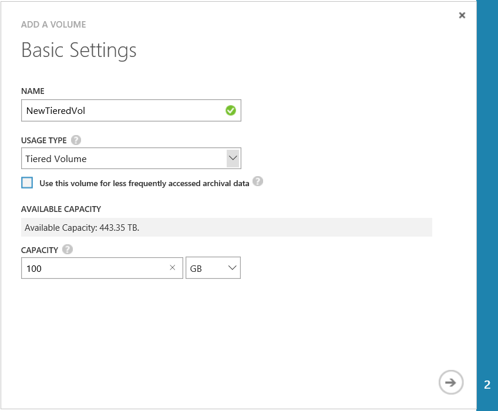
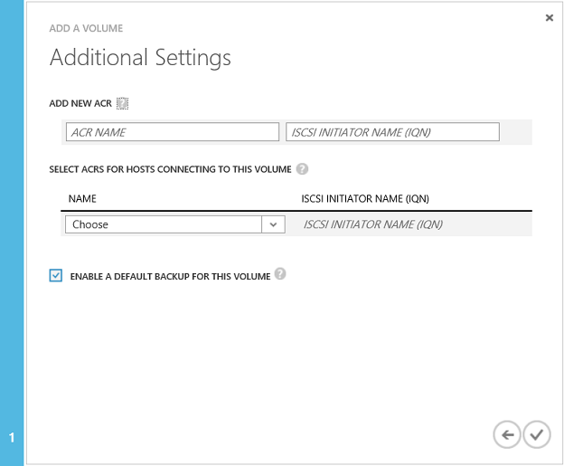

<properties
   pageTitle="Verwalten Ihrer StorSimple Datenmengen | Microsoft Azure"
   description="Wird erläutert, wie Sie hinzufügen, ändern, überwachen und Löschen von StorSimple Datenmengen, und wie sie bei Bedarf offline schalten."
   services="storsimple"
   documentationCenter="NA"
   authors="SharS"
   manager="carmonm"
   editor="" />
<tags
   ms.service="storsimple"
   ms.devlang="NA"
   ms.topic="article"
   ms.tgt_pltfrm="NA"
   ms.workload="TBD"
   ms.date="05/11/2016"
   ms.author="v-sharos" />

# Verwenden Sie den Dienst StorSimple Manager zum Verwalten von Datenmengen

[AZURE.INCLUDE [storsimple-version-selector-manage-volumes](../../includes/storsimple-version-selector-manage-volumes.md)]

## (Übersicht)

In diesem Lernprogramm wird erläutert, wie den StorSimple Manager-Dienst verwenden, erstellen und Verwalten von Datenmengen auf dem Gerät StorSimple und StorSimple virtuelles Gerät.

Der StorSimple-Manager ist eine Erweiterung des klassischen Azure Portals, in dem Sie Ihre Lösung StorSimple über eine einzige Web-Oberfläche verwalten kann. Neben der Verwaltung von Datenmengen aus, können Sie den Dienst StorSimple Manager erstellen und verwalten StorSimple Services, anzeigen und Verwalten von Geräten, Benachrichtigungen anzeigen und anzeigen und Verwalten von Sicherung Richtlinien und die Sicherung Katalog.

> [AZURE.NOTE] Azure StorSimple kann nur Speicherdefizite Datenträger erstellen. Sie können keine erstellt vollständig bereitgestellte oder teilweise bereitgestellte Datenmengen auf einem Azure StorSimple System.
>
> Dünne bereitgestellt wird eine Virtualisierungstechnologie in der verfügbaren Speicher überschreitet physische Ressourcen angezeigt wird. Statt reserviert werden über genügend Speicherplatz im voraus, verwendet Azure StorSimple nur genügend Speicherplatz zum aktuellen erfüllen reserviert dünnen bereitgestellt. Flexible Art der Cloud-Speicher erleichtert dieser Ansatz, da Azure StorSimple vergrößern oder verkleinern Cloud-Speicher, um erweitert ändern können.

## Der Datenträger-Seite

Die Seite **Datenmengen** können Sie die Datenmengen Speicher verwalten, die auf dem Gerät Microsoft Azure StorSimple für Ihre Initiatoren (Server) bereitgestellt werden. Es wird die Liste der Datenträger auf Ihrem Gerät StorSimple angezeigt.

 

Ein Volume besteht aus einer Reihe von Attributen:

- **Name** – einen beschreibenden Namen, die eindeutig sein muss, und hilft, den Datenträger zu identifizieren. Dieser Name wird auch in Berichten Überwachung, wenn Sie auf einem bestimmten Volume Filtern verwendet.

- **Status** – können online oder offline sein. Wenn ein Volume ist offline, ist es nicht sichtbar Initiatoren (Server), die Zugriff auf den Datenträger verwenden dürfen.

- **Kapazität** – gibt an, wie groß die Lautstärke, wie vom Initiator (Server) angesehen. Kapazität gibt die Gesamtmenge der Daten, die vom Initiator (Server) gespeichert werden können. Datenmengen werden Thin Provisioning nach der Bereitstellung und deduplizierte Daten ist. Dies bedeutet, dass Ihr Gerät physische Speicherkapazität intern oder in der Cloud entsprechend konfiguriert Volume-Kapazität vorab zuweisen nicht. Die Lautstärke Kapazität reserviert und bei Bedarf verbraucht.

- **Typ** – Volumen sind möglich gestufte oder Archivierung (ein Untertyp gestuft)

- **Access** – gibt an, die Initiatoren (Server), die Zugriff auf diesem Handbuch zulässig ist. Initiatoren, die keine Mitglieder der Access-Steuerelement-Eintrag (ACR) sind, die die Lautstärke zugeordnet ist werden die Lautstärke nicht angezeigt werden.

- **Überwachung** – gibt an, ob ein Volume überwacht wird. Ein Volume haben die Überwachung standardmäßig aktiviert, wenn sie erstellt wurde. Wird, jedoch die Überwachung, für ein Volume datenbeschriftungsreihe deaktiviert werden. Führen Sie zum Aktivieren der Überwachung für einen Datenträger, die Anweisungen im Monitor einen Datenträger aus.

Die am häufigsten verwendeten Aufgaben im Zusammenhang mit einem Volume sind:

- Hinzufügen eines Datenträgers
- Ein Volume bearbeiten
- Löschen eines Datenträgers
- Offlineschalten einer Lautstärke
- Überwachen Sie einen Datenträger

## Hinzufügen eines Datenträgers

Sie während der Bereitstellung Ihrer Lösung StorSimple [ein Volume erstellt](storsimple-deployment-walkthrough-u1.md#step-6-create-a-volume) . Hinzufügen eines Datenträger ist ein ähnliches Verfahren.

### Hinzufügen ein Datenträgers

1. Klicken Sie auf der Seite **Geräte** wählen Sie das Gerät, doppelklicken Sie darauf, und klicken Sie dann auf der Registerkarte **Lautstärke Container** .

2. Wählen Sie einen Container Lautstärke, und klicken Sie auf den Pfeil in der entsprechenden Zeile auf die Datenmengen, die dem Container zugeordneten zugreifen.

3. Klicken Sie auf **Hinzufügen** , am unteren Rand der Seite. Hinzufügen, die eine Volumen-Assistent wird gestartet.

     

4. Hinzufügen eines Assistenten Lautstärke, klicken Sie unter **Grundlegende Einstellungen**führen Sie folgende Schritte aus:

  1. Geben Sie einen **Namen** für die Lautstärke ein.
  2. Geben Sie die **Kapazität nach der Bereitstellung** für die Lautstärke in GB oder TB. Die Kapazität muss zwischen 1 GB und 64 TB für eine physische Gerät. Die maximale Kapazität, die für einen Datenträger auf einem StorSimple virtuelle Gerät bereitgestellt werden kann, ist 30 TB.
  3. Wählen Sie den **Typ der Verwendung** für die Lautstärke ein. Wenn Sie die Lautstärke gestufte für archivierte Daten verwenden, ändert sich Aktivieren des Kontrollkästchens **diesem Handbuch für weniger häufig verwendeter Archivierung Daten verwenden** die Deduplication Textbaustein Größe für die Lautstärke in 512 KB. Wenn Sie nicht diese Option auswählen, wird die entsprechende gestufte Lautstärke eine Abschnittsgröße von 64 KB verwendet. Eine größere Deduplication Textbaustein Größe ermöglicht das Gerät, um die Übertragung von großen Archivierung Daten in der Cloud zu beschleunigen. (Gestufte Datenmengen wurden primäre Datenmengen ehemals.)
  5. Klicken Sie auf das Pfeilsymbol , um die Seite **Zusätzliche Einstellungen** anzuzeigen.

        

5. Fügen Sie einen neuen Eintrag für Access-Steuerelement (ACR), klicken Sie unter **Zusätzliche Einstellungen**:

  1. Wählen Sie eine Access-Steuerelement-Eintrag (ACR) aus der Dropdownliste aus. Alternativ können Sie eine neue ACR hinzufügen. ACRs bestimmen, welche Hosts Ihre Datenmengen zugreifen können, indem Sie den Host IQN mit, die in den Eintrag aufgeführt.
  2. Es empfiehlt sich, dass Sie eine Sicherungskopie der standardmäßigen aktivieren, indem Sie **eine Sicherungskopie der Standardwert für dieses Volume aktivieren** das Kontrollkästchen.
   3. Klicken Sie auf das Symbol "Überprüfen"  um die Lautstärke mit den angegebenen Einstellungen zu erstellen.

Die neue Lautstärke kann nun verwenden.

## Ein Volume bearbeiten

Ändern Sie einen Datenträger, wenn Sie erweitern oder Ändern der Hosts, die die Lautstärke zugreifen müssen.

> [AZURE.IMPORTANT]
>
> - Wenn Sie die Größe der Lautstärke auf dem Gerät ändern, muss die Lautstärke Größe auf dem Host ebenfalls geändert werden.
> - Die hier beschriebenen Schritte für Host angeordneten sind für Windows Server 2012 (2012R2). Es werden Verfahren für Linux oder andere Hostbetriebssysteme unterscheiden. Schlagen Sie in Ihrem Host Betriebssystem Anweisungen, beim Ändern der Lautstärke auf einem Host mit einem anderen Betriebssystem.

### So ändern Sie einen Datenträger

1. Klicken Sie auf der Seite **Geräte** wählen Sie das Gerät, doppelklicken Sie darauf, und klicken Sie dann auf der Registerkarte **Lautstärke Container** . Diese Seite enthält in Tabellenform die Lautstärke-Container, die dem Gerät zugeordnet sind.

2. Wählen Sie einen Container Lautstärke, und klicken Sie darauf, um eine Liste aller Datenträger innerhalb des Containers anzuzeigen.

3. Klicken Sie auf der Seite **Datenmengen** wählen Sie einen Datenträger aus, und klicken Sie auf **Ändern**.

4. Im Assistenten ändern Lautstärke klicken Sie unter **Grundlegende Einstellungen**können Sie Folgendes ein:

  - Bearbeiten Sie den **Namen** und **Typ** , wenn Sie eine gestufte Volume auf einem Datenträger Archivierung ändern, indem Sie das Kontrollkästchen **diesem Handbuch für weniger häufig verwendeter Archivierung Daten verwenden** , so ändern Sie die Größe der Deduplication Textbaustein für die Lautstärke auf 512 KB auswählen möchten.
  - Erhöhen der **Kapazität nach der Bereitstellung**. Die **Nach der Bereitstellung Kapazität** können nur erhöht werden. Sie können keinen Datenträger komprimieren, nachdem sie erstellt wurde.

    > [AZURE.NOTE] Sie können den Lautstärke Container nicht ändern, nachdem sie auf einen Datenträger zugewiesen wurde.

5. Unter **Zusätzliche Einstellungen**können Sie die folgenden Aktionen ausführen:

  - Ändern Sie die ACRs, vorausgesetzt, dass die Lautstärke offline ist. Wenn die Lautstärke online ist, müssen Sie es zuerst offline schalten. Verweisen Sie auf die Schritte in [einen Datenträger offline nehmen](#take-a-volume-offline) vor der ACR ändern.
  - Ändern Sie die Liste der ACRs, nachdem die Lautstärke offline ist.

    > [AZURE.NOTE] Sie können die Option **aktivieren eine Sicherung Standard für dieses Volume** für die Lautstärke nicht ändern.

6. Die Änderungen zu speichern, indem Sie auf das Symbol "Überprüfen" . Im klassische Azure-Portal wird eine Aktualisierung umfangreicher Nachrichten angezeigt. Es wird eine Erfolgsmeldung angezeigt, wenn die Lautstärke erfolgreich aktualisiert wurde.

7. Wenn Sie ein Volume erweitern sind, führen Sie die folgenden Schritte auf Ihrem Windows-Hostcomputer:

   1. Wechseln Sie zu dem **Computermanagement** ->**Datenträger Verwaltung**.
   2. Mit der rechten Maustaste **Datenträger Verwaltung** , und wählen Sie die **Datenträger neu einlesen**.
   3. Wählen Sie in der Liste der Datenträger die Lautstärke, die aktualisiert, mit der rechten Maustaste, und wählen Sie dann **Volume erweitern**. Die Lautstärke erweitern-Assistent wird gestartet. Klicken Sie auf **Weiter**.
   4. Führen Sie im Assistenten die Standardwerte annehmen. Nachdem der Assistent abgeschlossen ist, sollte die Lautstärke die höhere Größe anzeigen.

 **Video verfügbar**

Um ein Video zur Verfügung, die veranschaulicht, wie ein Volume zu erweitern, klicken Sie auf [hier](https://azure.microsoft.com/documentation/videos/expand-a-storsimple-volume/).

## Offlineschalten einer Lautstärke

Möglicherweise müssen Sie einen Datenträger offline zu schalten, wenn Sie planen, ihn ändern oder löschen Sie ihn. Wenn ein Volume offline ist, ist es nicht für Lese-und Schreibzugriff verfügbar. Sie müssen die Lautstärke offline sowohl auf dem Host als auch auf dem Gerät ausführen. Führen Sie die folgenden Schritte aus, um einen Datenträger offline zu schalten.

### Um einen Datenträger offline zu schalten.

1. Stellen Sie sicher, dass die Lautstärke in Frage nicht verwendet, bevor sie das Offlineschalten ist.

2. Nehmen Sie die Lautstärke offline auf dem Host ersten. Dadurch werden mögliche Risiko einer Beschädigung der Daten auf dem Datenträger aus. Spezielle Schritte finden Sie in den Anweisungen für Ihr Hostbetriebssystem.

3. Nachdem der Host offline ist, führen Sie die Lautstärke auf dem Gerät offline durch Ausführen der folgenden Schritte:

  1. Klicken Sie auf der Seite **Geräte** wählen Sie das Gerät, doppelklicken Sie darauf, und klicken Sie dann auf der Registerkarte **Lautstärke Container** . Die Registerkarte **Lautstärke Container** Listen in Tabellenform die Lautstärke-Container, die dem Gerät zugeordnet sind.
  2. Wählen Sie einen Container Lautstärke, und klicken Sie darauf, um eine Liste aller Datenträger innerhalb des Containers anzuzeigen.
  3. Wählen Sie einen Datenträger aus, und klicken Sie auf **offline schalten**.
  4. Wenn Sie zur Bestätigung aufgefordert werden, klicken Sie auf **Ja**. Die Lautstärke sollten jetzt offline sein.

    Nachdem Sie ein Datenträger offline ist, wird die Option **Online schalten** verfügbar.

> [AZURE.NOTE] Der Befehl **Offline nehmen** sendet eine Anforderung an das Gerät, um die Lautstärke offline zu schalten. Wenn Hosts die Lautstärke weiterhin verwenden möchten, dies führt zu fehlerhaften Verbindungen, aber die Lautstärke Offlineschalten tritt nicht.

## Löschen eines Datenträgers

> [AZURE.IMPORTANT] Sie können ein Volume löschen, nur, wenn sie offline ist.

Führen Sie die folgenden Schritte aus, um ein Volume zu löschen.

### So löschen Sie einen Datenträger

1. Klicken Sie auf der Seite **Geräte** wählen Sie das Gerät, doppelklicken Sie darauf, und klicken Sie dann auf der Registerkarte **Lautstärke Container** .

2. Wählen Sie den Lautstärke Container, der die Lautstärke enthält, die Sie löschen möchten. Klicken Sie auf den Container Lautstärke zum Aufrufen der Seite **Datenmengen** .

3. Alle Datenträger, die diesem Container zugeordnet werden in einem tabellarischen Format angezeigt. Überprüfen Sie den Status des Datenträgers, die Sie löschen möchten. Wenn die Lautstärke, die Sie löschen möchten, nicht offline ist, in den Offlinebetrieb wechseln zuerst die Schritte in [einen Datenträger offline nehmen](#take-a-volume-offline).

4. Nachdem Sie die Lautstärke offline ist, klicken Sie auf am unteren Rand der Seite **Löschen** .

5. Wenn Sie zur Bestätigung aufgefordert werden, klicken Sie auf **Ja**. Die Lautstärke wird jetzt gelöscht und die Seite **Datenmengen** wird die aktualisierte Liste der Datenträger innerhalb des Containers angezeigt.

## Überwachen Sie einen Datenträger

Volumen Überwachung können Sie zum Erfassen von I/O-bezogene Statistiken für einen Datenträger. Überwachung wird standardmäßig für die ersten 32 Datenträger aktiviert, die Sie erstellen. Überwachen von zusätzlichen Datenmengen ist standardmäßig deaktiviert. Überwachung der duplizierten Datenmengen wird ebenfalls standardmäßig deaktiviert.

Führen Sie die folgenden Schritte aus, zum Aktivieren oder deaktivieren Sie die Überwachung für einen Datenträger.

### So aktivieren oder deaktivieren die Lautstärke für die Überwachung

1. Klicken Sie auf der Seite **Geräte** wählen Sie das Gerät, doppelklicken Sie darauf, und klicken Sie dann auf der Registerkarte **Lautstärke Container** .

2. Wählen Sie den Lautstärke Container, in dem sich die Lautstärke befindet, und klicken Sie dann auf den Container Lautstärke zum Aufrufen der Seite **Datenmengen** .

3. Alle Datenträger, die diesem Container zugeordnet werden im tabellarische Anzeigen aufgelistet. Klicken Sie auf, und wählen Sie die Lautstärke oder Volumen klonen.

4. Klicken Sie am unteren Rand der Seite auf **Ändern**.

5. Wählen Sie im Assistenten Lautstärke ändern, klicken Sie unter **Grundlegende Einstellungen**aus der Dropdownliste **Überwachung** **Aktivieren** oder **Deaktivieren** .

    

## Nächste Schritte

- Erfahren Sie, wie [datenbeschriftungsreihe ein StorSimple Volume](storsimple-clone-volume.md).

- Erfahren Sie, wie der Dienst StorSimple Manager zum Verwalten von Ihrem Geräts StorSimple zu [verwenden](storsimple-manager-service-administration.md).
