<properties 
   pageTitle="Überwachen von Ihrem Gerät StorSimple | Microsoft Azure"
   description="Beschreibt, wie den StorSimple Manager-Dienst verwenden, um e/a-Leistung, Auslastung, Netzwerkdurchsatz und Gerät Leistung zu überwachen."
   services="storsimple"
   documentationCenter="NA"
   authors="alkohli"
   manager="carmonm"
   editor="" />
<tags 
   ms.service="storsimple"
   ms.devlang="NA"
   ms.topic="article"
   ms.tgt_pltfrm="NA"
   ms.workload="TBD"
   ms.date="08/16/2016"
   ms.author="alkohli" />

# Verwenden des StorSimple Manager-Diensts auf Ihrem Gerät StorSimple überwachen 

## (Übersicht)

Den Dienst StorSimple-Manager können Sie um bestimmte Geräte innerhalb Ihrer Lösung StorSimple zu überwachen. Sie können benutzerdefinierte Diagramme basierend auf e/a-Leistung, Auslastung, Netzwerkdurchsatz und Leistungswerte Gerät erstellen. 

Um die Überwachung Informationen für ein bestimmtes Gerät, in der klassischen Azure-Portal anzeigen möchten, wählen Sie den StorSimple-Manager-Dienst. Klicken Sie auf der Registerkarte **Monitor** , und wählen Sie dann in der Liste der Geräte aus. Die Seite " **Monitor** " enthält die folgende Informationen an.

## E/a-Leistung 

**E/a-** Spuren Leistungswerte im Zusammenhang mit der Anzahl der lesen und Schreiben Vorgänge zwischen entweder die iSCSI Initiator Schnittstellen auf dem Hostserver und das Gerät oder das Gerät und der Cloud. Diese Leistung kann für einen bestimmten Datenträger, einen bestimmten Lautstärke Container oder alle Volumen Container gemessen werden.

Das folgende Diagramm zeigt die e/a für den Initiator auf Ihr Gerät für alle Datenträger für ein Gerät Herstellung. Die Metrik gezeichnet werden lesen und Schreiben Bytes pro Sekunde, lesen und Schreiben EA-Vorgängen pro Sekunde, und lesen und Schreiben Wartezeiten.

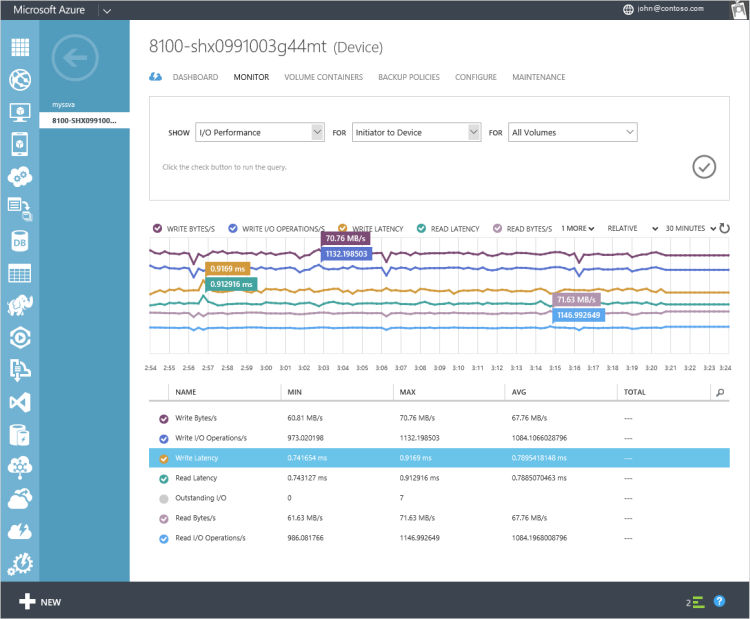

Die e/a-Vorgänge sind für den gleichen Gerät für die Daten aus dem Gerät in der Cloud für alle Container die Lautstärke gezeichnet. Auf diesem Gerät die Daten sind nur in der linearen Ebene und nichts in die Cloud verschüttet hat. Es gibt keine Lese-und Schreibzugriff Vorgänge Synchronisierung vom Gerät in der Cloud. Daher sind die Spitzen im Diagramm im Abstand von 5 Minuten, die der Häufigkeit entspricht, der Takt zwischen dem Gerät und dem Dienst aktiviert ist. 

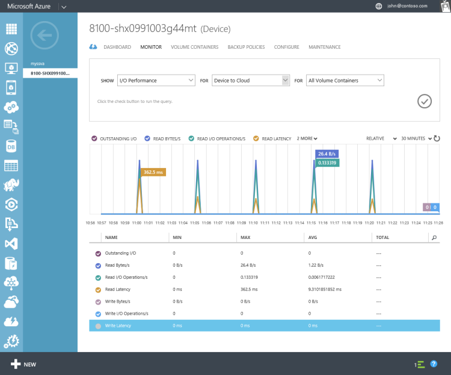

Für den gleichen Gerät wurde eine Momentaufnahme der Cloud für Datenmengen ab 2:00 Uhr geöffnet. In der Folge wurden Datenfluss vom Gerät in der Cloud. Lesen-Schreiben wurden in dieser Dauer in der Cloud served. Das EA-Diagramm zeigt einen Höchstwert in die verschiedenen Kriterien entspricht der Zeit, wenn die Momentaufnahme erstellt wurde. 

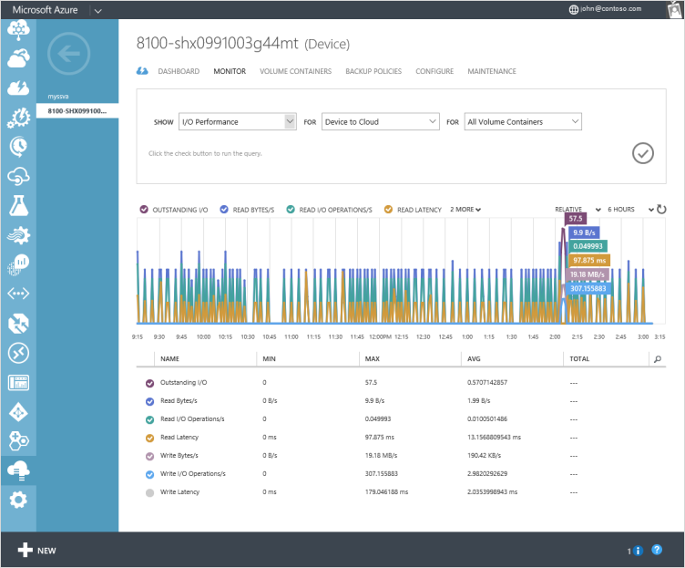

## Kapazität Auslastung 

**Auslastung** verfolgt Kennzahlen im Zusammenhang mit der Menge des Speicherplatzes von Daten, die durch die Datenmengen, Lautstärke Container oder Gerät verwendet wird. Sie können Berichte basierend auf der Auslastung des primären Speicher, Ihre Cloud-Speicher oder Ihrem Gerät Storage erstellen. Klicken Sie auf einen bestimmten Datenträger, einen bestimmten Lautstärke Container oder alle Volumen Container kann Kapazität Auslastung gemessen werden.

Die primäre, Cloud und Speicherkapazität Geräts kann wie folgt beschrieben werden:

###Nutzung der primären Speicher Kapazität
 
Diesen Diagrammtypen zeigen die Menge der Daten in StorSimple Datenmengen geschrieben, bevor die Daten deduplizierte und komprimiert ist. Sie können die Auslastung des primären Speichers durch alle Mengen oder für einen einzelnen Datenträger anzeigen.

Wenn Sie die primäre Speicher Lautstärke Kapazität Auslastung Diagramme für alle Datenträger im Vergleich zu jedem der einzelnen Datenträger anzeigen und Sie die primären Daten in beiden Fällen addieren, es möglicherweise ein Konflikt zwischen zwei Zahlen. Gesamten primären Daten auf alle Datenträger möglicherweise nicht die Summe der Summe der primären Daten der einzelnen Volumen addiert. Dies möglicherweise wegen einer der folgenden Aktionen aus:

- **Snapshotdaten enthalten, die für alle Datenträger**: nur, wenn Sie die Version früher als Update 3 ausgeführt werden, wird dieses Verhalten angezeigt. Primären Daten für alle Datenträger angezeigt wird, ist die Summe der primären Daten für jedes Volume und die Snapshotdaten. Primären Daten für ein bestimmtes Volume angezeigt, die nur die Menge von Daten, die auf dem Datenträger entspricht (und nicht die entsprechenden Volume Snapshotdaten enthält).

    Dies kann auch durch die folgende Gleichung erläutert werden:

    *Primäre Daten (alle Datenträger) = Summe (primäre Daten (Volume i) + Größe des Snapshotdaten (Volume i))*
    
    *WHERE, primären Daten (Volume i) Größe des primären Daten, die zum Volume i =*
 
    Wenn die Momentaufnahmen über den Dienst gelöscht werden, erfolgt der Löschvorgang asynchrone im Hintergrund. Es dauert einige Zeit für die Lautstärke Datengröße begonnen, das Löschen der Momentaufnahme aktualisiert werden. 

    Update 3 oder höher ausgeführt werden, ist die Momentaufnahme Daten nicht in die Lautstärke Daten enthalten. Und die primäre Auslastung wird wie folgt berechnet:

    * Primären Daten (alle Datenträger) = Summe (primärer Daten (Volume i)
    
    *WHERE, primären Daten (Volume i) Größe des primären Daten, die zum Volume i =*
 
- **Datenmengen mit Überwachung deaktiviert, die im Lieferumfang von allen Datenmengen**: Wenn Sie auf Ihrem Gerät Datenmengen für die Überwachung deaktiviert haben ist, die überwachen Daten für diese einzelne Datenträger wird nicht in den Diagrammen. Die Daten für alle Datenträger im Diagramm enthält jedoch die Datenmengen, die für die Überwachung deaktiviert ist. 
 
- **Gelöschte Datenmengen mit live zugeordneten Sicherungskopien für alle Datenträger enthalten**: Datenmengen, Snapshotdaten enthalten, werden gelöscht, aber die zugeordneten Momentaufnahmen noch vorhanden sind, und sehen Sie möglicherweise einen Konflikt.

- **Gelöschte Datenmengen für alle Datenträger enthalten**: alte Datenmengen möglicherweise In einigen Fällen vorhanden, obwohl diese gelöscht wurden. Der Effekt der Löschvorgang wird nicht angezeigt, und das Gerät möglicherweise unteren verfügbaren Kapazität anzeigen. Sie müssen wenden Sie sich an Microsoft Support, um diese Datenträger entfernen.

Die folgenden Diagramme anzeigen die primären Speicher Auslastung eines Geräts StorSimple vor und nach eine Momentaufnahme Cloud erstellt wurde. Wie hier einfach Datenmengen sollten eine Momentaufnahme der Cloud primären Speicher nicht ändern. Wie Sie sehen können, zeigt das Diagramm keinen Unterschied zwischen der primären Auslastung durch das Erstellen einer Momentaufnahme der Cloud. Der Cloud-Snapshot gestartet ungefähr 2:00 Uhr auf dem Gerät.

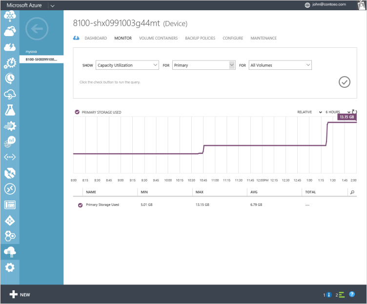

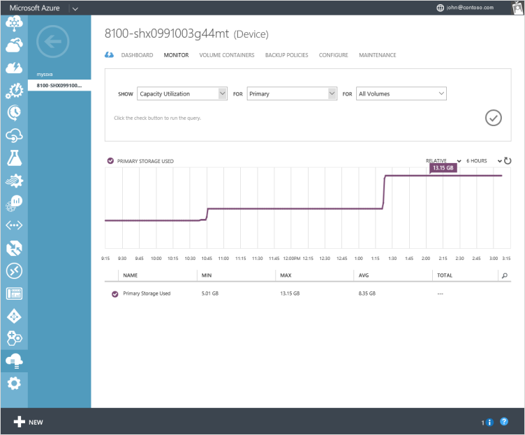

Wenn Sie ausführen Update 2 oder höher, Sie können Teile aufzuteilen Auslastung der primären Speicher durch eine einzelne Lautstärke, alle Datenträger, alle gestufte Datenmengen und alle lokal angeheftete Datenmengen wie unten dargestellt. Sie durch alle lokal angeheftete Mengen aufteilen, können Sie schnell zu ermitteln, wie viele der lokalen Stufe verbraucht ist.

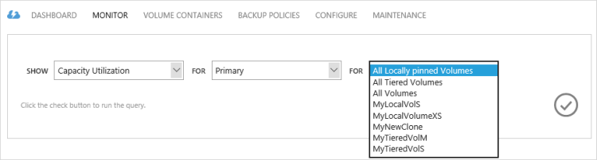

###Cloud-Speicher Auslastung

Diese Diagramme zeigen die an Cloud-Speicher verwendet. Diese Daten ist deduplizierte und komprimiert. Dieser Betrag umfasst Cloud Momentaufnahmen, die Daten enthalten möglicherweise nicht zur Verfügung beliebigen primären Datenträger angezeigt und legacy oder erforderlichen Aufbewahrung Zwecken gehalten ist. Können Sie die primäre vergleichen und cloud Verbrauchsdaten Speicher, um eine Vorstellung davon Rate Verringerung der Daten zu erhalten, obwohl die Anzahl nicht genau ist. Die folgenden Diagramme zeigen die Cloud-Speicher Auslastung eines Geräts StorSimple vor und nach eine Momentaufnahme Cloud erstellt wurde. Die Cloud Momentaufnahme Schritte bei ungefähr 2:00 Uhr auf dem Gerät, und sehen Sie die Nutzung der Cloud Kapazität Aufnahme von zur gleichen Zeit, zunehmender aus 5.73 MB auf ab Version 4.04 GB.

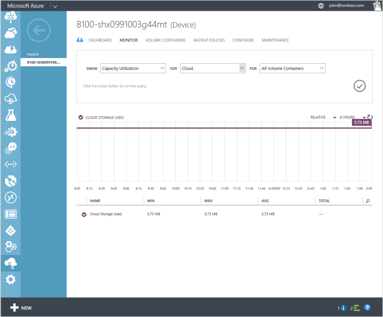

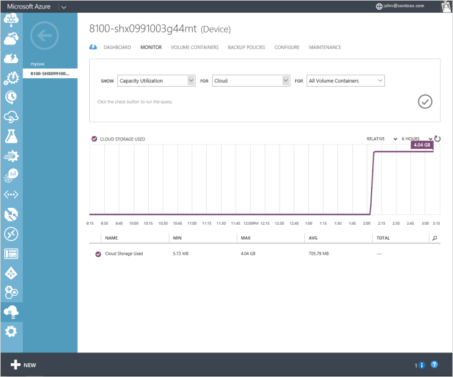

###Gerät Speicher Auslastung

Diese Fläche der gesamten Auslastung für das Gerät, das mehr als primärem Speicher Auslastung gestellt werden, da es die lineare SSD-Stufe umfasst. Diese Ebene enthält eine Datenmenge, die auch auf vorhanden ist das Gerät des anderen Ebenen. Die Kapazität in der linearen SSD-Ebene wird aus-und wieder eingeschaltet, dass beim neue Daten eingeht, die alten Daten verschoben werden, werden um die Festplatte Ebene (die jeweils es deduplizierte und komprimiert ist) und anschließend in der Cloud.

Im Laufe der Zeit werden primäre Auslastung und Auslastung Gerät wahrscheinlich zusammen erhöhen, bis die Daten beginnen, in der Cloud gestuft werden soll. An diesem Punkt beginnt die Gerät Auslastung wahrscheinlich zu Gleichgewichtsplateaus, aber die primäre Auslastung erhöht sich je mehr Daten geschrieben ist.

Die folgenden Diagramme anzeigen die primären Speicher Auslastung eines Geräts StorSimple vor und nach eine Momentaufnahme Cloud erstellt wurde. Der Cloud-Snapshot gestartet 2:00 Uhr und die Gerät Auslastung Schritte zu diesem Zeitpunkt verringern. Die Gerät Speicher Auslastung wurde nach unten von 11.58 GB auf 7.48 GB. Dies zeigt an, dass wahrscheinlich nicht komprimierten Daten in der linearen SSD Ebene wurde deduplizierte, komprimiert und in der Festplatte Ebene verschoben. Beachten Sie, dass, wenn das Gerät bereits über eine große Datenmenge in die SSD und die Festplatte Ebenen verfügt, dieser Rückgang Sie nicht sehen eventuell. In diesem Beispiel wurde das Gerät eine kleine Datenmenge.

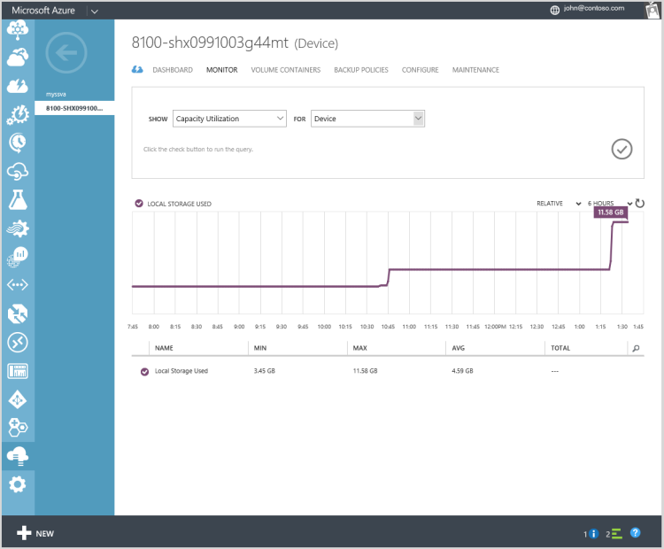

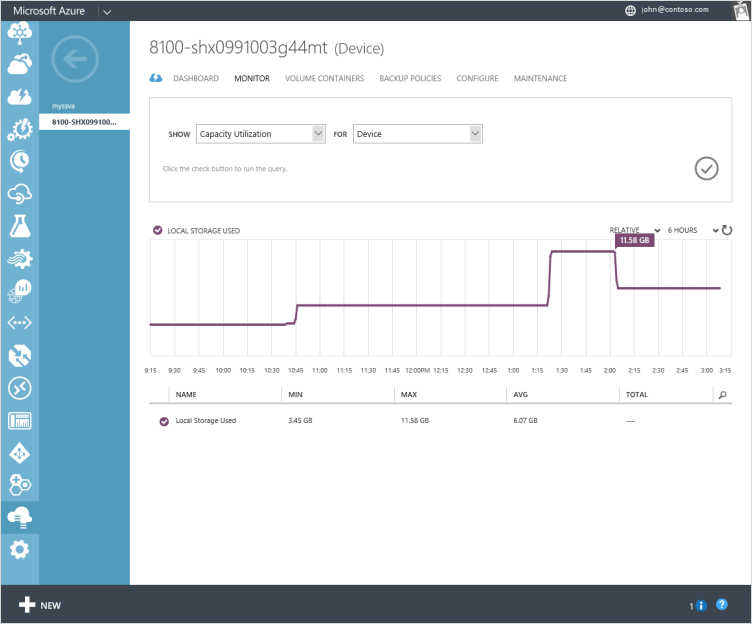

## Netzwerkdurchsatz

**Netzwerkdurchsatz** verfolgt Kennzahlen im Zusammenhang mit der Datenmenge, die von den iSCSI-Initiator Netzwerk-Schnittstellen übertragen, auf dem Hostserver und das Gerät und zwischen dem Gerät und der Cloud. Sie können diese Metrik für jede iSCSI-Netzwerk-Schnittstellen auf Ihrem Gerät überwachen.

Die folgenden Diagramme anzeigen der Netzwerkdurchsatz für die Daten 0 und die Daten 4, beide 1 Switch-Netzwerk-Schnittstellen auf Ihrem Gerät. In diesem Fall wurde Daten 0 Cloud-aktiviert, während die Daten 4 iSCSI aktiviert wurde. Sie können die eingehenden und ausgehenden Datenverkehr für Ihr Gerät StorSimple anzeigen. Die flache Linie im Diagramm, beginnend von 3:24 Uhr ist darauf was durch, dass wir nur 5 Minuten Daten zu sammeln und sollte ignoriert werden. 

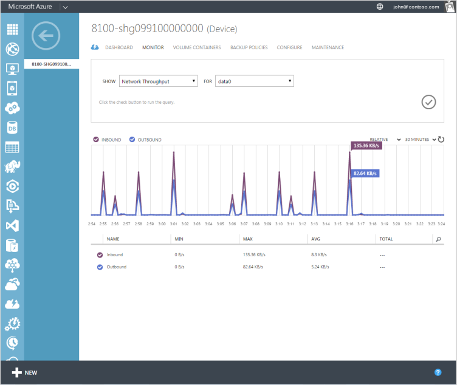

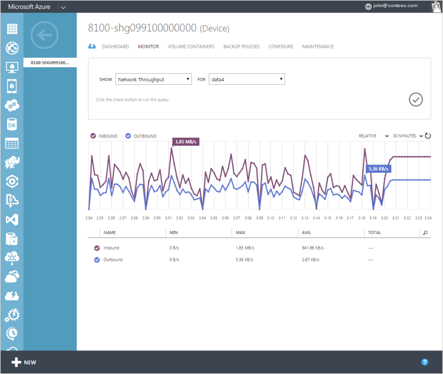

## Gerät Leistung 

**Gerät Leistung** verfolgt Kennzahlen im Zusammenhang mit der Leistung von Ihrem Gerät. Das folgende Diagramm zeigt die CPU-Auslastung Stats für ein Gerät in Betrieb.

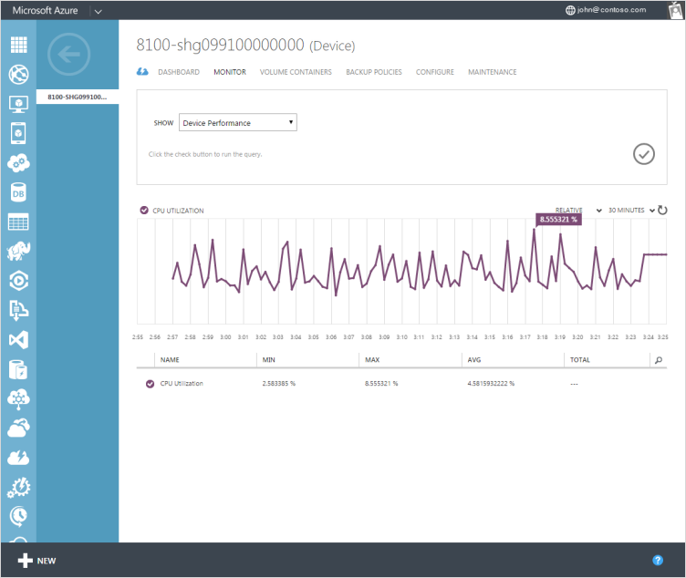

## Nächste Schritte

- Erfahren Sie, wie [das StorSimple Manager Service Gerät Dashboard verwendet](storsimple-device-dashboard.md).

- Erfahren Sie, wie der Dienst StorSimple Manager zum Verwalten von Ihrem Geräts StorSimple zu [verwenden](storsimple-manager-service-administration.md).
