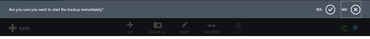
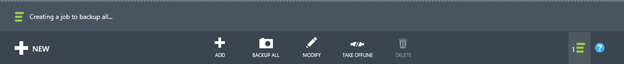
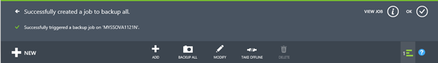
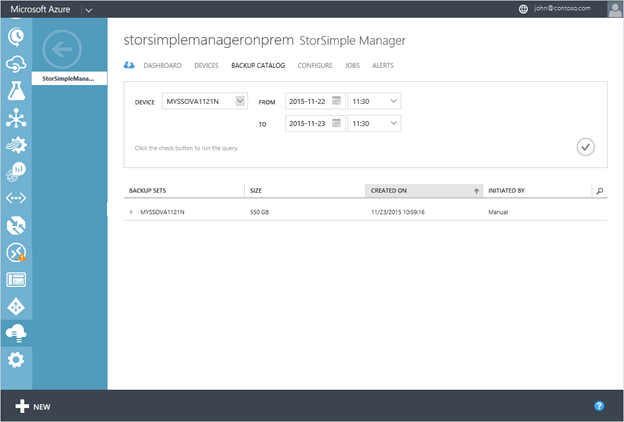

<properties 
   pageTitle="Zusätzliche Lernprogramm StorSimple Virtual Array | Microsoft Azure"
   description="Beschreibt, wie StorSimple Virtual Array Freigaben und Datenmengen sichern."
   services="storsimple"
   documentationCenter="NA"
   authors="alkohli"
   manager="carmonm"
   editor="" />
<tags 
   ms.service="storsimple"
   ms.devlang="NA"
   ms.topic="article"
   ms.tgt_pltfrm="NA"
   ms.workload="TBD"
   ms.date="06/07/2016"
   ms.author="alkohli" />

# Erstellen einer Sicherungskopie Ihrer StorSimple Virtual Array

## (Übersicht) 

In diesem Lernprogramm gilt für den Microsoft Azure StorSimple Virtual Array (auch bekannt als StorSimple lokalen virtuelles Gerät oder StorSimple virtuelles Gerät) laufenden März 2016 allgemeine Verfügbarkeit (GA) Version oder höhere Versionen.

Die StorSimple virtuelle Matrix ist ein Hybrid Cloud lokale virtuelle Speichergerät, die als eine Dateiserver oder einem iSCSI-Server konfiguriert werden kann. Sie können Sicherungskopien erstellen, aus einer Sicherung wiederherstellen und Geräte-Failover ausführen, wenn der Wiederherstellung erforderlich ist. Wenn als Dateiserver konfiguriert ist, kann auch auf Elementebene Wiederherstellung. In diesem Lernprogramm beschrieben, wie die klassischen Azure-Portal oder im Web StorSimple Benutzeroberfläche verwenden, um geplante und manuelle Sicherung Ihres StorSimple virtuelle Arrays zu erstellen.

## Sichern von Freigaben und Datenmengen

Sicherungskopien Point-in-Time-Schutz bereitzustellen, wiederherstellungsmöglichkeiten verbessern und Wiederherstellungszeiten für Freigaben und Datenmengen zu minimieren. Sie können Sichern einer Freigabe oder Volumen auf Ihrem Gerät StorSimple auf zwei Arten: **geplant** oder **manuell**. Die Methoden werden in den folgenden Abschnitten erläutert.

> [AZURE.NOTE] In dieser Version werden die geplante Sicherungskopien durch eine Standardrichtlinie erstellt, die zu einem bestimmten Zeitpunkt täglich ausgeführt wird und die Anteile oder Datenmengen auf dem Gerät sichert. Es ist nicht möglich, benutzerdefinierte Richtlinien für geplanten Sicherungskopien zu diesem Zeitpunkt zu erstellen.

## Ändern des Zeitplans Sicherung

Ihre StorSimple virtuelle Gerät verfügt über eine Sicherung Standardrichtlinie, die einem bestimmten Zeitpunkt des Tages (22:30) beginnt und sichert alle Freigaben oder Datenmengen auf dem Gerät einmal täglich. Sie können die Zeit ändern, an der der Sicherungsdatei gestartet wird, aber die Häufigkeit und die Aufbewahrung (die die Anzahl der Sicherungskopien beibehalten angibt) geändert werden können. Während diese Sicherungskopien wird das gesamte virtuelle Gerät gesichert; Daher wird empfohlen, dass Sie diese Sicherungskopien für Zeiten planen.

Führen Sie die folgenden Schritte im [Azure klassischen Portal](https://manage.windowsazure.com/) so ändern Sie die Sicherung Startzeit Standard aus.

#### So ändern Sie die Startzeit für die Sicherungsdatei Standardrichtlinie

1. Navigieren Sie zur Registerkarte **Konfiguration** Gerät.

2. Klicken Sie im Abschnitt **zusätzliche** Geben Sie die Startzeit für die tägliche Sicherung an.

3. Klicken Sie auf **Speichern**.

### Nehmen Sie eine manuelle Sicherung

Zusätzlich zu den geplanten Sicherungskopien können Sie einen manuellen (bei Bedarf) Sicherung zu einem beliebigen Zeitpunkt nutzen.

#### So erstellen eine manuelle Sicherung der (bei Bedarf)

1. Navigieren Sie zu der Registerkarte **Freigaben** oder **Datenmengen** .

2. Klicken Sie am unteren Rand der Seite auf **Alle sichern**. Sie werden aufgefordert werden, um sicherzustellen, dass Sie die Sicherung jetzt ausführen möchten. Klicken Sie auf das Symbol Kontrollkästchen  um die Sicherung fortzusetzen.

    

    Sie werden benachrichtigt, dass eine Sicherung gestartet wird.

    

    Sie werden benachrichtigt, dass der Auftrag erfolgreich erstellt wurde.

    

3. Um den Fortschritt des Projekts zu verfolgen, klicken Sie auf **Ansicht Position**.

4. Wenn das Sicherungsdatei Projekt abgeschlossen ist, wechseln Sie zur Registerkarte **Sicherungskatalog** . Sie sollten die Sicherungskopie der fertige angezeigt werden.

    

5. Die Auswahlmöglichkeiten Filter auf das entsprechende Gerät, Sicherung Richtlinie und Zeitraums festgelegt, und klicken Sie dann auf das Kontrollkästchen Symbol .

    Die Sicherung sollte in der Liste der Sätze Sicherung angezeigt werden, die im Katalog angezeigt wird.

## Anzeigen von vorhandenen Sicherungskopien

Führen Sie die folgenden Schritte aus, im klassischen Azure-Portal vorhandenen Sicherungskopien anzeigen.

#### Vorhandene Sicherungskopien anzeigen

1. Klicken Sie auf der Seite StorSimple Manager Dienst auf der Registerkarte **Sicherungskatalog** .

2. Wählen Sie eine Sicherungskopie, legen Sie wie folgt aus:

    1. Wählen Sie das Gerät aus.

    2. Wählen Sie in der Dropdownliste die Freigabe oder das Volume für die Sicherung, die Sie auswählen möchten.

    3. Geben Sie den Zeitraum an.

    4. Klicken Sie auf das Symbol Kontrollkästchen  zum Ausführen dieser Abfrage.

    Die Sicherungskopien zugeordnet die ausgewählte Freigabe oder Volumen sollte angezeigt werden, in der Liste der Sicherungsdatei Sätze.

 **Video verfügbar**

Schauen Sie sich das Video an, um anzuzeigen, wie Sie Freigaben erstellen, Freigaben sichern und Wiederherstellen von Daten auf ein StorSimple virtuelle Array können.

> [AZURE.VIDEO use-the-storsimple-virtual-array]

## Nächste Schritte

Weitere Informationen zum [Verwalten Ihrer StorSimple Virtual Array](storsimple-ova-web-ui-admin.md).
