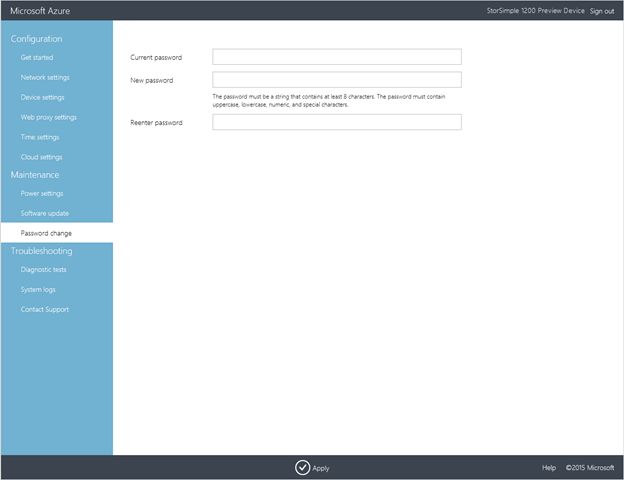
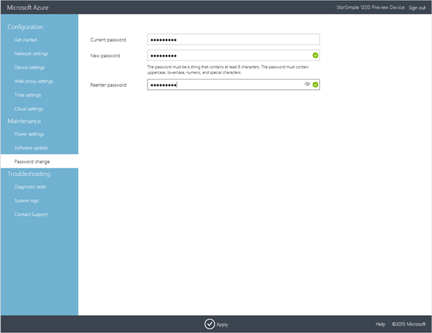

<properties 
   pageTitle="Ändern der StorSimple virtuelles Gerät Administratorkennworts | Microsoft Azure"
   description="Beschreibt, wie Sie entweder im klassischen Azure-Portal oder über das Web StorSimple Virtual Array Benutzeroberfläche das Gerät Administratorkennwort ändern."
   services="storsimple"
   documentationCenter="NA"
   authors="alkohli"
   manager="carmonm"
   editor="" />
<tags 
   ms.service="storsimple"
   ms.devlang="NA"
   ms.topic="article"
   ms.tgt_pltfrm="NA"
   ms.workload="TBD"
   ms.date="06/17/2016"
   ms.author="alkohli" />

# Ändern des StorSimple Virtual Array Gerät Administratorkennworts

## (Übersicht)

Wenn Sie die Windows PowerShell-Benutzeroberfläche Zugriff auf die StorSimple virtuelle Gerät verwenden, müssen Sie ein Gerät Administratorkennwort einzugeben. Wenn das Gerät StorSimple zuerst nach der Bereitstellung und gestartet wird, ist das standardmäßige Kennwort *Kennwort1*aus. Das standardmäßige Kennwort für die Sicherheit Ihrer Daten läuft ab, dass beim ersten, die Sie sich anmelden, und Sie müssen dieses Kennwort ändern.

Sie können auch entweder der lokalen Web-Benutzeroberfläche oder im klassischen Azure-Portal verwenden, so ändern Sie das Kennwort des Administrators zu einem beliebigen Zeitpunkt nach das Gerät in Ihrem Unternehmen bereitgestellt wird. Jede der folgenden Verfahren wird in diesem Artikel beschrieben.

## Verwenden Sie zum Ändern des Kennworts im klassische Azure-portal

Führen Sie die folgenden Schritte aus, um das Gerät Administratorkennwort über das Azure klassischen Portal ändern.

#### So ändern Sie das Kennwort für das Gerät Administrator über das klassische Azure-portal

1. Klicken Sie im Portal auf **Geräte** > **Konfiguration** für Ihr Gerät.

2. Führen Sie einen Bildlauf nach unten bis zum Abschnitt **Gerät Administratorkennwort** . Bereitstellen eines Administratorkennworts, das von 8 auf 15 Zeichen enthält. Das Kennwort muss eine Kombination aus Groß-, Kleinbuchstaben, numerischen und Sonderzeichen sein.

3. Bestätigen Sie das Kennwort ein.

4. Klicken Sie auf **Speichern** , am unteren Rand der Seite.

Das Gerät Administratorkennwort sollte jetzt aktualisiert werden. Dieses geänderte Kennwort können Sie das Gerät lokal zugreifen.

## Verwenden Sie das StorSimple Virtual Array Web-Benutzeroberfläche zum Ändern des Kennworts

Führen Sie die folgenden Schritte aus, um das Gerät Administratorkennwort über der lokalen Web-Benutzeroberfläche ändern.

#### So ändern Sie das Gerät Administratorkennwort über der lokalen Web-Benutzeroberfläche

1. Klicken Sie in der lokalen Web-Benutzeroberfläche, die auf **Wartung** > **Ändern des Kennworts** für Ihr Gerät.

    

2. Geben Sie das **aktuelle Kennwort**ein.

3. Geben Sie ein **Neues Kennwort**ein. Das Kennwort muss mindestens 8 Zeichen lang sein. Er muss 3, 4 der folgenden enthalten: Großbuchstaben, Kleinbuchstaben, numerischen und Sonderzeichen.

    Beachten Sie, dass Ihr Kennwort die letzte 24 Kennwörter identisch sein kann.

3. Geben Sie das Kennwort zur Bestätigung erneut ein.

    

4. Klicken Sie am unteren Rand der Seite auf **Übernehmen**. Das neue Kennwort wird dann angewendet werden. Wenn die Änderung des Kennworts nicht erfolgreich ist, wird den folgenden Fehler angezeigt.

    

    Nachdem das Kennwort erfolgreich aktualisiert wurde, werden Sie benachrichtigt. Dieses geänderte Kennwort können dann das Gerät lokal zugreifen.

## Nächste Schritte

Weitere Informationen zum [Verwalten Ihrer StorSimple Virtual Array](storsimple-ova-web-ui-admin.md).
