<properties 
   pageTitle="Konfigurieren von MPIO auf Ihrem StorSimple virtuelle Array Host | Microsoft Azure"
   description="Beschreibt, wie e/a-Multipfad-für Ihre StorSimple konfigurieren virtuelle Matrix mit einem Host unter Windows Server 2012 R2 verbunden."
   services="storsimple"
   documentationCenter=""
   authors="alkohli"
   manager="carmonm"
   editor="" />
<tags 
   ms.service="storsimple"
   ms.devlang="NA"
   ms.topic="article"
   ms.tgt_pltfrm="NA"
   ms.workload="NA"
   ms.date="10/04/2016"
   ms.author="alkohli" />

# Konfigurieren Sie mehrere Pfade e/a auf Windows Server-Host für die virtuelle StorSimple Array

## (Übersicht)

Dieser Artikel beschreibt, wie mehrere Pfade e/a-Funktion (MPIO) auf Ihrem Windows Server Host installieren, bestimmte Konfiguration Einstellungen für nur StorSimple Datenmengen angewendet und dann MPIO für StorSimple Datenmengen überprüfen. Das Verfahren setzt voraus, dass Ihre StorSimple 1200 Virtual Array mit zwei Netzwerkschnittstellen mit einem Windows Server-Host mit zwei Netzwerkschnittstellen verbunden ist. Die in diesem Artikel enthaltene Informationen gilt nur für die virtuelle Matrix. Informationen StorSimple 8000 Reihe Geräte wechseln Sie zu [Konfigurieren MPIO für StorSimple Host](storsimple-configure-mpio-windows-server.md). 

Die MPIO-Features in Windows Server hilft erstellen hoch verfügbare und Fehlertoleranz Speicherkonfigurationen. MPIO verwendet redundante physische Pfadkomponenten – Netzwerkadapter, Kabel und Schalter – um logische Pfade zwischen dem Server und dem Speichergerät zu erstellen. Wenn eine Komponente Fehler auftritt, verursacht einen logischen Pfad fehlschlägt, verwendet Multipathing Logik einen alternativen Pfad für e/a, damit Applikationen weiterhin auf ihre Daten zugreifen können. Darüber hinaus kann je nach Konfiguration, MPIO auch Leistung verbessern, indem Sie erneut die Last über alle diese Pfade. Weitere Informationen finden Sie unter [Übersicht MPIO](https://technet.microsoft.com/library/cc725907.aspx "MPIO Übersicht und Features").  

Konfigurieren Sie die hohe Verfügbarkeit Ihrer Lösung StorSimple MPIO auf den Windows Server-Hosts bei einer Verbindung zu Ihrem StorSimple 1200 virtuelle Array (auch bekannt als lokale virtuelle Gerät) ein. Die Hostserver tolerieren können dann einen Link, Netzwerk- oder Benutzeroberflächen-Fehler. 

Sie müssen führen Sie die folgenden Schritte aus, um MPIO zu konfigurieren: 

- Voraussetzungen für die Konfiguration

- Schritt 1: Installieren MPIO auf dem Windows Server-host

- Schritt 2: Konfigurieren von MPIO für StorSimple Datenmengen

- Schritt 3: Bereitstellen StorSimple Datenmengen auf dem host

Die oben aufgeführten Schritte werden in den folgenden Abschnitten erläutert.

## Erforderliche Komponenten

In diesem Abschnitt werden die Konfiguration erforderlichen Komponenten für die Windows Server-Server und Ihre virtuelle Array.

### Klicken Sie auf Windows Server-host

-  Stellen Sie sicher, dass Ihre Windows Server-Host 2 Netzwerkschnittstellen aktiviert ist.

### Klicken Sie auf virtuellen StorSimple-Matrix

- Die virtuelle Matrix sollte als iSCSI-Server konfiguriert werden. Weitere Informationen finden Sie unter [Einrichten von virtuellen Array als iSCSI-Server](storsimple-ova-deploy3-iscsi-setup.md). Klicken Sie auf die Matrix sollte eine oder mehrere Netzwerkschnittstellen aktiviert sein.   

- Die Netzwerk-Schnittstellen Ihre virtuelle Array sollte aus dem Windows Server-Host erreichbar sein.

- Ein oder mehrere Datenträger sollte auf Ihrem StorSimple virtuelle Array erstellt werden. Weitere Informationen finden Sie unter [Hinzufügen eines Datenträgers](storsimple-ova-deploy3-iscsi-setup.md#step-3-add-a-volume) auf Ihrem StorSimple 1200 virtuelle Array. In diesem Verfahren haben wir 3 Datenmengen (2 lokal angeheftete und 1 gestufte Volume siehe unten) klicken Sie auf die virtuelle Matrix erstellt.
    
    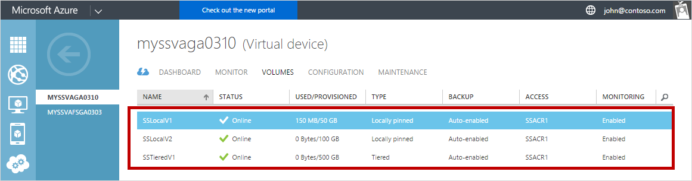

### Hardwarekonfiguration für virtuelle StorSimple-Matrix

Die folgende Abbildung zeigt die Hardwarekonfiguration hohen Verfügbarkeit und den Lastenausgleich Multipathing für Ihre Windows Server-Host und StorSimple virtuelle Array in diesem Verfahren verwendet wird.  

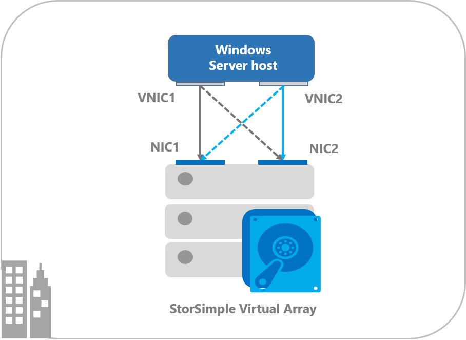

Wie in der vorherigen Abbildung dargestellt:

- Ihre virtuelle StorSimple-Matrix nach der Bereitstellung auf Hyper-V ist ein Gerät der einzelnen Knoten aktiv als iSCSI-Server konfiguriert.

- Zwei virtuelle Netzwerkschnittstellen werden auf Ihrem Array aktiviert. In der lokalen Web-Benutzeroberfläche Ihres 1200 virtuelle Arrays stellen Sie sicher, dass zwei Netzwerkschnittstellen aktiviert sind, indem Sie navigieren zu **Deren Einstellungen im Netzwerk** , wie unten dargestellt:

    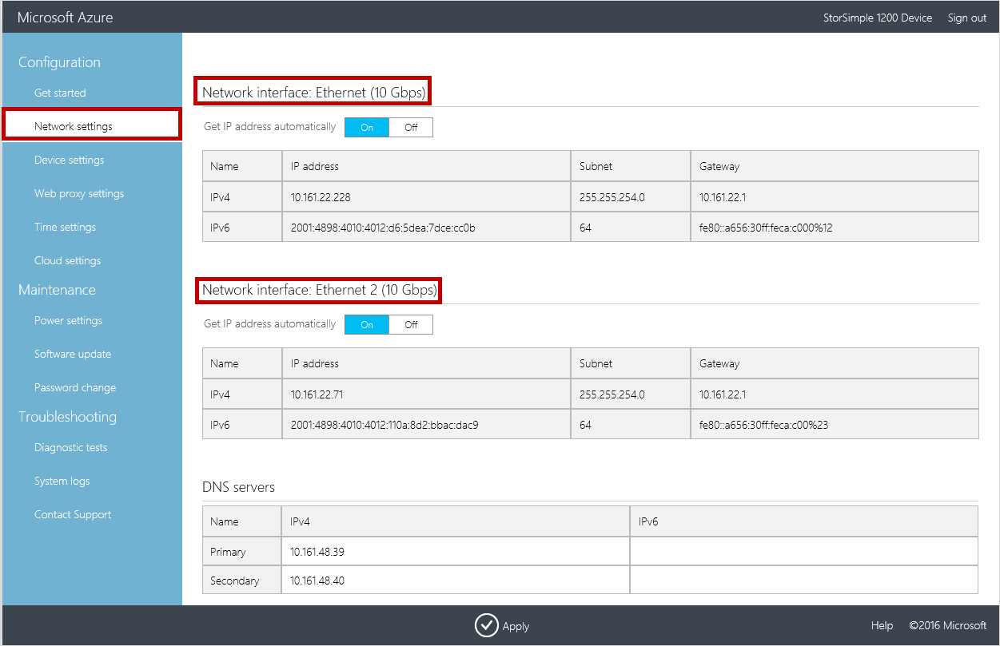
    
    Beachten Sie die IPv4-Adressen der aktivierten Netzwerkschnittstellen (Ethernet, Ethernet 2 standardmäßig) und zur späteren Verwendung auf dem Host speichern.

- Zwei Netzwerkschnittstellen werden auf Ihrem Windows Server-Host aktiviert. Wenn die verbundenen Schnittstellen für Host und Array im selben Subnetz sind, werden klicken Sie dann es 4 Pfade verfügbar sein. Dies wurde der Groß-/Kleinschreibung in diesem Verfahren aus. Jedoch, wenn jede Netzwerkschnittstelle auf der Benutzeroberfläche Array- und Host in einem anderen IP-Subnetz (und nicht geroutet) sind, klicken Sie dann nur 2-Wege stehen zur Verfügung.

## Schritt 1: Installieren MPIO auf dem Windows Server-host

MPIO ist ein optionales Feature unter Windows Server und ist standardmäßig nicht installiert. Es sollte als ein Feature über den Server-Manager installiert werden. Gehen Sie folgendermaßen vor, um dieses Feature auf Ihrem Windows Server-Host zu installieren.

[AZURE.INCLUDE [storsimple-install-mpio-windows-server-host](../../includes/storsimple-install-mpio-windows-server-host.md)]

## Schritt 2: Konfigurieren von MPIO für StorSimple Datenmengen

MPIO muss konfiguriert sein, um StorSimple Datenmengen zu identifizieren. Führen Sie die folgenden Schritte aus, um konfigurieren MPIO um StorSimple Datenmengen erkannt.

[AZURE.INCLUDE [storsimple-configure-mpio-volumes](../../includes/storsimple-configure-mpio-volumes.md)]

## Schritt 3: Bereitstellen StorSimple Datenmengen auf dem host

Nach MPIO unter Windows Server konfiguriert ist, Datenträger erstellt haben, klicken Sie auf die Matrix StorSimple können bereitgestellt werden, und klicken Sie dann nutzen können von MPIO Redundanzgründen. Führen Sie die folgenden Schritte aus, um ein Volume bereitzustellen.

#### Bereitstellen von Datenmengen auf dem host

1. Öffnen Sie das Fenster **iSCSI Initiatoreigenschaften** auf dem Host von Windows Server. Klicken Sie auf **Server-Manager > Dashboards > Tools > iSCSI Initiator**.
2. Klicken Sie im Dialogfeld **iSCSI-Initiatoreigenschaften** klicken Sie auf die Registerkarte Discovery, und klicken Sie dann auf **Ziel-Portal ermitteln**.
3. Klicken Sie im Dialogfeld **Ermitteln Target Portal** folgendermaßen Sie vor:
    
    - Geben Sie die IP-Adresse der ersten aktiviert Netzwerkschnittstelle auf Ihrem StorSimple virtuelle Array. Standardmäßig wäre dies **Ethernet**. 
    - Klicken Sie auf **OK** , um das Dialogfeld **iSCSI Initiatoreigenschaften** zurückzukehren.

    >[AZURE.IMPORTANT] **Wenn Sie ein privates Netzwerk für iSCSI-Verbindungen verwenden, geben Sie die IP-Adresse des Ports Daten, die mit dem privaten Netzwerk verbunden ist.**

4. Wiederholen Sie die Schritte 2 und 3 für einen zweiten Netzwerkadapter (beispielsweise Ethernet 2) in der Matrix. 

5. Wählen Sie die Registerkarte **Ziele** in das Dialogfeld **iSCSI Initiatoreigenschaften** aus. Für Ihre virtuelle Array sollte der Oberfläche der einzelnen Volume als Ziel unter **Erkannte Ziele**angezeigt werden. In diesem Fall würde drei Ziele (entspricht drei Datenmengen) erkannt werden.

    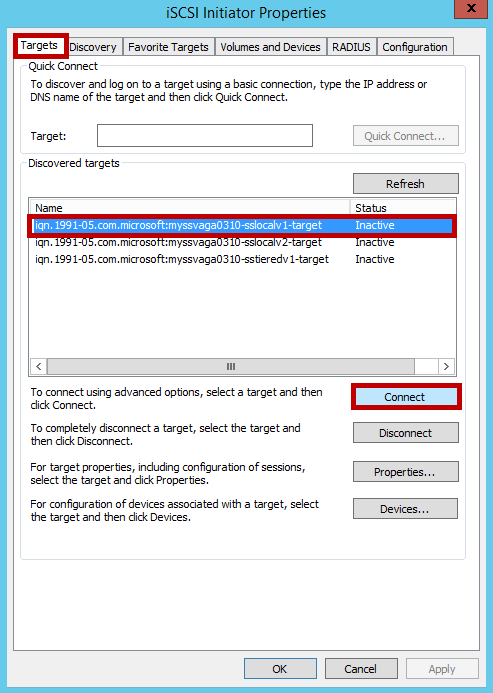

6. Klicken Sie auf **Verbinden** , um eine iSCSI-Sitzung mit der Matrix StorSimple herzustellen. Klicken Sie im Dialogfeld **Verbindung herstellen mit Ziel** wird angezeigt. Aktivieren Sie das Kontrollkästchen **Aktivieren mit mehreren Pfad** ein. Klicken Sie auf **Erweitert**.

    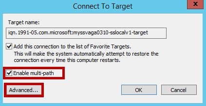

8. Klicken Sie im Dialogfeld **Erweiterte Einstellungen** folgendermaßen Sie vor:                                       
    -    Wählen Sie in der Dropdown-Liste **Lokale Netzwerkadapter** **Microsoft iSCSI Initiator**ein.
    -    Wählen Sie in der Dropdown-Liste **Initiator IP** die IP-Adresse des Hosts ein.
    -    Wählen Sie auf die Dropdownliste **Target Portal** IP-die IP-Adresse des Array-Benutzeroberfläche ein.
    -    Klicken Sie auf **OK** , um das Dialogfeld **iSCSI Initiatoreigenschaften** zurückzukehren.

    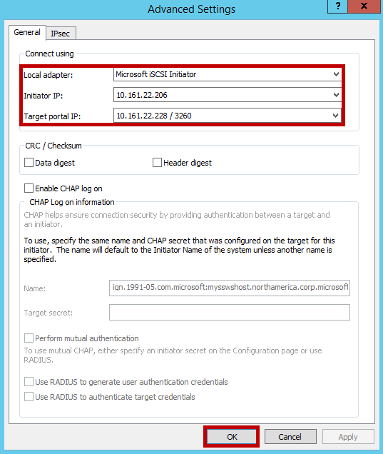

9. Klicken Sie auf **Eigenschaften**. 

    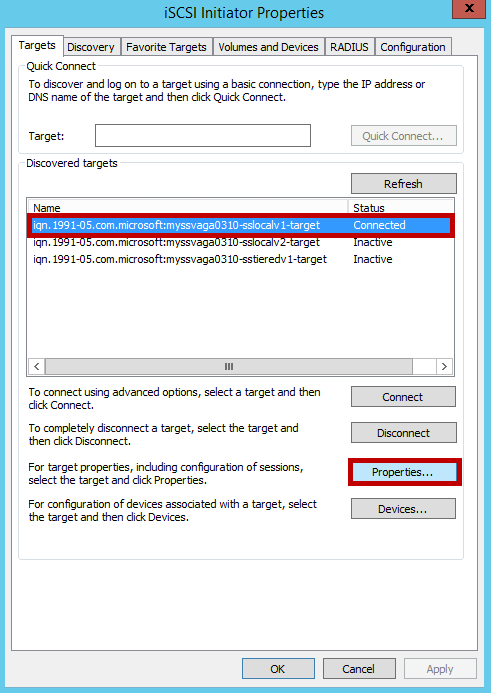
10. Klicken Sie im Dialogfeld **Eigenschaften** auf **Sitzung hinzufügen**.

    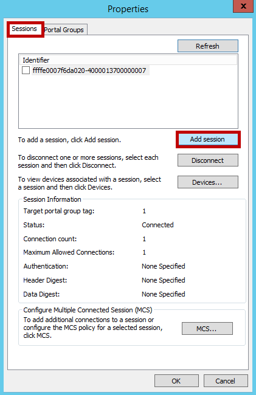

10. Wählen Sie im Dialogfeld **Verbindung herstellen mit Ziel** das Kontrollkästchen **multi-Path aktivieren** aus. Klicken Sie auf **Erweitert**.
11. Klicken Sie im Dialogfeld **Erweiterte Einstellungen** :                                        
    -  Wählen Sie in der Dropdown-Liste **lokale Netzwerkadapter** Microsoft iSCSI Initiator ein.
    -  Wählen Sie in der Dropdown-Liste **Initiator IP** die IP-Adresse, den Host entspricht. In diesem Fall sind Sie zwei Netzwerk-Schnittstellen des Arrays zu einem einzelnen Netzwerkschnittstelle auf dem Host eine Verbindung herstellen. Daher ist diese Schnittstelle entspricht, die für die erste Sitzung bereitgestellt.
    -  Wählen Sie in der Dropdown-Liste **Ziel Portal IP** die IP-Adresse für die zweite Schnittstelle auf die Matrix aktiviert.
    -  Klicken Sie auf **OK** , um das Dialogfeld iSCSI-Initiatoreigenschaften zurückzukehren. Sie haben eine zweite Sitzung an die Zielwebsite hinzugefügt.

        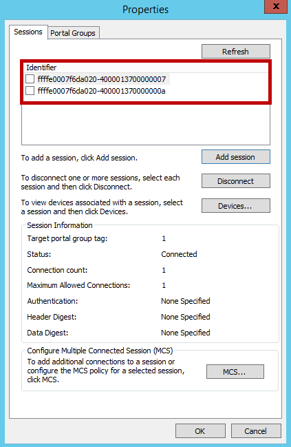

    - Nach dem Hinzufügen der gewünschten Sitzungen (Pfade), klicken Sie im Dialogfeld **iSCSI-Initiatoreigenschaften** , wählen Sie das Ziel, und klicken Sie auf **Eigenschaften**. Beachten Sie auf der Registerkarte Sitzungen im Dialogfeld **Eigenschaften** die vier Sitzung Bezeichnern, die die möglichen Pfad Permutationen entsprechen. Zum Stornieren einer Sitzung aktivieren Sie das Kontrollkästchen neben einer Sitzung Bezeichner enthält, und klicken Sie dann auf **Trennen**.
 
    - Um in Sitzungen präsentiert Geräte anzeigen möchten, wählen Sie die Registerkarte **Geräte** . Klicken Sie auf **MPIO**, um die Richtlinie MPIO für eine ausgewählte Gerät zu konfigurieren. Die **
    -  Details** Dialogfeld wird angezeigt. Klicken Sie auf die **MPIO** Registerkarte, Sie können die entsprechenden auswählen **Lastausgleichsrichtlinie** Einstellungen. Sie können auch Anzeigen der **aktiv** oder **Standby ** Pfadtyp.

10. Wiederholen Sie die Schritte 8-11 so das Ziel zusätzliche Sitzungen (Pfade) hinzu. Mit zwei Schnittstellen auf dem Host und zwei auf dem virtuelle Array können Sie insgesamt vier Sitzungen für jedes Ziel hinzufügen. 

    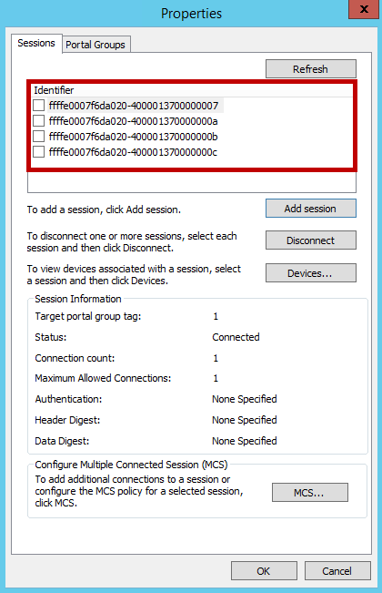

11. Sie benötigen, wiederholen Sie diese Schritte für jedes Volume (Flächen als Ziel).

    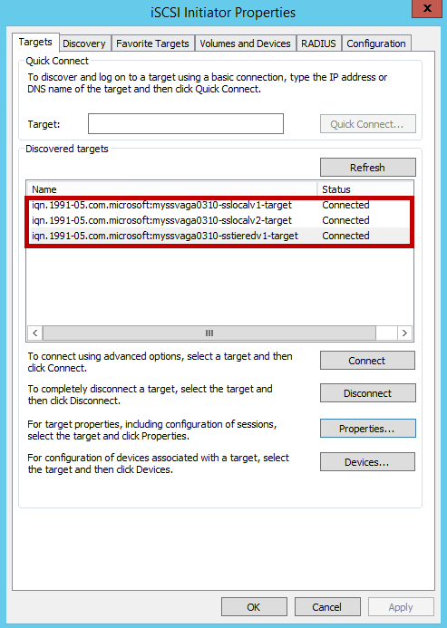

12. **Computer Management** durch Navigieren zum Öffnen **Server-Manager > Dashboards > Computer Management**. Klicken Sie im linken Bereich auf **Speicher > Datenträger Verwaltung**. Der Datenträger auf dem StorSimple virtuelle Array erstellt, die für diesen Host sichtbar sind wird als neue Datenträger unter **Datenträger Verwaltung** angezeigt.

13. Initialisierung des Datenträgers, und erstellen Sie einen neuen Datenträger. Wählen Sie beim im Format einer Zuordnungseinheit (AUS) von 64 KB sein. Wiederholen Sie den Vorgang für alle verfügbaren Datenträger aus.

    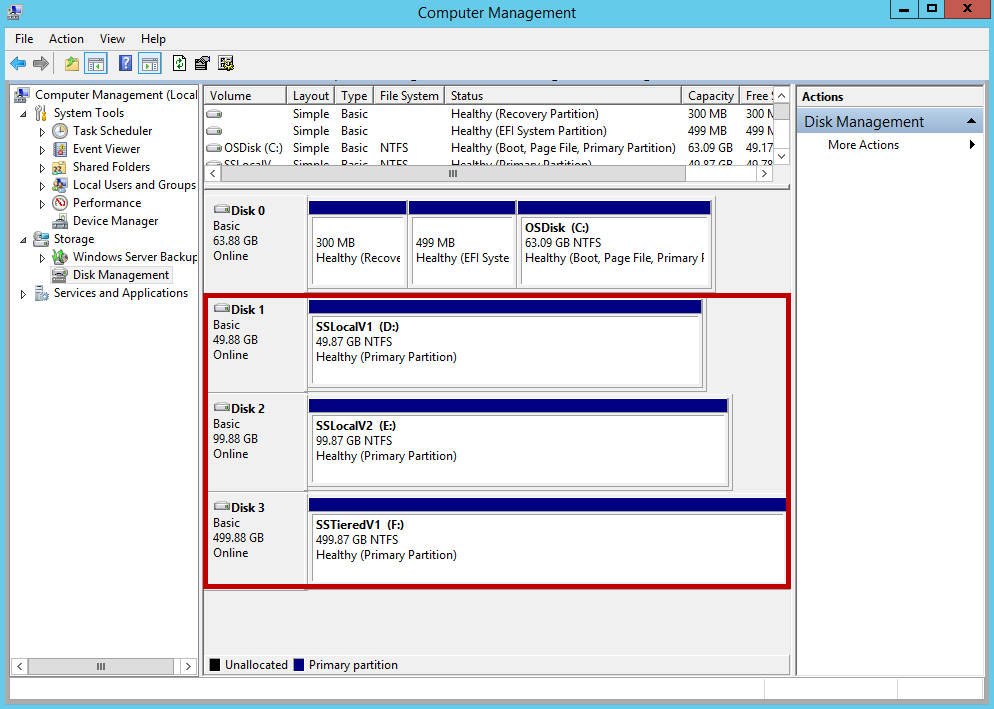

14. Klicken Sie unter **Datenträger Verwaltung**mit der rechten Maustaste in den **Datenträger** , und wählen Sie **Eigenschaften**aus.

15. Klicken Sie auf der Registerkarte **MPIO** , klicken Sie im Dialogfeld **Eigenschaften Multi-Path** .

    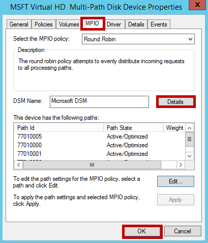

16. Im Abschnitt **DSM Name** klicken Sie auf **Details** , und stellen Sie sicher, dass die Parameter auf die standardmäßigen Parameter festgelegt werden. Die standardmäßigen Parameter sind:

    - Pfad überprüfen Periode = 30
    - Anzahl der Wiederholungsversuche = 3
    - Wechsel zu entfernen (Kuponperiode) = 20
    - Wiederholen Sie Intervall = 1
    - Überprüfen Sie den Pfad aktiviert = nicht aktiviert.

    >[AZURE.NOTE] **Ändern Sie die standardmäßigen Parameter nicht.**

## Nächste Schritte

Weitere Informationen zum [Verwenden des Diensts StorSimple Manager zum Verwalten Ihrer StorSimple Virtual Array](storsimple-ova-manager-service-administration.md).
 
