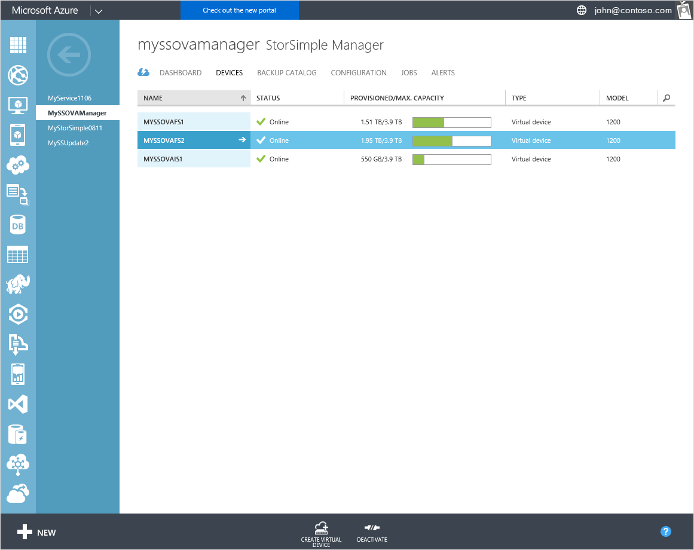
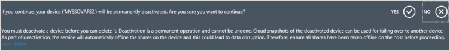
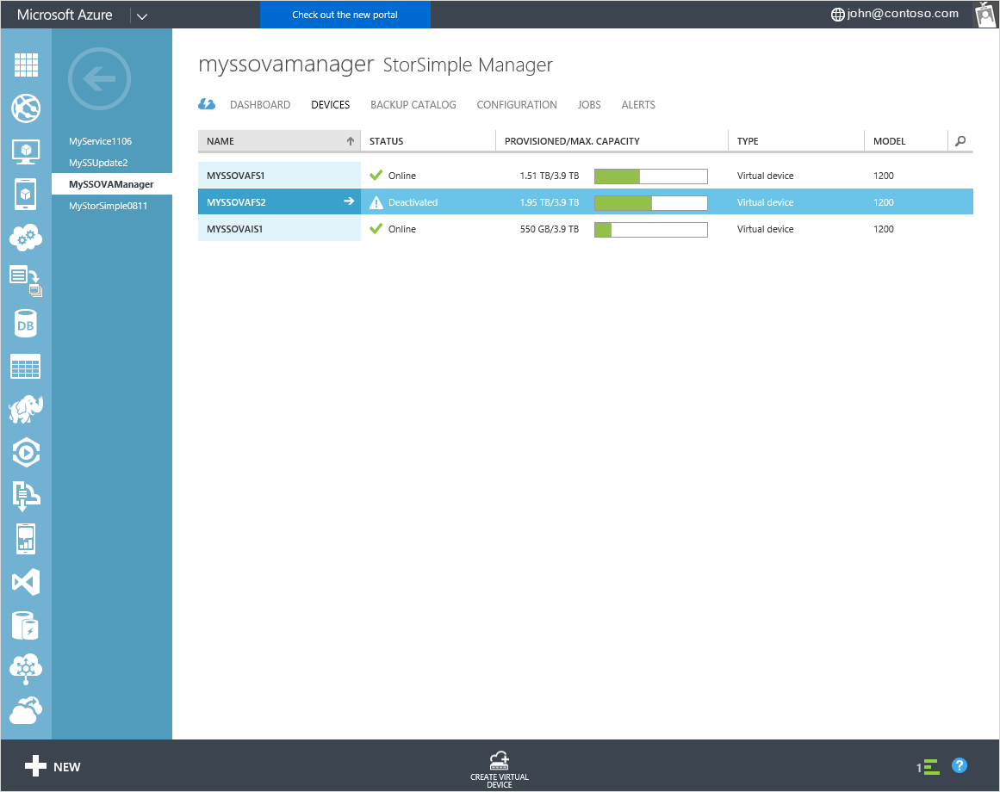
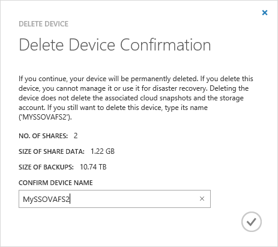
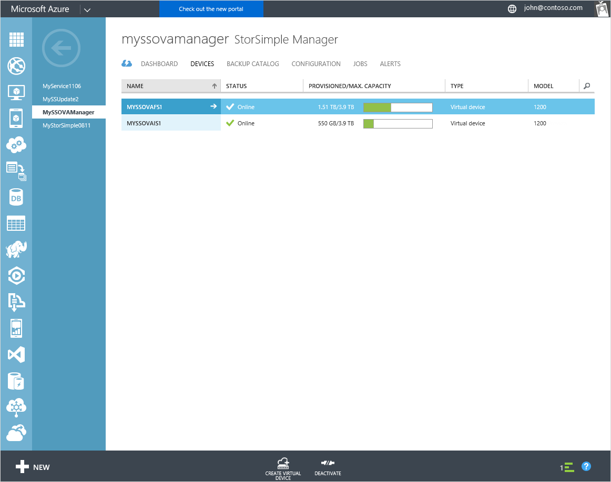

<properties 
   pageTitle="Deaktivieren und löschen Sie ein StorSimple virtuelle Array | Microsoft Azure"
   description="Beschreibt, wie Sie StorSimple Gerät aus Dienst entfernen, indem zunächst deaktivieren und dann löschen."
   services="storsimple"
   documentationCenter=""
   authors="alkohli"
   manager="carmonm"
   editor="" />
<tags 
   ms.service="storsimple"
   ms.devlang="na"
   ms.topic="article"
   ms.tgt_pltfrm="na"
   ms.workload="na"
   ms.date="06/20/2016"
   ms.author="alkohli" />

# Deaktivieren Sie und löschen Sie eine virtuelle StorSimple-Matrix

## (Übersicht)

Wenn Sie ein StorSimple virtuelle Array deaktiviert haben, trennt Sie die Verbindung zwischen dem Gerät und dem entsprechenden StorSimple Manager-Dienst. Deaktivierung ist ein endgültiger Vorgang und kann nicht rückgängig gemacht werden. Eine deaktivierte Geräte kann nicht mit dem Dienst StorSimple Manager erneut registriert werden.

Möglicherweise müssen Sie deaktiviert haben, und löschen Sie ein StorSimple virtuelles Gerät in den folgenden Szenarien:

- Ihr Gerät online ist, und Planen Sie über dieses Gerät fehlschlägt. Möglicherweise müssen Sie vorgehen, wenn Sie beabsichtigen, auf ein größeres Gerät zu aktualisieren. Nachdem die Gerätedaten übertragen, und das Failover abgeschlossen ist, können Sie dann das Gerät löschen.

- Ihr Gerät ist offline, und Planen Sie über dieses Gerät fehlschlägt. Möglicherweise bei einem Ausfall der Fall, in dem aufgrund von einem Ausfall im Datencenter, des primären Geräts nach unten ist. Planen Sie über das Gerät mit einem sekundären Gerät fehlschlägt. Nachdem die Gerätedaten übertragen, und das Failover abgeschlossen ist, können Sie das Gerät löschen.

- Sie möchten die außer Betrieb setzen das Gerät, und löschen Sie ihn. 
 

Wenn Sie ein Gerät deaktiviert haben, werden alle Daten, die lokal gespeichert wurde nicht mehr zugegriffen werden. Nur die Daten in der Cloud gespeichert sind, können wiederhergestellt werden. Wenn Sie beabsichtigen, nach der Deaktivierung die Gerätedaten zu behalten, sollte dann eine Momentaufnahme Cloud all Ihrer Daten, bevor Sie ein Gerät deaktiviert haben. Dies können Sie alle Daten zu einem späteren Zeitpunkt wiederherstellen.

In diesem Lernprogramm wird erläutert, wie Sie:

- Deaktivieren Sie ein Gerät 
- Löschen eines deaktivierten Geräts

## Deaktivieren Sie ein Gerät

Führen Sie die folgenden Schritte aus, um Ihr Gerät zu deaktivieren.

#### So deaktivieren Sie das Gerät   

1. Wechseln Sie zur Seite **Geräte** . Wählen Sie das Gerät, das Sie deaktivieren möchten.

    

3. Klicken Sie am unteren Rand der Seite auf **Deaktivieren**.

    

4. Es wird eine bestätigungsmeldung angezeigt. Klicken Sie auf **Ja,** um den Vorgang fortzusetzen. 

    

    Startet der Prozess deaktivieren und ein paar Minuten dauern.

    

3. Nach der Deaktivierung wird die Liste der Geräte aktualisiert werden. 

    

    Jetzt können Sie dieses Gerät löschen. 

## Löschen Sie das Gerät

Ein Gerät muss zuerst deaktiviert werden, um sie zu löschen. Löschen ein Gerät entfernt aus der Liste der mit dem Dienst verbundenen Geräte. Der Dienst können Sie nicht mehr das gelöschte Gerät verwalten. Das Gerät zugeordneten Daten bleiben jedoch in der Cloud. Achten Sie darauf, dass diese Daten dann Gebühren fällig werden. 

Führen Sie die folgenden Schritte aus, um das Gerät zu löschen:

#### So löschen Sie das Gerät 

 1. Wählen Sie auf der Seite Dienst **Geräte** StorSimple Manager ein deaktivierte Gerät, das Sie löschen möchten.

    

 2. Klicken Sie unten auf der Seite die auf **Löschen**.
 
    

 3. Sie werden zur Bestätigung aufgefordert werden. Geben Sie den Gerätenamen, Gerät Löschvorgang zu bestätigen. Beachten Sie, dass das Gerät löschen nicht zugeordneten Gerät Cloud Daten löschen. Klicken Sie auf das Symbol Kontrollkästchen, um den Vorgang fortzusetzen.
 
     

 5. Für das Gerät zu löschenden einige Minuten dauern. 

    

    Nachdem das Gerät gelöscht wird, wird die Liste der Geräte aktualisiert werden.

    

## Nächste Schritte

- Weitere Informationen zum Verwenden des StorSimple Manager-Diensts finden Sie unter der StorSimple-Manager-Dienst zum Verwalten Ihrer StorSimple Virtual Array zu [verwenden](storsimple-ova-manager-service-administration.md). 