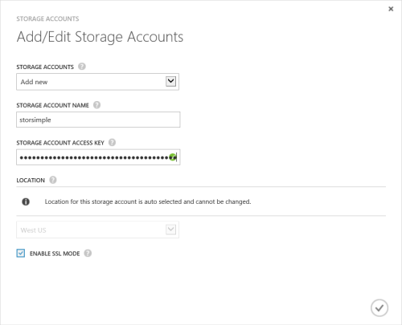

<properties
   pageTitle="Bereitstellen von StorSimple Virtual Array 1 - Portals Vorbereitung"
   description="Erste Lernprogramm StorSimple bereitstellen virtuelles Array umfasst Vorbereiten des Portals"
   services="storsimple"
   documentationCenter="NA"
   authors="alkohli"
   manager="carmonm"
   editor=""/>

<tags
   ms.service="storsimple"
   ms.devlang="NA"
   ms.topic="article"
   ms.tgt_pltfrm="NA"
   ms.workload="NA"
   ms.date="05/24/2016"
   ms.author="alkohli"/>

# Bereitstellen von StorSimple virtuellen Array: Vorbereiten des Portals

## (Übersicht)

In diesem Artikel gilt für Microsoft Azure StorSimple Virtual Array (auch bekannt als StorSimple lokalen virtuelles Gerät oder StorSimple virtuelles Gerät) laufenden März 2016 allgemeine Verfügbarkeit (GA) Freigabe. Dies ist der erste Artikel in die Reihe der Bereitstellungslernprogramme erforderlich, um Ihre virtuelle Array vollständig als eine Dateiserver oder einem iSCSI-Server bereitstellen. In diesem Artikel werden die Vorbereitung zum Erstellen und Konfigurieren von Ihrem Dienst StorSimple Manager vor der Bereitstellung virtuellen Arrays erforderlich. In diesem Artikel links auch um eine Checkliste für die Bereitstellung sowie die Konfiguration erforderliche Komponenten.

Sie benötigen Administratorrechte, um die Installation und Konfiguration abzuschließen. Es empfiehlt sich, dass Sie die Konfiguration der Bereitstellung – Checkliste überprüfen, bevor Sie beginnen. Im Portal Vorbereitung dauert weniger als 10 Minuten.

Die Informationen in diesem Artikel veröffentlicht gilt für die Bereitstellung von StorSimple virtuelle Matrizen in Azure klassischen Portal ebenso wie Microsoft Azure Government Cloud.

### Erste Schritte

Der Bereitstellungsworkflow besteht aus Vorbereiten des Portals, virtuelles Array in einer virtualisierten Umgebung bereitgestellt und das Setup abschließen. Um mit der Bereitstellung StorSimple Virtual Array als eine Dateiserver oder einem iSCSI-Server zu beginnen, müssen Sie finden Sie in den folgenden aus tabulierten Ressourcen (Artikeln und Videos).

#### Bereitstellung von Artikeln

Schlagen Sie in den folgenden Artikeln in der vorgegebenen Reihenfolge Ihrer StorSimple Virtual Array bereitstellen.

| **#** | **In diesem Schritt**                          | **In diesem Fall wird...**                                                         | **Verwenden Sie diese Dokumente.**|
|------|-------------------------------------------|--------------------------------------------------------------------------------|------------------------|
|1.   | **Einrichten des klassischen Azure-Portals**       | Erstellen und Konfigurieren von Ihrem Dienst StorSimple Manager vor der Bereitstellung eines StorSimple virtuellen Geräts.  |[Vorbereiten des Portals](storsimple-ova-deploy1-portal-prep.md)|
|2.   | **Bereitstellen des Virtual Array**           | Bereitstellung von Hyper-V und Verbinden mit einem StorSimple virtuelle Gerät auf einem Hostsystem Hyper-V für Windows Server 2012 R2, Windows Server 2012 oder Windows Server 2008 R2 ausgeführt.       Bereitstellung von VMware und Verbinden mit einem StorSimple lokalen virtuellen Gerät auf einem Hostsystem mit VMware ESXi 5.5 und höher.  | [Bereitstellen eines virtuellen Arrays in Hyper-V](storsimple-ova-deploy2-provision-hyperv.md)       [Bereitstellen eines virtuellen Arrays in VMware](storsimple-ova-deploy2-provision-vmware.md)|
|3.    | **Einrichten des Virtual Array**              | Für den Dateiserver ersteinrichtung ausführen, Ihr StorSimple Dateiserver registrieren, und das Gerät-Setup abschließen. Dann können Sie die SMB-Freigaben bereitstellen.       Für Ihre iSCSI-Server ersteinrichtung ausführen, Ihre StorSimple iSCSI-Server registrieren, und das Gerät-Setup abschließen. Dann können Sie iSCSI Datenmengen bereitstellen.| [Einrichten von virtuellen Array als Dateiserver](storsimple-ova-deploy3-fs-setup.md)     [Einrichten von virtuellen Array als iSCSI-server](storsimple-ova-deploy3-iscsi-setup.md)|

#### Bereitstellung von videos

| **Um dieses Schritts...** |  **Schauen Sie sich dieses Video an.**|
|----------------|-------------|
| Eine schrittweise Anleitung Einstieg in die virtuelle StorSimple-Matrix. | [Erste Schritte mit der virtuellen StorSimple-Matrix](https://azure.microsoft.com/documentation/videos/get-started-with-the-storsimple-virtual-array/)|
| Eine schrittweise Anleitung StorSimple virtuelles Array in Hyper-V nicht bereitstellen.|[Erstellen Sie eine virtuelle StorSimple-Matrix](https://azure.microsoft.com/documentation/videos/create-a-storsimple-virtual-array/) |
|Eine schrittweise Anleitung zum Konfigurieren und registrieren StorSimple virtuelles Array|[StorSimple virtuelles Array konfigurieren](https://azure.microsoft.com/documentation/videos/configure-a-storsimple-virtual-array/)|
|Eine schrittweise Anleitung zum Erstellen von Freigaben, Freigaben sichern und Wiederherstellen von Daten auf StorSimple virtuelles Array als Dateiserver konfiguriert|[Verwenden Sie das StorSimple virtuelle Array](https://azure.microsoft.com/documentation/videos/use-the-storsimple-virtual-array/)|
|Eine schrittweise Anleitung zum Failover und Disaster Wiederherstellung eines Arrays virtuellen StorSimple|[StorSimple virtuelle Array Wiederherstellung](https://azure.microsoft.com/documentation/videos/storsimple-virtual-array-disaster-recovery/)

Sie können jetzt beginnen, die klassischen Azure-Portal einrichten.

## Checkliste für die

Die Konfiguration Checkliste beschreibt die Informationen, die Sie benötigen, sammeln, bevor Sie die Software auf Ihrem Gerät StorSimple konfigurieren. Vorbereiten der diese Informationen im Voraus hilft bei den Prozess der Bereitstellung des StorSimple Geräts in Ihrer Umgebung zu optimieren. Je nachdem, ob Ihre StorSimple virtuelle Gerät als eine Dateiserver oder einem iSCSI-Server bereitgestellt werden soll, werden die folgenden Checklisten benötigen werden.

-   Laden Sie die [StorSimple Virtual Array Datei Checkliste für die Server](http://download.microsoft.com/download/E/E/6/EE690BB0-B442-4B84-8165-4731EE727ACF/MicrosoftAzureStorSimpleVirtualArrayFileServerConfigurationChecklist.pdf)an.

-   Laden Sie die [StorSimple Virtual Array iSCSI Server-Konfigurations-Checkliste](http://download.microsoft.com/download/E/E/6/EE690BB0-B442-4B84-8165-4731EE727ACF/MicrosoftAzureStorSimpleVirtualArrayiSCSIServerConfigurationChecklist.pdf)ein.

## Erforderliche Komponenten

Hier finden Sie die Konfiguration erforderlichen Komponenten für Ihre StorSimple-Manager-Dienst, der StorSimple virtuelles Gerät und im Netzwerk Datacenter.

### Für den Dienst StorSimple-Manager

Bevor Sie beginnen, stellen Sie Folgendes sicher:

-   Sie müssen mit Anmeldeinformationen für den Zugriff auf Ihr Microsoft-Konto.

-   Sie haben Ihre Microsoft Azure-Speicher-Konto mit Anmeldeinformationen für den Zugriff.

-   Ihr Abonnement Microsoft Azure sollte für StorSimple-Manager-Dienst aktiviert sein.

### Für das virtuelle StorSimple-Gerät

Bevor Sie ein virtuelles Gerät bereitstellen, stellen Sie Folgendes sicher:

-   Sie haben Zugriff auf eine Host-System mit Hyper-V unter Windows Server 2008 R2 oder höher oder VMware (ESXi 5,5 oder höher), die kann eine bereitstellen ein Gerät verwendet.

-   Das Hostsystem kann, die folgenden Ressourcen zur Bereitstellung von Ihrem Geräts virtuellen reserviert sein soll:

    -   Mindestens 4 Kernen.

    -   Mindestens 8 GB RAM.

    -   Benutzeroberfläche in einem Netzwerk.

    -   500 GB virtuelles Laufwerk für Systemdaten.

### Für das Netzwerk datacenter

Bevor Sie beginnen, stellen Sie Folgendes sicher:

-   Das Netzwerk in Ihrem Datencenter ist gemäß den Netzwerken Anforderungen für Ihr Gerät StorSimple konfiguriert. Weitere Informationen finden Sie unter der [StorSimple virtuelle Array Systemanforderungen](storsimple-ova-system-requirements.md).

-   Ihre StorSimple virtuelle Gerät verfügt über eine dedizierte 5/s Internetbandbreite (oder mehr) jederzeit zur Verfügung stehen. Diese Bandbreite sollte nicht für jede andere Anwendung freigegeben werden.

## Schrittweise Vorbereitung

Verwenden Sie die folgenden Schritte, um Ihr Portal für den Dienst StorSimple Manager vorbereiten.

## Schritt 1: Erstellen eines neuen Dienstes

Eine einzelne Instanz des Diensts StorSimple Manager kann mehrere StorSimple 1200 Geräte verwalten. Führen Sie die folgenden Schritte aus, um eine neue Instanz des Diensts StorSimple Manager zu erstellen. Wenn Sie einen vorhandenen StorSimple Manager-Dienst zum Verwalten Ihrer 1200 Geräte haben, überspringen Sie diesen Schritt, und wechseln Sie zu [Schritt 2: Abrufen der Dienst Registrierungsschlüssel](#step-2-get-the-service-registration-key).

[AZURE.INCLUDE [storsimple-ova-create-new-service](../../includes/storsimple-ova-create-new-service.md)]

> [AZURE.IMPORTANT]
>
> Wenn Sie die automatische Erstellung eines Speicher-Kontos mit Ihrem Dienst nicht aktiviert haben, müssen Sie mindestens ein Speicherkonto zu erstellen, nachdem Sie einen Dienst erfolgreich erstellt haben.
>

> - Wenn Sie ein Speicherkonto nicht automatisch erstellt haben, wechseln Sie ausführliche Anweisungen zum [Konfigurieren eines neuen Speicherkonto für den Dienst](#optional-step-configure-a-new-storage-account-for-the-service) .
>

> - Wenn Sie die automatische Erstellung eines Kontos Speicher aktiviert haben, wechseln Sie zu [Schritt2: Abrufen der Dienst Registrierungsschlüssel](#step-2-get-the-service-registration-key).

## Schritt 2: Abrufen der Dienst Registrierungsschlüssel

Nachdem der StorSimple Manager-Dienst ausgeführt wird, müssen Sie den Dienst Registrierungsschlüssel abrufen. Dieser Schlüssel wird verwendet, um zu registrieren, und verbinden Sie Ihr Gerät StorSimple mit dem Dienst.

Führen Sie die folgenden Schritte aus, im [Azure klassischen Portal](https://manage.windowsazure.com/).

[AZURE.INCLUDE [storsimple-ova-get-service-registration-key](../../includes/storsimple-ova-get-service-registration-key.md)]

> [AZURE.NOTE]
>
> Der Dienst Registrierungsschlüssel wird verwendet, um die alle StorSimple Manager Geräte registrieren, die mit Ihrem Dienst StorSimple Manager registrieren müssen.

## Schritt 3: Laden Sie das Bild virtuelles Gerät

Nachdem Sie den Dienst Registrierungsschlüssel haben, müssen Sie das entsprechende virtuelle Gerät-Bild, um eine virtuelle Gerät auf Ihrem Hostsystem bereitstellen herunterladen. Virtuelles Geräteabbilder: das Betriebssystem von bestimmter sind und von der Seite Schnellstart im klassischen Azure-Portal heruntergeladen werden können.

> [AZURE.IMPORTANT] Die Software für das StorSimple virtuelle Array ausgeführt kann nur in Verbindung mit der Storsimple Manager-Dienst verwendet werden.

Führen Sie die folgenden Schritte aus, im [Azure klassischen Portal](https://manage.windowsazure.com/).

#### Mit dem Bild virtuelles Gerät wird

1.  Klicken Sie auf der Seite **StorSimple Manager-Dienst** auf den Dienst, den Sie erstellt haben. Dadurch gelangen Sie zur Seite **Schnellstart** . (Sie können klicken Sie auf das Symbol Schnellstart  auf die Seite **Schnellstart** zu einem beliebigen Zeitpunkt zuzugreifen.)

1.  Klicken Sie auf den Link zu dem Bild, das Sie vom Microsoft Download Center herunterladen möchten entspricht. Die Bilddateien sind ungefähr 4,8 GB.

    -   VHDX für Hyper-V auf Windows Server 2012 und höher

    -   Virtuelle Festplatte für Hyper-V unter Windows Server 2008 R2 und höher

    -   VMDK für VMWare ESXi 5.5 und höher

2.  Herunterladen Sie, und Entzippen Sie die Datei auf einem lokalen Laufwerk, wodurch Notieren Sie sich die extrahiert Datei befindet.

 **Video verfügbar**

Schauen Sie sich das Video, um eine schrittweise Anleitung Einstieg in die virtuelle StorSimple-Matrix.

> [AZURE.VIDEO get-started-with-the-storsimple-virtual-array]

## Optional Schritt: Konfigurieren eines neuen Speicher-Kontos für den Dienst

Dies ist ein optionaler Schritt, der nur, wenn Sie die automatische Erstellung eines Speicher-Kontos mit Ihrem Dienst nicht aktiviert haben ausgeführt werden soll.

Wenn Sie ein Konto Azure-Speicher in einem anderen Bereich erstellen müssen, finden Sie unter [So erstellen Sie ein Speicherkonto](storage-create-storage-account.md#create-a-storage-account) eine schrittweise Anleitung.

Führen Sie die folgenden Schritte [Azure klassischen Portal](https://manage.windowsazure.com/) auf der Seite StorSimple Manager zum Hinzufügen eines vorhandenen Microsoft Azure-Speicher-Kontos ein.

#### Hinzufügen ein Kontos Speicher

1.  Klicken Sie auf der Startseite StorSimple Manager-Dienst wählen Sie den Dienst, und doppelklicken Sie darauf. Dadurch gelangen Sie zur Seite **Schnellstart** . Wählen Sie die Seite **Konfigurieren** .

2.  Klicken Sie auf **Add/Edit Speicher-Konto**. Klicken Sie im Dialogfeld **Add/Edit Speicherkonto** folgendermaßen Sie vor:

    1.  Klicken Sie auf **neue hinzufügen**.

    1.  Geben Sie einen Namen für Ihr Speicherkonto ein.

    1.  Angeben der primäre **Zugriffstaste** für Ihr Microsoft Azure-Speicher-Konto an.

    1.  Wählen Sie **aktivieren SSL-Modus** , um einen sicheren Kanal für die Kommunikation zwischen Ihrem Gerät und der Cloud erstellen aus. Deaktivieren Sie das Kontrollkästchen **aktivieren SSL-Modus** nur, wenn Sie in eine private Cloud arbeiten.

    1.  Klicken Sie auf das Symbol Kontrollkästchen . Sie werden benachrichtigt, nachdem das Speicherkonto erfolgreich erstellt wurde.

        

1.  Das Speicherkonto neu erstellten wird auf der Seite **Konfigurieren** , klicken Sie unter **Speicherkonten**angezeigt. Klicken Sie auf **Speichern** , um das Konto neu erstellten Speicherplatz zu speichern. Klicken Sie auf **OK** , wenn Sie zur Bestätigung aufgefordert werden.

## Als Nächstes

Im nächsten Schritt wird beim Bereitstellen eines virtuellen Computers für Ihre StorSimple virtuelles Gerät. Je nach Hostbetriebssystem finden Sie unter den detaillierten Anweisungen in:

-   [Bereitstellung von StorSimple virtuelles Array in Hyper-V](storsimple-ova-deploy2-provision-hyperv.md)

-   [Bereitstellung von StorSimple virtuelles Array in VMware](storsimple-ova-deploy2-provision-vmware.md)
