<properties
   pageTitle="Bereitstellen von StorSimple Virtual Array - Bereitstellen von Hyper-V"
   description="Zweite Lernprogramm in StorSimple Virtual Array Bereitstellung umfasst ein virtuelles Hyper-V-Gerät bereitgestellt."
   services="storsimple"
   documentationCenter="NA"
   authors="alkohli"
   manager="carmonm"
   editor=""/>

<tags
   ms.service="storsimple"
   ms.devlang="NA"
   ms.topic="article"
   ms.tgt_pltfrm="NA"
   ms.workload="NA"
   ms.date="10/11/2016"
   ms.author="alkohli"/>

# Bereitstellen von StorSimple Virtual Array – Bereitstellung von virtuelles Array in Hyper-V

## (Übersicht)

In diesem Lernprogramm provisioning gilt für Microsoft Azure StorSimple virtuelle Arrays (auch bekannt als StorSimple lokalen virtuellen Geräten oder virtuelle Geräte StorSimple) laufenden März 2016 allgemeine Verfügbarkeit (GA) Freigabe. In diesem Lernprogramm beschrieben, wie ein StorSimple virtuelle Array auf einem Hostsystem mit Hyper-V auf Windows Server 2012 R2, Windows Server 2012 oder Windows Server 2008 R2 bereitstellen. In diesem Artikel gilt für die Bereitstellung von StorSimple virtuelle Matrizen in Azure klassischen Portal ebenso wie Microsoft Azure Government Cloud.

Sie benötigen Administratorrechte bereitstellen und Konfigurieren von einem virtuellen Gerät. Die Bereitstellung und anfängliche Einrichtung kann ungefähr 10 Minuten dauern.

## Voraussetzungen für Bereitstellung

Hier finden Sie die erforderlichen Komponenten über ein virtuelle Gerät auf einem Hostsystem mit Hyper-V auf Windows Server 2012 R2, Windows Server 2012 oder Windows Server 2008 R2 bereit.

### Für den Dienst StorSimple-Manager

Bevor Sie beginnen, stellen Sie Folgendes sicher:

-   Alle Schritte unter [Vorbereiten im Portal für StorSimple Virtual Array](storsimple-ova-deploy1-portal-prep.md)abgeschlossen haben.

-   Sie haben das Bild virtuelles Gerät für Hyper-V vom Azure-Portal heruntergeladen. Weitere Informationen finden Sie unter [Schritt 3: Laden Sie das Bild virtuelles Gerät](storsimple-ova-deploy1-portal-prep.md#step-3-download-the-virtual-device-image).

    > [AZURE.IMPORTANT] Die Software für das StorSimple virtuelle Array ausgeführt kann nur in Verbindung mit der Storsimple Manager-Dienst verwendet werden.

### Für das virtuelle StorSimple-Gerät

Bevor Sie ein virtuelles Gerät bereitstellen, stellen Sie Folgendes sicher:

-   Sie haben Zugriff auf einem Host-System mit Hyper-V unter Windows Server 2008 R2 oder höher, die kann eine bereitstellen ein Gerät verwendet.

-   Das Hostsystem kann, die folgenden Ressourcen zur Bereitstellung von Ihrem Geräts virtuellen reserviert sein soll:

    -   Mindestens 4 Kernen.

    -   Mindestens 8 GB RAM.

    -   Benutzeroberfläche in einem Netzwerk.

    -   500 GB virtuelles Laufwerk für Systemdaten.

### Für das Netzwerk im Datencenter

Bevor Sie beginnen, überprüfen Sie die Netzwerken Anforderungen StorSimple virtuelles Gerät bereitstellen und das Datacenter Netzwerk ordnungsgemäß konfigurieren. Weitere Informationen finden Sie unter [StorSimple Virtual Array Netzwerke Anforderungen](storsimple-ova-system-requirements.md#networking-requirements).

## Schrittweise Bereitstellung

Um die Bereitstellung von und Verbinden mit einem virtuellen Gerät, müssen Sie die folgenden Schritte ausführen:

1.  Stellen Sie sicher, dass das Host-System ausreichende Ressourcen, um den minimalen virtuelles Gerät zu erfüllen hat.

2.  Bereitstellung von einem virtuellen Gerät in Ihrem Hypervisor.

3.  Starten Sie das virtuelle Gerät, und die IP-Adresse.

Jeder dieser Schritte wird in den folgenden Abschnitten erklärt.

## Schritt 1: Sicherzustellen Sie, dass das Host-System minimalen virtuelles Gerät erfüllt

Um ein virtuelles Gerät zu erstellen, müssen Sie:

-   Die Hyper-V-Rolle auf einem Windows Server 2012 R2, Windows Server 2012 oder Windows Server 2008 R2 SP1 installiert.

-   Microsoft Hyper-V-Manager auf einem Microsoft Windows-Client, mit dem Host verbunden.

Sie müssen sicherstellen, dass die zugrunde liegenden Hardware (Host-System), auf der Sie das virtuelle Gerät erstellen die folgenden Ressourcen für Ihre virtuelle Gerät reserviert sein soll kann:

- Mindestens 4 Kernen.
- Mindestens 8 GB RAM.
- Benutzeroberfläche in einem Netzwerk.
- 500 GB virtuelles Laufwerk für Systemdaten.

## Schritt 2: Bereitstellen eines virtuellen Hypervisor-Geräts

Führen Sie die folgenden Schritte aus, um ein Gerät in der Hypervisor bereit.

#### Bereitstellen von einem virtuellen Gerät

1.  Kopieren Sie auf Ihrem Windows Server-Host das Bild virtuelles Gerät auf einem lokalen Laufwerk ein. Dies ist das Bild (virtuelle Festplatte oder VHDX), das Sie über das Azure Portal heruntergeladen haben. Notieren Sie den Speicherort, in dem Sie das Bild kopiert, wie Sie diese später in der Prozedur verwendet werden.

2.  **Server-Manager**zu öffnen. Klicken Sie in der oberen rechten Ecke klicken Sie auf **Extras** , und wählen Sie **Hyper-V-Manager**.

    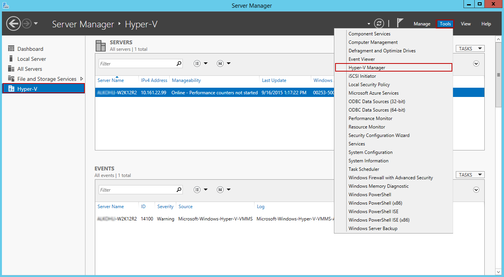

    Wenn Sie Windows Server 2008 R2 ausgeführt werden, öffnen Sie den Hyper-V-Manager. Klicken Sie im Server-Manager auf **Rollen > Hyper-V > Hyper-V-Manager**.

1.  **Hyper-V-Manager**, klicken Sie im Bereich mit der rechten Maustaste in Ihrem System-Knotens, um das Kontextmenü zu öffnen, und klicken Sie dann auf **neu** > **virtuellen Computers**.

    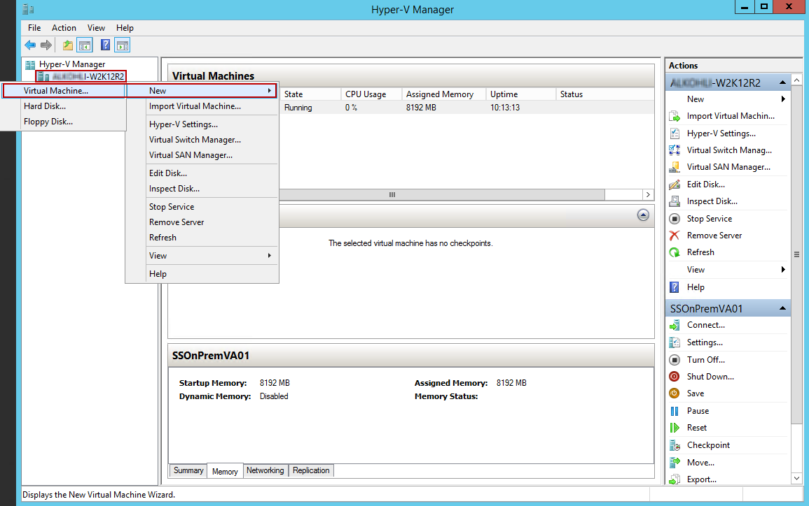

1.  Klicken Sie auf der Seite **Vorbemerkung** des neuen virtuellen Computern-Assistenten auf **Weiter**.

1.  Geben Sie einen **Namen** für Ihr Gerät virtuelle, klicken Sie auf der Seite **angeben Namen und einen Speicherort** . Klicken Sie auf **Weiter**.

    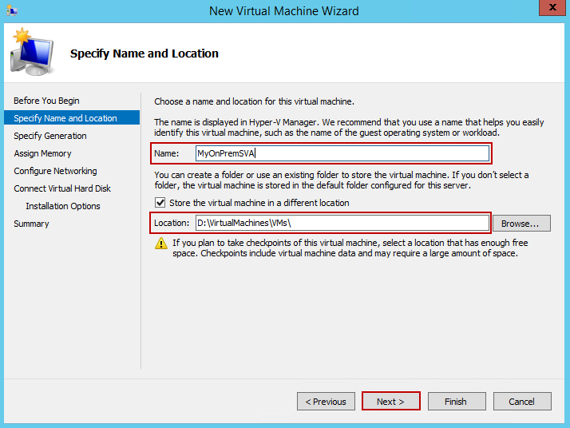

1.  Klicken Sie auf der Seite **Angeben der zweiten Generation** wählen Sie den Typ des Geräts Bild aus, und klicken Sie dann auf **Weiter**. Diese Seite nicht angezeigt wird, wenn Sie Windows Server 2008 R2 verwenden.

    * Wählen Sie die **Generation 2** , wenn Sie ein Bild .vhdx für Windows Server 2012 oder höher heruntergeladen haben.
    * Wählen Sie die **Generation 1** , wenn Sie ein VHD-Abbild für Windows Server 2008 R2 oder höher heruntergeladen haben.

    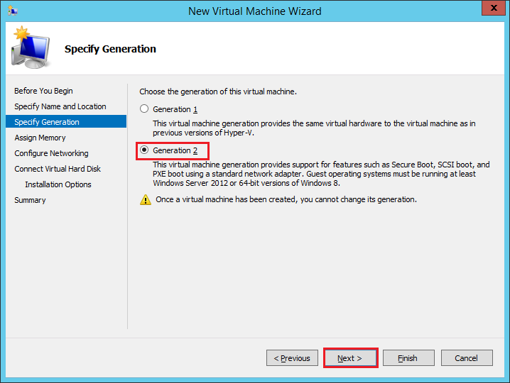

1.  Geben Sie auf der Seite **zuweisen Arbeitsspeicher** ein **Start-Speicher** von mindestens **8192 MB**, nicht dynamischen Speicher aktivieren, und klicken Sie dann auf **Weiter**.

    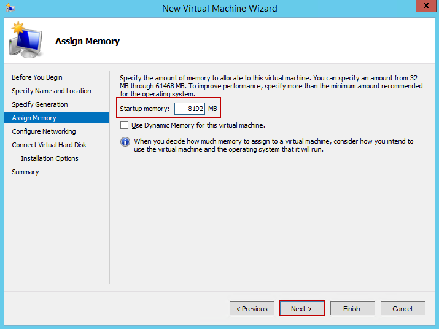

1.  Klicken Sie auf der Seite **Konfigurieren des Netzwerks** Geben Sie die virtuelle wechseln, die mit dem Internet verbunden ist, und klicken Sie dann auf **Weiter**.

    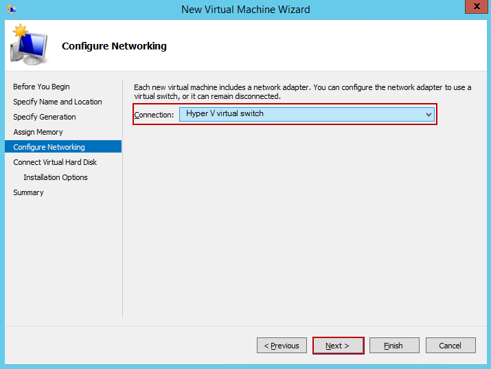

1.  Klicken Sie auf der Seite **virtuelle Festplatte verbinden** wählen Sie **Verwenden einer vorhandenen virtuellen Festplatte aus**, geben Sie den Speicherort des Bilds virtuelles Gerät (.vhdx oder VHD), und klicken Sie dann auf **Weiter**.

    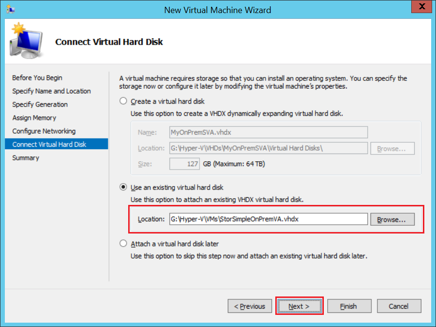

1.  Überprüfen Sie die **Zusammenfassung** , und klicken Sie dann auf **Fertig stellen** , um die Erstellung des virtuellen Computers. Aber nicht springen noch – Sie müssen immer noch einige CPUs und ein zweites Laufwerk hinzufügen. 

    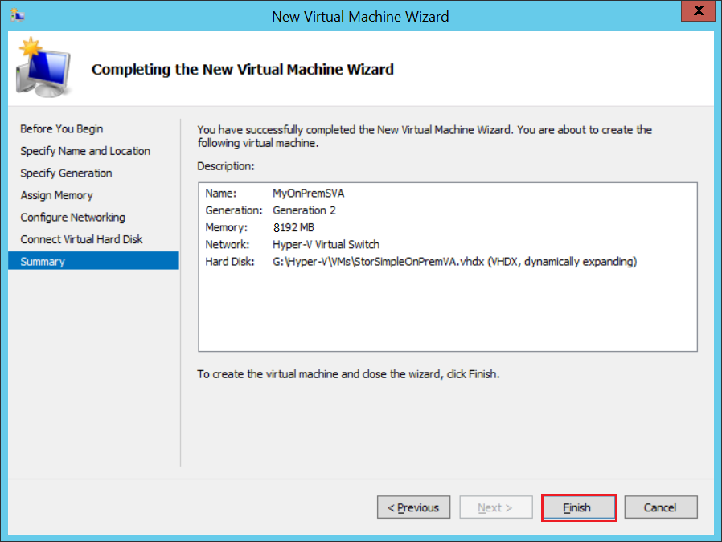

1.  Um die Mindestanforderungen erfüllen, benötigen Sie 4 Kernen. Suchen Sie zum Hinzufügen von virtueller Prozessoren mit Ihrem Hostsystem ausgewählt im Fenster **Hyper-V-Manager** im rechten Bereich unter der Liste der **virtuellen Computern**, die virtuellen Computern, die Sie soeben erstellt haben. Wählen Sie aus, mit der rechten Maustaste in den Namen des Computers, und wählen Sie **Einstellungen**aus.

    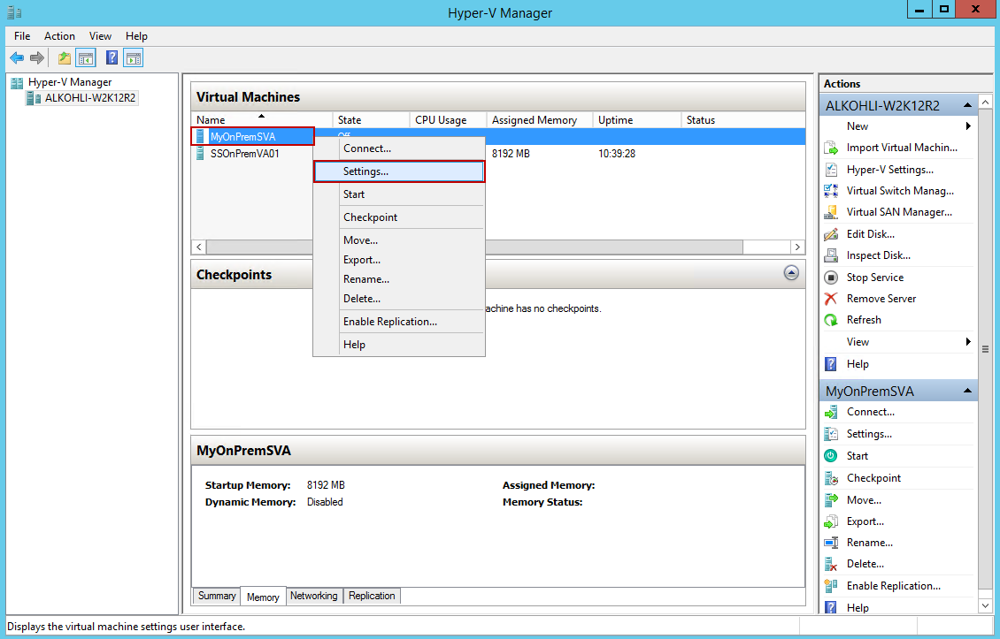

1.  Klicken Sie auf der Seite **Einstellungen** im linken Bereich auf **Prozessor**. Legen Sie im rechten Bereich **Anzahl virtueller Prozessoren** auf 4 (oder mehr) ein. Klicken Sie auf **Übernehmen**.

    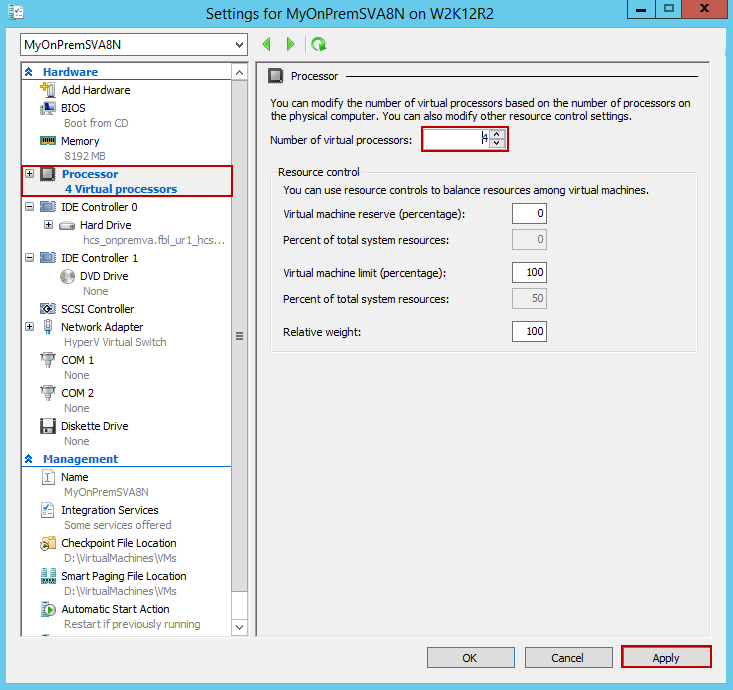

1.  Um die Mindestanforderungen erfüllen zu können, müssen Sie auch einen 500 GB virtuelle Datenträger hinzufügen. Auf **der Seite:**

    1.  Wählen Sie im linken Bereich **SCSI-Controller**ein.
    2.  Klicken Sie im rechten **Festplatte,** wählen Sie aus, und klicken Sie auf **Hinzufügen**.

    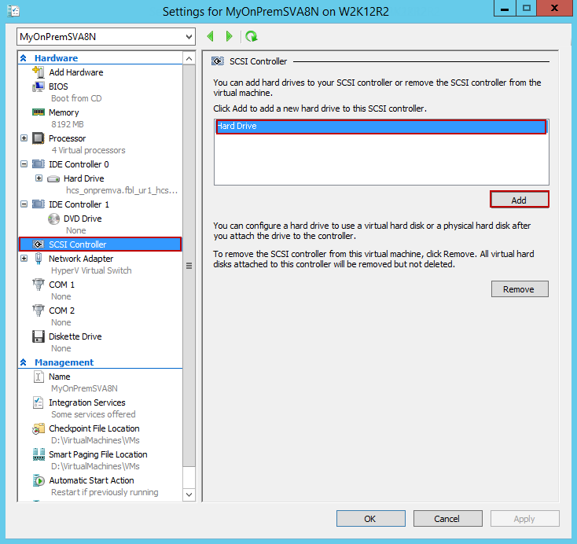

1.  Klicken Sie auf der Seite **Festplatte** wählen Sie die Option **virtuellen Festplatte** aus, und klicken Sie auf **neu**. Dadurch wird die **Neue virtuelle Festplatte-Assistent**gestartet.

    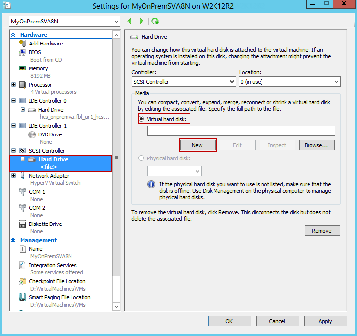

1.  Klicken Sie auf der Seite **zuerst sich daher** die neue virtuelle Festplatte im Assistenten auf **Weiter**.

1.  Klicken Sie auf der **Seite Datenträger-Format auswählen**akzeptieren Sie die Standardoption **VHDX** Format ein. Klicken Sie auf **Weiter**. Dieser Bildschirm wird nicht angezeigt, wenn Sie Windows Server 2012 R2 oder Windows Server 2008 R2 ausführen.

    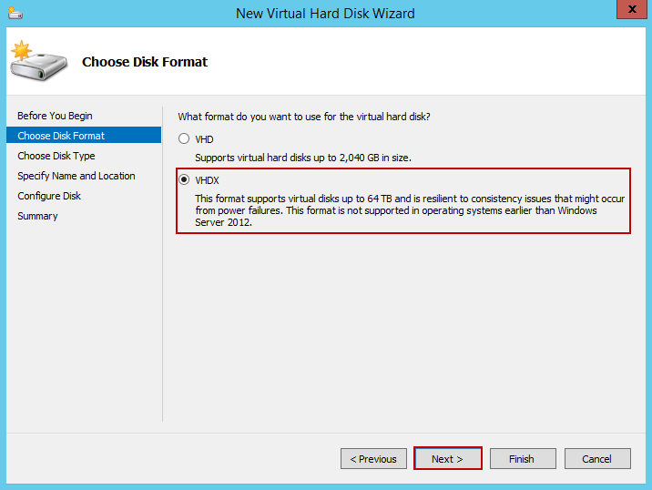

1.  Legen Sie auf der **Seite Datenträger wählen Sie den Typ**Typ virtueller Festplatten als **dynamisch erweiterbar** (empfohlen). Wenn Sie eine **feste Größe auf** dem Datenträger auswählen, wird auch funktionieren, aber möglicherweise sehr lange warten müssen. Es empfiehlt sich, dass Sie nicht die Option **Differenzierung** verwenden. Klicken Sie auf **Weiter**. Beachten Sie, dass **dynamisch erweitern** eines Elements der Standardwert in Windows Server 2012 R2 und Windows Server 2012 ist. In Windows Server 2008 R2 ist der Standardwert **feste Größe**.

    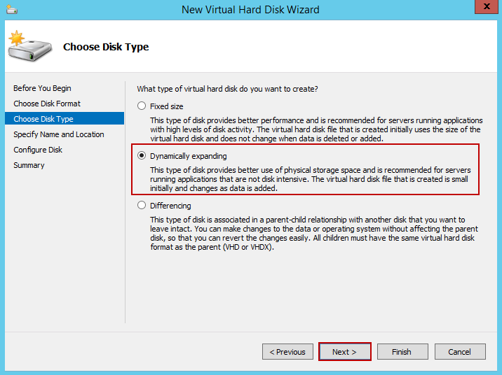

1.  Geben Sie auf der Seite **Geben Sie Namen und einen Speicherort** für den Datenträger Daten einen **Namen** sowie **Speicherort** (Sie können auf einen durchsuchen). Klicken Sie auf **Weiter**.

    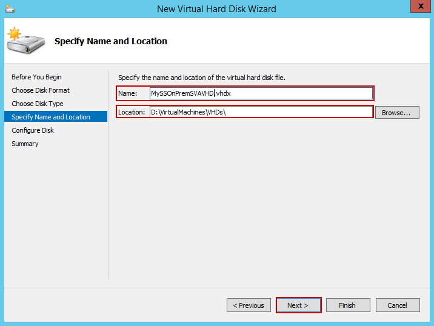

1.  Klicken Sie auf der Seite **Datenträger konfigurieren** wählen Sie die Option **Erstellen einer neuen leeren virtuellen Festplatte** aus, und geben Sie die Größe als **500 GB** (oder mehr). Solange 500 GB den Mindestanforderungen ist, können Sie immer einen größeren Datenträger bereitstellen. Beachten Sie, dass Sie nicht erweitern oder verkleinern den Datenträger einmal nach der Bereitstellung. Überprüfen Sie für Weitere Informationen über die Größe von Datenträger bereitstellen den Ziehpunkte Abschnitt des Dokuments [bewährte Methoden](storsimple-ova-best-practices.md#configuration-best-practices) aus. Klicken Sie auf **Weiter**.

    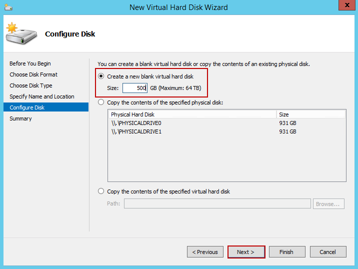

1.  Prüfen Sie auf der Seite **Zusammenfassung** die Details des Datenträgers virtuelle Daten und zufrieden sind, klicken Sie auf **Fertig stellen** , um die Festplatte zu erstellen. Der Assistent wird geschlossen und eine virtuelle Festplatte wird auf Ihrem Computer hinzugefügt werden.

    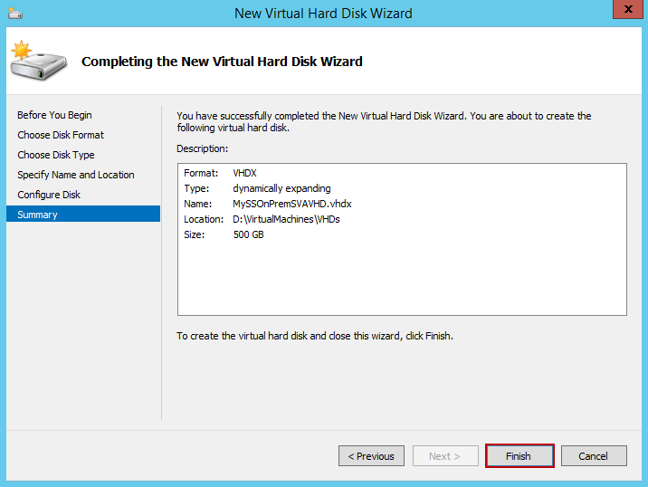

2.  Sie werden zur Seite **Einstellungen** zurückzukehren. Klicken Sie auf **OK** , um **die Einstellungsseite** schließen und Hyper-V-Manager zurückzukehren.

    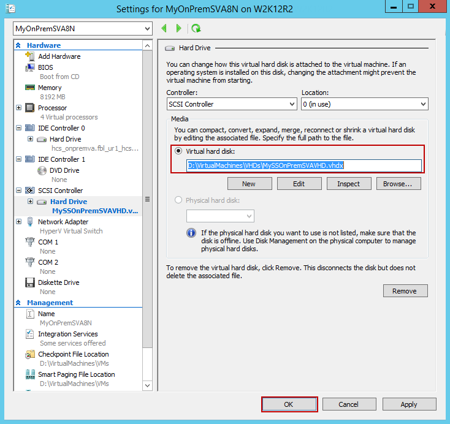

## Schritt 3: Starten Sie das virtuelle Gerät, und erhalten Sie die IP-Adresse

Führen Sie die folgenden Schritte aus, um Ihre virtuelle Gerät starten und zu verbinden.

#### So starten Sie das virtuelle Gerät

1.  Starten Sie das virtuelle Gerät.

    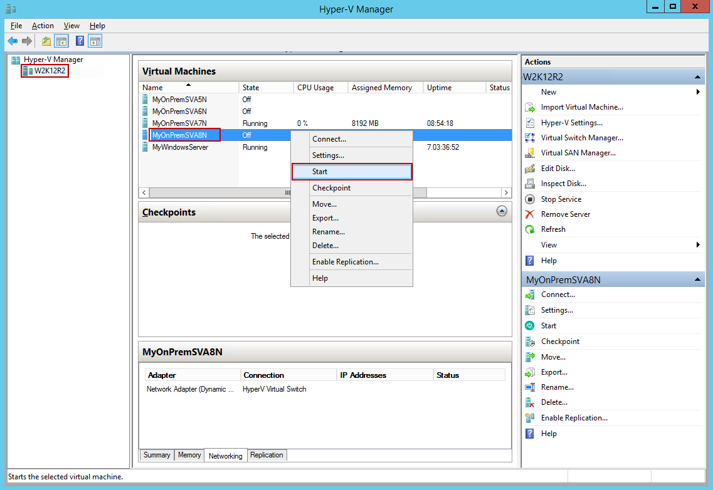

1.  Nachdem das Gerät ausgeführt wird, wählen Sie das Gerät aus, klicken Sie mit der rechten Maustaste auf, und wählen Sie **Verbinden**.

    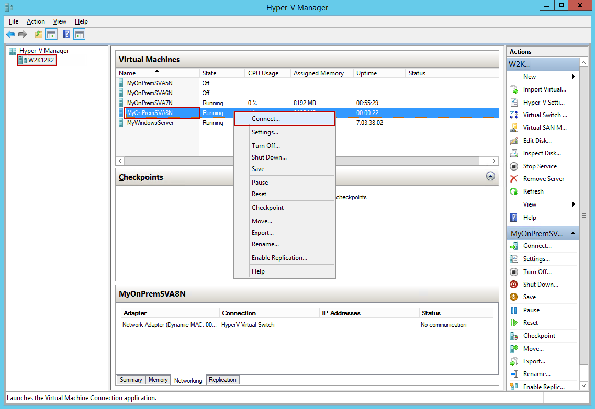

1.  Möglicherweise müssen Sie 5 bis 10 Minuten, damit das Gerät möglicherweise warten. Klicken Sie auf der Konsole an den Fortschritt wird eine Meldung zum Verbindungsstatus angezeigt. Nachdem das Gerät bereit ist, wechseln Sie zu **Aktion**. Drücken Sie `Ctrl + Alt + Delete` virtuelles Gerät anmelden. Der Standardbenutzer ist *StorSimpleAdmin* und das standardmäßige Kennwort lautet *Kennwort1*.

    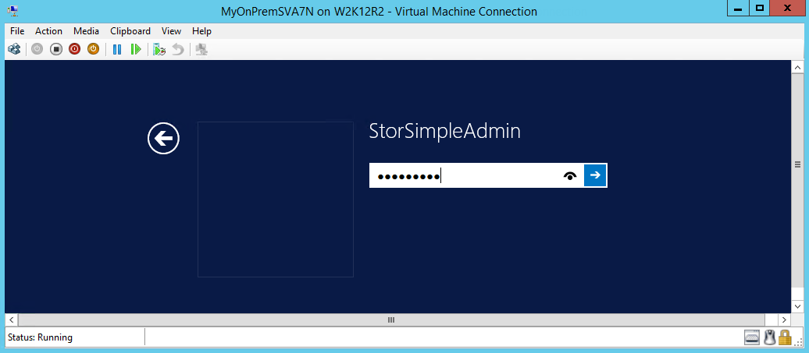

1.  Aus Gründen der Sicherheit läuft ab das Kennwort des Administrators bei der ersten Anmeldung auf. Sie werden aufgefordert, das Kennwort ändern.

    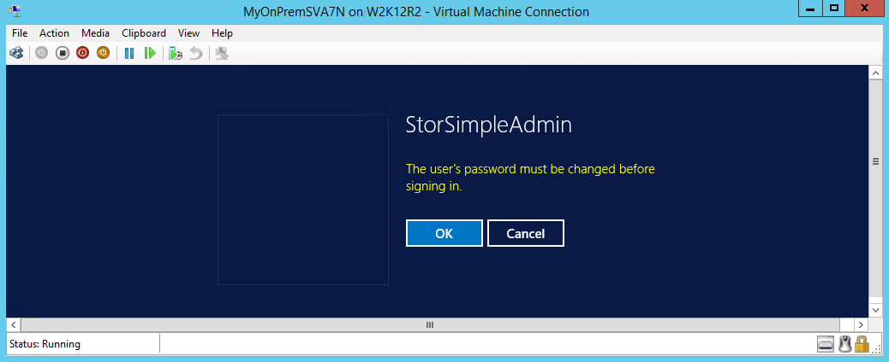

    Geben Sie ein Kennwort ein, die mindestens 8 Zeichen enthält. Das Kennwort muss mindestens 3 aus den folgenden 4 Anforderungen erfüllen: Großbuchstaben, Kleinbuchstaben, numerischen und Sonderzeichen. Geben Sie das Kennwort zur Bestätigung erneut ein. Sie werden benachrichtigt, dass das Kennwort geändert hat.

    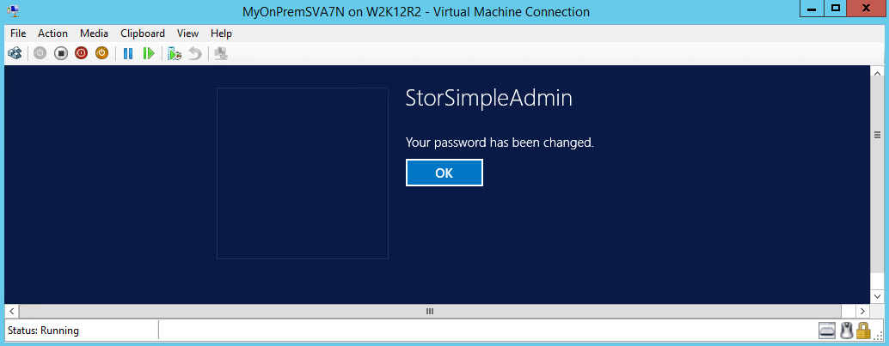

1.  Nachdem das Kennwort geändert wird, wird das virtuelle Gerät möglicherweise neu gestartet. Warten Sie auf das Gerät zu starten.

    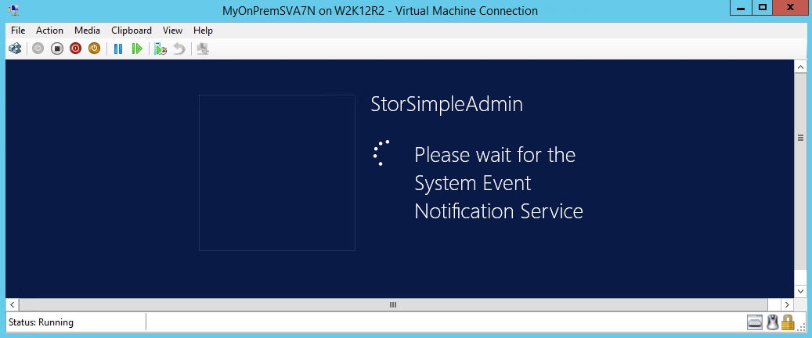

    Die Windows PowerShell-Konsole des Geräts wird zusammen mit einer Statusanzeige angezeigt werden.

    

1.  Die Schritte 6-8 beziehen sich nur beim Starten von in einer nicht DHCP-Umgebung. Wenn Sie in einer Umgebung als DHCP sind, überspringen Sie diese Schritte, und wechseln Sie zu Schritt 9. Wenn Sie Ihr Gerät in nicht DHCP-Umgebung gestartet wird, wird der folgende Bildschirm angezeigt.

    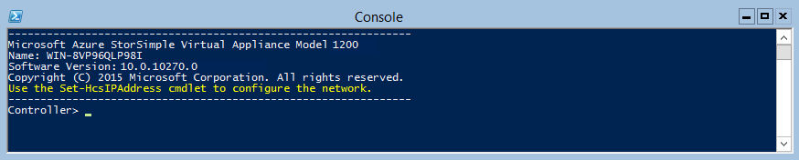

    Sie müssen jetzt im Netzwerk konfigurieren.

1.  Verwenden der `Get-HcsIpAddress` Befehl aus, um die Liste der Netzwerk-Schnittstellen auf Ihrem Gerät virtuelle aktiviert. Wenn Ihr Gerät eine einzelne Netzwerkschnittstelle aktiviert hat, wird der Standardname dieser Schnittstelle zugewiesenen `Ethernet`.

    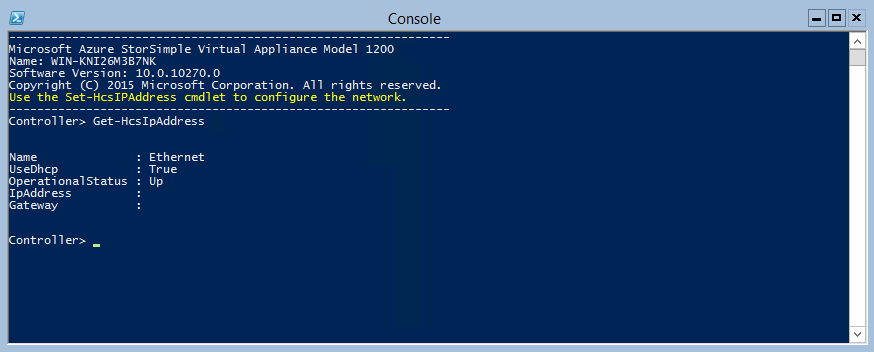

1.  Verwenden der `Set-HcsIpAddress` -Cmdlet zum Konfigurieren des Netzwerks. Beispiel für sieht folgendermaßen aus:

    `Set-HcsIpAddress –Name Ethernet –IpAddress 10.161.22.90 –Netmask 255.255.255.0 –Gateway 10.161.22.1`

    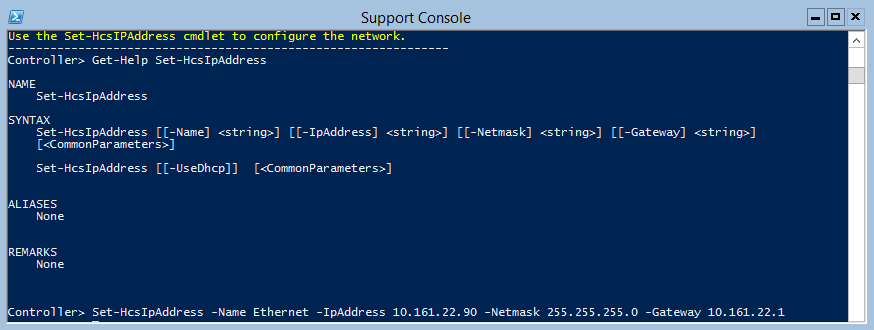

1.  Nach die erste Einrichtung abgeschlossen ist, und das Gerät von gestartet hat, wird den Gerät Bannertext angezeigt. Notieren Sie die IP-Adresse und die URL, die in den Bannertext angezeigt, um das Gerät zu verwalten. Sie werden diese IP-Adresse verwenden, um eine Verbindung mit der Web-Benutzeroberfläche des virtuellen Geräts, und führen Sie die lokale Setup und Registrierung.

    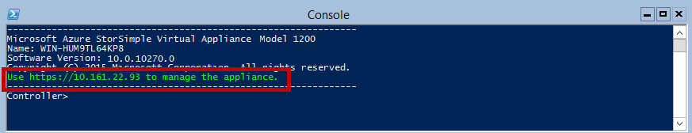

1. (Optional) Führen Sie diesen Schritt nur, wenn Sie Ihr Gerät in der Cloud Government bereitstellen. Sie werden nun den Vereinigten Staaten FIPS Federal Information Processing Standard () Modus auf Ihrem Gerät aktivieren. Der Standard FIPS 140 definiert cryptographic Algorithmen, die für die Verwendung von US Federal Government Computersysteme zum Schutz der sensiblen Daten genehmigt.
    1. Um die FIPS-Modus zu aktivieren, führen Sie das folgende Cmdlet aus:

        `Enter-HcsFIPSMode`

    2. Starten Sie Ihr Gerät neu, nachdem Sie den FIPS-Modus aktiviert haben, damit die cryptographic Validierungen wirksam werden.

        > [AZURE.NOTE] Sie können aktivieren oder Deaktivieren von FIPS-Modus auf Ihrem Gerät. Alternierende das Gerät zwischen FIPS und nicht-FIPS-Modus wird nicht unterstützt.

Wenn Ihr Gerät nicht die minimale Konfiguration Anforderungen erfüllt, wird einen Fehler in den Bannertext (siehe unten) angezeigt. Sie müssen die Gerätekonfiguration zu ändern, sodass es ausreichende Ressourcen die Mindestanforderungen hat. Sie können dann neu starten und Verbinden mit dem Gerät. Verweisen auf die minimale Konfiguration Anforderungen in [Schritt 1: sicherzustellen, dass das Host-System minimalen virtuelles Gerät erfüllt](#step-1-ensure-that-the-host-system-meets-minimum-virtual-device-requirements).

Wenn Sie ein anderer Fehler bei der erstmaligen Konfiguration der lokalen Web-Benutzeroberfläche mit konfrontiert sind, finden Sie in den folgenden Workflows in [Verwalten Ihrer StorSimple Virtual Array mithilfe das lokale Web-Benutzeroberfläche](storsimple-ova-web-ui-admin.md).

-   Führen Sie zum [Behandeln von Problemen mit der Web-Benutzeroberfläche Setup](storsimple-ova-web-ui-admin.md#troubleshoot-web-ui-setup-errors)diagnostic Tests ein.

-   [Log-Paket generieren und Protokolldateien anzeigen](storsimple-ova-web-ui-admin.md#generate-a-log-package).

  **Video verfügbar**

Schauen Sie sich das Video an, um anzuzeigen, wie Sie ein StorSimple virtuelle Array in Hyper-V bereitstellen können.

> [AZURE.VIDEO create-a-storsimple-virtual-array]

## Nächste Schritte

-   [Richten Sie Ihre StorSimple Virtual Array als Dateiserver](storsimple-ova-deploy3-fs-setup.md)

-   [Richten Sie Ihre StorSimple Virtual Array als ein iSCSI-server](storsimple-ova-deploy3-iscsi-setup.md)
