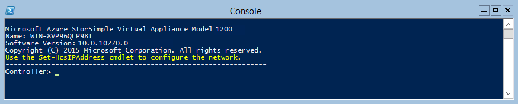
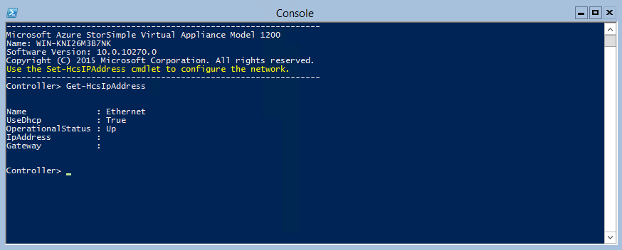

<properties
   pageTitle="Bereitstellen von StorSimple Virtual Array - bereitstellen in VMware"
   description="Zweite Lernprogramm StorSimple Virtual Array Bereitstellung Reihe umfasst ein virtuelles VMware-Gerät bereitgestellt."
   services="storsimple"
   documentationCenter="NA"
   authors="alkohli"
   manager="carmonm"
   editor=""/>

<tags
   ms.service="storsimple"
   ms.devlang="NA"
   ms.topic="article"
   ms.tgt_pltfrm="NA"
   ms.workload="NA"
   ms.date="04/12/2016"
   ms.author="alkohli"/>

# Bereitstellen von StorSimple Virtual Array – Bereitstellung von virtuelles Array in VMware

## (Übersicht) 
In diesem Lernprogramm provisioning gilt für StorSimple virtuelle Arrays (auch bekannt als StorSimple lokalen virtuellen Geräten oder virtuelle Geräte StorSimple) laufenden März 2016 allgemeine Verfügbarkeit (GA) Freigabe. In diesem Lernprogramm beschrieben, wie Sie Bereitstellung von und Verbinden mit einer virtuelle StorSimple Array auf einem Hostsystem mit VMware ESXi 5.5 und höher. In diesem Artikel gilt für die Bereitstellung von StorSimple virtuelle Matrizen in Azure klassischen Portal ebenso wie Microsoft Azure Government Cloud.

Sie benötigen Administratorrechte Bereitstellen von und Verbinden mit einem virtuellen Gerät. Die Bereitstellung und anfängliche Einrichtung kann ungefähr 10 Minuten dauern.

## Voraussetzungen für Bereitstellung

Hier finden Sie die erforderlichen Komponenten über ein virtuelle Gerät auf einem Hostsystem mit VMware ESXi 5.5 und höher bereit.

### Für den Dienst StorSimple-Manager

Bevor Sie beginnen, stellen Sie Folgendes sicher:

-   Alle Schritte unter [Vorbereiten im Portal für StorSimple Virtual Array](storsimple-ova-deploy1-portal-prep.md)abgeschlossen haben.

-   Sie haben das Bild virtuelles Gerät vom Azure-Portal für VMware heruntergeladen. Weitere Informationen finden Sie unter [Schritt 3: Laden Sie das Bild virtuelles Gerät](storsimple-ova-deploy1-portal-prep.md#step-3-download-the-virtual-device-image).

### Für das virtuelle StorSimple-Gerät 

Bevor Sie ein virtuelles Gerät bereitstellen, stellen Sie Folgendes sicher:

-   Sie haben Zugriff auf einem Host-System mit Hyper-V (2008 R2 oder höher), werden kann eine bereitstellen ein Gerät verwendet.

-   Das Hostsystem kann, die folgenden Ressourcen zur Bereitstellung von Ihrem Geräts virtuellen reserviert sein soll:

    -   Mindestens 4 Kernen.

    -   Mindestens 8 GB RAM.

    -   Benutzeroberfläche in einem Netzwerk.

    -   500 GB virtuelles Laufwerk für Systemdaten.

### Für das Netzwerk in datacenter 

Bevor Sie beginnen, stellen Sie Folgendes sicher:

-   Sie haben überprüft die Netzwerken Anforderungen StorSimple virtuelles Gerät bereitstellen und die entsprechenden im Netzwerk Datacenter gemäß den Anforderungen konfiguriert. Weitere Informationen finden Sie unter [Systemanforderungen StorSimple Virtual Array](storsimple-ova-system-requirements.md).

## Schrittweise Bereitstellung 

Um die Bereitstellung von und Verbinden mit einem virtuellen Gerät, müssen Sie die folgenden Schritte ausführen:

1.  Stellen Sie sicher, dass das Host-System ausreichende Ressourcen, um den minimalen virtuelles Gerät zu erfüllen hat.

2.  Bereitstellung von einem virtuellen Gerät in Ihrem Hypervisor.

3.  Starten Sie das virtuelle Gerät, und die IP-Adresse.

## Schritt 1: Stellen Sie sicher, dass Host-System minimalen virtuelles Gerät erfüllt

Um ein virtuelles Gerät zu erstellen, müssen Sie:

-   Zugriff auf ein Hostsystem mit VMware ESXi Server 5.5 und höher.

-   VMware vSphere-Client auf Ihrem System zum Verwalten des ESXi Hosts.

    -   Mindestens 4 Kernen.

    -   Mindestens 8 GB RAM.

    -   Eine Netzwerk-Benutzeroberfläche, die mit dem Netzwerk farbdruckfähig routing des Datenverkehrs mit Internet verbunden werden. Die minimale Internetbandbreite sollten 5/s, um optimale funktioniert das Gerät zu ermöglichen.

    -   500 GB virtuelles Laufwerk nach Daten.

## Schritt 2: Bereitstellen eines virtuellen Hypervisor-Geräts

Führen Sie die folgenden Schritte aus, um eine virtuelle Gerät in Ihrem Hypervisor bereit.

1.  Kopieren Sie das Bild virtuelles Gerät auf Ihrem System. Dies ist das Bild, das Sie über das Azure klassischen Portal heruntergeladen haben. 
    1.  Stellen Sie sicher, dass es sich um die neueste Bilddatei handelt, die Sie heruntergeladen haben. Wenn Sie das Bild einer früheren Version heruntergeladen haben, laden Sie es erneut aus, um sicherzustellen, dass Sie das neueste Bild haben. Das neueste Bild weist zwei Dateien (statt eine).
    2.  Notieren Sie den Speicherort, in dem Sie das Bild kopiert, wie Sie diese später in der Prozedur verwendet werden.

2.  Melden Sie sich bei dem ESXi Server über den Client vSphere werden soll. Sie müssen zum Erstellen eines virtuellen Computers sind Administratorrechte erforderlich.

    

1.  Wählen Sie im Client vSphere im Abschnitt Inventory im linken Bereich den ESXi Server ein.

    

1.  Sie werden zuerst die VMDK-Datei auf dem Server ESXi hochladen. Navigieren Sie zu der Registerkarte **Konfiguration** im rechten Bereich. Wählen Sie unter **Hardware** **Speicher**aus.

    

1.  Wählen Sie im rechten Bereich unter **Datastores**Datenspeicher, in dem Sie die VMDK-Datei hochladen möchten. Der Datenspeicher müssen genügend Speicherplatz für den Datenträger OS und Daten.

    

1.  Klicken Sie mit der rechten Maustaste, und wählen Sie **Datenspeicher navigieren**.

    

1.  Ein **Datenspeicher** Browserfenster wird angezeigt.

    

1.  Klicken Sie in der Symbolleiste auf  Symbol, um einen neuen Ordner erstellen. Geben Sie den Ordner an, und notieren sie. Dieser Ordnername benötigen später Sie beim Erstellen eines virtuellen Computers (bewährte Methode empfohlen). Klicken Sie auf **OK**.

    

1.  Der neue Ordner wird im linken Bereich des **Datenspeicher Browser**angezeigt.

    

1.  Klicken Sie auf das Symbol Upload  , und wählen Sie die **Datei hochladen**.

    

1.  Sie sollten jetzt durchsuchen und zeigen Sie auf den VMDK-Dateien, die Sie heruntergeladen haben. Es werden zwei Dateien. Wählen Sie eine Datei zum Hochladen aus.

    

1.  Klicken Sie auf **Öffnen**. Dadurch wird das Hochladen der Datei, die der angegebenen Datenspeicher VMDK jetzt gestartet. Hochzuladenden Datei einige Minuten dauern.

1.  Nach Abschluss des Uploads, sehen Sie die Datei im Datenspeicher in den Ordner, die Sie erstellt haben. 

    

    Sie müssen jetzt die zweite VMDK-Datei in der gleichen Datenspeicher hochladen.

1.  Zum Fenster Client vSphere zurückzukehren. Markieren Sie ESXi Server mit der rechten Maustaste, und wählen Sie **Neuer virtueller Computer**.

    

1.  Fenster des **neuen virtuellen Computers erstellen** wird angezeigt. Wählen Sie auf der Seite **Konfiguration** die Option **Benutzerdefiniert** aus. Klicken Sie auf **Weiter**.
    

2.  Geben Sie den Namen des virtuellen Computers, auf der Seite **Name und Speicherort** . Dieser Name sollte den Ordnernamen (empfohlen) übereinstimmen, die, den Sie zuvor in Schritt 8 angegeben haben.

    

1.  Wählen Sie auf der Seite **Speicher** einen Datenspeicher, die, den Sie verwenden, um Ihre virtuellen Computer bereitstellen möchten.

    

1.  Wählen Sie auf der Seite **Virtuellen Computern Version** **virtuellen Computers Version: 8**. Beachten Sie, dass alle Versionen 8 bis 11 unterstützt werden.

    

1.  Wählen Sie auf der Seite **Gast-Betriebssystem** **Gast-Betriebssystem** als **Windows**ein. Wählen Sie in der Dropdownliste aus, **Version**aus **Microsoft Windows Server 2012 (64-Bit)**.

    

1.  Klicken Sie auf der Seite **CPUs** passen Sie die **Anzahl der virtuellen Sockets** und die **Anzahl der Kerne pro virtuelle Sockets** , damit die **Gesamtanzahl von Kernspeichern** 4 (oder mehr) ist. Klicken Sie auf **Weiter**.

    

1.  Geben Sie auf der Seite **Arbeitsspeicher** 8 GB (oder mehr) RAM aus. Klicken Sie auf **Weiter**.

    

1.  Geben Sie die Anzahl der Netzwerkschnittstellen, klicken Sie auf der Seite **Netzwerk** . Die Mindestanforderungen ist eine Schnittstelle.

    

1.  Übernehmen Sie den Standardwert **LSI Logik SAS-Controller**, klicken Sie auf der Seite **SCSI-Controller** .

    

1.  Wählen Sie auf der Seite **Wählen Sie einen Datenträger** **Verwenden einer vorhandenen virtuellen Datenträger**aus. Klicken Sie auf **Weiter**.

    

1.  Klicken Sie auf der Seite **Vorhandenen Datenträger wählen Sie** unter **Dateipfad Datenträger**, auf **Durchsuchen**. Daraufhin wird ein Dialogfeld für das **Durchsuchen Datastores** . Navigieren Sie zu dem Speicherort, in dem Sie die VMDK-Datei hochgeladen. Sie sehen jetzt nur eine Datei im Datenspeicher, wie die beiden Dateien, die Sie zunächst hochgeladen zusammengeführt wurden. Wählen Sie die Datei aus, und klicken Sie auf **OK**. Klicken Sie auf **Weiter**.

    

1.  Klicken Sie auf der Seite **Erweiterte Optionen** übernehmen Sie den Standardwert, und klicken Sie auf **Weiter**.

    

1.  Überprüfen Sie auf der Seite **bereit sind, abgeschlossen** alle Einstellungen, die mit den neuen virtuellen Computer verknüpft ist. Überprüfen Sie **die Einstellungen des virtuellen Computers vor der Fertigstellung bearbeiten**. Klicken Sie auf **Weiter**.

    

1.  Suchen Sie auf der Seite **Eigenschaften von virtuellen Computern** in der Registerkarte **Hardware** der Gerätehardware aus. Wählen Sie die **neue Festplatte**aus. Klicken Sie auf **Hinzufügen**.

    

1.  Dadurch wird das Fenster **Hardware hinzufügen** . Wählen Sie auf der Seite **Gerät geben** Sie unter **Wählen Sie das gewünschte Gerät aus, das Sie hinzufügen möchten** **Festplatte** aus, und klicken Sie auf **Weiter**.

    

1.  Wählen Sie auf der Seite **Wählen Sie einen Datenträger** **Erstellen Sie einen neuen virtuellen Datenträger**aus. Klicken Sie auf **Weiter**.

    

1.  Klicken Sie auf der Seite **Erstellen Sie einen Datenträger** ändern Sie die **Größe des Datenträger** 500 GB (oder mehr) aus. Wählen Sie unter **Datenträger bereitgestellt** **Dünnen Bereitstellung**ein. Klicken Sie auf **Weiter**.

    

1.  Übernehmen Sie die Vorgabe, klicken Sie auf der Seite **Erweiterte Optionen** .

    

1.  Überprüfen Sie die Datenträgeroptionen, klicken Sie auf der Seite **abgeschlossen fertig erstellt haben** . Klicken Sie auf **Fertig stellen**.

    

1.  Sie gibt nun auf der Seite Eigenschaften des virtuellen Computers zurück. Eine neue Festplatte wird des virtuellen Computers hinzugefügt. Klicken Sie auf **Fertig stellen**.
  
    

2.  Navigieren Sie mit der virtuellen Computern im rechten Bereich ausgewählt ist zu der Registerkarte **Zusammenfassung** . Überprüfen Sie die Einstellungen für den virtuellen Computer an.

    

Des virtuellen Computers ist jetzt nach der Bereitstellung. Im nächsten Schritt wird power auf diesem Computer und die IP-Adresse.

## Schritt 3: Starten Sie das virtuelle Gerät, und erhalten Sie die IP-Adresse

Führen Sie die folgenden Schritte aus, um Ihre virtuelle Gerät starten und zu verbinden.

#### So starten Sie das virtuelle Gerät

1.  Starten Sie das virtuelle Gerät. Wählen Sie in der vSphere-Konfigurations-Manager im linken Bereich das Gerät, und mit der rechten Maustaste, um das Kontextmenü aufzurufen. Wählen Sie **Power** aus, und wählen Sie dann **auf Power**. Dies sollte Ihre virtuellen Computern einschalten. Sie können den Status im unteren Bereich **Zuletzt verwendete Aufgaben** des Clients vSphere anzeigen.

    

1.  Die Setupaufgaben werden ein paar Minuten dauern. Nachdem das Gerät ausgeführt wird, navigieren Sie zur Registerkarte **Console** . Strg + Alt + Entf zur Anmeldung bei des Geräts zu senden. Alternativ können Sie den Cursor auf das Konsolenfenster zeigen und drücken Sie Strg + Alt + EINFG. Der Standardbenutzer ist *StorSimpleAdmin* und das standardmäßige Kennwort lautet *Kennwort1*.

    

1.  Aus Gründen der Sicherheit läuft ab das Kennwort des Administrators bei der ersten Anmeldung auf. Sie werden aufgefordert, das Kennwort ändern.

    

1.  Geben Sie ein Kennwort ein, die mindestens 8 Zeichen enthält. Das Kennwort muss 3 von 4 diese Anforderungen enthalten: Großbuchstaben, Kleinbuchstaben, numerischen und Sonderzeichen. Geben Sie das Kennwort zur Bestätigung erneut ein. Sie werden benachrichtigt, dass das Kennwort geändert hat.

    

1.  Nachdem das Kennwort geändert wird, kann das virtuelle Gerät neu starten. Warten Sie auf dem Neustart ausführen. Die Windows PowerShell-Konsole des Geräts möglicherweise zusammen mit einer Statusanzeige angezeigt werden.

    

1.  Die Schritte 6-8 beziehen sich nur beim Starten von in einer nicht DHCP-Umgebung. Wenn Sie in einer Umgebung als DHCP sind, überspringen Sie diese Schritte, und wechseln Sie zu Schritt 9. Wenn Sie Ihr Gerät in nicht DHCP-Umgebung gestartet wird, wird der folgende Bildschirm angezeigt. 

    

    Sie müssen jetzt im Netzwerk konfigurieren.

1.  Verwenden der `Get-HcsIpAddress` Befehl aus, um die Liste der Netzwerk-Schnittstellen auf Ihrem Gerät virtuelle aktiviert. Wenn Ihr Gerät eine einzelne Netzwerkschnittstelle aktiviert hat, wird der Standardname dieser Schnittstelle zugewiesenen `Ethernet`.

    

1.  Verwenden der `Set-HcsIpAddress` -Cmdlet zum Konfigurieren des Netzwerks. Beispiel für sieht folgendermaßen aus:

    `Set-HcsIpAddress –Name Ethernet –IpAddress 10.161.22.90 –Netmask 255.255.255.0 –Gateway 10.161.22.1`

    

1.  Nach die erste Einrichtung abgeschlossen ist, und das Gerät von gestartet hat, wird den Gerät Bannertext angezeigt. Notieren Sie die IP-Adresse und die URL, die in den Bannertext angezeigt, um das Gerät zu verwalten. Sie werden diese IP-Adresse verwenden, um eine Verbindung mit der Web-Benutzeroberfläche des virtuellen Geräts, und führen Sie die lokale Setup und Registrierung.

    

1. (Optional) Führen Sie diesen Schritt nur, wenn Sie Ihr Gerät in der Cloud Government bereitstellen. Sie werden nun den Vereinigten Staaten FIPS Federal Information Processing Standard () Modus auf Ihrem Gerät aktivieren. Der Standard FIPS 140 definiert cryptographic Algorithmen, die für die Verwendung von US Federal Government Computersysteme zum Schutz der sensiblen Daten genehmigt.
    1. Um die FIPS-Modus zu aktivieren, führen Sie das folgende Cmdlet aus:
        
        `Enter-HcsFIPSMode`

    2. Starten Sie Ihr Gerät neu, nachdem Sie den FIPS-Modus aktiviert haben, damit die cryptographic Validierungen wirksam werden.

        > [AZURE.NOTE] Sie können aktivieren oder Deaktivieren von FIPS-Modus auf Ihrem Gerät. Alternierende das Gerät zwischen FIPS und nicht-FIPS-Modus wird nicht unterstützt.

Wenn Ihr Gerät nicht die minimale Konfiguration Anforderungen erfüllt, wird einen Fehler in den Bannertext (siehe unten) angezeigt. Sie müssen die Gerätekonfiguration zu ändern, sodass es ausreichende Ressourcen die Mindestanforderungen hat. Sie können dann neu starten und Verbinden mit dem Gerät. Verweisen auf die minimale Konfiguration Anforderungen in [Schritt 1: sicherzustellen, dass das Host-System minimalen virtuelles Gerät erfüllt](#step-1-ensure-host-system-meets-minimum-virtual-device-requirements).

Wenn Sie ein anderer Fehler bei der erstmaligen Konfiguration der lokalen Web-Benutzeroberfläche mit konfrontiert sind, finden Sie in den folgenden Workflows in [Verwalten Ihrer StorSimple Virtual Array mithilfe das lokale Web-Benutzeroberfläche](storsimple-ova-web-ui-admin.md).

-   Führen Sie zum [Behandeln von Problemen mit der Web-Benutzeroberfläche Setup](storsimple-ova-web-ui-admin.md#troubleshoot-web-ui-setup-errors)diagnostic Tests ein.

-   [Log-Paket generieren und Ansicht Protokolldateien](storsimple-ova-web-ui-admin.md#generate-a-log-package)...

## Nächste Schritte

-   [Richten Sie Ihre StorSimple Virtual Array als Dateiserver](storsimple-ova-deploy3-fs-setup.md)

-   [Richten Sie Ihre StorSimple Virtual Array als ein iSCSI-server](storsimple-ova-deploy3-iscsi-setup.md)

