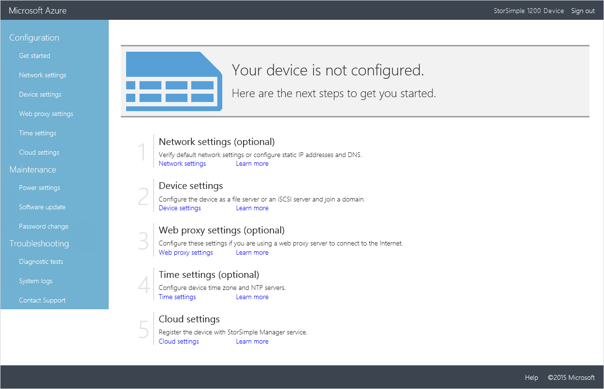
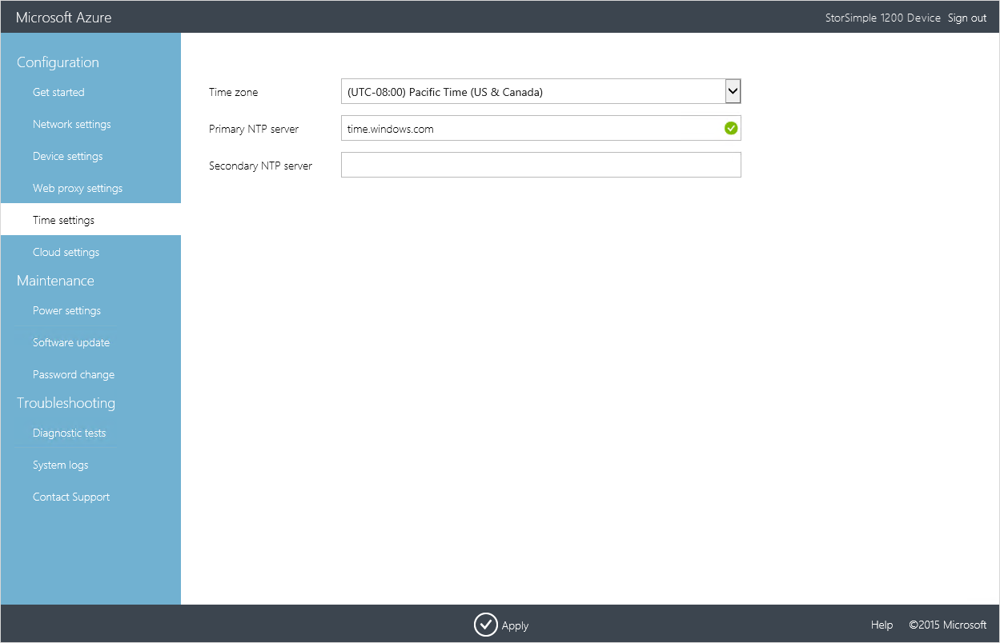

<properties
   pageTitle="Bereitstellen StorSimple virtuellen Matrix 3: Einrichten der virtuellen Geräts als Dateiserver"
   description="Diese dritte Lernprogramm in StorSimple Virtual Array Bereitstellung weist Sie ein virtuelles Gerät als Dateiserver einrichten."
   services="storsimple"
   documentationCenter="NA"
   authors="alkohli"
   manager="carmonm"
   editor=""/>

<tags
   ms.service="storsimple"
   ms.devlang="NA"
   ms.topic="article"
   ms.tgt_pltfrm="NA"
   ms.workload="NA"
   ms.date="05/26/2016"
   ms.author="alkohli"/>

# Bereitstellen von StorSimple virtuellen Array - Festlegen von als Dateiserver

## Einführung 

In diesem Artikel gilt für Microsoft Azure StorSimple Virtual Array (auch bekannt als StorSimple lokalen virtuelles Gerät oder StorSimple virtuelles Gerät) laufenden März 2016 allgemeine Verfügbarkeit (GA) Freigabe. In diesem Artikel werden die zum Ausführen der ersten Einrichtung, Ihr StorSimple Dateiserver registrieren, schließen Sie das Gerät Setup und erstellen und Verbinden mit SMB-Freigaben. Dies ist der letzte Artikel in der Reihe der Bereitstellungslernprogramme erforderlich, um Ihre virtuelle Array vollständig als eine Dateiserver oder einem iSCSI-Server bereitstellen.

Der Prozess Setup und Konfiguration kann ungefähr 10 Minuten dauern.

## Voraussetzungen für die Einrichtung

Bevor Sie konfigurieren, und Sie Ihr StorSimple virtuelle Gerät richten, stellen Sie Folgendes sicher:

-   Sie haben ein virtuelles Gerät nach der Bereitstellung und wie die [Bereitstellung StorSimple virtuelles Array in Hyper-V](storsimple-ova-deploy2-provision-hyperv.md) oder [Bereitstellen einer StorSimple Virtual Array in VMware](storsimple-ova-deploy2-provision-vmware.md)ausführlich verbunden.

-   Sie müssen der Dienst Registrierungsschlüssel vom StorSimple-Manager-Dienst, den Sie zum Verwalten von StorSimple virtuelle Geräte erstellt haben. Weitere Informationen finden Sie unter [Schritt2: Abrufen der Dienst Registrierungsschlüssel](storsimple-ova-deploy1-portal-prep.md#step-2-get-the-service-registration-key) für StorSimple Virtual Array.

-   Ist dies der zweiten oder nachfolgenden virtuelles Gerät, das Sie mit einem vorhandenen StorSimple-Manager-Dienst registriert sind, sollten Sie den Dienst Datenschlüssel verfügen. Dieser Schlüssel wurde generiert, wenn das erste Gerät mit diesem Dienst erfolgreich registriert wurde. Wenn Sie diese Key verloren haben, finden Sie unter [den Dienst Daten Verschlüsselungsschlüssel abrufen](storsimple-ova-web-ui-admin.md#get-the-service-data-encryption-key) Ihrer StorSimple Virtual Array.

## Schrittweise einrichten

Verwenden Sie die folgenden Schritte zum Einrichten und Konfigurieren des StorSimple virtuellen Geräts aus.

## Schritt 1: Schließen Sie die Einrichtung der lokalen Web-Benutzeroberfläche und Registrieren von Ihrem Gerät 

#### Schließen Sie die Einrichtung und das Gerät zu registrieren

1.  Öffnen Sie ein Browserfenster, und Verbinden mit der lokalen Web-Benutzeroberfläche. Type: 

    `https://<ip-address of network interface>`

    Verwenden Sie die im vorherigen Schritt erwähnt Verbindungs-URL ein. Es wird einen Fehler, der angibt, dass es ein Problem mit dem Sicherheitszertifikat der Website liegt angezeigt. Klicken Sie auf **Weiter, um diese Webseite**.

    

1.  Melden Sie sich bei der Web-Benutzeroberfläche des virtuellen Geräts als **StorSimpleAdmin**. Geben Sie das Gerät Administratorkennwort, das geändert, in Schritt 3: virtuelle Gerät in [Bereitstellen StorSimple virtuelles Array in Hyper-V](storsimple-ova-deploy2-provision-hyperv.md) oder [Bereitstellen einer StorSimple Virtual Array in VMware](storsimple-ova-deploy2-provision-vmware.md)zu starten.

    

1.  Sie werden auf **der Startseite** weitergeleitet werden. Diese Seite beschreibt die verschiedenen Einstellungen für das Konfigurieren und registrieren virtuelle Gerät mit dem Dienst StorSimple Manager erforderlich. Beachten Sie, dass die **Netzwerk-Einstellungen**, **Proxyeinstellungen Web**und **Zeit Einstellungen** optional sind. Die einzigen erforderlichen Einstellungen sind **Gerät unter** und **Cloud-Einstellungen**.

    

1.  Daten 0 werden automatisch in das **Netzwerk** Einstellungsseite unter **Netzwerk-Schnittstellen**für Sie konfiguriert. Jedes Netzwerk-Benutzeroberfläche wird standardmäßig festgelegt, IP-Adresse automatisch abrufen (DHCP). Daher werden automatisch eine IP-Adresse, Subnetz und Gateway (für IPv4 und IPv6) zugewiesen werden.

    

    Wenn Sie mehr als eine Schnittstelle während der Bereitstellung des Geräts hinzugefügt haben, können Sie sie hier konfigurieren. Beachten Sie, dass Sie Ihre Netzwerk-Oberfläche als IPv4 nur oder als IPv4 und IPv6 konfigurieren können. IPv6-nur Konfigurationen werden nicht unterstützt.

1.  DNS-Server sind erforderlich, da sie verwendet werden, wenn Ihr Gerät zur Kommunikation mit der Cloud-Speicher-Dienstanbieter oder auf Ihrem Gerät zu lösen versucht anhand des Namens, wenn als Dateiserver konfiguriert. In der **Netzwerk** Einstellungsseite unter den **DNS-Server**:

    1.  Ein primärer und sekundärer DNS-Server wird automatisch konfiguriert. Falls gewünscht statische IP-Adressen konfigurieren, können Sie DNS-Server angeben. Für eine hohe Verfügbarkeit wird empfohlen, dass Sie einen primären und einen sekundären DNS-Server konfigurieren.

    2.  Klicken Sie auf **Übernehmen**. Dies anwenden, und überprüfen die Einstellungen im Netzwerk.

2.  Auf der Seite **Einstellungen für Audiogeräte** :

    1.  Weisen Sie einen eindeutigen **Namen** auf Ihr Gerät aus. Dieser Name kann 1-15 Zeichen sein und kann Buchstaben, Zahlen und Bindestriche enthalten.

    2.  Klicken Sie auf das Symbol **Dateiserver**  für den **Typ** des Geräts, die Sie erstellen. Eine Dateiserver können Sie freigegebene Ordner erstellen.

    3.  Wie das Gerät eine Dateiserver ist, müssen Sie das Gerät zu einer Domäne hinzuzufügen. Geben Sie einen **Domänennamen**ein.

    1.  Klicken Sie auf **Übernehmen**.

2.  Es wird ein Dialogfeld angezeigt. Geben Sie Ihre Domänenanmeldeinformationen, in dem angegebenen Format. Klicken Sie auf das Symbol überprüfen. Die Anmeldeinformationen für die Domäne werden überprüft werden. Sie werden eine Fehlermeldung angezeigt, wenn die Anmeldeinformationen nicht korrekt sind.

    

1.  Klicken Sie auf **Übernehmen**. Dies anwenden, und überprüfen die Einstellungen für Audiogeräte.

    

    > [AZURE.NOTE]
    > 
    > Stellen Sie sicher, dass Ihr virtuelle Array in einem eigenen (Organisationseinheit) für Active Directory ist und keine Gruppenrichtlinienobjekte (Gruppenrichtlinienobjekt) angewendet oder geerbt werden. Gruppenrichtlinien möglicherweise Anwendungen wie Antivirensoftware auf virtuelle StorSimple Array installieren. Zusätzliche Software zu installieren, wird nicht unterstützt und könnte zur Beschädigung der Daten führen. 

1.  Konfigurieren Sie den Webproxyserver (optional). Achten Sie darauf, wenn Sie einen Webproxy verwenden, nur es so konfigurieren können, Web Proxy-Konfiguration ist optional.

    

    Der **WebProxy** -Seite:

    1.  Stellen Sie den **Web Proxy-URL** in diesem Format: *http://&lt;Host IP-Adresse oder FDQN&gt;: Port-Nummer*. Beachten Sie, dass HTTPS-URLs nicht unterstützt werden.

    2.  Geben Sie als **einfacher** oder **keine** **Authentifizierung** an.

    3.  Wenn Authentifizierung verwenden zu können, müssen Sie einen **Benutzernamen** und **ein Kennwort**angeben.

    4.  Klicken Sie auf **Übernehmen**. Dies überprüfen und die Proxyeinstellungen konfiguriert Web anwenden.

1.  (Optional) Konfigurieren der Zeit-Einstellungen für Ihr Gerät, beispielsweise die Zeitzone und den primären und sekundären NTP-Servern. NTP-Server sind erforderlich, da Zeit, damit sie mit der Cloud-Dienstanbieter authentifizieren kann Ihrem Gerät synchronisiert werden muss.

    

    In der **Zeit** Einstellungsseite:

    1.  Wählen Sie in der Dropdownliste aus die **Zeitzone** basierend auf die geografische Position in der das Gerät bereitgestellt wird. Die Standardzeitzone für Ihr Gerät ist PST-Datei. Ihr Gerät wird dieser Zeitzone für alle geplanten Vorgängen verwendet werden.

    2.  Geben Sie einen **primären NTP-Server** für Ihr Gerät, oder akzeptieren Sie den Standardwert time.windows.com. Stellen Sie sicher, dass Ihr Netzwerk NTP Datenverkehr aus Datencenters weitergeleitet werden soll, mit dem Internet zulässt.

    3.  Geben Sie optional eine **sekundäre NTP-Server** für Ihr Gerät aus.

    4.  Klicken Sie auf **Übernehmen**. Diese überprüfen, und die konfigurierten Zeit Einstellungen angewendet.

1.  Konfigurieren Sie die Cloud-Einstellungen für Ihr Gerät. In diesem Schritt Sie schließen Sie die Konfiguration für lokale Geräte und anschließend das Gerät mit Ihrem Dienst StorSimple Manager registrieren.

    1.  Geben Sie den **Dienst Registrierungsschlüssel** , die Sie in Ihrem System [Schritt2: Abrufen der Dienst Registrierungsschlüssel](storsimple-ova-deploy1-portal-prep.md#step-2-get-the-service-registration-key) für StorSimple Virtual Array.

    2.  Überspringen Sie diesen Schritt, ist dies das erste Gerät mit diesem Dienst registrieren, und wechseln Sie zu dem nächsten Schritt fort. Wenn dies nicht dem ersten Gerät, das Sie für diesen Dienst registrieren ist, müssen Sie den **Dienst Daten Verschlüsselungsschlüssels**bereitstellen. Dieser Schlüssel ist mit der Dienst Registrierungsschlüssel registrieren zusätzliche Geräte mit dem Dienst StorSimple Manager erforderlich. Weitere Informationen finden Sie um den [Dienst Daten Verschlüsselungsschlüssels](storsimple-ova-web-ui-admin.md#get-the-service-data-encryption-key) auf Ihrem lokalen Web-Benutzeroberfläche zu erhalten.

    3.  Klicken Sie auf **Registrieren**. Dadurch wird das Gerät neu gestartet. Möglicherweise müssen Sie warten, 2-3 Minuten anzugeben, bevor Sie das Gerät erfolgreich registriert ist. Nachdem das Gerät neu gestartet wurde, wird der Anmeldeseite geöffnet werden.

        
    

1.  Klassische Azure-Portal zurück. Klicken Sie auf der Seite **Geräte** stellen Sie sicher, dass das Gerät zum Dienst erfolgreich eine Verbindung hergestellt hat, durch den Status nachschlagen. Der Gerätestatus sollte **aktiv**sein.

## Schritt 2: Führen Sie die erforderlichen Geräte-Einrichtung

Wenn Sie die die Gerätekonfiguration von Ihrem Gerät StorSimple abgeschlossen haben, müssen Sie:

-   Wählen Sie ein Speicherkonto auf Ihrem Gerät zuordnen.

-   Wählen Sie die Verschlüsselung der Einstellungen für die Daten, die gesendet wird, in die cloud aus.

Führen Sie die folgenden Schritte im [Azure klassischen Portal](https://manage.windowsazure.com/) zum Abschließen der erforderlichen Gerät aus.

#### Zum Abschließen der minimalen Gerät

1.  Wählen Sie die Seite **Geräten** das Gerät, das Sie gerade erstellt haben. Dieses Gerät würde als **aktiv**angezeigt. Klicken Sie auf den Pfeil neben dem Gerätenamen, und klicken Sie dann auf **Schnellstart**.

2.  Klicken Sie auf die **vollständige Einrichtung einrichten** , um den Assistenten zum Konfigurieren von Geräten zu starten.

3.  Im Assistenten konfigurieren Gerät auf der Einstellungsseite **Grundlegende** folgendermaßen Sie vor:

    1.  Geben Sie ein Speicherkonto mit Ihrem Gerät verwendet werden. Wählen Sie ein vorhandenes Speicherkonto in Abonnement aus der Dropdownliste oder **Weitere hinzufügen** , um ein anderes Abonnement wählen Sie ein Konto angeben können.

    2.  Definieren Sie die Einstellungen für Verschlüsselung für alle der Data-at-Rest (AES-Verschlüsselung), der in der Cloud gesendet werden sollen. Verschlüsselung von Daten, aktivieren Sie das Kombinationsfeld **Cloud-Speicher Verschlüsselungsschlüssels aktivieren**. Geben Sie eine Cloud-Speicher Verschlüsselung, die 32 Zeichen enthält. Geben Sie die Taste zur Bestätigung erneut ein. Ein 256-Bit-AES-Schlüssel wird mit dem benutzerdefinierten Schlüssel für die Verschlüsselung verwendet werden.

    3.  Klicken Sie auf das Symbol Kontrollkästchen .

        

Die Einstellungen werden jetzt aktualisiert. Nachdem Einstellungen erfolgreich aktualisiert werden, wird die vollständige Einrichtung Setup-Schaltfläche abgeblendet. Sie zu der Seite auf Geräte **Schnellstart** zurückgegeben werden kann.

 

> [AZURE.NOTE]                                                              
>
> Sie können alle anderen Gerät-Einstellungen zu einem beliebigen Zeitpunkt ändern, durch den Zugriff auf der Seite **Konfigurieren** .

## Schritt 3: Hinzufügen eines freigeben

Führen Sie die folgenden Schritte aus, im [Azure klassischen Portal](https://manage.windowsazure.com/) So erstellen Sie eine Freigabe.

#### So erstellen Sie eine Freigabe

1.  Klicken Sie auf der Seite Geräte für **Schnellstart** auf **Hinzufügen einer freigeben**. Hierdurch wird im Assistenten zum Freigeben hinzufügen.

    

1.  Klicken Sie auf der Einstellungsseite **Grundlegende** folgendermaßen Sie vor:

    1.  Geben Sie einen eindeutigen Namen für die Freigabe ein. Der Name muss eine Zeichenfolge sein, die 3 bis 127 Zeichen enthält.

    2.  (Optional) Geben Sie eine Beschreibung für die Freigabe ein. Die Beschreibung kann Ihnen helfen, die Besitzer freigeben zu identifizieren.

    3.  Wählen Sie einen Verwendungstyp für die Freigabe ein. Verwendung **Tiered** oder **lokal angehefteten**, sind möglich mit gestufte ist der Standardwert. Auslastung, die lokale Garantien, niedrige Wartezeiten und bessere Leistung erfordern, wählen Sie eine **lokal angehefteten** freigeben. Wählen Sie alle Daten einer **Tiered** freigeben.

    Eine lokal angeheftete freigeben Linienstärke bereitgestellt wird, und es wird sichergestellt, dass die primären Daten für die Freigabe bleibt lokal auf dem Gerät werden nicht in der Cloud Effekts. Eine gestufte Freigabe ist andererseits Thin Provisioning nach der Bereitstellung. Wenn Sie eine gestufte Freigabe erstellen, 10 % des Speicherplatzes auf der lokalen Ebene bereitgestellt wird, und 90 % des Speicherplatzes wird nach der Bereitstellung in der Cloud. Beispielsweise wenn Sie einen Datenträger 1 TB bereitgestellt, 100 GB würde im lokalen Raum befinden und 900 GB in der Cloud verwendet werden sollte bei der Datenebenen. Dies bedeutet wiederum, dass, wenn Sie alle im lokalen Speicherplatz auf dem Gerät ausführen, können Sie eine gestufte Freigabe können nicht bereitstellen.

1.  Geben Sie die bereitgestellte Kapazität für Ihre freigeben. Beachten Sie, dass die angegebene Kapazität kleiner als die Kapazität verfügbar sein soll. Wenn eine gestufte Freigabe verwenden, sollten die Größe freigeben zwischen 500 GB und 20 TB. Geben Sie für eine lokal angeheftete freigeben eine Größe freigeben zwischen 50 GB und 2 TB. Verwenden Sie die verfügbare Kapazität als Leitfaden, um eine Freigabe bereitzustellen. Ist die verfügbare lokale Kapazität 0 GB, werden dann Sie nicht möglich lokale oder gestufte Freigaben bereitstellen.

    

1.  Klicken Sie auf das Pfeilsymbol  um zur nächsten Seite zu wechseln.

1.  Weisen Sie auf der Seite **Zusätzliche Einstellungen** die Berechtigungen der Benutzer oder der Gruppe, die auf diese Freigabe zugreifen. Geben Sie den Namen des Benutzers oder der Benutzergruppe in *<john@contoso.com>* Format. Es empfiehlt sich, dass Sie eine Benutzergruppe (anstelle eines einzelnen Benutzers) verwenden, admininistratorberechtigungen auf diese Freigaben zugreifen dürfen. Nachdem Sie hier die Berechtigungen zugewiesen haben, können Sie Windows-Explorer klicken Sie dann so ändern Sie diese Berechtigungen verwenden.

    

1.  Klicken Sie auf das Symbol Kontrollkästchen . Eine Freigabe wird mit der angegebenen Einstellungen erstellt. Standardmäßig werden für die Freigabe für die Überwachung und Sicherung aktiviert sein.

## Schritt 4: Herstellen einer Verbindung die Freigabe mit

Sie müssen jetzt mit den Buchhaltungsdaten zu verbinden, die Sie im vorherigen Schritt erstellt haben. Führen Sie diese Schritte aus, auf Ihrem Windows Server-Host.

#### Die Verbindung zur Freigabe

1.  Drücken Sie  + R. Geben Sie im Fenster ausführen, die * \\ * als den Pfad *Dateiservernamen* , die Sie Ihrem Dateiserver zugewiesen Gerät namens ersetzt. Klicken Sie auf **OK**.

    

2.  Explorer wird geöffnet. Sie sollten jetzt sehen Sie die Freigaben, die Sie erstellt haben, als Ordner. Wählen Sie aus, und doppelklicken Sie auf eine Freigabe (Ordner) zum Anzeigen des Inhalts.

    

3.  Sie können jetzt diese Freigaben Dateien hinzu, und nehmen Sie eine Sicherung.

 **Video verfügbar**

Schauen Sie sich das Video an, um anzuzeigen, wie Sie konfigurieren und StorSimple virtuelles Array als Dateiserver registrieren können.

> [AZURE.VIDEO configure-a-storsimple-virtual-array]

## Nächste Schritte

Informationen Sie zum Verwenden des lokalen Web-Benutzeroberfläche zum [Verwalten Ihrer StorSimple Virtual Array](storsimple-ova-web-ui-admin.md).
