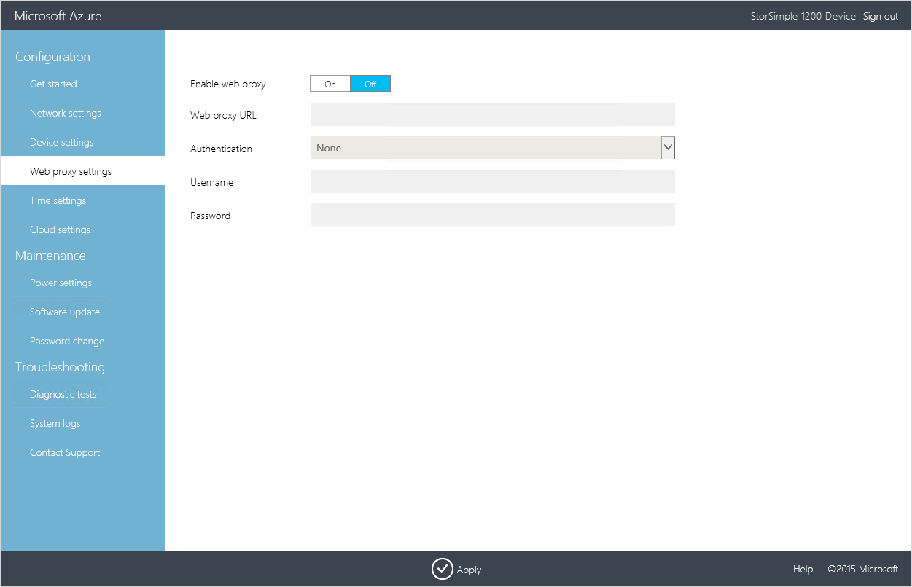

<properties 
   pageTitle="StorSimple virtuelle Array iSCSI-Server-Setup | Microsoft Azure"
   description="Beschreibt das Ausführen von ersteinrichtung, Ihre StorSimple iSCSI-Server registrieren und Geräte-Einrichtung."
   services="storsimple"
   documentationCenter="NA"
   authors="alkohli"
   manager="carmonm"
   editor="" />
<tags 
   ms.service="storsimple"
   ms.devlang="NA"
   ms.topic="article"
   ms.tgt_pltfrm="NA"
   ms.workload="TBD"
   ms.date="07/18/2016"
   ms.author="alkohli" />

# Bereitstellen von StorSimple virtuellen Array – Einrichten des virtuellen Geräts als iSCSI-Server

## (Übersicht)

In diesem Lernprogramm Bereitstellung gilt der Microsoft Azure StorSimple Virtual Array (auch bekannt als StorSimple lokale virtuelle Gerät oder dem StorSimple virtuelle Gerät) laufenden März 2016 allgemeine Verfügbarkeit (GA) Version aus. In diesem Lernprogramm beschrieben, wie Sie ersteinrichtung ausführen, Registrieren Ihres StorSimple iSCSI-Servers, schließen Sie das Gerät-Setup, und klicken Sie dann erstellen, bereitstellen, Initialisierung und formatieren Datenträger Ihres StorSimple virtuelles Gerät iSCSI-Servers. Die StorSimple Installationsinformationen finden Sie in diesem Artikel gilt nur für StorSimple virtuelle Matrizen zurück. 

Die beschriebenen Verfahren werden hier ungefähr 30 Minuten dauern, 1 Stunde bei ausführen. Die Informationen in diesem Artikel veröffentlicht gilt nur für StorSimple virtuelle Matrizen zurück.

## Voraussetzungen für die Einrichtung

Bevor Sie konfigurieren, und Sie Ihr StorSimple virtuelle Gerät richten, stellen Sie Folgendes sicher:

- Sie haben ein virtuelles Gerät bereitgestellt und damit verbundene in [Bereitstellen StorSimple virtuelle Array - Bereitstellen von virtuelles Array in Hyper-V](storsimple-ova-deploy2-provision-hyperv.md) oder [Bereitstellen StorSimple virtuelle Array - Bereitstellen von virtuelles Array in VMware](storsimple-ova-deploy2-provision-vmware.md)beschriebenen.

- Sie müssen der Dienst Registrierungsschlüssel vom StorSimple-Manager-Dienst, den Sie zum Verwalten von StorSimple virtuelle Geräte erstellt haben. Weitere Informationen finden Sie unter **Schritt2: Abrufen der Dienst Registrierungsschlüssel** in [Bereitstellen StorSimple virtuelle Array - im Portal vorbereiten](storsimple-ova-deploy1-portal-prep.md#step-2-get-the-service-registration-key).

- Ist dies der zweiten oder nachfolgenden virtuelles Gerät, das Sie mit einem vorhandenen StorSimple-Manager-Dienst registriert sind, sollten Sie den Dienst Datenschlüssel verfügen. Dieser Schlüssel wurde generiert, wenn das erste Gerät mit diesem Dienst erfolgreich registriert wurde. Wenn Sie diese Key verloren haben, finden Sie unter [Verwenden der Web-Benutzeroberfläche zum Verwalten Ihrer StorSimple Virtual Array](storsimple-ova-web-ui-admin.md#get-the-service-data-encryption-key) **den Dienst Daten Verschlüsselungsschlüssel abrufen** .

## Schrittweise einrichten 

Verwenden Sie die folgenden Schritte zum Einrichten und Konfigurieren des StorSimple virtuellen Geräts aus:

-  [Schritt 1: Schließen Sie die Einrichtung der lokalen Web-Benutzeroberfläche und Registrieren von Ihrem Gerät](#step-1-complete-the-local-web-ui-setup-and-register-your-device)
-  [Schritt 2: Führen Sie die erforderlichen Geräte-Einrichtung](#step-2-complete-the-required-device-setup)
-  [Schritt 3: Hinzufügen eines Datenträgers](#step-3-add-a-volume)
-  [Schritt 4: Bereitstellen, Initialisierung und formatieren Sie einen Datenträger](#step-4-mount-initialize-and-format-a-volume)  

## Schritt 1: Schließen Sie die Einrichtung der lokalen Web-Benutzeroberfläche und Registrieren von Ihrem Gerät 

#### Schließen Sie die Einrichtung und das Gerät zu registrieren

1. Öffnen Sie ein Browserfenster und Herstellen einer Verbindung mit der Web-Benutzeroberfläche eingeben:

    `https://<ip-address of network interface>`

    Verwenden Sie die im vorherigen Schritt erwähnt Verbindungs-URL ein. Es wird einen Fehler, die Sie darüber informiert, dass es ein Problem mit dem Sicherheitszertifikat der Website liegt angezeigt. Klicken Sie auf **Weiter, um diese Webseite**.

    

2. Melden Sie sich bei der Web-Benutzeroberfläche des virtuellen Geräts als **StorSimpleAdmin**. Geben Sie das Gerät Administratorkennwort, das geändert, in Schritt 3: virtuelle Gerät [Bereitstellen StorSimple Virtual Array - Bereitstellen einer virtuellen Hyper-V-Gerät](storsimple-ova-deploy2-provision-hyperv.md) oder [Bereitstellen StorSimple Virtual Array - Bereitstellen einer virtuellen VMware-Gerät](storsimple-ova-deploy2-provision-vmware.md)starten.

    

3. Sie werden auf **der Startseite** weitergeleitet werden. Diese Seite beschreibt die verschiedenen Einstellungen für das Konfigurieren und registrieren virtuelle Gerät mit dem Dienst StorSimple Manager erforderlich. Beachten Sie, dass die **Netzwerk-Einstellungen**, **Proxyeinstellungen Web**und **Zeit Einstellungen** optional sind. Die einzigen erforderlichen Einstellungen sind **Gerät unter** und **Cloud-Einstellungen**.

    

4. Klicken Sie auf der Seite **Einstellungen im Netzwerk** unter **Netzwerk-Schnittstellen**werden Daten 0 automatisch für Sie konfiguriert werden. Jedes Netzwerk-Benutzeroberfläche standardmäßig festgelegt ist, eine IP-Adresse automatisch abrufen (DHCP). Daher werden automatisch eine IP-Adresse, Subnetz und Gateway (für IPv4 und IPv6) zugewiesen werden.

    Wie Sie Ihr Gerät als iSCSI-Server (zur Bereitstellung von blockieren-Speicher) bereitstellen möchten, empfehlen wir, dass Sie die **erste IP-Adresse automatisch** Option deaktivieren und statische IP-Adressen konfigurieren.

    

    Wenn Sie mehr als eine Schnittstelle während der Bereitstellung des Geräts hinzugefügt haben, können Sie sie hier konfigurieren. Beachten Sie, dass Sie Ihre Netzwerk-Oberfläche als IPv4 nur oder als IPv4 und IPv6 konfigurieren können. IPv6-nur Konfigurationen werden nicht unterstützt.

5. DNS-Server sind erforderlich, da sie verwendet werden, wenn Ihr Gerät versucht, zur Kommunikation mit der Cloud-Speicher-Dienstanbieter oder auf Ihrem Gerät anhand des Namens zu beheben, wenn es als Dateiserver konfiguriert ist. Klicken Sie auf der Einstellungsseite **Netzwerk** unter den **DNS-Server**:

    1. Ein primärer und sekundärer DNS-Server wird automatisch konfiguriert. Falls gewünscht statische IP-Adressen konfigurieren, können Sie DNS-Server angeben. Für eine hohe Verfügbarkeit wird empfohlen, dass Sie einen primären und einen sekundären DNS-Server konfigurieren.

    2. Klicken Sie auf **Übernehmen**. Dies anwenden, und überprüfen die Einstellungen im Netzwerk.

6. Klicken Sie auf der Seite **Einstellungen für Audiogeräte** :

    1. Weisen Sie einen eindeutigen **Namen** auf Ihr Gerät aus. Dieser Name kann 1-15 Zeichen sein und kann Buchstaben, Zahlen und Bindestriche enthalten.

    2. Klicken Sie auf das Symbol **iSCSI-Server**  für den **Typ** des Geräts, die Sie erstellen. Ein iSCSI-Server ermöglicht Ihnen zu blockieren-Speicher bereitzustellen.

    3. Geben Sie an, wenn Sie dieses Gerät Domäne hinzugefügt werden soll. Wenn Ihr Gerät ein iSCSI-Server ist, ist die Teilnahme klicken Sie dann auf der Domäne optional. Wenn Sie Ihre iSCSI-Server nicht zu einer Domäne hinzufügen möchten, klicken Sie auf **Übernehmen**, warten Sie, bis die Einstellungen werden angewendet, und fahren Sie mit dem nächsten Schritt fort.

        Wenn Sie das Gerät zu einer Domäne hinzufügen möchten. Geben Sie einen **Domänennamen ein**, und klicken Sie dann auf **Übernehmen**.

        > [AZURE.NOTE] Wenn Ihre iSCSI-Server einer Domäne beitritt, sicherstellen Sie, dass Ihre virtuelle Array in einem eigenen (Organisationseinheit) für Microsoft Azure Active Directory und keine Gruppenrichtlinienobjekte (Gruppenrichtlinienobjekt) angewendet werden.

    5. Es wird ein Dialogfeld angezeigt. Geben Sie Ihre Domänenanmeldeinformationen, in dem angegebenen Format. Klicken Sie auf das Symbol "Überprüfen" . Die Anmeldeinformationen für die Domäne werden überprüft werden. Sie werden eine Fehlermeldung angezeigt, wenn die Anmeldeinformationen nicht korrekt sind.

        

    6. Klicken Sie auf **Übernehmen**. Dies anwenden, und überprüfen die Einstellungen für Audiogeräte.
 
7. Konfigurieren Sie den Webproxyserver (optional). Achten Sie darauf, wenn Sie einen Webproxy verwenden, nur es so konfigurieren können, Web Proxy-Konfiguration ist optional.

    

    Klicken Sie auf der Seite **WebProxy** :

    1. Stellen Sie den **Web Proxy-URL** in diesem Format: *http://host-IP Adresse* oder *FDQN:Port-Nummer*. Beachten Sie, dass HTTPS-URLs nicht unterstützt werden.

    2. Geben Sie als **einfacher** oder **keine** **Authentifizierung** an.

    3. Wenn Sie die Authentifizierung verwenden, müssen Sie einen **Benutzernamen** und **ein Kennwort**angeben.

    4. Klicken Sie auf **Übernehmen**. Dies überprüfen und die Proxyeinstellungen konfiguriert Web anwenden.
 
8. (Optional) Konfigurieren der Zeit-Einstellungen für Ihr Gerät, beispielsweise die Zeitzone und den primären und sekundären NTP-Servern. NTP-Server sind erforderlich, da Zeit, damit sie mit der Cloud-Dienstanbieter authentifizieren kann Ihrem Gerät synchronisiert werden muss.

    

    Klicken Sie auf der Einstellungsseite **Uhrzeit** :

    1. Wählen Sie aus der Dropdownliste die **Zeitzone** basierend auf die geografische Position in der das Gerät bereitgestellt wird. Die Standardzeitzone für Ihr Gerät ist PST-Datei. Ihr Gerät wird dieser Zeitzone für alle geplanten Vorgängen verwendet werden.

    2. Geben Sie einen **primären NTP-Server** für Ihr Gerät, oder akzeptieren Sie den Standardwert time.windows.com. Stellen Sie sicher, dass Ihr Netzwerk NTP Datenverkehr aus Datencenters weitergeleitet werden soll, mit dem Internet zulässt.

    3. Geben Sie optional eine **sekundäre NTP-Server** für Ihr Gerät aus.

    4. Klicken Sie auf **Übernehmen**. Diese überprüfen, und die konfigurierten Zeit Einstellungen angewendet.

9. Konfigurieren Sie die Cloud-Einstellungen für Ihr Gerät. In diesem Schritt Sie schließen Sie die Konfiguration für lokale Geräte und anschließend das Gerät mit Ihrem Dienst StorSimple Manager registrieren.

    1. Geben Sie den **Dienst Registrierungsschlüssel** , die Sie in Ihrem System **Schritt2: Abrufen der Dienst Registrierungsschlüssel** in [Bereitstellen StorSimple virtuelle Array - im Portal vorbereiten](storsimple-ova-deploy1-portal-prep.md#step-2-get-the-service-registration-key).

    2. Wenn dies nicht dem ersten Gerät, das Sie für diesen Dienst registrieren ist, müssen Sie den **Dienst Daten Verschlüsselungsschlüssels**bereitstellen. Dieser Schlüssel ist mit der Dienst Registrierungsschlüssel registrieren zusätzliche Geräte mit dem Dienst StorSimple Manager erforderlich. Weitere Informationen finden Sie unter [Abrufen der Schlüssel Dienst Daten](storsimple-ova-web-ui-admin.md#get-the-service-data-encryption-key) auf Ihrem lokalen Web-Benutzeroberfläche.

    3. Klicken Sie auf **Registrieren**. Dadurch wird das Gerät neu gestartet. Möglicherweise müssen Sie warten, 2-3 Minuten anzugeben, bevor Sie das Gerät erfolgreich registriert ist. Nachdem das Gerät neu gestartet wurde, wird der Anmeldeseite geöffnet werden.

       

10. Klassische Azure-Portal zurück. Klicken Sie auf der Seite **Geräte** stellen Sie sicher, dass das Gerät zum Dienst erfolgreich eine Verbindung hergestellt hat, durch den Status nachschlagen. Der Gerätestatus sollte **aktiv**sein.

    

## Schritt 2: Führen Sie die erforderlichen Geräte-Einrichtung

Wenn Sie die die Gerätekonfiguration von Ihrem Gerät StorSimple abgeschlossen haben, müssen Sie:

- Wählen Sie ein Speicherkonto auf Ihrem Gerät zuordnen.

- Wählen Sie die Verschlüsselung der Einstellungen für die Daten, die gesendet wird, in die cloud aus.

Führen Sie die folgenden Schritte aus, im klassischen Azure-Portal zum Abschließen der erforderlichen Gerät.

#### Zum Abschließen der minimalen Gerät

1. Wählen Sie das Gerät, das Sie gerade erstellt haben, klicken Sie auf der Seite **Geräte** . Dieses Gerät würde als **aktiv**angezeigt. Klicken Sie auf dem Pfeil neben den Namen des Geräts, und klicken Sie dann auf **Schnellstart**.

    

2. Klicken Sie auf die **vollständige Einrichtung einrichten** , um den Assistenten zum Konfigurieren von Geräten zu starten.

    

3. Folgendermaßen Sie im Assistenten zum Konfigurieren-Geräten auf der Einstellungsseite **Grundlegende** vor:

   1. Geben Sie ein Speicherkonto mit Ihrem Gerät verwendet werden. Abonnement können Sie ein vorhandene Speicherkonto aus der Dropdownliste auswählen, oder Sie können angeben, dass **Weitere hinzufügen** , um ein Konto in ein anderes Abonnement auswählen.

   2. Definieren Sie die Einstellungen für Verschlüsselung für alle Daten statisch sind, die in der Cloud gesendet werden sollen. (StorSimple verwendet AES-256-Verschlüsselung.) Aktivieren Sie das Kontrollkästchen **Cloud-Speicher-Verschlüsselung aktivieren** , um die Daten zu verschlüsseln. Geben Sie eine Cloud-Speicher Verschlüsselung, die 32 Zeichen enthält. Geben Sie die Taste zur Bestätigung erneut ein.

   3. Klicken Sie auf das Symbol "Überprüfen" .

    

    Die Einstellungen werden jetzt aktualisiert. Nachdem Einstellungen erfolgreich aktualisiert wurden, werden die vollständige Einrichtung Setup-Schaltfläche nicht verfügbar. Sie zu der Seite auf Geräte **Schnellstart** zurückgegeben werden kann.                                                        

>[AZURE.NOTE]Sie können alle anderen Gerät-Einstellungen zu einem beliebigen Zeitpunkt ändern, durch den Zugriff auf der Seite **Konfigurieren** .

## Schritt 3: Hinzufügen eines Datenträgers

Führen Sie die folgenden Schritte aus, im klassischen Azure-Portal auf einen Datenträger zu erstellen.

#### So erstellen Sie einen Datenträger

1. Klicken Sie auf der Seite Geräte für **Schnellstart** **hinzufügen einen Datenträger**aus. Hierdurch wird den Lautstärke Assistenten hinzufügen.

2. Hinzufügen eines Assistenten Lautstärke, klicken Sie unter **Grundlegende Einstellungen**führen Sie folgende Schritte aus:

    1. Geben Sie einen eindeutigen Namen für die Lautstärke ein. Der Name muss eine Zeichenfolge sein, die 3 bis 127 Zeichen enthält.

    2. Geben Sie eine Beschreibung für die Lautstärke ein. Die Beschreibung kann Ihnen helfen, die Lautstärke Besitzer zu identifizieren.

    3. Wählen Sie einen Verwendungstyp für den Datenträger aus. Verwendung sind möglich **Tiered Lautstärke** oder **lokal angehefteten Lautstärke.** (**Tiered Lautstärke** ist der Standardwert.) Wählen Sie für die Last, die lokale Garantien, niedrige Wartezeiten und bessere Leistung erfordern, **lokal angehefteten** **Lautstärke**ein. Wählen Sie für alle anderen Daten **Tiered** **Lautstärke**ein.

        Ein lokales angeheftete Volume Linienstärke bereitgestellt wird, und es wird sichergestellt, dass die primären Daten in die Lautstärke auf dem Gerät bleibt und werden nicht in der Cloud Effekts. Wenn Sie ein lokales angeheftete Volume erstellen, wird das Gerät verfügbarer Speicherplatz auf den lokalen Ebenen auf einen Datenträger angeforderten Größe bereitstellen überprüfen. Erstellen eines lokal angehefteten Datenträgers möglicherweise Zwischenspeichern von vorhandenen Daten aus dem Gerät in der Cloud, und die Verarbeitungszeit für die Lautstärke erstellen möglicherweise lang sein. Die Gesamtzeit, hängt von der Größe der bereitgestellte Lautstärke, verfügbaren Bandbreite und die Daten auf Ihrem Gerät.

        Eine gestufte Lautstärke andererseits Thin Provisioning zulässig ist und sehr schnell erstellt werden kann. Wenn Sie eine gestufte Lautstärke erstellen, etwa 10 % des Speicherplatzes auf der lokalen Ebene bereitgestellt wird, und 90 % des Speicherplatzes wird nach der Bereitstellung in der Cloud. Angenommen, wenn Sie einen Datenträger 1 TB bereitgestellt, 100 GB würde im lokalen Raum befinden und 900 GB in der Cloud verwendet werden sollte bei der Datenebenen. Dies bedeutet wiederum ist, wenn Sie alle im lokalen Speicherplatz auf dem Gerät ausführen können nicht Sie eine gestufte Freigabe bereitstellen, (weil die 10 % nicht zur Verfügung stehen).

    4. Geben Sie die bereitgestellte Kapazität für die Lautstärke ein. Beachten Sie, dass die angegebene Kapazität kleiner als die Kapazität verfügbar sein soll. Wenn Sie eine gestufte Lautstärke erstellen, sollte die Größe zwischen 500 GB und 5 TB sein. Geben Sie für einen lokal angeheftete Datenträger eine Größe Lautstärke zwischen 50 und 500 GB. Verwenden Sie die verfügbare Kapazität als Leitfaden für die Bereitstellung eines Datenträgers aus. Wenn Sie nicht zulässig sein soll, lokal angeheftete oder gestufte Datenträgers bereitstellen die verfügbare lokale Kapazität 0 GB ist.

        

    5. Klicken Sie auf das Pfeilsymbol  um zur nächsten Seite zu wechseln.

3. Fügen Sie einen neuen Eintrag für Access-Steuerelement (ACR), klicken Sie auf der Seite **Zusätzliche Einstellungen** :

    1. Geben Sie einen **Namen** für Ihre ACR ein.

    2. Geben Sie unter **iSCSI Initiatornamen**, die iSCSI qualifizierte Namen (IQN) von Ihrem Windows-Host. Wenn Sie keine der IQN haben, wechseln Sie zu [Anhang A: Abrufen der IQN eines Windows Server-Hosts](#appendix-a-get-the-iqn-of-a-windows-server-host).

    3. Es empfiehlt sich, dass Sie eine Sicherungskopie der standardmäßigen aktivieren, indem Sie **eine Sicherungskopie der Standardwert für dieses Volume aktivieren** das Kontrollkästchen. Die Standardeinstellungen für die Sicherung wird eine Richtlinie erstellen, die ausgeführt wird, um jeden Tag (Gerätezeit) 22:30 und erstellt eine Momentaufnahme der Cloud von diesem Handbuch.

        

    4. Klicken Sie auf das Symbol "Überprüfen" . Hierdurch wird im Auftrag zum Volume erstellen. Eine Fortschritt Nachricht ähnlich wie der folgende wird angezeigt.

        

        Ein Datenträger wird mit der angegebenen Einstellungen erstellt werden. Standardmäßig werden für die Überwachung und Sicherung für die Lautstärke aktiviert sein.

    5. Um zu bestätigen, dass die Lautstärke erfolgreich erstellt wurde, wechseln Sie zu der Seite **Datenmengen** . Sie sollten die Lautstärke aufgeführt sehen.

        

## Schritt 4: Bereitstellen, Initialisierung und formatieren Sie einen Datenträger

Führen Sie die folgenden Schritte zum Bereitstellen, Initialisierung und formatieren Ihre StorSimple Datenmengen auf einem Windows Server-Host ein.

#### Bereitstellen, Initialisierung und formatieren einen Datenträger

1. Starten Sie den Microsoft iSCSI Initiator.

2. Klicken Sie im Fenster **iSCSI Initiatoreigenschaften** auf der Registerkarte **Suche** auf **Portal ermitteln**.

    

3. Klicken Sie im Dialogfeld **Ermitteln Target Portal** Geben Sie die IP-Adresse Ihre iSCSI aktivierten Netzwerk-Oberfläche an, und klicken Sie dann auf **OK**.

    

4. Suchen Sie im Fenster **iSCSI Initiatoreigenschaften** auf der Registerkarte **Ziele** der **ermittelte Ziele**aus. (Jedes Volume wird ein ermittelten Ziel sein.) Der Gerätestatus sollte als **inaktiv**angezeigt werden.

    

5. Wählen Sie ein Zielgerät, und klicken Sie dann auf **Verbinden**. Nachdem das Gerät angeschlossen ist, sollte der Status auf **verbunden**ändern. (Weitere Informationen zu den Microsoft iSCSI Initiator verwenden, finden Sie unter [Installieren und Konfigurieren von Microsoft iSCSI Initiator] [1].

    

6. Klicken Sie auf Ihrem Windows-Host drücken Sie die Windows-Logo-Taste + X, und klicken Sie dann auf **Ausführen**.

7. Geben Sie **im Dialogfeld** **Diskmgmt.msc**aus. Klicken Sie auf **OK**, und das Dialogfeld **Datenträger Verwaltung** wird angezeigt. Im rechte Bereich wird die Datenmengen auf dem Host angezeigt werden.

8. Im Fenster **Datenträger Verwaltung** werden der aktivierten Datenträger angezeigt, wie in der folgenden Abbildung gezeigt. Mit der rechten Maustaste in der ermittelten Lautstärke (klicken Sie auf den Datenträgernamen), und klicken Sie dann auf **Online**.

    

9. Mit der rechten Maustaste, und wählen Sie **Die Initialisierung**.

    

10. Klicken Sie im Dialogfeld Wählen Sie die Laufwerke Initialisierung, und klicken Sie dann auf **OK**.

    

11. Die neuen einfachen Datenträger-Assistent wird gestartet. Wählen Sie eine Größe aus, und klicken Sie dann auf **Weiter**.

    

12. Zuweisen eines Laufwerkbuchstabens die Lautstärke, und klicken Sie dann auf **Weiter**.

    

13. Geben Sie die Parameter zum Formatieren des Datenträgers aus. **Unter Windows Server wird nur NTFS unterstützt.** Legen Sie die AUS auf 64K. Geben Sie eine Bezeichnung für die Lautstärke ein. Es ist empfiehlt es sich für diesen Namen mit dem Namen Lautstärke identisch sein, die Sie auf Ihrem StorSimple virtuelle Gerät bereitgestellt. Klicken Sie auf **Weiter**.

    

14. Überprüfen Sie die Werte für die Lautstärke, und klicken Sie dann auf **Fertig stellen**.

    

    Der Datenträger werden auf der Seite **Datenträger Verwaltung** als **Online** angezeigt.

    

## Nächste Schritte

Informationen Sie zum Verwenden des lokalen Web-Benutzeroberfläche zum [Verwalten Ihrer StorSimple Virtual Array](storsimple-ova-web-ui-admin.md).

## Anhang A: Abrufen der IQN eines Windows Server-Hosts

Gehen Sie folgendermaßen vor, um die iSCSI erhalten qualifizierte Namen (IQN) von einem Windows-Host, Windows Server 2012 ausgeführt wird.

#### Zum Abrufen der IQN von einem Windows-host

1. Starten Sie den Microsoft iSCSI Initiator auf Ihrem Windows-Host ein.

2. Im Fenster **iSCSI Initiatoreigenschaften** auf der Registerkarte **Konfiguration** wählen Sie aus, und kopieren Sie die Zeichenfolge aus dem Feld **Initiatornamen** .

    

2. Speichern Sie diese Zeichenfolge an.

<!--Reference link-->
[1]: https://technet.microsoft.com/library/ee338480(WS.10).aspx

