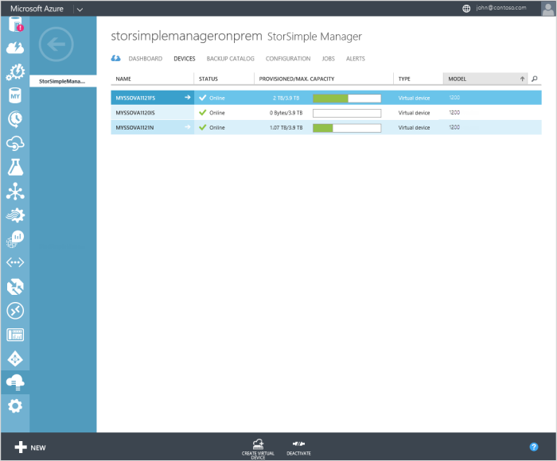
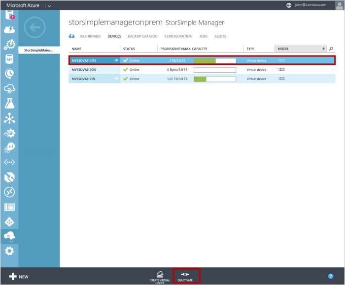
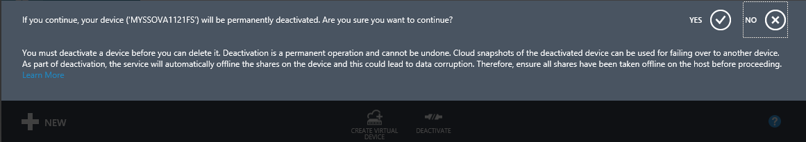
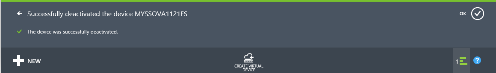
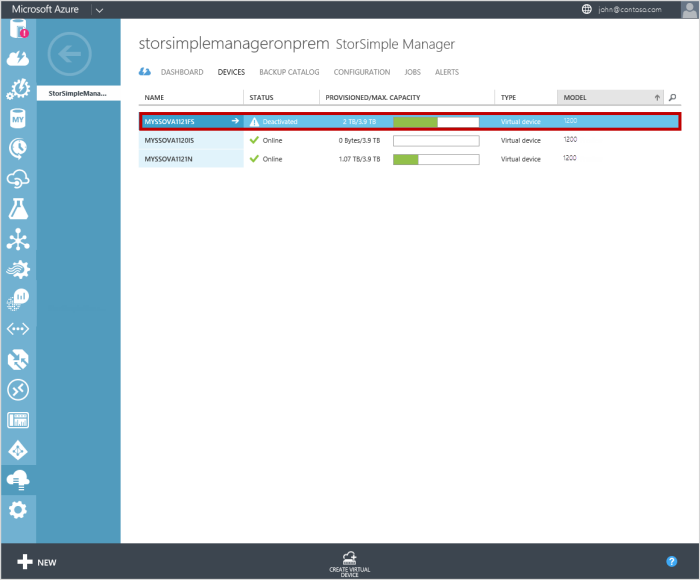
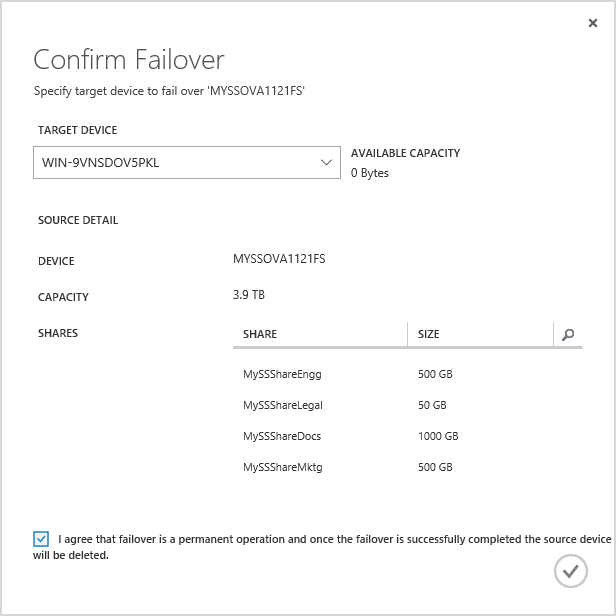
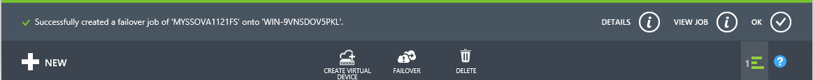
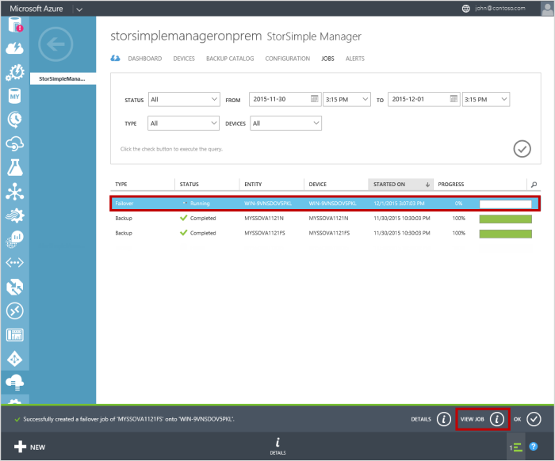
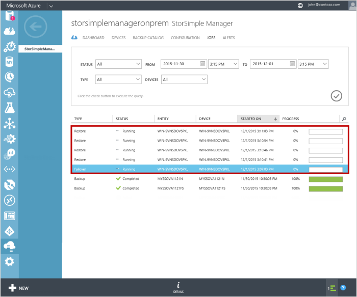
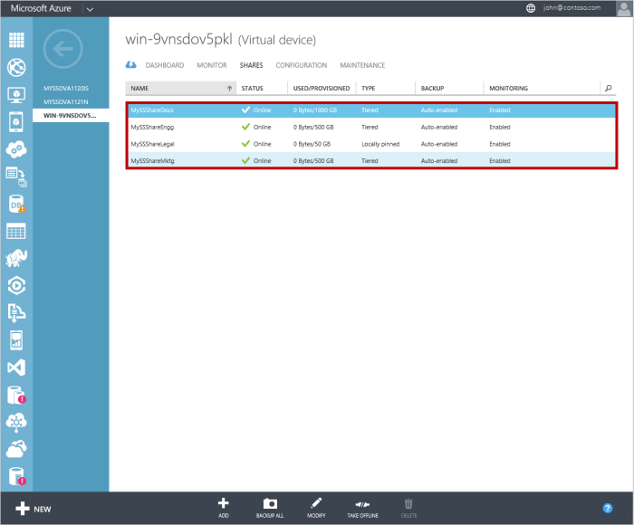

<properties
   pageTitle="Disaster Wiederherstellung und Gerät Failover für Ihre virtuelle StorSimple-Matrix"
   description="Weitere Informationen zum Failover Ihrer StorSimple Virtual Array."
   services="storsimple"
   documentationCenter="NA"
   authors="alkohli"
   manager="carmonm"
   editor=""/>

<tags
   ms.service="storsimple"
   ms.devlang="NA"
   ms.topic="article"
   ms.tgt_pltfrm="NA"
   ms.workload="NA"
   ms.date="06/07/2016"
   ms.author="alkohli"/>

# Disaster Wiederherstellung und Gerät Failover für Ihre virtuelle StorSimple-Matrix

## (Übersicht)

In diesem Artikel werden die detaillierten Schritte erforderlich, um nach einem Ausfall an ein anderes virtuelle Gerät über fehlschlagen einschließlich die Wiederherstellung für Ihr Microsoft Azure StorSimple virtuelle Array (auch bekannt als StorSimple lokale virtuelle Gerät). Ein Failover können Sie Ihre Daten auf einem Gerät *Quelle* im Datencenter an *ein anderes Gerät, befindet sich in der gleichen oder einem anderen geographischen Standort* migrieren. Das Gerät Failover ist für das gesamte Gerät. Während des Failovers ändert die Cloud-Daten für das Quellgerät Besitzrechte an der das Gerät an.

Geräte-Failover wird über die Funktion Disaster Wiederherstellung (DR) koordiniert und initiiert von der Seite **Geräte** . Diese Seite jeder andere Wert zeigt alle StorSimple Geräte mit dem Dienst StorSimple Manager verbunden ist. Für jedes Gerät werden der Anzeigename, Status, bereitgestellten und maximale Kapazität, Typ und Modell angezeigt.

In diesem Artikel gilt nur für StorSimple virtuelle Matrizen zurück. Wenn Sie über ein Gerät 8000-Serie ein Fehler auftreten, besuchen Sie [Failover und Wiederherstellung von Ihrem Gerät StorSimple](storsimple-device-failover-disaster-recovery.md).

## Was ist die Wiederherstellung?

In einem Szenario zur Wiederherstellung (DR) nach funktioniert der primären Geräts nicht mehr. In diesem Fall können Sie die Gerät an ein anderes Gerät zugeordneten sind, indem der primären Geräts als *Datenquelle* verwenden und ein anderes Gerät als *Ziel*Cloud Daten verschieben. Dieses Verfahren wird als *Failover*bezeichnet. Bei einem Failover alle Datenträger oder die Freigaben vom Quellgerät Besitz ändern und an das Gerät übertragen. Keine Filterung der Daten ist zulässig.

DR wird als eine vollständige Gerät wiederherstellen Heat Map – basierte Stufen verwenden und Nachverfolgen von erstellt. Ein wärmebilds wird definiert, indem Sie die Daten in Abhängigkeit einer Heizwert zuweisen aktivieren lesen und Schreiben von Mustern. Diese Wärme zuordnen dann Ebenen die niedrigsten Wärme Datenblöcke in der Cloud zuerst Beibehaltung der Datenblöcke hoher Wärme (am häufigsten verwendeten) in der lokalen Ebene. Während einer DR wird die wärmebilds verwendet, um wieder her, und aktivieren die Daten aus der Cloud. Das Gerät alle Datenmengen/Freigaben in der letzten zuletzt verwendete Sicherung abgerufen, (wie intern festgelegt) und führt eine Wiederherstellung aus, dass die Sicherung. Der gesamte DR-Prozess wird durch das Gerät koordiniert.

## Erforderliche Komponenten für Geräte-failover

### Erforderliche Komponenten

Für alle Geräte-Failover sollte die folgenden Vorkenntnisse erfüllt sein:

- Das Quellgerät muss sich in einem Zustand **Deactivated** befinden.

- Das Gerät muss in der klassischen Azure-Portal als **aktiv** angezeigt. Sie müssen ein Ziel virtuelle Gerät die gleiche oder eine höhere Kapazität bereit. Sie sollten dann das lokale Web-Benutzeroberfläche konfigurieren und erfolgreich registriert virtuelle Gerät verwenden.

    > [AZURE.IMPORTANT] Führen Sie das registrierte virtuelle Gerät über den Dienst zu konfigurieren, indem Sie auf die **vollständige Einrichtung einrichten**. Keine Konfiguration des Geräts sollte über den Dienst ausgeführt werden.

- Das Gerät Quell- und Zielwebsites müssen vom gleichen Typ sein. Sie können nur über ein virtuelles Gerät als Dateiserver zu einem anderen Dateiserver konfiguriert fehl. Dasselbe gilt für ein iSCSI-Server.

- Für eine Dateiserver DR empfehlen wir, dass das Gerät mit derselben Domäne wie der Quelle zu verknüpfen, damit die Freigabeberechtigungen automatisch aufgelöst werden. Nur das Failover an ein Gerät in der gleichen Domäne wird in dieser Version unterstützt.

### Weitere Überlegungen

- Es empfiehlt sich, dass Sie die Datenmengen oder Freigaben auf dem Quellgerät ausführen.

- Wenn sie einem geplanten Failover ist, wird empfohlen, die Sie erstellen Sie eine Sicherungskopie des Geräts, und passen Sie dann mit der Failover Datenverluste zu minimieren. Wenn es einer ungeplanten Failover ist, wird die letzte Sicherung das Gerät wiederherstellen verwendet werden.

- Die verfügbaren Zielgeräte für DR sind Geräte, die die gleiche oder größere Kapazität im Vergleich zu dem Quellgerät aufweisen. Die Geräte, die mit dem Dienst verbunden sind, aber nicht die Kriterien der ausreichend Platz erfüllen verfügbar als Zielgeräte nicht.

### DR prechecks

Vor Beginn die DR werden Prechecks auf dem Gerät ausgeführt. Diese Prüfungen können Sie sicherstellen, dass keine Fehler auftreten können, wenn DR beginnt. Die Prechecks umfassen:

- Überprüfen von Speicher-Konto

- Aktivieren die Cloud-Verbindung zu Azure

- Prüfen des verfügbaren Speicherplatzes auf dem Zielgerät

- Überprüfen, ob ein iSCSI-Server Quellgerät gültige ACR Namen hat, die Datenmengen IQN (nicht mehr als 220 Zeichen lang), und das Kennwort für CHAP (12 und 16 Zeichen lang) zugeordnet

Eines der obigen Prechecks fehlschlagen, kann nicht mit dem DR fortgesetzt werden. Sie müssen diese Probleme zu beheben, und wiederholen Sie dann auf DR.

Nachdem die DR erfolgreich abgeschlossen ist, ist das Eigentum an die Cloud-Daten auf dem Quellgerät an das Gerät übertragen. Das Quellgerät ist dann nicht mehr im Portal verfügbar. Zugriff auf alle Datenmengen/Freigaben auf dem Quellgerät ist gesperrt, und das Gerät aktiviert wird.

> [AZURE.IMPORTANT]
> 
> Obwohl das Gerät nicht mehr verfügbar ist, ist der virtuellen Computern, die nach der Bereitstellung auf dem Host-System weiterhin Ressourcen in Anspruch. Sobald die DR erfolgreich abgeschlossen ist, können Sie von Ihrem Hostsystem dieses virtuellen Computers löschen.

## Über die in einem Array virtuelle fehl

Es empfiehlt sich, dass Sie ein anderes StorSimple virtuelle Array nach der Bereitstellung, über der lokalen Web-Benutzeroberfläche konfiguriert und mit dem StorSimple-Manager-Dienst, bevor Sie dieses Verfahren ausführen registriert haben.

> [AZURE.IMPORTANT]
> 
> - Sie sind nicht zulässig, von einem StorSimple 8000 Reihe Gerät zu einem 1200 virtuellen Gerät über fehlschlägt.
> - Sie können von einem Federal Information Processing Standard (FIPS) aktiviert virtuellen Gerät Government-Portal zu einem virtuellen Gerät Azure klassischen Portal bereitgestellt über fehl. Auch Fall im umgekehrten gilt.

Führen Sie die folgenden Schritte aus, um das Gerät zu einem Ziel StorSimple virtuellen Gerät wiederherzustellen.

1. Nehmen Sie offline Datenmengen/Freigaben auf dem Host in Anspruch. Schlagen Sie in den Betriebssystem-spezifische Anweisungen auf dem Host die Datenmengen/Freigaben offline zu schalten. Wenn Sie nicht bereits offline, müssen Sie alle Datenmengen/Freigaben offline auf dem Gerät ausführen, indem Sie zu **Geräte > Freigaben** (oder **Gerät > Datenmengen**). Wählen Sie einen freigeben/Datenträger aus, und klicken Sie auf den unteren Rand der Seite **offline schalten** . Wenn Sie zur Bestätigung aufgefordert werden, klicken Sie auf **Ja**. Wiederholen Sie diesen Vorgang für alle Freigaben/Datenträger auf dem Gerät aus.

2. Klicken Sie auf der Seite **Geräte** wählen Sie das Quellgerät für Failover aus, und klicken Sie auf **Deaktivieren**. 
    

3. Sie werden zur Bestätigung aufgefordert werden. Gerät Deaktivierung umfasst permanent, die rückgängig gemacht werden kann. Sie werden auch daran erinnert, Ihre Freigaben/Datenträger offline auf dem Host ausführen.

    

3. Nach der Bestätigung wird die Deaktivierung gestartet. Nachdem die Deaktivierung erfolgreich abgeschlossen wurde, werden Sie benachrichtigt.

    

4. Klicken Sie auf der Seite **Geräte** wird der Gerät Zustand jetzt in **Deactivated**ändern.

    

5. Wählen Sie das deaktivierte Gerät aus, und klicken Sie am unteren Rand der Seite, auf **Failover**.

6. Folgendermaßen Sie in den bestätigen Failover-Assistenten, der angezeigt wird vor:

    1. Wählen Sie in der Dropdown-Liste der verfügbaren Geräte ein **Zielgerät.** Nur die Geräte, die über ausreichend Kapazität verfügen, werden in der Dropdownliste angezeigt.

    2. Überprüfen Sie die Details der Quellgerät, beispielsweise Gerätename, total Kapazität und die Namen der Freigaben, die über einen Fehler beim werden werden zugeordnet.

        

7. Aktivieren Sie **ich stimmen Failover ist ein endgültiger Vorgang und nach dem erfolgreichen Abschluss der Quellgerät wird gelöscht**.

8. Klicken Sie auf das Symbol Kontrollkästchen .

9. Ein Failover Auftrag wird eingeleitet, und Sie werden benachrichtigt. Klicken Sie auf die **Position der Ansicht** , um das Failover zu überwachen.

    

10. Auf der Seite **Aufträge** sehen Sie einen Failover Auftrag für das Quellgerät erstellt. Dieser Auftrag führt die DR Prechecks.

    

    Nachdem die DR Prechecks erfolgreich sind, wird der Auftrag Failover Wiederherstellungsaufträge für jeden freigeben/Datenträger erzeugen, die auf Ihrem Quellgerät vorhanden ist.

    

11. Wechseln Sie zur Seite **Geräte** aus, nach dem Abschluss der.

    ein. Wählen Sie das virtuelle StorSimple-Gerät, das als das Gerät für des Failovervorgangs verwendet wurde.

    b. Wechseln Sie zur Seite **Freigaben** (oder **Datenmengen** Wenn iSCSI-Server). Alle Freigaben (Datenmengen) aus dem alten Gerät sollte jetzt aufgeführt sein.
    
    

**Video verfügbar**

In diesem Video wird veranschaulicht, wie Sie über ein StorSimple lokalen virtuelles Gerät an ein anderes virtuelle Gerät ausgeführt werden können.

> [AZURE.VIDEO storsimple-virtual-array-disaster-recovery]

## Business Continuity Wiederherstellung (BCDR)

Eine Business Continuity (BCDR) Szenario zur Wiederherstellung nach tritt auf, wenn der gesamte Azure Datacenter funktioniert nicht mehr. Dies kann Ihre StorSimple Manager-Dienst und die zugehörigen StorSimple Geräte auswirken.

Wenn es StorSimple Geräte, die registriert wurden, kurz vor einem Datenverlust aufgetreten ist, und klicken Sie dann diesen StorSimple Geräten möglicherweise gelöscht werden müssen. Nach dem aufgetretenen können Sie neu erstellen und konfigurieren die Geräte.

## Fehler während DR

**Cloud-Konnektivität einem Dienstausfall während DR**

Die Cloud-Konnektivität unterbrochen wird, nachdem die DR gestartet wurde und vor die Wiederherstellung Gerät abgeschlossen ist, tritt ein Fehler des DR und werden Sie benachrichtigt. Klicken Sie dann das Gerät, das für DR verwendet wurde als gekennzeichnet ist *unbrauchbar.* Dasselbe Zielgerät kann für zukünftige DRs verwendet werden.

**Keine kompatiblen Zielgeräte**

Wenn Sie die Geräte verfügbaren Ziel nicht ausreichend Platz verfügen, wird einen Fehler auf den Effekt, dass es keine kompatiblen Zielgeräte sind angezeigt.

**Precheck Fehler**

Wenn eine der Prechecks nicht erfüllt ist, werden Sie precheck Fehlern angezeigt.

## Nächste Schritte

Weitere Informationen zum [Verwalten Ihrer StorSimple Virtual Array das lokale Web-Benutzeroberfläche verwenden](storsimple-ova-web-ui-admin.md).
