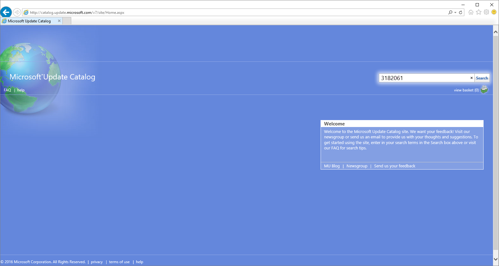
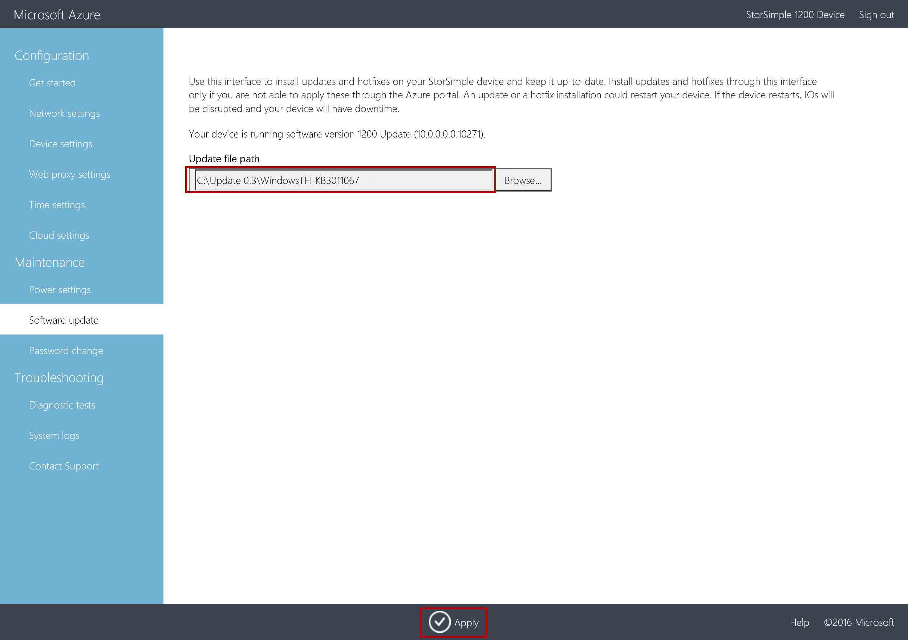
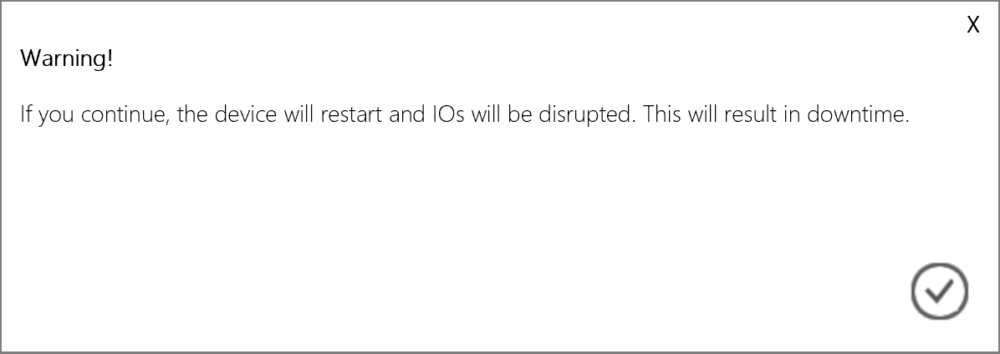
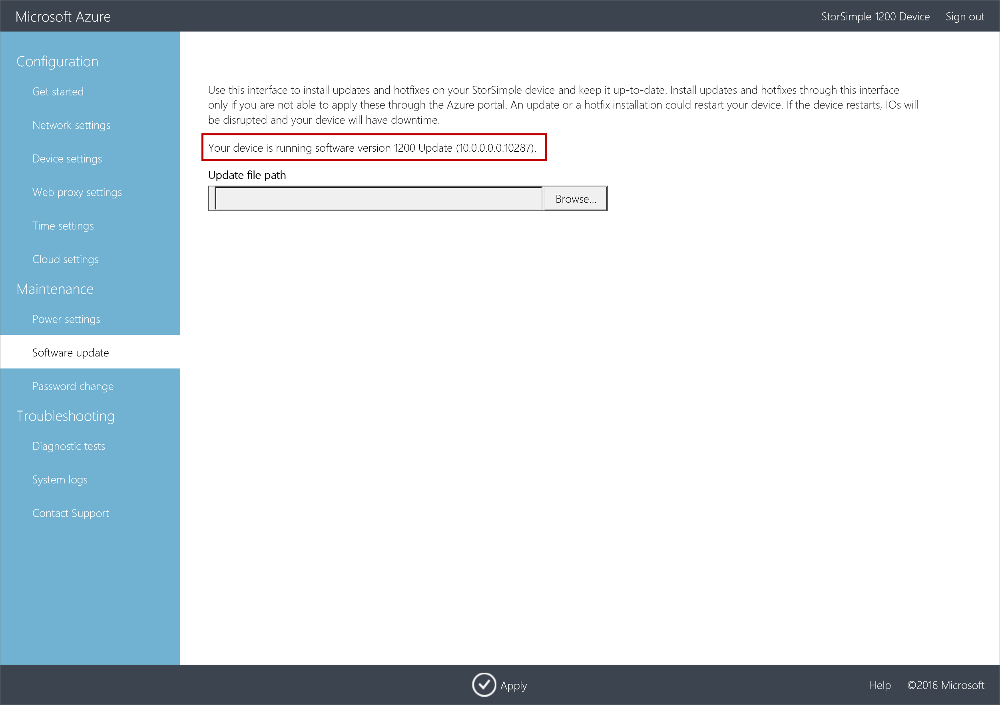
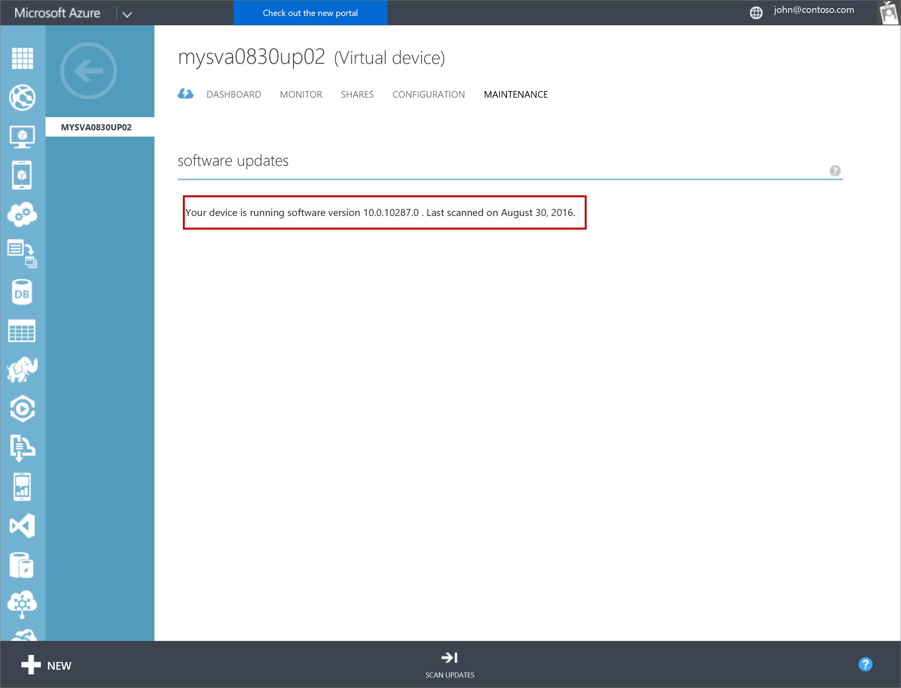

<properties 
   pageTitle="Installieren von Updates auf Virtuelles Array StorSimple | Microsoft Azure"
   description="Beschreibt, wie das virtuelle Array StorSimple Web-Benutzeroberfläche mithilfe der Methode Portal und Update Updates installieren"
   services="storsimple"
   documentationCenter="NA"
   authors="alkohli"
   manager="carmonm"
   editor="" />
<tags 
   ms.service="storsimple"
   ms.devlang="NA"
   ms.topic="article"
   ms.tgt_pltfrm="NA"
   ms.workload="TBD"
   ms.date="09/07/2016"
   ms.author="alkohli" />

# Installieren von Updates auf Ihre virtuellen StorSimple-Matrix

## (Übersicht)

In diesem Artikel werden die erforderlichen Schritte zum Installieren von Updates auf Ihrem StorSimple virtuelle Array über der lokalen Web-Benutzeroberfläche und über das klassische Azure-Portal an. Sie müssen Softwareupdates oder zu Ihrer StorSimple Virtual Array Stand Updates anwenden. 

Orientieren Sie, die Installation oder ein Update das Gerät neu gestartet wird. Virtuelle StorSimple Array einem einzelnen Knoten Gerät ist, alle i/o wird ausgeführt wird unterbrochen und Ihrem Gerät auftritt Ausfallzeiten. 

Bevor Sie ein Update anwenden, es empfiehlt sich, dass Sie die Datenmengen oder Freigaben offline auf dem Host ersten Ausführen, und klicken Sie dann auf das Gerät. Dadurch wird jede Möglichkeit einer Beschädigung der Daten minimiert.

> [AZURE.IMPORTANT] Wenn Sie das Update 0,1 oder GA-Software-Versionen ausführen, müssen Sie die Update-Methode über der lokalen Web-Benutzeroberfläche verwenden, um 0,3-Update zu installieren. Wenn Sie das Update 0,2 ausgeführt werden, wird empfohlen, dass Sie die Updates über das klassische Azure-Portal installieren.

## Verwenden der lokalen Web-Benutzeroberfläche 
 
Wenn das lokale Web-Benutzeroberfläche verwenden, umfasst zwei Schritte:

- Laden Sie das Update oder das Update
- Installieren Sie das Update oder das Update

### Laden Sie das Update oder das Update

Führen Sie die folgenden Schritte aus, um Softwareupdates von Microsoft Update-Katalog herunterladen.

#### Die Aktualisierung oder das Update herunterladen

1. Starten Sie Internet Explorer, und navigieren Sie zu [http://catalog.update.microsoft.com](http://catalog.update.microsoft.com).

2. Ist dies zum ersten Mal Microsoft Update-Katalog auf diesem Computer verwenden, klicken Sie auf **Installieren** , wenn Sie aufgefordert werden, das Add-on Microsoft Update-Katalog zu installieren.
  
3. Geben Sie in das Suchfeld der Microsoft Update-Katalog die Anzahl der Knowledge Base (KB) des Updates, die Sie herunterladen möchten. Geben Sie **3182061** für Update 0,3, und klicken Sie dann auf **Suchen**.

    Die Update-Auflistung angezeigt wird, z. B. **StorSimple virtuellen Array Update 0,3**.

    

4. Klicken Sie auf **Hinzufügen**. Das Update wird der Warenkorb hinzugefügt.

5. Klicken Sie auf **Auswahlkorb anzeigen**.

6. Klicken Sie auf **herunterladen**. Geben Sie oder **Navigieren** Sie zu einem lokalen Speicherort, in dem die Downloads angezeigt werden soll. Die Updates an den angegebenen Speicherort heruntergeladen und in einem Unterordner mit demselben Namen wie die Aktualisierung platziert. Der Ordner kann auch auf eine Netzwerkfreigabe kopiert werden, die vom Gerät erreichbar ist.

7. Öffnen Sie den kopierten Ordner, Sie sollten eine Microsoft Update-Paketdatei eigenständigen finden Sie unter `WindowsTH-KB3011067-x64`. Diese Datei wird verwendet, das Update oder Update zu installieren.

### Installieren Sie das Update oder das Update

Stellen Sie vor der Installation aktualisieren oder Update sicher, dass Sie das Update oder das Update entweder lokal auf dem Host heruntergeladen oder über eine Netzwerkfreigabe zugänglich. 

Verwenden Sie diese Methode, installieren Sie Updates auf einem Gerät unter GA oder aktualisieren 0.1 Softwareversionen. Dieses Verfahren dauert weniger als 2 Minuten. Führen Sie die folgenden Schritte aus, um die Aktualisierung oder Update zu installieren.

#### So installieren Sie das Update oder das Update

1. Wechseln Sie in der lokalen Web-Benutzeroberfläche, zu **Wartung** > **Software aktualisieren**.

    

2. **Dateipfad aktualisieren**möchten geben Sie den Dateinamen für die Aktualisierung oder das Update. Sie können auch zur Installation aktualisieren oder Update-Datei suchen, wenn Sie in einer Netzwerkfreigabe abgelegt. Klicken Sie auf **Übernehmen**.

    

3.  Eine Warnung wird angezeigt. Die angegebene Dies ist ein Gerät einzelnen Knoten auf, wenn das Update nicht installiert ist, das Gerät gestartet wurde und Ausfälle. Klicken Sie auf das Symbol überprüfen.

    

4. Die Aktualisierung wird gestartet. Nachdem das Gerät erfolgreich aktualisiert wurde, wird er neu gestartet. Die lokale Benutzeroberfläche kann nicht in dieser Dauer zugegriffen werden.

    

5. Nach der Neustart abgeschlossen ist, werden Sie zur Seite **Anmelden** übernommen. Um sicherzustellen, dass die Gerätesoftware, klicken Sie in der lokalen Web-Benutzeroberfläche aktualisiert haben, wechseln Sie zur **Wartung** > **Software aktualisieren**. Die angezeigten Softwareversion sollte **10.0.0.0.0.10288.0** für Update 0,3 sein.

    > [AZURE.NOTE] Wir melden die Softwareversionen in eine etwas andere Weise in der lokalen Web-Benutzeroberfläche und den klassischen Azure-Portal an. Angenommen, das lokale Web-Benutzeroberfläche Berichte **10.0.0.0.0.10288** und das Azure klassische Portal Berichte **10.0.10288.0** für dieselbe Version. 

    

## Verwenden des Azure klassischen-Portals

Wenn Update 0,2 ausführen zu können, empfehlen wir, dass Sie über das Azure klassischen Portal Updates installieren. Im Portal Verfahren muss den Benutzer scannen, herunterladen und installieren Sie die Updates. Dieses Verfahren dauert ungefähr 7 Minuten. Führen Sie die folgenden Schritte aus, um die Aktualisierung oder Update zu installieren.

[AZURE.INCLUDE [storsimple-ova-install-update-via-portal](../../includes/storsimple-ova-install-update-via-portal.md)]

Nachdem Sie die Installation (als angegebene nach Position Status bei 100 %) abgeschlossen ist, wechseln Sie zu **Geräte > Wartung > Softwareupdates**. Die angezeigten Softwareversion sollte 10.0.10288.0 sein.

## Nächste Schritte

Weitere Informationen zum [Verwalten Ihrer StorSimple Virtual Array](storsimple-ova-web-ui-admin.md).
