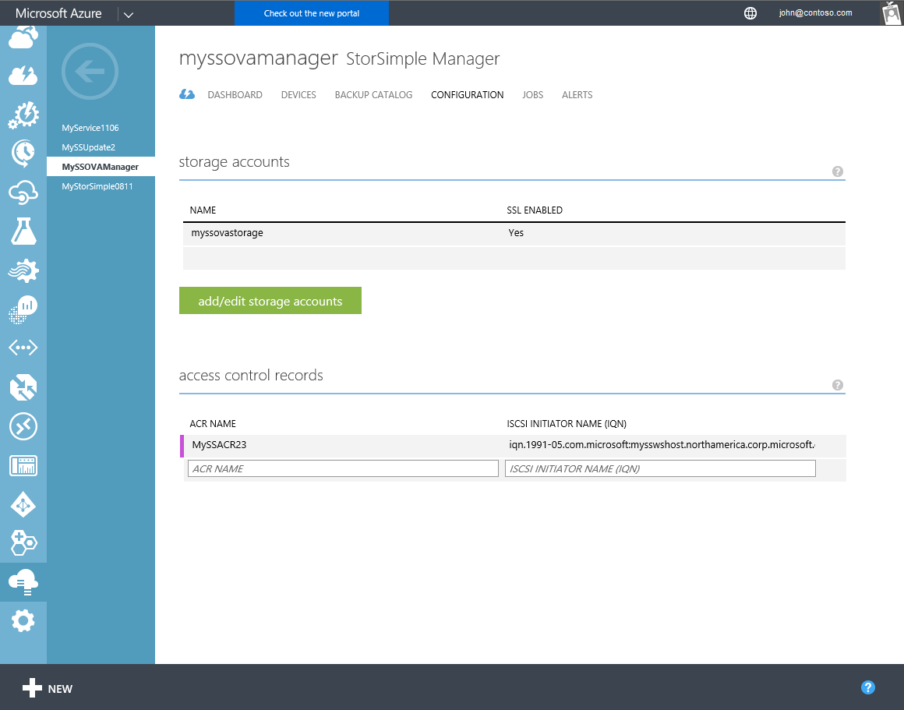

<properties 
   pageTitle="Verwalten von Access Steuerelement Einträge für die virtuelle StorSimple Array | Microsoft Azure"
   description="Beschreibt das Verwalten von Access Steuerelement Datensätze (ACRs), um zu bestimmen, welche Hosts auf einen Datenträger, auf dem StorSimple virtuelle Array eine Verbindung herstellen können."
   services="storsimple"
   documentationCenter=""
   authors="alkohli"
   manager="carmonm"
   editor="" />
<tags 
   ms.service="storsimple"
   ms.devlang="na"
   ms.topic="article"
   ms.tgt_pltfrm="na"
   ms.workload="na"
   ms.date="05/03/2016"
   ms.author="alkohli" />

# Mit dem Access-Steuerelement Einträge für die virtuelle StorSimple Array Verwalten der StorSimple Manager-Dienst 

## (Übersicht)

Access-Steuerelement Einträge (ACRs) können Sie angeben, welche Hosts auf einen Datenträger, auf dem StorSimple virtuelle Array (auch bekannt als StorSimple lokale virtuelle Gerät) eine Verbindung herstellen können. ACRs sind auf einen bestimmten Datenträger festgelegt und die iSCSI-qualifizierte Namen (IQNs) der Hosts enthalten. Wenn ein Host versucht, auf einen Datenträger zu verbinden, das Gerät überprüft der ACR die Lautstärke für den Namen der IQN zugeordnet, und wenn eine Übereinstimmung vorliegt, klicken Sie dann die Verbindung wird hergestellt. Im Abschnitt **Zugriff Steuerelement Datensätze** auf der Seite **Konfigurieren** zeigt alle Access Steuerelement Datensätze mit den entsprechenden IQNs der Hosts.

In diesem Lernprogramm werden die folgenden allgemeinen ACR-bezogene Aufgaben erläutert:

- Abrufen der IQN
- Hinzufügen eines Access-Steuerelement 
- Bearbeiten eines Datensatzes der Access-Steuerelement 
- Löschen eines Datensatzes der Access-Steuerelement 

> [AZURE.IMPORTANT] 
> 
> - Wenn ein Volume ein ACR zuordnen möchten, müssen sicherstellen Sie, dass die Lautstärke von mehr als einem nicht gruppierten Host nicht gleichzeitig zugegriffen werden kann, da dies die Lautstärke beeinträchtigt werden konnte. 
> - Wenn eine ACR von einem Volume löschen, stellen Sie sicher, dass der entsprechende Host nicht die Lautstärke zugreifen ist, da das Löschen einer Unterbrechung Lese-und Schreibzugriff führen kann.

## Abrufen der IQN

Führen Sie die folgenden Schritte aus, um die IQN von einem Windows-Host zu erhalten, auf dem Windows Server 2012 ausgeführt wird.

[AZURE.INCLUDE [storsimple-get-iqn](../../includes/storsimple-get-iqn.md)]

## Hinzufügen einer ACR

Sie verwenden die Seite **Konfiguration** StorSimple Manager ACRs hinzufügen. Ordnen Sie in der Regel eine ACR mit einem Datenträger.

Weitere Informationen zum Zuordnen von einer ACR mit einem Datenträger wechseln Sie zum [Hinzufügen eines Datenträgers](storsimple-ova-deploy3-iscsi-setup.md#step-3-add-a-volume).

>[AZURE.IMPORTANT] 
> 
>Wenn ein Volume ein ACR zuordnen möchten, müssen sicherstellen Sie, dass die Lautstärke von mehr als einem nicht gruppierten Host nicht gleichzeitig zugegriffen werden kann, da dies die Lautstärke beeinträchtigt werden konnte.
 
Führen Sie die folgenden Schritte aus, um eine ACR hinzuzufügen.

#### Hinzufügen einer ACR

1. Wählen Sie auf der Startseite Dienst den Dienst, doppelklicken Sie auf den Namen, und klicken Sie dann auf die Registerkarte **Konfiguration** .

    

2. Geben Sie in tabellarischen Auflistung wird unter **Access Steuerelement Einträge**einen **Namen** für Ihre ACR ein.

3. Geben Sie unter **iSCSI Initiatornamen**den Namen des IQN, von Ihrem Windows-Host ein. 

4. Klicken Sie auf am unteren Rand der Seite **Speichern** , um den neu erstellten ACR speichern. Sie sehen die folgende Meldung angezeigt.

    

5. Klicken Sie auf das Symbol "Überprüfen" . Tabellarische Liste wird aktualisiert, um diese Erweiterung wiederzugeben.

## Bearbeiten einer ACR

Sie verwenden die Seite **Konfiguration** im klassischen Azure-Portal an, um ACRs zu bearbeiten. 

> [AZURE.NOTE] Sie sollten nur diese ACRs ändern, die derzeit nicht verwendet werden. Zum Bearbeiten einer ACR zugeordnet einen Datenträger, der aktuell verwendet wird, sollten Sie zuerst die Lautstärke offline zu schalten.

Führen Sie die folgenden Schritte aus, um eine ACR zu bearbeiten.

#### So bearbeiten Sie eine ACR

1. Wählen Sie auf der Startseite Dienst den Dienst, doppelklicken Sie auf den Namen, und klicken Sie dann auf die Registerkarte **Konfiguration** .

2. Die tabellarische Auflistung der Datensätze Steuerelement Access, zeigen Sie auf der ACR, die Sie ändern möchten.

3. Geben Sie einen neuen Namen und/oder IQN für die ACR an.

4. Klicken Sie auf am unteren Rand der Seite **Speichern** , um die geänderte ACR speichern. Eine bestätigungsmeldung wird angezeigt. 

5. Klicken Sie auf das Symbol "Überprüfen" . Tabellarische Liste wird aktualisiert, um diese Änderung anzuzeigen.

## Löschen eines Datensatzes der Access-Steuerelement

Sie verwenden die Seite **Konfiguration** im klassischen Azure-Portal an, um ACRs zu löschen. 

> [AZURE.NOTE] 
> 
> - Sie sollten nur diese ACRs löschen, die derzeit nicht verwendet werden. Zum Löschen einer ACR zugeordnet einen Datenträger, der aktuell verwendet wird, sollten Sie zuerst die Lautstärke offline zu schalten.
> - Wenn eine ACR von einem Volume löschen, stellen Sie sicher, dass der entsprechende Host nicht die Lautstärke zugreifen ist, da das Löschen einer Unterbrechung Lese-und Schreibzugriff führen kann.

Führen Sie die folgenden Schritte aus, um eine Access-Steuerelement Datensatz zu löschen.

#### So löschen Sie ein Eintrag der Access-Steuerelement

1. Wählen Sie auf der Startseite Dienst den Dienst, doppelklicken Sie auf den Namen, und klicken Sie dann auf die Registerkarte **Konfiguration** .

2. Die tabellarische Auflistung der Access-Steuerelement Datensätze (ACRs), zeigen Sie auf der ACR, die Sie löschen möchten.

3. Ein Löschsymbol (**X**) wird in der extrem rechten Spalte für die ACR angezeigt, die Sie auswählen. Klicken Sie auf das **X** -Symbol, um die ACR löschen. Sie sehen die folgende Meldung angezeigt.

    

5. Klicken Sie auf das Symbol "Überprüfen" . Tabellarische Liste wird aktualisiert, um den Löschvorgang zu entsprechen.

## Nächste Schritte

- Weitere Informationen über das [Hinzufügen von Datenmengen und Konfigurieren von ACRs](storsimple-ova-deploy3-iscsi-setup.md#step-3-add-a-volume).
