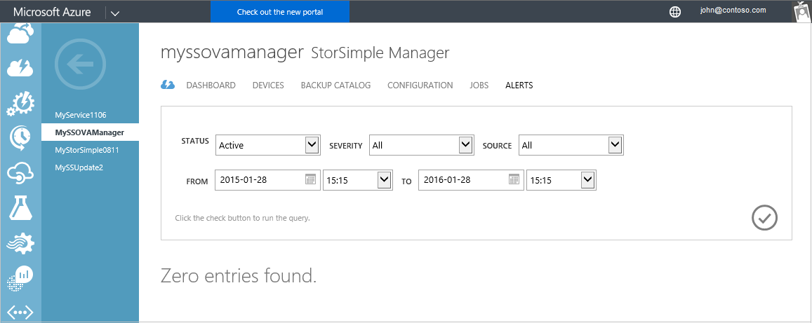
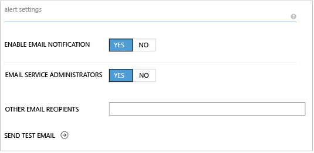
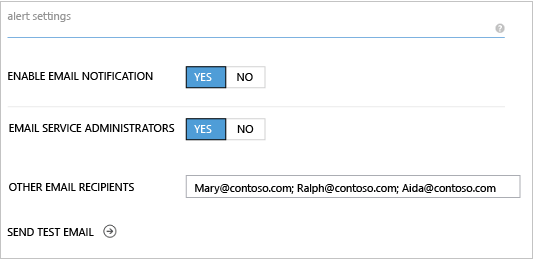
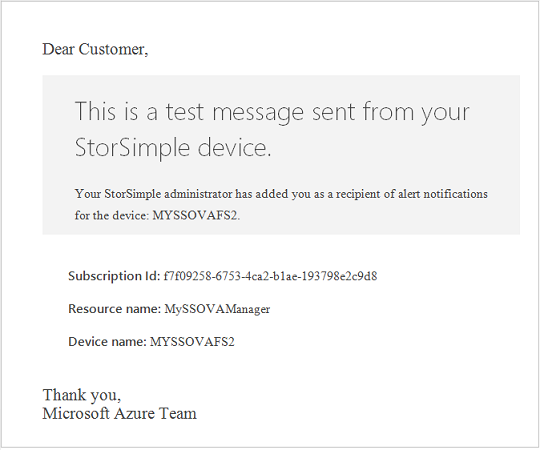
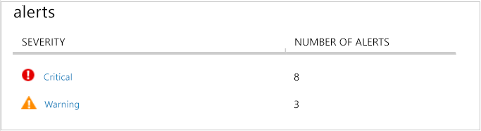
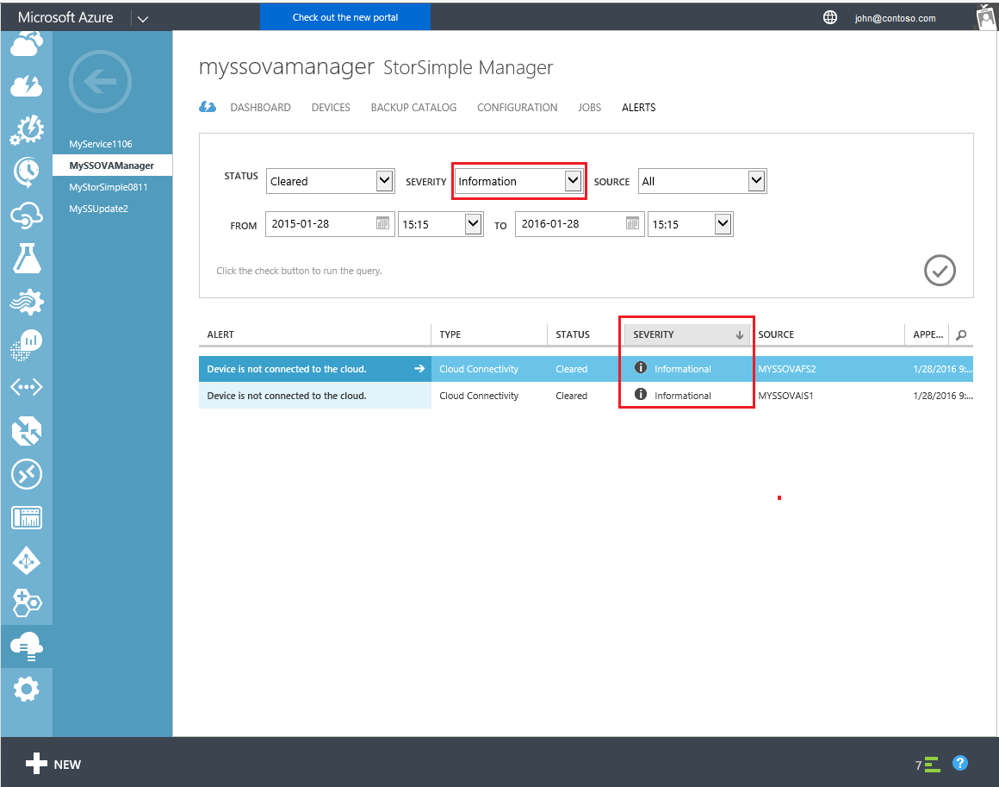
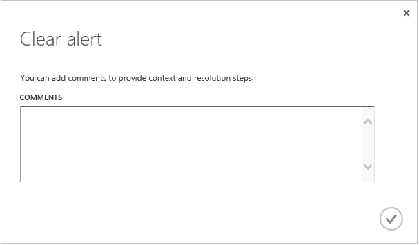
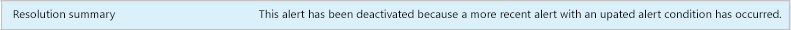

<properties 
   pageTitle="Anzeigen und Verwalten von Benachrichtigungen Virtual Array StorSimple | Microsoft Azure"
   description="Beschreibt StorSimple Virtual Array benachrichtigen Bedingungen und Schwere und den StorSimple-Manager-Dienst verwenden, um Benachrichtigungen verwalten."
   services="storsimple"
   documentationCenter="NA"
   authors="alkohli"
   manager="carmonm"
   editor="" />
<tags 
   ms.service="storsimple"
   ms.devlang="NA"
   ms.topic="article"
   ms.tgt_pltfrm="NA"
   ms.workload="NA"
   ms.date="06/07/2016"
   ms.author="alkohli" />

# Verwenden Sie zum Anzeigen und Verwalten von Benachrichtigungen für die virtuelle StorSimple Array des StorSimple Manager-Diensts

## (Übersicht)

Die Registerkarte **Benachrichtigungen** in der StorSimple Manager-Dienst bietet eine Möglichkeit zum Überprüfen und StorSimple Virtual Array-bezogene Benachrichtigungen in Echtzeit Abständen deaktivieren. Auf dieser Registerkarte können Sie zentral die Integrität Probleme Ihrer StorSimple virtuelle Arrays (auch bekannt als lokalen StorSimple virtuelle Geräte) und der gesamten Microsoft Azure StorSimple Lösung überwachen.

In diesem Lernprogramm beschrieben, wie konfigurieren-Benachrichtigung, allgemeine Bedingungen, die Benachrichtigung, Warnungsschweregrade zum Anzeigen und Nachverfolgen von Benachrichtigungen. Darüber hinaus schließt ihn Kurzreferenz alert Tabellen, die können Sie schnell eine bestimmte Warnung suchen und entsprechend darauf zu reagieren.

## Konfigurieren von Benachrichtigungseinstellungen

Sie können auswählen, ob Sie per e-Mail benachrichtigen Bedingungen für jede Ihrer StorSimple virtuelle Geräte benachrichtigt werden möchten. Darüber hinaus können Sie andere Empfänger Benachrichtigung identifizieren, durch Eingabe ihrer e-Mail-Adressen im Feld **andere e-Mail-Empfänger** , durch Semikolons getrennt.

>[AZURE.NOTE] Sie können bis zu 20 e-Mail-Adressen pro virtuelles Gerät eingeben.

Nachdem Sie die e-Mail-Benachrichtigung für ein virtuelles Gerät aktivieren, erhalten Mitglieder der Benachrichtigungsliste eine e-Mail-Nachricht, die jedes Mal eine Warnung vom Typ kritische eintritt. Die Nachrichten werden gesendet aus *storsimple-alerts-noreply@mail.windowsazure.com* und beschreiben die Bedingung benachrichtigen. Empfänger können **Abo kündigen** , um sich selbst aus der Liste der e-Mail-Benachrichtigung entfernen klicken.

#### So aktivieren Sie die e-Mail-Benachrichtigung von Benachrichtigungen für ein virtuelles Gerät

1. Wechseln Sie zu **Geräte** > **Konfiguration** für das virtuelle Gerät. Wechseln Sie zum Abschnitt **Benachrichtigungseinstellungen** .

    

2. Klicken Sie unter **Benachrichtigungseinstellungen**legen Sie Folgendes ein:

    1. Wählen Sie im Feld **senden e-Mail-Benachrichtigung** **Ja**ein.

    2. Wählen Sie für das Feld **e-Mail-Dienstadministratoren** **Ja** aus, wenn Dienstadministrator werden soll, und alle CO-Administratoren lassen Sie die Benachrichtigung.

    3. Geben Sie im Feld **andere e-Mail-Empfänger** die e-Mail-Adressen aller Empfänger, die die Benachrichtigung erhalten sollen. Geben Sie die Namen in das Format *someone@somewhere.com*. Verwenden Sie Semikolons trennen Sie die e-Mail-Adressen ein. Sie können bis zu 20-e-Mail-Adressen pro virtuelles Gerät konfigurieren. 

        

3. Klicken Sie am unteren Rand der Seite auf **Speichern** , um die Konfiguration zu speichern.

4. Um eine Test-e-Mail-Benachrichtigung zu senden, klicken Sie auf das Pfeilsymbol neben **Test-e-Mail senden**. Der StorSimple Manager-Dienst werden Statusnachrichten angezeigt, wie sie die Benachrichtigung Test weiterleitet. 

5. Wenn die folgende Meldung angezeigt wird, klicken Sie auf **OK**. 

    

    >[AZURE.NOTE] Wenn die Test-Benachrichtigung gesendet werden kann, wird der StorSimple Manager-Dienst eine entsprechende Meldung angezeigt. Klicken Sie auf **OK**, warten Sie einige Minuten, und versuchen Sie, Ihre Test-Benachrichtigung erneut zu senden. 

    Die Benachrichtigung Test werden ähnlich wie der folgende aus.

    

## Allgemeine Bedingungen, die Benachrichtigung

Ihre StorSimple Virtual Array generiert Benachrichtigungen als Antwort auf eine Vielzahl von Bedingungen. Es folgen die am häufigsten verwendeten Typen von Zustand eintritt:

- **Probleme mit der Konnektivität** – diese Benachrichtigungen auftreten, wenn Probleme beim Datenübertragung vorhanden ist. Kommunikationsprobleme können während der Übertragung von Daten zu und aus dem Azure-Speicher-Konto oder aufgrund der Verbindung zwischen der virtuellen Geräte und der StorSimple Manager-Dienst auftreten. Kommunikationsprobleme sind einige der am schwersten zu beheben, da es so viele Punkte des Fehlers gibt. Sie sollten immer zuerst stellen Sie sicher, dass Netzwerkkonnektivität und den Zugriff auf das Internet verfügbar sind, bevor Sie mit erweiterte Problembehandlung fortfahren. Informationen zu Ports und Firewall-Einstellungen wechseln Sie zu [Systemanforderungen StorSimple Virtual Array](storsimple-ova-system-requirements.md). Hilfe bei der Problembehandlung finden Sie unter [Behandeln von Problemen mit dem Cmdlet Verbindung testen](storsimple-troubleshoot-deployment.md).

- **Leistungsprobleme** – diese Benachrichtigungen tritt auf, wenn es sich bei Ihrem System optimal, wie z. B., wenn es sich bei hoher Auslastung ist Durchführung nicht zur Verfügung.

Darüber hinaus möglicherweise Warnungen zu Sicherheit, Updates oder Auftrag Fehlern angezeigt.

## Benachrichtigen schwere Ebenen

Benachrichtigungen haben andere schwere Ebenen, je nach den Einfluss, die die Benachrichtigung Situation und die Notwendigkeit der eine Antwort auf die Benachrichtigung. Die schwere Ebenen sind:

- **Kritisch** – diese Warnung wird als Antwort auf eine Bedingung, die die erfolgreiche Leistung von Ihrem System auswirkt. Aktion ist erforderlich, um sicherzustellen, dass die StorSimple Dienst nicht unterbrochen wird.

- **Warnung** – diese Bedingung könnte kritisch, falls nicht aufgelöst werden. Ermitteln die Situation, und keine Aktion erforderlich, um das Problem zu deaktivieren.

- **Informationen** – diese Warnung enthält Informationen, die in die Überwachung und Verwaltung des Systems hilfreich sein kann.

## Anzeigen und Nachverfolgen von Benachrichtigungen

Das Manager StorSimple Dienst Dashboard bietet Ihnen einen schnellen Blick auf die Anzahl der Benachrichtigungen auf Ihren virtuellen Geräten, um schwere Ebene angeordnet.

Auf der Ebene schwere öffnet die Registerkarte **Benachrichtigungen** . Die Ergebnisse enthalten nur die Benachrichtigungen, die Bestandteil einer schwere entsprechen.

Durch Klicken auf eine Benachrichtigung in der Liste bietet Ihnen weitere Details für die Benachrichtigung, das letzte Mal die Benachrichtigung gemeldet wurde, einschließlich der Anzahl von Vorkommen der Warnung klicken Sie auf das Gerät, und die empfohlene Aktion die Warnung zu beheben.

Wenn Sie die Informationen an Microsoft Support senden müssen, können Sie die Details der Warnung in eine Textdatei kopieren. Nachdem Sie gefolgt empfohlen und die Benachrichtigung Bedingung lokalen gelöst haben, sollten Sie die Benachrichtigung aus, indem Sie die Benachrichtigung in die Registerkarte **Benachrichtigungen** , und klicken Sie auf **Deaktivieren**deaktivieren. Um eine große Anzahl Benachrichtigungen aufzuheben, wählen Sie jede Warnung aus, klicken Sie auf eine beliebige Spalte außer der Spalte **Benachrichtigung** , und klicken Sie dann auf **Löschen** , nachdem Sie alle Benachrichtigungen zu entfernende ausgewählt haben. Beachten Sie, dass einige Benachrichtigungen automatisch gelöscht werden, wenn das Problem dadurch gelöst wird oder wenn Sie die Benachrichtigung mit neuen Informationen aktualisiert.

Wenn Sie auf **Löschen**klicken, haben Sie die Möglichkeit, geben Sie Kommentare zu der Benachrichtigung und Schritte, die Sie erstellen, um das Problem zu beheben. 

Klicken Sie auf das Symbol "Überprüfen"  um Ihre Kommentare zu speichern.

Einige Ereignisse werden vom System deaktiviert werden, wenn ein anderes Ereignis, mit neuen Informationen ausgelöst wird. In diesem Fall wird die folgende Meldung angezeigt.

## Sortieren und Überprüfen von Benachrichtigungen

Die Registerkarte **Benachrichtigungen** kann bis zu 250 Benachrichtigungen anzeigen. Wenn Sie die Anzahl von Warnungen überschritten haben, werden nicht alle Benachrichtigungen in der Standardansicht angezeigt. Sie können die folgenden Felder aus, um anzupassen, welche Warnungen angezeigt werden, kombinieren:

- **Status** – Sie können entweder **aktiv** oder **nicht aktiviert** Benachrichtigungen anzeigen. Aktive Benachrichtigungen werden immer noch auf Ihrem System ausgelöst wird, während gelöschte Benachrichtigungen entweder manuell von einem Administrator deaktiviert oder programmgesteuert deaktiviert werden, da das System die Benachrichtigung Bedingung mit neuen Informationen aktualisiert wurden.

- **Schwere** – Sie können alle schwere Ebenen (kritisch, Warnung, Informationen) oder nur eine bestimmte schwere, beispielsweise nur kritische Benachrichtigungen Benachrichtigungen anzeigen.

- **Quelle** – Sie können aus allen Quellen Benachrichtigung anzeigen, oder beschränken Sie die Benachrichtigungen aus dem Dienst oder eine oder alle der virtuellen Geräte entweder stammen.

- **Zeitbereich** – können durch angeben **von** und **bis** Datums- und Zeitstempel, Sie Benachrichtigungen während des Zeitraums betrachten, denen Sie interessiert sind.

## Kurzübersicht für Benachrichtigungen

Den folgenden Tabellen sind einige der Microsoft Azure StorSimple Warnungen, die, sowie zusätzliche Informationen und Vorschläge sofern verfügbar auftreten können. StorSimple virtuelles Gerät Benachrichtigungen fallen in eine der folgenden Kategorien:

- [Cloud Connectivity-Benachrichtigungen](#cloud-connectivity-alerts)

- [Konfiguration von Benachrichtigungen](#configuration-alerts)

- [Position Fehler Benachrichtigungen](#job-failure-alerts)

- [Leistung Benachrichtigungen](#performance-alerts)

- [Von Sicherheitshinweisen](#security-alerts)

- [Aktualisieren von Benachrichtigungen](#update-alerts)

### Cloud Connectivity-Benachrichtigungen

|Benachrichtigung text|Ereignis|Weitere Informationen / empfohlene Aktionen|
|:---|:---|:---|
|Gerät *<device name>* nicht mit der Cloud verbunden ist.|Das benannte Gerät kann nicht in der Cloud verbinden. |Konnte nicht in der Cloud verbinden. Dies kann eine der folgenden haben:<ul><li>Möglicherweise gibt es ein Problem mit dem Netzwerkeinstellungen auf Ihrem Gerät.</li><li>Möglicherweise gibt es ein Problem mit den Anmeldeinformationen Speicher.</li></ul>Weitere Informationen zum Behandeln von Konnektivitätsproblemen mit wechseln Sie zu der [lokalen Web-Benutzeroberfläche](storsimple-ova-web-ui-admin.md) des Geräts.|

### Konfiguration von Benachrichtigungen

|Benachrichtigung text|Ereignis|Weitere Informationen / empfohlene Aktionen|
|:---|:---|:---|
|Konfiguration für lokale virtuelle Medien nicht unterstützt werden.|Langsam.|Die aktuelle Konfiguration kann Leistungsabfall führen. Stellen Sie sicher, dass der Server die minimale Konfiguration erfüllt. Wechseln Sie weitere Informationen zu [StorSimple virtuelle Array Anforderungen](storsimple-ova-system-requirements.md). 
|Sie sind nicht genügend Speicherplatz bereitgestellte auf <*Gerätenamen*> ausgeführt werden.|Warnung.|Sie sind auf bereitgestellte Festplattenspeicher knapp. Wenn Sie Speicherplatz freigeben, erwägen Sie Auslastung in ein anderes Volume oder Freigeben Verschieben oder Löschen von Daten aus.

### Position Fehler Benachrichtigungen

|Benachrichtigung text|Ereignis|Weitere Informationen / empfohlene Aktionen|
|:---|:---|:---|
|Sichern von <*Gerätename*> konnte nicht abgeschlossen werden.|Fehler bei der Sicherung Auftrags.|Eine Sicherungskopie konnte nicht erstellt werden. Erwägen Sie eine der folgenden Aktionen aus:<ul><li>Möglicherweise verhindern Netzwerkkonnektivitätsprobleme vor den Sicherungskopie Vorgang nicht erfolgreich abgeschlossen. Stellen Sie sicher, dass es keine Probleme Connectivity liegen. Weitere Informationen zum Behandeln von Konnektivitätsproblemen mit wechseln Sie zu der [lokalen Web-Benutzeroberfläche](storsimple-ova-web-ui-admin.md) für Ihr Gerät virtuelle.</li><li>Sie haben den verfügbaren Speichergrenzwert erreicht. Erwägen Sie zum Freigeben von Speicherplatz anzeigen, löschen alle Sicherungskopien, die nicht mehr benötigt werden.</li></ul> Beheben Sie Probleme zu, deaktivieren Sie die Benachrichtigung, und wiederholen Sie den Vorgang.|
|Wiederherstellen des <*Gerätename*> konnte nicht abgeschlossen werden.|Fehler bei der Auftrags wiederhergestellt werden.|Konnte nicht aus einer Sicherung wiederherstellen. Erwägen Sie eine der folgenden Aktionen aus:<ul><li>Die Liste der Sicherungskopie möglicherweise nicht gültig. Aktualisieren Sie die Liste, um zu überprüfen, dass es immer noch gültig ist.</li><li>Möglicherweise verhindern Netzwerkkonnektivitätsprobleme vor die Wiederherstellung nicht erfolgreich abgeschlossen. Stellen Sie sicher, dass es keine Probleme Connectivity liegen.</li><li>Sie haben den verfügbaren Speichergrenzwert erreicht. Erwägen Sie zum Freigeben von Speicherplatz anzeigen, löschen alle Sicherungskopien, die nicht mehr benötigt werden.</li></ul>Beheben Sie Probleme zu, deaktivieren Sie die Benachrichtigung, und wiederholen Sie den Wiederherstellungsvorgang.|
|Datenbeschriftungsreihe <*Gerätename*> konnte nicht abgeschlossen werden.|Fehler bei der Auftrags zu klonen.|Eine datenbeschriftungsreihe konnte nicht erstellt werden. Erwägen Sie eine der folgenden Aktionen aus:<ul><li>Die Liste der Sicherungskopie möglicherweise nicht gültig. Aktualisieren Sie die Liste, um zu überprüfen, dass es immer noch gültig ist.</li><li>Möglicherweise verhindern Verbindungsprobleme, den Klonvorgang erfolgreich abgeschlossen. Stellen Sie sicher, dass es keine Probleme Connectivity liegen.</li><li>Sie haben den verfügbaren Speichergrenzwert erreicht. Erwägen Sie zum Freigeben von Speicherplatz anzeigen, löschen alle Sicherungskopien, die nicht mehr benötigt werden.</li></ul>Beheben Sie Probleme zu, deaktivieren Sie die Benachrichtigung, und wiederholen Sie den Vorgang.|

### Leistung Benachrichtigungen

|Benachrichtigung text|Ereignis|Weitere Informationen / empfohlene Aktionen|
|:---|:---|:---|
|In Datenübertragung unerwartete Verzögerungen auftreten.|Langsame Datenübertragung.|Drosselung Fehler auftreten, wenn Sie die Skalierbarkeit Ziele von einer Speicherdienst überschreiten. Der Speicherdienst bedeutet dies, um sicherzustellen, dass keine einzelnen Client oder den Mandanten den Dienst auf andere Kosten verwenden kann. Weitere Informationen zur Problembehandlung für Ihr Konto Azure-Speicher wechseln Sie zu [überwachen, zu diagnostizieren und Behandeln von Problemen mit Microsoft Azure-Speicher](storage-monitoring-diagnosing-troubleshooting.md).
|Niedrig lokale Reservierung von Speicherplatz auf <*Gerätenamen*> ausgeführt.|Langsame Reaktionszeiten.|10 % der bereitgestellte Gesamtgröße <*Gerätename*> ist auf dem lokalen Gerät reserviert, und Sie werden jetzt über ausreichend der reservierte Platz. Die Arbeitsbelastung für <*Gerätenamen*> eine höhere Rate der Änderung generiert wird, oder Sie möglicherweise haben zuletzt migriert eine große Datenmenge. Dies kann reduzierte Leistung führen. Erwägen Sie eine der folgenden Aktionen aus, um dieses Verhalten zu beheben:<ul><li>Vergrößern Sie die Cloud Bandbreite an diesem Gerät an.</li><li>Reduzieren Sie oder verschieben Sie Auslastung auf ein anderes Volume oder freigeben.</li></ul>

### Von Sicherheitshinweisen

|Benachrichtigung text|Ereignis|Weitere Informationen / empfohlene Aktionen|
|:---|:---|:---|
|Kennwort für <*Gerätenamen*> wird in <*Zahl*> Tagen ablaufen.|Warnung für Ihr Kennwort ein.| Ihr Kennwort läuft < Zahl < Tage. Erwägen Sie das Ändern Ihres Kennworts. Wechseln Sie für Weitere Informationen zu [Virtual Array StorSimple Gerät Administratorkennwort ändern](storsimple-ova-change-device-admin-password.md).

### Aktualisieren von Benachrichtigungen

|Benachrichtigung text|Ereignis|Weitere Informationen / empfohlene Aktionen|
|:---|:---|:---|
|Neue Updates stehen für Ihr Gerät.|Updates an die StorSimple virtuelle Matrix sind verfügbar.|Sie können von der Seite **zum Warten** von neuen Updates installieren.|
|Konnte nicht nach neuen Updates auf <*Gerätenamen*> Scannen.|Aktualisieren Sie Fehler an. |Fehler bei der Installation neuer Updates. Sie können die Updates manuell installieren. Wenn das Problem weiterhin besteht, wenden Sie sich an den [Microsoft-Support](storsimple-contact-microsoft-support.md).|

## Nächste Schritte

- [Erfahren Sie mehr über die virtuelle StorSimple-Matrix](storsimple-ova-overview.md).

