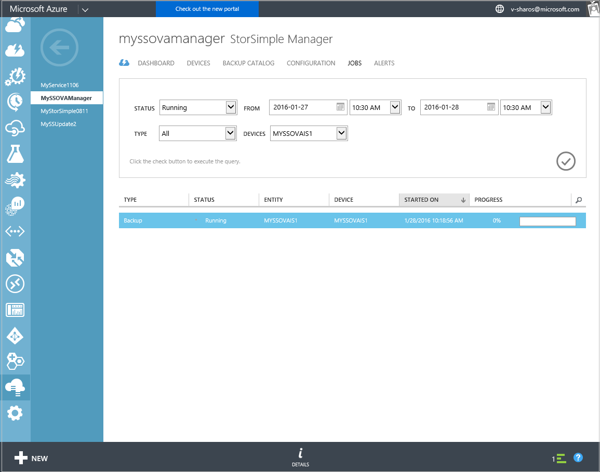
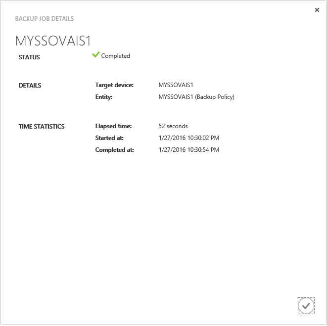
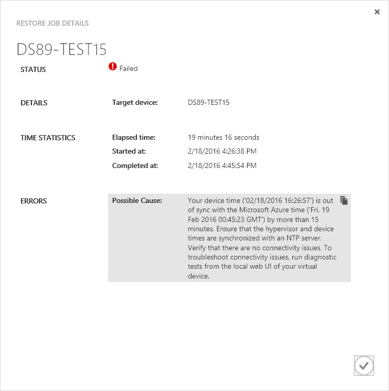

<properties 
   pageTitle="Anzeigen und Verwalten von StorSimple Virtual Array Aufträge | Microsoft Azure"
   description="Beschreibt die Seite StorSimple Manager Aufträge und zur gemeinsamen Nutzung von kürzlich geführten und aktuellen Aufträge für die virtuelle StorSimple Array nachverfolgen."
   services="storsimple"
   documentationCenter="NA"
   authors="alkohli"
   manager="carmonm"
   editor=""/>
<tags 
   ms.service="storsimple"
   ms.devlang="NA"
   ms.topic="article"
   ms.tgt_pltfrm="NA"
   ms.workload="na"
   ms.date="06/07/2016"
   ms.author="alkohli" />

# Verwenden Sie zum Anzeigen von Aufträgen für virtuelle StorSimple Array des StorSimple Manager-Diensts

## (Übersicht)

Die Seite " **Aufträge** " bietet ein einzelnes zentrales Portal zum Anzeigen und Verwalten von Projekten, die auf virtuellen Arrays (auch bekannt als lokale virtuelle Geräte) gestartet werden, die mit Ihrem Dienst StorSimple Manager verbunden sind. Sie können ausgeführt werden, abgeschlossene und fehlgeschlagene Aufträge für mehrere virtuelle Geräte anzeigen. Ergebnisse werden im Tabellenformat angezeigt. 

Sie können schnell die Einzelvorgänge finden, die Sie interessiert sind, durch Filtern nach Felder wie:

- **Status** – Sie können alle, ausgeführt wird, fertigen oder fehlgeschlagene Aufträge suchen.
- **Aus** – Aufträge basierend auf den Datums- und Zeitbereich gefiltert werden können.
- **Typ** – Art des Updates herunterladen, werden alle, Sicherung, wiederherstellen, Failover oder Updates installieren kann.
- **Geräte** – Aufträge werden auf einem bestimmten Gerät bei einer Verbindung zu Ihrem Dienst initiiert. Die gefilterten Aufträge werden dann auf der Grundlage der folgenden Attributen tabellarisch angeordnet:

    - **Typ** – Art des Updates herunterladen, werden alle, Sicherung, wiederherstellen, Failover oder Updates installieren kann.

    - **Status** – können Aufträge werden alle, ausgeführt, abgeschlossen oder fehlgeschlagen ist.

    - **Entität** – die Einzelvorgänge können eine Lautstärke, freigeben oder ein Gerät zugeordnet werden. 

    - **Gerät** – den Namen des Geräts auf dem der Auftrag gestartet wurde.

    - **Schritte auf** – die Zeit an, wenn der Auftrag gestartet wurde.

    - **Fortschritt** – Prozentsatz Abschluss eines laufenden Auftrags. Abgeschlossene Projekte sollten dies immer (100 %).

Die Liste der Aufträge werden alle 30 Sekunden aktualisiert.

## Anzeigen von Details zu Position

Führen Sie die folgenden Schritte aus, um die Details zu einer beliebigen Position anzuzeigen.

#### Job-Details anzeigen

1. Zeigen Sie auf der Seite **Projekte** die Sie interessiert sind, durch Ausführen einer Abfrage mit entsprechenden Filter Einzelvorgänge an Sie können für abgeschlossene oder laufenden Projekte suchen.

2. Wählen Sie ein Projekt aus der Liste der Aufträge tabellarischen aus.

3. Klicken Sie am unteren Rand der Seite auf **Details**.

4. Klicken Sie im Dialogfeld " **Details** " können Sie Status, statistische Zeitdaten und Details anzeigen. Die folgende Abbildung zeigt ein Beispiel für das Dialogfeld **Sicherung Job Details** .
 
    

#### Position Fehlern beim des virtuellen Computers in der Hypervisor angehalten wurde

Wenn ist eine Position in den Fortschritt Ihres StorSimple virtuelle Arrays und das Gerät (virtuellen Computern nach der Bereitstellung in Hypervisor) ist für größer als 15 Minuten angehalten, der Auftrag schlägt fehl. Dies ist aufgrund StorSimple Virtual Array Zeit nicht synchron mit der Microsoft Azure-Zeit ist. Im folgenden Screenshot ist ein Beispiel für ein Fehler bei der Wiederherstellung Auftrags angezeigt.

Dieser Fehler werden für sichern, wiederherstellen, aktualisieren und Failover Projekte gelten. Ihre virtuellen Computern im Hyper-V bereitgestellt ist, werden der Computer später Zeit mit Ihrer Hypervisor synchronisiert. Nachdem Sie in diesem Fall können Sie Ihre Arbeit neu starten. 

## Nächste Schritte

[Informationen zum Verwenden des lokalen Web-Benutzeroberfläche zum Verwalten Ihrer StorSimple Virtual Array](storsimple-ova-web-ui-admin.md).
