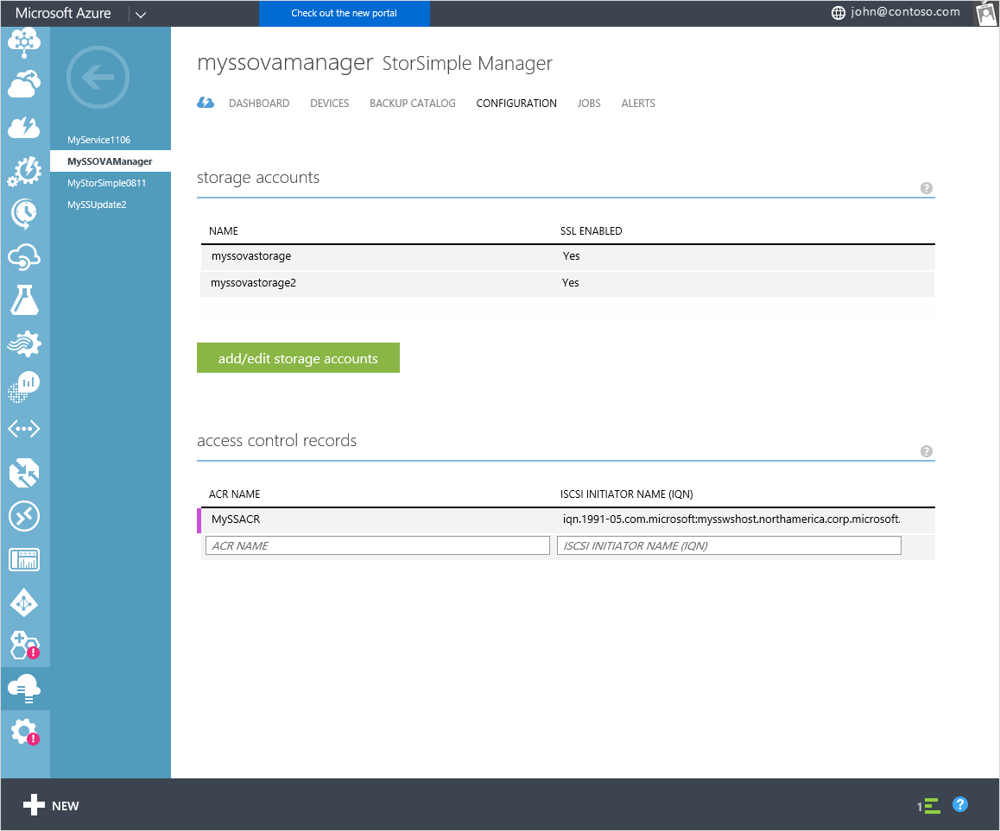
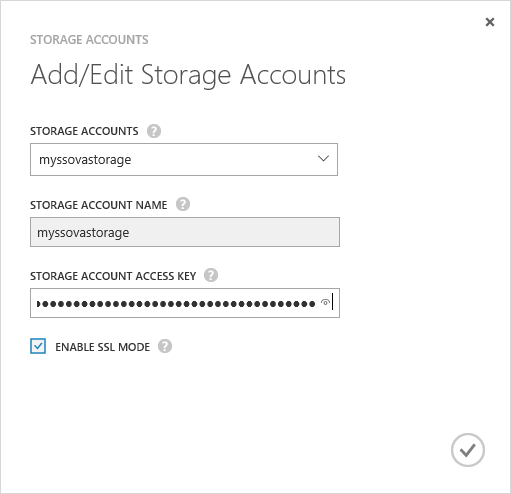

<properties 
   pageTitle="Verwalten Ihrer StorSimple Speicherkonto | Microsoft Azure"
   description="Wird erläutert, wie Sie mithilfe die Seite StorSimple Manager konfigurieren hinzufügen, bearbeiten, löschen oder die Tasten Sicherheit für ein Speicherkonto zugeordnet StorSimple virtuelle Array drehen können."
   services="storsimple"
   documentationCenter="NA"
   authors="alkohli"
   manager="carmonm"
   editor="" />
<tags 
   ms.service="storsimple"
   ms.devlang="NA"
   ms.topic="article"
   ms.tgt_pltfrm="NA"
   ms.workload="TBD"
   ms.date="09/29/2016"
   ms.author="alkohli" />

# Verwenden Sie zum Verwalten von Speicherkonten für StorSimple Virtual Array des StorSimple Manager-Diensts

## (Übersicht)

Die Seite **Konfigurieren** bietet die globale Service-Parameter, die in der StorSimple Manager-Dienst erstellt werden können. Diese Parameter können angewendet werden, um alle mit dem Dienst verbundenen Geräte und umfassen:

- Speicherkonten 
- Access-Steuerelement Datensätze 

In diesem Lernprogramm wird erläutert, wie Sie mithilfe die Seite **Konfigurieren** hinzufügen, bearbeiten oder Löschen von Speicherkonten für Ihre StorSimple Virtual Array können. Die Informationen in diesem Lernprogramm gilt nur für die virtuelle StorSimple Array März 2016 GA-Release-Software ausgeführt.

   

Speicherkonten enthalten die Anmeldeinformationen, die das Gerät Zugriff auf Ihr Speicherkonto mit Ihren Cloud-Service-Anbieter verwendet. Für Microsoft Azure-Speicher-Konten werden diese Anmeldeinformationen wie den Namen des Kontos und die primäre Zugriffstaste. 

Klicken Sie auf der Seite **Konfigurieren** werden alle Speicherkonten, die für das Abonnement Abrechnung erstellt wurden in Tabellenform, enthält die folgende Informationen angezeigt:

- **Namen** – die eindeutigen Namen in dem Konto zugewiesen werden, wenn er erstellt wurde.
- **SSL aktiviert** –, ob die SSL aktiviert ist und Gerät-Cloud-Kommunikation über den sicheren Kanal.

Sind am häufigsten ausgeführten Aufgaben im Zusammenhang mit Speicherkonten, die auf der Seite **Konfigurieren** ausgeführt werden können:

- Hinzufügen eines Kontos Speicher 
- Bearbeiten einer Speicher-Kontos 
- Löschen eines Kontos Speicher 

## Speicher Kontotypen

Es gibt drei Arten von Speicherkonten, die mit Ihrem Gerät StorSimple verwendet werden können.

- **Automatisch generierte Speicherkonten** – wie der Name sagt, diese Art von Speicher-Konto wird automatisch generiert, wenn der Dienst zuerst erstellt wird. Wenn Sie weitere Informationen dazu, wie diese Speicherkonto erstellt wurde, finden Sie unter [Erstellen eines neuen Dienstes](storsimple-ova-manage-service.md#create-a-service). 
- **Speicherkonten im Dienst-Abonnement** – Hierbei handelt es sich um den Azure-Speicher-Konten, die im selben Abonnement des Diensts wie zugeordnet sind. Weitere Informationen zu wie diese Speicher Konten erstellt wurden, finden Sie unter [Informationen zu Azure Speicherkonten](../storage/storage-create-storage-account.md). 
- **Speicherkonten außerhalb der Dienst Abonnement** – Hierbei handelt es sich um den Azure-Speicher-Konten, die nicht mit dem Dienst verknüpft ist und wahrscheinlich war, bevor der Dienst erstellt wurde.

Jedes StorSimple virtuelle Array erstellt einen Container (mit einem Präfix Hcs) in das zugehörige Speicher-Konto an. Diese Container weist die Cloud-Daten für Ihr Gerät. Löschen Sie diesen Container nicht durch Zugriff über der Azure-Speicherdienst, da diese Aktion zu einer Datenverlust führt.

## Hinzufügen eines Kontos Speicher

Sie können ein Speicherkonto Ihrer StorSimple Manager Dienstkonfiguration hinzufügen können, indem Sie einen eindeutigen Namen und die Anmeldeinformationen für den Zugriff, die mit dem Speicherkonto verknüpft sind. Sie haben auch die Möglichkeit, den secure Sockets Layer (SSL)-Modus aktivieren einen Kanal für die Kommunikation zwischen Ihrem Gerät und in der Cloud zu erstellen.

Sie können mehrere Konten für einen angegebenen Cloud-Dienstanbieter erstellen. Während des Speicherkontos gespeichert wird, versucht der Dienst zur Kommunikation mit Ihren Cloud-Service-Anbieter. Die Anmeldeinformationen und das Access-Material, das Sie bereitgestellt werden zu diesem Zeitpunkt authentifiziert. Ein Speicherkonto wird erstellt, nur, wenn die Authentifizierung erfolgreich war. Wenn die Authentifizierung fehlschlägt, wird eine entsprechende Fehlermeldung angezeigt.

Ressourcenmanager Speicherkonten Azure-Portal erstellt werden auch durch StorSimple unterstützt. Die Ressourcenmanager Speicherkonten werden nicht in der Dropdownliste für die Auswahl, nur die Speicherung angezeigt, die in der klassischen Azure-Portal erstellte Konten angezeigt werden. Ressourcenmanager Speicherkonten müssen, mit dem Verfahren zum Hinzufügen eines Kontos Speicher wie nachstehend beschrieben hinzugefügt werden soll.

Die Vorgehensweise zum Hinzufügen eines Kontos klassischen Azure-Speicher wird unter detailliert beschrieben.

[AZURE.INCLUDE [add-a-storage-account](../../includes/storsimple-ova-configure-new-storage-account.md)]

## Bearbeiten einer Speicher-Kontos

Sie können von Ihrem Gerät verwendet eine Speicher-Konto bearbeiten. Wenn Sie ein Speicherkonto, die aktuell verwendet wird bearbeiten, sind die Felder zur Verfügung, ändert die Tastenkombination und den SSL-Modus für das Speicherkonto. Geben Sie die neuen Speicher Zugriffstaste oder ändern die Auswahl **aktivieren SSL-Modus** , und speichern die aktualisierten Einstellungen.

#### So bearbeiten Sie ein Speicherkonto

1. Zur Detailseite Dienst wählen Sie den Dienst, doppelklicken Sie auf den Namen, und klicken Sie dann auf **Konfigurieren**.

2. Klicken Sie auf **Speicherkonten hinzufügen/bearbeiten**.

3. Klicken Sie im Dialogfeld **Add/Edit Speicherkonten** :

  1. Wählen Sie in der Dropdown-Liste **Speicher**Kontotypen eines vorhandenen Kontos, das Sie ändern möchten. 
  2. Bei Bedarf können Sie die **SSL-Modus aktivieren** Auswahl ändern.
  3. Sie können auswählen, die Tastenkombinationen für Speicher-Konto neu zu erstellen. Weitere Informationen finden Sie unter [die Tasten Speicher Konto neu zu generieren](storage-create-storage-account.md#manage-your-storage-access-keys). Den neue Konto Speicherschlüssel angeben. Dies ist die primäre Zugriffstaste, für ein Konto Azure-Speicher. 
  4. Klicken Sie auf das Symbol Kontrollkästchen  um die Einstellungen zu speichern. Die Einstellungen werden auf der Seite **Konfigurieren** aktualisiert. 
  5. Klicken Sie am unteren Rand der Seite auf **Speichern** , um die aktualisierten Einstellungen zu speichern. 

     
  
## Löschen eines Kontos Speicher

> [AZURE.IMPORTANT] Sie können ein Speicherkonto löschen, nur, wenn es nicht verwendet wird. Wenn ein Speicherkonto verwendet wird, werden Sie benachrichtigt.

#### So löschen Sie ein Speicherkonto

1. Wählen Sie auf der Seite Dienst Startseite für StorSimple Manager den Dienst, doppelklicken Sie auf den Namen, und klicken Sie dann auf **Konfigurieren**.

2. Zeigen Sie in der Liste tabellarischen Speicher-Konten auf das Konto, das Sie löschen möchten.

3. In der extrem rechten Spalte für dieses Speicherkonto wird ein Löschsymbol (**X**) angezeigt. Klicken Sie auf das **X** -Symbol, um die Anmeldeinformationen löschen.

4. Wenn Sie zur Bestätigung aufgefordert werden, klicken Sie auf **Ja,** um den Löschvorgang fortzusetzen. Tabellarische Liste wird aktualisiert, um die Änderungen wirken sich aus.

5. Klicken Sie am unteren Rand der Seite auf **Speichern** , um die aktualisierten Einstellungen zu speichern.

## Nächste Schritte

- Erfahren Sie, wie [Ihre StorSimple Virtual Array](storsimple-ova-web-ui-admin.md)verwalten.
