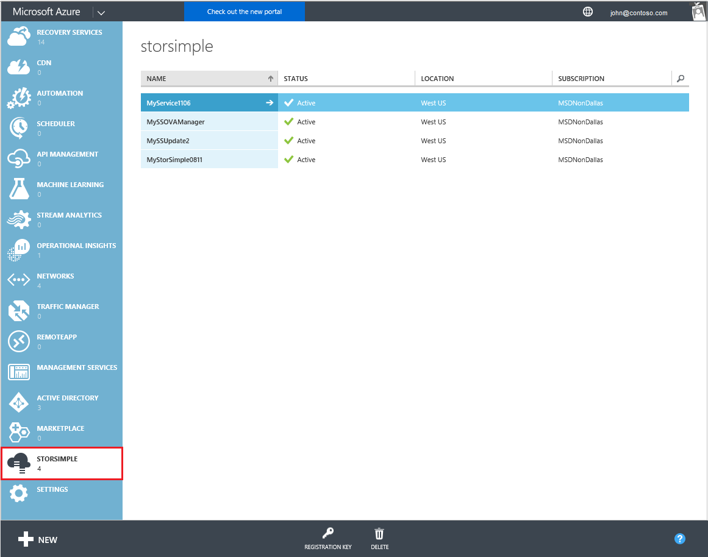

<properties 
   pageTitle="StorSimple Manager virtuellen Array Administration | Microsoft Azure"
   description="Erfahren Sie, wie Ihre StorSimple lokalen Virtual Array mithilfe des StorSimple Manager-Diensts in der klassischen Azure-Portal zu verwalten."
   services="storsimple"
   documentationCenter=""
   authors="alkohli"
   manager="carmonm"
   editor="" />
<tags 
   ms.service="storsimple"
   ms.devlang="na"
   ms.topic="article"
   ms.tgt_pltfrm="na"
   ms.workload="na"
   ms.date="10/11/2016"
   ms.author="alkohli" />

# Verwenden des StorSimple Manager-Diensts Ihre StorSimple Virtual Array verwalten

## (Übersicht)

In diesem Artikel werden die StorSimple Manager Service Interface, einschließlich der Herstellen einer Verbindung mit erkannt und die verschiedenen Optionen zur Verfügung, und enthält Links zu den bestimmte Workflows, die über diese Benutzeroberfläche ausgeführt werden können. 

Nach dem Lesen dieses Artikels, wissen Sie so:

- Verbinden mit dem Dienst StorSimple-Manager
- Navigieren der StorSimple Manager-Benutzeroberfläche
- Verwalten Sie Ihrer StorSimple Virtual Array über den StorSimple-Manager-Dienst

> [AZURE.NOTE] Wechseln Sie zum Anzeigen der Verwaltungsoptionen für das Gerät StorSimple 8000 Serie verfügbar verwenden [den StorSimple-Manager-Dienst auf Ihrem Gerät StorSimple verwalten](storsimple-manager-service-administration.md).

## Verbinden mit dem Dienst StorSimple-Manager

Der Dienst StorSimple-Manager in Microsoft Azure ausgeführt wird und eine Verbindung mit mehreren StorSimple virtuelle Arrays. Sie verwenden eine zentrale klassischen Portal von Microsoft Azure in einem Browser ausgeführt, um diese Geräte verwalten. Informationen zum Verbinden mit dem Dienst StorSimple Manager Folgendes ein.

#### Die Verbindung zum Dienst

1. Wechseln Sie zu [https://manage.windowsazure.com/](https://manage.windowsazure.com/).

2. Melden Sie sich mit Ihrem Microsoft-Konto-Anmeldeinformationen, klassische Microsoft Azure-Portal (befindet sich in der oberen rechten Rand des Bereichs).

3. Führen Sie einen Bildlauf nach unten im linken Navigationsbereich auf den Dienst StorSimple Manager zuzugreifen.

    

## Navigieren Sie den Dienst StorSimple Manager-Benutzeroberfläche

Der Navigationshierarchie für den Dienst StorSimple Manager ist Benutzeroberfläche in der folgenden Tabelle aufgeführt.

- Die Startseite **StorSimple Manager** gelangen Sie zum Servicelevel Benutzeroberfläche Seiten für alle virtuelle Arrays in einem Dienst verfügbar.

- Die Seite **Geräten** gelangen Sie zum Gerät – Ebene Benutzeroberfläche Seiten zu einem bestimmten virtuellen Array verfügbar.

#### StorSimple Manager Service Navigationshierarchie

|Startseite|Servicelevel Seiten|Gerät Ebene Seiten|
|---|---|---|
|StorSimple-Manager-Dienst|Dashboard (Dienst)|Dashboard (Gerät)|
||Geräte →|Monitor|
||Zusätzliche Katalog|Freigaben (Dateiserver) oder  Datenmengen (iSCSI-Server)|
||Konfigurieren (Service)|Konfigurieren von (Gerät)|
||Aufträge|Wartung|
||Benachrichtigungen|

## Verwenden Sie den Dienst StorSimple Manager-Verwaltungsaufgaben ausführen

Die folgende Tabelle enthält eine Zusammenfassung aller häufige Verwaltungsaufgaben und komplexe Workflows, die innerhalb der StorSimple Verwaltungsdienst für die Benutzeroberfläche ausgeführt werden können. Diese Aufgaben werden basierend auf der Benutzeroberfläche Seiten organisiert Grundlage ihrer Ausführung beschrieben.

Weitere Informationen zu den einzelnen Workflows klicken Sie auf die entsprechende Vorgehensweise in der Tabelle.

#### StorSimple Manager workflows

|Wenn Sie dies tun möchten...|Wechseln Sie zu dieser Seite Benutzeroberfläche...|Gehen Sie folgendermaßen vor|
|---|---|---|
|Erstellen Sie einen Dienst Löschen Sie einen Dienst Abrufen der Dienst Registrierungsschlüssel Der Dienst Registrierungsschlüssel neu zu generieren|StorSimple-Manager-Dienst|[Bereitstellen des StorSimple Manager-Diensts](storsimple-ova-manage-service.md)|
|Ändern Sie den Dienst Daten Verschlüsselungsschlüssel Die Protokolle der Vorgänge anzeigen|StorSimple Manager Service → Dashboard|[Verwenden Sie das StorSimple Service-dashboard](storsimple-ova-service-dashboard.md)|
|Deaktivieren eines Virtual Arrays Löschen eines Virtual Arrays|StorSimple Manager Service →-Geräte|[Deaktivieren oder Löschen einer Virtual Array](storsimple-ova-deactivate-and-delete-device.md)|
|Disaster Wiederherstellung und Gerät failover Failover erforderliche Komponenten Failover zu einem virtuellen Gerät Business Continuity Wiederherstellung (BCDR) Fehler bei der Wiederherstellung|StorSimple Manager Service →-Geräte|[Disaster Wiederherstellung und Gerät Failover für Ihre virtuelle StorSimple-Matrix](storsimple-ova-failover-dr.md)|
|Sichern von Freigaben und Datenmengen Nehmen Sie eine manuelle Sicherung Ändern des Zeitplans Sicherung Vorhandene Sicherungskopien anzeigen|StorSimple Manager Service → Sicherung-Katalog|[Erstellen einer Sicherungskopie Ihrer StorSimple Virtual Array](storsimple-ova-backup.md)|
|Stellen Sie Freigaben aus einer Sicherung wieder her Stellen Sie Datenmengen aus einer Sicherung wieder her Auf Elementebene Wiederherstellung (nur Dateiserver)|StorSimple Manager Service → Sicherungskatalog|[Wiederherstellen Sie aus einer Sicherung Ihres StorSimple virtuelle Arrays](storsimple-ova-restore.md)|
|Informationen zu Speicherkonten Hinzufügen eines Kontos Speicher Bearbeiten einer Speicher-Kontos Löschen eines Kontos Speicher|StorSimple Manager Service → konfigurieren|[Verwalten von Speicherkonten für die virtuelle StorSimple-Matrix](storsimple-ova-manage-storage-accounts.md)|
|Informationen zu Access-Steuerelement Datensätze Hinzufügen oder Ändern eines Datensatzes der Access-Steuerelement  Löschen eines Datensatzes der Access-Steuerelement|StorSimple Manager Service → konfigurieren|[Verwalten von Access Steuerelement Einträge für die virtuelle StorSimple Array](storsimple-ova-manage-acrs.md)|
|Anzeigen von Details zu Position|StorSimple Manager-Dienst → Aufträgen| [Verwalten von Aufträgen StorSimple Virtual Array](storsimple-ova-manage-jobs.md)|
|Konfigurieren von Benachrichtigungseinstellungen Lassen Sie sich benachrichtigen Benachrichtigungen verwalten Überprüfen von Benachrichtigungen|StorSimple Manager Service → Benachrichtigungen|[Anzeigen und Verwalten von Benachrichtigungen für die virtuelle StorSimple-Matrix](storsimple-ova-manage-alerts.md)|
|Ändern Sie das Kennwort des Administrators|StorSimple Manager Service → Geräte → konfigurieren|[Ändern des StorSimple Virtual Array Gerät Administratorkennworts](storsimple-ova-change-device-admin-password.md)|
|Installieren von Software-updates|StorSimple Manager Service → Geräte → Wartung|[Aktualisieren Sie Ihre Virtual Array](storsimple-ova-install-update-01.md)|

>[AZURE.NOTE] Sie müssen die [lokale Web-Benutzeroberfläche](storsimple-ova-web-ui-admin.md) für die folgenden Aufgaben verwenden:
>
>- [Rufen Sie den Dienst Daten Verschlüsselungsschlüssel](storsimple-ova-web-ui-admin.md#get-the-service-data-encryption-key)
>- [Erstellen Sie ein Supportpaket](storsimple-ova-web-ui-admin.md#generate-a-log-package)
>- [Beenden Sie und neu starten Sie virtuelles Array](storsimple-ova-web-ui-admin.md#shut-down-and-restart-your-device)

##Nächste Schritte
Informationen zu der Web-Benutzeroberfläche und zur gemeinsamen Nutzung finden Sie unter [verwenden das StorSimple-Web-Benutzeroberfläche zum Verwalten Ihrer StorSimple Virtual Array](storsimple-ova-web-ui-admin.md).
