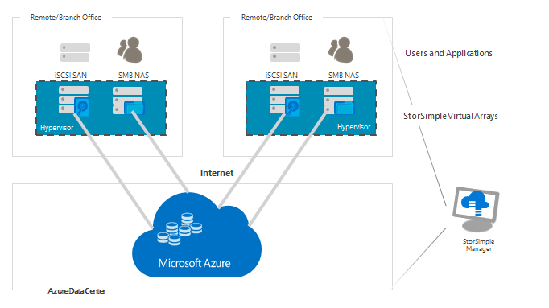
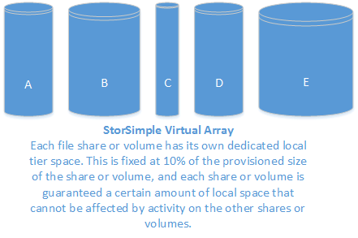

<properties
   pageTitle="StorSimple virtuelle Array Übersicht | Microsoft Azure"
   description="Beschreibt die StorSimple virtuelle Array, eine integrierte Speicher-Lösung, die Verwalten von Speicheraufgaben zwischen einer lokalen virtuelles Gerät und Microsoft Azure-Cloud-Speicher."
   services="storsimple"
   documentationCenter="NA"
   authors="alkohli"
   manager="carmonm"
   editor="" />
<tags 
   ms.service="storsimple"
   ms.devlang="NA"
   ms.topic="article"
   ms.tgt_pltfrm="NA"
   ms.workload="TBD"
   ms.date="10/06/2016"
   ms.author="alkohli" />

# Einführung in die virtuelle StorSimple-Matrix

## (Übersicht)

Willkommen Sie bei der Microsoft Azure StorSimple virtuelle Matrix, eine integrierte Speicher-Lösung, die Verwalten von Speicheraufgaben zwischen einer lokalen virtuelles Gerät in einem Hypervisor und Microsoft Azure-Cloud-Speicher ausgeführt. Das virtuelle Array (auch bekannt als StorSimple lokale virtuelle Gerät) ist eine effiziente, kostengünstiger und einfach zu verwaltende Dateiserver oder iSCSI-Server-Lösung, bei denen keine zahlreiche Probleme und Ausgaben im Zusammenhang mit Enterprise Speicherung und Datenschutz. Die virtuelle Matrix ist für den remote-Standort Office (ROBO) Szenarien besonders gut geeignet.

In dieser Übersicht Schwerpunkt auf die virtuelle Matrix. 

- Eine Übersicht über die StorSimple 8000-Serie, wechseln Sie zu [StorSimple 8000-Serie: einer Hybrid-Cloud-Lösung](storsimple-overview.md). 

- Wechseln Sie Informationen über das StorSimple 5000/7000 Reihe Gerät zu [StorSimple Online-Hilfe](http://onlinehelp.storsimple.com/).

Die virtuelle Matrix unterstützt das iSCSI- oder Protokoll (SMB = Server Message Block). Auf Ihrer vorhandenen Hypervisor Infrastruktur ausgeführt und stellt die Cloud, Cloud Sicherung, schnell wiederherstellen, Wiederherstellung auf Elementebene und Disaster Wiederherstellungsfeatures Stufen.

In der folgenden Tabelle werden die wichtigsten Features des Arrays virtuellen zusammengefasst.

| Feature | Virtuelle Array |
| ------- | ------------- |
|Installationsanforderungen | Verwendet Virtualisierungsinfrastruktur (Hyper-V oder VMware)|
| Verfügbarkeit | Einzelnen Knoten |
| Gesamte Kapazität (einschließlich Cloud) |Bis zu 64 TB verwendbar Kapazität pro virtuelle Gerät |
| Lokale Kapazität | 390 GB zu 6,4 TB verwendbar Kapazität pro virtuelles Gerät (500 GB auf 8 TB Speicherplatz bereitstellen müssen)|
| Systemeigene Protokolle | iSCSI- oder SMB |
| Ziel der Wiederherstellung Zeit (RTO) | iSCSI: weniger als 2 Minuten unabhängig von der Größe |
| Wiederherstellung Punkt Ziel (RPO) | Tägliche und bei Bedarf Sicherungen |
| Stufen Speicherplatz | Verwendung eines Thermostaten Zuordnung, um zu bestimmen, welche Daten oder verkleinern gestuft werden soll |
| Support | Virtualisierungsinfrastruktur vom Lieferanten unterstützt |
| Leistung | Abhängig von zugrunde liegenden Infrastruktur |
| Datenmobilität | Können auf dem gleichen Gerät zurücksetzen Sie, oder gehen Sie wie folgt auf Elementebene Wiederherstellung (Dateiserver) |
| Speicherebenen | Lokale Hypervisor-Speicher und die cloud |
| Freigeben der Größe |Ebenen: bis zu 20 TB; lokal angehefteten: bis zu 2 TB |
| Volumegröße |Ebenen: bis zu 5 TB; lokal angehefteten: bis zu 500 GB |
| Momentaufnahmen | Konsistente Absturz |
| Wiederherstellung auf Elementebene | Ja; Benutzer können aus Freigaben wiederherstellen. |

## Gründe für die Verwendung von StorSimple

StorSimple verbindet Benutzer und Server mit Azure-Speicher in Minuten Anwendung nicht geändert werden.

Die folgende Tabelle beschreibt einige der wichtigsten Vorteile, die die Lösung Virtual Array bereitstellt.

| Feature | Vorteile |
|---------|---------|
| Transparente integration | Die virtuelle Matrix unterstützt die iSCSI- oder das SMB-Protokoll. Die Verlagerung von Daten zwischen der lokalen Ebene und die Cloud Ebene stellt nahtlose und für den Benutzer transparent.|
| Geringere Speicher-Kosten | Mit StorSimple bereitgestellt ausreichend lokalen Speicher zum aktuellen Bedürfnisse für die am häufigsten verwendeten wichtiges Daten entsprechen. Anforderungen Speicher wächst cloud StorSimple Ebenen kalte Daten in kostengünstiger Speicher aus. Die Daten deduplizierte und komprimiert vor dem Senden in der Cloud zu Speicher Anforderungen und Spesen weiter zu verringern.|
| Vereinfachte Speicher-management | StorSimple stellt die zentrale Verwaltung in der Cloud Verwalten mehrerer Geräte mit dem StorSimple-Manager.| 
| Verbesserte Wiederherstellung und Konformität | StorSimple erleichtert schneller Wiederherstellung durch die Metadaten sofort wiederherstellen und Wiederherstellen von Daten nach Bedarf an. Dies bedeutet, dass normale Vorgänge mit minimaler Unterbrechung fortgesetzt werden können.|
| Datenmobilität | Daten in der Cloud gestuft von anderen Websites Wiederherstellung und-Migration Zwecken zugegriffen werden kann. Beachten Sie, dass nur für das ursprüngliche virtuelle Array Daten wiederhergestellt werden können. Verwenden Sie dagegen Disaster Wiederherstellungsfeatures des gesamten Virtual Array in ein anderes virtuelle Array wiederherstellen aus.|

## StorSimple Arbeitsbelastung Zusammenfassung

Eine Zusammenfassung der unterstützten StorSimple Auslastung ist unter tabellarisch angeordnet.

| Szenario                | Arbeitsbelastung              | Unterstützt |  Einschränkungen                                  | Version              |
|-------------------------|-----------------------|-----------|------------------------------------------------|----------------------|
| ROBO für die Zusammenarbeit      | Freigeben von Dateien          | Ja       | [Höchstwerte für Dateiserver](storsimple-ova-limits.md)finden Sie unter.  Finden Sie unter [Systemanforderungen für unterstützte SMB Versionen](storsimple-ova-system-requirements.md).   | Alle Versionen      |

## Workflows

Virtuelle StorSimple Array eignet sich besonders für die folgenden Workflows:

- [Cloudbasierte Datenspeicher management](#cloud-based-storage-management)
- [Ortsunabhängig Sicherung](#location-independent-backup)
- [Datenschutz und Disaster Wiederherstellung von Daten](#data-protection-and-disaster-recovery)

### Cloudbasierte Datenspeicher management

Der Ausführung im klassischen Azure-Portal Verwaltungsdienst für StorSimple können zum Verwalten von Daten auf mehreren Geräten und an mehreren Speicherorten gespeichert. Dies ist in verteilten Verzweigung Szenarien besonders hilfreich. Beachten Sie, dass Sie separate Instanzen des Diensts StorSimple Manager zum Verwalten von virtuellen Arrays und physische StorSimple Geräte erstellen müssen. 

### Ortsunabhängig Sicherung

Mit dem virtuelle Array bieten Cloud Momentaufnahmen eine ortsunabhängig, Point-in-Time-Kopie einer Volume oder freigeben. Cloud Momentaufnahmen sind standardmäßig aktiviert und können nicht deaktiviert werden. Alle Datenmengen und Freigaben zur gleichen Zeit durch eine einzelne tägliche Sicherung Richtlinie gesichert werden, und Sie zusätzliche Ad-hoc-Sicherungskopien bei Bedarf ausführen können.

### Datenschutz und Disaster Wiederherstellung von Daten

Die virtuelle Matrix unterstützt die folgenden Daten Datenschutz und Disaster Wiederherstellungsszenarien:

- **Volumen oder freigeben wiederherstellen** – verwenden der Wiederherstellung als neuen Workflow zum Volume oder Freigabe wiederherstellen. Verwenden Sie diese Methode, um die ganze Volumen oder freigeben wiederherzustellen.
- **Wiederherstellung auf Elementebene** – Freigaben vereinfachten Zugriff auf aktuelle Sicherungen zulassen. Sie können eine einzelne Datei einfach aus einem in der Cloud verfügbar spezielle .backup-Ordner wiederherstellen. Diese Wiederherstellungsfunktion ist benutzergesteuerte und keine administrativen Eingriff ist nicht erforderlich.
- **Wiederherstellung** – verwenden der Failoverfähigkeit, um alle Datenmengen oder Freigaben in ein neues virtuelle Array wiederherzustellen. Sie erstellen die neue virtuelle Matrix mit der StorSimple Manager-Dienst zu registrieren, und dann über das ursprüngliche virtuelle Array fehl. Das neue virtuelle Array geht dann davon bereitgestellten Ressourcen aus. 

## Virtuelle Matrixkomponenten zurück

Das virtuelle Array umfasst die folgenden Komponenten:

- [Virtuelle Array](#virtual-array) – ein basierend auf einem virtuellen Computer nach der Bereitstellung Ihrer virtualisierten Umgebung oder Hypervisor Hybriden Cloud-Speichergerät.  
- [StorSimple-Manager-Dienst](#storsimple-manager-service) – Erweiterung des klassischen Azure Portals, in dem Sie können verwalten ein oder mehrere StorSimple Geräte von einer einzigen Web-Benutzeroberfläche, die Sie aus verschiedenen geografischen Standorten zugreifen können. Den Dienst StorSimple-Manager können Sie das Erstellen und Verwalten von Diensten, anzeigen und Geräte und Benachrichtigungen verwalten und Datenmengen, Freigaben und vorhandenen Momentaufnahmen verwalten.
- [Lokale Web-Benutzeroberfläche](#local-web-user-interface) – eine webbasierte Benutzeroberfläche, die verwendet wird, um das Gerät so konfigurieren, dass es kann mit dem lokalen Netzwerk verbinden, und klicken Sie dann das Gerät mit dem Dienst StorSimple Manager registrieren. 
- [Line-Schnittstelle](#command-line-interface) – eine Windows PowerShell-Benutzeroberfläche, die Sie zum Starten einer Support-Sitzung auf dem virtuelle Array verwenden können.
In den folgenden Abschnitten wird jedes dieser Komponenten ausführlicher beschrieben und erläutert, wie die Lösung ordnet die Daten, weist Speicher und erleichtert Speicher-Management und Datenschutz.

### Virtuelle Array

Das virtuelle Array ist einer einzigen Knoten Storage-Lösung, die primären Speicher bereitstellt, verwaltet die Kommunikation mit Cloud-Speicher und trägt dazu bei, die Sicherheit und Vertraulichkeit aller Daten, die auf dem Gerät gespeichert ist.

Die virtuelle Matrix steht in einem Modell, die zum Download zur Verfügung. Speicher-Array verfügt über eine maximale Kapazität von 6,4 TB auf dem Gerät (mit einer zugrunde liegenden Speicher Vorbedingung 8 TB) und 64 TB einschließlich cloud-Speicher. 

Das virtuelle Array weist die folgenden Features:

- Es ist kostengünstiger. Es ist Ihrer vorhandenen Virtualisierung Infrastruktur verwenden, und klicken Sie auf der vorhandenen Hyper-V oder VMware Hypervisor bereitgestellt werden kann.
- Im Datencenter verschlüsselt und kann als ein iSCSI-Server oder einem Dateiserver konfiguriert werden. 
- Es ist in der Cloud integriert.
- Sicherungskopien werden in der Cloud gespeichert, die Wiederherstellung erleichtern können, und vereinfachen Elementebene Wiederherstellung (ILR). 
- Sie können Updates in das virtuelle Array, anwenden, wie Sie diese auf einem physischen Gerät anwenden möchten.

>[AZURE.NOTE] Eine virtuelle Matrix kann nicht erweitert werden. Daher ist es wichtig, ausreichend Speicher bereitstellen, wenn Sie das virtuelle Gerät erstellen. 

### StorSimple-Manager-Dienst

Microsoft Azure StorSimple webbasierten stellt eine Benutzeroberfläche bereit (der Dienst StorSimple Manager), die Sie zentral verwalten Datacenter und cloud-Speicher ermöglicht. Den Dienst StorSimple-Manager können Sie die folgenden Aufgaben ausführen:

- Verwalten Sie mehrere StorSimple virtuelle Arrays aus einem einzelnen Dienst an. 
- Konfigurieren Sie und verwalten Sie der Sicherheitseinstellungen für StorSimple Geräte. (Verschlüsselung in der Cloud hängt von Microsoft Azure-APIs.)
- Konfigurieren von Speicher Anmeldeinformationen und Eigenschaften.
- Konfigurieren und Verwalten von Datenmengen oder Freigaben.
- Sichern und Wiederherstellen von Daten auf dem Datenträger oder Freigaben.
- Überwachen der Leistung.
- Überprüfen Sie der Systemeinstellungen und erkennen Sie mögliche Probleme.

Mithilfe den StorSimple Manager-Dienst tägliche Verwaltung Ihres virtuellen Arrays werden.

Weitere Informationen finden Sie verwenden [die StorSimple-Manager-Dienst auf Ihrem Gerät StorSimple verwalten](storsimple-manager-service-administration.md).

### Lokale Web-Benutzeroberfläche

Das virtuelle Array enthält eine webbasierte Benutzeroberfläche, die für die einmalige Konfiguration und Registrierung des Geräts mit der StorSimple Manager-Dienst verwendet wird. Sie können sie verwenden, fahren Sie und neu starten des Virtual Array, diagnostic Tests ausführen, Software zu aktualisieren, ändern das Kennwort des Administrators, Systemprotokolle anzuzeigen, und wenden Sie sich an Microsoft Support, um eine Serviceanfrage Datei. 

Informationen zur Verwendung von der webbasierten Benutzeroberfläche wechseln Sie zu [Verwenden der webbasierten Benutzeroberfläche zum Verwalten Ihrer StorSimple Virtual Array](storsimple-ova-web-ui-admin.md).

### Befehlszeile

Die darin enthaltenen Windows PowerShell-Benutzeroberfläche können Sie keine Support-Sitzung mit Microsoft Support einleiten, damit er Ihnen helfen, behandeln und Lösen von Problemen, die auf Ihrem Gerät virtuelle auftreten können.

## Projektmanagement-Technologien

Zusätzlich zu den Virtual Array und andere unsichere Komponenten verwendet die Lösung StorSimple die folgende Software Technologien bieten schnellen Zugriff auf wichtige Daten, Speichers reduzieren und Schützen Ihrer virtuelle Array gespeicherte Daten an:

- [Automatische Speicherung Stufen](#automatic-storage-tiering) 
- [Lokal angeheftete Freigaben und Datenmengen](#locally-pinned-shares-and-volumes)
- [Beseitigung von Duplikaten sowie eine Komprimierung von Daten gestuft oder in der Cloud gesichert](#deduplication-and-compression-for-data-tiered/backed-up-to-the-cloud) 
- [Geplante und bei Bedarf Sicherungskopien](#scheduled-and-on-demand-backups)

### Automatische Speicherung Stufen

Virtual Array wird ein neues tiering Verfahren zum Verwalten von gespeicherter Daten über die virtuelle Matrix und der Cloud verwendet. Es gibt nur zwei Ebenen: die lokale virtuelle Matrix und Azure cloud-Speicher. Virtuelle StorSimple Array ordnet Daten automatisch in die Ebenen anhand eines wärmebilds, das aktuelle Verwendung, Alter und Beziehungen auf andere Daten nachverfolgt. Daten, die am aktivsten (neuesten) lokal gespeichert ist, während weniger aktive und inaktive Daten automatisch in die Cloud migriert werden. (Alle Sicherungskopien werden in der Cloud gespeichert.) StorSimple passt und werden Daten neu angeordnet und Speicher Zuordnungen als Verwendungsmuster ändern. Beispielsweise möglicherweise einige Informationen zu weniger über einen Zeitraum aktiv. Sobald sie schrittweise weniger aktiv sind, ist es in der Cloud, gestuft. Wenn Sie die gleichen Daten wieder aktiv ist, ist es zum Speicher-Array in gestuft.

Daten für ein bestimmtes gestufte freigeben oder die Lautstärke ist sichergestellt, dass die eigenen lokalen Ebene Leerzeichen. (etwa 10 % des Speicherplatzes bereitgestellte für die Freigabe oder das Volume). Während dies den verfügbaren Speicherplatz auf dem virtuelle Gerät für die Freigabe oder das Volume reduziert, wird sichergestellt, dass der Stufen für eine Freigabe oder das Volume nicht den tiering Anforderungen andere Freigaben oder Datenträger auswirkt. Eine sehr beschäftigt Arbeitsbelastung für eine Freigabe oder das Volume kann daher nicht alle aufgrund der Ergebnisse in der Cloud erzwingen. 

>[AZURE.NOTE] Sie können einen Datenträger als lokal angehefteten angeben, die in diesem Fall die Daten auf dem virtuelle Array bleibt und nie gestuft, in der Cloud. Wechseln Sie weitere Informationen zu [lokal angehefteten Freigaben und Datenmengen](#locally-pinned-shares-and-volumes).

### Lokal angeheftete Freigaben und Datenmengen

Sie können die entsprechenden Freigaben und als lokal angehefteten Datenmengen erstellen. Diese Funktion wird sichergestellt, dass von Applications kritische benötigten Daten in der Matrix virtuelle bleibt, und ist in der Cloud nie gestuft. Lokal angeheftete Freigaben und Datenmengen weisen die folgenden Features: 

- Sie sind nicht unterliegen Cloud Wartezeiten oder Netzwerkkonnektivitätsprobleme vor.
- Diese nutzbringend weiterhin StorSimple Cloud sichern und Disaster Wiederherstellungsfeatures.

Können Sie Wiederherstellen einer lokal angeheftete freigeben oder Volume als gestuft oder eine gestufte freigeben oder Volumen als lokal angehefteten. 

Weitere Informationen zu lokal angeheftete Datenmengen wechseln Sie zu [Verwenden der Verwaltungsdienst für StorSimple Datenmengen verwalten](storsimple-manage-volumes-u2.md).

### Beseitigung von Duplikaten sowie eine Komprimierung von Daten gestuft oder in der Cloud gesichert

StorSimple verwendet Beseitigung von Duplikaten sowie Daten Komprimierung um Speicher Anforderungen in der Cloud weiter zu verringern. Deduplication reduziert Gesamtbetrag der Daten durch Vermeidung Redundanz gespeicherten Daten festlegen gespeichert. Wie Informationen verwandelt hat, StorSimple ignoriert die Daten nicht geändert, und Sie werden nur die Änderungen erfasst. Darüber hinaus verringert StorSimple die gespeicherte Datenmenge identifizieren und Entfernen von doppelten Informationen. 

>[AZURE.NOTE] Die virtuelle Array gespeicherte Daten ist deduplizierte oder nicht komprimiert. Alle Deduplizierung und Komprimierung erfolgt unmittelbar vor dem Senden der Daten in der Cloud.

### Geplante und bei Bedarf Sicherungskopien

StorSimple Datenschutzfunktionen können Sie bei Bedarf Sicherungskopien zu erstellen. Darüber hinaus ist ein Sicherungskopie standardmäßigen Zeitplan sichergestellt, dass es sich bei Daten täglich gesichert werden. Sicherungskopien werden in Form von Momentaufnahmen inkrementell, entnommen, die in der Cloud gespeichert sind. Momentaufnahmen konvertiert, die nur der ändert sich seit der letzten Sicherung aufzeichnen, können erstellt und schnell wiederhergestellt werden. Diese Momentaufnahmen können in Notfallwiederherstellungsszenarios entscheidend sein, da diese sekundären Speichersysteme (z. B. Band) ersetzen, und ermöglichen es Ihnen Daten Datencenters oder alternative Websites bei Bedarf wiederhergestellt werden.

## Nächste Schritte

Erfahren Sie, wie [im Portal Virtual Array vorbereiten](storsimple-ova-deploy1-portal-prep.md).

