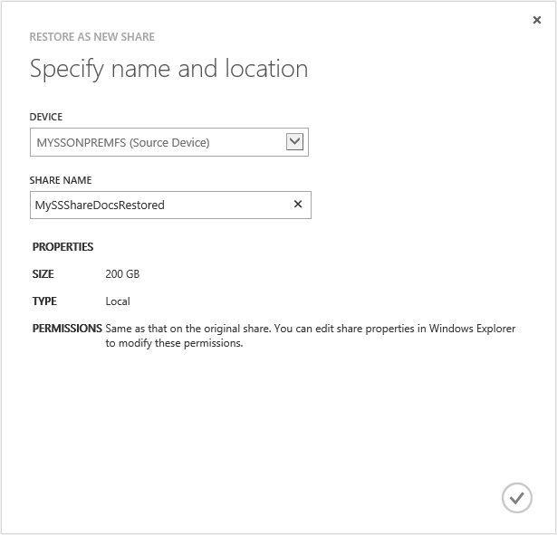
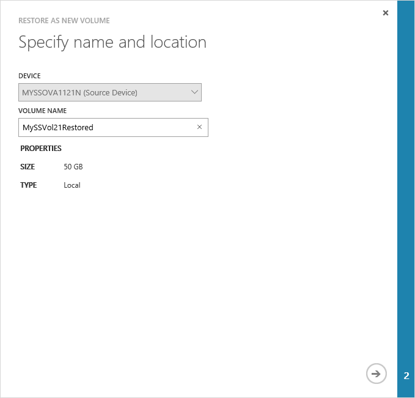
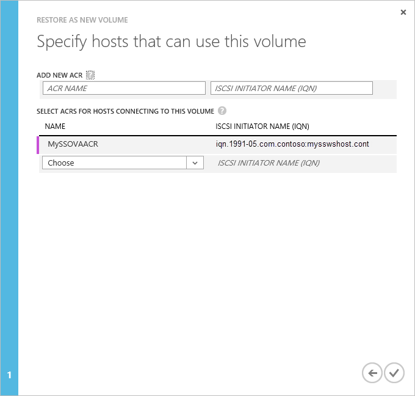
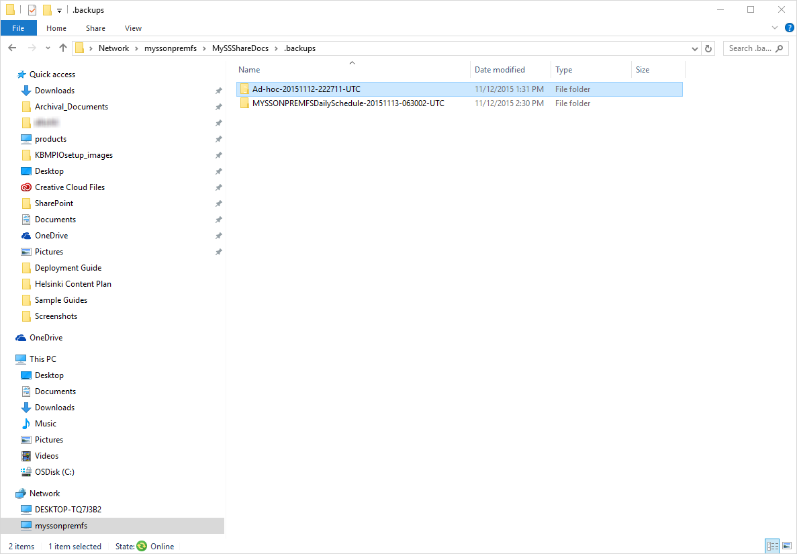

<properties
   pageTitle="Wiederherstellen Sie aus einer Sicherung Ihres StorSimple virtuelle Arrays"
   description="Weitere Informationen zum Wiederherstellen einer Sicherung Ihres StorSimple virtuelle Arrays."
   services="storsimple"
   documentationCenter="NA"
   authors="alkohli"
   manager="carmonm"
   editor=""/>

<tags
   ms.service="storsimple"
   ms.devlang="NA"
   ms.topic="article"
   ms.tgt_pltfrm="NA"
   ms.workload="NA"
   ms.date="06/07/2016"
   ms.author="alkohli"/>

# Wiederherstellen Sie aus einer Sicherung Ihres StorSimple virtuelle Arrays

## (Übersicht) 

Dieser Artikel bezieht sich auf Microsoft Azure StorSimple Virtual Array (auch bekannt als StorSimple lokalen virtuelles Gerät oder StorSimple virtuelles Gerät) laufenden März 2016 allgemeine Verfügbarkeit (GA) Version oder höher. Dieser Artikel beschreibt schrittweise Verfahren zum Wiederherstellen aus einer Sicherung Menge von Freigaben oder Datenmengen auf Ihrem StorSimple virtuelle Array. Dieser Artikel erläutert auch an, wie die Wiederherstellung auf Elementebene auf Ihrem StorSimple virtuelle Array funktioniert, die als Dateiserver konfiguriert ist.

## Stellen Sie Freigaben aus einer Sicherung wieder her

**Bevor Sie versuchen, die Freigaben wiederherstellen, stellen Sie sicher, dass Sie über genügend Speicherplatz auf dem Gerät zum Abschließen des Vorgangs haben.** Zum Wiederherstellen aus einer Sicherung, im [Azure klassischen Portal](https://manage.windowsazure.com/)führen Sie die folgenden Schritte aus.

#### So stellen Sie eine Freigabe wieder her

1.  Navigieren Sie zu der **Katalog sichern**. Filtern Sie nach entsprechenden Gerät und Zeitbereich für Ihre Sicherungskopien zu suchen. Klicken Sie auf das Symbol Kontrollkästchen  zum Ausführen der Abfrage.

1.  Klicken Sie in der Liste der Sätze Sicherung angezeigt werden soll auf, und wählen Sie eine bestimmte Sicherung aus. Erweitern Sie die Sicherung, um die unterschiedlichen Freigaben darunter angezeigt. Klicken Sie auf, und wählen Sie eine Freigabe, die Sie wiederherstellen möchten.

2.  Klicken Sie am unteren Rand der Seite auf die **als neue wiederherstellen**.

3.  Diese rufen Sie den Assistenten **als neue Freigabe wiederherstellen** . Klicken Sie auf der Seite **angeben Namen und einen Speicherort** :

    1.  Überprüfen Sie den Namen der Quelle Gerät aus. Dies sollte das Gerät sein, das die Freigabe enthält, die Sie wiederherstellen möchten. Die Geräteauswahl abgeblendet ist. Zum Auswählen einer anderen Quellgerät müssen Sie den Assistenten zu beenden, und wählen Sie erneut die Sicherung erneut aus.

    2.  Geben Sie einen Freigabenamen. Der Name muss 3 bis 127 Zeichen enthalten.

    3.  Überprüfen Sie die Größe, Typ, und zugeordneten Berechtigungen der freigeben, die Sie wiederherstellen möchten. Sie werden möglicherweise von so ändern Sie die Eigenschaften freigeben über Windows-Explorer nach Abschluss der Wiederherstellung.

    4.  Klicken Sie auf das Symbol Kontrollkästchen .

        

1.  Nach Abschluss der Wiederherstellungsauftrag der Wiederherstellung zu beginnen, und eine weitere Benachrichtigung werden angezeigt. Zum Überwachen des Fortschritts von wiederherstellen klicken Sie auf **Ansicht Position**. Dadurch gelangen Sie zur Seite **Aufträge** .

2.  Sie können den Wiederherstellungsauftrag überwachen. Wenn die Wiederherstellung 100 % abgeschlossen ist, navigieren Sie zurück zu der Seite **Freigaben** auf Ihrem Gerät.

3.  Sie können nun die neue wiederhergestellte Freigabe in der Liste der Freigaben auf Ihrem Gerät anzeigen. Beachten Sie die Wiederherstellung auf den gleichen Typ der Freigabe erfolgen soll. Eine gestufte Freigabe wird wiederhergestellt, wie gestuft und als lokal angeheftete Freigabe einer lokal angeheftete freigeben.

Sie haben nun die Gerätekonfiguration abgeschlossen und gelernt, sichern oder Wiederherstellen einer freigeben. 

## Stellen Sie Datenmengen aus einer Sicherung wieder her

Zum Wiederherstellen aus einer Sicherung, die Azure klassischen-Portal führen Sie die folgenden Schritte aus. Bei der Wiederherstellung stellt ein neues Volume auf dem gleichen virtuellen Gerät die Sicherung wieder her; Sie können nicht auf ein anderes Gerät wiederherstellen.

#### Ein Volume wiederherstellen

1.  Navigieren Sie zu der **Katalog sichern**. Filtern Sie nach entsprechenden Gerät und Zeitbereich für Ihre Sicherungskopien zu suchen. Klicken Sie auf das Symbol Kontrollkästchen  zum Ausführen der Abfrage.

2.  Klicken Sie in der Liste der Sätze Sicherung angezeigt werden soll auf, und wählen Sie eine bestimmte Sicherung aus. Erweitern Sie die Sicherung, um die verschiedenen Datenträger darunter anzuzeigen. Wählen Sie den Datenträger, die, den Sie wiederherstellen möchten. 

5.  Klicken Sie am unteren Rand der Seite auf die **als neue wiederherstellen**. Der **als neue Volume wiederherstellen** -Assistent wird gestartet.

1.  Klicken Sie auf der Seite **angeben Namen und einen Speicherort** :

    1.  Überprüfen Sie den Namen der Quelle Gerät aus. Dies sollte das Gerät sein, das die Lautstärke enthält, die Sie wiederherstellen möchten. Die Auswahl des Geräts ist nicht verfügbar. Zum Auswählen einer anderen Quellgerät müssen Sie den Assistenten zu beenden, und wählen Sie erneut die Sicherung erneut aus.

    2.  Geben Sie einen Volume-Namen für die Lautstärke wiederhergestellt wird als neue. Der Name der Lautstärke muss 3 bis 127 Zeichen enthalten.

    3.  Klicken Sie auf das Pfeilsymbol.

        

1.  Wählen Sie auf der Seite **angeben Hosts, die diesem Handbuch verwenden, können,** die entsprechenden ACRs in der Dropdownliste aus.

    

1.  Klicken Sie auf das Symbol Kontrollkästchen . Dies wird ein Projekt wiederherstellen initiieren, und sehen Sie die folgende Benachrichtigung, die der Auftrag abgehalten wird.

2.  Nach Abschluss der Wiederherstellungsauftrag der Wiederherstellung zu beginnen, und eine weitere Benachrichtigung werden angezeigt. Klicken Sie auf **Ansicht Auftrag**, zum Überwachen des Fortschritts von wiederherstellen. Dadurch gelangen Sie zur Seite **Aufträge** .

3.  Sie können den Wiederherstellungsauftrag überwachen. Navigieren Sie zu der Seite **Datenmengen** auf Ihrem Gerät zurück.

4.  Sie können jetzt das neue wiederhergestellte Volume in die Liste der Datenträger auf Ihrem Gerät anzeigen. Beachten Sie, dass die Wiederherstellung auf den gleichen Typ des Datenträgers abgeschlossen ist. Eine gestufte Lautstärke ist wie gestuft und ein lokales angeheftete Volume als lokal angeheftete Volume wiederhergestellt wird.

5.  Nachdem Sie die Lautstärke auf die Liste der Datenträger online angezeigt wird, ist die Lautstärke zur Verwendung verfügbar.  Aktualisieren Sie die Liste der Ziele iSCSI Initiator Eigenschaftenfenster auf dem Host iSCSI Initiator.  Ein neues Ziel, das enthält den Namen der wiederhergestellte Volume sollte unter der Statusspalte als "inaktiv" angezeigt werden.

6.  Wählen Sie das Ziel, und klicken Sie auf **Verbinden**.   Nachdem der Initiator an das Ziel angeschlossen ist, sollte der Status auf **verbunden**ändern. 

7.  Im Fenster **Datenträger Verwaltung** werden der aktivierten Datenträger angezeigt, wie in der folgenden Abbildung gezeigt. Mit der rechten Maustaste in der ermittelten Lautstärke (klicken Sie auf den Datenträgernamen), und klicken Sie dann auf **Online**.

> [AZURE.IMPORTANT] Bei dem Versuch, ein Volume oder eine Freigabe aus einer Sicherung wiederherstellen festlegen, wenn der Wiederherstellungsauftrag fehlschlägt, ein Ziel-Volume oder Freigeben im Portal erstellt werden. Es ist wichtig, dass Sie diese Ziel-Volume löschen oder im Portal freigeben, um alle zukünftigen Problemen im Zusammenhang dieses Elements zu minimieren.

## Auf Elementebene Wiederherstellung (ILR)

Diese Version enthält die Wiederherstellung auf Elementebene (ILR) auf einem StorSimple virtuellen Gerät als Dateiserver konfiguriert. Das Feature können Sie präzise Wiederherstellung von Dateien und Ordnern aus einer Sicherung Cloud aller Freigaben auf dem Gerät StorSimple führen. Benutzer können die gelöschte Dateien aus aktuelle Sicherungen mithilfe eines Self-service-Modells abrufen.

Jeder freigeben hat einen *.backups* -Ordner, der die zuletzt Sicherungskopien enthält. Der Benutzer kann navigieren Sie zu der gewünschten Sicherung, relevante Dateien und Ordner aus der Sicherungskopie kopieren und wiederherstellen können. Dadurch Anrufe an Administratoren für Dateien aus Sicherungskopien wiederherstellen.

1.  Wenn Sie die ILR durchführen, können Sie die Sicherungskopien über Windows Explorer anzeigen. Klicken Sie auf die bestimmte freigeben, die Sie bei der Sicherung für suchen möchten. Sie sehen einen *.backups* Ordner erstellt haben, klicken Sie unter freigeben, in dem alle vorhandenen Sicherungskopien gespeichert. Erweitern Sie zum Anzeigen der Sicherungskopien *.backups* . Der Ordner wird dann die Explosionsansicht der gesamten Sicherung Hierarchie angezeigt. Diese Ansicht wird bei Bedarf erstellt und in der Regel sind nur ein paar Sekunden zu erstellen.

    Die letzten 5 Sicherungskopien auf diese Weise angezeigt werden und zum Ausführen einer Wiederherstellung auf Elementebene verwendet werden können. Die 5 aktuellen Sicherungen enthalten die Standardeinstellung geplant und die manuellen Sicherungskopien.

    
    -   **Geplante Sicherungskopien** mit dem Namen als &lt;Gerätenamen&gt;DailySchedule-JJJJMMTT-soll-UTC.

    -   **Manuelle Sicherungskopien** mit dem Namen als Ad-Hoc-JJJJMMTT-soll-UTC.
    
        

1.  Identifizieren Sie die Sicherung, die neueste Version der gelöschten Datei enthält. Obwohl der Ordnernamen einen UTC-Timestamp in jedem der oben genannten Fälle enthält, wird die Uhrzeit, zu der der Ordner erstellt wurde, der tatsächlichen Gerät Uhrzeit, wann die Sicherung gestartet. Verwenden Sie den Ordner Zeitstempel zum Auffinden und Identifizieren der Sicherungskopien ein.

2.  Suchen Sie den Ordner oder die Datei, die in die Sicherung wiederhergestellt werden soll, die Sie im vorherigen Schritt ermittelt werden soll. Beachten Sie, dass Sie die Dateien oder Ordner, denen Sie für Berechtigungen nur anzeigen können. Wenn Sie nicht auf bestimmte Dateien oder Ordner zugreifen können, müssen Sie einen freigeben-Administrator wenden, der Windows-Explorer zum Bearbeiten der Freigabeberechtigungen und gewähren Sie Zugriff auf bestimmte Dateien oder Ordner verwenden können. Es ist empfiehlt es sich, dass der Administrator Freigeben einer Benutzergruppe anstelle eines einzelnen Benutzers werden.

3.  Kopieren Sie die Datei oder den Ordner mit der entsprechenden Freigabe auf Ihrem Dateiserver StorSimple ein.

 **Video verfügbar**

Schauen Sie sich das Video an, um anzuzeigen, wie Sie Freigaben erstellen, Freigaben sichern und Wiederherstellen von Daten auf ein StorSimple virtuelle Array können.

> [AZURE.VIDEO use-the-storsimple-virtual-array]

## Nächste Schritte

Weitere Informationen zum [Verwalten Ihrer StorSimple Virtual Array das lokale Web-Benutzeroberfläche verwenden](storsimple-ova-web-ui-admin.md).
