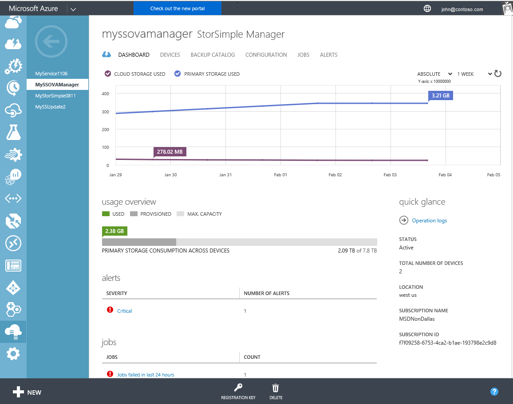
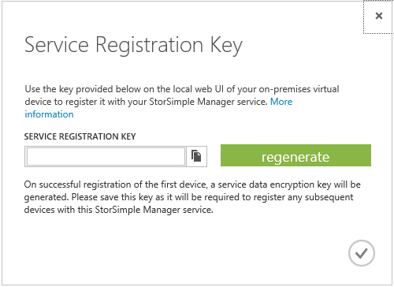
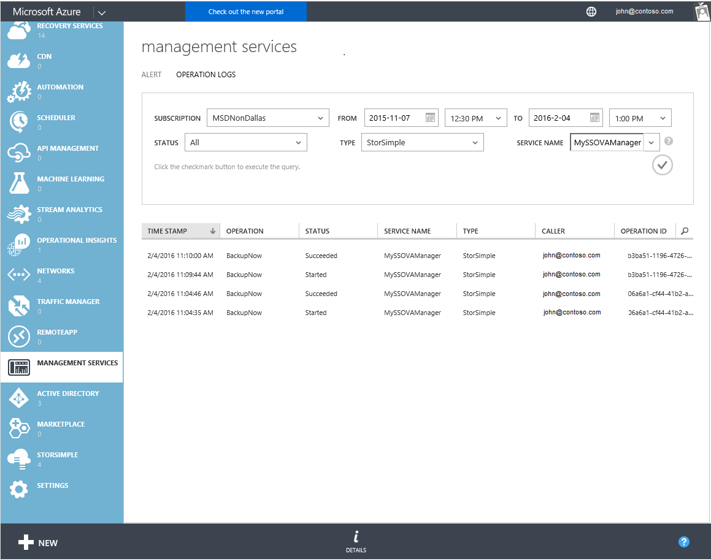

<properties 
   pageTitle="StorSimple Manager-Dienst Dashboard - Virtual Array | Microsoft Azure"
   description="Beschreibt das StorSimple Manager-Dashboard Dienst und erläutert, wie Sie es verwenden, um die Integrität des Arrays virtuellen StorSimple zu überwachen."
   services="storsimple"
   documentationCenter=""
   authors="alkohli"
   manager="carmonm"
   editor="" />
<tags 
   ms.service="storsimple"
   ms.devlang="na"
   ms.topic="article"
   ms.tgt_pltfrm="na"
   ms.workload="na"
   ms.date="04/07/2016"
   ms.author="alkohli" />

# Verwenden Sie das StorSimple Manager Service-Dashboard für die virtuelle StorSimple-Matrix

## (Übersicht)

Die Seite StorSimple Manager-Dashboard bietet eine Zusammenfassungsansicht der StorSimple virtuelle Arrays (auch bekannt als lokalen StorSimple virtuelle Geräte oder virtuelle Geräte), die mit dem Dienst StorSimple Manager verbunden sind diejenigen, die ein Systemadministrator Aufmerksamkeit hervorheben. In diesem Lernprogramm eine Einführung in die Dashboard-Seite, die Dashboard-Inhalte und die Funktion, sowie beschreibt die Aufgaben, die Sie von dieser Seite ausführen können.

Das StorSimple Manager-Dashboard Dienst zeigt die folgenden Informationen:

- Klicken Sie im Bereich **Diagramm** am oberen Rand der Seite sehen Sie die relevanten Kennzahlen für Ihre virtuelle Geräte. Sie können die primäre Speicher auf allen virtuellen Geräten verwendet als auch die Cloud-Speicher von virtuellen Geräten über einen Zeitraum verbraucht anzeigen. Verwenden Sie die Steuerelemente in der oberen rechten Ecke des Diagramms, relativen oder absoluten Verwendung angeben und eine 1 Woche, 1 Monat, 3-Monat oder 1 Jahr Zeitskala angezeigt. Verwenden Sie das Aktualisierungssteuerelement  um das Diagramm zu aktualisieren.

- **Übersicht über die Verwendung** der zeigt den primären Speicher, der bereitgestellt und von den virtuellen Geräten relativ zu den verfügbaren Gesamtspeicher auf allen virtuellen Geräten. **Bereitgestellt** bezieht sich auf der Speichermenge, die vorbereitet und für die Verwendung zugeordnet ist, **zur Verwendung** bezieht sich auf die Verwendung der Freigaben oder Datenmengen, wie Sie durch die Initiatoren angezeigt, die mit der virtuellen Geräte verbunden sind und **Max. Kapazität** zeigt die maximale Kapazität aller virtuellen Geräte.

- Im Bereich **Benachrichtigungen** bietet eine Momentaufnahme der aktiven Warnungen auf allen virtuellen Geräten, gruppiert nach Schwere benachrichtigen. Auf der Ebene schwere öffnet die **Benachrichtigungen** -Seite, die zum Anzeigen dieser Benachrichtigungen ausgelegte. Klicken Sie auf der Seite **Benachrichtigungen** können Sie eine einzelne Benachrichtigung zum Anzeigen von Details über die Benachrichtigung, einschließlich aller empfohlenen Aktionen klicken. Sie können auch die Benachrichtigung deaktivieren, wenn dieses Problem behoben wurde.

- " **Projekte** " bietet eine Momentaufnahme der zuletzt verwendete Aufträge auf allen virtuellen Geräten, die mit Ihrem Dienst verbunden sind. Es gibt Links, die Sie verwenden können, um Einzelvorgänge anzuzeigen, die derzeit in den Fortschritt und die erfolgreich war oder nicht in den letzten 24 Stunden sind. 

- Im Bereich **schnelleinsicht** auf der rechten Seite der Seite bietet nützlichen Informationen, wie z. B. Dienststatus Gesamtzahl von virtuellen Geräten, die an den Dienst, den Speicherort des Diensts und Details des Abonnements, die mit dem Dienst verknüpft ist verbunden. Es gibt auch eine Verknüpfung mit der Log Vorgänge. Klicken Sie auf den Link, um eine Liste aller abgeschlossenen StorSimple Manager Service Vorgänge anzuzeigen. 

Die Dashboardseite StorSimple Manager können die folgenden Aufgaben einleiten:

- Abrufen der Dienst-Registrierungsschlüssel.
- Zeigen Sie die Protokolle der Vorgang an.

## Abrufen der Dienst Registrierungsschlüssel

Der Dienst Registrierungsschlüssel ist ein StorSimple virtuelles Gerät mit dem Dienst StorSimple Manager registrieren verwendet, damit das Gerät im klassischen Azure-Portal für weitere Management-Aktionen angezeigt wird. Die Taste auf dem ersten virtuellen Gerät erstellt und für die verbleibenden virtuelle Geräte freigegeben. 

**Registrierungsschlüssel** (am unteren Rand der Seite) auf wird geöffnet, klicken Sie im Dialogfeld **Dienst Registrierungsschlüssel** können entweder der aktuellen Dienst Registrierungsschlüssel in die Zwischenablage kopieren oder der Dienst Registrierungsschlüssel neu zu generieren.

Erneutes Generieren des Schlüssels wirkt sich nicht auf zuvor registrierten virtuelle Geräte: Es wirkt sich auf nur die virtuelle Geräte, die mit dem Dienst registriert sind, nachdem die Taste neu generiert wird.

Weitere Informationen dazu, wie Sie den Dienst Registrierungsschlüssel zum [Abrufen der Dienst Registrierungsschlüssel](storsimple-ova-manage-service.md#get-the-service-registration-key)wechseln.

## Die Protokolle der Vorgänge anzeigen

Sie können die Protokolle der Vorgang anzeigen, indem Sie auf den Vorgang Protokolle Link im Bereich **schnelleinsicht** des Dashboards verfügbar. Dadurch gelangen Sie zum die Seite Management Services, in dem Sie filtern können, und sehen die Protokolle, die bestimmte an den StorSimple-Manager-Dienst.

## Nächste Schritte

Erfahren Sie, wie [das lokale Web-Benutzeroberfläche zum Verwalten Ihrer StorSimple Virtual Array verwendet](storsimple-ova-web-ui-admin.md).