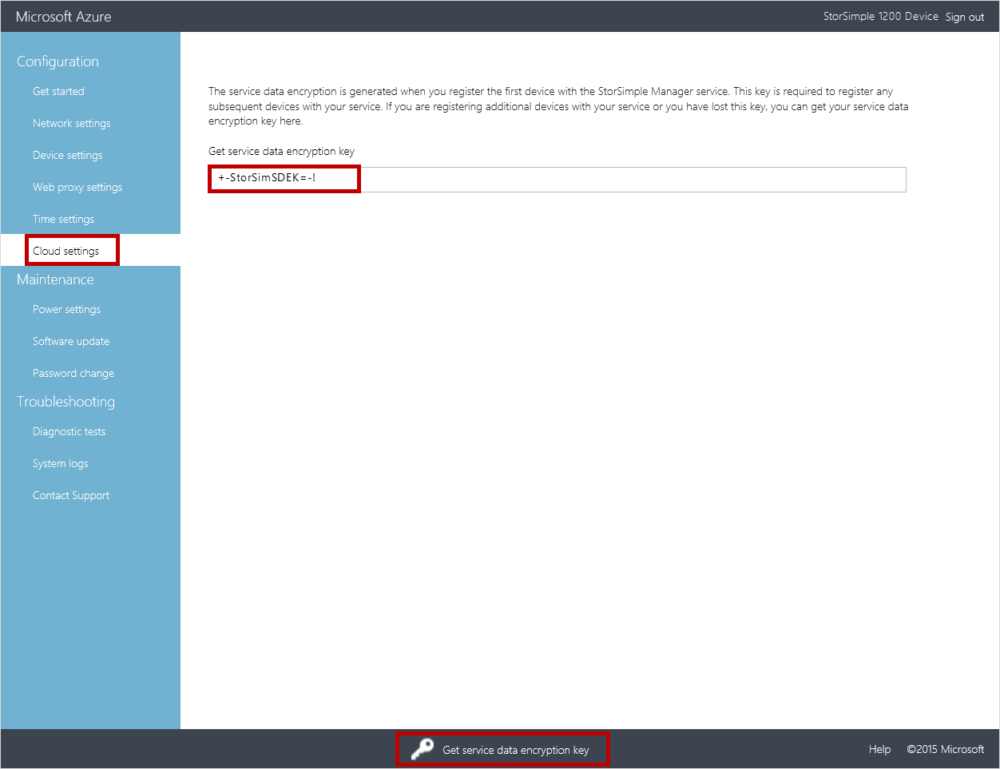
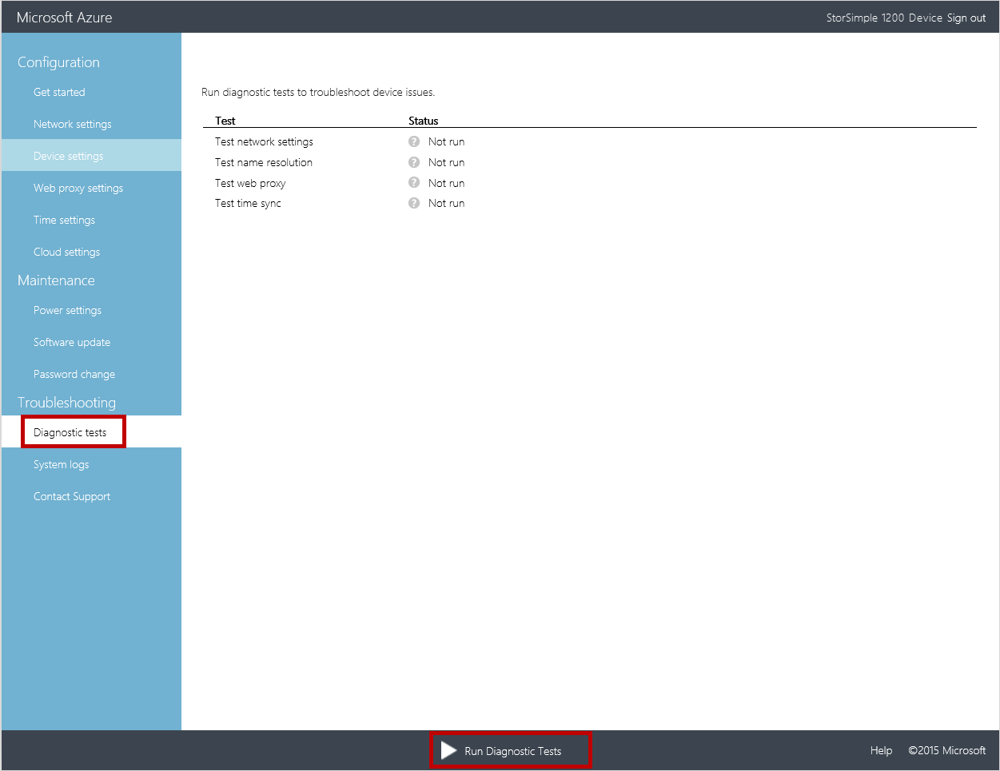
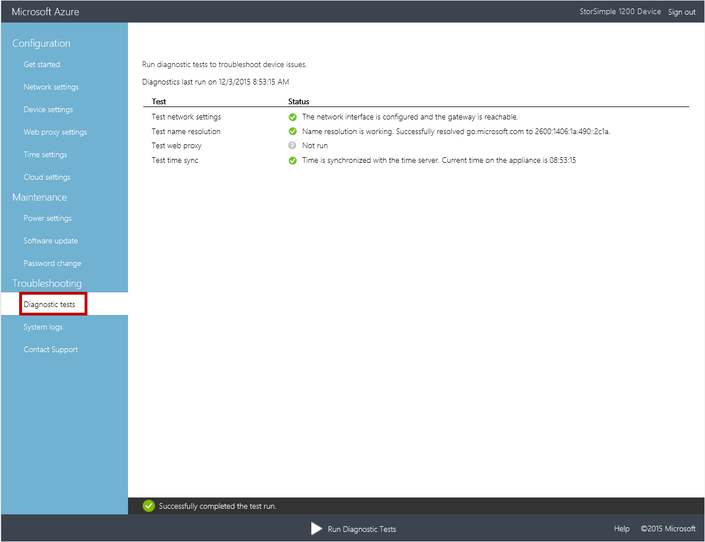
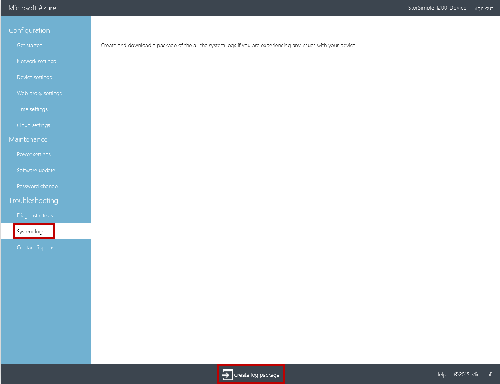
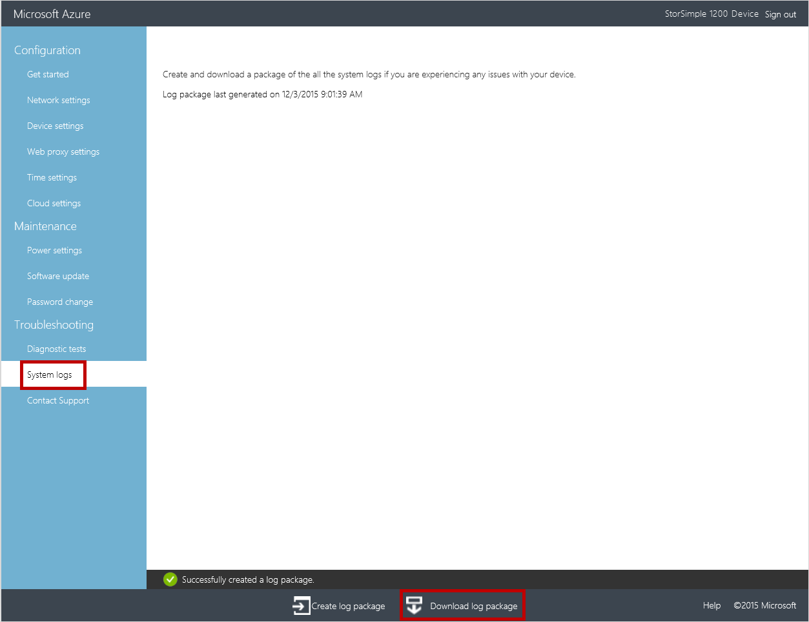
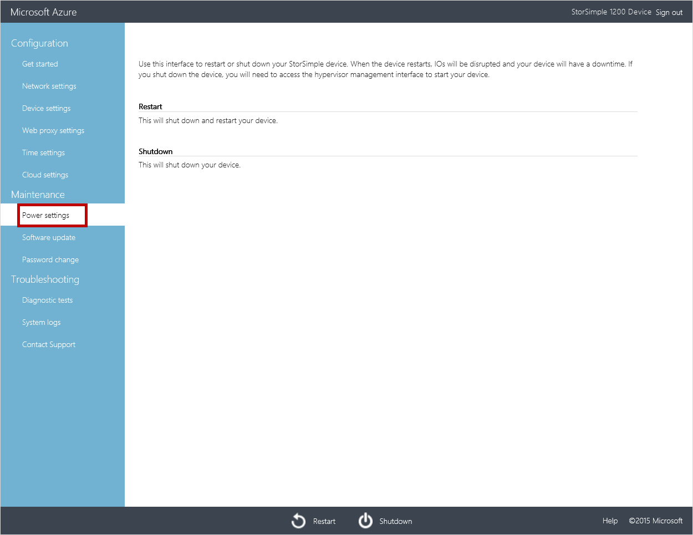
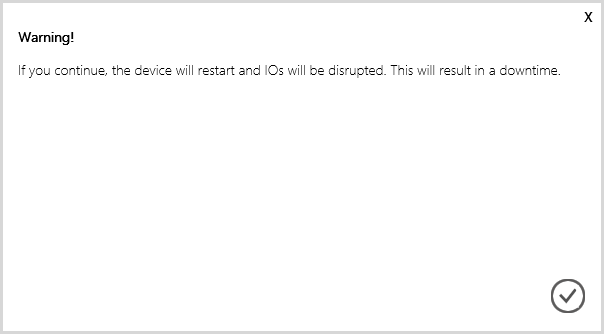

<properties 
   pageTitle="StorSimple virtuelle Array Web Benutzeroberfläche Administration | Microsoft Azure"
   description="Beschreibt, wie Verwaltungsaufgaben über das Web StorSimple Virtual Array Benutzeroberfläche grundlegende Gerät ausführen."
   services="storsimple"
   documentationCenter="NA"
   authors="alkohli"
   manager="carmonm"
   editor="" />
<tags 
   ms.service="storsimple"
   ms.devlang="NA"
   ms.topic="article"
   ms.tgt_pltfrm="NA"
   ms.workload="TBD"
   ms.date="04/07/2016"
   ms.author="alkohli" />

# Verwenden der Web-Benutzeroberfläche zum Verwalten Ihrer virtuellen StorSimple-Matrix

## (Übersicht)

Die Lernprogramme in diesem Artikel beziehen sich auf die Microsoft Azure StorSimple virtuelle Matrix (auch bekannt als StorSimple lokale virtuelle Gerät) März 2016 allgemeine Verfügbarkeit (GA) Version ausführen. In diesem Artikel werden einige der komplexe Workflows und Verwaltungsaufgaben, die für die virtuelle StorSimple Array ausgeführt werden können. Sie können die virtuelle StorSimple Array mithilfe des StorSimple-Managers verwalten service-Benutzeroberfläche (im Portal Benutzeroberfläche genannt) und der lokalen Web-Benutzeroberfläche für das Gerät. Dieser Artikel befasst sich die Aufgaben, die Sie mit der Web-Benutzeroberfläche ausführen können.

In diesem Artikel umfasst die folgenden Lernprogramme an:

- Abrufen der Dienst Datenschlüssel
- Behandeln von Problemen mit der Web-Benutzeroberfläche Installationsfehler
- Generieren eines Log-Pakets
- Beenden Sie oder Neustarten Sie Ihr Gerät

## Abrufen der Dienst Datenschlüssel

Ein Verschlüsselungsschlüssels für Dienst Daten wird ausgelöst, wenn Sie das erste Gerät mit dem Dienst StorSimple Manager registrieren. Dieser Schlüssel ist, klicken Sie dann mit der Dienst Registrierungsschlüssel zusätzliche Geräte mit dem Dienst StorSimple Manager Registrierung erforderlich.

Wenn Sie Ihre Daten-Verschlüsselungsschlüssels Dienst und müssen ihn abrufen falsch eingefügte haben, führen Sie die folgenden Schritte in der lokalen Web-Benutzeroberfläche des Geräts mit Ihrem Dienst registriert.

#### Der Dienst Daten Verschlüsselungsschlüssel abgerufen

1. Verbinden Sie mit der lokalen Web-Benutzeroberfläche. Wechseln Sie zu **Konfiguration** > **Cloud-Einstellungen**.
  

2. Klicken Sie am unteren Rand der Seite auf **Dienst Daten Verschlüsselungsschlüssels abrufen**. Ein Schlüssel wird angezeigt. Kopieren und diesen Schlüssel speichern.
    
    
   

## Behandeln von Problemen mit der Web-Benutzeroberfläche Installationsfehler

In einigen Fällen, wenn Sie das Gerät, bis der lokalen Web-Benutzeroberfläche, konfigurieren können Sie Fehler auftreten. Wenn diagnostizieren und solche Fehler zu beheben, können Sie die Diagnosetests ausführen.

#### So führen Sie die Diagnose tests

1. In der lokalen Web-Benutzeroberfläche, wechseln Sie zur **Problembehandlung** > **Diagnostic überprüft**.

    

2. Klicken Sie am unteren Rand der Seite auf **Diagnostic Tests ausführen**. Dies wird überprüft, um mögliche Probleme mit Ihrem Netzwerk, Gerät, Webproxy, diagnostizieren initiieren Uhrzeit oder Cloud-Einstellungen. Sie werden benachrichtigt, dass das Gerät Tests ausgeführt wird.

3. Nachdem die Tests abgeschlossen haben, werden die Ergebnisse angezeigt. Das folgende Beispiel zeigt die Ergebnisse der Diagnose überprüft. Beachten Sie, dass die Web-Proxyeinstellungen auf diesem Gerät nicht konfiguriert wurden und daher nicht im Web Proxy-Test ausgeführt wurde. Alle anderen Tests für Netzwerkeinstellungen, DNS-Server und Intervalle waren erfolgreich.

    

## Generieren eines Log-Pakets

Ein Protokoll Paket besteht alle betreffenden Protokolldateien, die von Microsoft Support Behandeln von Geräteproblemen mit einem beliebigen vorgenommen werden kann. In dieser Version kann ein Protokoll Paket über der lokalen Web-Benutzeroberfläche generiert werden.

#### Log-Paket generieren

1. In der lokalen Web-Benutzeroberfläche, wechseln Sie zur **Problembehandlung** > **Systemprotokolle**.

    

2. Klicken Sie am unteren Rand der Seite auf **Log-Paket erstellen**. Ein Paket mit den Systemprotokollen wird erstellt. Dies wird ein paar Minuten dauern.

    

    Sie werden benachrichtigt, nachdem das Paket wurde erfolgreich erstellt, und die Seite wird aktualisiert werden, um anzugeben, Datum und Uhrzeit, wann das Paket erstellt wurde.

    

3. Klicken Sie auf **Log-Paket herunterladen**. Ein ZIP-Paket wird auf Ihrem System heruntergeladen werden.

    

4. Können Sie das Paket heruntergeladenen Log entzippen und zeigen Sie die Systemprotokolldateien.

## Beenden und starten Sie das Gerät neu

Sie können beendet wird oder starten Sie Ihre virtuelle Gerät mithilfe das lokale Web-Benutzeroberfläche neu. Wir empfehlen, die vor dem Neustart die Datenmengen oder offline Freigaben auf dem Host, und klicken Sie dann das Gerät ausführen. Dadurch wird jede Möglichkeit einer Beschädigung der Daten minimiert. 

#### Auf Ihrem Gerät virtuelle beenden

1. Wechseln Sie in der lokalen Web-Benutzeroberfläche, zu **Wartung** > **Power-Einstellungen**.

2. Klicken Sie am unteren Rand der Seite auf **Beenden**.

    

3. Eine Warnung wird angezeigt, die besagt, dass eine war(en) des Geräts e, die in den Fortschritt, wurden in einer Ausfallzeiten resultierender unterbrechen. Klicken Sie auf das Symbol "Überprüfen" .

    

    Sie werden benachrichtigt, dass das Beenden eingeleitet wurde.

    

    Das Gerät wird jetzt beendet. Wenn Sie Ihr Gerät starten möchten, müssen Sie über den Hyper-V-Manager erledigen.

#### Ihr Gerät virtuelle neu starten.

1. Wechseln Sie in der lokalen Web-Benutzeroberfläche, zu **Wartung** > **Power-Einstellungen**.

2. Klicken Sie am unteren Rand der Seite auf **neu starten**.

    

3. Eine Warnung wird angezeigt, die besagt, dass Neustart des Geräts unterbrechen, werden alle IOs wird ausgeführt, wurden in einer Ausfallzeiten resultierender. Klicken Sie auf das Symbol "Überprüfen" .

    

    Sie werden benachrichtigt, dass der Neustart eingeleitet wurde.

    

    Während der Neustart ausgeführt wird, verlieren Sie die Verbindung zu der Benutzeroberfläche. Sie können den Neustart des Computers durch Aktualisieren der Benutzeroberfläche regelmäßig überwachen. Alternativ können Sie den Gerät neu starten Status über den Hyper-V-Manager überwachen.

## Nächste Schritte

Erfahren Sie, wie der Dienst StorSimple Manager zum Verwalten von Ihrem Geräts zu [verwenden](storsimple-manager-service-administration.md).
