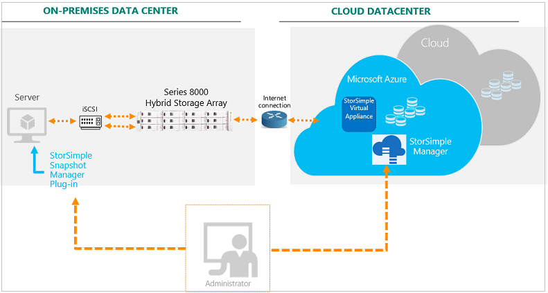
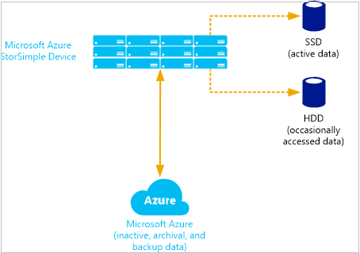

<properties 
   pageTitle="Was ist StorSimple? | Microsoft Azure" 
   description="Beschreibt StorSimple Stufen, Gerät, virtuelles Gerät, Services und Speicher-Management und wichtige Begriffe in StorSimple verwendet werden." 
   services="storsimple" 
   documentationCenter="NA" 
   authors="SharS" 
   manager="carmonm" 
   editor=""/>

<tags
   ms.service="storsimple"
   ms.devlang="NA"
   ms.topic="article"
   ms.tgt_pltfrm="NA"
   ms.workload="TBD" 
   ms.date="10/05/2016"
   ms.author="v-sharos@microsoft.com"/>

# StorSimple 8000-Serie: einer hybriden Cloud Storage-Lösung

## (Übersicht)

Willkommen Sie bei Microsoft Azure StorSimple, eine integrierte Speicher-Lösung, die Verwalten von Speicheraufgaben zwischen lokale Geräte und Microsoft Azure-Cloud-Speicher. StorSimple ist eine effiziente, kostengünstiger und einfach zu verwaltende SAN (SAN)-Lösung, bei die keine zahlreiche Probleme und Ausgaben im Zusammenhang mit Enterprise Speicherung und Datenschutz. Es eigene StorSimple 8000 Reihe Gerät verwendet, ist in Cloud Services integriert und bietet eine Reihe von Tools zum Projektmanagement, um eine nahtlose Ansicht alle Enterprise-Speicher, einschließlich der Cloud-Speicher. (Auf der Website Microsoft Azure veröffentlichte Informationen zur Bereitstellung der StorSimple gilt für nur StorSimple 8000 Reihe für Geräte. Wenn Sie ein StorSimple 5000/7000 Reihe Gerät verwenden, wechseln Sie zu [StorSimple-Hilfe](http://onlinehelp.storsimple.com/).)

StorSimple verwendet zum Verwalten von gespeicherter Daten über verschiedene Speicherung Medien [Speicher Stufen](#automatic-storage-tiering) . Die aktuelle Arbeitszeit-Gruppe ist lokal gespeichert auf einfarbige Zustand Laufwerken (SSDs), Daten, die weniger häufig verwendeten auf Festplatten (Festplatten) gespeichert werden und archivierte Daten werden in der Cloud abgelegt. Darüber hinaus verwendet StorSimple Beseitigung von Duplikaten sowie Komprimierung die Speichermenge, der die Daten zu verringern. Wechseln Sie weitere Informationen zu [Beseitigung von Duplikaten sowie Komprimierung](#deduplication-and-compression). Definitionen der anderen wichtigen Begriffe und Konzepte in der Dokumentation StorSimple 8000 Reihe verwendet werden finden Sie unter [StorSimple Terminologie](#storsimple-terminology) am Ende dieses Artikels.

Mit StorSimple Update 2 können Sie die geeignete Mengen identifizieren, als *lokal fixiert* , um sicherzustellen, dass die primäre Daten lokal auf dem Gerät bleibt und nicht Stufen Sie in der Cloud. So können Sie Auslastung ausführen, die in der Cloud Wartezeit, wie etwa SQL und virtuellen Computern Auslastung auf lokal angehefteten Datenmengen, sensible sind und weiterhin die Verwendung die Cloud für die Sicherung. Weitere Informationen zu lokal angeheftete Datenmengen finden Sie unter [Verwenden der Verwaltungsdienst für StorSimple Datenmengen verwalten](storsimple-manage-volumes-u2.md). 

Update 2 können Sie StorSimple virtuelle Geräte zu erstellen, die die niedrige Wartezeiten und hohe Leistung von Azure Premium Speicher bereitgestellten nutzen. Weitere Informationen zu StorSimple Premium virtuelle Geräte, finden Sie unter [Bereitstellen und verwalten ein StorSimple virtuelles Gerät in Azure](storsimple-virtual-device-u2.md). Weitere Informationen zu Azure Premium Speicher, wechseln Sie zu [Premium Speicher: leistungsstarke Storage für Azure-virtuellen Computern Auslastung](../storage/storage-premium-storage.md).

StorSimple Datenschutzfunktionen zusätzlich zur Verwaltung von Speicher, aktivieren Sie bei Bedarf erstellen Sicherungskopien geplant und dann lokal oder in der Cloud speichern. Sicherungskopien stammen in Form von Momentaufnahmen inkrementell, d. h., erstellt und schnell wiederhergestellt werden können. Cloud Momentaufnahmen können in Notfallwiederherstellungsszenarios entscheidend sein, da diese sekundären Speichersysteme (z. B. Band) ersetzen, und ermöglichen es Ihnen Daten Datencenters oder alternative Websites bei Bedarf wiederhergestellt werden.

 Schauen Sie sich das Video an, um eine kurze Einführung in Microsoft Azure StorSimple.

> [AZURE.VIDEO storsimple-hybrid-cloud-storage-solution]

## Gründe für die Verwendung von StorSimple

Die folgende Tabelle beschreibt einige der wichtigsten Vorteile, die Microsoft Azure StorSimple bereitstellt.

| Feature | Vorteile |
|---------|---------|
|Transparente integration | Microsoft Azure StorSimple verwendet das iSCSI-Protokoll, um im Hintergrund Daten Speicher Fertigungsanlagen verknüpfen. Die Daten in der Cloud, an der Datencenter gespeichert: Damit ist sichergestellt, oder auf remote-Servern angezeigt wird, in einem einzigen Speicherort gespeichert werden soll.|
|Geringere Speicher-Kosten|Microsoft Azure StorSimple reserviert ausreichend lokale oder Cloud-Speicher, um die aktuellen Bedürfnisse entsprechen und Cloud-Speicher nur bei Bedarf erweitert. Es verringert weiteren Speicher Anforderungen und Ausgaben durch beseitigen redundante Versionen derselben Daten (Deduplication) und Komprimierung.|
|Vereinfachte Speicher-management|Microsoft Azure StorSimple stellt System Verwaltungstools, die Sie verwenden können, konfigurieren und Verwalten von gespeicherten Daten lokal auf einem Remoteserver, und klicken Sie in der Cloud. Darüber hinaus können Sie verwalten sichern und Wiederherstellen von Funktionen aus einer Microsoft Management Console (MMC)-Snap-in. StorSimple bietet eine separate, optionale Benutzeroberfläche, die Sie verwenden können, um StorSimple Management und Schutz-Datendienste auf auf SharePoint-Servern gespeicherten Inhalt zu erweitern. |
|Verbesserte Wiederherstellung und Konformität|Microsoft Azure StorSimple sind keine Zeit für erweiterte Wiederherstellung erforderlich. In diesem Fall stellt Daten, wie er erforderlich ist. Dies bedeutet, dass normale Vorgänge mit minimaler Unterbrechung fortgesetzt werden können. Darüber hinaus können Sie Richtlinien zum Angeben der Sicherungsdatei Zeitpläne und Beibehaltung von Daten konfigurieren.
|Datenmobilität|Mit Microsoft Azure Cloud Services hochgeladenen Daten können von anderen Websites Wiederherstellung und-Migration Zwecken zugegriffen werden. Darüber hinaus können Sie StorSimple StorSimple virtuelle Geräte auf virtuellen Computern (virtuellen Computern) in Microsoft Azure konfigurieren. Die virtuellen Computern können Sie virtuelle Geräte zu testen oder Wiederherstellung Zwecken gespeicherte Daten zugreifen.|
|Unterstützung für andere Cloud-Service-Anbieter |Die Reihe StorSimple 8000 mit Software update 1 oder höher unterstützt Amazon S3 mit RRS, HP und OpenStack cloud Services sowie Microsoft Azure. (Sie werden immer noch ein Microsoft Azure-Speicher-Konto für das Gerät Management erforderlich.) Wechseln Sie weitere Informationen zu [Neuigkeiten bei Update 1.2](storsimple-update1-release-notes.md#whats-new-in-update-12).|
|Geschäftskontinuität | Update 1 oder höher bietet ein neues Migrations-Feature, mit dem StorSimple 5000-7000 Reihe Benutzer ihre Daten in einem StorSimple 8000 Reihe Gerät migrieren kann.|
|Verfügbarkeit im Portal Azure Government | StorSimple Update 1 oder höher ist im Portal Government Azure verfügbar. Weitere Informationen finden Sie unter [Bereitstellen von Ihrem lokalen StorSimple Gerät im Portal Government](storsimple-deployment-walkthrough-gov.md).|
|Datenschutz und Verfügbarkeit | Die Reihe StorSimple 8000 mit Update 1 oder höher unterstützt Zone redundante Speicher (ZRS), sowie lokal redundante Speicher (LRS) "und" Geo redundante Speicher (GRS). Finden Sie [in diesem Artikel auf Azure Redundanz Speicheroptionen](https://azure.microsoft.com/documentation/articles/storage-redundancy/) ZRS Details.|
|Unterstützung für kritische Applikationen | Mit StorSimple Update 2 können Sie die geeignete Mengen als lokal angehefteten identifizieren. Diese Funktion ist sichergestellt, dass kritische Applikationen benötigt werden nicht in der Cloud gestuft ist. Lokal angeheftete Datenmengen unterliegen nicht Cloud Wartezeiten oder Verbindungsprobleme. Weitere Informationen zu lokal angeheftete Datenmengen finden Sie unter [Verwenden der Verwaltungsdienst für StorSimple Datenmengen verwalten](storsimple-manage-volumes-u2.md).|
|Geringe Wartezeit und hohe Leistung | StorSimple Update 2 können Sie virtuelle Geräte erstellen, die die hohe Leistung, geringe Wartezeit Features Azure Premium Speicher nutzen. Weitere Informationen zu StorSimple Premium virtuelle Geräte, finden Sie unter [Bereitstellen und verwalten ein StorSimple virtuelles Gerät in Azure](storsimple-virtual-device-u2.md).|

 schauen Sie sich [dieses Video](https://www.youtube.com/watch?v=4MhJT5xrvQw&feature=youtu.be) an, um einen Überblick über die StorSimple 8000 Reihe Features und Vorteile.

## StorSimple Komponenten

Die Microsoft Azure StorSimple Lösung umfasst die folgenden Komponenten:

- **Microsoft Azure StorSimple Gerät** – eine lokale Hybrid Speicherarray, SSDs und Festplatten, zusammen mit redundante Controller und automatischer Failoverfunktionen enthält. Die Controller verwalten Speicher Stufen, Platzierung von derzeit verwendete (oder wichtiges) Daten auf lokale Speicher (in das Gerät oder lokalen-Server) und beim Verschieben von weniger häufig verwendeten Daten in der Cloud.
- **StorSimple virtuelles Gerät** – auch bekannt als die virtuelle StorSimple-Anwendung, hier eine Version des Geräts StorSimple, die die Architektur repliziert und die meisten Funktionen von der physischen Hybrid-Speichergerät. Das StorSimple virtuelle Gerät wird in einem einzigen Knoten in einer Azure-virtuellen Computern ausgeführt werden. Premium virtuelle Geräte, die für Azure Premium Speicher nutzen zu können, sind in Update 2 und höher verfügbar.
- **StorSimple-Manager-Dienst** – Erweiterung des klassischen Azure Portals, in dem Sie eine StorSimple Gerät oder StorSimple virtuelles Gerät aus einer einzelnen Web-Oberfläche verwalten kann. Den Dienst StorSimple-Manager können Sie das Erstellen und Verwalten von Diensten, anzeigen und Verwalten von Geräten, Benachrichtigungen anzeigen, Datenmengen, verwalten und anzeigen und Verwalten von Richtlinien Sicherung und der Sicherungsdatei Katalog.
- **Windows PowerShell für StorSimple** – eine Line-Benutzeroberfläche, die Sie zum Verwalten des Geräts StorSimple verwenden können. Windows PowerShell für StorSimple enthält Features, die ermöglichen es Ihnen, Ihr Gerät StorSimple registrieren, Konfigurieren der Schnittstelle auf Ihrem Gerät, bestimmte Arten von Updates installieren, Problembehandlung bei Ihrem Gerät durch den Zugriff auf den Support-Sitzung, und ändern Sie den Zustand Gerät. Sie können Windows PowerShell für StorSimple durch Herstellen einer Verbindung mit der seriellen Konsole oder mithilfe von Windows PowerShell Remote zugreifen.
- **StorSimple der Azure-PowerShell-Cmdlets** – eine Auflistung von Windows PowerShell-Cmdlets, mit die Sie Servicelevel und-Migration Aufgaben über die Befehlszeile automatisieren können. Weitere Informationen zu den Azure-PowerShell-Cmdlets für StorSimple wechseln Sie zu den [cmdletreferenz zur](https://msdn.microsoft.com/library/dn920427.aspx).
- **StorSimple Snapshot-Manager** – ein MMC-Snap-in, das Volume-Gruppen und die Windows-Volume Dienstfehler wird verwendet, um die Anwendung konsistent Sicherungskopien generieren. Darüber hinaus können Sie StorSimple Snapshot-Manager verwenden, erstellen zusätzliche Zeitpläne und Klonen oder Datenmengen wiederherstellen. 
- **StorSimple Netzwerkadapter für SharePoint** – eines Tools, die Microsoft Azure StorSimple Speicherung und Datenschutz in SharePoint Server-Farmen gewahrt wird StorSimple Speicher machen und verwaltbare aus der SharePoint-Zentraladministration Portal transparent erweitert.

Im nachstehenden Diagramm enthält eine allgemeine Übersicht über die Microsoft Azure StorSimple Architektur und Komponenten.

In den folgenden Abschnitten wird jedes dieser Komponenten ausführlicher beschrieben und erläutert, wie die Lösung ordnet die Daten, weist Speicher und erleichtert Speicher-Management und Datenschutz. Der letzte Abschnitt enthält Definitionen für einige wichtige Begriffe und Konzepte im Zusammenhang mit StorSimple Komponenten und deren Management.

## StorSimple-Gerät

Das Microsoft Azure StorSimple Gerät ist eine lokale Hybrid Speicherarray, primären Speicher und der Zugriff darauf gespeicherten Daten iSCSI bietet. Er verwaltet die Kommunikation mit Cloud-Speicher und trägt dazu bei, die Sicherheit und Vertraulichkeit aller Daten, die auf die Microsoft Azure StorSimple Lösung gespeichert ist.

Das Gerät StorSimple enthält SSDs und Festplatten Festplatten sowie Unterstützung für Cluster und die automatische Failover. Sie enthält einen freigegebenen Prozessor, freigegebenen Speicher und zwei gegenüberliegende Controller. Jeder Controller wird Folgendes bereitgestellt:

- Verbindung mit einem Host-computer
- Bis zu sechs Netzwerk-Ports für die Verbindung mit dem lokalen Netzwerk (LAN)
- Hardware-Überwachung
- Permanenter Arbeitsspeicher (NVRAM), der Informationen enthält, auch wenn Power unterbrochen ist
- Cluster-fähige aktualisiert werden, um Softwareupdates auf Servern in einem Failovercluster verwalten, damit die Updates minimalen haben oder keine Auswirkung auf die Verfügbarkeit von Diensten
- Cluster-Dienst, welche Funktionen wie einen Back-End-Cluster, eine hohe Verfügbarkeit und eventuelle negative Folgen, die auftreten können, wenn eine Festplatte oder SSD fehlschlägt oder minimieren Offlinemodus

Nur ein Controller ist Zeitpunkt zu einem beliebigen Zeitpunkt aktiv. Wenn der aktive Controller fehlschlägt, wird der zweite Controller automatisch aktiviert. 

Wechseln Sie weitere Informationen zu [StorSimple Hardware-Komponenten und Status](storsimple-monitor-hardware-status.md).

## StorSimple virtuelles Gerät

StorSimple können Sie um ein virtuelles Gerät zu erstellen, das die Architektur und Funktionen von das Speichergerät physische Hybrid repliziert. Das StorSimple virtuelle Gerät (auch bekannt als der virtuelle StorSimple-Einheit) wird auf einem einzelnen Knoten in einer Azure-virtuellen Computern ausgeführt werden. (Ein virtuelles Gerät kann nur auf einer Azure-virtuellen Computern erstellt werden. Sie können nicht auf einem Gerät StorSimple oder einem lokalen Server erstellen.) 

Das virtuelle Gerät weist die folgenden Features:

- Es verhält sich wie eine physische Einheit und bieten eine Benutzeroberfläche iSCSI mit virtuellen Computern in der Cloud. 
- Sie können eine unbegrenzte Anzahl von virtuellen Geräten in der Cloud erstellen, und aktivieren sie aktiviert und deaktiviert nach Bedarf. 
- Es kann Hilfe für lokale Umgebungen in Wiederherstellung, Entwicklung und Testszenarien simulieren und mit Elementebene Abruf von Sicherungskopien helfen kann. 

Update 2 und höher, steht das StorSimple virtuelle Gerät in zwei Modellen: 8010 Gerät (früher als das Modell 1100) und dem 8020 Gerät. Das Gerät 8010 verfügt über eine maximale Kapazität von 30 TB. 8020 Geräts, der Azure Premium Speicher nutzt, verfügt über eine maximale Kapazität von 64 TB. (In der lokalen Ebenen speichert Azure Premium Speicher Daten auf SSDs während der standardmäßigen Speicher Daten auf Festplatten gespeichert sind.) Beachten Sie, dass Sie einem Azure Premium Speicherkonto Premium Speicher verwendet wurde. Weitere Informationen zu Premium Speicher, wechseln Sie zu [Premium Speicher: leistungsstarke Storage für Azure-virtuellen Computern Auslastung](../storage/storage-premium-storage.md).

Weitere Informationen zu den StorSimple virtuelles Gerät, wechseln Sie zu [Bereitstellen und verwalten ein StorSimple virtuelles Gerät in Azure](storsimple-virtual-device-u2.md).

## StorSimple-Manager-Dienst

Microsoft Azure StorSimple webbasierten stellt eine Benutzeroberfläche bereit (der Dienst StorSimple Manager), die Sie zentral verwalten Datacenter und cloud-Speicher ermöglicht. Den Dienst StorSimple-Manager können Sie die folgenden Aufgaben ausführen:

- Konfigurieren von Systemeinstellungen für StorSimple Geräte.
- Konfigurieren Sie und verwalten Sie der Sicherheitseinstellungen für StorSimple Geräte.
- Konfigurieren von Cloud Anmeldeinformationen und Eigenschaften.
- Konfigurieren und Verwalten von Datenmengen auf einem Server.
- Konfigurieren von Volume-Gruppen.
- Sichern und Wiederherstellen von Daten.
- Überwachen der Leistung.
- Überprüfen Sie der Systemeinstellungen und erkennen Sie mögliche Probleme.

Den Dienst StorSimple-Manager können gesucht, die alle Verwaltungsaufgaben ausführen möchten, die System unten Zeit, z. B. ersteinrichtung und Installieren von Updates erforderlich.

Weitere Informationen finden Sie verwenden [die StorSimple-Manager-Dienst auf Ihrem Gerät StorSimple verwalten](storsimple-manager-service-administration.md).

## Windows PowerShell für StorSimple

Windows PowerShell für StorSimple bietet eine Line-Benutzeroberfläche, die Sie erstellen und Verwalten von Microsoft Azure StorSimple Dienst und einrichten und überwachen StorSimple Geräte verwenden können. Es ist eine Windows PowerShell-basierten Line-Benutzeroberfläche, die dedizierte Cmdlets für die Verwaltung von Ihrem Gerät StorSimple enthält. Windows PowerShell für StorSimple enthält Features, mit die Sie können:

- Registrieren Sie sich ein Gerät.
- Konfigurieren der Schnittstelle auf einem Gerät.
- Installieren von bestimmter Typen von Updates.
- Problembehandlung bei Ihrem Gerät durch den Zugriff auf den Support-Sitzung.
- Ändern Sie den Zustand Gerät.

Sie können Windows PowerShell für StorSimple zugreifen, von einer seriellen Konsole (auf einem Host-Computer mit dem Gerät direkt verbunden) oder Remote mithilfe von Windows PowerShell Remote. Beachten Sie, dass einige Windows PowerShell für StorSimple Aufgaben, wie das ursprüngliche Gerät Registrierung, nur bei der seriellen Konsole durchgeführt werden kann. 

Wechseln Sie weitere Informationen zum [Verwenden von Windows PowerShell für StorSimple auf Ihrem Gerät zu verwalten](storsimple-windows-powershell-administration.md).

## Azure PowerShell StorSimple-cmdlets

Die Cmdlets Azure PowerShell StorSimple sind eine Zusammenstellung von Windows PowerShell-Cmdlets, mit die Sie Servicelevel und-Migration Aufgaben über die Befehlszeile automatisieren können. Weitere Informationen zu den Azure-PowerShell-Cmdlets für StorSimple wechseln Sie zu den [cmdletreferenz zur](https://msdn.microsoft.com/library/dn920427.aspx).

## StorSimple Snapshot-Manager

StorSimple Snapshot-Manager ist ein Microsoft Management Console (MMC)-Snap-in, mit denen Sie konsistent, erstellen Sie, Point-in-Time Sicherungskopien der lokalen und Cloud Daten. Das Snap-in ausgeführt wird auf einem Windows Server-basierten Host. Sie können StorSimple Snapshot-Manager zu verwenden:

- Konfigurieren, Sichern und Datenmengen löschen.
- Konfigurieren von Volume-Gruppen, um sicherzustellen, die Daten gesichert Anwendung konsistent ist.
- Verwalten Sie zusätzliche Richtlinien, damit die Daten auf einem vordefinierten Zeitplan gesichert und (lokal oder in der Cloud), die an einem bestimmten Speicherort gespeichert ist.
- Wiederherstellen Sie Datenmengen und einzelne Dateien.

Sicherungskopien werden als Momentaufnahmen, erfasst, über die nur die Änderungen aufzeichnen, da die letzte Momentaufnahme erstellt wurde und weit weniger Speicherplatz als vollständige Sicherungen erforderlich. Können Sie zusätzliche Zeitpläne erstellen oder unmittelbare Sicherungskopien dauern, je nach Bedarf. Darüber hinaus können StorSimple Snapshot-Manager Sie herstellen Aufbewahrungsrichtlinien dieses Steuerelement wie viele Momentaufnahmen gespeichert werden. Wenn Sie später wiederherstellen von Daten aus einer Sicherung, StorSimple Snapshot-Manager können müssen, wählen Sie aus dem Katalog der lokalen oder Cloud Momentaufnahmen aus. 

Bei Datenverlusten oder wenn Sie Daten aus einem anderen Grund wiederherstellen müssen, stellt StorSimple Snapshot-Manager es inkrementell, wie er erforderlich ist. Wiederherstellung von Daten ist nicht erforderlich, dass Sie das gesamte System ausschalten, während Sie eine Datei wiederherstellen, Ausrüstung ersetzen oder Vorgänge in eine andere Website verschieben.

Weitere Informationen finden Sie unter [Neuigkeiten StorSimple Snapshot-Manager?](storsimple-what-is-snapshot-manager.md)

## StorSimple Netzwerkadapter für SharePoint

Microsoft Azure StorSimple enthält die StorSimple Netzwerkadapter für SharePoint, eine optionale Komponente, die transparent StorSimple Speicher und Datensicherheits-Funktionen in SharePoint Server-Farmen erweitert. Der Netzwerkadapter funktioniert mit einem Anbieter Remote-Blob-Speicher (RSP) und das Feature SQL Server RSP ermöglicht es Ihnen, auf einen Server vom Microsoft Azure StorSimple System gesichert BLOBs zu verschieben. Microsoft Azure StorSimple speichert dann BLOB-Daten lokal oder in der Cloud, je nach Verwendung.

Die StorSimple-Grafikkarte für SharePoint ist in der SharePoint-Zentraladministration Portal verwaltet. Daher SharePoint-Verwaltung zentralisierte bleibt, und alle Speicher in der SharePoint-Farm zu sein scheint.

Wechseln Sie weitere Informationen zu [StorSimple Netzwerkadapter für SharePoint](storsimple-adapter-for-sharepoint.md)aus. 

## Projektmanagement-Technologien
 
Neben dem dedizierten StorSimple Gerät, virtuelles Gerät und andere unsichere Komponenten verwendet Microsoft Azure StorSimple die folgende Software Technologien aus, um schnellen Zugriff auf Daten zu gewährleisten und Speichers verringern:

- [Automatische Speicherung Stufen](#automatic-storage-tiering) 
- [Dünne bereitgestellt.](#thin-provisioning) 
- [Beseitigung von Duplikaten sowie Komprimierung](#deduplication-and-compression) 

### Automatische Speicherung Stufen

Microsoft Azure StorSimple ordnet die Daten in einer logischen Ebenen basierend auf der aktuellen Verwendung, Alter und Beziehung zu anderen Daten automatisch an. Daten, die am aktivsten werden lokal, gespeichert weniger aktive und inaktive Daten automatisch in die Cloud migriert werden. Das folgende Diagramm veranschaulicht dieser Ansatz Speicher.
 

Zum schnellen Zugriff aktivieren speichert StorSimple auf SSDs sehr aktive Daten (wichtiges) in das Gerät StorSimple an. Speichert Daten, die gelegentlich verwendet wird (warmes Daten) auf Festplatten in das Gerät oder auf Servern im Datencenter. Es verschiebt inaktive Daten, Daten sichern und Daten beibehalten für Archivierung oder Compliance-Zwecke in der Cloud. 

>[AZURE.NOTE] In Update 2 oder höher, können Sie einen Datenträger als lokal angehefteten angeben, in diesem Fall die Daten auf dem lokalen Gerät bleibt, und nicht ist in der Cloud gestuft. 

StorSimple passt und werden Daten neu angeordnet und Speicher Zuordnungen als Verwendungsmuster ändern. Beispielsweise möglicherweise einige Informationen zu weniger über einen Zeitraum aktiv. Sobald sie schrittweise weniger aktiv sind, wird es von SSDs Festplatten und dann in der Cloud migriert. Wenn Sie die gleichen Daten wieder aktiv ist, wird sie wieder in das Speichergerät migriert werden.

Der tiering von Speicher erfolgt wie folgt aus:

1. Vom Systemadministrator festgelegte Microsoft Azure Cloud-Speicher-Konto.
2. Der Administrator verwendet die serielle Konsole und den StorSimple-Manager-Dienst (ausgeführt wird, in der klassischen Azure-Portal) zum Konfigurieren des Servers Gerät und Datei Datenmengen und Daten Schutzrichtlinien erstellen. Lokalen Computer (z. B. Dateiserver) verwenden das Internet Small Computer System-Interface (iSCSI), um das Gerät StorSimple zuzugreifen.
3. Zunächst werden StorSimple Daten auf schnelle SSD Ebene des Geräts gespeichert.
4. Während die Ebene SSD Leistungsfähigkeit erreicht, StorSimple deduplicates die ältesten Datenblöcke komprimiert und verschiebt sie in die Festplatte Ebene.
5. Als die Festplatte Ebene Ansätze Kapazität StorSimple die ältesten Datenblöcke verschlüsselt und sichere an das Microsoft Azure-Speicher-Konto über HTTPS gesendet werden.
6. Microsoft Azure erstellt mehrere Replikate der Daten in deren Datacenter und in einem remote-Datencenter, um sicherzustellen, dass die Daten bei Datenverlusten wiederhergestellt werden können. 
7. Wenn der Dateiserver in der Cloud gespeicherte Daten anfordert, wird StorSimple gibt es nahtlos und speichert eine Kopie auf der Ebene SSD des Geräts StorSimple.

### Dünne bereitgestellt.

Dünne bereitgestellt wird eine Virtualisierungstechnologie in der verfügbaren Speicher überschreitet physische Ressourcen angezeigt wird. Statt reserviert werden über genügend Speicherplatz im voraus, verwendet StorSimple nur genügend Speicherplatz zum aktuellen erfüllen reserviert dünnen bereitgestellt. Flexible Art der Cloud-Speicher erleichtert dieser Ansatz, da StorSimple vergrößern oder verkleinern Cloud-Speicher, um erweitert ändern kann. 

>[AZURE.NOTE] Lokal angeheftete Datenmengen sind nicht Thin Provisioning bereitgestellt. Speicher auf einen Datenträger nur lokale zugewiesen wird vollständig bereitgestellt, wenn die Lautstärke erstellt wird.

### Beseitigung von Duplikaten sowie Komprimierung

Microsoft Azure StorSimple verwendet Beseitigung von Duplikaten sowie Daten Komprimierung um Speicher Anforderungen weiter zu verringern.

Deduplication reduziert Gesamtbetrag der Daten durch Vermeidung Redundanz gespeicherten Daten festlegen gespeichert. Wie Informationen verwandelt hat, StorSimple ignoriert die Daten nicht geändert, und Sie werden nur die Änderungen erfasst. Darüber hinaus verringert StorSimple die gespeicherte Datenmenge identifizieren und Entfernen überflüssiger Informationen. 

>[AZURE.NOTE] Daten auf lokal angeheftete Datenmengen ist deduplizierte oder nicht komprimiert. Lokal angeheftete Datenmengen Sicherungen sind allerdings deduplizierte und komprimiert.

## StorSimple Arbeitsbelastung Zusammenfassung

Eine Zusammenfassung der unterstützten StorSimple Auslastung ist unter tabellarisch angeordnet.

| Szenario                  | Arbeitsbelastung                | Unterstützt |  Einschränkungen                                  | Version              |
|---------------------------|-------------------------|-----------|------------------------------------------------|----------------------|
| Für die Zusammenarbeit             | Freigeben von Dateien            | Ja       |                                                | Alle Versionen         |
| Für die Zusammenarbeit             | Verteilte Dateifreigabe| Ja       |                                                | Alle Versionen         |
| Für die Zusammenarbeit             | SharePoint              | Ja *      |Unterstützt nur mit lokal angeheftete Datenmengen      | Update 2 und höher   |
| Archivierung                  | Einfache Archivierung   | Ja       |                                                | Alle Versionen         |
| Virtualisierung            | Virtuellen Computern        | Ja *      |Unterstützt nur mit lokal angeheftete Datenmengen      | Update 2 und höher   |
| Datenbank                  | SQL                     | Ja *      |Unterstützt nur mit lokal angeheftete Datenmengen      | Update 2 und höher   |
| Video-Überwachung        | Video-Überwachung      | Ja *       |Unterstützt, wenn StorSimple Gerät nur für diese Arbeitsbelastung vorgesehen ist| Update 2 und höher   |
| Sicherung                    | Wichtigste Zielgruppe Sicherung | Ja *      |Unterstützt, wenn StorSimple Gerät nur für diese Arbeitsbelastung vorgesehen ist| Update 3 und höher |
| Sicherung                    | Sekundäre Ziel Sicherung | Ja *      |Unterstützt, wenn StorSimple Gerät nur für diese Arbeitsbelastung vorgesehen ist| Update 3 und höher |

*Ja & #42; -Lösung Richtlinien und Einschränkungen sollte angewendet werden.*

Die folgenden Auslastung werden von StorSimple 8000 Reihe Geräte nicht unterstützt. Wenn auf StorSimple bereitgestellt, führt eine nicht unterstützte Konfiguration diese Auslastung.

-  Medizinische Bilddaten
-  Exchange
-  VDI
-  Oracle
-  SAP
-  Große Daten
-  Verteilen von Inhalten
-  Starten Sie von SCSI

Es folgt eine Liste der Komponenten Infrastruktur StorSimple unterstützt. 

| Szenario | Arbeitsbelastung      | Unterstützt |  Einschränkungen                                 | Version      |
|----------|---------------|-----------|-----------------------------------------------|--------------|
| Allgemeine  | Express-Routing | Ja       |                                               |Alle Versionen |
| Allgemeine  | DataCore FC   | Ja *       |Mit DataCore SANsymphony unterstützt            | Alle Versionen |
| Allgemeine  | DFSR          | Ja *      |Unterstützt nur mit lokal angeheftete Datenmengen     | Alle Versionen |
| Allgemeine  | Indizierung      | Ja *       |Für gestufte Datenmengen, nur Metadaten Indizierung unterstützt wird (keine Daten). Für lokal angeheftete Datenmengen wird der vollständige Indizierung unterstützt.| Alle Versionen |
| Allgemeine  | Anti-virus    | Ja *       |Für gestufte Datenmengen nur Scan auf Öffnen und schließen unterstützt werden.  Für lokal angeheftete Datenmengen wird die vollständige Überprüfung unterstützt.| Alle Versionen |

*Ja & #42; -Lösung Richtlinien und Einschränkungen sollte angewendet werden.*

## StorSimple Terminologie 

Vor der Bereitstellung Ihrer Microsoft Azure StorSimple Lösung, empfehlen wir, dass Sie die folgenden Begriffe und Definitionen überprüfen.

### Wichtige Begriffe und Definitionen

| Ausdruck (Akronym oder Abkürzung) | Beschreibung |
| ------------------------------ | ---------------- |
| Access-Steuerelement-Eintrag (ACR)    | Ein Datensatz zugeordnet ein Volume auf Ihrem Gerät von Microsoft Azure StorSimple, das festlegt, welche Hosts darauf zugreifen können. Die Ermittlung basiert auf den iSCSI-qualifizierte Namen (IQN) der Hosts (enthalten in der ACR), die mit Ihrem Gerät StorSimple verbinden.|
| AES-256                        | Ein 256-Bit-erweiterte Verschlüsselung AES Algorithmus (Standard) zum Verschlüsseln von Daten aus, wie es in die und aus der Cloud verschoben wird. |
| die Größe der Zuordnungseinheiten (AUS)     | Die kleinste Menge an Speicherplatz, kann, zum Speichern einer Datei in Ihrem Windows zugeordnet werden-Systeme Datei. Ist eine Dateigröße nicht kein Vielfaches von der Größe der Zuordnungseinheiten, zusätzlicher Abstand muss verwendet werden, um die Datei (auf das nächste Vielfache von der Größe der Zuordnungseinheiten) halten verloren Leerzeichen und Fragmentierung der Festplatte ergibt.  Die empfohlenen AUS für Azure StorSimple Datenmengen ist 64 KB sein, da diese auch die Deduplication Algorithmen geeignet ist.|
| Automatisierte Speicher Stufen      | Verschieben von weniger aktiven Daten automatisch von SSDs auf Festplatten und dann auf eine Ebene in der Cloud, und klicken Sie dann aktivieren Management aller Speicher über eine zentrale Benutzeroberfläche.|
| zusätzliche Katalog | Eine Zusammenstellung von Sicherungskopien, in der Regel verwandt nach der Art der Anwendung, die verwendet wurde. Diese Sammlung wird auf der Seite Sicherungskatalog der Dienst StorSimple Manager-Benutzeroberfläche angezeigt.|
| zusätzliche Katalogdatei             | Eine Datei mit einer Liste der verfügbaren Momentaufnahmen, die derzeit in der StorSimple Snapshot-Manager die Sicherungskopie der Datenbank gespeichert. |
| zusätzliche Richtlinie                   | Eine Auswahl an Datenmengen, Art der Sicherung und einen Zeitplan, der Sie Sicherungskopien nach einem vordefinierten Zeitplan erstellen kann.|
| Binäre große Objekte (BLOBs)    | Eine Zusammenstellung von binäre Daten in einer Datenbank Management-System als einzelne Einheit gespeichert. BLOBs sind in der Regel Bilder, Audiodateien und anderen multimedia-Objekten, obwohl manchmal binärer ausführbarer Code als BLOB gespeichert ist.|
| Herausforderung Handshake Authentication-Protokoll (CHAP) | Ein Protokoll den Peer einer Verbindung, basierend auf der Freigabe ein Kennwort oder geheim Peer-Authentifizierung verwendet. CHAP kann uni- oder gemeinsamen sein. Das Ziel authentifiziert bei unidirektionale CHAP eine. Gemeinsamen CHAP erfordert, dass das Ziel den Initiator authentifizieren und der Initiator das Ziel authentifiziert. | 
| datenbeschriftungsreihe                          | Eine Kopie eines Datenträgers. |
|Cloud als Ebene (CaaT)          | Cloud-Speicherung als Ebene innerhalb der Speicherarchitektur integriert, sodass alle Speicher Teil des Netzwerks für eine Enterprise-Speicher zu sein scheint.|
| Cloud-Dienstanbieter (CSP)   | Ein Anbieter von Cloud computing Services.|
| Cloud-snapshot                 | Eine Kopie Point-in-Time-Volume-Daten, die in der Cloud gespeichert ist. Eine Momentaufnahme der Cloud entspricht eine Momentaufnahme auf einem anderen externe Speicherung System repliziert. Cloud Momentaufnahmen sind Wiederherstellungssituationen besonders hilfreich.|
| Cloud-Speicher Verschlüsselungsschlüssels   | Ein Kennwort oder einen Schlüssel von Ihrem Gerät StorSimple verwendet, um die verschlüsselten Daten von Ihrem Gerät gesendet werden, in der Cloud zugreifen.|
| Aktualisieren von Cluster-Unterstützung         | Verwalten von Softwareupdates auf Servern in einem Failovercluster, damit die Updates minimalen haben oder keine Auswirkung auf die Verfügbarkeit von Diensten.|
| DataPath                       | Eine Zusammenstellung von funktionsübergreifendes Einheiten, die verbundener Datenverarbeitung Vorgänge ausführen.|
| Deaktivieren                     | Rückgängig gemacht, die die Verbindung zwischen dem Gerät StorSimple und der zugehörigen Cloud-Dienst Umbrüche. Cloud Momentaufnahmen des Geräts können nach dieses Verfahren bleiben und geklont oder für die Wiederherstellung verwendet werden.|
| Spiegelung                 | Replikation von logischen Datenträger auf separaten harte Laufwerke in Echtzeit zu Sicherstellung der kontinuierlichen Verfügbarkeit.|
| dynamische Spiegelung         | Die Replikation von logischen Datenträger auf dynamischen Festplatten.|
| Dynamische Datenträger                  | Ein Datenträger Volumen-Format, das die logische Datenträger (LDM) zum Speichern und Verwalten von Daten auf mehrere physische Datenträger verwendet. Dynamische Datenträger können vergrößert werden, um mehr Speicherplatz bereitzustellen.|
| Erweiterte Reihe von Datenträger (EBOD) Einheit | Eine sekundäre Einheit des Geräts Microsoft Azure StorSimple, die zusätzliche Festplatte Festplatten für zusätzlichen Speicher enthält.|
| FAT bereitgestellt.               | Einer herkömmlichen Bereitstellung von Speicher in der jeweiligen Speicher Platz zugewiesen wird basierend auf Anforderungen zu erwarten (und ist in der Regel neben der aktuellen Bedarf). Siehe auch *dünne bereitgestellt*.|
| Festplatte (Festplatte)          | Ein Laufwerk, das Drehen Platten verwendet, um Daten zu speichern.|
| Hybrid-Cloud-Speicher           | Eine Speicherarchitektur, die vor Ort oder Ressourcen, einschließlich der Cloud-Speicher verwendet.|
| Internet Small Computer System Interface (iSCSI) | Ein Speicher Internet Protocol IP-basierte Netzwerke Standard für das Verknüpfen Daten Speicher Ausrüstung oder Fertigungsanlagen.|
| iSCSI-initiator                 | Eine Softwarekomponente, die einen Host-Computer unter Windows sowohl die Verbindung zu einem externen iSCSI-basierten Speicher-Netzwerk ermöglicht.|
| iSCSI qualifizierte Namen (IQN)      | Einen eindeutigen Namen, der eine iSCSI-Ziel oder Initiator bezeichnet.|
| iSCSI-Ziel                    | Eine Softwarekomponente, die zentralisierte iSCSI Datenträger Teilsystemen in Speichernetzwerken bereitstellt.|
| Live Archivierung                  | Ein Speicher-Ansatz in dem Archivierung Daten immer zugegriffen (nicht außerhalb des Standorts auf Band, beispielsweise gespeichert). Microsoft Azure StorSimple verwendet live Archivierung.|
|lokal angeheftete Lautstärke | ein Volume, das auf dem Gerät befindet, und ist in der Cloud nie gestuft. |
| lokale snapshot                  | Eine Kopie Point-in-Time-Volume-Daten, die auf dem Gerät Microsoft Azure StorSimple gespeichert ist.|
| Microsoft Azure StorSimple      | Eine leistungsstarke Lösung aus einer Datacenter Speicher Einheit und Software, die Cloud-Speicher nutzen, als wäre es Datacenter Speicher IT-Organisationen ermöglicht. StorSimple vereinfacht Datenschutz und datenverwaltung und Kosten zu senken. Die Lösung konsolidiert primären Speicher, Archiv, Sicherung und Disaster Wiederherstellung (DR) durch nahtlose Integration in der Cloud. Aktivieren durch Kombinieren SAN Speicher und die Cloud datenverwaltung in ein Enterprise-Plattform, StorSimple Geräte Geschwindigkeit, Vereinfachung und Zuverlässigkeit für Speicher-bezogene benötigen.|
| Power und Kühlmodul (PCM)  | Hardware-Komponenten von Ihrem Gerät StorSimple besteht aus den Power benötigtes Material und daher der Lüfter den Namen Power und Kühlmodul. Die primäre Einheit des Geräts weist zwei 764W PCMs, während die Einheit EBOD zwei 580 w bei PCMs verfügt.|
| primäre Einheit               | Hauptfenster Einheit des Geräts StorSimple, die die Anwendung Plattform Controller enthält.|
| Ziel der Wiederherstellung Zeit (RTO)   | Die maximale Zeitspanne vor einem Geschäftsprozess oder System aufgewendet werden sollte, wird vollständig nach einem Datenverlust wiederhergestellt.| 
|fortlaufende angefügt SCSI (SAS)       | Eine Art von Festplatte (Festplatte).|
| Dienst Daten Verschlüsselungsschlüssels     | Einen Schlüssel für jedes neue StorSimple Gerät zur Verfügung gestellt registriert hat, die mit dem Dienst StorSimple-Manager. Die Konfigurationsdaten zwischen dem StorSimple-Manager-Dienst und das Gerät übertragen werden mit einem öffentlichen Schlüssel verschlüsselt und dann nur auf dem Gerät mit einem privaten Schlüssel entschlüsselt werden können. Dienst Daten Verschlüsselungsschlüssels kann der Dienst diesen privaten Schlüssel zum Entschlüsseln beziehen.|
| Dienst-Registrierungsschlüssel        | Ein Key trägt dazu bei, die das Gerät StorSimple mit der StorSimple Manager-Dienst registrieren, sodass er im klassischen Azure-Portal für weitere Management-Aktionen angezeigt wird.|
| Small Computer System Interface (SCSI) | Eine Reihe von Standards für physisch Verbinden von Computern und Daten zwischen diesen übergeben.|
| einfarbige State-Laufwerk (SSD)         | Ein Datenträger, der Diagrammteile verschieben enthält; beispielsweise Speicherstick.|
| Speicher-Konto                 | Eine Reihe von Anmeldeinformationen für den Zugriff auf Ihr Speicherkonto für einen angegebenen Cloud-Dienstanbieter verknüpft.| 
| StorSimple Netzwerkadapter für SharePoint| Eine Microsoft Azure StorSimple-Komponente, die transparent StorSimple Speicherung und Datenschutz in SharePoint Server-Farmen erweitert.|
| StorSimple-Manager-Dienst      | Eine Erweiterung des klassischen Azure Portals, die Sie Ihren Azure StorSimple lokalen und virtuelle Geräte verwalten kann.|
| StorSimple Snapshot-Manager     | Microsoft Management Console (MMC)-Snap-in für die Verwaltung von Sichern und Wiederherstellen von Operationen in Microsoft Azure StorSimple.|
| Sicherung ausführen                     | Feature, mit der Benutzer eine interaktive Sicherung eines Datenträgers vornehmen können. Es ist eine andere Möglichkeit, eine manuelle Sicherung eines Datenträgers im Gegensatz zum Aufzeichnen von einer automatischen Sicherung über eine definierte Richtlinie aufzeichnen.|
| dünne bereitgestellt.               | Eine Methode zur Optimierung der Effizienz, mit der der verfügbaren Speicherplatz im Speichersysteme verwendet wird. Bei dünnen bereitgestellt werden die Speicherung zwischen mehreren Benutzern basierend auf der minimal erforderliche durch jeden Benutzer zu einem beliebigen Zeitpunkt Speicherplatz zugewiesen. Siehe auch *Fett bereitgestellt*.|
| Stufen | Anordnen von Daten in logischen Gruppen basierend auf der aktuellen Verwendung, Alter und Beziehung zu anderen Daten aus. StorSimple ordnet automatisch die Daten in Ebenen.   |
| Lautstärke                          | Logische Speicherbereiche in Form von Laufwerke angezeigt. StorSimple Datenmengen entsprechen den vom Host, einschließlich durch die Verwendung von iSCSI- und einem Gerät StorSimple entdeckt aktivierten Datenträger.|
 | Volumen-container                | Eine Gruppierung von Datenmengen und Einstellungen, die auf sie anwenden. Alle Datenträger in Ihrem Gerät StorSimple werden in Volumen Container gruppiert. Volumen Container Einstellungen gehören Speicherkonten, Verschlüsselung Einstellungen für die Daten in die cloud mit zugeordneten Schlüssel gesendet und Bandbreite für Vorgänge im Zusammenhang mit der Cloud.|
| Volumegruppe                    | StorSimple Snapshot-Manager ist eine Volume-Gruppe eine Zusammenstellung von Datenmengen, die so konfiguriert, dass die um Sicherung Verarbeitung zu erleichtern.|
| Volumen Schatten kopieren-Dienst| Ein Windows Server-Betriebssystem-Dienst, der Anwendungskonsistenz erleichtert durch Kommunikation mit VSS-fähigen Applikationen die Erstellung von Momentaufnahmen inkrementell koordinieren. VSS wird sichergestellt, dass die Programme vorübergehend inaktiv sind, wenn Momentaufnahmen geöffnet werden.|
| Windows PowerShell für StorSimple | Eine Windows PowerShell – basierte Line Schnittstelle verwendet, um die Steuerung und Verwalten von Ihrem Gerät StorSimple. Bei weitgehender einige der grundlegenden Windows PowerShell-Funktionen, weist diese Schnittstelle zusätzliche dedizierte Cmdlets, die Verwaltung von einem Gerät StorSimple befasst.|

## Nächste Schritte

Informationen Sie zu [StorSimple Sicherheit](storsimple-security.md).

 

 
