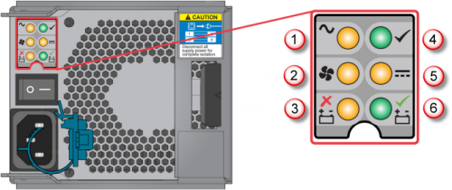

<properties 
   pageTitle="Ersetzen einer PCM auf Ihrem Gerät StorSimple | Microsoft Azure"
   description="Erläutert, wie Sie entfernen, und ersetzen die Leistungsfähigkeit und Kühlung Modul (PCM) auf Ihrem Gerät StorSimple"
   services="storsimple"
   documentationCenter=""
   authors="alkohli"
   manager="carmonm"
   editor="" />
<tags 
   ms.service="storsimple"
   ms.devlang="NA"
   ms.topic="article"
   ms.tgt_pltfrm="NA"
   ms.workload="TBD"
   ms.date="08/18/2016"
   ms.author="alkohli" />

# Ersetzen Sie einen Power und das Modul auf Ihrem Gerät StorSimple

## (Übersicht)

Die Leistungsfähigkeit und Kühlung Modul (PCM) in Ihrem Gerät Microsoft Azure StorSimple besteht aus einer Power Lieferung und Kühllüfter an, die über die primären und EBOD Anlagen gesteuert werden. Es gibt nur ein Modell von PCM, die für jede Einheit zertifiziert sind. Ist die primäre Einheit für eine 764 W PCM zertifiziert und EBOD Einheit für eine 580 W PCM zertifiziert ist. Obwohl die PCMs für die primäre Einheit und die Einheit EBOD unterscheiden, ist das Verfahren für den Austausch identisch.

In diesem Lernprogramm wird erläutert, wie Sie:

- Entfernen einer PCM
- Installieren Sie kein Ersatz PCM

>[AZURE.IMPORTANT] Überprüfen Sie vor dem Entfernen und Ersetzen von einer PCM, die Sicherheitsinformationen in den [Austausch von StorSimple Hardware Komponenten](storsimple-hardware-component-replacement.md).

## Bevor Sie eine PCM ersetzen

Achten Sie auf die folgenden wichtigen Punkte, bevor Sie Ihre PCM ersetzen:

- Wenn Power Lieferung von der PCM fehlschlägt, lassen Sie das fehlerhafte Modul installiert, aber entfernen Sie das Kabel. Der Lüfter weiterhin Power aus der Anlage erhalten und weiterhin ausreichende Kühlung bereit. Wenn der Lüfter fehlerhaft ist, muss der PCM sofort ersetzt werden.

- Vor dem Entfernen der PCM, trennen Sie die Potenz der PCM durch Deaktivieren von der Hauptseite wechseln (soweit vorhanden) oder entfernen Sie das Kabel physisch. Dadurch wird einer Warnung zu Ihrem System, dass ein Power war(en) bevorstehende ist.

- Stellen Sie sicher, dass die anderen PCM für kontinuierliche System-Vorgang vor dem ersetzen den fehlerhaften PCM funktionsfähig ist. Eine fehlerhafte PCM muss so früh wie möglich durch eine voll funktionsfähiges PCM ersetzt werden.

- PCM Modul Ersatz dauert nur einige Minuten, aber es muss abgeschlossen werden, innerhalb von 10 Minuten vom Entfernen der Fehler beim PCM, um eine Überhitzung zu verhindern.

- Beachten Sie, dass die Ersetzung 764 W PCM Module im Lieferumfang von der Factory des Moduls Stützbatterie nicht enthalten. Sie benötigen, entfernen Sie den Akku aus Ihrem fehlerhafte PCM, und fügen Sie ihn in das Ersatzmodul vor Durchführung ersetzt. Weitere Informationen finden Sie unter So [entfernen, und fügen Sie ein Modul Stützbatterie](storsimple-battery-replacement.md).

## Entfernen einer PCM

Wenn Sie einen Power und Kühlung Modul (PCM) auf Ihrem Gerät Microsoft Azure StorSimple entfernen möchten, befolgen Sie diese Anweisungen.

>[AZURE.NOTE] Bevor Sie Ihre PCM entfernen, stellen Sie sicher, dass Sie die richtigen Ersatz (764 W für die primäre Einheit) oder 580 W für die Anlage EBOD haben.

#### So entfernen Sie eine PCM

1. Klicken Sie im Portal Azure klassischen auf **Geräte** > **Wartung** > **Hardware Status**. Überprüfen des Status der PCM-Komponenten unter **Komponenten freigegeben** bestimmt, die PCM fehlgeschlagen ist:

     - Wenn ein Netzteil in PCM 0 fehlgeschlagen ist, wird der Status des **Power angeben in PCM 0** rot angezeigt.

     - Wenn ein Netzteil in PCM 1 fehlgeschlagen ist, wird der Status des **Power angeben in PCM 1** rot angezeigt.

     - Wenn der Lüfter in PCM 1 fehlgeschlagen ist, wird der Status **für PCM 0 0 Kühlung** oder **Kühlung 1 für PCM 0** rot angezeigt.

2. Suchen Sie den Fehler beim PCM auf der Rückseite der primären Einheit aus. Wenn Sie ein Modell 8600 ausgeführt werden, identifizieren Sie die primäre Einheit, indem Sie das System Einheit Identifikationsnummer angezeigt wird, klicken Sie auf die Vorderseite LED-Anzeige betrachtet. Die Standard-Kennung Einheit auf die primäre Einheit angezeigt ist **00**, während die Standardeinstellung Einheit-ID auf die Anlage EBOD angezeigt **01**wird. Das folgende Diagramm und die Tabelle erläutert die Vorderseite der LED-Anzeige.

    

     **Abbildung 1** Vorderseite des Geräts  

  	|Beschriftung|Beschreibung|
  	|:---|:-----------|
  	|1|Stummschalten|
  	|2|System power|
  	|3|Modul-Fehler|
  	|4|Logische Fehlerstrukturanalyse|
  	|5|Einheit-ID anzeigen|

3. Die Überwachung LED an der Rückseite der primären Einheit kann auch verwendet werden, um den fehlerhaften PCM zu identifizieren. Finden Sie unter den folgenden Diagramm und die Tabelle, um zu verstehen, wie die LED zu verwenden, um den fehlerhaften PCM zu suchen. Angenommen, ist die LED entspricht der **Lüfter ein Fehler auftreten,** leuchtet, der Lüfter fehlgeschlagen. Ebenso ist leuchtet die LED **IK Fail** entspricht, die Power Lieferung fehlgeschlagen. 

    

     **Abbildung 2** Rückseite PCM mit LED

  	|Beschriftung|Beschreibung|
  	|:---|:-----------|
  	|1|IK Power-Fehler|
  	|2|Lüfterausfall|
  	|3|Fehlerstrukturanalyse Akku|
  	|4|PCM OK|
  	|5|Ausfall der DC power|
  	|6|Akku fehlerfrei|

4. Schlagen Sie in das folgende Diagramm von der Rückseite der StorSimple Gerät, das fehlerhafte PCM Modul gesucht werden soll. PCM 0 ist, auf der linken Seite und PCM 1 auf der rechten Seite. Die folgende Tabelle erläutert die Module.

     

     **Abbildung 3** Rückseite Gerät mit Plug-in-Module 

  	|Beschriftung|Beschreibung|
  	|:---|:-----------|
  	|1|PCM 0|
  	|2|PCM 1|
  	|3|Controller 0|
  	|4|Controller 1|

5. Deaktivieren Sie den fehlerhaften PCM, und ziehen Sie das Power Lieferung ab. Sie können nun die PCM entfernen.

6. Ziehen Sie die Sperre und der Seite des den Ziehpunkt PCM zwischen dem Daumen und Zeigefinger, und drücken Sie sie zusammen, um den Ziehpunkt zu öffnen.

    

    **Abbildung 4** Öffnen den Ziehpunkt PCM

7. Fassen Sie den Ziehpunkt, und entfernen Sie die PCM.

    

    **Abbildung 5** Entfernen der PCM

## Installieren Sie kein Ersatz PCM

Befolgen Sie diese Anweisungen eine PCM in Ihrem Gerät StorSimple zu installieren. Stellen Sie sicher, dass Sie das Modul Stützbatterie vor der Installation von Ersatz PCM (gilt für nur 764 W PCMs) eingefügt. Weitere Informationen finden Sie unter So [entfernen, und fügen Sie ein Modul Stützbatterie](storsimple-battery-replacement.md).

#### So installieren Sie ein PCM

1. Stellen Sie sicher, dass Sie die richtige Ersatz PCM für diese Einheit verfügen. Die primäre Einheit benötigt eine 764 W PCM, und die Einheit EBOD benötigt eine 580 W PCM. Sie sollten nicht versuchen, die 580 W PCM in der primären Einheit oder die 764 W PCM in der EBOD Einheit verwenden. Die folgende Abbildung zeigt, wo diese Informationen auf dem Etikett zu identifizieren, die auf die PCM angebracht ist.

    

    **Abbildung 6** PCM Bezeichnung

2. Suchen Sie nach Beschädigung der Anlage, wobei die Verbinder beachtet werden muss. 
                                        
    >[AZURE.NOTE] **Installieren Sie das Modul nicht, wenn Stifte Verbinder gebogen werden.**

3. Schieben Sie mit dem PCM Ziehpunkt in der geöffneten Position das Modul in die Anlage ein.

    

    **Abbildung 7** Installieren der PCM

4. Schließen Sie den Ziehpunkt PCM manuell. Hören Sie einen wie aktiviert wird, die Sperre Ziehpunkt. 
                                        
    >[AZURE.NOTE] Um sicherzustellen, dass die Verbinder Stifte beteiligt sind, können Sie vorsichtig auf den Ziehpunkt Schleppboot, ohne die Sperre freizugeben. Wenn sich die PCM Folien, impliziert dies, dass die Sperre geschlossen wurde, bevor die Verbinder nicht nachlässt.

5. Schließen Sie die Power-Kabel aus, an der Quelle Power und an die PCM.

6. Secure entlasten Befreiung Bales an. 

7. Aktivieren Sie das PCM aus.

8. Stellen Sie sicher, dass der Austausch erfolgreich war: Navigieren Sie im Azure klassischen-Portal von Ihrem Dienst StorSimple Manager zu **Geräte** > **Wartung** > **Hardware Status**. Wählen Sie unter **Freigegebene Komponenten**sollten der Status der PCM grünen. 
                                        
    >[AZURE.NOTE] Es dauert ein paar Minuten, damit die Ersetzung PCM zu ein paar Minuten dauern.

## Nächste Schritte

Weitere Informationen zu den [Austausch von StorSimple Hardware Komponenten](storsimple-hardware-component-replacement.md).
