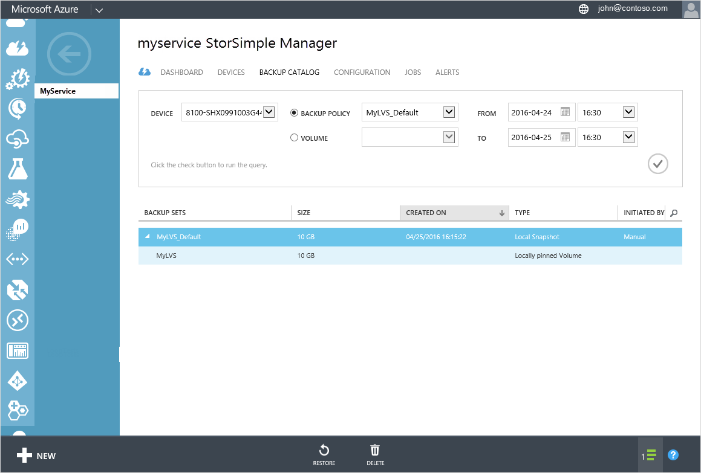
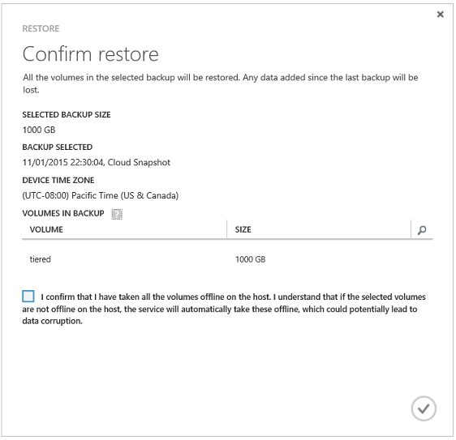

<properties 
   pageTitle="Ton aus einer Sicherung StorSimple | Microsoft Azure"
   description="Erläutert, wie Sie die Seite StorSimple Manager Sicherungskatalog verwenden ein StorSimple Volume in einem Satz Sicherungsdatei wiederherstellen."
   services="storsimple"
   documentationCenter="NA"
   authors="SharS"
   manager="carmonm"
   editor="" />
<tags 
   ms.service="storsimple"
   ms.devlang="NA"
   ms.topic="article"
   ms.tgt_pltfrm="NA"
   ms.workload="TBD"
   ms.date="04/26/2016"
   ms.author="v-sharos" />

# Wiederherstellen eines Datenträgers StorSimple aus einer Sicherung (Update 2)

[AZURE.INCLUDE [storsimple-version-selector-restore-from-backup](../../includes/storsimple-version-selector-restore-from-backup.md)]

## (Übersicht)

Die **Katalog** -Seite zeigt die Sicherung Datensätze, die erstellt werden, wenn Sie manuelle oder automatisierte Sicherungskopien geöffnet werden. Sie können mithilfe dieser Seite können die Liste alle Sicherungskopien für eine Sicherung Richtlinie oder einen Datenträger, aktivieren oder Löschen von Sicherungskopien, oder verwenden eine Sicherungskopie, wiederherstellen oder einen Datenträger klonen.

 

In diesem Lernprogramm wird erläutert, wie die **Sicherungskatalog** Seite verwenden, um Ihr Gerät in einem Satz Sicherungsdatei wiederherstellen.

Sie können einen Datenträger aus einem lokalen oder die Cloud Sicherung wiederherstellen. In beiden Fällen, damit die Teilnehmer bei der Wiederherstellung der Lautstärke online sofort während der Daten im Hintergrund heruntergeladen wurde. 

Bevor Sie eine Wiederherstellung initiieren, sollten Sie Folgendes beachten:

- Rufen Sie auf dem Host und das Gerät vor dem **Sie die Lautstärke offline ausführen müssen** – übernehmen die Lautstärke offline des Wiederherstellungsvorgangs. Zwar des Wiederherstellungsvorgangs auf dem Gerät automatisch die Lautstärke online bringt, müssen Sie manuell auf dem Host das Gerät online schalten. Sobald die Lautstärke auf dem Gerät online ist, können Sie die Lautstärke online auf dem Host übertragen. (Sie müssen nicht warten, bis des Wiederherstellungsvorgangs.) Verfahren finden Sie unter [einen Datenträger offline nehmen](storsimple-manage-volumes-u2.md#take-a-volume-offline).

- **Typ des Datenträgers nach der Wiederherstellung** – gelöschte Datenmengen wiederhergestellt werden, basierend auf dem Typ in der Momentaufnahme; d. h., werden Datenmengen, die lokal angehefteten wurden als lokal angeheftete Datenmengen und Datenmengen, die gestuft wurden als gestufte Datenmengen wiederhergestellt werden.

    Der aktuelle Verwendungstyp des Datenträgers überschreibt für vorhandene Datenmengen die Art, die in der Momentaufnahme gespeichert ist. Wenn Sie einen Datenträger aus einer Momentaufnahme wiederherstellen, die durchgeführt wurde, wenn der Lautstärke Typ gestuft wurde, die Typ des Datenträgers fixiert ist jetzt lokal (aufgrund einer Konvertierungsoperation, die durchgeführt wurde), wird die Lautstärke ebenfalls als lokal angeheftete Volume wiederhergestellt werden. Ein vorhandenes lokal angeheftete Volume erweitert und anschließend aus einer älteren Momentaufnahme ausgeführt wird, wenn die Lautstärke kleinere wurde wiederhergestellt wurde, wird auf ähnliche Weise wiederhergestellte Volume die aktuelle erweiterte Größe beibehalten.

    Sie können keinen Datenträger aus einem gestufte Volume auf einen Datenträger lokal angeheftete oder von einer lokal angeheftete Volume auf einen Datenträger gestufte konvertieren, während die Lautstärke wiederhergestellt wird. Warten Sie, bis des Wiederherstellungsvorgangs, und Sie können die Lautstärke in einen anderen Typ konvertieren. Informationen zum Konvertieren von einem Datenträger wechseln Sie zu [Ändern der Lautstärke Typ](storsimple-manage-volumes-u2.md#change-the-volume-type). 

- **Die Größe der Lautstärke wird in den wiederhergestellten Lautstärke widergespiegelt** – Dies ist ein wichtiges Kriterium, wenn Sie ein lokales angeheftete Volume wiederherstellen, das gelöscht wurde (weil vollständig lokal angeheftete Datenmengen bereitgestellt werden). Stellen Sie sicher, dass Sie ausreichend Platz haben, bevor Sie versuchen, ein lokales angeheftete Volume wiederherstellen, die zuvor gelöscht wurde. 

- **Sie können keine erweitern, einen Datenträger, während sie wiederhergestellt wird** – warten, bis der Wiederherstellung abgeschlossen ist, bevor Sie versuchen, um die Lautstärke zu erweitern. Informationen zu einem Volume erweitern wechseln Sie zu [ändern, einen Datenträger](storsimple-manage-volumes-u2.md#modify-a-volume).

- **Sie können eine Sicherungskopie, während Sie ein lokales Laufwerk wiederherstellen ausführen** – Verfahren finden Sie unter [Verwenden Sie den Dienst StorSimple-Manager können Sie zusätzliche Richtlinien verwalten](storsimple-manage-backup-policies.md).

- **Sie können eine Wiederherstellung Abbrechen** – Wenn Sie den Wiederherstellungsauftrag, und klicken Sie dann auf die Lautstärke Abbrechen wird in den Zustand zurückgesetzt, die es in wurde, bevor Sie bei der Wiederherstellung begonnen haben. Für Verfahren wechseln Sie zu [einen Auftrag abbrechen](storsimple-manage-jobs-u2.md#cancel-a-job).

## So verwenden Sie den Katalog Sicherung

Die Seite **Sicherungskatalog** enthält, dass eine Abfrage, die Sie die Sicherung einschränken kann Auswahl festgelegt. Sie können die Sicherung Datensätze, die abgerufen werden basierend auf den folgenden Parametern filtern:

- **Gerät** – das Gerät, an dem die Sicherung erstellt wurde.
- **Sicherung Richtlinie** oder **Volumen** – die Sicherung Richtlinie oder Lautstärke mit diesen Sicherung Datensatz verknüpft ist.
- **Von** und **zu** – Datums- und Zeitbereich, wenn die Sicherungsdatei Menge erstellt wurde.

Die gefilterten zusätzliche Datensätze werden dann tabellarisch angeordnet basierend auf den folgenden Attributen:

- **Name** – den Namen der Sicherungsdatei Richtlinie oder Volumen zugeordnet Sicherung festlegen.
- **Größe** – die Größe des Sicherung festlegen.
- **Klicken Sie auf erstellt** – Datum und Uhrzeit, wann die Sicherungskopien erstellt wurden. 
- **Typ** – Sicherung Datensätze können lokale Momentaufnahmen oder Momentaufnahmen cloud. Eine lokale Momentaufnahme ist eine Sicherungskopie der alle auf dem Gerät, lokal gespeicherte Lautstärke Daten an, während eine Momentaufnahme der Cloud auf die Sicherung von Volumendaten in der Cloud verweist. Lokale Momentaufnahmen bereitstellen schnelleren Zugriff, während die Cloud Momentaufnahmen für Stabilität Daten ausgewählt sind.
- **Initiiert von** – die Sicherungen automatisch nach einem Zeitplan oder manuell durch einen Benutzer initiiert werden können. (Eine Sicherung Richtlinie können Sie um Sicherungskopien zu planen. Alternativ können Sie die Option **Sicherung ausführen** verwenden eine interaktive Sicherung ausführen.)

## Wie Sie die Lautstärke StorSimple aus einer Sicherung wiederherstellen.

Die **Katalog** -Seite können Sie die Lautstärke StorSimple aus einer bestimmten Sicherung wiederherstellen. Bedenken Sie, jedoch, die ein Volume wiederherstellen wird die Lautstärke in den Status, die beim die Sicherung durchgeführt wurde zurückgesetzt. Alle Daten, die nach der Sicherungskopie Vorgang hinzugefügt wurde, gehen verloren.

> [AZURE.WARNING] Wiederherstellen aus einer Sicherung werden die vorhandenen Datenmengen aus der Sicherung ersetzen. Dadurch kann keine Daten verloren gehen, die geschrieben wurde, nachdem die Sicherung durchgeführt wurde.

### So stellen Sie die Lautstärke wieder her

1. Klicken Sie auf der Seite StorSimple Manager Dienst auf der Registerkarte **Sicherungskatalog** .

    

2. Wählen Sie eine Sicherungskopie, legen Sie wie folgt aus:
  1. Wählen Sie das entsprechende Gerät aus.
  2. Wählen Sie in der Dropdownliste die Lautstärke oder Sicherung Richtlinie für die Sicherung, die Sie auswählen möchten.
  3. Geben Sie den Zeitraum an.
  4. Klicken Sie auf das Symbol "Überprüfen"  zum Ausführen dieser Abfrage.
 
    Die Sicherungskopien zugeordnet ist, mit dem ausgewählten Volume oder zusätzliche Richtlinie sollte in der Liste der Sätze Sicherung angezeigt werden.

3. Erweitern Sie die Sicherung festlegen, um die zugehörigen Datenträger anzuzeigen. Diese Datenträger müssen auf dem Host und dem Gerät offline durchgeführt werden, bevor Sie diese wiederherstellen können. Zugriff auf die Datenträger auf der Seite **Volume Container** , und klicken Sie dann die Schritte in [einen Datenträger offline nehmen](storsimple-manage-volumes-u2.md#take-a-volume-offline) sie offline schalten.

    > [AZURE.IMPORTANT] Stellen Sie sicher, dass Sie die Datenmengen offline auf dem Host zunächst teilgenommen haben, bevor Sie die Datenmengen offline auf dem Gerät ausführen. Wenn Sie die Datenmengen offline auf dem Host nicht übernehmen möchten, kann es potenziell Beschädigung der Daten führen.

4. Navigieren Sie zurück zur Registerkarte **Sicherungskatalog** aus, und wählen Sie eine Sicherungskopie.

5. Klicken Sie auf am unteren Rand der Seite **Wiederherstellen** .

6. Sie werden zur Bestätigung aufgefordert werden. Überprüfen Sie die Informationen zum Wiederherstellen, und wählen Sie dann das Kontrollkästchen zur Bestätigung.

    

7. Klicken Sie auf das Symbol Kontrollkästchen . Dies initiieren ein Wiederherstellungsauftrags, das Sie anzeigen können, indem Sie auf die Seite **Projekte** zugreifen. 

8. Nach Abschluss die Wiederherstellung können Sie überprüfen, ob der Inhalt der Datenträger durch Datenmengen aus der Sicherung ersetzt werden.

 **Video verfügbar**

Wenn Sie ein Video zur Verfügung, die veranschaulicht, wie Sie die datenbeschriftungsreihe verwenden und Features in StorSimple zum Wiederherstellen von gelöschter Dateien wiederherstellen, klicken Sie auf [hier](https://azure.microsoft.com/documentation/videos/storsimple-recover-deleted-files-with-storsimple/).

## Wenn die Wiederherstellung schlägt fehl

Sie erhalten eine Benachrichtigung, wenn bei der Wiederherstellung aus irgendeinem Grund nicht. In diesem Fall aktualisieren Sie die Liste die Sicherungskopie um sicherzustellen, dass die Sicherung noch gültig ist. Wenn die Sicherung gültig ist, und Sie werden aus der Cloud wiederherstellen, klicken Sie dann Verbindungsprobleme das Problem verursacht möglicherweise. 

Um bei der Wiederherstellung abgeschlossen haben, nehmen Sie die Lautstärke offline auf dem Host, und wiederholen Sie den Wiederherstellungsvorgang. Beachten Sie, dass die Lautstärke Daten, die während des Wiederherstellungsvorgangs durchgeführt wurden in irgendeiner Weise verloren.

## Nächste Schritte

- Erfahren Sie, wie [Datenmengen StorSimple verwalten](storsimple-manage-volumes-u2.md).

- Erfahren Sie, wie der Dienst StorSimple Manager zum Verwalten von Ihrem Geräts StorSimple zu [verwenden](storsimple-manager-service-administration.md).
