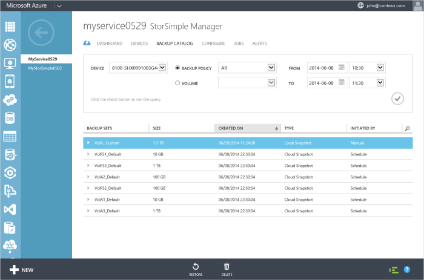

<properties 
   pageTitle="Ton aus einer Sicherung StorSimple | Microsoft Azure"
   description="Erläutert, wie Sie die Seite StorSimple Manager Sicherungskatalog verwenden ein StorSimple Volume in einem Satz Sicherungsdatei wiederherstellen."
   services="storsimple"
   documentationCenter="NA"
   authors="alkohli"
   manager="carmonm"
   editor="" />
<tags 
   ms.service="storsimple"
   ms.devlang="NA"
   ms.topic="article"
   ms.tgt_pltfrm="NA"
   ms.workload="TBD"
   ms.date="08/17/2016"
   ms.author="alkohli" />

# Wiederherstellen eines Datenträgers StorSimple aus einer Sicherung

[AZURE.INCLUDE [storsimple-version-selector-restore-from-backup](../../includes/storsimple-version-selector-restore-from-backup.md)]

## (Übersicht)

Die **Katalog** -Seite zeigt die Sicherung Datensätze, die erstellt werden, wenn Sie manuelle oder automatisierte Sicherungskopien geöffnet werden. Sie können mithilfe dieser Seite können die Liste alle Sicherungskopien für eine Sicherung Richtlinie oder einen Datenträger, aktivieren oder Löschen von Sicherungskopien, oder verwenden eine Sicherungskopie, wiederherstellen oder einen Datenträger klonen.

 

In diesem Lernprogramm wird erläutert, wie die **Sicherungskatalog** Seite verwenden, um ein Volume auf Ihrem Gerät aus einer Sicherung wiederherstellen.

## So verwenden Sie den Katalog Sicherung 

Die Seite **Sicherungskatalog** enthält, dass eine Abfrage, die Sie die Sicherung einschränken kann Auswahl festgelegt. Sie können die Sicherung Datensätze, die abgerufen werden basierend auf den folgenden Parametern filtern:

- **Gerät** – das Gerät, an dem die Sicherung erstellt wurde.
- **Sicherung Richtlinie** oder **Volumen** – die Sicherung Richtlinie oder Lautstärke mit diesen Sicherung Datensatz verknüpft ist.
- **Von** und **zu** – Datums- und Zeitbereich, wenn die Sicherungsdatei Menge erstellt wurde.

Die gefilterten zusätzliche Datensätze werden dann tabellarisch angeordnet basierend auf den folgenden Attributen:

- **Name** – den Namen der Sicherungsdatei Richtlinie oder Volumen zugeordnet Sicherung festlegen.
- **Größe** – die Größe des Sicherung festlegen.
- **Klicken Sie auf erstellt** – Datum und Uhrzeit, wann die Sicherungskopien erstellt wurden. 
- **Typ** – Sicherung Datensätze können lokale Momentaufnahmen oder Momentaufnahmen cloud. Eine lokale Momentaufnahme ist eine Sicherungskopie der alle auf dem Gerät, lokal gespeicherte Lautstärke Daten an, während eine Momentaufnahme der Cloud auf die Sicherung von Volumendaten in der Cloud verweist. Lokale Momentaufnahmen bereitstellen schnelleren Zugriff, während die Cloud Momentaufnahmen für Stabilität Daten ausgewählt sind.
- **Initiiert von** – die Sicherungen automatisch nach einem Zeitplan oder manuell durch einen Benutzer initiiert werden können. (Eine Sicherung Richtlinie können Sie um Sicherungskopien zu planen. Alternativ können Sie die Option **Sicherung ausführen** verwenden eine interaktive Sicherung ausführen.)

## Wie Sie die Lautstärke StorSimple aus einer Sicherung wiederherstellen.

Die **Katalog** -Seite können Sie die Lautstärke StorSimple aus einer bestimmten Sicherung wiederherstellen. 

> [AZURE.WARNING] Aus einer Sicherung wiederherstellen, ersetzen Sie die vorhandenen Datenmengen aus der Sicherung. Dadurch kann keine Daten verloren gehen, die geschrieben wurde, nachdem die Sicherung durchgeführt wurde.

Bevor Sie eine Wiederherstellung auf einem Datenträger initiieren, stellen Sie sicher, dass die Lautstärke offline ist. Sie müssen die Lautstärke offline auf dem Host ersten Ausführen, und klicken Sie dann auf das Gerät. Führen Sie die Schritte in [einen Datenträger offline nehmen](storsimple-manage-volumes.md#take-a-volume-offline). Führen Sie die folgenden Schritte aus, um einen Datenträger aus einer Sicherung wiederherzustellen.

### Wiederherstellen aus einer Sicherung

1. Klicken Sie auf der Seite StorSimple Manager Dienst auf der Registerkarte **Sicherungskatalog** .

    

2. Wählen Sie eine Sicherungskopie, legen Sie wie folgt aus:
  1. Wählen Sie das entsprechende Gerät aus.
  2. Wählen Sie in der Dropdownliste die Lautstärke oder Sicherung Richtlinie für die Sicherung, die Sie auswählen möchten.
  3. Geben Sie den Zeitraum an.
  4. Klicken Sie auf das Symbol "Überprüfen"  zum Ausführen dieser Abfrage.
 
    Die Sicherungskopien zugeordnet ist, mit dem ausgewählten Volume oder zusätzliche Richtlinie sollte in der Liste der Sätze Sicherung angezeigt werden.

3. Erweitern Sie die Sicherung festlegen, um die zugehörigen Datenträger anzuzeigen. Diese Datenträger müssen auf dem Host und dem Gerät offline durchgeführt werden, bevor Sie diese wiederherstellen können. Führen Sie die Schritte in [einen Datenträger offline nehmen](storsimple-manage-volumes.md#take-a-volume-offline).

    >  [AZURE.IMPORTANT] Stellen Sie sicher, dass Sie die Datenmengen offline auf dem Host zunächst teilgenommen haben, bevor Sie die Datenmengen offline auf dem Gerät ausführen. Wenn Sie die Datenmengen offline auf dem Host nicht übernehmen möchten, kann es potenziell Beschädigung der Daten führen.

4. Wählen Sie eine Sicherungskopie. Klicken Sie auf am unteren Rand der Seite **Wiederherstellen** .

6. Sie werden zur Bestätigung aufgefordert werden. 

    

7. Überprüfen Sie die Informationen zum Wiederherstellen, und klicken Sie auf das Symbol Kontrollkästchen . Dies initiieren ein Wiederherstellungsauftrags, das Sie anzeigen können, indem Sie auf die Seite **Projekte** zugreifen. 

8. Nach Abschluss die Wiederherstellung können Sie überprüfen, ob der Inhalt der Datenträger durch Datenmengen aus der Sicherung ersetzt werden.

 **Video verfügbar**

Wenn Sie ein Video zur Verfügung, die veranschaulicht, wie Sie die datenbeschriftungsreihe verwenden und Features in StorSimple zum Wiederherstellen von gelöschter Dateien wiederherstellen, klicken Sie auf [hier](https://azure.microsoft.com/documentation/videos/storsimple-recover-deleted-files-with-storsimple/).

## Nächste Schritte

- Erfahren Sie, wie [Datenmengen StorSimple verwalten](storsimple-manage-volumes.md).

- Erfahren Sie, wie der Dienst StorSimple Manager zum Verwalten von Ihrem Geräts StorSimple zu [verwenden](storsimple-manager-service-administration.md).
