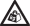
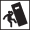

<properties 
   pageTitle="Sicherheit für Ihr Gerät StorSimple | Microsoft Azure"
   description="Beschreibt Konventionen Sicherheit, Richtlinien und Aspekte und erläutert, wie Sie sicheres installieren und betreiben von Ihrem Gerät StorSimple."
   services="storsimple"
   documentationCenter=""
   authors="alkohli"
   manager="carmonm"
   editor="" />
<tags 
   ms.service="storsimple"
   ms.devlang="na"
   ms.topic="article"
   ms.tgt_pltfrm="na"
   ms.workload="na"
   ms.date="08/18/2016"
   ms.author="alkohli" />

# Sicheres Installieren und betreiben von Ihrem Gerät StorSimple

 **Lesen, Sicherheit und GESUNDHEITSINFORMATIONEN**

Lesen Sie alle Sicherheit und Gesundheit Informationen in diesem Artikel, die auf Ihrem Gerät Microsoft Azure StorSimple angewendet wird. Lassen Sie alle im Lieferumfang von Ihrem Geräts StorSimple Referenzzwecken gedruckten Führungslinien. Fehler beim Anweisungen und ordnungsgemäß einrichten, verwenden und Pflege für dieses Produkt das Risiko von schwerwiegenden Schäden oder Todesfällen erhöhen oder an das Gerät oder Geräte beschädigen kann. Eine [herunterladbare Version des Handbuchs](http://www.microsoft.com/download/details.aspx?id=44233) ist ebenfalls verfügbar.

## Sicherheit Symbol Konventionen

Hier sind die Symbole, mit denen sich beim Überprüfen der Sicherheit Vorsichtsmaßnahmen beim Einrichten und Ausführen von Ihrem Gerät Microsoft Azure StorSimple beobachtet werden.

| Symbol  | Beschreibung  |
|:------|:-------------| 
| **Gefahr!**|Zeigt an, gefährliche Situationen, in denen, wenn nicht vermieden, Tod oder schwere Verletzung führt. Dieses Signal Wort befindet sich auf den extremsten Situationen beschränkt.| 
| **Warnung!**|Zeigt an, gefährliche Situationen, in denen, wenn Sie nicht vermieden, Tod oder schwere Verletzung führen kann.|
| **Vorsicht!**|Gibt an, die bei nicht vermieden, kleinere oder mittlere zur Verletzung führen kann gefährliche Situation.|
| **Hinweis:**|Zeigt Informationen als wichtig, aber nicht Risikofaktor-bezogene an.|
| **elektrische Elektroschock** |Hochspannung|
| **beanspruchen Stärke**| |
| **Diagrammteile Benutzer gewartet werden können**|Sofern nicht ordnungsgemäß gelernt nicht zugegriffen Sie werden.|
|**Alle Anweisungen zuerst lesen**| |
| **Risikofaktor Tipp**| |

## Behandeln von Vorsichtsmaßnahmen

  **Warnung!** 

Um das Risiko der Verletzung zu reduzieren:

- Eine vollständig konfigurierte Einheit kann bis zu 32 kg (70 Pfund); abzuwägen. Versuchen Sie nicht, heben Sie es alleine.
- Verschieben die Anlage, bevor Sie immer sicherstellen Sie, dass zwei Personen verfügbar, um die Stärke zu behandeln. Beachten Sie, dass, dass eine Person, die bei dem Versuch, diese Stärke heben Heilung bewältigen kann.
- Heben Sie die Einheit nicht, indem Sie die Ziehpunkte auf die Leistungsfähigkeit und Kühlmodule (PCMs) befindet sich auf der Rückseite der Einheit. Diese nicht sollen die Stärke vertraut machen.

## Verbindung Vorsichtsmaßnahmen

  **Warnung!**

Verringern Sie die Wahrscheinlichkeit, dass der Verletzung, Stromschlags oder Tod:

- Wenn Sie mehrere IK Quellen sind, trennen Sie alle Lieferung Power für die vollständige Isolation an.

- Trennen Sie dauerhaft der Maßeinheit, bevor Sie es verschieben, oder wenn Sie denken, dass es in keiner Weise beschädigt wurde.

- Bieten Sie eine sichere Plan für Elektrik Erde-Verbindung zu die Lieferung ab. Stellen Sie sicher, dass die einen der Einheit die nationalen und lokalen erfüllt vor dem Anwenden von Power.

- Stellen Sie sicher, dass die Verbindung Power immer vor dem Entfernen der einer PCM aus der Einheit getrennt wird.

- Vorausgesetzt, dass die Plug-Ins auf das Kabel Lieferung ist Gerät trennen im Hauptfenster, stellen Sie sicher, dass die Sockets Ausgänge in der Nähe des Geräts befinden und einfach zugänglich sind.

  **Warnung!**

Die Wahrscheinlichkeit von Überhitzung verringern oder aus dem Plan für Elektrik Verbindungen ausgelöst:

- Bieten Sie eine geeignete Power Quelle Plan für Elektrik Überspannungsschutz detaillierte in der technischen angegeben werden müssen.

- Verwenden Sie keine gesplittete Kabel (Leads "Y").

- Um anwendbare Sicherheit, Emission und zur Anforderungen entsprechen, sollte kein Hintergrund entfernt werden und alle Schächte mit Plug-in-Module gefüllt werden müssen oder Leerzeichen versorgen.

- Stellen Sie sicher, dass die Ausrüstung entsprechend der vom Hersteller verwendet wird. Wenn diese Geräte auf eine Weise, die nicht vom Hersteller angegebenen verwendet wird, möglicherweise des Schutzes durch die Ausrüstung beeinträchtigt werden.

 **Hinweis:**

Für das ordnungsgemäße Funktionieren der Geräte und Product Schaden zu vermeiden:

- Die RJ45-Ports an das Ende des Geräts sind für nur eine Ethernet-Verbindung. Diese müssen nicht mit einem Telekommunikation Netzwerk verbunden sein.

- Achten Sie darauf, dass das Gerät in einer den Shapes für Gestelle zu installieren, der einen Kühlung Entwurf von vorne nach hinten aufnehmen können.

- Alle Plug-in-Module und leere Schilder sind Teil der Einheit System. Diese müssen nur entfernt werden, wenn kein Ersatz sofort hinzugefügt werden kann. Das System muss nicht ohne alle Module oder Leerzeichen direkte ausgeführt werden.

## Den Shapes für Gestelle System Vorsichtsmaßnahmen

Wenn Sie das Gerät in einer den Shapes für Gestelle CAB bereitstellen, müssen die folgenden Anforderungen für die Sicherheit berücksichtigt werden.

  **Warnung!**
 
Verringern Sie die Wahrscheinlichkeit, dass Verletzung durch ein Tipp über:

- Das Design für den Shapes für Gestelle sollte das Gesamtgewicht der der installierten Anlagen unterstützen und geeignet ist, die Shapes für Gestelle Weitergabe von Tipps oder über gedrückt wird, während der Installation oder Verwendung normaler zu verhindern, dass Funktionen sollten einbinden.

- Beim Laden einer den Shapes für Gestelle Ausfüllen der Shapes für Gestelle von unten nach oben, und leeren von oben nach unten.

- Schieben Sie mehr als eine Anlage aus der Shapes für Gestelle nicht gleichzeitig auf das Risiko von der Shapes für Gestelle über toppling vermeiden.

  **Warnung!**

Verringern Sie die Wahrscheinlichkeit, dass der Verletzung, Stromschlags oder Tod:

- Die Shapes für Gestelle sollte eine sichere Plan für Elektrik Verteilung-System verfügen. Es muss Blinde aktuelle Schutz für die Einheit und nicht durch die Gesamtzahl der Anlagen installiert überladen werden. Die elektrische Power Verbrauch Bewertung angezeigt wird, klicken Sie auf das Namensschild sollte beobachtet werden.

- Plan für Elektrik Verteilung System muss einer zuverlässigen Grund für jede Einheit, in der Shapes für Gestelle angeben.

- Das Design des Systems Plan für Elektrik Verteilung muss die gesamte Grund Offenlegung aus allen Power benötigtes Material in alle Anlagen aktuellen berücksichtigen. Beachten Sie, dass jede Lieferung Power in jeder Einheit eine Grund Offenlegung aktuelle 1.0 mA höchstens 60 Hz 264 Volt hat. Die Shapes für Gestelle erfordern möglicherweise Beschriftungen, die mit "hohe Offenlegung aktuell. Grund (Erde) Verbindung unbedingt vor dem Verbinden einer zur Verfügung gestellt."

- Die Shapes für Gestelle, wenn Sie mit der Anlagen, konfiguriert muss die Sicherheit von UL 60950-1 und IEC 60950-1/EN 60950-1 zu erfüllen.

 **Hinweis:**

Für die richtige Kühlsysteme des Systems den Shapes für Gestelle:

- Stellen Sie sicher, dass das Design für den Shapes für Gestelle die maximale Einheit Temperatur des 35 Grad Celsius (95 Grad Fahrenheit) in Betrieb berücksichtigt.

- Das System wird mit low-pressure, Rückseite eines Installation (wieder Druck erstellte den Shapes für Gestelle Türen und Hindernisse auf nicht überschritten 5 Pascal [0,5 mm Wasser Monitor]) betrieben.

## Power Kühlung Modul (PCM) Vorsichtsmaßnahmen

Das Gerät ist mit zwei PCMs ausgeführt werden soll. Jeder der PCMs verfügt über eine Power Lieferung und einen für zwei Achsen. Während der kritische Bedingung können das System für einen Fehler des Angebots eine Power, während Sie fortfahren normale Vorgänge aus. Zwei PCMs (und daher power benötigtes Material) muss immer installiert sein. Eine einzelne PCM bietet keine redundante. Daher kann der Ausfall auch eine PCM Ausfallzeiten oder möglichem Datenverlust führen.

  **Warnung!**

Verringern Sie die Wahrscheinlichkeit, dass der Verletzung, Stromschlags oder Tod:

- Entfernen Sie aus der PCM nicht im Hintergrund. Besteht das Risiko von Elektroschocks innerhalb einer. Zu den PCM und fordern Sie ein Austausch, [wenden Sie sich an Microsoft Support](https://msdn.microsoft.com/library/azure/dn757750.aspx).

 **Hinweis:**

Für das ordnungsgemäße Funktionieren der Geräte und Product Schaden zu vermeiden:

- Ersetzen Sie den fehlerhaften PCM innerhalb von 24 Stunden. Nachdem eine PCM für den Austausch entfernt wird, muss die Ersetzung innerhalb von 10 Minuten nach dem Entfernen abgeschlossen sein.

- Eine PCM nicht entfernt, es sei denn, kein Ersatz sofort installiert werden kann. Die Anlage muss nicht ohne alle Module direkte betrieben werden.

## Vorsichtsmaßnahmen elektrostatische Erledigung (ESD)

 **Hinweis:**

Beachten Sie die folgenden ESD-bezogene Vorsichtsmaßnahmen.

- Stellen Sie sicher, dass Sie installiert und einer geeigneten antistatischen Handgelenk oder Knöchel stets aktiviert haben.

- Beachten Sie bei der Behandlung von Modulen und Komponenten alle herkömmliche ESD-Vorsichtsmaßnahmen.

- Vermeiden Sie Kontakt mit Rückwandplatine Komponenten und Modul Verbinder.

- ESD Schaden wird nicht durch die Gewährleistung abgedeckt.

## Akku Beseitigung Vorsichtsmaßnahmen

Die Power Lieferung verwendet eine spezielle Batterie, um den Inhalt des Arbeitsspeichers bei einem temporären, kurzfristig Stromausfall schützen. Die Batterie ist in der PCM eingesetzt. Orientieren Sie die folgende Informationen zu den Akku.

 **Warnung!**

Um das Risiko von kurz, Brand, Explosion, Schäden oder Todesfällen, zu reduzieren:

- Freigeben der verwendeten Akkus gemäß nationale und regionale Vorschriften.

- Gehen Sie wie folgt nicht disassemblieren, schälen, Thermostaten über 60 Grad Celsius (140 Grad Fahrenheit) oder Verbrennung. Ersetzen Sie den Akku PCM mit einem mit einer angegebenen nur ein. Verwendung der einen weiteren Akku möglicherweise Brand oder Explosion darstellen.

- Verwenden Sie schützende Linienenden auf die Batterien, wenn diese für die Power Lieferung entfernt werden.

 **Hinweis:**

Beim Versand oder Transport von andernfalls die Batterien in der Luft, führen Sie die IATA Lithium Akku Leitfaden [http://www.iata.org/whatwedo/cargo/dgr/Pages/lithium-batteries.aspx](http://www.iata.org/whatwedo/cargo/dgr/Pages/lithium-batteries.aspx) verfügbar

Nachdem Sie diese Hinweise zur Sicherheit überprüft haben, sind die nächsten Schritte entpacken, oder Verbinden Ihr Gerät.

## Nächste Schritte

- Für ein Gerät 8100 wechseln Sie zu [Ihrem Gerät StorSimple 8100 installieren](storsimple-8100-hardware-installation.md).

- Für ein Gerät 8600 wechseln Sie zu [Ihrem Gerät StorSimple 8600 installieren](storsimple-8600-hardware-installation.md).

