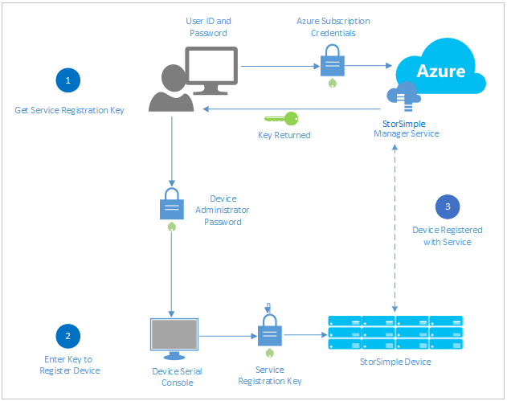
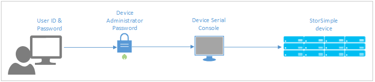
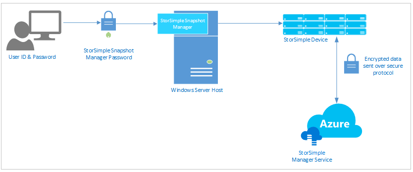
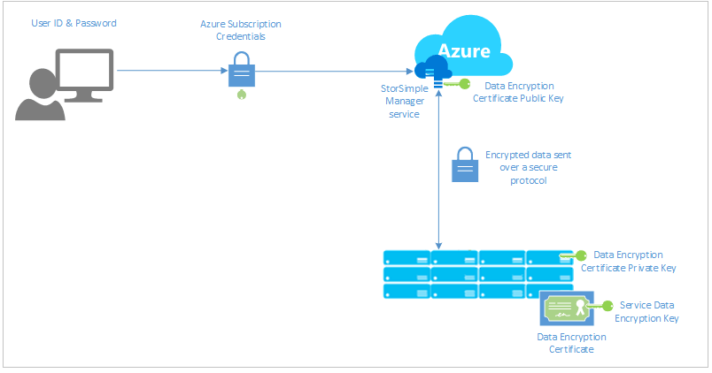
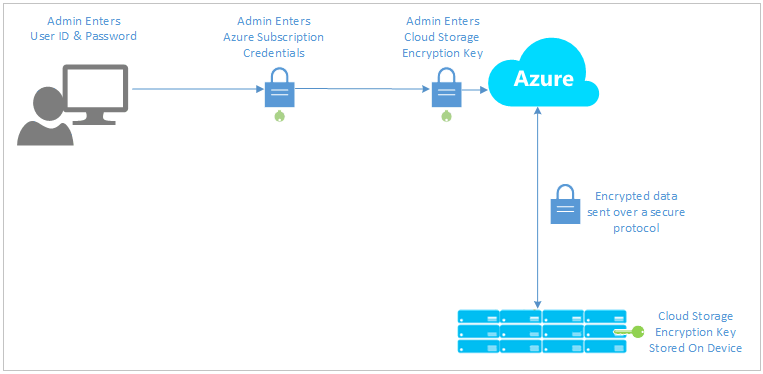

<properties 
   pageTitle="Sicherheit StorSimple | Microsoft Azure" 
   description="Beschreibt die Sicherheit und Datenschutz-Features, die Ihre StorSimple Service, Gerät und die Daten lokal und in der Cloud zu schützen." 
   services="storsimple" 
   documentationCenter="NA" 
   authors="SharS" 
   manager="carmonm" 
   editor=""/>

<tags
   ms.service="storsimple"
   ms.devlang="NA"
   ms.topic="article"
   ms.tgt_pltfrm="NA"
   ms.workload="TBD" 
   ms.date="05/03/2016"
   ms.author="v-sharos"/>

# StorSimple Sicherheit und Datenschutz

## (Übersicht)

Sicherheit ist eine wichtige Rolle für jede Person, die eine neue Technologie, eingeführt wird, insbesondere dann, wenn die Technologie mit vertraulichen oder geschützte Daten verwendet wird. Wie Sie andere Technologien ausgewertet werden soll, müssen Sie höhere Risiken und Kosten für den Datenschutz berücksichtigen. Microsoft Azure StorSimple bietet eine Sicherheit und den Datenschutz Lösung für den Datenschutz sicher: 

- **Vertraulichkeit** – nur autorisierte Personen Ihre Daten anzeigen können. 
- **Integrität** – nur autorisierte Personen können ändern oder Löschen von Daten.

Die Microsoft Azure StorSimple Lösung besteht aus vier Hauptkomponenten, die miteinander interagieren:

- **StorSimple-Manager-Dienst in Microsoft Azure gehostet** – der Verwaltungsdienst, mit denen Sie konfigurieren und das Gerät StorSimple bereitzustellen.
- **StorSimple Gerät** – eine physische Gerät installiert in Ihrem Datencenter. Alle Hosts und Clients, die Daten zu generieren, Herstellen einer Verbindung mit dem Gerät StorSimple, und das Gerät verwaltet die Daten, und verschiebt sie in der Cloud Azure je nach Bedarf.
- **Clients/Hosts mit dem Gerät verbunden** – die Clients in Ihrer Infrastruktur, die eine Verbindung mit dem Gerät StorSimple und Generieren von Daten, die geschützt werden müssen.
- **Cloud-Speicher** – der Speicherort in der Azure Cloud Daten gespeichert ist.

Den folgenden Abschnitten werden die StorSimple Sicherheitsfeatures, mit deren Hilfe jede der folgenden Komponenten und diesen gespeicherten Daten zu schützen. Darüber hinaus eine Liste der Fragen, die Sie möglicherweise zu Microsoft Azure StorSimple Sicherheit und die entsprechenden Antworten.

## Schutz der StorSimple Manager-Dienst

Der StorSimple-Manager ist ein Verwaltungsdienst in Microsoft Azure gehostet und verwendet, um alle StorSimple Geräte verwalten, die Ihre Organisation beschafft hat. Sie können den Dienst StorSimple Manager mithilfe Ihrer Organisation Anmeldeinformationen Azure klassischen Portal über einen Webbrowser anmelden zugreifen. 

Zugriff auf den StorSimple-Manager-Dienst erfordert, dass Ihre Organisation ein Azure-Abonnement besitzen, das StorSimple enthält. Ihr Abonnement steuert die Funktionen, die Sie in der klassischen Azure-Portal zugreifen können. Wenn Ihre Organisation verfügt nicht über ein Azure-Abonnement, und erfahren Sie mehr über diese werden soll, finden Sie unter [Anmelden für Azure als einer Organisation](../active-directory/sign-up-organization.md). 

Da der StorSimple Manager-Dienst in Azure gehostet wird, ist es durch den Azure Sicherheitsfeatures geschützt. Weitere Informationen zu den Sicherheitsfeatures von Microsoft Azure bereitgestellt wechseln Sie zum [Microsoft Azure-Trust Center](https://azure.microsoft.com/support/trust-center/security/).

## StorSimple Geräteschutz

Das Gerät StorSimple ist eine lokale Hybrid Speichergerät, die einfarbige Zustand Laufwerken (SSDs) und Festplatten (Festplatten), zusammen mit redundante Controller und automatischer Failoverfunktionen enthält. Die Controller verwalten Speicher Stufen, Platzierung von derzeit verwendete (oder wichtiges) Daten auf lokale Speicher (in der StorSimple Gerät oder lokalen Server) und beim Verschieben von weniger häufig verwendeten Daten in der Cloud.

Nur autorisierte StorSimple Geräte zulässig sind, zur Teilnahme am StorSimple Manager-Service, die Sie in Ihrem Abonnement Azure erstellt haben. Wenn Sie ein Gerät zustimmen möchten, müssen Sie ihn mit dem Dienst StorSimple Manager registrieren, durch die Bereitstellung der Dienst-Registrierungsschlüssel. Der Dienst Registrierungsschlüssel ist ein 128-Bit-Zufallszahl im klassischen Azure-Portal generiert. 

Informationen wie erhalten einen Dienst-Registrierungsschlüssel, wechseln Sie zu [Schritt2: Abrufen der Dienst Registrierungsschlüssel](storsimple-deployment-walkthrough.md#step-2-get-the-service-registration-key).

Der Dienst Registrierungsschlüssel ist ein lange, die 100 + Zeichen enthält. Sie können die Taste kopieren und in eine Textdatei an einem sicheren Ort speichern, damit Sie es verwenden können, um zusätzliche Geräte nach Bedarf zu autorisieren. Wenn der Dienst Registrierungsschlüssel verloren geht, nachdem Sie Ihrer erste Gerät zu registrieren, können Sie einen neuen Product Key vom Dienst StorSimple Manager generieren. Dies wirkt sich nicht auf den vorhandenen Geräte-Vorgang. 

Nachdem Sie ein Gerät registriert ist, wird für die Kommunikation mit Microsoft Azure Token. Der Dienst Registrierungsschlüssel wird nach der Registrierung Gerät nicht verwendet werden.

> [AZURE.NOTE] Es empfiehlt sich, dass der Dienst Registrierungsschlüssel nach jeder Verwendung neu zu generieren.

## Schützen Sie Ihrer StorSimple-Lösung über Kennwörter

Kennwörter sind ein wichtiger Aspekt der Sicherheit des Computers und werden häufig in die Lösung StorSimple verwendet, um sicherzustellen, dass Ihre Daten zugreifen können nur autorisierte Benutzer. StorSimple können Sie die folgenden Kennwörter konfigurieren:

- StorSimple Gerät Administratorkennworts
- Fordern Sie Handshake Authentication-Protokoll (CHAP) Initiator- und Ziel Kennwörter
- Kennwort-Manager StorSimple-Snapshot

### Windows PowerShell für StorSimple und das Kennwort des Administrators StorSimple Gerät

Windows PowerShell für StorSimple ist eine Line-Benutzeroberfläche, die Sie zum Verwalten des Geräts StorSimple verwenden können. Windows PowerShell für StorSimple enthält Features, die ermöglichen es Ihnen, Ihr Gerät zu registrieren, Konfigurieren der Schnittstelle auf Ihrem Gerät, bestimmte Arten von Updates installieren, Problembehandlung bei Ihrem Gerät durch den Zugriff auf den Support-Sitzung, und ändern Sie den Zustand Gerät. Sie können Windows PowerShell für StorSimple durch Herstellen einer Verbindung mit der seriellen Konsole auf dem Gerät oder mithilfe von Windows PowerShell Remote zugreifen.

Remote PowerShell kann über HTTPS oder HTTP vorgenommen werden. Wenn Sie remote-Management über HTTPS aktiviert ist, müssen Sie das Zertifikat remote-Verwaltung vom Gerät herunterladen und installieren es auf dem remote-Client. Weitere Informationen zu Remote PowerShell wechseln Sie zu [Remote mit Ihrem Gerät StorSimple verbinden](storsimple-remote-connect.md).

Nachdem Sie Windows PowerShell für StorSimple in Verbindung mit dem Gerät verwenden, müssen Sie das Gerät Administratorkennwort Anmelden am Gerät bereitstellen.

Berücksichtigen Sie die folgenden bewährten Methoden:

- Remote-Verwaltung ist standardmäßig deaktiviert. Den Dienst StorSimple-Manager können Sie es aktivieren. Eine Erhöhung der Sicherheit RAS nur während der Zeit, die sie tatsächlich benötigt wird aktiviert werden soll.
- Wenn Sie das Kennwort ändern, müssen Sie alle RAS-Benutzer benachrichtigen, damit er keinen unerwarteter Connectivity Verlust auftreten.
- Der Dienst StorSimple-Manager vorhandene Kennwörter kann nicht abgerufen werden: sie können nur diese zurückzusetzen. Es empfiehlt sich, dass Sie alle Kennwörter an einem sicheren Ort speichern, damit Sie kein Kennwort zurücksetzen, wenn Sie es vergessen. Wenn Sie ein Kennwort zurücksetzen möchten, müssen Sie alle Benutzer benachrichtigen, bevor Sie es zurücksetzen. 

Sie können die Windows PowerShell-Benutzeroberfläche mithilfe einer seriellen Verbindungs mit dem Gerät zugreifen. Sie können auch darauf zugreifen Remote mithilfe von HTTP oder HTTPS, welche zusätzlichen Sicherheit zu gewährleisten. HTTPS bietet eine höhere Sicherheit als einer seriellen Verbindung oder HTTP-Verbindung. Jedoch müssen zur Verwendung von HTTPS Sie zuerst ein Zertifikat auf dem Clientcomputer installieren, der auf das Gerät. Sie können das Zertifikat Remotezugriff auf der Seite Gerät Konfiguration des Diensts StorSimple Manager herunterladen. Wenn das Zertifikat für den Remotezugriff verloren geht, müssen Sie ein neues Zertifikat herunterladen und es für alle Clients, die autorisiert sind, verwenden Sie remote-Verwaltung auf Objektebene überschrieben werden.

### Fordern Sie Handshake Authentication-Protokoll (CHAP) Initiator- und Ziel Kennwörter

CHAP ist ein Authentifizierungsschema für die vom Gerät StorSimple zum Überprüfen der Identität des remote-Clients verwendet. Die Überprüfung basiert auf ein freigegebenes Kennwort. CHAP kann unidirektionale werden (eine Richtung) oder gegenseitig (bidirektionaler). Bei unidirektionale CHAP authentifiziert das Ziel (das Gerät StorSimple) einen Initiator (Host). Gegenseitig oder reverse CHAP setzt voraus, dass das Ziel authentifiziert den Initiator, und klicken Sie dann der Initiator das Ziel authentifizieren. Ihre StorSimple kann konfiguriert werden, um beide Methoden verwenden.

Achten Sie auf die folgenden, wenn Sie CHAP konfigurieren:

- Der Benutzername CHAP muss weniger als 233 Zeichen enthalten.
- Das Kennwort CHAP muss zwischen 12 und 16 Zeichen. Versuchen, mehr Benutzernamen oder Kennwort führt zu Fehlern im eine fehlgeschlagene Authentifizierung, auf dem Windows-Host.
- Sie können nicht für die CHAP Initiator und das Ziel CHAP dasselbe Kennwort verwenden.
- Nachdem Sie das Kennwort festlegen, geändert werden kann, aber nicht abgerufen werden. Wenn das Kennwort geändert wird, müssen Sie alle RAS-Benutzer benachrichtigen, damit diese erfolgreich an das Gerät StorSimple verbinden können.

Weitere Informationen zu CHAP und wie Sie es für Ihre Lösung StorSimple konfigurieren zu wechseln [, Die für Ihr Gerät StorSimple CHAP konfigurieren](storsimple-configure-chap.md)

### Kennwort-Manager StorSimple-Snapshot

StorSimple Snapshot-Manager ist ein Microsoft Management Console (MMC)-Snap-in, das Volume-Gruppen und die Windows-Volume Dienstfehler wird verwendet, um die Anwendung konsistent Sicherungskopien generieren. Darüber hinaus können Sie StorSimple Snapshot-Manager verwenden, erstellen zusätzliche Zeitpläne und Klonen oder Datenmengen wiederherstellen.

Wenn Sie ein Gerät verwenden StorSimple Snapshot-Manager konfigurieren, müssen Sie das Kennwort StorSimple Snapshot-Manager bereitstellen. Dieses Kennwort ist zunächst in Windows PowerShell für StorSimple während der Registrierung festgelegt. Das Kennwort kann auch festlegen und aus dem Dienst StorSimple Manager geändert werden. Dieses Kennwort authentifiziert das Gerät mit StorSimple Snapshot-Manager.

Das Kennwort StorSimple Snapshot-Manager muss 14 und 15 Zeichen und muss mindestens 3 der eine Kombination aus Groß-, Kleinbuchstaben, numerischen und Sonderzeichen enthalten. Nachdem Sie das Kennwort StorSimple Snapshot-Manager festlegen, geändert werden kann, aber nicht abgerufen werden. Wenn Sie das Kennwort ändern, müssen Sie alle Remotebenutzer benachrichtigen.

Weitere Informationen zu StorSimple Snapshot-Manager, wechseln Sie zu [Neuigkeiten StorSimple Snapshot-Manager?](storsimple-what-is-snapshot-manager.md)

### Best Practices für Kennwörter

Es empfiehlt sich, dass Sie die folgenden Richtlinien verwenden, um sicherzustellen, dass StorSimple Kennwörter sicherer und gut geschützt werden:

- Ändern Sie die Kennwörter alle drei Monate. Ändern die Kennwörter wird jährlich erzwungen.
- Verwenden Sie sichere Kennwörter. Wechseln Sie weitere Informationen zum [Erstellen sicherer Kennwörter und schützen](http://blogs.microsoft.com/cybertrust/2014/08/25/create-stronger-passwords-and-protect-them/).
- Verwenden Sie immer unterschiedliche Kennwörter für den Zugriff auf unterschiedliche Verfahren; Jeder der angegebenen Kennwörter sollten eindeutig sein.
- Freigeben Sie Kennwörter nicht für alle Personen, die nicht autorisiert ist, das Gerät StorSimple Zugriff auf.
- Sprechen Sie über ein Kennwort vor anderen oder Hinweis auf das Format eines Kennworts nicht.
- Wenn Sie davon ausgehen, dass ein Konto oder Kennwort geworden ist, melden Sie den Vorfall Abteilung Ihres Sicherheit.
- Alle Kennwörter als sensible, vertrauliche Informationen zu behandeln. 

## StorSimple Datenschutz

In diesem Abschnitt werden die StorSimple Sicherheitsfeatures, die Daten auf dem Weg und gespeicherten Daten zu schützen.

Wie in anderen Abschnitten beschrieben, werden Kennwörter verwendet, um zu autorisieren, und Benutzer authentifiziert, bevor sie zu Ihrer Lösung StorSimple zugreifen können. Ein weiterer Sicherheitsaspekt schützen Daten vor nicht autorisierte Benutzer, während sie übertragenen zwischen Storage-Systemen und gespeichert wird. Den folgenden Abschnitten werden die Datenschutzfunktionen mit StorSimple bereitgestellt.

> [AZURE.NOTE] Deduplication bietet zusätzlichen Schutz für Daten auf dem Gerät StorSimple und in Microsoft Azure Storage gespeichert sind. Wenn Daten deduplizierte ist, die Datenobjekte aus den Metadaten für die Zuordnung, und greifen sie separat gespeichert werden: Es gibt keinen verfügbar Speichergrenze Kontext, um die Daten basierend auf Lautstärke Struktur, Dateisystem oder Dateinamen wiederherzustellen.

## Schützen von Daten über den Dienst entdeckt

Der primäre Zweck des Diensts StorSimple Manager wird zum Verwalten und konfigurieren das Gerät StorSimple. Microsoft Azure wird der StorSimple Manager-Dienst ausgeführt. Sie verwenden das klassische Azure-Portal Konfiguration Gerätedaten eingeben, und dann verwendet Microsoft Azure Service StorSimple Manager zum Senden der Daten auf dem Gerät. StorSimple verwendet eine System von asymmetrische Schlüssel paarweise angegeben werden, um sicherzustellen, dass ein Verlust gespeicherter Informationen nicht gefährdet Azure Service führen wird. 

Die asymmetrische Key Systeme hilft bei der Schutz der Daten, die in den Dienst gelangen wie folgt:

1. Eine Verschlüsselungszertifikats Daten verwendet, die einen asymmetrischen öffentlichen und privaten Schlüssel Paar wird auf dem Gerät generiert und wird verwendet, um die Daten zu schützen. Wenn das erste Gerät registriert ist, werden die Tasten generiert. 
2. Das Zertifikatsschlüssel Daten werden in eine Datei Personal Information Exchange (PFX-Datei) exportiert, die vom Dienst Daten Verschlüsselungsschlüssel geschützt ist, die einem starken 128-Bit-Schlüssel ist, der nach dem ersten Gerät während der Registrierung zufällig generiert wird.
3. Der Schlüssel des Zertifikats sicher der StorSimple Manager-Dienst zur Verfügung gestellt wird, und der private Schlüssel verbleibt, mit dem Gerät.
4. Eingeben des Diensts Daten ist verschlüsselt mithilfe der Öffentlichkeit Key und mit der auf dem Gerät gespeicherten privaten Schlüssel entschlüsselt, um sicherzustellen, dass die Azure Service Daten verwendet, um das Gerät entschlüsselt werden kann.

Klicken Sie auf nur das erste Gerät Dienst registriert wird der Dienst Datenschlüssel generiert. Alle nachfolgenden Geräte, die mit dem Dienst registriert sind, müssen den gleichen Dienst Datenschlüssel verwenden. 

> [AZURE.IMPORTANT] 
> 
> Es ist sehr wichtig, erstellen Sie eine Kopie des Verschlüsselungsschlüssels Dienst Daten, und speichern Sie sie an einem sicheren Ort. Eine Kopie des Verschlüsselungsschlüssels Dienst Daten sollten in einer Weise gespeichert werden, dass es über eine autorisierte Person zugegriffen werden kann und einfach an den Geräteadministrator übermittelt werden kann.
>
> Wenn der Schlüssel Dienst Daten verloren geht, kann ein Microsoft-Support-Mitarbeiter helfen Ihnen bei, es abzurufen, vorausgesetzt, dass Sie mindestens ein Gerät Onlinestatus haben. Es empfiehlt sich, dass der Schlüssel Dienst Daten ändern, nachdem sie abgerufen werden. Anweisungen finden Sie unter [Ändern der Schlüssel Dienst Daten](storsimple-service-dashboard.md#change-the-service-data-encryption-key).

Sie können dem Dienst Datenschlüssel und die entsprechenden Daten Verschlüsselungszertifikats ändern, indem Sie die Option **Verschlüsselungsschlüssels für Dienst Daten ändern** , auf dem Dashboard Dienst auswählen. Um sicherzustellen, dass die Daten nicht beeinträchtigt wird, müssen Sie ein physisches StorSimple Gerät zum Ändern des Verschlüsselungsschlüssels für Dienst Daten verwenden. Ändern der Schlüssel für die Verschlüsselung erfordert, dass alle Geräte mit dem neuen Schlüssel aktualisiert werden. Wir empfehlen daher, die Taste zu ändern, wenn alle Geräte online sind. Wenn Geräte offline sind, können ihre Schlüssel zu einem anderen Zeitpunkt geändert werden. Die Geräte mit veralteten Tasten werden weiterhin Sicherungen ausführen, aber sie sind nicht in der Lage, Daten wiederherstellen, bis die Taste aktualisiert wird. Weitere Informationen finden Sie verwenden [die StorSimple Manager-Service-Dashboard](storsimple-service-dashboard.md).

Dem Dienst Datenschlüssel und Daten Verschlüsselungszertifikats laufen nicht. Allerdings empfiehlt es sich, dass Sie den Dienst Daten Verschlüsselung Key verzinst wird, um zu verhindern, dass Key Kompromisse ändern.

## Schützen von Daten

Das Gerät StorSimple verwaltet die Daten lokal und in der Cloud, je nach Häufigkeit Bedienung in Ebenen speichern. Alle Hostcomputer, die mit dem Gerät verbunden werden senden Daten auf das Gerät, das dann Daten in der Cloud, je nach Bedarf verschiebt. Daten werden vom Gerät in der Cloud sicher über das Internet übertragen. Jedes Gerät verfügt über eine iSCSI-Ziel, die alle freigegebenen Datenträger auf dem Gerät Flächen. Alle Daten werden verschlüsselt, bevor sie in die cloud Speicher gesendet wird. 

Um die Sicherheit und Integrität der Daten in der Cloud verschoben zu gewährleisten, können mit StorSimple Schlüssel für die Verschlüsselung des Cloud-Speicher wie folgt definiert:

- Sie angeben beim Erstellen eines Containers Lautstärke des Cloud-Speicher Verschlüsselungsschlüssels. Der Schlüssel kann nicht geändert oder später hinzugefügt werden. 
- Alle Datenträger in einem Container Lautstärke Freigeben des gleichen Verschlüsselungsschlüssels an. Wenn Sie eine andere Form der Verschlüsselung für ein bestimmtes Volume möchten, empfehlen wir, dass Sie einen neuen Lautstärke Container, um die Lautstärke hosten erstellen.
- Wenn Sie in der StorSimple Manager-Dienst des Cloud-Speicher Verschlüsselungsschlüssels eingeben, wird der Schlüssel verschlüsselt, mit dem öffentlichen Teil des Verschlüsselungsschlüssels Dienst Daten, und klicken Sie dann auf das Gerät gesendet.
- Die Cloud-Speicher Verschlüsselungsschlüssels nicht an einer beliebigen Stelle in der Dienst gespeichert und ist nur für das Gerät bezeichnet.
- Angeben eines Verschlüsselungsschlüssels für Cloud-Speicher ist optional. Sie können Daten senden, die auf dem Host auf dem Gerät verschlüsselt wurde.

### Bewährte Methoden für zusätzliche Sicherheit

- Teilen den Datenverkehr: isolieren Ihrer iSCSI SAN aus den Benutzerdatenverkehr in einem corporate LAN nach einem völlig gesonderte Netzwerk bereitstellen und Verwenden von VLANs physische Isolation nicht ist eine Option. Ein dediziertes Netzwerk für iSCSI-Speicher wird die Sicherheit und Leistung von Ihrem Unternehmen wichtige Daten zu gewährleisten. Kombinieren von Speicher und die Benutzer den Datenverkehr über ein Firmennetzwerk kann wird nicht empfohlen, und Wartezeit vergrößern und zu Netzwerkfehlern führen.

- Verwenden Sie für Host angeordneten Netzwerk Sicherheit Netzwerkschnittstellen, die TCP/IP Auslagern-Engine (TOE) unterstützen. TOE verringert CPU-Auslastung durch die Verarbeitung von TCP auf dem Netzwerkadapter.

## Schützen von Daten über Speicherkonten

Jedes Microsoft Azure-Abonnement kann ein oder mehrere Storage-Konten erstellen. (Ein Speicherkonto bietet einen eindeutigen Namespace für das Arbeiten mit Daten in der Cloud Azure gespeichert.) Zugriff auf ein Speicherkonto wird durch die Schlüssel Abonnement und Access mit diesem Speicherkonto gesteuert. 

Wenn Sie ein Speicherkonto erstellen, generiert Microsoft Azure zwei 512-Bit-Speicher Zugriffstasten, von denen für die Authentifizierung verwendet wird, wenn das Gerät StorSimple Speicher-Konto greift auf. Beachten Sie, dass nur von einem der folgenden Schlüssel verwendet wird. Der anderen Schlüssel ist in reservieren, so dass Sie die Tasten regelmäßig drehen gehalten. Zum Drehen Tasten sekundären Schlüssel aktiv machen, und löschen Sie den Primärschlüssel. Sie können dann einen neuen Product Key für die Verwendung während der nächsten Drehung erstellen. (Aus Gründen der Sicherheit erfordern viele Datencenter Key Drehung). 

Es empfiehlt sich, dass Sie diese bewährte Methoden für die wichtigsten Drehung folgen:

- Drehen Sie Speicher Konto Schlüssel regelmäßig, um sicherzustellen, dass Ihr Speicherkonto durch nicht autorisierte Benutzer nicht zugegriffen werden kann.
- Regelmäßig, sollte der Administrator Azure ändern oder neu erstellt die primäre oder sekundäre Taste mithilfe des Portals Azure klassischen Abschnitt Speicher das Speicherkonto direkten Zugriff auf.

## Schützen von Daten über Verschlüsselung

StorSimple verwendet die folgenden Algorithmen für die Verschlüsselung in gespeicherte Daten schützen oder zwischen den Komponenten Ihrer Lösung StorSimple unterwegs.

| Algorithmus | Länge des Schlüssels | Protokolle/Applications/Kommentare |
| --------- | ---------- | ------------------------------- |
| RSA       | 2048       | RSA PKCS 1 1.5 von der Azure klassischen Portal verwendet, um die Konfigurationsdaten verschlüsseln, die an das Gerät gesendet werden: z. B. Speicher Anmeldeinformationen, StorSimple Gerätekonfiguration zu berücksichtigen und cloud Schlüssel für die Verschlüsselung. |
| AES       | 256        | AES mit CBC wird verwendet, um den öffentlichen Teil des Verschlüsselungsschlüssels Dienst Daten verschlüsseln, bevor sie vom Gerät StorSimple klassischen Azure-Portal gesendet wird. Durch das Gerät StorSimple dient zum Verschlüsseln von Daten, bevor Sie die Daten in der Cloud-Speicher-Konto gesendet werden. |

## StorSimple virtuelles Gerät Sicherheit

[AZURE.INCLUDE [storsimple virtual device security](../../includes/storsimple-virtual-device-security.md)]

## Häufig gestellte Fragen (FAQ)

Es folgen einige Fragen und Antworten zu Sicherheit und Microsoft Azure StorSimple.

**Q:** Mein Dienst beeinträchtigt wird. Was Meine nächste Schritte werden sollte?

**A:** Sie sollten sofort ändern, dem Dienst Datenschlüssel und Speicher Konto Schlüssel für Speicher-Konto, das für tiering Daten verwendet wird. Anweisungen wechseln Sie zu: 

- [Ändern Sie den Dienst Daten Verschlüsselungsschlüssel](storsimple-service-dashboard.md#change-the-service-data-encryption-key)
- [Key Drehung Speicherkonten](storsimple-manage-storage-accounts.md#key-rotation-of-storage-accounts)

**Q:** Ich habe ein neues StorSimple-Gerät, das für den Dienst Registrierungsschlüssel Gruppenmitglieder ist. Wie abrufen kann ich sie?

**A:** Dieser Schlüssel erstellt wurde, bei der Erstellung des StorSimple Manager-Diensts. Wenn Sie den Dienst StorSimple Manager in Verbindung mit dem Gerät verwenden, können Sie die Seite Schnellstart anzeigen oder der Dienst Registrierungsschlüssel neu zu generieren. Generieren einen neuen Dienst Registrierungsschlüssel wirkt sich nicht auf die vorhandenen registrierten Geräte aus. Anweisungen wechseln Sie zu:

- [Zeigen Sie an oder neu generieren Sie der Dienst Registrierungsschlüssel](storsimple-service-dashboard.md#view-or-regenerate-the-service-registration-key)

**Q:** Ich verloren gegangen sind meine Schlüssel Dienst Daten aus. Was muss ich tun?

**A:** Wenden Sie sich an Microsoft Support. Sie können sich anmelden, mit einer Support-Sitzung auf Ihrem Gerät und Hilfe Sie die Taste abrufen (vorausgesetzt, mindestens ein Gerät online ist). Unmittelbar nach dem Sie den Dienst Daten Verschlüsselung Key erhalten haben, sollten Sie ändern, um sicherzustellen, dass der neue Product Key nur Ihnen bekannt ist. Anweisungen wechseln Sie zu:

- [Ändern Sie den Dienst Daten Verschlüsselungsschlüssel](storsimple-service-dashboard.md#change-the-service-data-encryption-key)

**Q:**  Ich ein Gerät für eine Dienst Daten Verschlüsselung Key-Änderung berechtigt, aber den wichtigsten Änderungsprozess wurde nicht gestartet. Was tun kann ich?

**A:** Wenn das Timeout abgelaufen ist, müssen Sie autorisieren das Gerät für den Dienst Daten Verschlüsselung Key ändern möchten, und den Vorgang erneut starten.

**Q:**  Ich habe die Schlüssel Dienst Daten geändert, aber ich konnte nicht zu die anderen Geräten innerhalb von 4 Stunden aktualisieren. Muss ich mich erneut zu starten?

**A:** Der 4 Stunden Zeitraum ist nur für das Initiieren der ändern. Nachdem Sie den Aktualisierungsvorgang auf dem autorisierten StorSimple Gerät gestartet haben, ist die Autorisierung gültig, bis alle Geräte aktualisiert werden.

**Q:** Unsere StorSimple Administrator hat das Unternehmen verlassen. Was tun kann ich?

**A:** Ändern zurücksetzen Sie der, mit denen Zugriff auf das Gerät StorSimple Kennwörter und ändern Sie den Dienst Daten Verschlüsselungsschlüssel, um sicherzustellen, dass die neue Informationen gegenüber unbefugten Personen nicht bekannt ist. Anweisungen wechseln Sie zu:

- [Verwenden Sie den Dienst StorSimple Manager so ändern Sie die Kennwörter storsimple](storsimple-change-passwords.md)
- [Ändern Sie den Dienst Daten Verschlüsselungsschlüssel](storsimple-service-dashboard.md#change-the-service-data-encryption-key)
- [Konfigurieren von CHAP für Ihr Gerät StorSimple](storsimple-configure-chap.md)

**Q:** Ich möchte das Kennwort StorSimple Snapshot-Manager auf einem Host angeben, die mit dem Gerät StorSimple verbunden ist, aber das Kennwort ist nicht verfügbar. Was kann ich tun?

**A:** Wenn Sie das Kennwort vergessen haben, sollten Sie eine neue erstellen. Klicken Sie dann unbedingt alle vorhandenen Benutzer darüber zu informieren, dass das Kennwort geändert wurde und ihren Client so verwenden Sie das neue Kennwort aktualisiert werden soll. Anweisungen wechseln Sie zu:

- [Ändern des Kennworts StorSimple Snapshot-Manager](storsimple-change-passwords.md#change-the-storsimple-snapshot-manager-password)
- [Ein Gerät authentifizieren](storsimple-snapshot-manager-manage-devices.md#authenticate-a-device)

**Q:** Das Zertifikat für den Remotezugriff auf die Windows PowerShell für StorSimple wurde auf dem Gerät geändert. Wie aktualisieren kann ich meine RAS-Clients?

**A:** Sie können das neue Zertifikat aus der StorSimple Manager-Dienst herunterladen und geben Sie es im Zertifikatspeicher Ihrer RAS-Clients installiert werden. Anweisungen wechseln Sie zu:

- [Cmdlet Zertifikat importieren](https://technet.microsoft.com/library/hh848630.aspx)

**Q:** Ist Meine geschützten Daten, wenn der Dienst gefährdet ist StorSimple Manager vorhanden?

**A:** Dienst Konfigurationsdaten werden immer mit Ihren öffentlichen Schlüssel verschlüsselt, wenn Sie es in einem Webbrowser anzeigen. Da der Dienst Zugriff auf den privaten Schlüssel hat, werden der Dienst nicht keine Daten sehen können. Wenn der StorSimple Manager-Dienst gefährdet ist, wird keine Auswirkung, wie keine Schlüssel im Dienst StorSimple Manager gespeichert sind.

**Q:** Wenn eine Person Zugriff auf Daten Verschlüsselungszertifikats Schaden, werden meine Daten werden beeinträchtigt?

**A:** Microsoft Azure speichert die Kunden Datenschlüssel (PFX-Datei) in einem verschlüsselten Format an. Da die PFX-Datei verschlüsselt ist und der Dienst StorSimple verfügt nicht über die Daten Dienstschlüssel zum Entschlüsseln der PFX-Datei, legt einfach erste Zugriff auf die PFX-Datei nicht vertrauliche Daten offen.

**Q:** Was passiert, wenn eine verstehen Entität für meine Daten werden von Microsoft gebeten?

**A:** Da alle Daten auf den Dienst verschlüsselt ist und der private Schlüssel mit dem Gerät gespeichert ist, muss die Behörden Entität den Kunden für die Daten Fragen. 

## Nächste Schritte

[Bereitstellen von Ihrem Gerät StorSimple](storsimple-deployment-walkthrough.md).
 
