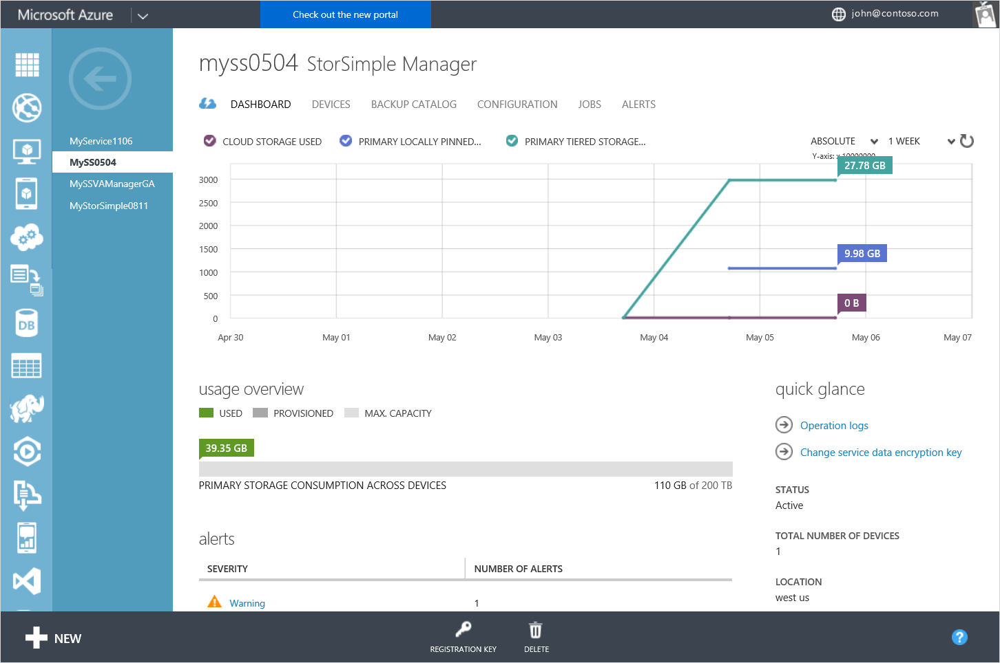

<properties
   pageTitle="StorSimple Manager-Dienst Dashboard | Microsoft Azure"
   description="Beschreibt das StorSimple Manager-Dashboard Dienst und erläutert, wie Sie es verwenden, um die Integrität Ihrer Lösung StorSimple zu überwachen."
   services="storsimple"
   documentationCenter=""
   authors="SharS"
   manager="carmonm"
   editor="" />
<tags
   ms.service="storsimple"
   ms.devlang="na"
   ms.topic="article"
   ms.tgt_pltfrm="na"
   ms.workload="na"
   ms.date="05/24/2016"
   ms.author="v-sharos" />

# Verwenden Sie das StorSimple Manager Service-dashboard

## (Übersicht)

Dashboardseite der StorSimple Manager-Dienst bietet einen Überblick über alle Geräte, die an den StorSimple-Manager-Dienst, Hervorhebung, die ein Systemadministrator Aufmerksamkeit verbunden sind. In diesem Lernprogramm eine Einführung in die Dashboard-Seite, die Dashboard-Inhalte und die Funktion, sowie beschreibt die Aufgaben, die Sie von dieser Seite ausführen können.

Das StorSimple Manager-Dashboard Dienst zeigt die folgenden Informationen:

- Klicken Sie im Bereich **Diagramm** können Sie das Diagramm relevante Kennzahlen für Ihre Geräte sehen. Sie können den primären Speicher (lokal angehefteten und gestuft) anzeigen, alle Geräte sowie die Cloud-Speicher von Geräten über einen Zeitraum verbraucht verwendet wird. Verwenden Sie die Steuerelemente in der oberen rechten Ecke des Diagramms, um eine 1 Woche, 1 Monat, 3-Monat oder 1 Jahr Zeitskala anzugeben.

- **Übersicht über die Verwendung** der zeigt den primären Speicher, der bereitgestellt und von den Geräten relativ zu den verfügbaren Gesamtspeicher auf allen Geräten. **Bereitgestellt** bezieht sich auf der Speichermenge, die vorbereitet und für die Verwendung vorgesehen sind, während **zur Verwendung** auf Verwendung der Datenmengen bezieht, wie Sie durch die Initiatoren angezeigt, die mit den Geräten verbunden sind.

- Im Bereich **Benachrichtigungen** bietet eine Momentaufnahme der aktiven Warnungen auf allen Geräten, gruppiert nach Schwere benachrichtigen. Auf der Ebene schwere öffnet die **Benachrichtigungen** -Seite, die zum Anzeigen dieser Benachrichtigungen ausgelegte. Klicken Sie auf der Seite **Benachrichtigungen** können Sie eine einzelne Benachrichtigung zum Anzeigen von Details über die Benachrichtigung, einschließlich aller empfohlenen Aktionen klicken. Sie können auch die Benachrichtigung deaktivieren, wenn dieses Problem behoben wurde.

- " **Projekte** " bietet eine Momentaufnahme der zuletzt verwendete Aufträge auf allen Geräten, die mit Ihrem Dienst verbunden sind. Es gibt Links, die Sie verwenden können, um Einzelvorgänge anzuzeigen, die derzeit in den Fortschritt, diejenigen, die nicht in den letzten 24 Stunden oder diejenigen, die zum Ausführen in den nächsten 24 Stunden geplant sind.

- Der Bereich **schnelleinsicht** bietet eine nützlichen Informationen wie Dienststatus Anzahl von verbundenen Geräten an den Dienst, den Speicherort des Diensts und Details des Abonnements, die mit dem Dienst verknüpft ist. Es gibt auch eine Verknüpfung mit der Log Vorgänge. Klicken Sie auf den Link, um eine Liste aller abgeschlossenen StorSimple Manager Service Vorgänge anzuzeigen.

Die Dashboardseite StorSimple Manager können die folgenden Aufgaben einleiten:

- Anzeigen oder der Dienst Registrierungsschlüssel neu zu generieren.
- Ändern der Schlüssel Dienst Daten an.
- Zeigen Sie die Protokolle der Vorgang an.

## Zeigen Sie an oder neu generieren Sie der Dienst Registrierungsschlüssel

Der Dienst Registrierungsschlüssel wird verwendet, zu einem Microsoft Azure StorSimple Gerät mit dem Dienst StorSimple Manager registrieren, sodass das Gerät im klassischen Azure-Portal für weitere Management-Aktionen angezeigt wird. Die Taste auf dem ersten Gerät erstellt und für die restlichen Ihrer Geräte freigegeben.

**Registrierungsschlüssel** (am unteren Rand der Seite) auf Öffnet das Dialogfeld **Dienst Registrierungsschlüssel** an, wo können Sie der aktuellen Dienst Registrierungsschlüssel in die Zwischenablage kopieren oder der Dienst Registrierungsschlüssel neu zu generieren.

Erneutes Generieren des Schlüssels wirkt sich nicht auf zuvor registrierte Geräte: Es wirkt sich auf nur die Geräte, die mit dem Dienst registriert sind, nachdem die Taste neu generiert wird.

Informationen zum Anzeigen und der Dienst Registrierungsschlüssel generieren wechseln Sie zum [Abrufen der Dienst-Registrierungsschlüssel](storsimple-manage-service.md#get-the-service-registration-key).

## Ändern Sie den Dienst Daten Verschlüsselungsschlüssel

Service-Schlüssel für die Verschlüsselung der Daten verwendeten vertrauliche Kundendaten, wie z. B. Speicher Anmeldeinformationen, verschlüsseln, die mit dem Gerät StorSimple aus dem StorSimple-Manager-Dienst gesendet werden. Sie benötigen diese Schlüssel regelmäßig zu ändern, wenn Ihre IT-Abteilung eine Richtlinie Key Drehung auf Speichergeräten verfügt. Der Schlüssel Änderungsprozess kann sein weicht je nachdem, ob es wird eine einzelne oder mehrere Geräte vom StorSimple-Manager-Dienst verwaltet.

Änderung der Dienst Daten Verschlüsselungsschlüssels umfasst – Schritt 3:

1. Verwenden des klassischen Azure-Portals an, zu autorisieren ein Gerät zum Ändern des Verschlüsselungsschlüssels für Dienst Daten.
2. Mithilfe von Windows PowerShell für StorSimple Initiieren der Dienst Daten Verschlüsselung Key ändern.
3. Wenn Sie mehr als ein StorSimple Gerät haben, aktualisieren Sie die Schlüssel Dienst Daten auf anderen Geräten.

Die folgenden Schritte beschreiben den Rollover-Prozess für den Dienst Daten Verschlüsselungsschlüssel.

[AZURE.INCLUDE [storsimple-change-data-encryption-key](../../includes/storsimple-change-data-encryption-key.md)]

## Die Protokolle der Vorgänge anzeigen

Sie können die Protokolle der Vorgang anzeigen, indem Sie auf den Vorgang Protokolle Link im Bereich **schnelleinsicht** des Dashboards verfügbar. Dadurch gelangen Sie zum die Seite Management Services, in dem Sie filtern können, und sehen die Protokolle, die bestimmte an den StorSimple-Manager-Dienst.

## Nächste Schritte

- Informationen zum [Behandeln von Problemen mit einem Gerät StorSimple](storsimple-troubleshoot-operational-device.md).

- Weitere Informationen zum [Verwenden der StorSimple-Manager-Dienst auf Ihrem Gerät StorSimple verwalten](storsimple-manager-service-administration.md).
