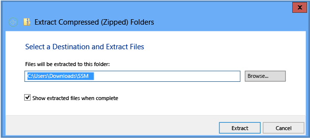
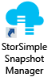
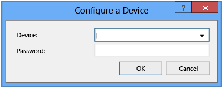
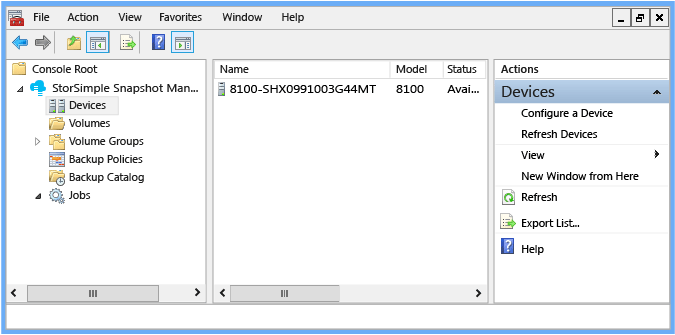
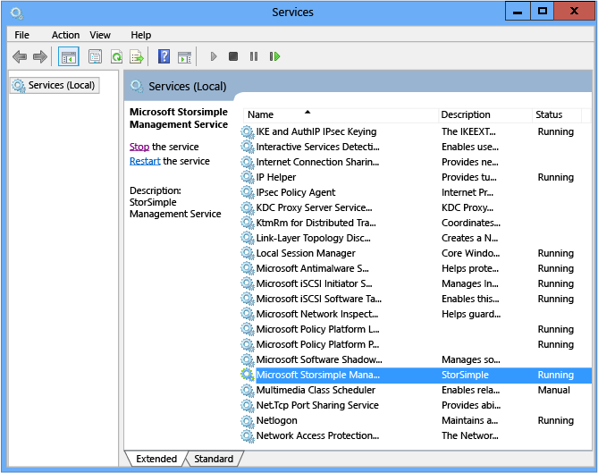
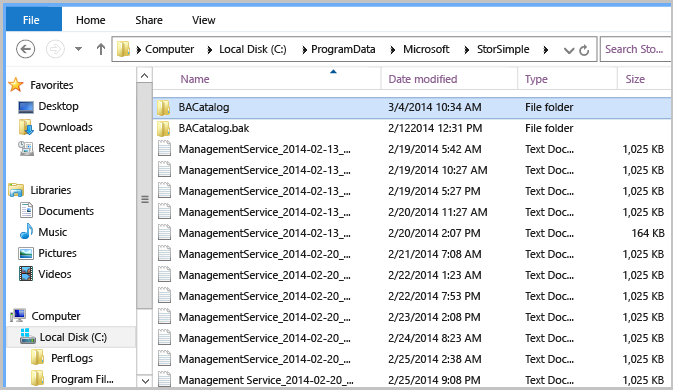

<properties 
   pageTitle="Bereitstellen von StorSimple Snapshot-Manager | Microsoft Azure"
   description="Informationen Sie zum Herunterladen und Installieren der StorSimple Snapshot-Manager, ein MMC-Snap-in für die Verwaltung von StorSimple Data Schutz und Sicherung-Features."
   services="storsimple"
   documentationCenter="NA"
   authors="SharS"
   manager="carmonm"
   editor="" />
<tags 
   ms.service="storsimple"
   ms.devlang="NA"
   ms.topic="article"
   ms.tgt_pltfrm="NA"
   ms.workload="TBD"
   ms.date="05/24/2016"
   ms.author="v-sharos" />

# Bereitstellen von StorSimple Snapshot-Manager MMC-Snap-in

## (Übersicht)

Den StorSimple Snapshot-Manager ist ein Microsoft Management Console (MMC)-Snap-in, das Datenschutz und zusätzliche Management in einer Umgebung mit Microsoft Azure StorSimple vereinfacht. Mit StorSimple Snapshot-Manager können Sie Microsoft Azure StorSimple lokalen verwalten und cloud-Speicherung als wäre sie ein vollständig integrierte Speichersystem, daher sichern und Wiederherstellen Prozesse vereinfachen und Kosten verringern. 

In diesem Lernprogramm werden Konfiguration Anforderungen sowie Verfahren zum Installieren, entfernen und aktualisieren StorSimple Snapshot-Manager.

>[AZURE.NOTE] 
>
>- StorSimple Snapshot-Manager können Sie Microsoft Azure StorSimple virtuelle Arrays verwalten (auch bekannt als lokalen StorSimple virtuelle Geräte).
>
>- Wenn Sie beabsichtigen, StorSimple Update 2 auf Ihrem Gerät StorSimple installiert haben, achten Sie darauf, dass Sie die neueste Version von StorSimple Snapshot-Manager herunterladen und installieren, **bevor Sie StorSimple Update 2 installiert**. Die neueste Version von StorSimple Snapshot-Manager ist abwärtskompatibel und funktioniert mit alle veröffentlichten Versionen von Microsoft Azure StorSimple. Wenn Sie die vorherige Version des StorSimple Snapshot-Manager verwenden, müssen Sie es aktualisieren (Sie müssen nicht die vorherige Version deinstallieren, bevor Sie die neue Version installiert haben).

## StorSimple Snapshot-Manager-installation

StorSimple Snapshot-Manager können auf Computern installiert werden, die das Windows Server 2008 R2 SP1, Windows Server 2012 oder Betriebssystem Windows Server 2012 R2 ausgeführt werden. Auf Servern Windows 2008 R2 ausführen müssen Sie auch Windows Server 2008 SP1 und Windows Management Framework 3.0 installieren. 

Bevor Sie installieren oder aktualisieren das StorSimple Snapshot-Manager-Snap-in für Microsoft Management Console (MMC), stellen Sie sicher, dass der Microsoft Azure StorSimple Gerät und Host Server ordnungsgemäß konfiguriert sind. 

## Konfigurieren Sie erforderliche Komponenten

Die folgenden Schritte bieten einem detaillierten Überblick über Aufgaben, die Sie ausführen müssen, bevor Sie den StorSimple Snapshot-Manager installieren. Vollständige Microsoft Azure StorSimple Konfiguration und Setupinformationen, einschließlich der systemvoraussetzungen und schrittweise Anweisungen finden Sie unter [Bereitstellen von Ihrem lokalen StorSimple Gerät](storsimple-deployment-walkthrough.md).

>[AZURE.IMPORTANT]Bevor Sie beginnen, überprüfen Sie die [Konfiguration der Bereitstellung – Checkliste](storsimple-deployment-walkthrough.md#deployment-configuration-checklist) und und [Voraussetzungen für die Bereitstellung](storsimple-deployment-walkthrough.md#deployment-prerequisites) in [Bereitstellen von Ihrem lokalen StorSimple Gerät](storsimple-deployment-walkthrough.md).
>  
 
### Vor der Installation von StorSimple Snapshot-Manager

1. Entpacken Sie, Bereitstellen Sie, und schließen Sie das Microsoft Azure StorSimple Gerät aus, wie in [Ihrem Gerät StorSimple 8100](storsimple-8100-hardware-installation.md) [Installieren](storsimple-8600-hardware-installation.md)oder Ihrem Gerät StorSimple 8600 beschrieben.

2. Stellen Sie sicher, dass Ihr Hostcomputer eine der folgenden Betriebssysteme ausgeführt wird:

    - Windows Server 2008 R2 (auf Servern Windows 2008 R2 ausführen, müssen Sie auch Windows Server 2008 SP1 und Windows Management Framework 3.0 installieren)
    - WindowsServer 2012
    - Windows Server 2012 R2
 
    Für ein StorSimple virtuelles Gerät muss der Host eines Microsoft Azure-virtuellen Computern aus. 

3. Stellen Sie sicher, dass Sie Microsoft Azure StorSimple Konfiguration entsprechen. Details finden Sie unter [Voraussetzungen für die Bereitstellung](storsimple-deployment-walkthrough.md#deployment-prerequisites).

4. Schließen Sie das Gerät an den Host, und führen Sie die ursprüngliche Konfiguration. Details finden Sie unter [vor der Bereitstellung](storsimple-deployment-walkthrough.md#deployment-steps).

5. Erstellen Sie auf dem Gerät Datenmengen, Zuordnen von Personen zu dem Host und stellen Sie sicher, dass der Host bereitstellen und diese verwenden kann. StorSimple Snapshot-Manager unterstützt die folgenden Arten von Datenmengen: 

    - Grundlegende Datenmengen
    - Einfache Datenträger
    - Dynamische Datenträger
    - Gespiegeltes dynamische Datenträger (RAID 1)
    - Datenmengen Cluster freigegeben
 
    Informationen zum Erstellen von Datenmengen auf dem Gerät StorSimple oder StorSimple virtuelles Gerät, wechseln Sie zu [Schritt 6: Erstellen Sie einen Datenträger](storsimple-deployment-walkthrough.md#step-6-create-a-volume), in [Bereitstellen von Ihrem lokalen StorSimple Gerät](storsimple-deployment-walkthrough.md).

## Installieren Sie einen neuen StorSimple Snapshot-Manager

Stellen Sie vor der Neuinstallation StorSimple Snapshot-Manager sicher, dass die Datenmengen erstellt auf dem Gerät StorSimple oder StorSimple – virtuelles Gerät bereitgestellt, Initialisierung und in [Konfigurieren erforderliche Komponenten](#configure-prerequisites)beschriebenen formatiert sind.

>[AZURE.IMPORTANT]
>
>- Für ein StorSimple virtuelles Gerät muss der Host eines Microsoft Azure-virtuellen Computern aus. 
>
>- Der Host muss Windows 2008 R2, Windows Server 2012 oder Windows Server 2012 R2 ausgeführt werden. Wenn der Server Windows Server 2008 R2 ausgeführt wird, müssen Sie auch Windows Server 2008 SP1 und Windows Management Framework 3.0 installieren.
>
>- Sie müssen eine iSCSI-Verbindung vom Host auf dem Gerät StorSimple konfigurieren, bevor Sie das Gerät zu StorSimple Snapshot-Manager herstellen können.

Wie folgt vor, um eine Neuinstallation von StorSimple Snapshot Manager abzuschließen. Wenn Sie ein Upgrade installieren, wechseln Sie zu [Aktualisieren oder installieren StorSimple Snapshot-Manager](#upgrade-or-reinstall-storsimple-snapshot-manager).

- Schritt 1: Installieren Sie StorSimple Snapshot-Manager 
- Schritt 2: StorSimple Snapshot-Manager Herstellen einer Verbindung mit einem Gerät 
- Schritt 3: Überprüfen der Verbindungs mit dem Gerät 

###Schritt 1: Installieren Sie StorSimple Snapshot-Manager

Gehen Sie folgendermaßen vor, um StorSimple Snapshot-Manager zu installieren.

#### So installieren Sie StorSimple Snapshot-Manager

1. Herunterladen die Software StorSimple Snapshot-Manager (klicken Sie auf [StorSimple Snapshot-Manager](https://www.microsoft.com/download/details.aspx?id=44220) im Microsoft Download Center) und auf dem Host lokal speichern.

2. Klicken Sie im Datei-Explorer mit der rechten Maustaste in des komprimierten Ordners, und klicken Sie dann auf **Alle extrahieren**.

3. Geben Sie im Fenster im Feld **Wählen Sie ein Ziel und Extrahieren von Dateien** **(ZIP) Ordner extrahieren** oder Durchsuchen Sie den Pfad, in dem Sie extrahiert werden ablegen möchten. 

       >[AZURE.IMPORTANT] Sie müssen StorSimple Snapshot-Manager auf Laufwerk C: installieren.
 
4. Aktivieren Sie das Kontrollkästchen **Anzeigen extrahierte Dateien, wenn Sie fertig sind** , und klicken Sie dann auf **extrahieren**.

     

4. Wenn die Extraktion abgeschlossen ist, wird der Zielordner geöffnet. Doppelklicken Sie auf das Symbol der Anwendung einrichten, das im Zielordner angezeigt wird.

5. Wenn die Meldung zur **Erfolgreichen Setup** angezeigt wird, klicken Sie auf **Schließen**. Es sollte das Symbol StorSimple Snapshot-Manager auf dem Desktop angezeigt.

     

### Schritt 2: StorSimple Snapshot-Manager Herstellen einer Verbindung mit einem Gerät

Gehen Sie folgendermaßen vor, um Verbindung mit einem Gerät StorSimple StorSimple Snapshot-Manager.

#### In Verbindung mit einem Gerät StorSimple Snapshot-Manager

1. Klicken Sie auf das Symbol StorSimple Snapshot-Manager auf dem Desktop. Das Fenster StorSimple Snapshot-Manager wird angezeigt. Das Fenster enthält einen **Bereich** Bereich, klicken Sie im Bereich **Ergebnisse** , und klicken Sie im Bereich **Aktionen** . 

     

    - **Bereichs-(im linken Bereich)** enthält eine Liste der Knoten in einer Baumstruktur angeordnet. Sie können einige Knoten zum Auswählen einer Ansicht oder bestimmte Daten in Bezug auf diesen Knoten erweitern. Klicken Sie auf das Pfeilsymbol zum Erweitern oder Reduzieren eines Knotens. Mit der rechten Maustaste eines Elements klicken Sie im **Bereich** um eine Liste mit verfügbaren Aktionen für dieses Element anzuzeigen. 

    - Im **Ergebnisbereich** (mittleren Bereich) enthält ausführliche Statusinformationen über die Knoten, die Ansicht oder die Daten, die Sie im **Bereich** ausgewählt haben.

    - Im Bereich **Aktionen** werden die Vorgänge, die Sie ausführen können, klicken Sie auf den Knoten, anzeigen oder Daten, die Sie im **Bereich** ausgewählt haben.

    Eine vollständige Beschreibung der Benutzeroberfläche StorSimple Snapshot-Manager finden Sie unter [Benutzeroberfläche StorSimple Snapshot-Manager](storsimple-use-snapshot-manager.md).

2. Klicken Sie im **Bereich** mit der rechten Maustaste in des Knotens **Geräte** , und klicken Sie dann auf **Gerät konfigurieren**. Klicken Sie im Dialogfeld **konfigurieren ein Gerät** wird angezeigt.

     

3. Wählen Sie im Listenfeld **Gerät** die IP-Adresse des Geräts mit Microsoft Azure StorSimple oder virtuelles Gerät aus. Geben Sie im Textfeld **Kennwort** das Kennwort StorSimple Snapshot-Manager, das Sie für das Gerät in der klassischen Azure-Portal erstellt. Klicken Sie auf **OK**.

4. StorSimple Snapshot-Manager durchsucht für das Gerät, das Sie identifiziert. Wenn das Gerät verfügbar ist, fügt StorSimple Snapshot-Manager eine Verbindung aus. Sie können [die Verbindung mit dem Gerät überprüfen](#to-verify-the-connection) , um zu bestätigen, dass die Verbindung erfolgreich hinzugefügt wurde.

    Wenn das Gerät aus irgendeinem Grund nicht verfügbar ist, gibt StorSimple Snapshot-Manager eine Fehlermeldung angezeigt. Klicken Sie auf **OK** , um die Fehlermeldung zu schließen, und klicken Sie dann auf **Abbrechen** , um das Dialogfeld **konfigurieren ein Gerät** schließen.

5. Beim Herstellen einer mit einem Gerät Verbindung, importiert StorSimple Snapshot-Manager jedes Volume-Gruppe, die so konfiguriert, dass für dieses Gerät, vorausgesetzt, dass die Lautstärke Gruppe Sicherungskopien verknüpft ist. Volumegruppen, die nicht zugeordnete Sicherungskopien verfügen, werden nicht importiert. Darüber hinaus werden zusätzliche Richtlinien, die für eine Gruppe Lautstärke erstellt wurden nicht importiert. Zum Anzeigen der importierten Gruppen mit der rechten Maustaste in des Knotens oberste **Volume-Gruppen** , klicken Sie im **Bereich** , und klicken Sie auf **den Schalter importiert Gruppen**.

### Schritt 3: Überprüfen der Verbindungs mit dem Gerät

Gehen Sie folgendermaßen vor, um sicherzustellen, dass das Gerät StorSimple StorSimple Snapshot Manager verbunden ist.

#### So überprüfen die Verbindung

1. Klicken Sie auf den **Geräte** -Knoten, klicken Sie im **Bereich** .

     

2. Überprüfen Sie im **Ergebnisbereich** an: 

   - Wenn ein grüner Indikator angezeigt, klicken Sie auf das Gerätesymbol wird und **verfügbar** , die in der Spalte **Status** angezeigt wird, ist das Gerät verbunden. 

   - Wenn ein roter Indikator angezeigt, klicken Sie auf das Gerätesymbol wird und nicht verfügbar, die in der Spalte **Status** angezeigt wird, ist das Gerät nicht verbunden. 

   - Wenn in der Spalte **Status** **Aktualisieren** angezeigt wird, ist die StorSimple Snapshot-Manager Volume-Gruppen und die zugehörigen Sicherungskopien für ein verbundenes Gerät abrufen.

## Aktualisieren Sie oder erneut installieren Sie StorSimple Snapshot-Manager

Sie sollten StorSimple Snapshot-Manager vollständig deinstallieren, bevor Sie aktualisieren oder die Software installieren. 

Vor der Neuinstallation StorSimple Snapshot-Manager, können Sie die vorhandenen StorSimple Snapshot-Manager-Datenbank sichern Sie, auf dem Host. Dies speichert die Informationen zur Sicherung Richtlinien und Konfiguration, sodass Sie einfach diese Daten aus einer Sicherung wiederherstellen können.

Gehen Sie folgendermaßen vor, wenn Sie aktualisieren oder StorSimple Snapshot-Manager erneut:

- Schritt 1: Deinstallieren Sie StorSimple Snapshot-Manager 
- Schritt 2: Sichern der Datenbank StorSimple Snapshot-Manager 
- Schritt 3: Installieren StorSimple Snapshot-Manager und Wiederherstellen der Datenbank 

### Schritt 1: Deinstallieren Sie StorSimple Snapshot-Manager

Gehen Sie folgendermaßen vor, StorSimple Snapshot-Manager deinstallieren können.

#### So deinstallieren Sie StorSimple Snapshot-Manager

1. Öffnen Sie die **Systemsteuerung**auf dem Host-Computer, klicken Sie auf **Programme**, und klicken Sie dann auf **Programme und Funktionen**.

2. Klicken Sie im linken Bereich auf **Deinstallieren oder Ändern eines Programms**.

3. Mit der rechten Maustaste **StorSimple Snapshot-Manager**, und klicken Sie dann auf **Deinstallieren**.

4. Hierdurch wird das Installationsprogramm von StorSimple Snapshot-Manager. Klicken Sie auf **Setup ändern**, und klicken Sie dann auf **Deinstallieren**.

    >[AZURE.NOTE] Wenn es MMC Prozesse im Hintergrund ausgeführt, z. B. StorSimple Snapshot-Manager oder Datenträger Verwaltung, die Deinstallation fehl, und erhalten Sie eine Nachricht ein, schließen Sie alle Instanzen von MMC aus, bevor Sie versuchen, das Programm deinstallieren. Wählen Sie **Applikationen automatisch geschlossen, und versuchen, diese nach Abschluss der Installation zu starten**, und klicken Sie dann auf **OK**.
 
5. Wenn die Deinstallation abgeschlossen ist, wird eine Meldung zur **Erfolgreichen einrichten** angezeigt. Klicken Sie auf **Schließen**.

### Schritt 2: Sichern der Datenbank StorSimple Snapshot-Manager

Gehen Sie folgendermaßen vor, um zu erstellen und Speichern einer Kopie der Datenbank StorSimple Snapshot-Manager.

#### Sichern der Datenbank

1. Beenden Sie den Microsoft StorSimple-Verwaltungsdienst an:

   1. Server-Manager zu starten.

   2. Wählen Sie auf dem Server-Manager-Dashboard, klicken Sie im Menü **Extras** auf **Dienste**.

   3. Wählen Sie auf der Seite **Dienste** **Microsoft StorSimple-Verwaltungsdienst**ein.

   4. Klicken Sie im rechten Bereich unter **Microsoft StorSimple-Verwaltungsdienst**auf **Beenden Sie den Dienst**.

        

2. Navigieren Sie zu C:\ProgramData\Microsoft\StorSimple\BACatalog. 

    >[AZURE.NOTE] Ordner "ProgramData" ist ein versteckter Ordner.

3. Suchen Sie die Katalog-XML-Datei zu, kopieren Sie die Datei, und speichern Sie die Kopie an einem sicheren Ort oder in der Cloud zu.

    

4. Starten Sie den Microsoft StorSimple Management-Dienst: 

    1. Wählen Sie auf dem Server-Manager-Dashboard, klicken Sie im Menü **Extras** auf **Dienste**.

    2. Wählen Sie auf der Seite **Dienste** das **Microsoft StorSimple Management Internetdienst**e.

    3. Klicken Sie im rechten Bereich unter **Microsoft StorSimple-Verwaltungsdienst**auf **Starten Sie den Dienst**. 

### Schritt 3: Installieren StorSimple Snapshot-Manager und Wiederherstellen der Datenbank

Folgen Sie den Schritten [Installieren Sie einen neuen StorSimple Snapshot-Manager](#install-a-new-storsimple-snapshot-manager), um StorSimple Snapshot-Manager erneut zu installieren. Klicken Sie dann verwenden Sie das folgende Verfahren, um die StorSimple Snapshot-Manager-Datenbank wiederherzustellen.

#### Wiederherstellen die Datenbank

1. Beenden Sie den Microsoft StorSimple-Verwaltungsdienst an:

    1. Server-Manager zu starten.

    2. Wählen Sie auf dem Server-Manager-Dashboard, klicken Sie im Menü **Extras** auf **Dienste**.

    3. Wählen Sie auf der Seite **Dienste** **Microsoft StorSimple-Verwaltungsdienst**ein.

    4. Klicken Sie im rechten Bereich unter **Microsoft StorSimple-Verwaltungsdienst**auf **Beenden Sie den Dienst**.

2. Navigieren Sie zu C:\ProgramData\Microsoft\StorSimple\BACatalog. 

     >[AZURE.NOTE] Ordner "ProgramData" ist ein versteckter Ordner.

3. Löschen der Katalog-XML-Datei, und Ersetzen Sie ihn durch die Version, die Sie zuvor gespeichert haben.

4. Starten Sie den Microsoft StorSimple Management-Dienst: 

    1. Wählen Sie auf dem Server-Manager-Dashboard, klicken Sie im Menü **Extras** auf **Dienste**.

    2. Wählen Sie auf der Seite **Dienste** **Microsoft StorSimple-Verwaltungsdienst**ein.

    3. Klicken Sie im rechten Bereich unter **Microsoft StorSimple-Verwaltungsdienst**auf **Starten Sie den Dienst**.

## Nächste Schritte

- Erfahren Sie mehr über StorSimple Snapshot-Manager, wechseln Sie zu [Neuigkeiten StorSimple Snapshot-Manager?](storsimple-what-is-snapshot-manager.md).

- Erfahren Sie mehr über die Benutzeroberfläche StorSimple Snapshot-Manager, wechseln Sie zu [StorSimple Snapshot-Manager-Benutzeroberfläche](storsimple-use-snapshot-manager.md).

- Wechseln Sie zu [StorSimple-Snapshot-Manager die Lösung StorSimple verwalten](storsimple-snapshot-manager-admin.md), um weitere Informationen zur Verwendung von StorSimple Snapshot-Manager.
