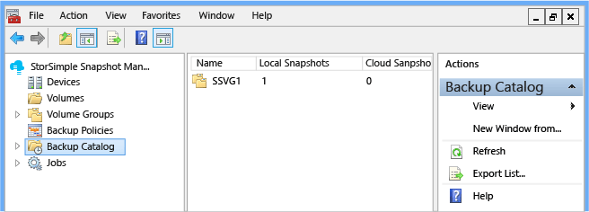
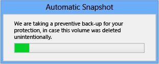
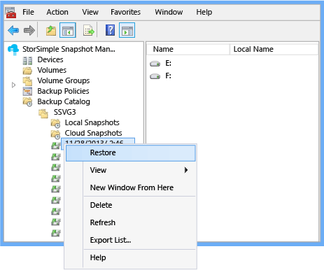
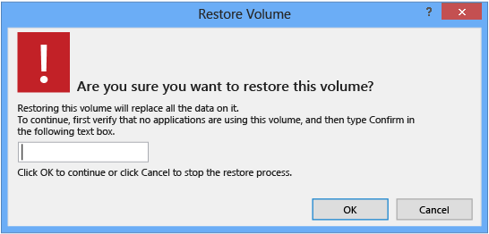
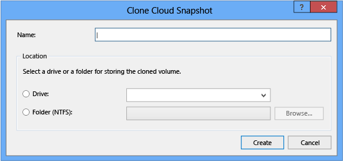

<properties 
   pageTitle="StorSimple Snapshot-Manager Sicherung Katalog | Microsoft Azure"
   description="Beschreibt, wie das StorSimple Snapshot-Manager MMC-Snap-in zum Anzeigen und Verwalten des Sicherungsdatei Katalogs verwenden."
   services="storsimple"
   documentationCenter="NA"
   authors="SharS"
   manager="carmonm"
   editor="" />
<tags 
   ms.service="storsimple"
   ms.devlang="NA"
   ms.topic="article"
   ms.tgt_pltfrm="NA"
   ms.workload="TBD"
   ms.date="04/26/2016"
   ms.author="v-sharos" />

# Verwenden des StorSimple Snapshot-Managers zum Verwalten des Sicherungsdatei Katalogs

## (Übersicht)

Die primäre Funktion von StorSimple Snapshot-Manager besteht darin, Anwendung konsistent Sicherungskopien der StorSimple Datenmengen in Form von Momentaufnahmen erstellen können. Momentaufnahmen werden dann in eine XML-Datei mit dem Namen *Sicherung Katalog*aufgeführt. Der Sicherung Katalog organisiert Momentaufnahmen nach Volume-Gruppe und dann nach lokalen Snapshot oder eine Momentaufnahme der Cloud. 

In diesem Lernprogramm beschrieben, wie Sie den **Katalog Sicherung** Knoten verwenden können, die folgenden Aufgaben ausführen:

- Wiederherstellen eines Datenträgers 
- Duplizieren eines Volumen oder Volume-Gruppe 
- Löschen einer Sicherung 
- Wiederherstellen einer Datei
- Wiederherstellen der Storsimple Snapshot-Manager-Datenbank

Sie können den Sicherung Katalog durch die **Sicherungskatalog** Knoten klicken Sie im **Bereich** erweitern und erweitern dann die Volume-Gruppe anzeigen.

- Wenn Sie den Lautstärke Gruppennamen klicken, zeigt im **Ergebnisbereich** die Anzahl der lokalen Momentaufnahmen und Cloud Momentaufnahmen für die Lautstärke Gruppe zur Verfügung. 

- Wenn Sie **Lokale Snapshot** oder eine **Momentaufnahme der Cloud**, klicken Sie auf im **Ergebnisbereich** zeigt die folgende Informationen zu jeder Sicherung Snapshot (je nach Einstellungen für die **Ansicht** ): 

    - **Namen** – die Zeit, die die Momentaufnahme erstellt wurde. 

    - **Typ** –, ob es sich um eine lokale Momentaufnahme oder eine Momentaufnahme der Cloud handelt. 

    - **Besitzer** – der Besitzer des Inhalts. 

    - **Verfügbar** – gibt an, ob der Snapshot derzeit verfügbar ist. **True** gibt an, dass der Snapshot zur Verfügung steht und wiederhergestellt werden kann; **False** gibt an, dass der Snapshot nicht mehr verfügbar ist. 

    - **Importierte** – gibt an, ob die Sicherung importiert wurde. **True** gibt an, dass die Sicherung aus dem Dienst StorSimple Manager gleichzeitig importiert wurde, die das Gerät in StorSimple Snapshot-Manager konfiguriert wurde; **False** gibt an, dass es nicht importiert wurde, jedoch durch StorSimple Snapshot-Manager erstellt wurde. (Sie können ganz einfach eine importierten Datenträgergruppe identifizieren, weil ein Suffix hinzugefügt wird, dass ein Element aus der Volume-Gruppe importiert wurde, das Gerät identifiziert.)

    

- Wenn Sie **Lokale Snapshot** oder eine **Momentaufnahme der Cloud**zu erweitern, und klicken Sie dann auf einen Namen für die einzelnen Momentaufnahme, zeigt im **Ergebnisbereich** die folgende Informationen zu den Snapshot, den Sie ausgewählt haben:

    - **Namen** – die Lautstärke zeichenweise Laufwerk identifiziert. 

    - **Lokale Namen** – der lokale Name des Laufwerks (falls vorhanden). 

    - **Gerät** – den Namen des Geräts auf dem sich die Lautstärke befindet. 

    - **Verfügbar** – gibt an, ob der Snapshot derzeit verfügbar ist. **True** gibt an, dass der Snapshot zur Verfügung steht und wiederhergestellt werden kann; **False** gibt an, dass der Snapshot nicht mehr verfügbar ist. 

## Wiederherstellen eines Datenträgers

Gehen Sie folgendermaßen vor, um einen Datenträger aus einer Sicherung wiederherstellen.

#### Erforderliche Komponenten

Wenn Sie dies nicht bereits getan haben, erstellen Sie einen Volumen und Volume-Gruppe, und löschen Sie die Lautstärke. Standardmäßig sichert StorSimple Snapshot-Manager ein Volume vor zuzulassen, dass dieser gelöscht werden. Diese Vorsichtsmaßnahmen ergreifen kann Datenverlust verhindern, wenn die Lautstärke versehentlich gelöscht wird oder die Daten aus einem beliebigen Grund wiederhergestellt werden müssen. 

StorSimple Snapshot-Manager zeigt die folgende Meldung an, während sie die Vorsichtsmaßnahmen Sicherung erstellt.

 

>[AZURE.IMPORTANT]Ein Volume, das Bestandteil einer Volume-Gruppe ist, kann nicht gelöscht werden. Die Löschoption ist nicht verfügbar.  

#### Ein Volume wiederherstellen

1. Klicken Sie auf das Desktopsymbol um StorSimple Snapshot-Manager zu starten. 

2. Klicken Sie im **Bereich** erweitern Sie den Knoten **Sicherungskatalog** , erweitern Sie eine Volume-Gruppe zu, und klicken Sie dann auf **Lokale Momentaufnahmen** oder **Cloud Momentaufnahmen**. Im **Ergebnisbereich** wird eine Liste der Sicherungsdatei Momentaufnahmen angezeigt. 

3. Suchen Sie die Sicherung, die Sie wiederherstellen möchten, mit der rechten Maustaste, und klicken Sie dann auf **Wiederherstellen**. 

     

4. Klicken Sie auf der Bestätigungsseite prüfen Sie die Details, geben Sie **bestätigen**, und klicken Sie dann auf **OK**. StorSimple Snapshot-Manager verwendet die Sicherung, um die Lautstärke wiederherzustellen. 

     

5. Sie können des Wiederherstellungsvorgangs während der Ausführung überwachen. Klicken Sie im **Bereich** erweitern Sie den Knoten **Aufträge** , und klicken Sie dann auf **Ausführen**. Die Details werden im Bereich **Ergebnisse** angezeigt. Das Wiederherstellen-Projekt abgeschlossen ist, werden die Details zur Liste **letzten 24 Stunden** übertragen.

## Duplizieren eines Volumen oder Volume-Gruppe

Verwenden Sie das folgende Verfahren zum Erstellen eines Duplikats (klonen) ein Volume oder Volume-Gruppe ein.

#### Um ein Volume oder eine Gruppe von Lautstärke Klonen

1. Klicken Sie auf das Desktopsymbol um StorSimple Snapshot-Manager zu starten.

2. Klicken Sie im **Bereich** erweitern Sie den Knoten **Sicherungskatalog** , Erweitern einer Volume-Gruppe und klicken Sie dann auf **Cloud Momentaufnahmen**. Im **Ergebnisbereich** wird eine Liste der Sicherungskopien angezeigt.

3. Suchen Sie die Lautstärke oder Volume-Gruppe, die Sie verwenden möchten, Klonen, mit der rechten Maustaste die Lautstärke oder Volumen Gruppennamen und **Datenbeschriftungsreihe**auf. Das Dialogfeld **Klonen Cloud Snapshot** angezeigt wird.

     

4. Füllen Sie im Dialogfeld **Klonen Cloud Snapshot** wie folgt aus: 

    1. Geben Sie in das Textfeld **Name** einen Namen für den duplizierten Datenträger aus. Dieser Name wird in den Knoten **Datenmengen** angezeigt. 

    2. (Optional) wählen **Laufwerk**, und wählen Sie dann einen Laufwerkbuchstaben aus, in der Dropdown-Liste aus. 

    3. (Optional) Wählen Sie **Ordner (NTFS)**, und geben Sie einen Ordnerpfad ein oder klicken Sie auf Durchsuchen und wählen Sie einen Speicherort für den Ordner. 

    4. Klicken Sie auf **Erstellen**.

5. Wenn die Klonen abgeschlossen ist, müssen Sie die Lautstärke duplizierte Initialisierung. Starten Sie Server-Manager, und beginnen Sie Datenträger Verwaltung. Weitere Informationen finden Sie unter [Datenmengen bereitstellen](storsimple-snapshot-manager-manage-volumes.md#mount-volumes). Nach der Initialisierung, wird die Lautstärke unter dem Knoten **Datenmengen** , klicken Sie im **Bereich** aufgeführt. Wenn Sie die Lautstärke aufgeführt nicht angezeigt werden, aktualisieren Sie die Liste der Datenträger (mit der rechten Maustaste in des Knotens **Datenmengen** , und klicken Sie dann auf **Aktualisieren**).

## Löschen einer Sicherung

Verwenden Sie das folgende Verfahren, um eine Momentaufnahme aus dem Katalog Sicherung zu löschen. 

>[AZURE.NOTE]Löschen einer Momentaufnahme löscht die gesicherten Daten mit den Snapshot verknüpft ist. Die Vorgehensweise zum Bereinigen von Daten aus der Cloud kann jedoch einige Zeit dauern. 
 
#### So löschen Sie eine Sicherungskopie

1. Klicken Sie auf das Desktopsymbol um StorSimple Snapshot-Manager zu starten.

2. Klicken Sie im **Bereich** erweitern Sie den Knoten **Sicherungskatalog** , erweitern Sie eine Volume-Gruppe zu, und klicken Sie dann auf **Lokale Momentaufnahmen** oder **Cloud Momentaufnahmen**. Eine Liste von Momentaufnahmen konvertiert wird im **Ergebnisbereich** angezeigt. 

3. Mit der rechten Maustaste in des Snapshots, die, den Sie löschen möchten, und klicken Sie dann auf **Löschen**.

4. Wenn der bestätigungsmeldung angezeigt wird, klicken Sie auf **OK**. 

## Wiederherstellen einer Datei

Wenn Sie eine Datei aus einem Volume versehentlich gelöscht wird, können Sie die Datei wiederherstellen, indem eine Momentaufnahme, die den Löschvorgang vorab Daten abrufen, verwenden den Snapshot zum Erstellen eines datenbeschriftungsreihe des Datenträgers und klicken Sie dann die Datei aus der duplizierten Lautstärke auf die ursprüngliche Lautstärke kopieren.

#### Erforderliche Komponenten

Bevor Sie beginnen, stellen Sie sicher, dass Sie eine aktuelle Sicherung der Lautstärke Gruppe verfügen. Klicken Sie dann Löschen einer Datei auf einem Datenträger in dieser Volumegruppe gespeichert. Schließlich, gehen Sie folgendermaßen vor, um die gelöschte Datei aus der Sicherung wiederherstellen. 

#### Zum Wiederherstellen einer gelöschten Datei

1. Klicken Sie auf das Symbol StorSimple Snapshot-Manager auf dem Desktop. Das StorSimple Snapshot-Manager Console-Fenster wird angezeigt. 

2. Klicken Sie im **Bereich** erweitern Sie den Knoten **Sicherungskatalog** zu, und navigieren Sie zu einer Momentaufnahme, die die gelöschte Datei enthält. In der Regel, sollten Sie eine Momentaufnahme auswählen, die direkt vor der Löschung erstellt wurde. 

3. Suchen Sie die Lautstärke die gewünschten klonen, mit der rechten Maustaste, und klicken Sie auf **Datenbeschriftungsreihe**. Das Dialogfeld **Klonen Cloud Snapshot** angezeigt wird.

     

4. Füllen Sie im Dialogfeld **Klonen Cloud Snapshot** wie folgt aus: 

   1. Geben Sie in das Textfeld **Name** einen Namen für den duplizierten Datenträger aus. Dieser Name wird in den Knoten **Datenmengen** angezeigt. 

   2. (Optional) Wählen Sie **Laufwerk**, und wählen Sie dann einen Laufwerkbuchstaben aus, in der Dropdown-Liste aus. 

   3. (Optional) Wählen Sie **Ordner (NTFS)**, und geben Sie einen Ordnerpfad ein oder klicken Sie auf **Durchsuchen** , und wählen Sie einen Speicherort für den Ordner. 

   4. Klicken Sie auf **Erstellen**. 

5. Wenn die Klonen abgeschlossen ist, müssen Sie die Lautstärke duplizierte Initialisierung. Starten Sie Server-Manager, und beginnen Sie Datenträger Verwaltung. Weitere Informationen finden Sie unter [Datenmengen bereitstellen](storsimple-snapshot-manager-manage-volumes.md#mount-volumes). Nach der Initialisierung, wird die Lautstärke unter dem Knoten **Datenmengen** , klicken Sie im **Bereich** aufgeführt. 

    Wenn Sie die Lautstärke aufgeführt nicht angezeigt werden, aktualisieren Sie die Liste der Datenträger (mit der rechten Maustaste in des Knotens **Datenmengen** , und klicken Sie dann auf **Aktualisieren**).

6. Öffnen Sie den NTFS-Ordner mit dem duplizierten Datenträger, erweitern Sie den Knoten **Datenmengen** und öffnen Sie die duplizierte Lautstärke. Suchen Sie die Datei, die Sie wiederherstellen möchten, und kopieren Sie sie auf dem primären Laufwerk.

7. Nachdem Sie die Datei wiederherstellen möchten, können Sie NTFS-Ordner löschen, der den duplizierten Datenträger enthält.

## Wiederherstellen der StorSimple Snapshot-Manager-Datenbank

Sie sollten die StorSimple Snapshot-Manager-Datenbank regelmäßig auf dem Host sichern. Wenn bei Datenverlusten oder der Host-Computer aus irgendeinem Grund fehlschlägt, können Sie ihn aus der Sicherung wiederherstellen. Erstellen die Sicherungskopie der Datenbank ist ein manueller Prozess.

#### Sichern und Wiederherstellen der Datenbank

1. Beenden Sie den Microsoft StorSimple-Verwaltungsdienst an:

    1. Server-Manager zu starten.

    2. Wählen Sie auf dem Server-Manager-Dashboard, klicken Sie im Menü **Extras** auf **Dienste**.

    3. Wählen Sie im Fenster " **Dienstleistungen** " **Microsoft StorSimple-Verwaltungsdienst**ein.

    4. Klicken Sie im rechten Bereich unter **Microsoft StorSimple-Verwaltungsdienst**auf **Beenden Sie den Dienst**.

2. Navigieren Sie auf dem Host-Computer zu C:\ProgramData\Microsoft\StorSimple\BACatalog. 

    >[AZURE.NOTE] Ordner "ProgramData" ist ein versteckter Ordner.
 
3. Suchen Sie die Katalog-XML-Datei zu, kopieren Sie die Datei, und speichern Sie die Kopie an einem sicheren Ort oder in der Cloud zu. Wenn der Host fehlschlägt, können Sie diese Sicherungsdatei verwenden, helfen, die Richtlinien Sicherungsdatei wiederherstellen, die Sie in StorSimple Snapshot-Manager erstellt.

    

4. Starten Sie den Microsoft StorSimple Management-Dienst: 

    1. Wählen Sie auf dem Server-Manager-Dashboard, klicken Sie im Menü **Extras** auf **Dienste**.
    
    2. Wählen Sie im Fenster " **Dienstleistungen** " **Microsoft StorSimple-Verwaltungsdienst**ein.

    3. Klicken Sie im rechten Bereich unter **Microsoft StorSimple-Verwaltungsdienst**auf **Starten Sie den Dienst**.

5. Navigieren Sie auf dem Host-Computer zu C:\ProgramData\Microsoft\StorSimple\BACatalog. 

6. Löschen der Katalog-XML-Datei, und Ersetzen Sie ihn durch die Sicherungskopie, die Sie erstellt haben. 

7. Klicken Sie auf das Desktopsymbol StorSimple Snapshot-Manager, um StorSimple Snapshot-Manager zu starten. 

## Nächste Schritte

- Weitere Informationen zum [Verwenden von StorSimple Snapshot-Manager zu Ihrer Lösung StorSimple verwalten](storsimple-snapshot-manager-admin.md).
- Weitere Informationen zu [StorSimple Snapshot-Manager Aufgaben und Workflows](storsimple-snapshot-manager-admin.md#storsimple-snapshot-manager-tasks-and-workflows).
