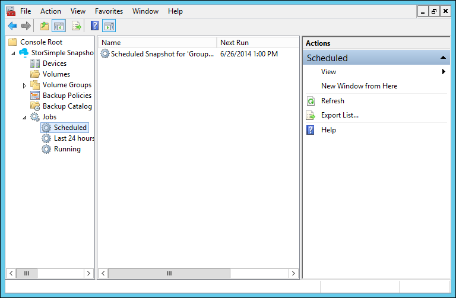
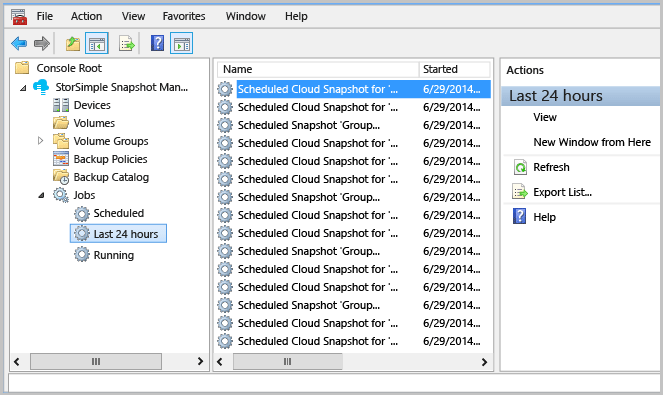
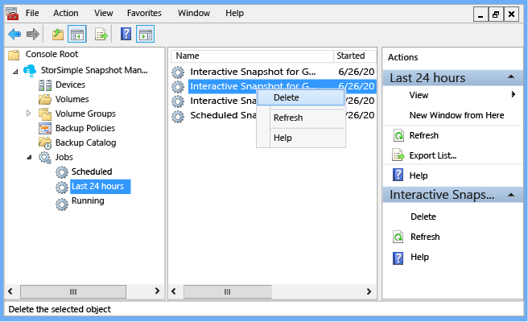
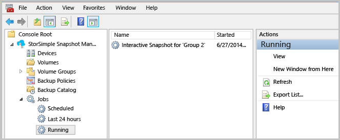

<properties 
   pageTitle="Zusätzliche Aufträge StorSimple Snapshot-Manager | Microsoft Azure"
   description="Beschreibt, wie das StorSimple Snapshot-Manager MMC-Snap-in zum Anzeigen und Verwalten von geplante, abgeschlossene und aktuell ausgeführte Sicherung Aufträge verwenden."
   services="storsimple"
   documentationCenter="NA"
   authors="SharS"
   manager="carmonm"
   editor="" />
<tags 
   ms.service="storsimple"
   ms.devlang="NA"
   ms.topic="article"
   ms.tgt_pltfrm="NA"
   ms.workload="TBD"
   ms.date="04/26/2016"
   ms.author="v-sharos" />

# Verwenden Sie zum Anzeigen und Verwalten von Sicherung Aufträge StorSimple Snapshot-Manager

## (Übersicht)

Der **Einzelvorgänge** Knoten klicken Sie im **Bereich** zeigt die **planmäßige**, **Letzte 24 Stunden**und **ausgeführt** , zusätzliche Aufgaben, die Sie interaktiv oder durch eine Richtlinie konfigurierten begonnen haben. 

In diesem Lernprogramm wird beschrieben, wie Sie den **Einzelvorgänge** Knoten zum Anzeigen von Informationen zu geplanten, aktuelle und aktuell ausgeführte Sicherung Aufträgen. (Die Liste der Aufträge sowie die entsprechenden Informationen wird im **Ergebnisbereich** angezeigt.) Darüber hinaus können Sie mit der rechten Maustaste in eines aufgelisteten Auftrags und anzeigen ein Kontextmenüs, in der verfügbare Aktionen aufgelistet.

## Anzeigen der geplanten Aufträge

Verwenden Sie das folgende Verfahren, um geplante Sicherung Aufträge anzuzeigen.

#### Anzeigen der geplanten Aufträge

1. Klicken Sie auf das Desktopsymbol um StorSimple Snapshot-Manager zu starten. 

2. Klicken Sie im **Bereich** erweitern Sie den Knoten **Aufträge** , und klicken Sie auf **geplant**. Die folgende Informationen, die im **Ergebnisbereich** angezeigt wird:

    - **Name** – den Namen der geplanten Momentaufnahme

    - **Führen Sie weiter** – Datum und Uhrzeit der nächsten geplanten Momentaufnahme

    - **Letzte ausführen** – Datum und Uhrzeit der letzten geplanten Momentaufnahme

    >[AZURE.NOTE] Für einmalige nur Momentaufnahmen wird der **Nächsten Ausführen** und **Letzten Ausführen** sein identisch. 
 
     
 
3. Um weitere Aktionen auf eine bestimmte Position durchzuführen, mit der rechten Maustaste in des Namens der Position im **Ergebnisbereich** , und wählen Sie aus den Menüoptionen im aus.

## Zuletzt verwendete Aufträge anzeigen

Gehen Sie folgendermaßen vor, um anzeigen sichern und Wiederherstellen von Projekte, die in den letzten 24 Stunden abgeschlossen wurden.

#### Zuletzt verwendete Aufträge anzeigen

1. Klicken Sie auf das Desktopsymbol um StorSimple Snapshot-Manager zu starten.

2. Klicken Sie im **Bereich** erweitern Sie den Knoten **Aufträge** , und klicken Sie auf die **Letzte 24 Stunden**. **Im Ergebnisbereich** werden zusätzliche Aufträge für den letzten 24 Stunden (bis zu 64 Aufträge). Im **Ergebnisbereich, je nach **der Ansichtsoptionen, die Sie angeben** ** , wird die folgende Informationen angezeigt:

    - **Name** – den Namen der geplanten Momentaufnahme.
 
    - **Schritte** – Datum und Uhrzeit, wann die Momentaufnahme begonnen hat.

    - **Weiterspielen** – Datum und Uhrzeit, wann die Momentaufnahme abgeschlossen oder beendet wurde.

    - Das Eineinhalbfache **Abgelaufene** – die Zeitdauer zwischen **Schritte** und **weiterspielen** .

    - **Status** – der Zustand des zuletzt abgeschlossenen Projekts. **Erfolg** gibt an, dass die Sicherung erfolgreich erstellt wurde. **Fehlgeschlagen** gibt an, dass der Auftrag nicht erfolgreich ausgeführt wurde.

    - **Informationen** – der Grund für den Fehler.

    - **Bytes verarbeitet (MB)** – die Menge der Daten aus der Volume-Gruppe, die (in MB) verarbeitet wurde. 

     

3. Um weitere Aktionen auf eine bestimmte Position durchzuführen, mit der rechten Maustaste in des Namens der Position im **Ergebnisbereich** , und wählen Sie aus den Menüoptionen im aus.

     
     
## Aktuell ausgeführte Aufträge anzeigen

Gehen Sie folgendermaßen vor um Einzelvorgänge anzeigen, die aktuell ausgeführt werden.

#### Aktuell ausgeführte Aufträge anzeigen

1. Klicken Sie auf das Desktopsymbol um StorSimple Snapshot-Manager zu starten.

2. Klicken Sie im **Bereich** erweitern Sie den Knoten **Aufträge** , und klicken Sie auf **Ausführen**. Je nach **der Ansichtsoptionen, die Sie angeben,** werden die folgenden Informationen im **Ergebnisbereich** angezeigt: 

    - **Name** – den Namen der geplanten Momentaufnahme.

    - **Schritte** – Datum und Uhrzeit, wann die Momentaufnahme begonnen hat.

    - **Wissensstand** – die aktuelle Aktion der Sicherung.

    - **Status** – den Prozentsatz der Fertigstellung.
    
    - **Abgelaufene** – die Zeitdauer verstrichen die Sicherung begonnen hat. 

    - **Durchschnittsdurchsatz (MB)** – Verhältnis zwischen der Gesamtzahl der Bytes von Daten mit dem der Gesamtzeit für die Verarbeitung (MB) verarbeitet.

    - **Bytes verarbeitet (MB)** – Gesamtzahl der Bytes von Daten bearbeitet werden (in MB).

    - **Bytes geschrieben (MB)** – Gesamtzahl der Bytes von Daten geschrieben (in MB). Es schließt die Daten als auch die Metadaten und daher normalerweise größer als die Bytes verarbeitet.

    

3. Um weitere Aktionen auf eine bestimmte Position durchzuführen, mit der rechten Maustaste in des Namens der Position im **Ergebnisbereich** , und wählen Sie aus den Menüoptionen im aus.

## Nächste Schritte

- Erfahren Sie, wie [StorSimple Snapshot-Manager verwalten Sie Ihre Lösung StorSimple verwendet](storsimple-snapshot-manager-admin.md).
- Erfahren Sie, wie Sie [mit dem StorSimple Snapshot-Manager zum Verwalten des Sicherungsdatei Katalogs](storsimple-snapshot-manager-manage-backup-catalog.md).

            

 

