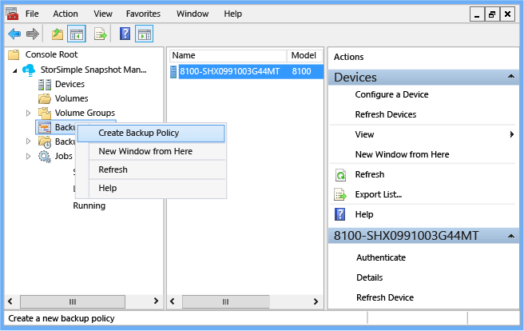
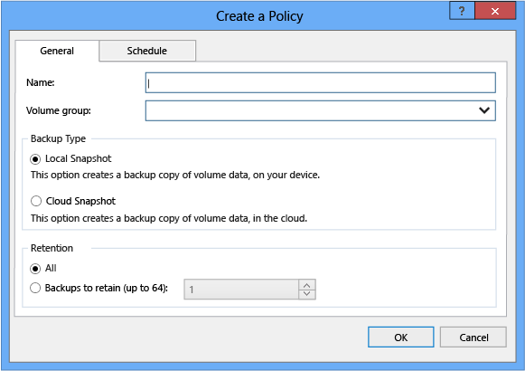
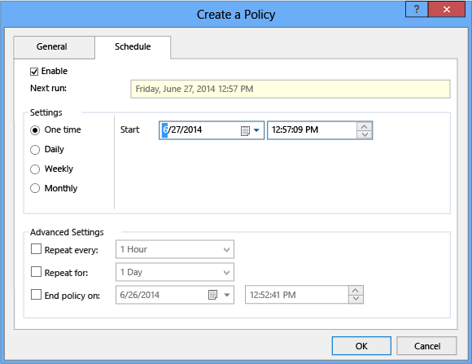
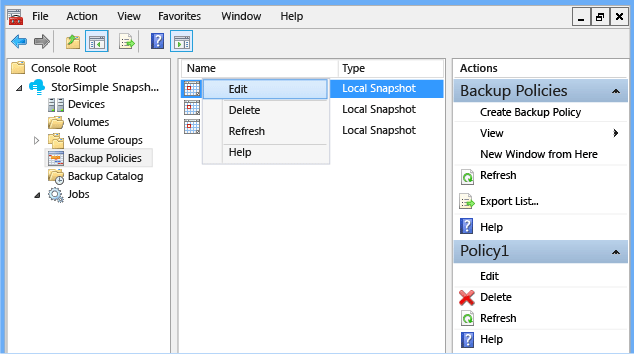
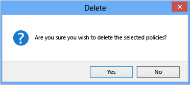

<properties 
   pageTitle="Zusätzliche StorSimple Snapshot-Manager-Richtlinien | Microsoft Azure"
   description="Beschreibt, wie das StorSimple Snapshot-Manager MMC-Snap-in zum Erstellen und verwalten die Sicherung Richtlinien, die geplante Sicherungskopien steuern verwenden."
   services="storsimple"
   documentationCenter="NA"
   authors="SharS"
   manager="carmonm"
   editor="" />
<tags 
   ms.service="storsimple"
   ms.devlang="NA"
   ms.topic="article"
   ms.tgt_pltfrm="NA"
   ms.workload="TBD"
   ms.date="05/12/2016"
   ms.author="v-sharos" />

# Verwenden Sie zum Erstellen und Verwalten von Sicherung Richtlinien StorSimple Snapshot-Manager

## (Übersicht)

Eine Sicherung Richtlinie erstellt einen Zeitplan für die Lautstärke Daten sichern, lokal oder in der Cloud. Wenn Sie eine zusätzliche Richtlinie erstellen, können Sie auch eine Aufbewahrungsrichtlinie angeben. (Sie können bis zu 64 Momentaufnahmen beibehalten.) Weitere Informationen zu Sicherung Richtlinien, finden Sie unter [Sicherung Typen](storsimple-what-is-snapshot-manager.md#backup-type) in [StorSimple 8000-Serie: einer Hybrid-Cloud-Lösung](storsimple-overview.md).

In diesem Lernprogramm wird erläutert, wie Sie:

- Erstellen einer Sicherungskopie Richtlinie 
- Bearbeiten einer Sicherung Richtlinie 
- Löschen einer Sicherung Richtlinie 

## Erstellen einer Sicherungskopie Richtlinie

Verwenden Sie das folgende Verfahren zum Erstellen einer neuen Sicherungskopie Richtlinie ein.

#### So erstellen Sie eine zusätzliche Richtlinie

1. Klicken Sie auf das Desktopsymbol um StorSimple Snapshot-Manager zu starten.

2. Klicken Sie im **Bereich** mit der rechten Maustaste **Sicherung Richtlinien**, und klicken Sie auf **Sichern Richtlinie erstellen**.

    

    Das Dialogfeld **Erstellen einer Richtlinie** angezeigt wird. 

    

3. Führen Sie auf der Registerkarte **Allgemein** die folgende Informationen ein:

   1. Geben Sie in das Textfeld **Name** einen Namen für die Richtlinie ein.

   2. Geben Sie in das Textfeld **Volume-Gruppe** den Namen der Gruppe Lautstärke die Richtlinie zugeordnet.

   3. Wählen Sie **lokale Snapshot** oder **Snapshot Cloud**.

   4. Wählen Sie die Anzahl der Momentaufnahmen beibehalten. Wenn Sie **Alle**auswählen, werden 64 Momentaufnahmen beibehalten (das Maximum). 

4. Klicken Sie auf die Registerkarte **Zeitplan** .

    

5. Führen Sie auf der Registerkarte **Zeitplan** die folgende Informationen ein: 

   1. Klicken Sie auf das Kontrollkästchen **Aktivieren** , um zur nächsten Sicherung zu planen.

   2. Wählen Sie unter **Einstellungen** **einmal**, **täglich**, **wöchentlich**oder **monatlich**. 

   3. Klicken Sie auf das Kalendersymbol, und wählen Sie ein Startdatum, in das Textfeld **Starten** .

   4. Klicken Sie unter **Erweiterte Einstellungen**können Sie optional wiederholen Zeitpläne und ein Enddatum festlegen.

   5. Klicken Sie auf **OK**.

Nachdem Sie eine zusätzliche Richtlinie erstellt haben, können Sie die folgenden Informationen im **Ergebnisbereich** angezeigt:

- **Name** – den Namen der Sicherungsdatei Richtlinie.

- **Typ** – lokale Snapshot oder eine Momentaufnahme der Cloud.

- **Volumen-Gruppe** – der Volume-Gruppe, der die Richtlinie zugeordnet.

- **Aufbewahrungsrichtlinien** – die Anzahl der Momentaufnahmen beibehalten; Das Maximum beträgt 64.

- **Erstellt** – das Datum, das dieser Richtlinie erstellt wurde.

- **Aktiviert** – gibt an, ob die Richtlinie aktuell in Kraft ist: **True** gibt an, dass es aktiviert; **False** gibt an, dass es nicht aktiviert ist. 

## Bearbeiten einer Sicherung Richtlinie

Verwenden Sie das folgende Verfahren zum Bearbeiten einer vorhandenen Sicherung Richtlinie ein.

#### So bearbeiten Sie eine zusätzliche Richtlinie

1. Klicken Sie auf das Desktopsymbol um StorSimple Snapshot-Manager zu starten. 

2. Klicken Sie auf den Knoten **Sicherung Richtlinien** , klicken Sie im **Bereich** . Alle Sicherung Richtlinien werden im Bereich **Ergebnisse** angezeigt. 

3. Mit der rechten Maustaste in der Richtlinie, die Sie bearbeiten möchten, und klicken Sie dann auf **Bearbeiten**. 

     

4. Wenn das **Erstellen einer Richtlinie** -Fenster angezeigt wird, geben Sie die gewünschten Änderungen vor, und klicken Sie dann auf **OK**. 

## Löschen einer Sicherung Richtlinie

Gehen Sie folgendermaßen vor, um eine Sicherung Richtlinie löschen.

#### So löschen Sie eine zusätzliche Richtlinie

1. Klicken Sie auf das Desktopsymbol um StorSimple Snapshot-Manager zu starten. 

2. Klicken Sie auf den Knoten **Sicherung Richtlinien** , klicken Sie im **Bereich** . Alle Sicherung Richtlinien werden im Bereich **Ergebnisse** angezeigt. 

3. Mit der rechten Maustaste in der Sicherung Richtlinie, die Sie löschen möchten, und klicken Sie dann auf **Löschen**.

4. Wenn der bestätigungsmeldung angezeigt wird, klicken Sie auf **Ja**.

    

## Nächste Schritte

- Erfahren Sie, wie [StorSimple Snapshot-Manager verwalten Sie Ihre Lösung StorSimple verwendet](storsimple-snapshot-manager-admin.md).
- Erfahren Sie, wie [StorSimple Snapshot-Manager anzeigen und Verwalten von Sicherung Aufträge verwendet](storsimple-snapshot-manager-manage-backup-jobs.md).
