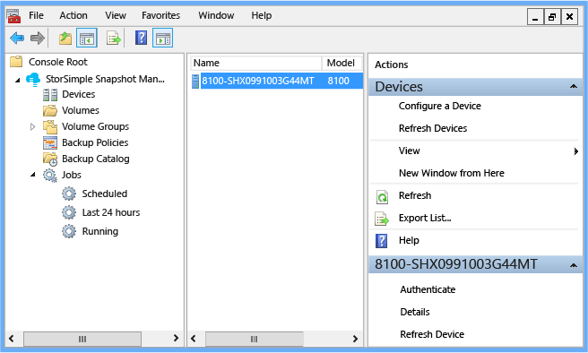
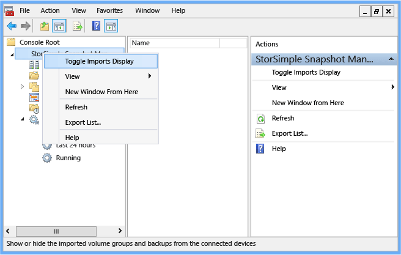
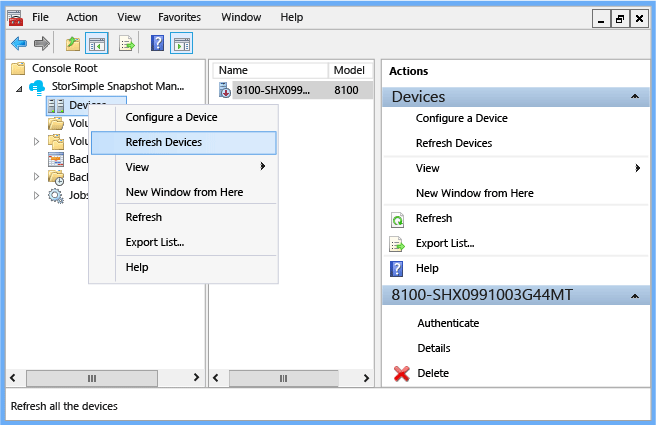
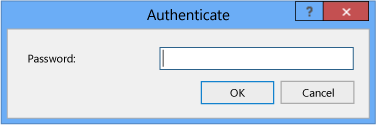
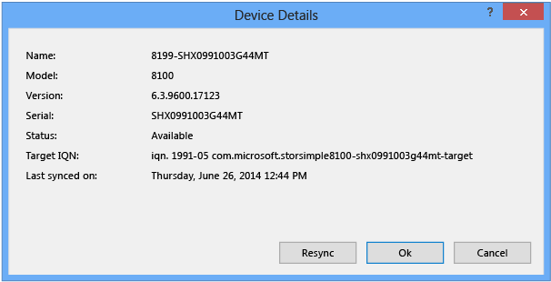
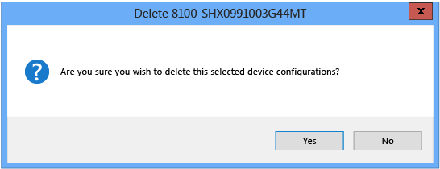

<properties 
   pageTitle="Verwalten von Geräten mit StorSimple Snapshot Manager | Microsoft Azure"
   description="Beschreibt, wie das StorSimple Snapshot-Manager MMC-Snap-in zu verbinden und Verwalten von StorSimple Geräten verwenden."
   services="storsimple"
   documentationCenter=""
   authors="SharS"
   manager="carmonm"
   editor="" />
<tags 
   ms.service="storsimple"
   ms.devlang="NA"
   ms.topic="article"
   ms.tgt_pltfrm="NA"
   ms.workload="NA"
   ms.date="04/18/2016"
   ms.author="v-sharos" />

# Verwenden Sie eine Verbindung herstellen und Verwalten von Geräten StorSimple StorSimple Snapshot-Manager

## (Übersicht)

Sie können Knoten im StorSimple Snapshot-Manager **Umfang** der importierte StorSimple Gerätedaten überprüfen und aktualisieren verbundene Speichergeräte verwenden. Wenn Sie den **Geräte** -Knoten klicken, können Sie eine Liste der verbundenen Geräte und entsprechende Statusinformationen im **Ergebnisbereich** angezeigt werden.

**Abbildung 1: StorSimple Snapshot-Manager verbundenen Geräten** 

Abhängig von Ihrer Auswahl **Ansicht** zeigt im **Ergebnisbereich** die folgende Informationen zu jedem Gerät. (Weitere Informationen zum Konfigurieren einer Ansicht, wechseln Sie [im Menü Ansicht](storsimple-use-snapshot-manager.md#view-menu).

| Ergebnisspalte  |Beschreibung          |
|:----------------|:--------------------| 
| Namen            | Der Name des Geräts entsprechend der Konfiguration in der klassischen Azure-portal|
| Modell           | Die Anzahl der Modell des Geräts|
| Version         | Die Version der Software auf dem Gerät installiert |
| Status          | Gibt an, ob das Gerät verfügbar ist. |
| Letzte synchronisiert.     | Datum und Uhrzeit der letzten des Geräts Synchronisierung |
| Serielle Nein.      | Die fortlaufende Zahl für das Gerät |
 
Wenn Sie den **Geräte** -Knoten, klicken Sie im **Bereich** mit der rechten Maustaste, wählen Sie können der folgenden Aktionen aus:

- Hinzufügen oder Ersetzen eines Geräts 
- Schließen Sie ein Gerät, und vergewissern Sie sich Importe 
- Aktualisieren von verbundenen Geräte 

Wenn Sie auf den **Geräte** -Knoten und Maustaste klicken Sie dann auf den Namen eines Geräts im **Ergebnisbereich** , können Sie aus der folgenden Aktionen auswählen:

- Ein Gerät authentifizieren 
- Anzeigen von Details zu Gerät 
- Aktualisieren eines Geräts 
- Löschen einer Konfigurations des Geräts 
- Ändern des Gerätekennworts für ein

>[AZURE.NOTE] Alle diese Aktionen stehen auch im Bereich **Aktionen** .
 
In diesem Lernprogramm wird erläutert, wie StorSimple Snapshot-Manager zu verbinden und Verwalten von Geräten, und führen Sie die folgenden Aufgaben verwenden:

- Hinzufügen oder Ersetzen eines Geräts 
- Schließen Sie ein Gerät, und vergewissern Sie sich Importe 
- Aktualisieren von verbundenen Geräte 
- Ein Gerät authentifizieren 
- Anzeigen von Details zu Gerät 
- Aktualisieren von einem einzelnen Gerät 
- Löschen einer Konfigurations des Geräts 
- Ändern des Gerätekennworts für ein abgelaufen
- Ersetzen eines ausgefallenen Geräts

>[AZURE.NOTE] Allgemeine Informationen über die Schnittstelle StorSimple Snapshot-Manager wechseln Sie zu [StorSimple Snapshot-Manager-Benutzeroberfläche](storsimple-use-snapshot-manager.md).

## Hinzufügen oder Ersetzen eines Geräts

Gehen Sie folgendermaßen vor, hinzufügen oder Ersetzen einer StorSimple Gerät.

#### Hinzufügen oder Ersetzen eines Geräts

1. Klicken Sie auf das Desktopsymbol um StorSimple Snapshot-Manager zu starten.

2. Klicken Sie im **Bereich** mit der rechten Maustaste in des Knotens **Geräte** , und klicken Sie dann auf **Gerät konfigurieren**. Klicken Sie im Dialogfeld **konfigurieren ein Gerät** wird angezeigt.

     

3. Wählen Sie im Feld Dropdown- **Gerät** die IP-Adresse des Geräts oder virtuelles Gerät aus. 

4. Geben Sie im Textfeld **Kennwort** das Kennwort StorSimple Snapshot-Manager, das Sie für das Gerät in der klassischen Azure-Portal erstellt. Klicken Sie auf **OK**. StorSimple Snapshot-Manager durchsucht für das Gerät, das Sie identifiziert. 

    - Wenn das Gerät verfügbar ist, fügt StorSimple Snapshot-Manager eine Verbindung aus. 

    - Wenn das Gerät aus irgendeinem Grund nicht verfügbar ist, gibt StorSimple Snapshot-Manager eine Fehlermeldung angezeigt. Klicken Sie auf **OK** , um die Fehlermeldung zu schließen, und klicken Sie dann auf **Abbrechen** , um das Dialogfeld **konfigurieren ein Gerät** schließen.

## Schließen Sie ein Gerät, und vergewissern Sie sich Importe

Gehen Sie folgendermaßen vor, schließen Sie ein Gerät StorSimple, und stellen Sie sicher, dass alle vorhandenen Volume-Gruppen, die Sicherungskopien zugeordnet sind importiert wurden.

#### Schließen Sie ein Gerät, und vergewissern Sie sich importiert.

1. Schließen Sie ein Gerät zum StorSimple Snapshot-Manager, folgen Sie den Anweisungen in hinzufügen oder ein Gerät zu ersetzen. Beim Herstellen einer mit einem Gerät Verbindung, reagiert StorSimple Snapshot-Manager wie folgt:

    - Wenn das Gerät aus irgendeinem Grund nicht verfügbar ist, gibt StorSimple Snapshot-Manager eine Fehlermeldung angezeigt. 

   - Wenn das Gerät verfügbar ist, fügt StorSimple Snapshot-Manager eine Verbindung aus. Wenn Sie das Gerät auswählen, er im **Ergebnisbereich** angezeigt wird und das Feld "Status" gibt an, dass ist das Gerät **verfügbar**. StorSimple Snapshot-Manager importiert für das Gerät so konfiguriert, dass alle Volume-Gruppen, vorausgesetzt, dass die Lautstärke Gruppen Sicherungskopien zugeordnet wurde. Zusätzliche Richtlinien werden nicht importiert. Volumegruppen, die nicht zugeordnete Sicherungskopien verfügen, werden nicht importiert.

2. Klicken Sie auf das Desktopsymbol um StorSimple Snapshot-Manager zu starten.

3. Mit der rechten Maustaste in des obersten Knotens klicken Sie im **Bereich** , und klicken Sie dann auf **Den Schalter Importe anzeigen**.

     

4. Das Dialogfeld **Umschaltfläche Importe anzeigen** angezeigt wird, mit den Status der importierten Datenträgers Gruppen und Sicherungskopien an. Klicken Sie auf **OK**. 

Nachdem die Lautstärke Gruppen und Sicherungskopien erfolgreich importiert sind, können StorSimple Snapshot-Manager Sie verwalten können, wie Sie Volume-Gruppen und Sicherungskopien, die Sie erstellt und konfiguriert mit StorSimple Snapshot-Manager verwalten möchten. 

## Aktualisieren von verbundenen Geräte

Verwenden Sie das folgende Verfahren, um die verbundenen StorSimple Geräte mit StorSimple Snapshot Manager synchronisieren.

####Aktualisieren von verbundenen Geräte

1. Klicken Sie auf das Desktopsymbol um StorSimple Snapshot-Manager zu starten.

2. Klicken Sie im **Bereich** mit der rechten Maustaste **Geräte**, und klicken Sie dann auf **Geräte aktualisieren**. Dies synchronisiert die verbundenen Geräte mit StorSimple Snapshot-Manager, damit Sie die Lautstärke Gruppen und Sicherungskopien, einschließlich von alle zuletzt verwendete Ergänzungen anzeigen können. 

    
 
Die Aktion **Aktualisieren Geräte** Ruft alle neuen Volume-Gruppen und alle zugehörigen Sicherungskopien von verbundenen Geräten. Im Gegensatz zu den **neu einlesen Datenmengen** verfügbare Aktion für den Knoten **Datenmengen** stellt **Geräte aktualisieren** der Registrierung sichern nicht wieder her.

## Ein Gerät authentifizieren

Gehen Sie folgendermaßen vor, mit einem Gerät StorSimple mit StorSimple Snapshot Manager authentifiziert.

#### Mit einem Gerät authentifiziert

1. Klicken Sie auf das Desktopsymbol um StorSimple Snapshot-Manager zu starten.

2. Klicken Sie im **Bereich** klicken Sie auf **Geräte**.

3. Klicken Sie im **Ergebnisbereich** mit der rechten Maustaste in des Namens des Geräts, und klicken Sie dann auf **authentifizieren**.

4. Das Dialogfeld **authentifizieren** wird angezeigt. Geben Sie ein Kennwort für das Gerät, und klicken Sie dann auf **OK**.

     
 
## Anzeigen von Details zu Gerät

Gehen Sie folgendermaßen vor, zeigen Sie die Details eines Geräts StorSimple und, falls notwendig, synchronisieren Sie das Gerät mit StorSimple Snapshot-Manager erneut.

#### Zum Anzeigen und erneut synchronisieren Device-details

1. Klicken Sie auf das Desktopsymbol um StorSimple Snapshot-Manager zu starten.

2. Klicken Sie im **Bereich** klicken Sie auf **Geräte**.

3. Klicken Sie im **Ergebnisbereich** mit der rechten Maustaste in des Namens des Geräts, und klicken Sie dann auf **Details**. 

4.konfigurieren **Gerätedetails** im Dialogfeld wird angezeigt. In diesem Feld werden Name, Modell, Version, fortlaufende Zahl, Status, Ziel iSCSI qualifizierte Namen (IQN) und letzten Synchronisierungsdatum und Uhrzeit. 

   - Klicken Sie auf **synchronisieren Sie neu** , um das Gerät zu synchronisieren.

   - Klicken Sie auf **OK** oder auf **Abbrechen** , um das Dialogfeld zu schließen.

     
 
## Aktualisieren von einem einzelnen Gerät

Gehen Sie folgendermaßen vor, um eine einzelne StorSimple Gerät mit StorSimple Snapshot-Manager erneut synchronisieren.

#### Um ein Gerät zu aktualisieren.

1. Klicken Sie auf das Desktopsymbol um StorSimple Snapshot-Manager zu starten. 

2. Klicken Sie im **Bereich** klicken Sie auf **Geräte**. 

3. Klicken Sie im **Ergebnisbereich** mit der rechten Maustaste in des Namens des Geräts, und klicken Sie dann auf **Gerät aktualisieren**. Dadurch wird das Gerät mit StorSimple Snapshot-Manager synchronisiert. 

## Löschen einer Konfigurations des Geräts

Gehen Sie folgendermaßen vor, um einer einzelnen StorSimple Gerätekonfiguration von StorSimple Snapshot Manager löschen.

#### So löschen Sie eine Gerätekonfiguration

1. Klicken Sie auf das Desktopsymbol um StorSimple Snapshot-Manager zu starten. 

2. Klicken Sie im **Bereich** klicken Sie auf **Geräte**. 

3. Klicken Sie im **Ergebnisbereich** mit der rechten Maustaste in des Namens des Geräts, und klicken Sie dann auf **Löschen**. 

4. Die folgende Meldung angezeigt wird. Klicken Sie auf **Ja,** um die Konfiguration zu löschen, oder klicken Sie auf **Nein** , um den Löschvorgang abzubrechen.

    

## Ändern des Gerätekennworts für ein abgelaufen

Geben Sie ein Kennwort zum Authentifizieren ein StorSimple Gerät mit StorSimple Snapshot-Manager ein. Sie Konfigurieren dieses Kennwort, wenn Sie die Windows PowerShell-Benutzeroberfläche verwenden, um das Gerät einzurichten. Jedoch kann das Kennwort abläuft. In diesem Fall im klassische Azure-Portal können Sie das Kennwort ändern. Da das Gerät vor Ablauf des Kennworts in StorSimple Snapshot-Manager konfiguriert wurde, müssen Sie das Gerät in StorSimple Snapshot-Manager, klicken Sie dann erneut authentifizieren. 

#### Das abgelaufene Kennwort ändern

1. Im Portal Azure klassischen starten Sie StorSimple Manager-Dienst

2. Klicken Sie auf **Geräte** > **Konfigurieren** für das Gerät.

3. Führen Sie einen Bildlauf nach unten bis zum Abschnitt StorSimple Snapshot-Manager. Geben Sie ein Kennwort, 14-15 Zeichen ist. Stellen Sie sicher, dass das Kennwort eine Kombination aus Groß-, Kleinbuchstaben, numerischen und Sonderzeichen enthält.

4. Geben Sie das Kennwort zur Bestätigung erneut ein.

5. Klicken Sie auf **Speichern** , am unteren Rand der Seite.

#### Das Gerät neu authentifiziert

1. StorSimple Snapshot-Manager zu starten.

2. Klicken Sie im **Bereich** klicken Sie auf **Geräte**. Im **Ergebnisbereich** wird eine Liste von konfigurierten Geräten angezeigt. 

3. Wählen Sie das Gerät, mit der rechten Maustaste, und klicken Sie dann auf **authentifizieren**.

4. Geben Sie in das Fenster **identifizieren** geöffnet das neue Kennwort ein. 

5. Wählen Sie das Gerät, mit der rechten Maustaste und wählen Sie **Gerät aktualisieren**. Dadurch wird das Gerät mit StorSimple Snapshot Manager synchronisiert. 

## Ersetzen eines ausgefallenen Geräts

Wenn ein Gerät StorSimple schlägt fehl, und ist durch ein Gerät Standby (Failover) ersetzt wird, gehen Sie folgendermaßen vor, um eine Verbindung mit dem neuen Gerät und die zugehörigen Sicherungskopien anzeigen.

#### Verbindung zu einem neuen Gerät nach failover

1. Konfigurieren die iSCSI-Verbindung mit dem neuen Gerät neu. Anweisungen, wechseln Sie zu "Schritt 7: bereitstellen, Initialisierung und Format ein Volume" in [Bereitstellen von Ihrem lokalen StorSimple Gerät](storsimple-deployment-walkthrough-u2.md). 

>[AZURE.NOTE] Wenn das neue StorSimple Gerät die IP-Adresse wie die alte aufweist, möglicherweise Sie die alte Konfiguration eine Verbindung herstellen können. 

2. Beenden Sie den Microsoft StorSimple-Verwaltungsdienst an:

    1. Server-Manager zu starten.

    2. Wählen Sie auf dem Server-Manager-Dashboard, klicken Sie im Menü **Extras** auf **Dienste**. 

    3. Wählen Sie im Fenster " **Dienstleistungen** " **Microsoft StorSimple-Verwaltungsdienst**ein. 

    4. Klicken Sie im rechten Bereich unter **Microsoft StorSimple-Verwaltungsdienst**auf **Beenden Sie den Dienst**. 

3. Entfernen Sie die Informationen im Zusammenhang mit dem alten Gerät: 

    1. Navigieren Sie im Datei-Explorer zu C:\ProgramData\Microsoft\StorSimple\BACatalog. 

    2. Löschen Sie die Dateien im Ordner BACatalog. 

4. Starten Sie den Microsoft StorSimple Management-Dienst: 

    1. Wählen Sie auf dem Server-Manager-Dashboard, klicken Sie im Menü **Extras** auf **Dienste**. 

    2. Wählen Sie im Fenster " **Dienstleistungen** " **Microsoft StorSimple-Verwaltungsdienst**ein. 

    3. Klicken Sie im rechten Bereich unter **Microsoft StorSimple-Verwaltungsdienst**auf **Starten Sie den Dienst**. 

5. StorSimple Snapshot-Manager zu starten. 

6. Um das neue StorSimple Gerät zu konfigurieren, führen Sie die Schritte in Schritt2: Verbinden Sie ein Gerät StorSimple in [StorSimple Snapshot-Manager bereitstellen](storsimple-snapshot-manager-deployment.md). 

7. Mit der rechten Maustaste in den Knotens des obersten Ebene im **Bereich** (StorSimple Snapshot Manager im Beispiel), und klicken Sie dann auf **Den Schalter Importe anzeigen**. 

8. Eine Meldung angezeigt wird, wenn die importierten Datenträgers Gruppen und Sicherungen in StorSimple Snapshot-Manager angezeigt werden. Klicken Sie auf **OK**. 

## Nächste Schritte

- Erfahren Sie, wie [StorSimple Snapshot-Manager verwalten Sie Ihre Lösung StorSimple verwendet](storsimple-snapshot-manager-admin.md).
- Erfahren Sie, wie Sie [mit dem StorSimple Snapshot-Manager anzeigen und Verwalten von Datenmengen](storsimple-snapshot-manager-manage-volumes.md).

