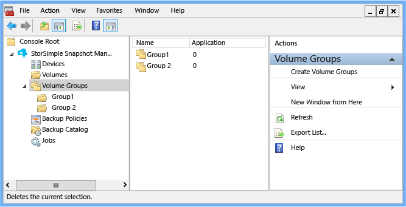
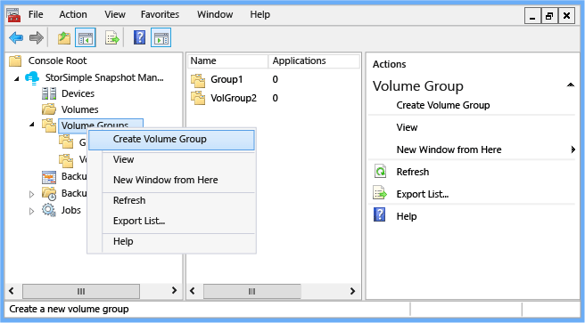
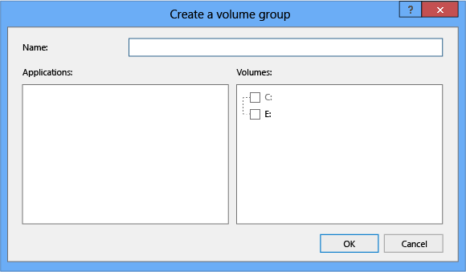
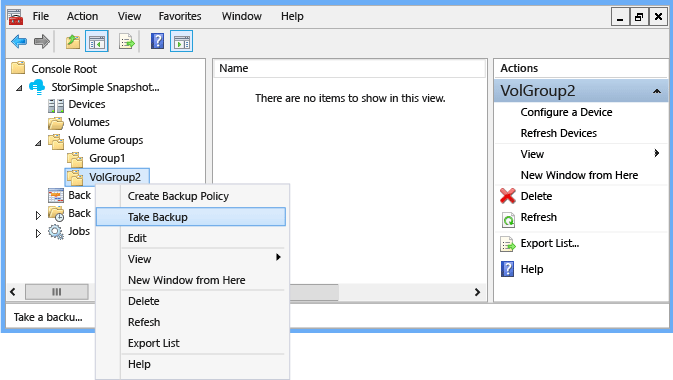
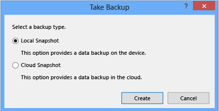

<properties 
   pageTitle="StorSimple Snapshot-Manager Lautstärke Gruppen | Microsoft Azure"
   description="Beschreibt, wie das StorSimple Snapshot-Manager MMC-Snap-in zum Erstellen und Verwalten von Volume-Gruppen verwenden."
   services="storsimple"
   documentationCenter="NA"
   authors="SharS"
   manager="carmonm"
   editor="" />
<tags 
   ms.service="storsimple"
   ms.devlang="NA"
   ms.topic="article"
   ms.tgt_pltfrm="NA"
   ms.workload="TBD"
   ms.date="04/18/2016"
   ms.author="v-sharos" />

# Verwenden Sie zum Erstellen und Verwalten von Volume-Gruppen StorSimple Snapshot-Manager

## (Übersicht)

Können den **Lautstärke Gruppen** Knoten im **Bereich** Bereich Datenmengen Lautstärke Gruppen zuweisen, Anzeigen von Informationen zu einer Gruppe Lautstärke, Sicherungskopien planen und Bearbeiten von Volume-Gruppen. 

Volumegruppen sind Ressourcenpools verwandte Datenmengen verwendet, um sicherzustellen, dass Sicherungskopien Anwendung konsistent sind. Weitere Informationen finden Sie unter [Datenmengen und Volume-Gruppen](storsimple-what-is-snapshot-manager.md#volumes-and-volume-groups) und [Integration in Windows Lautstärke Dienstfehler](storsimple-what-is-snapshot-manager.md#integration-with-windows-volume-shadow-copy-service).

>[AZURE.IMPORTANT] 
>
> * Alle Datenträger in einer Gruppe Lautstärke müssen von einem einzelnen Cloud-Dienstanbieter zugeordnet werden.
> 
> * Wenn Sie die Lautstärke Gruppen konfigurieren, mischen Sie gehen Sie wie folgt nicht Cluster freigegeben Datenmengen (CSVs) und CSVs in derselben Gruppe Lautstärke. StorSimple Snapshot-Manager unterstützt keine Mischung aus CSVs und nicht CSVs in der gleichen Momentaufnahme.
 

**Abbildung 1: StorSimple Snapshot Manager Lautstärke Gruppen Knoten** 

In diesem Lernprogramm wird erläutert, wie Sie StorSimple Snapshot-Manager zu verwenden können:

- Anzeigen von Informationen über Ihre Volume-Gruppen 
- Erstellen einer Volume-Gruppe
- Sichern einer Volume-Gruppe
- Bearbeiten einer Volume-Gruppe
- Löschen einer Volume-Gruppe

Alle diese Aktionen stehen auch im Bereich **Aktionen** .
 
## Volumen-Gruppen anzeigen

Wenn Sie den **Lautstärke Gruppen** Knoten klicken, wird im **Ergebnisbereich** die folgende Informationen zu jeder Volumegruppe je nach der Auswahl der Spalten, die Sie vornehmen. (Die Spalten im **Ergebnisbereich** können konfiguriert werden. Mit der rechten Maustaste **Datenmengen** Knoten, wählen Sie **Ansicht**, und wählen Sie dann **Spalten hinzufügen/entfernen**.)

Ergebnisspalte | Beschreibung 
:--------------|:------------ 
Namen           | Die Spalte **Name** enthält den Namen der Gruppe Lautstärke.
Anwendung    | Die Spalte **Applikationen** zeigt die Anzahl der VSS Autoren zurzeit installiert und auf dem Windows-Host ausgeführt.
Ausgewählt       | Die **ausgewählte** Spalte zeigt die Anzahl der Datenmengen die Datenspeicheroptionen in der Gruppe Lautstärke. 0 (null) gibt an, dass keine Anwendung die Datenmengen in der Volumegruppe zugeordnet ist.
Importiert       | Die **importierte** Spalte zeigt die Anzahl der importierten Datenträger. Wenn **True**festgelegt ist, gibt diese Spalte eine Volume-Gruppe wurde vom klassischen Azure-Portal importiert und nicht im StorSimple Snapshot-Manager erstellt wurde.
 
>[AZURE.NOTE] StorSimple Snapshot-Manager Lautstärke Gruppen werden auch auf der Registerkarte **Sicherung Richtlinien** im klassischen Azure-Portal angezeigt.
 
## Erstellen einer Volume-Gruppe

Verwenden Sie das folgende Verfahren zum Erstellen einer Volume-Gruppe ein.

#### So erstellen Sie eine Gruppe Lautstärke

1. Klicken Sie auf das Desktopsymbol um StorSimple Snapshot-Manager zu starten. 

2. Klicken Sie im **Bereich** mit der rechten Maustaste **Volume-Gruppen**, und klicken Sie dann auf **Volume-Gruppe erstellen**. 

    
 
    Das Dialogfeld **Erstellen einer Volume-Gruppe** wird angezeigt. 

     

3.  Geben Sie die folgenden Informationen ein: 

    1. Geben Sie im Feld **Name** einen eindeutigen Namen für die neue Gruppe für die Lautstärke ein. 

    2. Wählen Sie im Feld **Applikationen** Applikationen zugeordnet die Datenmengen, die Sie zur Gruppe "Volumen" hinzugefügt werden. 

        Die **Applikationen** Listen nur diesen Programmen, die StorSimple Datenmengen verwenden, und haben VSS Autoren für diese aktiviert. Einen aktiviert ist, nur, wenn alle Datenträger, denen der Autor beachtet StorSimple Datenmengen sind. Wenn das Feld Applikationen leer ist, werden keine Programme, die Datenmengen Azure StorSimple verwenden und haben Autoren VSS unterstützt installiert ist. (Aktuell, unterstützt Azure StorSimple Microsoft Exchange- und SQL Server.) Weitere Informationen zu VSS Autoren finden Sie unter [Integration mit Windows Lautstärke Dienstfehler](storsimple-what-is-snapshot-manager.md#integration-with-windows-volume-shadow-copy-service).

        Wenn Sie eine Anwendung auswählen, werden alle Datenträger zugeordnet automatisch aktiviert. Wenn Sie einer bestimmten Anwendung zugeordnete Datenmengen auswählen, wird die Anwendung umgekehrt automatisch im Feld **Applikationen** ausgewählt. 

    3. Wählen Sie im Feld **Datenmengen** StorSimple Datenmengen die Lautstärke-Gruppe hinzu. 

      - Sie können einzelne oder mehrere Partitionen Datenmengen einbeziehen. (Mehrere Partition Datenmengen können dynamische Laufwerke oder grundlegende mit mehreren Partitionen sein.) Ein Volume, das mehrere Partitionen enthält, wird als einzelne Einheit behandelt. Daher, wenn Sie nur eine der Partitionen einer Volume-Gruppe hinzufügen, werden die anderen Partitionen automatisch in dieser Gruppe Lautstärke zur gleichen Zeit hinzugefügt. Nachdem Sie eine Volume-Gruppe ein mehrere Partition Volume hinzugefügt haben, wird die mehrere Partition Datenträger weiterhin als einzelne Einheit behandelt werden.

      - Sie können leere Volume-Gruppen erstellen, indem Sie sie keine Datenträger zuweisen. 

      - Cluster freigegeben Datenmengen (CSVs) und CSVs in derselben Gruppe Lautstärke nicht kombiniert werden. StorSimple Snapshot-Manager unterstützt eine Mischung aus CSV-Datenträger und nicht in der CSV-Datenträger nicht in der gleichen Momentaufnahme. 

4. Klicken Sie auf **OK** , um die Lautstärke Gruppe zu speichern.

## Sichern einer Volume-Gruppe

Gehen Sie folgendermaßen vor, um eine Volume-Gruppe zu sichern.

#### Sichern einer Volume-Gruppe

1. Klicken Sie auf das Desktopsymbol um StorSimple Snapshot-Manager zu starten.

2. Klicken Sie im **Bereich** den Knoten **Lautstärke Gruppen** erweitern, mit der rechten Maustaste in eines Gruppennamen Lautstärke, und klicken Sie dann auf **Sicherung ausführen**. 

    

3. Wählen Sie im Dialogfeld **Sicherung ausführen** **Lokale Snapshot** oder eine **Momentaufnahme der Cloud**, und klicken Sie dann auf **Erstellen**. 

     

4. Um zu bestätigen, dass die Sicherung ausgeführt wird, erweitern Sie den Knoten **Aufträge** , und klicken Sie dann auf **Ausführen**. Die Sicherung sollte aufgeführt sein.

5. Zum Anzeigen des fertigen Snapshots erweitern Sie den Knoten **Sicherungskatalog** , erweitern Sie den Lautstärke Gruppennamen, und klicken Sie dann auf **Lokale Snapshot** oder eine **Momentaufnahme der Cloud**. Die Sicherung wird aufgeführt, wenn es erfolgreich abgeschlossen. 

## Bearbeiten einer Volume-Gruppe

Verwenden Sie das folgende Verfahren zum Bearbeiten einer Volume-Gruppe ein.

#### So bearbeiten Sie eine Volume-Gruppe

1. Klicken Sie auf das Desktopsymbol um StorSimple Snapshot-Manager zu starten.

2. Klicken Sie im **Bereich** den Knoten **Lautstärke Gruppen** erweitern, mit der rechten Maustaste in eines Gruppennamen Lautstärke, und klicken Sie dann auf **Bearbeiten**. 

3. Das Dialogfeld **Erstellen einer Volume-Gruppe **wird angezeigt. Sie können die Einträge **Name**, **-Anwendungen**und **Datenmengen** ändern. 

4. Klicken Sie auf **OK** , um die Änderungen zu speichern.

## Löschen einer Volume-Gruppe

Verwenden Sie das folgende Verfahren, um eine Volume-Gruppe löschen. 

>[AZURE.WARNING] Dadurch wird auch alle vorhandenen Sicherungskopien der Lautstärke Gruppe zugeordneten gelöscht.

#### So löschen Sie eine Volume-Gruppe

1. Klicken Sie auf das Desktopsymbol um StorSimple Snapshot-Manager zu starten. 

2. Klicken Sie im **Bereich** den Knoten **Lautstärke Gruppen** erweitern, mit der rechten Maustaste in eines Gruppennamen Lautstärke, und klicken Sie dann auf **Löschen**. 

3. Das Dialogfeld **Volume-Gruppe löschen** wird angezeigt. Geben Sie in das Textfeld **bestätigen** ein, und klicken Sie dann auf **OK**. 

    Die gelöschten Volume-Gruppe aus der Liste im **Ergebnisbereich** verschwindet, und alle Sicherungskopien, die dieser Gruppe Lautstärke zugeordnet sind werden aus dem Katalog Sicherung gelöscht.

## Nächste Schritte

- Erfahren Sie, wie [StorSimple Snapshot-Manager verwalten Sie Ihre Lösung StorSimple verwendet](storsimple-snapshot-manager-admin.md).
- Erfahren Sie, wie [StorSimple Snapshot-Manager erstellen und Verwalten von Sicherung Richtlinien verwendet](storsimple-snapshot-manager-manage-backup-policies.md).
