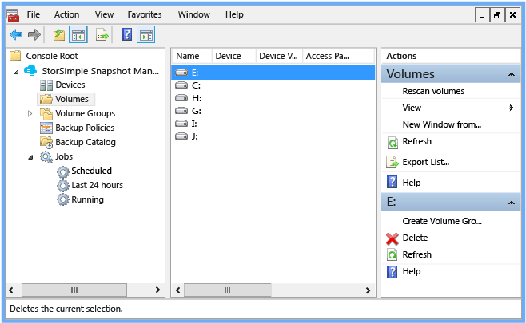
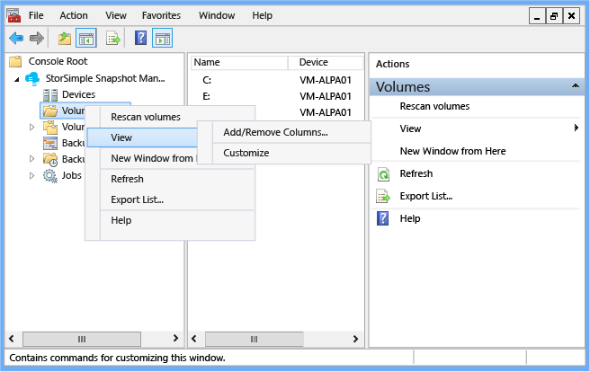
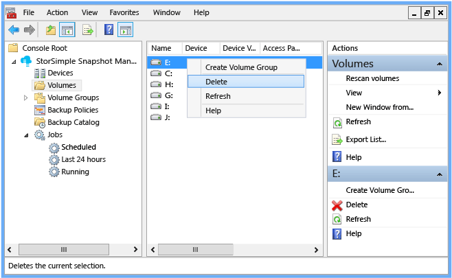
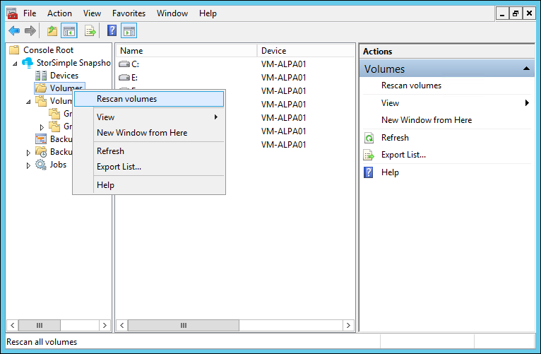
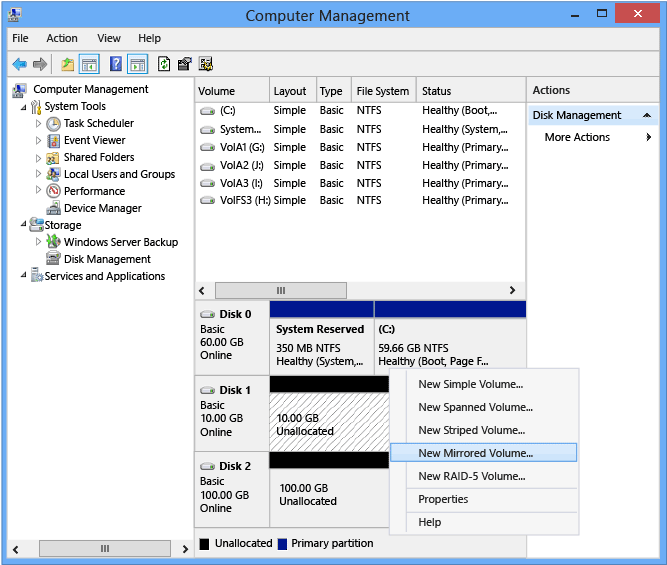
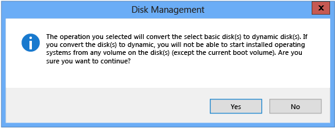
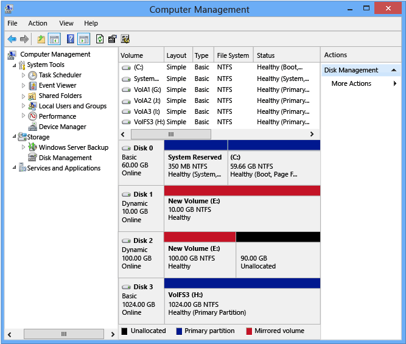

<properties 
   pageTitle="StorSimple Snapshot-Manager und Datenmengen | Microsoft Azure"
   description="Beschreibt, wie StorSimple Snapshot-Manager MMC-Snap-in verwenden, um anzeigen und Verwalten von Datenmengen und Sicherungen konfigurieren."
   services="storsimple"
   documentationCenter="NA"
   authors="SharS"
   manager="carmonm"
   editor="" />
<tags 
   ms.service="storsimple"
   ms.devlang="NA"
   ms.topic="article"
   ms.tgt_pltfrm="NA"
   ms.workload="TBD"
   ms.date="04/18/2016"
   ms.author="v-sharos" />

# Verwenden Sie zum Anzeigen und Verwalten von Datenmengen StorSimple Snapshot-Manager

## (Übersicht)

Den Knoten StorSimple Snapshot-Manager **Datenmengen** können (auf **Bereichs-)** Sie Datenmengen wählen und diese Informationen anzeigen. Die Datenträger werden als Laufwerke, die entsprechen, die vom Host aktivierten Datenträger dargestellt. Der **Datenmengen** Knoten zeigt lokale Datenträger und Lautstärke Typen, die von StorSimple, einschließlich Datenmengen erkannt durch die Verwendung von iSCSI- und einem Gerät unterstützt werden. 

Weitere Informationen zu unterstützten Datenmengen wechseln Sie zu [Unterstützung für mehrere Lautstärke](storsimple-what-is-snapshot-manager.md#support-for-multiple-volume-types).

Der **Datenmengen** Knoten ermöglicht Ihnen außerdem, lesen, oder nach StorSimple Snapshot-Manager diese erkennt Datenträger löschen. 

In diesem Lernprogramm erläutert das können bereitstellen, Initialisierung und Datenmengen formatieren und dann StorSimple Snapshot-Manager zu verwenden:

- Anzeigen von Informationen über Datenmengen 
- Datenträger löschen
- Neu einlesen Datenmengen 
- Konfigurieren Sie ein einfaches Volume und Sichern Sie
- Konfigurieren eines dynamischen gespiegelten Volumes und Sichern sie Sie

>[AZURE.NOTE] Alle **Lautstärke** Knoten Aktionen stehen auch im Bereich **Aktionen** .
 
## Bereitstellen von Datenmengen

Verwenden Sie das folgende Verfahren zum Bereitstellen, Initialisierung, und formatieren StorSimple Datenmengen. Dieses Verfahren wird die Verwaltung einer Systemprogramm für die Verwaltung von Festplatten und die entsprechenden Datenträger oder Partitionen verwendet. Weitere Informationen zu Datenträger Verwaltung wechseln Sie zur [Verwaltung von Datenträger](https://technet.microsoft.com/library/cc770943.aspx) aus, auf der Microsoft TechNet-Website.

#### Datenmengen bereitstellen.

1. Starten Sie den Microsoft iSCSI Initiator auf Ihrem Hostcomputer.

2. Angeben eines der Benutzeroberfläche IP-Adressen als die Zielportal oder Discovery-IP-Adresse ein, und Verbinden mit dem Gerät. Nachdem Sie das Gerät angeschlossen ist, können die Datenmengen auf Ihrem Windows-System zugegriffen werden. Weitere Informationen zu den Microsoft iSCSI Initiator verwenden, wechseln Sie zum Abschnitt "Herstellen einer Verbindung mit einem iSCSI-Ziel-Gerät" in [Installieren und Konfigurieren von Microsoft iSCSI Initiator][1].

3. So starten Sie die Verwaltung, verwenden Sie eine der folgenden Optionen:

    - Geben Sie im Feld **Ausführen** Diskmgmt.msc ein.

    - Starten Sie Server-Manager, erweitern Sie den Knoten **Speicher** , und wählen Sie dann auf **Datenträger Verwaltung**.

    - Starten Sie **Verwaltung**, erweitern Sie den Knoten **Computer Verwaltung** , und wählen Sie dann auf **Datenträger Verwaltung**. 

    >[AZURE.NOTE] Sie müssen Administratorrechte verwenden, um Datenträger Verwaltung auszuführen.
 
4. Führen Sie den Datenträger online ein:

   1. In der Datenträger Verwaltung mit der rechten Maustaste jedes Volume als **Offline**markiert.

   2. Klicken Sie auf **Datenträger reaktivieren**. Der Datenträger sollte **Online** gekennzeichnet werden, nachdem die Festplatte erneut aktiviert ist.

5. Initialisierung der Datenträger:

   1. Mit der rechten Maustaste in die ermittelten Datenträger.

   2. Wählen Sie im Menü **Initialisierung Datenträger**aus.

   3. Klicken Sie im Dialogfeld **Initialisierung Datenträger** wählen Sie die gewünschten Initialisierung Datenträger aus, und klicken Sie dann auf **OK**.

6. Formatieren Sie einfache Datenträger:

   1. Mit der rechten Maustaste in eines Datenträgers, den Sie formatieren möchten.

   2. Wählen Sie im Menü **Neuen einfachen Datenträger**aus.

   3. Verwenden Sie den Assistenten Neues einfaches Volume, um die Lautstärke zu formatieren:

      - Geben Sie die Lautstärke Größe ein.
      - Geben Sie einen Laufwerkbuchstaben ein.
      - Wählen Sie das Dateisystem NTFS aus.
      - Geben Sie die Größe der Zuordnungseinheiten einer 64 KB sein.
      - Führen Sie eine Symbolleiste Format ein.

7. Formatieren Sie mehrere Partition Datenmengen. Anweisungen wechseln Sie zum Abschnitt, "Partitionen und Datenmengen" in der [Datenträger Verwaltung implementieren](https://msdn.microsoft.com/library/dd163556.aspx).

## Anzeigen von Informationen über Ihre Datenmengen

Verwenden Sie das folgende Verfahren, um Informationen zu lokalen und Azure StorSimple Datenmengen anzuzeigen.

#### Volumeinformationen anzeigen

1. Klicken Sie auf das Desktopsymbol um StorSimple Snapshot-Manager zu starten. 

2. Klicken Sie auf den Knoten **Datenmengen** , klicken Sie im **Bereich** . Eine Liste der lokalen und bereitgestellten Datenmengen, einschließlich aller Azure StorSimple Datenmengen, wird im **Ergebnisbereich** angezeigt. Die Spalten im **Ergebnisbereich** werden konfiguriert. (Mit der rechten Maustaste in des Knotens **Datenmengen** , wählen Sie **Ansicht**aus, und wählen Sie dann auf **Spalten hinzufügen/entfernen**.)

    

    Ergebnisspalte | Beschreibung 
    :--------------|:-------------
    Namen           | Die Spalte **Name** enthält den Laufwerkbuchstaben jedes ermittelten Volume zugewiesen.
    Gerät         | In der Spalte **Gerät** enthält die IP-Adresse des Geräts mit dem Hostcomputer verbunden.
    Volumen-Gerätenamen | Die Spalte **Gerät Lautstärke Name** enthält den Namen des Datenträgers Gerät das ausgewählte Volume gehört. Dies ist die Lautstärke Name im klassischen Azure-Portal für die bestimmte Volume definiert.
    Access-Wege   | Die **Access-Wege** -Spalte zeigt den Pfad Access die Lautstärke. Dies ist das Laufwerk Buchstaben oder Bereitstellen Punkt, die Lautstärke auf dem Host zugegriffen werden kann.
 
## Löschen eines Datenträgers

Gehen Sie folgendermaßen vor, um löschen Sie einen Datenträger aus StorSimple Snapshot-Manager.

>[AZURE.NOTE] Sie können kein Volume löschen, Teil alle Volume-Gruppe ist. (Die Option "löschen" ist nicht verfügbar für Datenmengen, die Lautstärke von Gruppenmitgliedern sind.) Sie müssen die ganze Volumegruppe, um die Lautstärke löschen Löschen.

#### So löschen Sie einen Datenträger

1. Klicken Sie auf das Desktopsymbol um StorSimple Snapshot-Manager zu starten.

2. Klicken Sie auf den Knoten **Datenmengen** , klicken Sie im **Bereich** . 

3. Klicken Sie im **Ergebnisbereich** mit der rechten Maustaste der Lautstärke, die Sie löschen möchten.

4. Klicken Sie im Menü auf **Löschen**. 

     

5. Das Dialogfeld **Volume löschen** wird angezeigt. Geben Sie in das Textfeld **bestätigen** ein, und klicken Sie dann auf **OK**.

6. Standardmäßig sichert StorSimple Snapshot-Manager ein Volume vor dem Löschen. Diese Vorsichtsmaßnahmen ergreifen können Sie Datenverlust schützen, wenn der Löschvorgang unbeabsichtigtes war. StorSimple Snapshot-Manager zeigt Fehlermeldung Fortschritt der **Automatischen Snapshot** , während sie die Lautstärke sichert. 

     

## Neu einlesen Datenmengen

Gehen Sie folgendermaßen vor, so scannen Sie die Datenmengen verbunden zu StorSimple Snapshot-Manager erneut.

#### So scannen Sie die Datenträger erneut.

1. Klicken Sie auf das Desktopsymbol um StorSimple Snapshot-Manager zu starten.

2. Klicken Sie im **Bereich** mit der rechten Maustaste **Datenmengen**, und klicken Sie dann auf **neu einlesen Datenmengen**.

    
 
    Dieses Verfahren wird die Volume-Liste mit StorSimple Snapshot-Manager. Alle Änderungen, wie z. B. neue Datenträger oder gelöschte Datenträger, werden in den Ergebnissen erkennbar.

## Konfigurieren und Sichern von ein einfaches volume

Gehen Sie folgendermaßen vor, konfigurieren eine Sicherungskopie der ein einfaches Volume, und klicken Sie dann entweder eine Sicherung sofort gestartet oder Erstellen einer Richtlinie für den geplanten Sicherungskopien.

### Erforderliche Komponenten

Bevor Sie beginnen:

- Stellen Sie sicher, dass der StorSimple Gerät und Host Computer ordnungsgemäß konfiguriert sind. Weitere Informationen zum [Bereitstellen von Ihrem lokalen StorSimple Gerät](storsimple-deployment-walkthrough-u2.md)wechseln.

- Installieren und Konfigurieren von StorSimple Snapshot-Manager. Wechseln Sie weitere Informationen zu [StorSimple Snapshot-Manager bereitstellen](storsimple-snapshot-manager-deployment.md).

#### So konfigurieren Sie die Sicherung eines einfachen Datenträgers

1. Erstellen Sie ein einfaches Volume auf dem Gerät StorSimple ein.

2. Bereitstellen, Initialisierung und formatieren Sie die Lautstärke beschriebenen in [Datenmengen bereitstellen](#mount-volumes). 

3. Klicken Sie auf das Symbol StorSimple Snapshot-Manager auf dem Desktop. Das Fenster StorSimple Snapshot-Manager wird angezeigt. 

4. Klicken Sie im **Bereich** mit der rechten Maustaste in des Knotens **Datenmengen** , und wählen Sie dann auf **neu einlesen Datenmengen**. Wenn der Scan abgeschlossen ist, sollte eine Liste der Datenträger im **Ergebnisbereich** angezeigt werden. 

5. Klicken Sie im **Ergebnisbereich** mit der rechten Maustaste in der Lautstärke, und wählen Sie dann auf **Volume-Gruppe erstellen**. 

     

6. Geben Sie im Dialogfeld **Volume-Gruppe erstellen** einen Namen für die Gruppe Lautstärke, weisen Sie Datenmengen zu, und klicken Sie dann auf **OK**.

7. Klicken Sie im **Bereich** erweitern Sie den Knoten **Lautstärke Gruppen** Die neue Gruppe für die Lautstärke sollte unter dem Knoten **Volume-Gruppen** angezeigt werden. 

8. Mit der rechten Maustaste in des Lautstärke Gruppennamen.

    - Um eine interaktive (bei Bedarf) Auftrag Sicherung zu starten, klicken Sie auf **Sicherung ausführen**. 

    - Klicken Sie auf **Sicherungsrichtlinie erstellen**, um eine automatische Sicherung zu planen. Wählen Sie auf der Seite " **Allgemein** " einer Volume-Gruppe aus der Liste aus. Geben Sie auf der Seite **Zeitplan** Details für den Zeitplan ein. Wenn Sie fertig sind, klicken Sie auf **OK**. 

9. Um zu bestätigen, dass der Sicherung Auftrag gestartet hat, erweitern Sie den Knoten **Aufträge** , klicken Sie im **Bereich** , und klicken Sie dann auf den Knoten **ausgeführt wird** . Im **Ergebnisbereich** wird die Liste der aktuell ausgeführten Aufträge angezeigt. 

## Konfigurieren und Sichern von einer dynamischen gespiegeltes volume

Führen Sie die folgenden Schritte aus, um Sicherung eines dynamischen gespiegelt Datenträgers zu konfigurieren:

- Schritt 1: Verwenden Sie Datenträger Verwaltung zum Erstellen eines dynamischen gespiegelten Datenträgers. 

- Schritt 2: Mit StorSimple Snapshot-Manager Sicherung konfigurieren.

### Erforderliche Komponenten

Bevor Sie beginnen:

- Stellen Sie sicher, dass der StorSimple Gerät und Host Computer ordnungsgemäß konfiguriert sind. Weitere Informationen zum [Bereitstellen von Ihrem lokalen StorSimple Gerät](storsimple-deployment-walkthrough-u2.md)wechseln.

- Installieren und Konfigurieren von StorSimple Snapshot-Manager. Wechseln Sie weitere Informationen zu [StorSimple Snapshot-Manager bereitstellen](storsimple-snapshot-manager-deployment.md).

- Konfigurieren von zwei Datenmengen auf dem Gerät StorSimple. (In den Beispielen werden die verfügbaren Datenträger **Datenträger 1** und **2 Datenträger**.) 

### Schritt 1: Verwenden Sie Datenträger Verwaltung zum Erstellen eines dynamischen gespiegelten Datenträgers

Datenträger Verwaltung ist ein für die Verwaltung von Festplatten und der Datenträger oder Partitionen, die diese enthalten. Weitere Informationen zu Datenträger Verwaltung wechseln Sie zur [Verwaltung von Datenträger](https://technet.microsoft.com/library/cc770943.aspx) aus, auf der Microsoft TechNet-Website.

#### Zum Erstellen eines dynamischen gespiegelten Datenträgers

1. So starten Sie die Verwaltung, verwenden Sie eine der folgenden Optionen: 

   - Öffnen Sie das Feld **Ausführen** , geben Sie **Diskmgmt.msc**, und drücken Sie die EINGABETASTE.

   - Starten Sie Server-Manager, erweitern Sie den Knoten **Speicher** , und wählen Sie dann auf **Datenträger Verwaltung**. 

   - Starten Sie **Verwaltung**, erweitern Sie den Knoten **Computer Verwaltung** , und wählen Sie dann auf **Datenträger Verwaltung**. 

2. Stellen Sie sicher, dass Sie zwei Datenmengen verfügbar auf dem Gerät StorSimple haben. (Im Beispiel sind die verfügbaren Datenträger **Datenträger 1** und **2 Datenträger**.) 

3. Klicken Sie im Fenster Datenträger Verwaltung in die rechte Spalte der im unteren Bereich mit der rechten Maustaste **Datenträger 1** , und wählen Sie **Neues gespiegelt Volume**. 

     

4. Klicken Sie auf der Seite **Neue gespiegelt Lautstärke** des Assistenten auf **Weiter**.

5. Klicken Sie auf der Seite **Wählen Sie einen Datenträger** wählen Sie in den Bereich **ausgewählte** **Datenträger 2** aus, klicken Sie auf **Hinzufügen**, und klicken Sie dann auf **Weiter**. 

6. Klicken Sie auf der Seite **zuweisen Laufwerksbuchstaben oder Pfad** akzeptieren Sie die Standardeinstellungen, und klicken Sie dann auf **Weiter**. 

7. Wählen Sie auf der Seite **Volume formatieren** im Feld **Größe der Zuordnungseinheiten** **64 K**ein. Aktivieren Sie das Kontrollkästchen **Ausführen einer Symbolleiste Format** , und klicken Sie dann auf **Weiter**. 

8. Klicken Sie auf der Seite **der neuen gespiegelt Lautstärke durchführen** überprüfen Sie Ihre Einstellungen, und klicken Sie dann auf **Fertig stellen**. 

9. Eine Meldung angezeigt wird, um anzugeben, dass der Basis Datenträger in einen dynamischen Datenträger konvertiert wird. Klicken Sie auf **Ja**.

     

10. In der Datenträger Verwaltung stellen Sie sicher, dass Datenträger 1 und Datenträger 2 als dynamische gespiegelt Datenmengen dargestellt werden. (**Dynamische** sollte in der Statusspalte angezeigt, und der Balkenfarbe Kapazität sollte ändern, in Rot, ein gespiegeltes Volume angibt.) 

     
 
### Schritt 2: Verwenden Sie StorSimple Snapshot-Manager Sicherung konfigurieren

Gehen Sie folgendermaßen vor, Konfigurieren eines dynamischen gespiegelt Volumen, und klicken Sie dann entweder eine Sicherung sofort gestartet oder Erstellen einer Richtlinie für den geplanten Sicherungskopien.

#### So konfigurieren Sie die Sicherung eines dynamischen Datenträgers gespiegelt

1. Klicken Sie auf das Symbol StorSimple Snapshot-Manager auf dem Desktop. Das Fenster StorSimple Snapshot-Manager wird angezeigt. 

2. Klicken Sie im **Bereich** mit der rechten Maustaste in des Knotens **Datenmengen** , und wählen Sie **neu einlesen Datenmengen**aus. Wenn der Scan abgeschlossen ist, sollte eine Liste der Datenträger im **Ergebnisbereich** angezeigt werden. Das dynamische gespiegelte Volume wird als ein einzelnes Volume aufgeführt. 

3. Im **Ergebnisbereich** mit der rechten Maustaste in der dynamischen gespiegelten Lautstärke, und klicken Sie dann auf **Volume-Gruppe erstellen**. 

4. Geben Sie im Dialogfeld **Volume-Gruppe erstellen** einen Namen für die Volume-Gruppe ein, weisen Sie das dynamische gespiegelte Volume dieser Gruppe zu und klicken Sie dann auf **OK**. 

5. Klicken Sie im **Bereich** erweitern Sie den Knoten **Lautstärke Gruppen** Die neue Gruppe für die Lautstärke sollte unter dem Knoten **Volume-Gruppen** angezeigt werden. 

6. Mit der rechten Maustaste in des Lautstärke Gruppennamen. 

    - Um eine interaktive (bei Bedarf) Auftrag Sicherung zu starten, klicken Sie auf **Sicherung ausführen**. 

    - Klicken Sie auf **Sicherungsrichtlinie erstellen**, um eine automatische Sicherung zu planen. Klicken Sie auf der Seite " **Allgemein** " Wählen Sie die Volume-Gruppe aus der Liste aus. Geben Sie auf der Seite **Zeitplan** Details für den Zeitplan ein. Wenn Sie fertig sind, klicken Sie auf **OK**. 

7. Sie können den Sicherung Auftrag während der Ausführung überwachen. Klicken Sie im **Bereich** erweitern Sie den Knoten **Aufträge** , und klicken Sie dann auf **Ausführen**, die Details im **Ergebnisbereich** angezeigt. Wenn der Sicherungsdatei Auftrag abgeschlossen ist, werden die Details in der Liste der **letzten 24** Stunden übertragen. 

## Nächste Schritte

- Erfahren Sie, wie [StorSimple Snapshot-Manager verwalten Sie Ihre Lösung StorSimple verwendet](storsimple-snapshot-manager-admin.md).
- Erfahren Sie, wie Sie [mit dem StorSimple Snapshot-Manager erstellen und Verwalten von Volume-Gruppen](storsimple-snapshot-manager-manage-volume-groups.md).

<!--Reference links-->
[1]: https://msdn.microsoft.com/library/ee338480(v=ws.10).aspx
