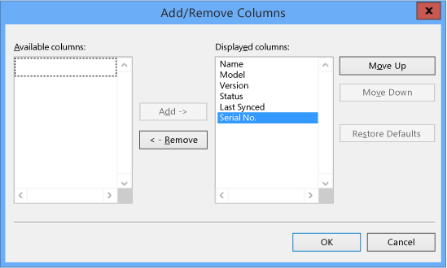
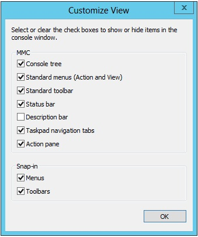
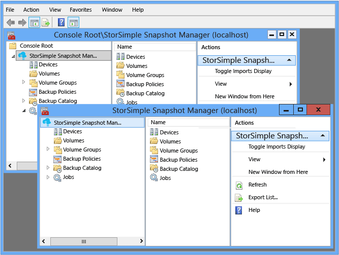
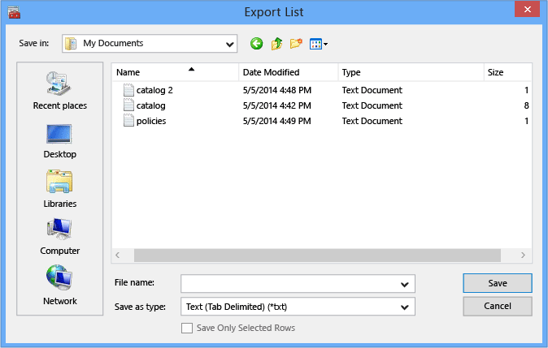

<properties 
   pageTitle="StorSimple Snapshot-Manager MMC im Menüaktionen | Microsoft Azure"
   description="Beschreibt, wie die standardmäßige Microsoft Management Console (MMC) im Menüaktionen in StorSimple Snapshot-Manager verwenden."
   services="storsimple"
   documentationCenter="NA"
   authors="SharS"
   manager="carmonm"
   editor="" />
<tags 
   ms.service="storsimple"
   ms.devlang="NA"
   ms.topic="article"
   ms.tgt_pltfrm="NA"
   ms.workload="TBD"
   ms.date="04/25/2016"
   ms.author="v-sharos" />

# Verwenden Sie die MMC im Menüaktionen in StorSimple Snapshot-Manager

## (Übersicht)

StorSimple Snapshot-Manager, sehen Sie die folgenden Aktionen auf alle Aktionsmenüs und alle Variationen der Bereich **Aktionen** aufgeführt. 

- Ansicht
- Neues Fenster 
- Aktualisieren 
- Exportieren einer Liste 
- Hilfe 

Diese Aktionen sind Teil des Microsoft Management Console (MMC) und sind nicht spezifisch auf StorSimple Snapshot-Manager. In diesem Lernprogramm werden diese Aktionen beschrieben und erläutert, wie Sie diese in StorSimple Snapshot-Manager verwenden.

## Ansicht

Sie können **die Ansichtsoption** so ändern Sie die Ansicht im Bereich **Ergebnisse** und zum Ändern der Ansicht des Console verwenden. 

#### So ändern Sie die Ergebnisse im Bereichsansicht

1. Klicken Sie auf das Desktopsymbol um StorSimple Snapshot-Manager zu starten.

2. Klicken Sie im **Bereich** mit der rechten Maustaste in einen beliebigen Knoten oder Erweitern Sie den Knoten mit der rechten Maustaste ein Element im **Ergebnisbereich** , und klicken Sie dann auf die Option **Ansicht** . 

3. Zum Hinzufügen oder Entfernen von im **Ergebnisbereich** die Spalten, die angezeigt werden, klicken Sie auf **Spalten hinzufügen/entfernen**. Das Dialogfeld **Spalten hinzufügen/entfernen** wird angezeigt.

     

4. Füllen Sie das Formular wie folgt ein:

    - Wählen Sie Elemente aus der Liste **Verfügbare** Spalten aus, und klicken Sie auf **Hinzufügen** , um sie zu der Liste **Angezeigte Spalten** hinzuzufügen. 

    - Klicken Sie auf Elemente in der Liste **Angezeigte Spalten** , und klicken Sie auf **Entfernen** , um sie aus der Liste entfernen. 

    - Wählen Sie ein Element in der Liste **angezeigte** Spalten aus, und klicken Sie auf **Nach oben** oder **Nach unten** , um das Element in der Liste nach oben oder unten verschieben. 

    - Klicken Sie auf **Standard wiederherstellen** , um auf die **Ergebnisse** im Bereichskonfiguration zurückzukehren. 

5. Wenn Sie mit Ihrer Auswahl fertig sind, klicken Sie auf **OK**. 

#### Ändern die Ansicht des Konsole

1. Klicken Sie auf das Desktopsymbol um StorSimple Snapshot-Manager zu starten.

2. Klicken Sie im **Bereich** mit der rechten Maustaste in einen beliebigen Knoten, klicken Sie auf **Ansicht**, und klicken Sie dann auf **Anpassen**. Das Dialogfeld **Anpassen** wird angezeigt.

     

3. Aktivieren Sie oder deaktivieren Sie das Kontrollkästchen zum ein- oder Ausblenden von Elementen im Fenster Konsole. Wenn Sie mit Ihrer Auswahl fertig sind, klicken Sie auf **OK**.

## Neues Fenster

Die Option **Neues Fenster** können um ein neue Console-Fenster zu öffnen.

#### Um ein neues Console-Fenster zu öffnen.

1. Klicken Sie auf das Desktopsymbol um StorSimple Snapshot-Manager zu starten.

2. Klicken Sie im **Bereich** mit der rechten Maustaste in einen beliebigen Knoten, und klicken Sie dann auf **Neues Fenster**. 

    Ein neues Fenster angezeigt wird, mit der nur dem Bereich, die Sie ausgewählt haben. Beispielsweise, wenn Sie den Knoten **Zusätzliche Richtlinien** mit der rechten Maustaste, wird das neue Fenster nur den Knoten **Zusätzliche Richtlinien** im **Umfang** und eine Liste der definierten Sicherung Richtlinien im **Ergebnisbereich** angezeigt. Im folgende Beispiel wird angezeigt.

     
 
## Aktualisieren

Die Aktion **Aktualisieren** können Sie das Konsolenfenster aktualisieren.

#### Aktualisieren Sie das Konsolenfenster

1. Klicken Sie auf das Desktopsymbol um StorSimple Snapshot-Manager zu starten.

2. Klicken Sie im **Bereich** mit der rechten Maustaste in einen beliebigen Knoten oder Erweitern Sie den Knoten mit der rechten Maustaste ein Element im **Ergebnisbereich** , und klicken Sie dann auf **Aktualisieren**. 

## Exportieren einer Liste

Die Aktion **Liste exportieren** können Sie eine Liste in eine Datei durch Trennzeichen getrennte Werte (CSV) speichern. Beispielsweise können Sie die Liste der Sicherungsdatei Richtlinien oder die Sicherung Katalog exportieren. Sie können dann die CSV-Datei in einem Tabellenkalkulationsprogramm für die Analyse importieren.

#### Zum Speichern einer Liste in eine durch Trennzeichen getrennte Werte (CSV)

1. Klicken Sie auf das Desktopsymbol um StorSimple Snapshot-Manager zu starten. 

2. Klicken Sie im **Bereich** mit der rechten Maustaste in einen beliebigen Knoten oder Erweitern Sie den Knoten mit der rechten Maustaste ein Element im **Ergebnisbereich** , und klicken Sie dann auf **Liste exportieren**. 

3. Das Dialogfeld **Liste exportieren** wird angezeigt. Füllen Sie das Formular wie folgt ein: 

    1. In das Feld **Dateiname** einen Namen für die CSV-Datei, oder klicken Sie auf den Pfeil in der Dropdown-Liste auswählen.

    2. Klicken Sie im Feld **Dateityp** auf den Pfeil, und wählen Sie einen Dateityp aus der Dropdownliste aus.

    3. Wenn Sie nur ausgewählte Elemente speichern möchten, markieren Sie die Zeilen, und klicken Sie dann auf das Kontrollkästchen **Nur markierte Zeilen speichern** . Deaktivieren Sie das Kontrollkästchen **Nur markierte Zeilen speichern** , um alle exportierten Listen zu speichern.

    4. Klicken Sie auf **Speichern**.

     
 
## Hilfe

Sie können im **Hilfemenü** verwenden, um zur Verfügung Onlinehilfe für StorSimple Snapshot-Manager und die MMC anzuzeigen.

#### Zum Anzeigen der verfügbaren online-Hilfe

1. Klicken Sie auf das Desktopsymbol um StorSimple Snapshot-Manager zu starten.

2. Klicken Sie im **Bereich** mit der rechten Maustaste in einen beliebigen Knoten oder Erweitern Sie den Knoten mit der rechten Maustaste ein Element im **Ergebnisbereich** , und klicken Sie dann auf **Hilfe**. 

## Nächste Schritte

- Erfahren Sie mehr über die [Benutzeroberfläche StorSimple Snapshot-Manager](storsimple-use-snapshot-manager.md).
- Weitere Informationen zum [Verwenden von StorSimple Snapshot-Manager zu Ihrer Lösung StorSimple verwalten](storsimple-snapshot-manager-admin.md).
