<properties 
   pageTitle="StorSimple Snapshot-Manager-Benutzeroberfläche | Microsoft Azure"
   description="Beschreibt die Benutzeroberfläche StorSimple Snapshot-Manager und erläutert, wie Sie es verwenden, um zusätzliche Aufträge und die Sicherung Katalog verwalten."
   services="storsimple"
   documentationCenter="NA"
   authors="SharS"
   manager="carmonm"
   editor="" />
<tags 
   ms.service="storsimple"
   ms.devlang="NA"
   ms.topic="article"
   ms.tgt_pltfrm="NA"
   ms.workload="TBD"
   ms.date="04/25/2016"
   ms.author="v-sharos" />

# StorSimple Snapshot-Manager-Benutzeroberfläche

## (Übersicht)

Den StorSimple Snapshot-Manager verfügt über eine intuitive Benutzeroberfläche, die Sie zum Erstellen und Verwalten von Sicherungskopien verwenden können. In diesem Lernprogramm bietet eine Einführung in die Benutzeroberfläche und dann erläutert, wie Sie die einzelnen Komponenten verwenden. Eine detaillierte Beschreibung der StorSimple Snapshot-Manager, finden Sie unter [Neuigkeiten StorSimple Snapshot-Manager?](storsimple-what-is-snapshot-manager.md)

### Beschreibung der Verwaltungskonsole

Wenn die Benutzeroberfläche anzeigen möchten, klicken Sie auf das Symbol StorSimple Snapshot-Manager auf dem Desktop. Das Console-Fenster wird angezeigt, wie in der folgenden Abbildung gezeigt.

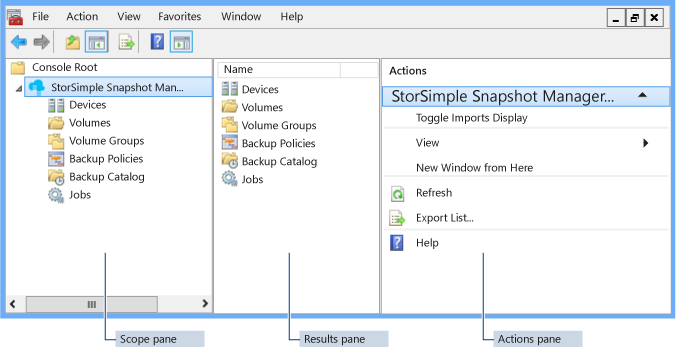

Das Konsolenfenster weist die fünf wichtigsten Elemente. Klicken Sie auf die entsprechende Verknüpfung für eine vollständige Beschreibung der einzelnen Elemente.

- [Menüleiste](#menu-bar) 
- [Tool-Leiste](#tool-bar) 
- [Klicken Sie im Bereich Umfang](#scope-pane) 
- [Bereich ' Suchergebnisse '](#results-pane) 
- [Klicken Sie im Aktionsbereich](#actions-pane) 

Darüber hinaus unterstützt den StorSimple Snapshot-Manager [Tastaturnavigation und eine Reihe von Tastenkombinationen](#keyboard-navigation-and-shortcuts).

### Console-Eingabehilfen

Die Benutzeroberfläche StorSimple Snapshot-Manager unterstützt die Barrierefreiheitsfeatures von Windows-Betriebssystems und Microsoft Management Console (MMC) sowie einige Tastenkombinationen StorSimple Snapshot-Manager – speziell bereitgestellt. 

- Eine Beschreibung der Windows-Eingabehilfen finden Sie unter [Tastenkombinationen für Windows](https://support.microsoft.com/kb/126449). 

- Eine Beschreibung der MMC Eingabehilfen wechseln Sie zu [Eingabehilfen für MMC 3.0](https://technet.microsoft.com/library/cc766075.aspx)

- Eine Beschreibung der Eingabehilfen StorSimple Snapshot-Manager wechseln Sie zu [Tastaturnavigation und Tastenkombinationen](#keyboard-navigation-and-shortcuts).

## Menüleiste

Die Menüleiste am oberen Rand der Console-Fensters enthält [Datei](#file-menu), [Aktion](#action-menu), [Ansicht](#view-menu), [Favoriten](#favorites-menu), [Fenster](#window-menu)und [Hilfe](#help-menu) Menüs.

Klicken Sie auf ein Element in der Menüleiste, um eine Liste der verfügbaren Befehle in diesem Menü anzuzeigen. Im folgenden Beispiel wird im Menü **Ansicht** auf die Menüleiste ausgewählt.

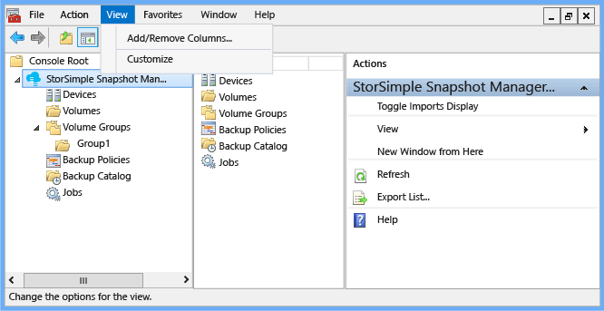

### Menü ' Datei '

Klicken Sie im Menü **Datei** Befehle standard Microsoft Management Console (MMC).

#### Menü access

Klicken Sie zum Anzeigen im Menüs **Datei** auf der Menüleiste auf **Datei** . Das folgende Menü wird angezeigt.

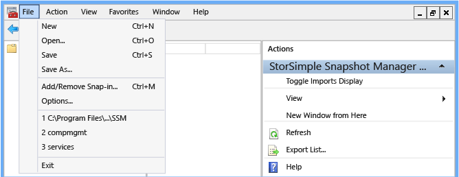 

#### Menü Beschreibung

Die folgende Tabelle beschreibt die angezeigten Elemente im Menü **Datei** .

| Menüelement | Beschreibung |
|:----------|:-------------|
| Neu       | Klicken Sie auf **neu** , um eine neue Konsole basierend auf den StorSimple Snapshot-Manager zu erstellen. |
| Öffnen      | Klicken Sie auf **Öffnen** , um eine vorhandene Konsole zu öffnen. |
| Speichern      | Klicken Sie auf **Speichern** , um die aktuelle Konsole speichern. |
| Speichern unter   | Klicken Sie auf **Speichern unter** um eine neue Instanz der aktuellen Konsole umbenannten zu erstellen. Verwenden Sie die Option **Speichern unter** zum Anpassen einer Ansicht und zur späteren Abruf zu speichern. Beispielsweise konnten Sie StorSimple Snapshot-Manager-Snap-ins erstellen, die auf bestimmte Server verweisen. |
| Snap-in hinzufügen/entfernen | Klicken Sie auf **Hinzufügen/Entfernen-Snap-in** hinzufügen oder Entfernen von Snap-ins und Knoten klicken Sie im **Bereich** zu organisieren. Weitere Informationen zum [Hinzufügen, entfernen, und Organisieren Snap-ins und Erweiterungen in MMC 3.0](https://technet.microsoft.com/library/cc722035.aspx)wechseln. |
| Optionen   | Klicken Sie auf **Optionen** , um das Konsolensymbol ändern, geben Sie Access-Benutzermodi und Berechtigungen oder Löschen von Console-Dateien, um den verfügbaren Speicherplatz zu vergrößern. |
| Liste der Dateipfade | Klicken Sie auf einen Pfad in der nummerierten Liste in eine Datei geöffnet, die Sie zuletzt geöffnet haben. |
| Beenden      | Klicken Sie auf **Beenden** , um das Menü **Datei** zu schließen. |
 
### Aktionsmenü

Verwenden Sie im **Aktionsmenü** auswählen von verfügbaren Aktionen. Die Elemente, die Ihnen zur Verfügung, abhängig von der Auswahl, die Sie in den **Bereich** oder **Ergebnisbereich** vornehmen.

#### Menü access

Wenn im **Aktionsmenü** anzeigen möchten, führen Sie eine der folgenden Aktionen aus:

- Mit der rechten Maustaste ein Element im **Bereich** Bereich oder im **Ergebnisbereich** .

- Wählen Sie ein Element im **Bereich** oder **Ergebnisbereich** , und klicken Sie dann auf der Menüleiste auf **Aktion** . 

Wenn Sie wählen Sie den obersten Knoten im **Bereich** , und klicken Sie dann mit der rechten Maustaste oder klicken Sie in der Menüleiste auf **Aktion** , wird beispielsweise das folgende Menü angezeigt.
 
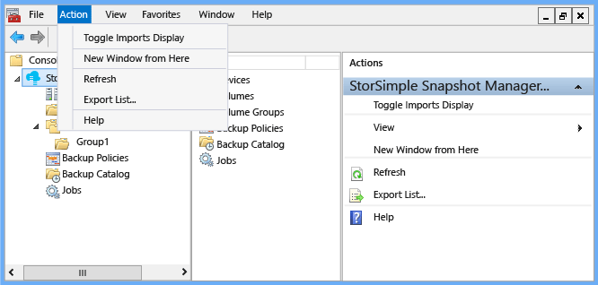

Die **Aktionen** (im rechten Bereich der Konsole) enthält die gleiche Liste von Aktionen wie im **Aktionsmenü** . Klicken Sie im Bereich **Aktionen** enthält darüber hinaus die Menüoptionen **Anzeigen** , mit die Sie eine benutzerdefinierte Ansicht im **Ergebnisbereich** erstellen können.

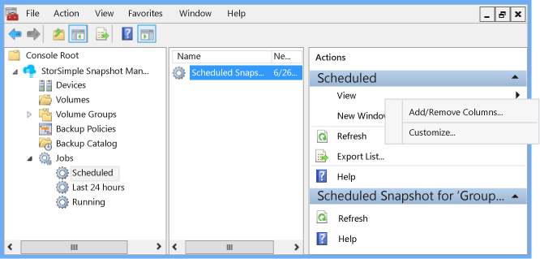

#### Menü Beschreibung

Die folgende Tabelle enthält eine Liste alphabetische Aktionen StorSimple Snapshot-Manager. 

- Die **Aktion** Spalte listet die Aktionen, die Sie auf Knoten und Ergebnisse ausführen können. 

- Die **Navigationsbereich** Spalte wird erläutert, wie **das entsprechende Aktionsmenü** anzeigen, damit Sie die Aktion auswählen können. Einige Aktionen werden mehrere **Aktion** Menüs angezeigt. Wählen Sie für diese Aktionen eine **Navigation** Option aus der Liste aus. 

- In der Spalte **Beschreibung** beschrieben, wie Sie jede Aktion auf **Aktionsmenü** oder Aktionsbereich verwenden, und erläutert, was bedeutet.

>[AZURE.NOTE] Der Bereich **Aktionen** und die **Aktion** Menüs enthalten weitere Optionen, z. B. **Anzeigen**, **Neues Fenster**, **Aktualisieren**, **Liste exportieren**und **helfen**. Diese Optionen stehen als Teil der MMC und sind nicht spezifisch auf StorSimple Snapshot-Manager. Die Tabelle enthält eine Beschreibung dieser Optionen.
 
| Aktion  | Navigationsbereich  | Beschreibung  |
|:--------|:------------|:-------------|
| Authentifizieren | Klicken Sie auf den Knoten **Geräte** , und mit der rechten Maustaste ein Gerät im **Ergebnisbereich** . | Klicken Sie auf **authentifizieren** , um das Kennwort einzugeben, das Sie für das Gerät konfiguriert. |
| Datenbeschriftungsreihe  | Erweitern Sie **Zusätzliche Katalog**zu, erweitern Sie **Cloud Momentaufnahmen**zu, klicken Sie auf dem Sicherung und wählen Sie dann einen Datenträger im **Ergebnisbereich** . | Klicken Sie auf **Datenbeschriftungsreihe** , um eine Kopie einer Momentaufnahme Cloud erstellen und speichern Sie es an einem Speicherort, den Sie festlegen. |
| Konfigurieren eines Geräts | Mit der rechten Maustaste in des **Geräte** -Knotens. | Klicken Sie auf **einem Gerät konfigurieren** , um eine einzelne oder mehrere Geräte in Verbindung mit dem Windows-Host zu konfigurieren. |
| Erstellen Sie zusätzliche Richtlinie | Führen Sie eine der folgenden Aktionen aus:<ul><li>Mit der rechten Maustaste in der **Sicherungsdatei Richtlinien**.</li><li>Klicken Sie auf oder **Volume-Gruppen**erweitern und anschließend mit der Maustaste einer Volume-Gruppe.</li><li>Klicken Sie auf oder **Sicherungskatalog**zu erweitern, und anschließend mit der Maustaste einer Volume-Gruppe.</li></ul> | Klicken Sie auf **Erstellen zusätzliche Richtlinie** zum Konfigurieren einer geplanten Sicherung für eine Gruppe Lautstärke. |
| Erstellen von Volume-Gruppe | Führen Sie eine der folgenden Aktionen aus:<ul><li>Klicken Sie auf den Knoten **Datenmengen** , und anschließend mit der Maustaste ein Volume im **Ergebnisbereich** .</li><li>Mit der rechten Maustaste in des Knotens **Lautstärke Gruppen** .</li></ul> | Klicken Sie auf **Lautstärke Gruppe erstellen** , um einer Volumegruppe Datenmengen zuweisen. |
| Löschen | Klicken Sie auf einen Knoten oder ein Ergebnis (dieses Element wird auf viele **Aktion** Menüs und in Fenstern **Aktionen** angezeigt.) | Klicken Sie auf **Löschen** , um das Löschen der Knoten oder das Ergebnis, das Sie ausgewählt haben. Wenn das Dialogfeld zur Bestätigung angezeigt wird, bestätigen Sie oder Abbrechen Sie des Löschvorgangs. |
| Details | Klicken Sie auf den Knoten **Geräte** und anschließend mit der Maustaste ein Gerät im **Ergebnisbereich** . | Klicken Sie auf **Details** , um die Konfigurationsdetails für ein Gerät anzuzeigen. |
| Bearbeiten | Klicken Sie auf **Sichern Richtlinien**, und anschließend mit der Maustaste einer Richtlinie im **Ergebnisbereich** . | Klicken Sie auf **Bearbeiten** , um die Sicherungsdatei Zeitplan für eine Volume-Gruppe ändern. |
| Exportieren einer Liste | Klicken Sie auf eine beliebige Knoten oder Ergebnis (dieses Element wird auf alle **Aktion** Menüs und in Fenstern **Aktionen** angezeigt.) | Klicken Sie auf **Liste exportieren** , um eine Liste in eine Datei durch Trennzeichen getrennte Werte (CSV) speichern. Sie können diese Datei dann in einem Tabellenkalkulationsprogramm für die Analyse importieren. |
| Hilfe | Klicken Sie auf eine beliebige Knoten oder Ergebnis. (Dieses Element wird auf alle **Aktion** Menüs und in Fenstern **Aktionen** angezeigt.) | Klicken Sie auf **Hilfe** , um die Onlinehilfe in einem eigenen Browserfenster geöffnet. |
| Neues Fenster | Klicken Sie auf eine beliebige Knoten oder Ergebnis (dieses Element wird auf alle **Aktion** Menüs und in Fenstern **Aktionen** angezeigt.) | Klicken Sie auf **Neues Fenster** , um ein neues StorSimple Snapshot-Manager-Fenster zu öffnen.|
| Aktualisieren | Klicken Sie auf eine beliebige Knoten oder Ergebnis (dieses Element wird auf alle **Aktion** Menüs und in Fenstern **Aktionen** angezeigt.) | Klicken Sie auf **Aktualisieren** , um das aktuell angezeigte StorSimple Snapshot-Manager-Fenster zu aktualisieren. |
| Aktualisieren des Geräts | Klicken Sie auf den Knoten **Geräte** , und mit der rechten Maustaste ein Gerät im **Ergebnisbereich** . | Klicken Sie auf **Gerät aktualisieren** , um ein bestimmtes verbundenen Gerät mit StorSimple Snapshot-Manager zu synchronisieren. |
| Aktualisieren von Geräten | Mit der rechten Maustaste in des **Geräte** -Knotens. | Klicken Sie auf **Geräte aktualisieren** , um die Liste der verbundenen Geräte mit StorSimple Snapshot-Manager zu synchronisieren. |
| Neu einlesen Datenmengen | Mit der rechten Maustaste in des **Datenmengen** Knotens. | Klicken Sie auf **neu einlesen Datenmengen** , um die Liste der Datenträger zu aktualisieren, die im **Ergebnisbereich** angezeigt wird. |
| Stellen Sie wieder her | Erweitern Sie **Zusätzliche Katalog**eine Volume-Gruppe zu erweitern, **Lokale Momentaufnahmen** oder **Cloud Momentaufnahmen**, und anschließend mit der Maustaste einer Sicherungskopie. | Klicken Sie auf **Wiederherstellen** , um die aktuelle Lautstärke Gruppieren von Daten mit den Daten aus der ausgewählten Sicherung zu ersetzen. |
| Nehmen Sie Sicherung | Führen Sie eine der folgenden Aktionen aus:<ul><li>**Volume-Gruppen**erweitern und anschließend mit der Maustaste einer Volume-Gruppe.</li><li>**Sicherungskatalog**zu erweitern, und anschließend mit der Maustaste einer Volume-Gruppe.</li></ul> | Klicken Sie auf **Übernehmen Sicherung** um eine Sicherung sofort zu starten. |
| Umschaltfläche Importe anzeigen | Mit der rechten Maustaste in des obersten Knotens klicken Sie im **Bereich** (den **StorSimple Snapshot-Manager** -Knoten in den Beispielen). | Klicken Sie auf **Den Schalter Importe anzeigen** zum ein- oder Ausblenden der Lautstärke Gruppen und die zugehörigen Sicherungskopien, die vom Dienst StorSimple Manager-Dashboard importiert wurden. |

### Menü ' Ansicht '

Verwenden Sie im Menü **Ansicht** zum Erstellen einer benutzerdefinierten Ansicht des Inhalts Bereich **Ergebnisse** an. Klicken Sie im Menü **Ansicht** enthält **Spalten hinzufügen/entfernen** und **Anpassen** von Optionen.

#### Menü access

Sie können im Menü **Ansicht** auf der Menüleiste oder im Bereich **Aktionen** zugreifen.

 

#### Menü Beschreibung

Die folgende Tabelle beschreibt die angezeigten Elemente im Menü **Ansicht** .

| Menüelement  | Beschreibung |
|:-----------|:-------------|
| Hinzufügen/Entfernen von Spalten | Klicken Sie auf **Spalten hinzufügen/entfernen** , um hinzufügen oder Entfernen von Spalten im **Ergebnisbereich** . |
| Anpassen | Klicken Sie auf **Anpassen** , um ein- oder Ausblenden von Elementen im Konsolenfenster StorSimple Snapshot-Manager. |

### Menü "Favoriten"

Verwenden Sie das Menü **"Favoriten"** hinzufügen, entfernen und Organisieren von Seitenansichten und Aufgaben, die Sie häufig verwenden. 

#### Menü access

Sie können das Menü " **Favoriten** " in der Menüleiste zugreifen.

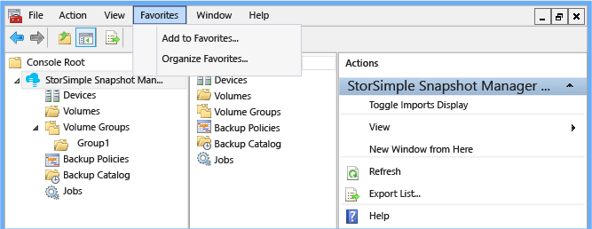

#### Menü Beschreibung

Die folgende Tabelle beschreibt die angezeigten Elemente im Menü **Favoriten** .

| Menüelement |  Beschreibung |
|:----------|:-------------|
| Zu Favoriten hinzufügen | Klicken Sie auf **zu Favoriten hinzufügen** , um die aktuelle Ansicht zu Ihrer Liste der Favoriten hinzufügen. |
| Organisieren von Favoriten | Klicken Sie auf **"Favoriten verwalten"** , um den Inhalt des Ordners "Favoriten" zu organisieren. |

### Menü ' Fenster '

Verwenden Sie im Menü **Fenster** zum Hinzufügen und Neupositionieren von StorSimple Snapshot-Manager Console Windows an.

#### Menü access

Sie können im Menü **Fenster** in der Menüleiste zugreifen.

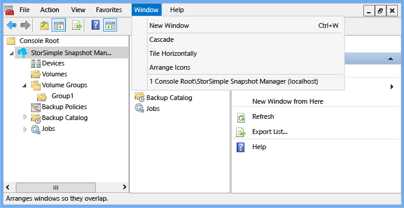

Die nummerierte Liste am unteren Rand des Menüs zeigt, dass der momentan Windows öffnen. Klicken Sie auf alle Fenster in dieser Liste, um das Fenster in den Vordergrund zu bringen. 

#### Menü Beschreibung

Die folgende Tabelle beschreibt die Elemente, die angezeigt werden, klicken Sie auf das Menü Fenster.

| Menüelement  | Beschreibung |
|:-----------|:-------------|
| Neues Fenster | Klicken Sie auf **Neues Fenster** zum Öffnen eines neuen Console-Fensters (zusätzlich zu den vorhandenen Fenster). |
| Löschweitergabe   | Klicken Sie auf **Cascade** zum Anzeigen des Windows öffnen in einem cascading Style. |
| Horizontal anordnen | Klicken Sie auf **Horizontal Kachel** zum Anzeigen des Windows öffnen in einem Format Kachel (oder-Raster). |
| Symbole anordnen | Wenn Sie mehrere Konsole haben, Windows öffnen und verteilt über Ihren Desktop minimieren, und klicken Sie dann auf **Symbole anordnen** , um diese in einer horizontalen Zeile an den Fuß des Bildschirms angeordnet werden. |

### Menü ' Hilfe '

Verwenden Sie das Menü **Hilfe** , um verfügbare Onlinehilfe für StorSimple Snapshot-Manager und die MMC anzuzeigen. Sie können auch Informationen zu den Versionen der Software MMC und StorSimple Snapshot-Manager anzeigen, die aktuell auf Ihrem System installiert werden. 

Sie können das Menü **** auf die Menüleiste zugreifen. Sie können auch Hilfethemen StorSimple Snapshot-Manager aus dem Bereich **Aktionen** zugreifen.

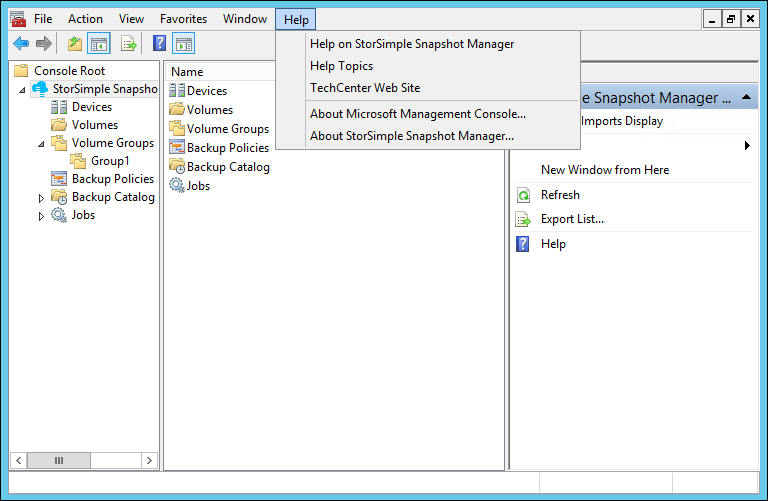

#### Menü Beschreibung

Die folgende Tabelle beschreibt die angezeigten Elemente im Hilfemenü an.

| Menüelement  | Beschreibung  |
|:-----------|:-------------|
| Hilfe zum StorSimple Snapshot-Manager | Klicken Sie auf **Hilfe klicken Sie auf StorSimple Snapshot-Manager** , um StorSimple Snapshot-Manager-Hilfe in einem separaten Fenster zu öffnen. |
| Hilfethemen |Klicken Sie auf **Hilfethemen** , um die Onlinehilfe MMC in einem separaten Fenster zu öffnen. |
| TechCenter-Website | Klicken Sie auf **TechNet-Website** , um die Homepage von Microsoft TechNet Tech Center in einem separaten Fenster zu öffnen. |
| Informationen zu Microsoft Management Console | Klicken Sie auf **Informationen zu Microsoft Management Console** , um anzuzeigen, welche Version von Microsoft Management Console auf Ihrem System installiert ist. |
| Informationen zu StorSimple Snapshot-Manager | Klicken Sie auf **Zu StorSimple Snapshot-Manager** , um anzuzeigen, welche Version des Snap-Ins auf Ihrem Computer installiert ist. |

## Tool-Leiste

Die Tool-Leiste unterhalb der Menüleiste enthält Symbole für Navigation und Aufgabe. Jedes Symbol wird eine Verknüpfung zu einer bestimmten Aufgabe.

### Beschreibungen der Symbole

Die folgende Tabelle beschreibt die Symbole, die angezeigt werden, klicken Sie auf der Symbolleiste. 

| Symbol  | Beschreibung  |
|:------|:-------------| 
|  | Klicken Sie auf den Pfeil nach links, um zur vorherigen Seite zurückzukehren. |
|  | Klicken Sie auf den Pfeil nach rechts, um zur nächsten Seite zu wechseln (wenn der Pfeil grau dargestellt ist, die Aktion ist nicht verfügbar). |
|  | Klicken Sie auf das Symbol oben im Strukturbaum **(Bereich)** eine Ebene nach oben wechseln. |
|  | Klicken Sie auf das ein-/ausblenden Console Struktursymbol zum ein- oder Ausblenden des Bereichs **Umfang** . |
|  | Klicken Sie auf das Symbol für den Exportvorgang Liste um eine Liste in eine CSV-Datei exportieren, die Sie angeben. |
|   |Klicken Sie auf das Hilfesymbol, um eine online MMC Hilfethema zu öffnen. |
|  | Klicken Sie auf einblenden/ausblenden **Aktionen** Bereich Symbol zum ein- oder Ausblenden des Bereichs **Aktionen** . 
 
## Klicken Sie im Bereich Umfang

Klicken Sie im **Bereich** ist ganz links im der UI StorSimple Snapshot-Manager. Es enthält die Struktur Console (oder Knoten) und die primäre Navigation Verfahren für StorSimple Snapshot-Manager. 
 
### Bereich Bereich Struktur

Klicken Sie im **Bereich** enthält eine Reihe von anklickbare Objekte (Knoten) in einer Baumstruktur angeordnet. 

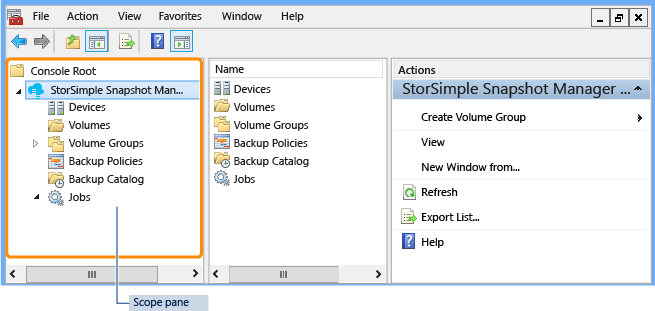 

- Um zu erweitern oder reduzieren einen Knoten, klicken Sie auf das Pfeilsymbol neben dem Knotennamen.

- Wenn Sie den Status oder den Inhalt eines Knotens anzeigen möchten, klicken Sie auf den Knotennamen. Die Informationen werden im **Ergebnisbereich** angezeigt. 

Klicken Sie im **Bereich** enthält die folgenden Knoten: 

- [Geräteknoten](#devices-node) 
- [Datenmengen Knoten](#volumes-node) 
- [Volumen-Gruppenknoten](#volume-groups-node) 
- [Sichern von Richtlinien Knoten](#backup-policies-node) 
- [Sichern der Katalog-Knoten](#backup-catalog-node) 
- [Aufträge Knoten](#jobs-node) 

### Klicken Sie im Bereich Aufgaben

Im **Bereich** können zum Ausführen einer Aktion auf einem bestimmten Knoten. Um einen Vorgang auszuwählen, führen Sie eine der folgenden Aktionen aus:

- Mit der rechten Maustaste in des Knotens, und wählen Sie dann die Aufgabe aus, aus dem Menü, das angezeigt wird.

- Klicken Sie auf den Knoten, und klicken Sie dann auf der Menüleiste auf **Aktion** . Wählen Sie die Aufgabe aus der, das daraufhin angezeigten Menü aus.

- Klicken Sie auf den Knoten, und wählen Sie dann im Bereich **Aktionen** die Aktion.

Wenn Sie einen Knoten auswählen und verwenden eine der folgenden Methoden, um eine Aufgabenliste anzuzeigen, werden nur die Aktionen, die auf diesem Knoten ausgeführt werden, können angezeigt.

### Geräteknoten

Den **Geräte** -Knoten darstellt, der StorSimple Geräte und StorSimple virtuelle Geräte, die mit StorSimple Snapshot Manager verbunden sind. Wählen Sie diese Knoten verbinden und konfigurieren ein Gerät aus, und importieren Sie seine zugeordneten Datenmengen, Datenmengen Gruppen und vorhandene Sicherungskopien zu. Mehrere Geräte können mit einem einzigen Host verbunden sein.

- Um den Knoten zu erweitern, klicken Sie auf das Pfeilsymbol neben **Geräte**.

- Um ein Menü mit verfügbaren Aktionen anzuzeigen, mit der rechten Maustaste in des **Geräte** -Knotens oder mit der rechten Maustaste Knoten, die in der erweiterten Ansicht angezeigt werden.

- Klicken Sie zum Anzeigen einer Liste von konfigurierten Geräten, klicken Sie im **Bereich** auf **Geräte** . Die Liste der Geräte, zusammen mit Informationen zu jedem Gerät, wird im **Ergebnisbereich** angezeigt.

### Datenmengen Knoten

Der **Datenmengen** Knoten stellt die Laufwerke, die vom Host, einschließlich der Empfänger ermittelt, indem eine iSCSI und die Behebung über ein Gerät aktivierten Datenträger entsprechen. Verwenden Sie diesen Knoten, um die Liste der verfügbaren Datenträger anzeigen, und weisen Sie einzelne Datenmengen Volume-Gruppen.

- Um den Knoten zu erweitern, klicken Sie auf das Pfeilsymbol neben **Datenmengen**.

- Um ein Menü mit verfügbaren Aktionen anzuzeigen, mit der rechten Maustaste in des Knotens **Datenmengen** oder mit der rechten Maustaste Knoten, die in der erweiterten Ansicht angezeigt werden.

- Um eine Liste der Datenträger anzuzeigen, klicken Sie im **Bereich** **Datenmengen** auf. Die Liste der Datenträger, zusammen mit Informationen zu jedem Datenträger, wird im **Ergebnisbereich** angezeigt.

### Volumen-Gruppenknoten

Volumegruppen sind auch bekannt als Konsistenzgruppen. Jede Gruppe Lautstärke ist ein Pool Anwendung-bezogene Datenmengen, der Anwendung Konsistenz während zusätzliche Vorgänge hindert. Verwenden Sie den **Volume-Gruppen** -Knoten so konfigurieren Sie diesen Gruppen und zum Erstellen interaktiver Sicherungskopien oder zusätzliche Zeitpläne erstellen. 

- Klicken Sie auf das Pfeilsymbol neben **Volume-Gruppen**, um den Knoten zu erweitern.

- Um ein Menü mit verfügbaren Aktionen anzuzeigen, mit der rechten Maustaste in des Knotens **Lautstärke Gruppen** oder mit der rechten Maustaste Knoten, die in der erweiterten Ansicht angezeigt werden.

- Klicken Sie zum Anzeigen einer Liste von Volume-Gruppen, klicken Sie im **Bereich** auf **Volume-Gruppen** . Die Liste der Lautstärke Gruppen, zusammen mit Informationen zu jeder Gruppe Lautstärke wird im **Ergebnisbereich** angezeigt.

### Sichern von Richtlinien Knoten

Zusätzliche Richtlinien sind für lokale Projektpläne und Momentaufnahmen cloud. Verwenden Sie den Knoten **Zusätzliche Richtlinien** , um anzugeben, wie oft eine Sicherungskopie erstellt wird und wie lange eine Sicherung sollte beibehalten werden. 

- Klicken Sie auf das Pfeilsymbol neben **Sicherung Richtlinien**, um den Knoten zu erweitern.

- Um ein Menü mit verfügbaren Aktionen anzuzeigen, mit der rechten Maustaste in des Knotens **Sicherung Richtlinien** oder mit der rechten Maustaste Knoten, die in der erweiterten Ansicht angezeigt werden.

- Um eine Liste der Sicherungsdatei Richtlinien anzuzeigen, klicken Sie auf **Zusätzliche Richtlinien** klicken Sie im **Bereich** . Die Liste der Sicherungsdatei Richtlinien, zusammen mit Informationen zu allen Richtlinien, wird im **Ergebnisbereich** angezeigt.

>[AZURE.NOTE] Sie können bis zu 64 Sicherungskopien beibehalten.

### Sichern der Katalog-Knoten

Der **Sicherungskatalog** Knoten enthält eine Liste von Azure StorSimple Datenmengen als auch an externen Sicherungen. Dieser Knoten Lautstärke Gruppen organisiert ist, und jedes Volume Gruppencontainer enthält separate Strukturen für lokale Momentaufnahmen (den Knoten **Lokale Snapshot**s) und Cloud Momentaufnahmen (die **Cloud Momentaufnahmen** -Knoten). Wenn erweitert, Listen jeden Lautstärke Gruppencontainer die erfolgreichen Sicherungen interaktiv oder durch eine Richtlinie konfigurierten geöffnet wurden.

- Um den Knoten zu erweitern, klicken Sie auf das Pfeilsymbol neben **Sicherungskatalog**.

- Um ein Menü mit verfügbaren Aktionen anzuzeigen, mit der rechten Maustaste in des **Katalog Sicherung** Knotens oder mit der rechten Maustaste Knoten, die in der erweiterten Ansicht angezeigt werden.

- Klicken Sie zum Anzeigen einer Liste der Sicherungsdatei Momentaufnahmen **Sicherungskatalog** klicken Sie im **Bereich** auf. Die Liste der Momentaufnahmen, zusammen mit Informationen zu jeder Snapshot, wird im **Ergebnisbereich** angezeigt.

### Lokalen Momentaufnahmen-Knoten

Der **Lokale Momentaufnahmen** Knoten Listen lokale Momentaufnahmen für eine bestimmte Volume-Gruppe. Der Knoten befindet sich unter dem Knoten **Sicherungskatalog** , klicken Sie im **Bereich** . Lokale Momentaufnahmen sind Point-in-Time Kopien von Volume-Daten, die auf dem Gerät Azure StorSimple gespeichert werden. Normalerweise kann diese Art der Sicherung erstellt und schnell wiederhergestellt werden. Wie eine lokale Sicherungskopie verwenden, können Sie eine lokale Momentaufnahme verwenden.

- Um den Knoten zu erweitern, klicken Sie auf das Pfeilsymbol neben **Lokale Momentaufnahmen**.

- Um ein Menü mit verfügbaren Aktionen anzuzeigen, mit der rechten Maustaste in des **Lokalen Momentaufnahmen** Knotens oder mit der rechten Maustaste Knoten, die in der erweiterten Ansicht angezeigt werden.

- Um eine Liste der lokalen Momentaufnahmen anzeigen möchten, klicken Sie auf **Lokale Momentaufnahmen** klicken Sie im **Bereich** . Die Liste der Momentaufnahmen, zusammen mit Informationen zu jeder Snapshot, wird im **Ergebnisbereich** angezeigt.

### Cloud Momentaufnahmen Knoten

Der **Cloud Momentaufnahmen** Knoten Listen Cloud Momentaufnahmen für eine bestimmte Volume-Gruppe. Der Knoten befindet sich unter dem Knoten **Sicherungskatalog** , klicken Sie im **Bereich** . Cloud Momentaufnahmen sind Point-in-Time-Kopien von Volume-Daten, die in der Cloud gespeichert werden. Eine Momentaufnahme der Cloud entspricht eine Momentaufnahme auf einem anderen externe Speicherung System repliziert. Cloud Momentaufnahmen sind Wiederherstellungssituationen besonders hilfreich.

- Um den Knoten zu erweitern, klicken Sie auf das Pfeilsymbol neben **Cloud Momentaufnahmen**.

- Um ein Menü mit verfügbaren Aktionen anzuzeigen, mit der rechten Maustaste in des **Cloud Momentaufnahmen** Knotens oder mit der rechten Maustaste Knoten, die in der erweiterten Ansicht angezeigt werden.

- Klicken Sie zum Anzeigen einer Liste der Cloud Momentaufnahmen **Cloud Momentaufnahmen** klicken Sie im **Bereich** auf. Die Liste der Momentaufnahmen, zusammen mit Informationen zu jeder Snapshot, wird im **Ergebnisbereich** angezeigt.

### Aufträge Knoten

Der **Einzelvorgänge** -Knoten enthält Informationen zur geplanten, ausgeführt werden und kürzlich abgeschlossenen Sicherung Aufträge. 

- Klicken Sie auf das Pfeilsymbol neben **Projekte**, erweitern Sie den Knoten.

- Um ein Menü mit verfügbaren Aktionen anzuzeigen, mit der rechten Maustaste in des Knotens **Aufträge** oder mit der rechten Maustaste Knoten, die in der erweiterten Ansicht angezeigt werden.

- Um eine Liste der geplanten Aufträge anzuzeigen, erweitern Sie den Knoten **Aufträge** , und klicken Sie dann auf **Geplante**. Die Liste der zuvor konfigurierte Aufträge und Informationen zu jedem Auftrag wird im **Ergebnisbereich** angezeigt. 

- Um eine Liste der zuletzt abgeschlossenen Aufträge anzuzeigen, erweitern Sie den Knoten **Aufträge** , und klicken Sie dann auf **Letzte 24 Stunden**. Eine Liste der Projekte, die in den letzten 24 Stunden abgeschlossen wurden, wird im **Ergebnisbereich** angezeigt. Im **Ergebnisbereich** enthält auch Informationen zu jedem abgeschlossenen Auftrag an.

- Um eine Liste der Aufträge angezeigt, die aktuell ausgeführt werden, erweitern Sie den Knoten **Aufträge** , und klicken Sie dann auf **Ausführen**. Die Liste der aktuell ausgeführten Einzelvorgänge und Informationen zu jedem Auftrag wird im **Ergebnisbereich** angezeigt.

## Bereich ' Suchergebnisse '

Im **Ergebnisbereich** wird im mittleren Bereich in der UI StorSimple Snapshot-Manager. Enthaltenen Listen und detaillierte Statusinformationen für den Knoten, die, den Sie im **Bereich** ausgewählt haben.

### Beispiel

Wenn im folgende Beispiel anzeigen möchten, klicken Sie auf den Knoten **Volume-Gruppen** , klicken Sie im **Bereich** . Im **Ergebnisbereich** zeigt eine Liste der Volume-Gruppen mit Details für jede Gruppe.

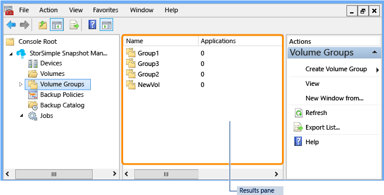 

Sie können die Angaben im **Ergebnisbereich** konfigurieren: mit der rechten Maustaste in eines Knotens klicken Sie im **Bereich** , klicken Sie auf **Ansicht**, und klicken Sie dann auf **Spalten hinzufügen/entfernen**.

## Klicken Sie im Aktionsbereich

Klicken Sie im Bereich **Aktionen** wird im rechten Bereich in der UI StorSimple Snapshot-Manager. Sie enthält ein Menü mit Vorgänge, die Sie ausführen können, klicken Sie auf den Knoten, anzeigen oder Daten, die Sie in den **Bereich** oder **Ergebnisbereich** auswählen. Klicken Sie im Bereich **Aktionen** enthält dieselben Befehle wie die Menüs **Aktion** , die für Elemente in den **Bereichs-** und **Ergebnisbereich** verfügbar sind. Eine Beschreibung der einzelnen Aktionen finden Sie unter der Tabelle im Menüabschnitt **Aktion** .

### Beispiele

Finden im folgende Beispiel, klicken Sie im **Bereich** , erweitern den Knoten **Aufträge** , und klicken Sie auf **geplant**. Im Bereich **Aktionen** zeigt die verfügbaren Aktionen für den Knoten **geplant** .

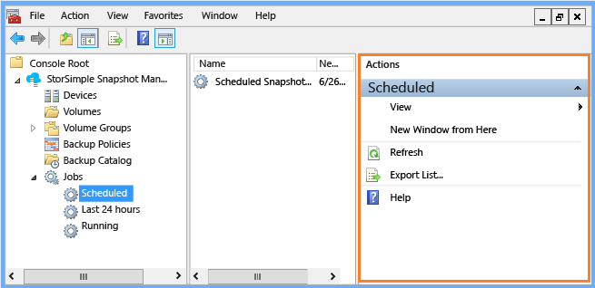 

Zum Anzeigen weiterer Optionen, klicken Sie im **Bereich** erweitern Sie den Knoten **Aufträge** , klicken Sie auf **Geplante**, und klicken Sie dann auf einen geplanten Auftrag im **Ergebnisbereich** . Klicken Sie im Bereich **Aktionen** zeigt die verfügbaren Aktionen für den geplanten Auftrag an, wie im folgenden Beispiel gezeigt.

## Tastaturnavigation und Tastenkombinationen

StorSimple Snapshot-Manager können die Barrierefreiheitsfeatures von Windows-Betriebssystem und die Microsoft Management Console (MMC). Darüber hinaus einige Features von Tastatur Navigation und Tastenkombinationen, die in den StorSimple Snapshot-Manager, spezifisch sind, wie in den folgenden Abschnitten beschrieben.
 
- [Tasten der Tastatur navigation](#keyboard-navigation-keys) 
- [Menüleiste Tastenkombinationen](#menu-bar-shortcut-keys) 
- [Tastenkombinationen für im Bereich](#scope-pane-shortcut-keys) 

### Tasten der Tastatur navigation

Die folgende Tabelle beschreibt die Tasten, die Sie verwenden können, um die Benutzeroberfläche StorSimple Snapshot-Manager zu navigieren. 

| Navigationsbereich-Taste  | Aktion  |
|:----------------|:--------| 
| Nach-unten-Taste | Verwenden Sie die nach-unten-Taste, um zum nächsten Element in einem Menü oder Bereich vertikal zu verschieben. |
| Geben Sie ein | Drücken Sie die EINGABETASTE, um eine Aktion ausführen, und fahren Sie mit dem nächsten Schritt fort. Beispielsweise können Sie die EINGABETASTE, wählen Sie **Weiter**, **OK**oder **Erstellen**, und fahren mit dem nächsten Schritt im Assistenten.|
| ESC | Drücken Sie die Esc-Taste, um ein Menü zu schließen, oder auf Abbrechen und Schließen einer Seite aus.|
| F1 | Drücken Sie F1 ein Hilfethema für das aktuell aktive Fenster anzeigen aus.|
| F5 | Drücken Sie F5, um einen Knoten zu aktualisieren. |
| F6 | Drücken Sie die Taste F6, um in den Bereich **Ergebnisse** aus **dem Bereich** zu verschieben.|
| F10 | Drücken Sie auf F10, um auf die Menüleiste zu wechseln. |
| Nach-links-Taste | Verwenden Sie die nach-links-Taste, um zur vorherigen Option horizontal aus einem Menü Balken verschieben. Wenn Sie zum vorherigen Element in der Menüleiste verschieben, wird das Menü Aktion (oder Kontext) für das vorherige Element angezeigt. |
| Nach-rechts-Taste | Verwenden Sie die rechts-Taste, um zur nächsten horizontal aus einem Balken Menüoption verschieben. Wenn Sie zum nächsten Element in der Menüleiste verschieben, wird das Menü Aktion (oder Kontext) für den neuen Eintrag angezeigt.
| TAB-Taste | Verwenden Sie die Tab-Taste, um zum nächsten Bereich auf die Verwaltungskonsole oder die nächste Auswahl oder das Textfeld auf einer Seite zu wechseln. |
| Pfeil nach oben | Verwenden Sie nach-oben-Taste, um vertikal auf das vorherige Element in einem Menü oder einen Bereich zu verschieben. |

### Menüleiste Tastenkombinationen

Die folgende Tabelle beschreibt die Tastenkombinationen für die Menüleiste. Nachdem Sie drücken Sie die Tastenkombination aus, und klicken Sie im Menü geöffnet wird, können Sie Tastenkombinationen für Menü (die unterstrichenen Schlüssel im Menü). Weitere Informationen zu der Menüleiste wechseln Sie zu [Menüleiste](#menu-bar).

| Kontextmenü | Ergebnis                    | Menü Tastenkombination | Ergebnis          |
|:---------|:--------------------------|:------------------|:----------------|
| ALT + D    | Öffnet das Menü **Datei** .  | N | Öffnet eine neue Console-Instanz an.   |
|          |                           | O | Öffnet die Seite **Verwaltung** . |
|          |                           | S | Speichert die Konsole StorSimple Snapshot-Manager.|
|          |                           | A | Öffnet die Seite **Speichern unter** . |
|          |                           | M | Öffnet die Seite **Snap-in hinzufügen/entfernen** .|
|          |                           | P | Öffnet die Seite **Optionen** . |
|          |                           | H | Öffnet die online-Hilfe.|
| ALT + A    | Öffnet das Menü **Aktion** .| Ich | Wird die Anzeigeoption importieren, ein- und auszuschalten.|
|          |                           | W | Öffnet eine neue StorSimple Snapshot-Manager-Konsole an.|
|          |                           | F | Aktualisiert die Konsole StorSimple Snapshot-Manager.|
|          |                           | L | Öffnet die Seite **Liste exportieren** . 
|          |                           | H | Öffnet die online-Hilfe.|
| ALT + V    | Öffnet das Menü **Ansicht** .  | A | Öffnet die Seite **Spalten hinzufügen/entfernen** . |
|          |                           | U | Öffnet die Seite **Ansicht anpassen** . |
| ALT + O    | Öffnet das Menü **"Favoriten"** . | A | Öffnet die Seite **zu Favoriten hinzufügen** . |
|          |                           | O | Öffnet die Seite **"Favoriten verwalten"** .|
| ALT + W    | Öffnet das Menü **Fenster** .| N | Öffnet ein weiteres StorSimple Snapshot-Manager-Fenster an.|
|          |                           | C | Zeigt alle geöffneten Fenster in einem cascading Style an.|
|          |                           | T | Zeigt alle geöffneten Fenster in einem Gittermuster an. |
|          |                           | Ich | Ordnet die Symbole in einer horizontalen Zeile am Fuß des Bildschirms.|
| ALT + H    | Öffnet das Menü **Hilfe** .  | H | Öffnet die online-Hilfe.|
|          |                           | T | Öffnet die Webseite Microsoft TechNet Tech Center.|
|          |                           | A | Öffnet die Seite **Zu Microsoft Management Console** . |
 
### Tastenkombinationen für im Bereich

Die folgende Tabelle enthält die Verknüpfung Tastenkombinationen für die einzelnen Knoten, klicken Sie im **Bereich** . 

- [Tastenkombinationen für Geräte-Knoten](#devices-node-shortcut-keys)
- [Tastenkombinationen für Datenmengen Knoten](#volumes-node-shortcut-keys)
- [Tastenkombinationen für Lautstärke Gruppen Knoten](#volume-groups-node-shortcut-keys)
- [Sichern von Richtlinien Knoten-Tastenkombinationen](#backup-policies-node-shortcut-keys)
- [Sichern der Katalog-Knoten-Tastenkombinationen](#backup-catalog-node-shortcut-keys)
- [Tastenkombinationen für Aufträge Knoten](#jobs-node-shortcut-keys)

#### Tastenkombinationen für Geräte-Knoten

| Menü-Kontextmenü | Ergebnis                               |
|:--------------|:-------------------------------------|
| C             | Öffnet die Seite **Gerät konfigurieren** . |
| D             | Aktualisiert die Liste der Geräte und Gerätedetails.|
| V             | Öffnet das Menü **Ansicht** . |
| W             | Öffnet eine neue StorSimple Snapshot-Manager-Konsole den Knoten **Details** dienten. |
| F             | Aktualisiert die Konsole StorSimple Snapshot-Manager. |
| L             | Öffnet die Seite **Liste exportieren** . 
| H             | Öffnet die online-Hilfe.|
 

#### Tastenkombinationen für Datenmengen Knoten

| Menü-Kontextmenü   | Ergebnis                              |
|:----------------|:------------------------------------|
| V               | Aktualisiert die Liste der Datenträger an.        |
| V (zweimal drücken) | Öffnet das Menü **Ansicht** .            |
| W               | Öffnet eine neue StorSimple Snapshot-Manager-Konsole auf dem **Datenträger** Knoten konzentrieren können.|
| F               | Aktualisiert die Konsole StorSimple Snapshot-Manager.|
| L               | Öffnet die Seite **Liste exportieren** . 
| H               | Öffnet die online-Hilfe.|
 
#### Tastenkombinationen für Lautstärke Gruppen Knoten

| Menü-Kontextmenü   | Ergebnis                              |
|:----------------|:------------------------------------|
| G               | Öffnet die Seite **Lautstärke Gruppe erstellen** . |
| V               | Öffnet das Menü **Ansicht** . |
| W               | Öffnet eine neue StorSimple Snapshot-Manager-Konsole den Knoten **Lautstärke Gruppen** dienten.|
| F               | Aktualisiert die Konsole StorSimple Snapshot-Manager. |
| L               | Öffnet die Seite **Liste exportieren** . |
| H               | Öffnet die online-Hilfe.|

#### Sichern von Richtlinien Knoten-Tastenkombinationen

| Menü-Kontextmenü   | Ergebnis                              |
|:----------------|:------------------------------------|
| B               | Öffnet die Seite **Erstellen einer Richtlinie** . |
| V               | Öffnet das Menü **Ansicht** .            |
| W               | Öffnet eine neue StorSimple Snapshot-Manager-Konsole den Knoten **Lautstärke Gruppen** dienten.|
| F               | Aktualisiert die Konsole StorSimple Snapshot-Manager.|
| L               | Öffnet die Seite **Liste exportieren **. 
| H               | Öffnet die online-Hilfe.|
 
#### Sichern der Katalog-Knoten-Tastenkombinationen

| Menü-Kontextmenü   | Ergebnis                              |
|:----------------|:------------------------------------|
| W               | Öffnet eine neue StorSimple Snapshot-Manager-Konsole den Knoten **Lautstärke Gruppen** dienten. |
| F               | Aktualisiert die Konsole StorSimple Snapshot-Manager. |
| H               | Öffnet die online-Hilfe.|
 
#### Tastenkombinationen für Aufträge Knoten

| Menü-Kontextmenü   | Ergebnis                              |
|:----------------|:------------------------------------|
| V               | Öffnet das Menü **Ansicht** .            |
| W               | Öffnet eine neue StorSimple Snapshot-Manager-Konsole den Knoten **Aufträge** dienten.|
| F               | Aktualisiert die Konsole StorSimple Snapshot-Manager.|
| L               | Öffnet die Seite **Liste exportieren** .     |
| H               | Öffnet die online-Hilfe                   |
 
## Nächste Schritte

- Erfahren Sie, wie [StorSimple Snapshot-Manager verwalten Sie Ihre Lösung StorSimple verwendet](storsimple-snapshot-manager-admin.md).
- Erfahren Sie, wie Sie [StorSimple Snapshot-Manager, um eine Verbindung und Verwalten von Geräten verwenden](storsimple-snapshot-manager-manage-devices.md).
