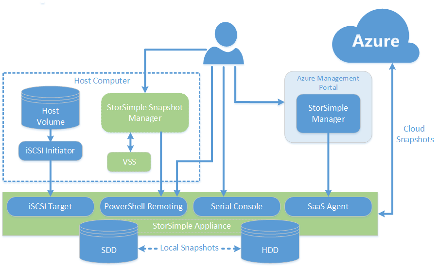
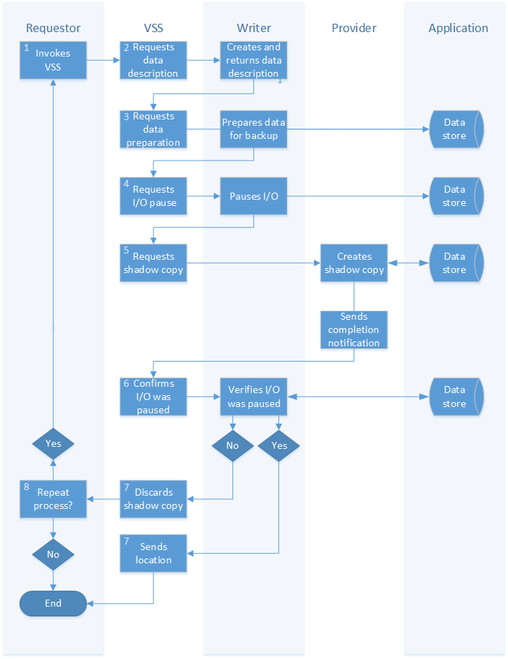

<properties 
   pageTitle="Was ist StorSimple Snapshot-Manager? | Microsoft Azure"
   description="Beschreibt die StorSimple Snapshot-Manager, deren Architektur und seine Features."
   services="storsimple"
   documentationCenter="NA"
   authors="SharS"
   manager="carmonm"
   editor="" />
<tags 
   ms.service="storsimple"
   ms.devlang="NA"
   ms.topic="article"
   ms.tgt_pltfrm="NA"
   ms.workload="TBD"
   ms.date="05/24/2016"
   ms.author="v-sharos" />

# Was ist StorSimple Snapshot-Manager?

## (Übersicht)

StorSimple Snapshot-Manager ist ein Microsoft Management Console (MMC)-Snap-in, das Datenschutz und zusätzliche Management in einer Umgebung mit Microsoft Azure StorSimple vereinfacht. Mit StorSimple Snapshot-Manager können Sie Microsoft Azure StorSimple Daten in Data Center und in der Cloud als eine Lösung einzelnen integrierten Speicher verwalten somit zusätzliche Prozesse vereinfachen und Kosten verringern.

Dieser Übersicht führt den StorSimple Snapshot-Manager, beschreibt die Funktionen und deren Rolle in Microsoft Azure StorSimple erklärt. 

Übersicht über das gesamte Microsoft Azure StorSimple-System, einschließlich dem Gerät StorSimple, StorSimple-Manager-Dienst, StorSimple Snapshot-Manager und StorSimple Netzwerkadapter für SharePoint, finden Sie unter [StorSimple 8000-Serie: einer Hybrid Cloud-Speicher-Lösung](storsimple-overview.md). 
 
>[AZURE.NOTE] 
>
>- StorSimple Snapshot-Manager können Sie Microsoft Azure StorSimple virtuelle Arrays verwalten (auch bekannt als lokalen StorSimple virtuelle Geräte).
>
>- Wenn Sie beabsichtigen, StorSimple Update 2 auf Ihrem Gerät StorSimple installiert haben, achten Sie darauf, dass Sie die neueste Version von StorSimple Snapshot-Manager herunterladen und installieren, **bevor Sie StorSimple Update 2 installiert**. Die neueste Version von StorSimple Snapshot-Manager ist abwärtskompatibel und funktioniert mit alle veröffentlichten Versionen von Microsoft Azure StorSimple. Wenn Sie die vorherige Version des StorSimple Snapshot-Manager verwenden, müssen Sie es aktualisieren (Sie müssen nicht die vorherige Version deinstallieren, bevor Sie die neue Version installiert haben).

## Zweck StorSimple Snapshot-Manager und Architektur

StorSimple Snapshot-Manager stellt eine zentrale Verwaltungskonsole, die Sie verwenden können, um konsistente, erstellen Sicherungskopien lokale Point-in-Time und Cloud Daten. Beispielsweise können Sie die Konsole zu verwenden:

- Konfigurieren, Sichern und Datenmengen löschen.
- Konfigurieren von Volume-Gruppen, um sicherzustellen, die Daten gesichert Anwendung konsistent ist.
- Verwalten Sie zusätzliche Richtlinien, sodass die Daten auf einem vordefinierten Zeitplan gesichert werden.
- Erstellen eines lokalen und cloud Momentaufnahmen konvertiert, die in der Cloud gespeichert und für die Wiederherstellung verwendet werden können.

Den StorSimple Snapshot-Manager abgerufen die Liste der Programme, die mit dem VSS-Anbieter auf dem Host registriert. Klicken Sie dann zum Erstellen der Anwendung konsistent Sicherungskopien überprüft die Datenmengen, die von einer Anwendung verwendet und vorgeschlagenen Volume-Gruppen zu konfigurieren. StorSimple Snapshot-Manager mithilfe dieser Gruppen Lautstärke um Sicherungskopien zu erzeugen, die Anwendung konsistent sind. (Anwendungskonsistenz vorhanden ist, wenn alle Dateien zugehörigen und Datenbanken synchronisiert werden und den wahren Status der Anwendung zu einem bestimmten Zeitpunkt darstellen.) 

Sicherungskopien StorSimple Snapshot-Manager werden in der Form von inkrementell Momentaufnahmen konvertiert, die seit der letzten Sicherung nur die Änderungen zu erfassen. Daher können Sicherungskopien erfordert weniger Speicherplatz und erstellt und wiederhergestellt werden schnell. StorSimple Snapshot-Manager verwendet Windows Volume Schatten Copy Service (VSS), um sicherzustellen, dass Momentaufnahmen Anwendung konsistenten Daten erfassen. (Weitere Informationen zu wechseln die Integration mit Windows Lautstärke Dienstfehler Abschnitt) Mit StorSimple Snapshot-Manager können Sie zusätzliche Zeitpläne erstellen oder sofortige Sicherungskopien dauern, je nach Bedarf. Wenn Sie Daten aus einer Sicherung, StorSimple Snapshot-Manager ermöglicht wiederherstellen müssen, wählen Sie aus einem Katalog von lokale oder Cloud Momentaufnahmen aus. Azure StorSimple stellt nur die Daten, die erforderlich ist, wie er erforderlich ist, die Verzögerung bei der datenverfügbarkeit bei Wiederherstellungsvorgängen verhindert.)

**Architektur StorSimple Snapshot-Manager** 

## Unterstützung für mehrere Typen der Lautstärke

Sie können den StorSimple Snapshot-Manager konfigurieren und Sichern Sie die folgenden Arten von Datenmengen verwenden: 

- **Grundlegende Datenmengen** – ein einfaches Volume ist eine einzelne Partition auf einer einfachen Festplatte. 

- **Einfache Datenträger** – ein einfaches Volume ist ein dynamisches Volume, das von einem einzelnen dynamischen Datenträger Speicherplatz enthält. Ein einfaches Volume besteht aus einer einzelnen Speicherbereich auf einem Datenträger oder aus mehreren Bereichen, die auf dem gleichen Datenträger zusammen verknüpft sind. (Sie können einfache Datenträger nur auf dynamischen Festplatten erstellen.) Einfache Datenträger sind nicht Fehlertoleranz.

- **Dynamische Datenträger** – ein dynamisches Volume ist ein Volume auf einem dynamischen Datenträger erstellt. Dynamische Datenträger verwenden eine Datenbank zum Nachverfolgen von Informationen zu Datenmengen die Datenspeicheroptionen auf dynamische Datenträger in einem Computer an. 

- **Dynamische Datenträger mit Spiegelung** – dynamische Datenmengen mit Spiegelung basieren auf der Architektur RAID 1. Mit RAID 1 werden die identische Daten auf zwei oder mehr Datenträger, erzeugt einen Satz gespiegelten geschrieben. Anforderung eine finden Sie hier kann dann von einem beliebigen Datenträger behandelt werden, die die angeforderten Daten enthält.

- **Datenmengen Cluster freigegeben** – mit Cluster freigegeben Datenmengen (CSVs), mehrere Knoten in einem Failovercluster können gleichzeitig Lese- oder Schreibzugriff auf derselben Festplatte. Failover von einem Knoten auf einen anderen Knoten kann schnell, ohne dass eine Änderung in Laufwerk Besitz oder bereitstellen, Aufheben der Bereitstellung und entfernen einen Datenträger auftreten. 

>[AZURE.IMPORTANT] CSVs und CSVs in der gleichen Momentaufnahme nicht kombiniert werden. Kombinieren von CSVs und CSVs in einer Momentaufnahme wird nicht unterstützt. 
 
StorSimple Snapshot-Manager können Sie wiederherstellen ganze Volumegruppen oder einzelne Datenmengen klonen und einzelne Dateien wiederherzustellen.

- [Datenmengen und Volume-Gruppen](#volumes-and-volume-groups) 
- [Zusätzliche Dateitypen und zusätzliche Richtlinien](#backup-types-and-backup-policies) 

Weitere Informationen zu StorSimple Snapshot-Manager-Features und deren Verwendung finden Sie unter [Benutzeroberfläche StorSimple Snapshot-Manager](storsimple-use-snapshot-manager.md).

## Datenmengen und Volume-Gruppen

StorSimple Snapshot Manager Datenmengen erstellen und konfigurieren Sie diese in Volume-Gruppen. 

StorSimple Snapshot-Manager verwendet die Lautstärke Gruppen Sicherungskopien zu erstellen, die Anwendung konsistent sind. Anwendungskonsistenz vorhanden ist, wenn alle Dateien zugehörigen und Datenbanken synchronisiert werden und den wahren Status einer Anwendung zu einem bestimmten Zeitpunkt darstellen. Volumegruppen (die auch bekannt als *Konsistenzgruppen*sind) bilden die Basis einer Sicherung oder Wiederherstellen von Position.

Volumegruppen sind nicht identisch mit Lautstärke Container. Volumen Container enthält eine oder mehrere Datenmengen, die einen Cloud-Speicher-Konto und andere Attribute, wie z. B. Verschlüsselung und des Bandbreite freigeben. Ein einzelnes Volume Container kann bis zu 256 Speicherdefizite StorSimple Datenmengen enthalten. Weitere Informationen über Volume Container wechseln Sie zum [Verwalten Ihrer Lautstärke Container](storsimple-manage-volume-containers.md). Volumegruppen sind Sammlungen Datenmengen, die Sie konfigurieren, um zusätzliche Vorgänge zu erleichtern. Wenn Sie zwei Datenmengen, die zu anderen Volume Container gehören auswählen, in einer einzelnen Volume-Gruppe zu platzieren, und klicken Sie dann erstellen Sie eine zusätzliche Richtlinie für diese Gruppe Lautstärke, wird jedes Volume im entsprechenden Lautstärke Container, mit dem Speicherkonto entsprechende gesichert werden.

>[AZURE.NOTE] Alle Datenträger in einer Gruppe Lautstärke müssen von einem einzelnen Cloud-Dienstanbieter zugeordnet werden.

## Integration in Windows Lautstärke Dienstfehler

StorSimple Snapshot-Manager verwendet Windows Volume Schatten Copy Service (VSS), um die Anwendung konsistenten Daten zu erfassen. VSS erleichtert die Anwendungskonsistenz durch Kommunikation mit VSS-fähigen Applikationen koordinieren die Erstellung von inkrementell Momentaufnahmen konvertiert. VSS wird sichergestellt, dass die Programme vorübergehend deaktivieren oder quiescent, wenn Momentaufnahmen geöffnet werden. 

Die Durchführung StorSimple Snapshot-Manager VSS funktioniert mit SQL Server und generische NTFS-Datenträger. Der Prozess sieht wie folgt aus: 

1. Ein Requestor, in der Regel ein datenverwaltung und Schutz Lösung (wie etwa StorSimple Snapshot Manager) oder eine Anwendung, ruft VSS und fordert sie auf zu sammeln Sie Informationen aus der Autor Software in der Zielanwendung auftreten.

2. VSS Kontakte die Autor-Komponente, um eine Beschreibung der Daten abzurufen. Der Autor gibt die Beschreibung der zu sichernden Daten. 

3. VSS zeigt der Autor die Anwendung für die Sicherung vorbereiten. Der Autor Dateipfad öffnen Transaktionen, die Daten für die Sicherung aktualisieren Transaktionsprotokolle usw. vorbereitet und dann benachrichtigt VSS

4. VSS weist der Autor vorübergehend beenden Datenspeicher der Anwendung, und stellen Sie sicher, dass keine Daten auf den Datenträger geschrieben werden, während die Schattenkopie erstellt wird. Dieser Schritt sorgt für Datenkonsistenz und nicht mehr als 60 Sekunden dauert.

5. VSS weist den Anbieter, um Schattenkopie zu erstellen. Anbieter, die Software oder Hardware-basierte, dienen verwalten die Datenmengen, die gerade ausgeführt werden und bei Bedarf Schattenkopien davon zu erstellen. Der Anbieter erstellt die Schattenkopie und VSS benachrichtigt, wenn es abgeschlossen ist.

6. VSS Kontakte der Autor die Anwendung zu benachrichtigen, die e/a fortgesetzt werden können und bestätigen, dass e/a erfolgreich während der Erstellung von Schatten unterbrochen wurde. 

7. Wenn der Kopiervorgang erfolgreich war, gibt VSS Speicherort für die Kopie des auf das jeweilige an. 

8. Wenn Daten geschrieben wurde, während die Schattenkopie erstellt wurde, wird die Sicherung inkonsistent sein. VSS löscht die Schattenkopie und das jeweilige benachrichtigt. Das jeweilige kann entweder automatisch wiederholen Sie den Sicherung Vorgang oder benachrichtigt den Administrator, um ihn zu einem späteren Zeitpunkt wiederholen.

Finden Sie in der folgenden Abbildung aus.

**Windows Lautstärke Dienstfehler Prozess** 

## Zusätzliche Dateitypen und zusätzliche Richtlinien

Mit StorSimple Snapshot-Manager können Sie Daten sichern und lokal und in der Cloud zu speichern. Sie können StorSimple Snapshot-Manager verwenden, um die Daten sofort zu sichern, oder können Sie eine zusätzliche Richtlinie zum Erstellen eines Zeitplans zum Erstellen von Sicherungskopien automatisch. Zusätzliche Richtlinien ermöglichen auch angeben, wie viele Momentaufnahmen beibehalten werden. 

### Zusätzliche Typen

StorSimple Snapshot-Manager können Sie um die folgenden Arten von Sicherungskopien zu erstellen:

- **Lokale Momentaufnahmen** – lokale Momentaufnahmen sind Point-in-Time-Kopien von Volume-Daten, die auf dem Gerät StorSimple gespeichert werden. Normalerweise kann diese Art der Sicherung erstellt und schnell wiederhergestellt werden. Wie eine lokale Sicherungskopie verwenden, können Sie eine lokale Momentaufnahme verwenden.

- **Momentaufnahmen der Cloud** – Cloud Momentaufnahmen Point-in-Time-Kopien der Lautstärke Daten sind, die in der Cloud gespeichert sind. Eine Momentaufnahme der Cloud entspricht eine Momentaufnahme auf einem anderen externe Speicherung System repliziert. Cloud Momentaufnahmen sind Wiederherstellungssituationen besonders hilfreich.

### Bei Bedarf und geplanten Sicherungskopien

Mit StorSimple Snapshot-Manager können Sie initiieren, einmalige Sicherung sofort erstellt werden soll, oder Sie können eine Sicherung Richtlinie periodischen zusätzliche Vorgänge planen.

Eine Sicherung Richtlinie ist eine Reihe von automatisierten Regeln, die Sie zum Planen von regelmäßigen Sicherungen verwenden können. Eine Sicherung Richtlinie können Sie die Häufigkeit und Parameter für Ihre Teilnahme an einer bestimmten Volume Group Momentaufnahmen definieren. Sie können Richtlinien verwenden, um die Anfangs-und Ablaufdatum, Zeiten, Häufigkeit und Aufbewahrungsrichtlinien einzuhalten, lokalen angeben und Momentaufnahmen cloud. Sofort, nachdem Sie es definiert haben, wird eine Richtlinie angewendet. 

StorSimple Snapshot-Manager können Sie konfigurieren oder zusätzliche Richtlinien bei Bedarf neu zu konfigurieren. 

Sie konfigurieren die folgende Informationen für jede zusätzliche Richtlinie, die Sie erstellen:

- **Namen** – die eindeutigen Namen der ausgewählten Sicherung Richtlinie.

- **Typ** – der Typ der Sicherungsdatei Richtlinie; lokale Snapshot oder Snapshot Cloud.

- **Volumen-Gruppe** – der Volume-Gruppe, der die ausgewählte Sicherung Richtlinie zugewiesen ist.

- **Aufbewahrungsrichtlinien** – die Anzahl der Sicherungskopien beibehalten. Wenn Sie das Kontrollkästchen **Alle** aktivieren, verbleiben alle Sicherungskopien, bis die maximale Anzahl von Sicherungskopien pro Volume erreicht ist, an welcher Stelle die Richtlinie fehl, und eine Fehlermeldung. Alternativ können Sie eine Anzahl von Sicherungskopien beibehalten (zwischen 1 und 64) angeben.

- **Datum** – das Datum, die Sicherung Richtlinie erstellt wurde.

Informationen zum Konfigurieren von Richtlinien Sicherung wechseln Sie zu [Verwenden StorSimple Snapshot-Manager erstellen und Verwalten von Sicherung Richtlinien](storsimple-snapshot-manager-manage-backup-policies.md).

### Sicherung die Überwachung und Verwaltung

Sie können den StorSimple Snapshot-Manager überwachen und Verwalten von anstehende, geplanten und abgeschlossenen Sicherung Aufträge verwenden. Darüber hinaus bietet StorSimple Snapshot-Manager bis zu 64 fertigen Sicherungskopien in einen Katalog. Sie können den Katalog suchen und Wiederherstellen von Datenmengen oder einzelne Dateien verwenden. 

Informationen zum Überwachen von Sicherung Aufträge wechseln Sie zu [Verwenden StorSimple Snapshot-Manager anzeigen und Verwalten von Sicherung Aufträge](storsimple-snapshot-manager-manage-backup-jobs.md).

## Nächste Schritte

- Weitere Informationen zum [Verwenden von StorSimple Snapshot-Manager zu Ihrer Lösung StorSimple verwalten](storsimple-snapshot-manager-admin.md).

- Herunterladen von [StorSimple Snapshot-Manager](https://www.microsoft.com/download/details.aspx?id=44220).
