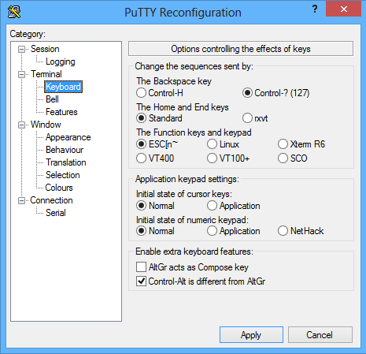
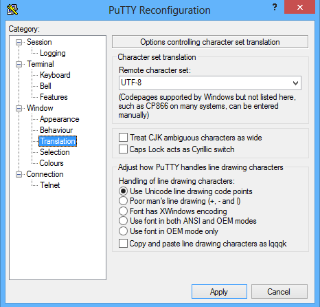
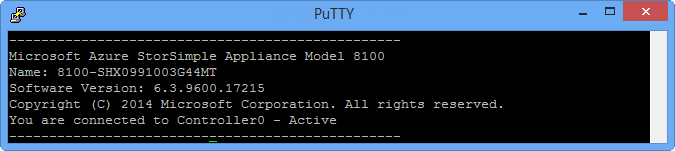
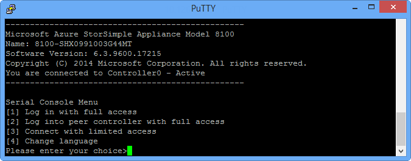

<properties 
   pageTitle="PowerShell für die Verwaltung von StorSimple Gerät | Microsoft Azure"
   description="Informationen Sie zum Verwenden von Windows PowerShell für StorSimple zum Verwalten von Ihrem Geräts StorSimple."
   services="storsimple"
   documentationCenter="NA"
   authors="alkohli"
   manager="carmonm"
   editor="" />
<tags 
   ms.service="storsimple"
   ms.devlang="NA"
   ms.topic="article"
   ms.tgt_pltfrm="NA"
   ms.workload="TBD"
   ms.date="08/18/2016"
   ms.author="alkohli@microsoft.com" />

# Verwenden von Windows PowerShell für StorSimple zum Verwalten von Ihrem Geräts

## (Übersicht)

Windows PowerShell für StorSimple bietet eine Line-Benutzeroberfläche, die Sie zum Verwalten von Ihrem Geräts Microsoft Azure StorSimple verwenden können. Wie der Name sagt, ist es eine Windows PowerShell-basiertes Line-Benutzeroberfläche, die in einer eingeschränkten Runspace erstellt wurde. Aus der Sicht des Benutzers in der Befehlszeile wird ein eingeschränkter Runspace als eine eingeschränkte Version von Windows PowerShell aus. Bei weitgehender einige der grundlegenden Windows PowerShell-Funktionen, weist diese Schnittstelle zusätzliche dedizierte Cmdlets, die Verwaltung von Ihrem Gerät Microsoft Azure StorSimple befasst. 

Dieser Artikel beschreibt das Windows PowerShell für StorSimple Features, einschließlich, wie diese Schnittstelle, hergestellt werden kann und enthält Links zu schrittweisen Verfahren oder Workflows, die Sie ausführen können, diese Schnittstelle. Die Workflows enthalten, wie Sie Ihr Gerät registrieren, Konfigurieren der Schnittstelle auf Ihrem Gerät, installieren Sie Updates, die erfordern das Gerät im Wartung Modus ausgeführt werden, ändern Sie den Gerätestatus und beheben Sie alle Probleme, die auftreten können.

Nach dem Lesen in diesem Artikel, werden Sie zu können:

- Verbinden Sie mit Ihrem StorSimple Gerät mithilfe von Windows PowerShell für StorSimple.

- Verwalten Sie Ihrer StorSimple Gerät mithilfe von Windows PowerShell für StorSimple an.

- Anfordern von Hilfe in Windows PowerShell für StorSimple.

>[AZURE.NOTE]   

>- Windows PowerShell für StorSimple Cmdlets können Sie Ihr Gerät StorSimple aus einer seriellen Konsole oder Remote über Windows PowerShell remote verwalten. Weitere Informationen zu jeder einzelne Cmdlets, die in dieser Schnittstelle verwendet werden können, wechseln Sie zu [cmdletreferenz zur für Windows PowerShell für StorSimple](https://technet.microsoft.com/library/dn688168.aspx).

>- StorSimple der Azure-PowerShell-Cmdlets sind eine andere Sammlung von Cmdlets, die Sie automatisieren StorSimple Servicelevel und Schritte für die Migration über die Befehlszeile ermöglichen. Weitere Informationen zu den Azure-PowerShell-Cmdlets für StorSimple wechseln Sie zu den [Azure StorSimple Cmdlet Bezug](https://msdn.microsoft.com/library/azure/dn920427.aspx).

Sie können das Windows PowerShell für StorSimple mithilfe einer der folgenden Methoden zugreifen:

- [Verbinden Sie mit StorSimple Gerät serielle Konsole](#connect-to-windows-powershell-for-storsimple-via-the-device-serial-console)
- [Herstellen einer Verbindung mit Windows PowerShell StorSimple mit Remote](#connect-remotely-to-storsimple-using-windows-powershell-for-storsimple)
    

## Herstellen einer Verbindung mit Windows PowerShell für StorSimple über die serielle Gerät-Konsole

Sie können [kitten herunterladen](http://www.putty.org/) oder ähnliche Terminal-Emulationssoftware in Verbindung mit Windows PowerShell für StorSimple. Sie müssen kitten speziell zum Zugreifen auf des Geräts Microsoft Azure StorSimple konfigurieren. Die folgenden Themen enthalten die detaillierten Schritte dazu, wie Sie kitten konfigurieren und Verbinden mit dem Gerät. Verschiedene Menüoptionen in der seriellen Konsole werden auch erläutert.

### Kitten Einstellungen

Stellen Sie sicher, dass Sie die folgenden PuTTY Einstellungen aus der seriellen Konsole eine Verbindung mit der Windows PowerShell-Benutzeroberfläche verwenden.

#### So konfigurieren Sie kitten

1. Wählen Sie im Dialogfeld PuTTY **neu konfiguriert** , klicken Sie im Bereich **Kategorie** **Tastatur**ein.

2. Stellen Sie sicher, dass die folgenden Optionen ausgewählt sind (Dies sind die Standardeinstellungen, wenn Sie eine neue Sitzung starten). 

  	|Tastatur-Element|Wählen Sie aus|
  	|---|---|
  	|RÜCKTASTE|Steuerelement-? (127)|
  	|Start und Ende-Tasten|Standard|
  	|Funktionstasten und Zehnertastatur|ESC [n ~|
  	|Anfänglicher Status der Pfeiltasten|Normal|
  	|Anfänglicher Status des Zehnertastatur|Normal|
  	|Aktivieren zusätzlicher Tastatur-Funktionen|Alt-Steuerelement unterscheidet sich von AltGr|

    

3. Klicken Sie auf **Übernehmen**.

4. Wählen Sie im Bereich **Kategorie** **Übersetzung**aus.

5. Wählen Sie im Listenfeld **Remote-Zeichensatz** **UTF-8**aus.

6. Wählen Sie unter **Behandlung von Strichzeichnung Zeichen** **verwenden Unicode Strichzeichnung Codepunkte**ein. Die folgende Abbildung zeigt die Auswahl der richtigen PuTTY.

    

7. Klicken Sie auf **Übernehmen**.

Kitten können jetzt zur Gerät serielle Konsole herstellen, indem Sie die folgenden Schritte ausführen.

[AZURE.INCLUDE [storsimple-use-putty](../../includes/storsimple-use-putty.md)]

### Über die serielle Konsole

Wenn Sie auf der Windows PowerShell Benutzeroberfläche von Ihrem Gerät StorSimple über die serielle Konsole, einer Nachricht Banner angezeigt wird zugreifen, gefolgt vom Menüoptionen. 

Die Nachricht Banner enthält grundlegenden StorSimple Geräteinformationen, wie das Modell, Namen, installierte Softwareversion und Status der Controller Sie gerade, den zugreifen. Die folgende Abbildung zeigt ein Beispiel für eine Nachricht Banner.

>[AZURE.IMPORTANT] Die Nachricht Banner können Sie erkennen, ob der Controller, dem Sie mit verbunden sind aktiv oder Passiv ist.

Die folgende Abbildung zeigt die verschiedenen Runspace Optionen, die im Menü seriellen Konsole verfügbar sind.

Sie können die folgenden Einstellungen auswählen:

1. **Melden Sie sich mit Vollzugriff** Dieser Option können Sie eine Verbindung herstellen (mit den richtigen Anmeldeinformationen) den Runspace **SSAdminConsole** auf dem lokalen Controller. (Der lokale Controller ist der Controller, den Sie zurzeit über die serielle Konsole Ihres Geräts StorSimple zugreifen.) Diese Option kann auch verwendet werden, dürfen der uneingeschränkter Runspace (Support-Sitzung) um Behandlung aller Probleme mögliche Gerät Zugriff auf Microsoft-Support. Nachdem Sie die Option 1 Anmelden verwenden, können Sie die Mitarbeiter des Microsoft-Supports zum unbeschränkte Runspace zugreifen, indem Sie ein bestimmtes Cmdlet ausgeführt zulassen. Weitere Informationen zum [Starten einer Sitzung Support für](storsimple-contact-microsoft-support.md#start-a-support-session-in-windows-powershell-for-storsimple)verweisen.

2. **Melden Sie sich bei Peer-Controller mit Vollzugriff** Diese Option ist die Option 1, identisch mit der Ausnahme, dass Sie (mit den richtigen Anmeldeinformationen) die **SSAdminConsole** Runspace auf dem Peer-Controller verbinden können. Da das Gerät StorSimple ein Gerät hohe Verfügbarkeit mit zwei Controller in Aktiv-Passiv-Konfiguration ist, bezieht sich Peer an den anderen Controller in das Gerät, das Sie über die serielle Konsole zugreifen möchten).
Option 1 ähnlich wie, kann diese Option auch verwendet werden dürfen der uneingeschränkter Runspace auf einem Controller Peer-Zugriff auf Microsoft-Support.

3. **Verbinden mit beschränkter Zugriff** Diese Option ist Windows PowerShell-Benutzeroberfläche im Modus beschränkter Zugriff auf verwendet. Sie sind nicht für Access-Anmeldeinformationen aufgefordert. Diese Option verbindet, um eine weitere eingeschränkten Runspace im Vergleich zu Optionen 1 und 2.  Einige der Aufgaben, die über die Option 1 verfügbar sind, **kann nicht* ausgeführt werden, in diesem Runspace sind:

    - Die Factory zurücksetzen
    - Ändern des Kennworts
    - Aktivieren oder Deaktivieren von Access support
    - Anwenden von updates
    - Installieren von Updates 
                                                

    >[AZURE.NOTE] **Dies ist die gewünschte Option aus, wenn Sie das Gerät Administratorkennwort vergessen haben, und keine Verbindung, bis die Option 1 oder 2 herstellen können.**

4. **Sprache ändern** Mit dieser Option können Sie die Anzeigesprache auf der Benutzeroberfläche von Windows PowerShell ändern. Die unterstützten Sprachen sind Englisch, Japanisch, Russisch, Französisch, Süd Koreanisch, Spanisch, Italienisch, Deutsch, Chinesisch und Portugiesisch (Brasilien).

## Herstellen einer Verbindung mithilfe von Windows PowerShell für StorSimple StorSimple mit Remote

Windows PowerShell Remote können Sie eine Verbindung mit Ihrem Gerät StorSimple. Wenn Sie auf diese Weise verbinden, werden Sie kein Menü angezeigt. (Sie ein Menü nur angezeigt, wenn Sie die serielle Konsole auf dem Gerät verwenden, um eine Verbindung herstellen. Herstellen einer Verbindung Remote gelangen Sie direkt zum vergleichbar mit "Option 1 – Vollzugriff" auf die serielle Konsole.) Mit Windows PowerShell Remote verbinden Sie mit einer bestimmten Runspace aus. Sie können auch die Anzeigesprache angeben. 

Die Anzeigesprache wird unabhängig von der Sprache, die Sie festlegen, indem Sie mit der Option für die **Sprache ändern** im Menü seriellen Konsole. Remote-PowerShell übernehmen automatisch das Gebietsschema des Geräts, die Sie aus eine Verbindung herstellen, wenn keine angegeben ist.

>[AZURE.NOTE] Wenn Sie mit Microsoft Azure-virtuellen Hosts und StorSimple virtuelle Geräte arbeiten, können Sie in Verbindung mit dem Gerät virtuelle Remote Windows PowerShell und dem virtuellen Host verwenden. Wenn Sie einen Speicherort freigeben, klicken Sie auf den Host an, um Informationen aus der Windows PowerShell-Sitzung zu speichern eingerichtet haben, sollten Sie beachten, dass die wichtigsten jeder nur authentifizierten Benutzer enthält. Daher, wenn Sie die Freigabe für den Zugriff durch jeden eingerichtet haben, und Sie eine Verbindung herstellen, ohne Angabe von Anmeldeinformationen, die nicht authentifizierte anonyme Tilgungsanteile verwendet werden, und Sie ein Fehler angezeigt. Um dieses Problem zu beheben, klicken Sie auf die Freigabe hosten Sie müssen, aktivieren Sie das Konto Gast, und geben Sie dann den Gast Konto Vollzugriff auf die Freigabe oder gültige Anmeldeinformationen zusammen mit Windows PowerShell-Cmdlet angeben.

HTTP oder HTTPS können Sie um über Windows PowerShell Remote zu verbinden. Verwenden Sie die Anweisungen in die folgenden Lernprogramme an:

- [Eine Verbindung mit Remote HTTP](storsimple-remote-connect.md#connect-through-http)
- [Eine Verbindung mit Remote HTTPS](storsimple-remote-connect.md#connect-through-https)

## Verbindung Sicherheitsaspekte

Wenn Sie Herstellen einer Verbindung mit Windows PowerShell für StorSimple sind, müssen berücksichtigen Sie Folgendes:

- Herstellen einer Verbindung mit der seriellen Gerät-Konsole direkt sichere ist, aber ist nicht mit der seriellen Konsole über Netzwerk Schalter verbinden. Seien Sie auf das Sicherheitsrisiko, beim Herstellen einer Verbindung mit seriellen Gerät über Netzwerk Schalter.

- Herstellen einer Verbindung durch eine HTTP-Sitzung bieten möglicherweise mehr Sicherheit als über die serielle Konsole über Netzwerk verbinden. Auch wenn dies nicht die sicherste Methode ist, ist es auf vertrauenswürdige Netzwerke zulässig.

- Herstellen einer Verbindung über eine HTTPS-Sitzung ist die sicherste und die empfohlene Option.

## Verwalten Sie Ihre Verwendung von Windows PowerShell für StorSimple StorSimple-Gerät
Die folgende Tabelle enthält eine Zusammenfassung aller häufige Verwaltungsaufgaben und komplexe Workflows, die ausgeführt werden können innerhalb der Windows PowerShell-Benutzeroberfläche von Ihrem Gerät StorSimple. Weitere Informationen zu den einzelnen Workflows klicken Sie auf den entsprechenden Eintrag in der Tabelle.

#### Windows PowerShell für StorSimple workflows

|Wenn Sie dies tun möchten...|Gehen Sie folgendermaßen vor.|
|---|---|
|Registrieren Sie sich Ihrem Gerät|[Konfigurieren und das Verwendung von Windows PowerShell für StorSimple Gerät registrieren](storsimple-deployment-walkthrough.md#step-3-configure-and-register-the-device-through-windows-powershell-for-storsimple) |
|Konfigurieren der Web-proxy Web Proxy-Einstellungen anzeigen|[Konfigurieren von Webproxy für Ihr Gerät StorSimple](storsimple-configure-web-proxy.md)|
|Ändern der Daten 0 Netzwerk Benutzeroberflächen-Einstellungen auf Ihrem Gerät|[Ändern von Daten 0 Netzwerk Benutzeroberfläche für Ihr Gerät StorSimple](storsimple-modify-data-0.md)|
|Beenden eines Controllers   Starten Sie erneut, oder fahren Sie einen controller   Fahren Sie ein Gerät Zurücksetzen Sie Gerät, um Factory-Standardeinstellungen|[Verwalten von Controller device](storsimple-manage-device-controller.md)|
|Wartung Modus Updates und Updates installieren|[Aktualisieren von Ihrem Gerät](storsimple-update-device.md)|
|Geben Sie die Wartungsmodus  Wartung-Modus beenden|[StorSimple Gerät Modi](storsimple-device-modes.md)|
|Erstellen Sie ein Supportpaket Entschlüsseln und Bearbeiten eines Pakets support|[Erstellen und Verwalten eines Support-Pakets](storsimple-create-manage-support-package.md)|
|Starten einer Sitzung Support für |[Starten einer Sitzung Unterstützung in Windows PowerShell für StorSimple](/storsimple-contact-microsoft-support.md#start-a-support-session-in-windows-powershell-for-storsimple)
 

## Anfordern von Hilfe in Windows PowerShell für StorSimple

In Windows PowerShell für StorSimple ist Cmdlet Hilfe zur Verfügung. Eine Version dieser Hilfe online, auf dem neuesten Stand ist auch verfügbar, Sie können die Hilfe in Ihrem System aktualisieren.

Aufrufen der Hilfe in dieser Schnittstelle in Windows PowerShell ähnlich ist, und die Hilfe-Cmdlets für die meisten funktionieren. Hilfe für Windows PowerShell online finden Sie in der TechNet-Bibliothek: [Skripting mit Windows PowerShell](http://go.microsoft.com/fwlink/?LinkID=108518).

Im folgenden finden eine kurze Beschreibung der Arten von Hilfe für Windows PowerShell-Oberfläche, und wie die Hilfe zu aktualisieren.

#### Hilfe für ein Cmdlet abrufen

- Verwenden Sie Hilfe-Cmdlet oder-Funktion, um den folgenden Befehl aus:`Get-Help <cmdlet-name>`

- Onlinehilfe für alle Cmdlet verwenden, um mit dem vorherigen Cmdlet mit dem `-Online` Parameter:`Get-Help <cmdlet-name> -Online`

- Vollständige Hilfe benötigen, können Sie die `–Full` Parameter, und Verwenden von Beispielen, die `–Examples` Parameter.

#### Hilfe zu aktualisieren

Sie können einfach die Hilfe in der Windows PowerShell-Benutzeroberfläche aktualisieren. Führen Sie die folgenden Schritte aus, um die Hilfe in Ihrem System zu aktualisieren.

#### Cmdlet-Hilfe zu aktualisieren

1. Starten Sie Windows PowerShell, mit der Option **als Administrator ausführen** .

1. Geben Sie an der Befehlszeile ein: `Update-Help`

1. Die aktualisierten Dateien werden installiert.

1. Nachdem Sie die Dateien installiert sind, geben Sie ein: `Get-Help Get-Command`. Dadurch wird eine Liste der Cmdlets angezeigt, für die Hilfe zur Verfügung steht.

>[AZURE.NOTE] Um eine Liste aller verfügbaren Cmdlets in einem Runspace zu gelangen, melden Sie sich bei der entsprechenden Menüoption, und führen Sie die `Get-Command` Cmdlet.

## Nächste Schritte
Wenn Probleme mit Ihrem Gerät StorSimple auftreten, wenn eines der obigen Workflows ausführen, schlagen Sie Tools [zur Behandlung dieses Problems StorSimple Bereitstellungen](storsimple-troubleshoot-deployment.md#tools-for-troubleshooting-storsimple-deployments).

