<properties
    pageTitle="Eine Dateneingabe für Ihre Projekte Stream Analytics hinzufügen | Microsoft Azure"
    description="Erfahren Sie, wie Sie eine Datenquelle, die Ihre Stream Analytics Auftrag als streaming Dateneingabe aus Ereignis Hubs oder Bezug Daten aus dem Blog-Speicher einbinden."
    keywords="Dateneingabe streaming-Daten"
    documentationCenter=""
    services="stream-analytics"
    authors="jeffstokes72"
    manager="jhubbard"
    editor="cgronlun"
/>

<tags
    ms.service="stream-analytics"
    ms.devlang="na"
    ms.topic="article"
    ms.tgt_pltfrm="na"
    ms.workload="data-services"
    ms.date="09/26/2016"
    ms.author="jeffstok"
/>

# Zum Hinzufügen eines streaming Daten Eingabe oder Bezug auf einen Stream Analytics-Auftrag

Erfahren Sie, wie Sie eine Datenquelle, die Ihre Stream Analytics Auftrag als streaming Dateneingabe aus Ereignis Hubs oder Bezug Daten aus dem Blob-Speicher einbinden.

Azure Stream Analytics Aufträge können mit Dateneingabe eine oder mehrere, von denen jede definieren eine Verbindung mit einer vorhandenen Datenquelle verbunden sein. Wie Daten an die Datenquelle gesendet werden, ist es durch den Auftrag Stream Analytics verbraucht und in Echtzeit als streaming-Daten verarbeitet. Stream Analytics weist erster Klasse Integration in [Azure Ereignis Hubs](https://azure.microsoft.com/services/event-hubs/) und [Azure Blob-Speicher](../storage/storage-dotnet-how-to-use-blobs.md) innerhalb und außerhalb des Projekts Abonnement.

Dieser Artikel bietet einen Schritt in der [Stream Analytics learning Pfad](/documentation/learning-paths/stream-analytics/).

## Dateneingabe: Streaming Daten und Bezug

Es gibt zwei verschiedene Typen von Eingaben im Stream Analytics: Datenstreams und Bezug Daten.

- **Data Streams**: Stream Analytics Einzelvorgänge müssen mindestens eine Stream Dateneingabe um genutzt werden und durch den Auftrag transformiert enthalten. Azure Blob-Speicher und Azure Ereignis Hubs werden als Eingabe Stream Datenquellen unterstützt. Azure Ereignis Hubs werden verwendet, um die Ereignisstreams aus verbundenen Geräten, Diensten und Anwendungen zu sammeln. Azure Blob-Speicher kann als Standardeingabesprache Quelle für Aufnahme Datenmengen als Stream verwendet werden.  
- **Verweisdaten**: Stream Analytics unterstützt einen zweiten zusätzlichen Eingabewerte bezeichnet Bezug Datentyp.  Im Gegensatz zu Daten in Bewegung sind diese Daten an statischen oder verlangsamen ändern.  Es wird in der Regel zur Durchführung von Suchen und Korrelationen mit Datenstreams verwendet, umfangreichere Daten erstellen.  Azure Blob-Speicher gibt es zurzeit aus der einzige unterstützte Eingabewerte Datenquelle verweisen.  

So fügen Sie eine Eingabe in Ihrem Auftrag Stream Analytics hinzu:

1. Azure-Portal klicken Sie auf **Eingaben** , und klicken Sie dann auf **Hinzufügen einer Eingabesprache** in Ihrem Auftrag Stream Analytics.

    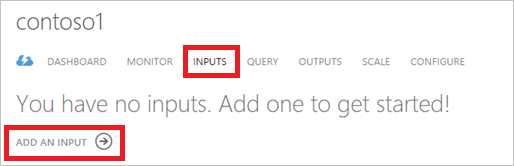  

    Klicken Sie auf die Kachel **Eingaben** in Ihrem Auftrag Stream Analytics, Azure-Portal.  

    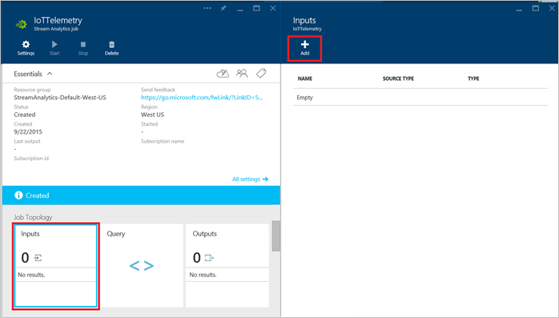  

2. Geben Sie den Typ der Eingabe: entweder **Stream Daten** oder **Daten Bezug**.

    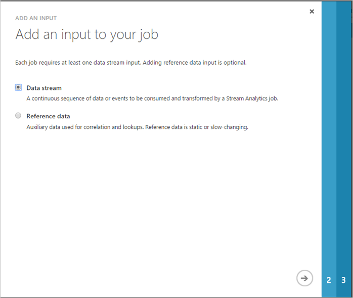  

    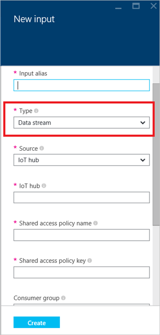  

3. Wenn eine Eingabe Data Stream erstellen möchten, geben Sie den Typ der Datenquelle für die Eingabe.  Dieser Schritt kann während der Erstellung der Daten Bezug als nur Blob übersprungen werden, die zu diesem Zeitpunkt Speicher unterstützt wird.

    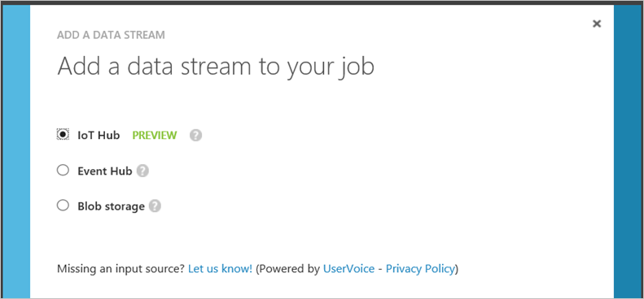  

    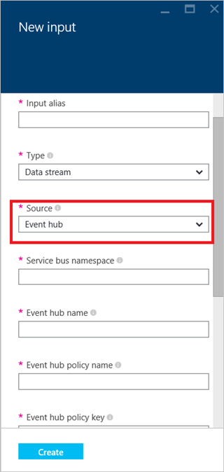  

4. Geben Sie einen Anzeigenamen für diese Eingabe in das Feld Alias Eingabewerte.  Dieser Name wird später in des Projekts Abfrage verwendet werden, verweisen Sie mit der Eingabe.

    Füllen Sie den Rest der erforderlichen Verbindungseigenschaften für die Verbindung zur Datenquelle aus. Diese Felder variieren je nach Typ des Typs von Eingabe- und Quelle und im Detail definiert werden [können](stream-analytics-create-a-job.md).  

    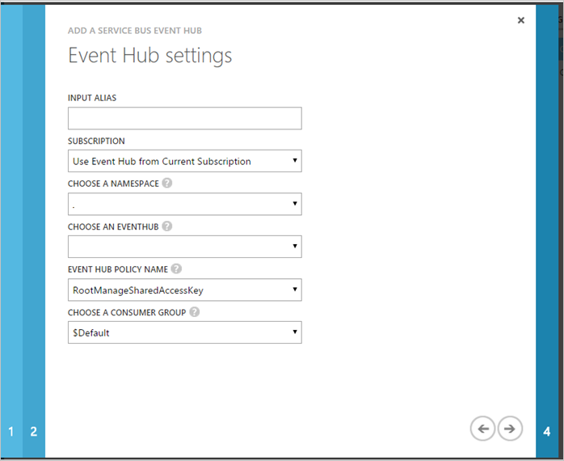  

5. Geben Sie die Serialisierungseinstellungen für die Eingabedaten:
    - Geben Sie sicherstellen, dass Ihre Abfragen nach Ihren Bedürfnissen erwartet, das **Ereignis das Format** der eingehenden Daten.  Unterstützte aktualisierten sind JSON CSV- und Avro.
    - Überprüfen Sie die **Codierung** für die Daten ein.  UTF-8 ist der einzige unterstützte Codierung Format zu diesem Zeitpunkt an.

    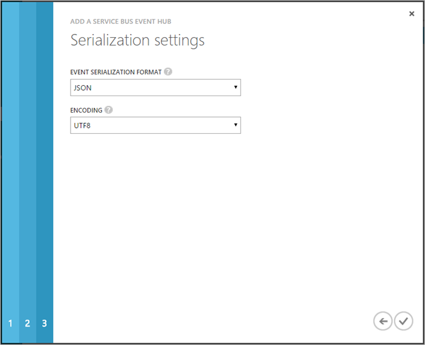  

    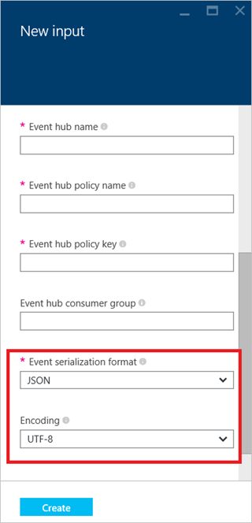  

6. Nach Abschluss das Eingabe erstellen, werden Stream Analytics überprüfen, dass sie eine Verbindung mit der Datenquelle herstellen kann.  Sie können den Status des Vorgangs Verbindung testen im Hub Benachrichtigung anzeigen.

    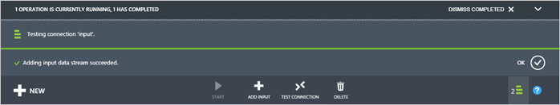  

    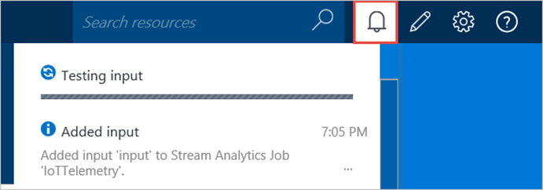  

## Erhalten von Hilfe bei streaming Dateneingaben
Für weitere Unterstützung zu erhalten versuchen Sie es unsere [Azure Stream Analytics-forum](https://social.msdn.microsoft.com/Forums/en-US/home?forum=AzureStreamAnalytics)

## Nächste Schritte

- [Einführung in Azure Stream Analytics](stream-analytics-introduction.md)
- [Erste Schritte mit Azure Stream Analytics](stream-analytics-get-started.md)
- [Skalieren Sie Azure Stream Analytics Aufträge](stream-analytics-scale-jobs.md)
- [Azure Stream Analytics Query Language Bezug](https://msdn.microsoft.com/library/azure/dn834998.aspx)
- [Azure Stream Analytics Management REST-API-Referenz](https://msdn.microsoft.com/library/azure/dn835031.aspx)
