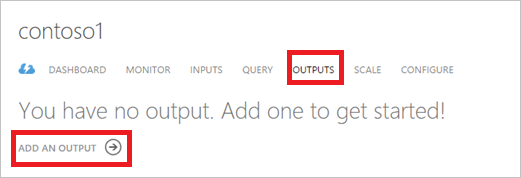
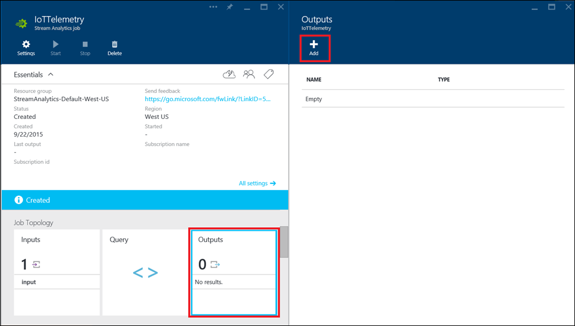
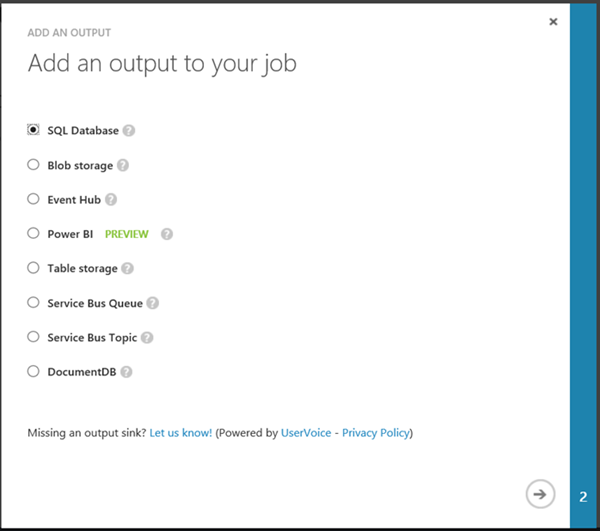
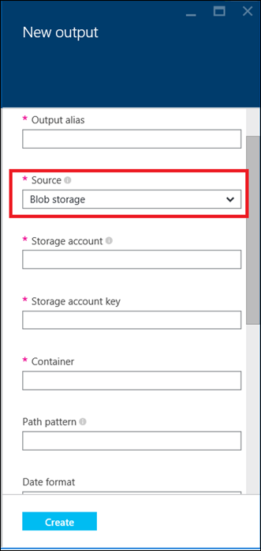
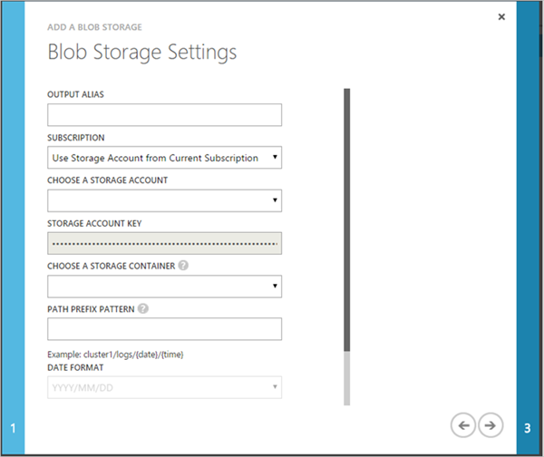
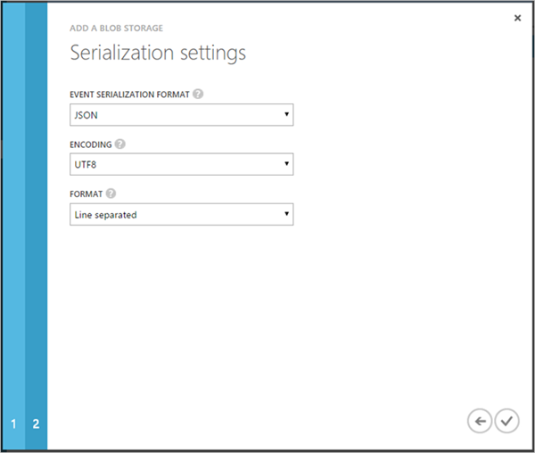
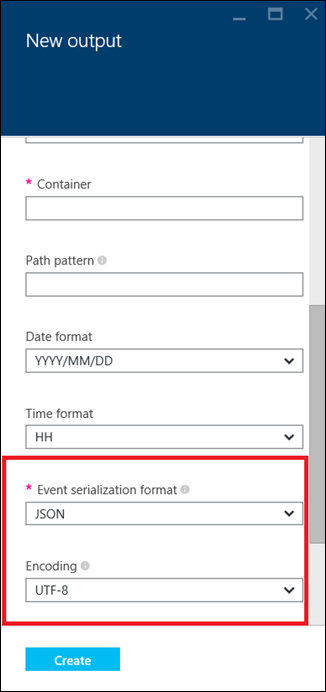

<properties 
    pageTitle="So konfigurieren Sie die Daten für Stream Analytics Aufträge gibt | Microsoft Azure" 
    description="Konfigurieren von Ausgaben für Stream Analytics Aufträge | Learning Path Segment an."
    keywords="Daten ausgeben, das Verschieben von Daten"
    documentationCenter=""
    services="stream-analytics"
    authors="jeffstokes72" 
    manager="jhubbard" 
    editor="cgronlun"/>

<tags 
    ms.service="stream-analytics" 
    ms.devlang="na" 
    ms.topic="article" 
    ms.tgt_pltfrm="na" 
    ms.workload="data-services" 
    ms.date="09/26/2016" 
    ms.author="jeffstok"/> 

# So konfigurieren Sie die Daten gibt für Stream Analytics Einzelvorgänge

Azure Stream Analytics Aufträge können mit eine oder mehrere Ausgaben für Daten, die eine Verbindung zu einer vorhandenen Daten Empfänger definieren, verbunden sein. Wie Ihre Position Stream Analytics verarbeitet und eingehende Daten transformiert, ist ein Stream Ereignisse im Ausgabe des Projekts Ausgabe geschrieben.

Stream Analytics-Daten, die Ausgaben in Echtzeit Dashboards oder Benachrichtigungen Datenquelle verwendet werden können Daten Bewegung Workflows auslösen oder einfach Archivieren von Daten für die Stapelverarbeitung höher. Stream Analytics weist erster Klasse Integration mit verschiedenen Azure-Diensten, die hier detailliert beschrieben werden.

So Ihre Arbeit Stream Analytics eine Ausgabe hinzu:

1. Im klassischen Azure-Portal klicken Sie auf **Ausgaben** , und klicken Sie dann in Ihrem Auftrag Stream Analytics auf **Ausgabe hinzufügen** .

      

    Klicken Sie auf die Kachel **Ausgaben** in Ihrem Auftrag Stream Analytics, Azure-Portal.

    

2. Geben Sie den Typ der Ausgabe an:

      

    

3. Geben Sie einen Anzeigenamen für diese Ausgabe in das Feld **Alias Ausgabe** an. Dieser Name kann höher des Projekts Abfrage verwendet werden, auf die Ausgabe verweisen.  
    
    Füllen Sie den Rest der erforderlichen Verbindungseigenschaften Verbindung zu Ihrem Ausgabe aus.  Diese Felder variieren je nach Art der Ausgabe und hier ausführlich definiert sind.  

      

4. Je nach Art der Ausgabe müssen Sie möglicherweise angeben wie die Daten oder formatiert ist. Die bestimmte Serialisierungseinstellungen für jeden Ausgabe werden hier beschrieben.

    Füllen Sie den Rest der erforderlichen Verbindungseigenschaften für die Verbindung zur Datenquelle aus. Diese Felder variieren je nach Typ des Typs von Eingabe- und Quelle und im Detail definiert werden [können](stream-analytics-create-a-job.md).  

      

      

> [Azure.Note] Alle Ausgabeelement dem Projekt hinzugefügt muss vorhanden sein, bevor der Auftrag wird gestartet und Ereignisse Starten entdeckt. Beispielsweise, wenn Sie als Ausgabe Blob-Speicher verwenden, erstellt der Auftrag nicht Speicher-Konto automatisch. Es muss vom Benutzer erstellt werden, bevor Sie der Auftrag ASA gestartet wird.

## Anfordern von Hilfe
Für weitere Unterstützung zu erhalten versuchen Sie es unsere [Azure Stream Analytics-forum](https://social.msdn.microsoft.com/Forums/en-US/home?forum=AzureStreamAnalytics)

## Nächste Schritte

- [Einführung in Azure Stream Analytics](stream-analytics-introduction.md)
- [Erste Schritte mit Azure Stream Analytics](stream-analytics-get-started.md)
- [Skalieren Sie Azure Stream Analytics Aufträge](stream-analytics-scale-jobs.md)
- [Azure Stream Analytics Query Language Bezug](https://msdn.microsoft.com/library/azure/dn834998.aspx)
- [Azure Stream Analytics Management REST-API-Referenz](https://msdn.microsoft.com/library/azure/dn835031.aspx)
