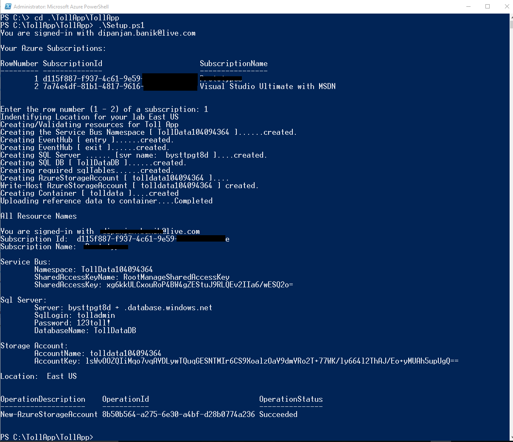
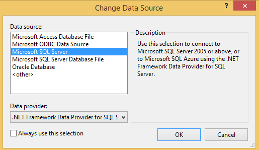
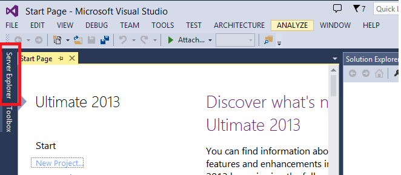
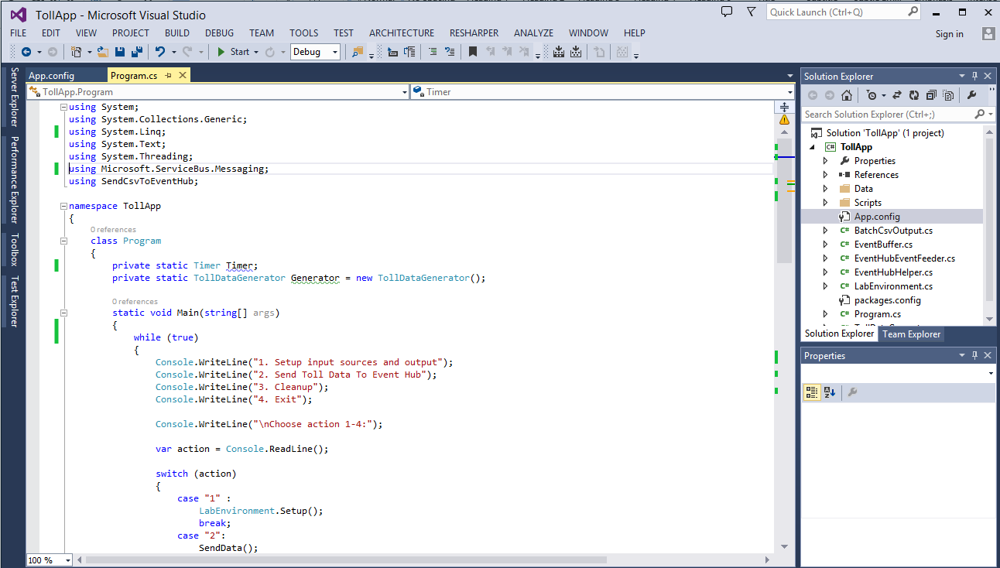

<properties
    pageTitle="Erstellen Sie eine Lösung IoT mithilfe des Streams Analytics | Microsoft Azure"
    description="Erste Schritte-Lernprogramm für die Lösung Stream Analytics IoT eines Szenarios Gebührenschalter"
    keywords="IOT Lösung, Fensterfunktionen"
    documentationCenter=""
    services="stream-analytics"
    authors="jeffstokes72"
    manager="jhubbard"
    editor="cgronlun"
/>

<tags
    ms.service="stream-analytics"
    ms.devlang="na"
    ms.topic="article"
    ms.tgt_pltfrm="na"
    ms.workload="data-services"
    ms.date="09/26/2016"
    ms.author="jeffstok"
/>

# Erstellen Sie eine Lösung IoT mithilfe des Streams Analytics

## Einführung

In diesem Lernprogramm erfahren Sie, wie mit Azure Stream Analytics in Echtzeit Einsichten aus den Daten abgerufen werden. Entwickler können einfach Streams von Daten, z. B. auf-Streams, Protokolle und Gerät benutzerseitig generierte Ereignisse mit zurückliegenden Datensätzen oder Bezug Daten zu leiten Sie Business Einsichten kombinieren. Als vollständig verwalteten, in Echtzeit Stream Berechnung Dienst, der in Microsoft Azure gehostet wird, stellt Azure Stream Analytics integrierten Stabilität, Niedrig Wartezeit und Skalierbarkeit können Sie nach oben und Ausführung in Minuten zu gelangen.

Am Ende dieses Lernprogramms, werden Sie können:

-   Machen Sie sich mit dem Portal Azure Stream Analytics vertraut.
-   Konfigurieren Sie und Bereitstellen Sie einer streaming Position.
-   Erläutern Sie reale Probleme und lösen Sie diese dann mithilfe der Stream Analytics-Abfragesprache.
-   Entwickeln Sie streaming Lösungen für Ihre Kunden mithilfe von Stream Analytics ohne Sicherheitsrisiko.
-   Verwenden Sie die Überwachung und Protokollierung Erfahrung von Problemen.

## Erforderliche Komponenten

Benötigen Sie die folgenden Vorkenntnisse zum Bearbeiten dieses Lernprogramms:

-   Die neueste Version von [Azure PowerShell](../powershell-install-configure.md)
-   Visual Studio 2015 oder der kostenlosen [Visual Studio-Community](https://www.visualstudio.com/products/visual-studio-community-vs.aspx)
-   Ein [Azure-Abonnement](https://azure.microsoft.com/pricing/free-trial/)
-   Administratorrechte auf dem computer
-   Der [TollApp.zip](http://download.microsoft.com/download/D/4/A/D4A3C379-65E8-494F-A8C5-79303FD43B0A/TollApp.zip) vom Microsoft Download Center herunterladen
-   Optional: Quellcode für den TollApp Ereignis Generator in [GitHub](https://aka.ms/azure-stream-analytics-toll-source)

## Szenario Einführung: "Hallo, weder eine gebührenpflichtige!"

Eine gebührenpflichtige ist eine allgemeine Phänomen. Treten sie viele einer Straße plazieren, Brücken und Tunnel auf der ganzen Welt. Jede einzelne weder eine gebührenpflichtige Konsole verfügt über mehrere weder eine gebührenpflichtige Booths. Bei manuellen Booths beenden Sie, um die weder eine gebührenpflichtige an einer Telefonzentrale Zahlen. Am automatisierte Booths durchsucht ein Sensors oben auf jeder Booth eine RFID-Karte, die auf die Windschutzscheibe der Ihr Fahrzeug angebracht ist, wie Sie die weder eine gebührenpflichtige Booth übergeben. Es ist einfach den Durchgang von Fahrzeuge durch diese weder eine gebührenpflichtige Sender als Ereignisstream visualisiert werden sollen, über die interessante Operationen ausgeführt werden können.

## Eingehende Daten

In diesem Lernprogramm funktioniert mit zwei Streams von Daten. In die Eingangs- und von den Sender weder eine gebührenpflichtige installierte Sensoren Naturprodukte ersten Streams. Der zweite Stream ist ein statischer Verweis Dataset, das Fahrzeug Registrierungsdaten enthält.

### Eintrag Datenstream

Eingeben von weder eine gebührenpflichtige Sender enthält der Eintrag Datenstream Informationen Autos.

| TollID | EntryTime               | LicensePlate | Bundesstaat | Stellen Sie   | Modell   | VehicleType | VehicleWeight | Gebührenpflichtige | Kategorie       |
|--------|-------------------------|--------------|-------|--------|---------|-------------|---------------|------|-----------|
| 1      | 2014-09-10-12:01:00.000 | JNB 7001     | NY    | Honda  | KRV     | 1           | 0             | 7    |           |
| 1      | 2014-09-10-12:02:00.000 | YXZ 1001     | NY    | Toyota | Camry   | 1           | 0             | 4    | 123456789 |
| 3      | 2014-09-10-12:02:00.000 | ABC 1004     | CT    | Ford   | Taurus  | 1           | 0             | 5    | 456789123 |
| 2      | 2014-09-10-12:03:00.000 | XYZ 1003     | CT    | Toyota | Corolla | 1           | 0             | 4    |           |
| 1      | 2014-09-10-12:03:00.000 | BNJ 1007     | NY    | Honda  | KRV     | 1           | 0             | 5    | 789123456 |
| 2      | 2014-09-10-12:05:00.000 | CDE 1007     | NJ    | Toyota | 4 x 4     | 1           | 0             | 6    | 321987654 |

Hier ist eine kurze Beschreibung der Spalten aus:

| Spalte | Beschreibung |
|--------------|--------------------------------------------------------------------|
| TollID       | Die weder eine gebührenpflichtige Booth-ID, die eine gebührenpflichtige Booth eindeutig            |
| EntryTime    | Datum und Uhrzeit der Eingabe der Mittel, die weder eine gebührenpflichtige Booth in UTC |
| LicensePlate | Die Anzahl Kennzeichen das Fahrzeug                            |
| Bundesstaat        | Einem Zustand in den Vereinigten Staaten                                           |
| Stellen Sie         | Den Hersteller der Auto                                 |
| Modell        | Die Anzahl von Modell für das Auto                                 |
| VehicleType  | Entweder 1 für Kraftfahrzeugen oder 2 für kommerzielle Fahrzeuge       |
| WeightType   | Fahrzeug Stärke in t; 0 für Kraftfahrzeugen                   |
| Gebührenpflichtige         | Der Wert weder eine gebührenpflichtige US-Dollar                                              |
| Kategorie          | E-Tag auf das Auto, das Zahlung Automatisierung; leer, in denen die Zahlung manuell durchgeführt wurde |

### Beenden Datenstream

Beenden Datenstreams enthält Informationen zum Verlassen der Station weder eine gebührenpflichtige Autos.

| **TollId** | **ExitTime**                 | **LicensePlate** |
|------------|------------------------------|------------------|
| 1          | 2014-09-10T12:03:00.0000000Z | JNB 7001         |
| 1          | 2014-09-10T12:03:00.0000000Z | YXZ 1001         |
| 3          | 2014-09-10T12:04:00.0000000Z | ABC 1004         |
| 2          | 2014-09-10T12:07:00.0000000Z | XYZ 1003         |
| 1          | 2014-09-10T12:08:00.0000000Z | BNJ 1007         |
| 2          | 2014-09-10T12:07:00.0000000Z | CDE 1007         |

Hier ist eine kurze Beschreibung der Spalten aus:

| Spalte | Beschreibung |
|--------------|-----------------------------------------------------------------|
| TollID       | Die weder eine gebührenpflichtige Booth-ID, die eine gebührenpflichtige Booth eindeutig         |
| ExitTime     | Datum und Uhrzeit der Verlassen der Fahrzeug weder eine gebührenpflichtige Booth in UTC |
| LicensePlate | Die Anzahl Kennzeichen das Fahrzeug                         |

### Kommerzielle Fahrzeug Registrierungsdaten

Das Lernprogramm verwendet eine statische Momentaufnahme einer kommerzielle Fahrzeug Registrierung Datenbank.

| LicensePlate | Attribute | Ist abgelaufen |
|--------------|----------------|---------|
| SVT 6023     | 285429838      | 1       |
| XLZ 3463     | 362715656      | 0       |
| PK 1005     | 876133137      | 1       |
| RIV 8632     | 992711956      | 0       |
| SNY 7188     | 592133890      | 0       |
| ELH 9896     | 678427724      | 1       |

Hier ist eine kurze Beschreibung der Spalten aus:

| Spalte | Beschreibung |
|--------------|-----------------------------------------------------------------|
| LicensePlate | Die Anzahl Kennzeichen das Fahrzeug                         |
| Attribute     | Das Fahrzeug der Registrierung-ID |
| Ist abgelaufen | Status von Fahrzeug: 0 Wenn Fahrzeug Registrierung aktiv ist 1, wenn die Registrierung abgelaufen ist                 |

## Einrichten der Umgebung für Azure Stream Analytics

Um dieses Lernprogramms abgeschlossen haben, benötigen Sie ein Microsoft Azure-Abonnement. Microsoft bietet kostenlose Testversion für Microsoft Azure-Dienste.

Wenn Sie nicht über ein Azure-Konto verfügen, können Sie [die Anfrage eine kostenlose Testversion](http://azure.microsoft.com/pricing/free-trial/)an.

> [AZURE.NOTE] Wenn Sie für eine kostenlose Testversion registrieren, benötigen Sie ein mobiles Gerät, das Empfangen von Textnachrichten und eine gültige Kreditkarte.

Achten Sie darauf, dass Sie die Schritte im Abschnitt "Aufräumen auf Ihr Konto Azure" am Ende dieses Artikels folgen, damit Sie optimal nutzen $200 frei Azure Kreditkarte vornehmen können.

## Bereitstellungsressourcen Sie Azure für das Lernprogramm erforderlich ist

Dieses Lernprogramm erfordert zwei Ereignis Hubs *Eintrag* , und *Beenden Sie* Datenstreams empfangen werden sollen. Azure SQL-Datenbank gibt die Ergebnisse der Einzelvorgänge Stream Analytics aus. Azure-Speicher speichert Bezug Daten zu Registrierungen Fahrzeug.

Das Skript Setup.ps1 können im Ordner TollApp auf GitHub Sie um alle erforderliche Ressourcen zu erstellen. Im Interesse der Uhrzeit empfehlen wir, dass Sie die ausgeführt werden. Wenn Sie weitere Informationen zum Konfigurieren Sie diese Ressourcen Azure-Portal erfahren möchten, finden Sie im Anhang "Konfigurieren von zusammengehörenden Ressourcen Azure-Portal".

Laden und Speichern von Dateien und Ordner für unterstützende [TollApp](http://download.microsoft.com/download/D/4/A/D4A3C379-65E8-494F-A8C5-79303FD43B0A/TollApp.zip) .

Öffnen Sie eine **Microsoft Azure PowerShell** -Fenster _als Administrator_an. Wenn Sie noch nicht über Azure PowerShell verfügen, folgen Sie den Anweisungen in [Installieren und Konfigurieren von Azure PowerShell](../powershell-install-configure.md) zur Installation.

Da Windows automatisch ps1 und DLL-Dateien .exe blockiert, müssen Sie die Ausführungsrichtlinie festlegen, bevor Sie das Skript ausführen. Stellen Sie sicher, dass das Fenster Azure PowerShell _als Administrator_ausgeführt wird. Führen Sie **eine uneingeschränkte Set-ExecutionPolicy**. Wenn Sie dazu aufgefordert werden, geben Sie **J**ein.

Führen Sie die **Get-ExecutionPolicy** , um sicherzustellen, dass Sie der Befehl gearbeitet haben.

Wechseln Sie zu dem Verzeichnis, das die Skripts und Generator Anwendung verfügt.

Typ **.\\ Setup.ps1** zum Einrichten Ihrer Azure-Konto erstellen und konfigurieren Sie alle erforderliche Ressourcen und zum Generieren von Ereignissen zu starten. Das Skript setzt zufällig einen Bereich um Ressourcen zu erstellen. Wenn Sie einen Bereich explizit angeben möchten, können Sie übergeben der **-Speicherort** Parameter wie im folgenden Beispiel gezeigt:

**. \\Setup.ps1-Speicherort "Zentralen US"**

Das Skript wird **die Anmeldeseite** für Microsoft Azure geöffnet. Geben Sie Ihre Kontoanmeldeinformationen ein aus.

> [AZURE.NOTE] Wenn Ihr Konto Zugriff auf mehrere Abonnements hat, werden Sie aufgefordert, geben Sie den Namen des Abonnements, den Sie für das Lernprogramm verwenden möchten.

Das Skript dauert einige Minuten zum Ausführen. Nachdem er endet, sollte die Ausgabe wie den folgenden Screenshot aussehen.

Sie können auch ein anderes Fenster anzeigen, das ähnlich wie der folgende Screenshot sind. Dieser Anwendung sendet Ereignisse an Azure Ereignis Hubs, die zum Ausführen des Lernprogramms erforderlich ist. Ja, beenden Sie die Anwendung oder nicht schließen Sie in diesem Fenster, bis Sie das Lernprogramm abgeschlossen haben.

Sie sollten jetzt alle erstellte Ressourcen Azure-Portal zu sehen sein. Wechseln Sie zu <https://manage.windowsazure.com>, und melden Sie sich mit Ihrem Kontoanmeldeinformationen.

### Azure Ereignis Hubs

Klicken Sie auf **DIENSTBUS** auf der linken Seite des Portals Azure um das Skript im vorherigen Abschnitt erstellte Ereignis Hubs anzuzeigen.

Alle verfügbaren Namespaces werden im Rahmen Ihres Abonnements angezeigt. Klicken Sie auf den Termin, der mit *Tolldata* beginnt (tolldata4637388511 in diesem Beispiel). Klicken Sie auf der Registerkarte **Ereignis HUBS** .

Sie sehen zwei Ereignis Hubs mit dem Namen *Eintrag* und *Beenden Sie* in diesem Namespace erstellt.

### Azure Speichercontainer

1. Klicken Sie auf **Speicherplatz** auf der linken Seite des Portals Azure um den Container Azure-Speicher anzuzeigen, der im Lernprogramm verwendet wird.

    

2. Klicken Sie auf den Termin, die mit *Tolldata* beginnen (tolldata4637388511 in diesem Beispiel). Klicken Sie auf der Registerkarte **Container** , um den erstellten Container anzuzeigen.

    

3. Klicken Sie auf den Container **Tolldata** , um die hochgeladene JSON-Datei anzuzeigen, die Fahrzeug Registrierungsdaten enthält.

    

### SQL Azure-Datenbank

1. Klicken Sie auf **SQL-Datenbanken** auf der linken Seite des Portals Azure um finden Sie unter der SQL-Datenbank, die im Lernprogramm verwendet wird.

    

2. Klicken Sie auf **Tolldatadb**.

    

3. Kopieren Sie den Servernamen, ohne die Port-Nummer (*Servername*. database.windows.net, beispielsweise).

## Verbinden Sie mit der Datenbank von Visual Studio

Verwenden Sie Visual Studio, um die Abfrageergebnisse in der Ausgabedatenbank zuzugreifen.

Verbinden Sie mit der SQL-Datenbank (das Ziel) von Visual Studio:

1. Öffnen Sie Visual Studio, und klicken Sie dann auf **Tools** > **Verbindung zur Datenbank herstellen**.

2. Wenn Sie aufgefordert werden, klicken Sie auf **Microsoft SQL Server** als Datenquelle.

    

3. Fügen Sie im Feld **Servername** den Namen, den Sie im vorherigen Abschnitt kopiert, vom Azure-Portal haben (d. h., *Servername*. database.windows.net).

4. Klicken Sie auf **SQL Server-Authentifizierung verwenden**.

5. Geben Sie im Feld **Benutzername** **Tolladmin** und **123toll!** Klicken Sie in das Feld **Kennwort** ein.

6. Klicken Sie auf **aktivieren, oder geben Sie einen Datenbanknamen**, und wählen Sie **TollDataDB** als die Datenbank aus.

    

7. Klicken Sie auf **OK**.

8. Server-Explorer zu öffnen.

    

9. Vier Tabellen in der Datenbank TollDataDB angezeigt.

    

## Ereignis-Generator: TollApp Beispiel für Project

PowerShell-Skript wird automatisch gestartet, um Ereignisse mithilfe der TollApp Beispiel-Anwendung zu senden. Sie müssen keine zusätzliche Schritte ausführen.

Wenn Sie die Implementierungsdetails interessiert sind, können Sie den Quellcode der Anwendung TollApp in GitHub [Beispiele/TollApp](https://aka.ms/azure-stream-analytics-toll-source)suchen.

## Erstellen eines Auftrags für Stream Analytics

1. Klicken Sie im Portal Azure öffnen Sie Stream Analytics, und klicken Sie in der unteren linken Ecke der Seite zum Erstellen eines neuen Analytics Auftrags auf **neu** .

    

2. Klicken Sie auf **SYMBOLLEISTE erstellen**. Wählen Sie aus der gleichen Region, wo andere Ressourcen durch das Skript erstellt werden.

3. Wählen Sie für die Einstellung der **Regionalen Überwachung Speicher-Konto** **Erstellen neue Speicher-Konto** aus, und geben sie einen eindeutigen Namen. Mithilfe dieses Kontos wird Azure Stream Analytics um Überwachung Informationen für alle Ihre zukünftige Projekte zu speichern.

4. Klicken Sie auf **Neuen STREAM ANALYTICS JOB** am unteren Rand der Seite.

    

## Definieren von Datenquellen

1. Klicken Sie auf den Auftrag erstellten Analytics im Portal.

    

2. Klicken Sie auf der Registerkarte **EINGABEN** , um die Quelldaten definieren.

    

3. Klicken Sie auf **eine EINGABESPRACHE hinzufügen**.

    

4. Klicken Sie auf der ersten Seite **DATA STREAM** auf.

    

5. Klicken Sie auf der zweiten Seite des Assistenten auf **Ereignis HUB** .

    

6. Geben Sie **EntryStream** als **Eingabe ALIAS**ein.

7. Klicken Sie auf den **Ereignis-Hub** Dropdown-Pfeil, und wählen Sie den aus, der mit "TollData" (beispielsweise TollData9518658221) beginnt.

8. Wählen Sie als Hubnamen des Ereignisses und **Alle** als Ereignis Hub Richtliniennamen **Eintrag** ein.

    Wie werden Ihre Einstellungen aus:

    

9. Wählen Sie auf der nächsten Seite **JSON** für **Ereignis das FORMAT** und **UTF8** für **Codierung**ein.

    

10. Klicken Sie auf **OK** am unteren Rand der Seite um den Assistenten zu beenden.

    

    Jetzt, da Sie den Eintrag Stream erstellt haben, führen Sie dieselben Schritte zum Erstellen des Streams beenden aus. Klicken Sie auf der dritten Seite des Assistenten unbedingt Werte wie den folgenden Screenshot eingeben.

    

    Sie haben zwei Eingabewerte Streams definiert:

    

    Fügen Sie als Nächstes Bezug Dateneingabe für die Blobdatei, die Auto Registrierungsdaten enthält.

11. Klicken Sie auf **EINGABESPRACHE hinzufügen**, und klicken Sie dann auf **Daten Bezug**.

    

12. Wählen Sie auf der nächsten Seite das Speicherkonto, das mit **Tolldata**beginnt. Der Containername sollte **Tolldata**sein, und die Namen der Blob unter **Pfad Muster** sollte **registration.json**sein. Dieser Dateiname wird zwischen Groß- und Kleinbuchstaben angezeigt werden soll.

    

13. Wählen Sie die Werte aus, wie im folgenden Screenshot auf der nächsten Seite dargestellt, und klicken Sie dann auf **OK** , um den Assistenten zu beenden.

    

Nun werden alle Eingaben definiert.

## Definieren der Ausgabe

1. Klicken Sie auf der Registerkarte **Ausgabe** , und klicken Sie dann auf **Ein Ausgabe hinzufügen**.

    

2. Klicken Sie auf **SQL-Datenbank**.

3. Wählen Sie den Servernamen, der im Abschnitt "Verbinden zu Datenbank von Visual Studio" dieses Artikels verwendet wurde. Der Datenbankname ist **TollDataDB**.

4. Geben Sie im Feld **USERNAME** **Tolladmin** **123toll!** in das Feld **Kennwort** ein, und **TollDataRefJoin** im Feld **Tabelle** .

    

## Azure Stream Analytics-Abfrage

Die Registerkarte **Abfrage** enthält eine SQL-Abfrage, die die eingehenden Daten umwandelt.

In diesem Lernprogramm versucht, mehrere Business Fragen beantworten, die zum Abfragen von Daten und Konstrukte Stream Analytics gebührenpflichtige, die in Azure Stream Analytics verwendet werden können, um eine entsprechende Antwort verwandt sind.

Bevor Sie Ihre erste Stream Analytics Arbeit beginnen, betrachten Sie ein paar Szenarien und die Abfragesyntax ein.

## Einführung in Azure Stream Analytics-Abfragesprache
-----------------------------------------------------

Einmal angenommen, dass Sie die Anzahl der Fahrzeuge zu zählen, die eine gebührenpflichtige Booth eingeben müssen. Da dies ein fortlaufendes von Ereignissen ist, müssen Sie einen "Zeitraum." definieren Ändern Sie uns die Frage benutzerspezifisch "wie viele Fahrzeuge eine gebührenpflichtige Booth alle drei Minuten enter?". Dies ist im Allgemeinen als die Anzahl der Tumbling bezeichnet.

Sehen wir uns die Azure Stream Analytics-Abfrage, die finden Sie Antworten auf diese Frage:

    SELECT TollId, System.Timestamp AS WindowEnd, COUNT(*) AS Count
    FROM EntryStream TIMESTAMP BY EntryTime
    GROUP BY TUMBLINGWINDOW(minute, 3), TollId

Wie Sie sehen können, verwendet Azure Stream Analytics eine Abfragesprache, die wie SQL ist, und fügt ein paar Erweiterungen um Zeitangaben Aspekte der Abfrage anzugeben.

Weitere Informationen hierzu erfahren Sie [Zeitmanagement](https://msdn.microsoft.com/library/azure/mt582045.aspx) und [Windowing](https://msdn.microsoft.com/library/azure/dn835019.aspx) Konstrukte, die in der Abfrage von MSDN verwendet.

## Testen der Azure Stream Analytics-Abfragen

Nachdem Sie Ihre erste Azure Stream Analytics Abfrage geschrieben haben, ist es mittels Beispieldatendateien befindet sich im Ordner "TollApp" in den folgenden Pfad überprüfen werden:

**.. \\TollApp\\TollApp\\Daten**

Dieser Ordner enthält die folgenden Dateien:

- Entry.JSON
- Exit.JSON
- Registration.JSON

## Frage 1: Anzahl der Fahrzeuge eine gebührenpflichtige Booth eingeben

1. Öffnen Sie das Azure-Portal, und wechseln Sie zu Ihrer erstellten Azure Stream Analytics Position. Klicken Sie auf die Registerkarte **Abfrage** , und fügen Sie die Abfrage aus dem vorherigen Abschnitt.

    

2. Wenn Sie um diese Abfrage mit Beispieldaten zu überprüfen, klicken Sie auf die Schaltfläche **Testen** . Klicken Sie im Dialogfeld, das geöffnet wird, wechseln Sie zu Entry.json, eine Datei mit Beispieldaten aus dem **EntryTime** Ereignisstream.

    

3. Überprüfen Sie, dass die Ausgabe der Abfrage ist wie erwartet:

    

## Frage 2: Bericht Gesamtzeit für jedes Auto passieren der weder eine gebührenpflichtige booth

Die Effizienz des Prozesses sowie die Customer Experience bewerten können Sie die durchschnittliche Zeit, die für ein Auto der weder eine gebührenpflichtige passieren erforderlich ist.

Um die Gesamtzeit zu finden, müssen Sie EntryTime Streams mit dem Stream ExitTime teilnehmen. Sie können die Streams auf Spalten TollId und LicencePlate teilnehmen. Der **Teilnahme an** Operator erfordert, zeitliche Spielraum anzugeben, die den zulässigen zeitlichen Unterschied zwischen den verknüpfte Ereignisse beschrieben. Sie werden **DATEDIFF** -Funktion verwendet, um anzugeben, dass Ereignisse maximal 15 Minuten voneinander sein soll. Sie gelten auch die **DATEDIFF** -Funktion zu beenden und den Eintrag Mal aus, um die tatsächliche Zeit berechnet werden, die ein Auto in der benötigt weder eine gebührenpflichtige aufwenden. Beachten Sie den Unterschied zur Verwendung von **DATEDIFF** , wenn sie in einer **SELECT** -Anweisung statt einer **JOIN** -Bedingung verwendet wird.

    SELECT EntryStream.TollId, EntryStream.EntryTime, ExitStream.ExitTime, EntryStream.LicensePlate, DATEDIFF (minute , EntryStream.EntryTime, ExitStream.ExitTime) AS DurationInMinutes
    FROM EntryStream TIMESTAMP BY EntryTime
    JOIN ExitStream TIMESTAMP BY ExitTime
    ON (EntryStream.TollId= ExitStream.TollId AND EntryStream.LicensePlate = ExitStream.LicensePlate)
    AND DATEDIFF (minute, EntryStream, ExitStream ) BETWEEN 0 AND 15

1. Um diese Abfrage testen, aktualisieren Sie die Abfrage auf der Registerkarte **Abfrage** des Projekts:

    

2. Klicken Sie auf **Testen** , und geben Sie Eingabewerte Beispieldateien für EntryTime und ExitTime.

    

3. Aktivieren Sie das Kontrollkästchen zum Testen der Abfrage, und zeigen Sie die Ausgabe an:

    

## Frage 3: Bericht alle kommerzielle Fahrzeuge mit Abgelaufene Registrierung

Statische Momentaufnahmen der Daten können Azure Stream Analytics mit zeitliche Datenstreams teilnehmen. Um diese Funktion zu veranschaulichen, verwenden Sie die folgenden Beispiel Frage aus.

Wenn ein Fahrzeug kommerzielle mit dem Unternehmen weder eine gebührenpflichtige registriert ist, können sie durch die weder eine gebührenpflichtige Booth geleitet, ohne für die Überprüfung gestoppt. Sie werden kommerzielle Fahrzeug Registrierung Nachschlagetabelle verwenden, um alle kommerzielle Fahrzeuge zu identifizieren, die Registrierungen abgelaufen sind.

    SELECT EntryStream.EntryTime, EntryStream.LicensePlate, EntryStream.TollId, Registration.RegistrationId
    FROM EntryStream TIMESTAMP BY EntryTime
    JOIN Registration
    ON EntryStream.LicensePlate = Registration.LicensePlate
    WHERE Registration.Expired = '1'

Klicken Sie zum Testen einer Abfrage mithilfe von Verweisdaten müssen Sie eine Datenquelle für die Daten Bezug zu definieren, die Sie bereits getan haben.

1. Um diese Abfrage testen, fügen Sie die Abfrage in der Registerkarte ' **Abfrage** ', klicken Sie auf **Testen**, und geben Sie die zwei Eingabewerte Quellen:

    

2. Zeigen Sie die Ausgabe der Abfrage:

    

## Starten Sie den Auftrag Stream Analytics

Nun ist es an der Zeit, beenden Sie die Konfiguration, und starten den Auftrag. Speichern der Abfrage Frage 3 wird die Ausgabe erzeugen, die das Schema der Ausgabetabelle **TollDataRefJoin** entspricht.

Öffnen Sie den Auftrag **DASHBOARD**, und klicken Sie auf **START**.

Klicken Sie im daraufhin angezeigten Dialogfeld ändern Sie die Uhrzeit **Ausgabe starten** auf **Benutzerdefinierte Uhrzeit**. Ändern Sie die Stunde in eine Stunde vor der aktuellen Uhrzeit ein. Diese Änderung wird sichergestellt, dass alle Ereignisse aus dem Ereignis Hub seit dem Generieren der Ereignisse am Anfang des Lernprogramms verarbeitet werden. Klicken Sie nun auf das Häkchen, um den Auftrag zu starten.

Starten den Auftrag kann einige Minuten dauern. Sie können den Status auf der Seite auf oberster Ebene Stream Analytics finden Sie unter.

## Überprüfen Sie die Ergebnisse in Visual Studio

1. Öffnen Sie Visual Studio-Server-Explorer, und mit der rechten Maustaste in der Tabelle **TollDataRefJoin** .
2. Klicken Sie auf **Tabellendaten anzeigen** , um die Ausgabe des Projekts anzuzeigen.

    

## Skalieren Sie bei Azure Stream Analytics Aufträge

Azure Stream Analytics dient zu elastisch skalieren, dass sie eine große Datenmenge behandelt werden kann. Die Abfrage Azure Stream Analytics können **PARTITION BY** -Klausel das System mitteilen, dem diesen Schritt skalieren. **PartitionId** ist eine spezielle Spalte, die das System fügt hinzu, um die ID der die Eingabe (Ereignis Hub) entsprechen.

    SELECT TollId, System.Timestamp AS WindowEnd, COUNT(*)AS Count
    FROM EntryStream TIMESTAMP BY EntryTime PARTITION BY PartitionId
    GROUP BY TUMBLINGWINDOW(minute,3), TollId, PartitionId

1. Beenden Sie der aktuellen Position, aktualisieren Sie die Abfrage in der Registerkarte **Abfrage** , und öffnen Sie die Registerkarte **ZEICHNUNGSMAßSTAB** .

    **STREAMING Einheiten** definieren die Menge der Power berechnen, die der Auftrag empfangen können.

2. Bewegen Sie den Schieberegler nach 6 ein.

    

3. Wechseln Sie zur Registerkarte **Ausgaben** aus, und ändern Sie den Namen der SQL-Tabelle in **TollDataTumblingCountPartitioned**.

Wenn Sie den Auftrag starten nun können Azure Stream Analytics Verteilen von Arbeit mehr berechnen Ressourcen und besseren Durchsatz erzielen. Bitte beachten Sie, dass die Anwendung TollApp auch durch TollId aufgeteilt Ereignisse sendet.

## Monitor

Die Registerkarte **MONITOR** enthält Statistiken über der ausgeführte Auftrag.

Sie können die Registerkarte **DASHBOARD** **Vorgang Protokolle** zugreifen.

Um weitere Informationen zu einem bestimmten Ereignis anzuzeigen, klicken Sie auf das Ereignis, und klicken Sie dann auf die Schaltfläche **DETAILS** .

## Abschluss

In diesem Lernprogramm Sie zum Dienst Azure Stream Analytics eingeführt werden. Es wurde veranschaulicht, wie Eingaben und Ausgaben für das Projekt Stream Analytics konfigurieren. Verwenden das Daten weder eine gebührenpflichtige Szenario, Erläuterung des Lernprogramms gängige Typen von Problemen, die in dem Bereich von Daten in Bewegung und wie sie behoben werden können mit einfachen SQL-ähnliche Abfragen in Azure Stream Analytics auftreten. Das Lernprogramm beschriebenen SQL-Erweiterung Konstrukte für die Arbeit mit zeitliche Daten. Es wurde gezeigt, wie Datenstreams verknüpft, wie Daten Streams mit statischen Verweisdaten bereichern und wie Skalieren einer Abfrage um höhere Durchsatz zu erzielen.

Obwohl in diesem Lernprogramm eine gute Einführung enthält, ist es nicht in keiner Weise abgeschlossen. Sie können weitere Abfrage Mustern verwenden die Sprache SAQL am [Abfragebeispiele für allgemeine Stream Analytics Verwendungsmustern](stream-analytics-stream-analytics-query-patterns.md)suchen.
Lesen Sie die [Onlinedokumentation](https://azure.microsoft.com/documentation/services/stream-analytics/) erfahren Sie mehr über Azure Stream Analytics.

## Ihr Konto Azure Aufräumen

1. Beenden Sie den Auftrag Stream Analytics Azure-Portal an.

    Das Skript Setup.ps1 erstellt zwei Ereignis Hubs und einer SQL-Datenbank. Die folgenden Anweisungen helfen Ihnen bei Bereinigen von Ressourcen am Ende des Lernprogramms.

2. Geben Sie in einem Fenster PowerShell **.\\ Cleanup.ps1** , das Skript zu beginnen, die im Lernprogramm verwendete Ressourcen werden gelöscht.

    > [AZURE.NOTE] Ressourcen werden nach dem Namen identifiziert. Stellen Sie sicher, dass Sie jedes Element sorgfältig überprüfen, bevor Sie bestätigen von entfernen.

    
