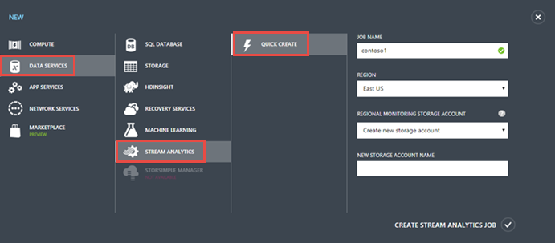
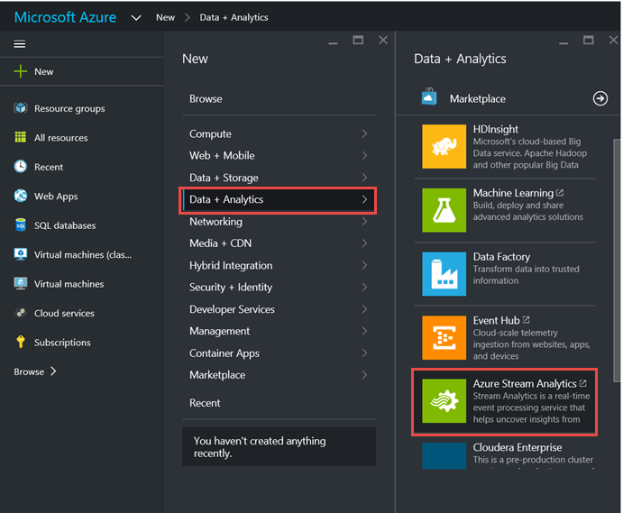
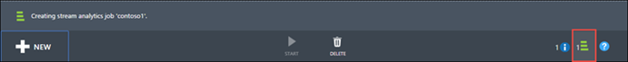
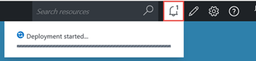
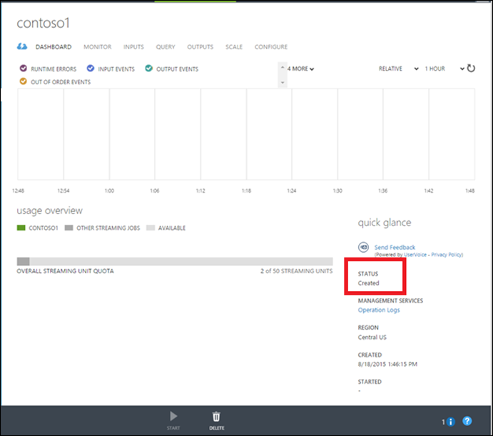
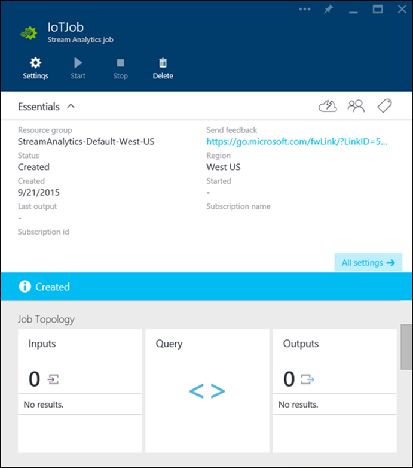

<properties 
    pageTitle="So erstellen Sie einen Daten Analytics Verarbeitung Auftrag für Stream Analytics | Microsoft Azure" 
    description="Erstellen Sie einen Daten Analytics Verarbeitung Auftrag für Stream Analytics | Learning Path Segment an."
    keywords="Verarbeitung von Analysen"
    documentationCenter=""
    services="stream-analytics"
    authors="jeffstokes72" 
    manager="jhubbard" 
    editor="cgronlun"/>

<tags 
    ms.service="stream-analytics" 
    ms.devlang="na" 
    ms.topic="article" 
    ms.tgt_pltfrm="na" 
    ms.workload="data-services" 
    ms.date="09/26/2016" 
    ms.author="jeffstok"/> 

# So erstellen Sie einen Daten Analytics Verarbeitung Auftrag für Stream Analytics

Ressource die obersten Ebene in Azure Stream Analytics ist ein Stream Analytics Auftrag.  Es besteht aus eine oder mehrere Eingabedaten Quellen, eine Abfrage der Datentransformation Ausdrücken und einen oder mehrere Ausgabe Zielen, denen Ergebnisse in geschrieben werden. Zusammen ermöglichen diese Benutzern Daten Analytics processing für das streaming Datenszenarien ausführen.

Zum Verwenden von Stream Analytics, beginnen Sie durch Erstellen eines neuen Stream Analytics Auftrags.  Beachten Sie, dass diese Aktion keine Abrechnung Auswirkungen hat, bis Sie der Auftrag gestartet wird.

1.  Melden Sie sich bei der online [Azure klassischen Portal](http://manage.windowsazure.com) oder im [Azure-Portal](https://portal.azure.com/).
2.  Im Portal: **Klicken Sie auf neu**, klicken Sie dann auf **Datendienste** oder **Daten Analytics** je nachdem Ihr Portal und klicken Sie dann auf **Azure Stream Analytics** oder **Stream Analytics** und klicken Sie dann auf **Symbolleiste erstellen**.

      

      

3.  Geben Sie die gewünschte Konfiguration für das Projekt Stream Analytics an.
    - Geben Sie im Feld **Position Name** einen Namen für den Auftrag Stream Analytics ein. Wenn der **Name der Position** überprüft wird, wird ein grünes Häkchen im Feld Auftrag angezeigt. Der **Auftragsname** darf nur alphanumerische Zeichen enthalten und die ' – ' Zeichen und muss zwischen 3 und 63 Zeichen.
    - Verwenden Sie **Region** in den Azure-Portal oder den **Speicherort** der Azure-Portal die geografische Position angeben, in dem der Auftrag ausgeführt werden soll.
    - Wenn das Azure-Portal verwenden zu können, aktivieren Sie oder erstellen Sie ein Speicherkonto als den **Regionalen Überwachung Speicher-Konto**verwendet. Dieses Speicherkonto dient zum Speichern von Daten für alle Stream Analytics Aufträge in diesem Bereich ausgeführt.
    - Wenn das Azure-Portal zu halten Sie die zugehörige Ressourcen für eine Anwendung verwenden einer neuen oder vorhandenen **Ressourcengruppe** angeben.

4.  Nachdem Sie die Optionen für neuen Stream Analytics Aufträge konfiguriert haben, klicken Sie auf **Stream Analytics-Projekt erstellen**. Sie können für das Projekt Stream Analytics erstellt werden ein paar Minuten dauern. Um den Status zu überprüfen, können Sie den Fortschritt im Hub Benachrichtigungen überwachen.

      

      

5.  Die neue Position wird mit dem Status **erstellt**angezeigt. Beachten Sie, dass die Schaltfläche **Start** deaktiviert ist. Bevor Sie den Auftrag beginnen können, müssen Sie den Auftrag Eingabe, Abfrage- und Ausgabe konfigurieren.

      

      

## Anfordern von Hilfe
Für weitere Unterstützung zu erhalten versuchen Sie es unsere [Azure Stream Analytics-forum](https://social.msdn.microsoft.com/Forums/en-US/home?forum=AzureStreamAnalytics)

## Nächste Schritte

- [Einführung in Azure Stream Analytics](stream-analytics-introduction.md)
- [Erste Schritte mit Azure Stream Analytics](stream-analytics-get-started.md)
- [Skalieren Sie Azure Stream Analytics Aufträge](stream-analytics-scale-jobs.md)
- [Azure Stream Analytics Query Language Bezug](https://msdn.microsoft.com/library/azure/dn834998.aspx)
- [Azure Stream Analytics Management REST-API-Referenz](https://msdn.microsoft.com/library/azure/dn835031.aspx)
