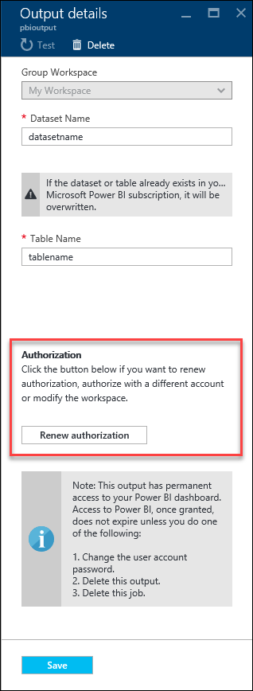
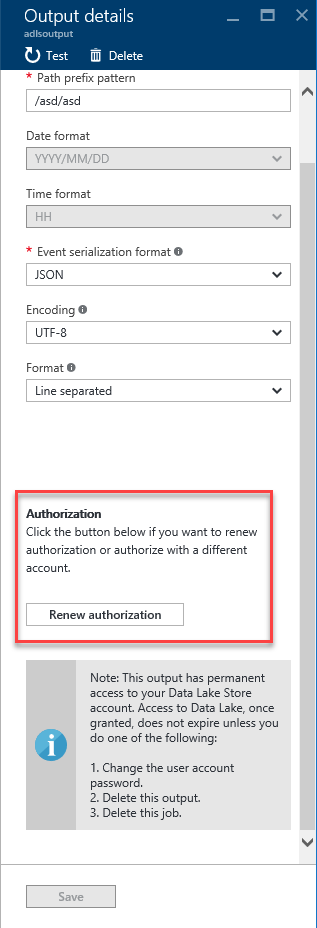

<properties
    pageTitle="Stream Analytics Lake Datenspeicher Ausgabe | Microsoft Azure"
    description="Konfiguration der Authentifizierung und Autorisierung von einer Azure Lake Datenspeicher in einem Stream Analytics Auftrag"
    keywords=""
    services="stream-analytics"
    documentationCenter=""
    authors="jeffstokes72"
    manager="jhubbard"
    editor="cgronlun"
/>

<tags
    ms.service="stream-analytics"
    ms.devlang="na"
    ms.topic="article"
    ms.tgt_pltfrm="na"
    ms.workload="big-data"
    ms.date="09/26/2016"
    ms.author="jeffstok"
/>

# Stream Analytics Lake Datenspeicher Ausgabe

Stream Analytics Aufträge unterstützt mehrere Ausgabemethoden, eine einer [Azure dem Datenspeicher](https://azure.microsoft.com/services/data-lake-store/)wird. Azure Lake Datenspeicher ist eine unternehmensweite hyper-Skala Repository für große Daten analytisches Auslastung. Lake Datenspeicher können Sie jeder Größe, Typ und Aufnahme Geschwindigkeit für Betrieb und Allgemeines Analytics Daten zu speichern.

## Ein Konto Lake Datenspeicher autorisieren

1.  Wenn Lake Datenspeicher als Ausgabe im Verwaltungsportal Azure ausgewählt ist, werden Sie die Verwendung von Ihrer vorhandenen Datenspeicher Lake autorisieren oder Anfordern des Zugriffs auf die Daten dem Store Vorschau über das klassische Azure-Portal aufgefordert werden.

      

2.  Wenn Sie bereits Zugriff auf Lake Datenspeicher haben, klicken Sie auf "Jetzt Autorisieren" und für kurze Zeit eine Seite Popup "Umleiten zu Autorisierung..." angibt. Die Seite wird automatisch geschlossen, und es wird mit der Seite, die Sie konfigurieren die Ausgabe Lake Datenspeicher ermöglichen angezeigt werden.

Wenn Sie sich für die Daten dem Store Vorschau nicht angemeldet haben, können Sie folgen Sie den Link "Jetzt registrieren", um die Anforderung initiieren, oder führen Sie die [Erste Schritte-Anweisungen](../data-lake-store/data-lake-store-get-started-portal.md).

## Konfigurieren Sie die Eigenschaften des Sees Datenspeicher Ausgabe

Nachdem Sie das authentifiziert Lake Datenspeicher-Konto verfügen, können Sie die Eigenschaften für die Ausgabe Lake Datenspeicher konfigurieren. In der nachfolgenden Tabelle wird die Liste der Eigenschaftennamen und deren Beschreibung die Ausgabe Lake Datenspeicher konfigurieren.

<table>
<tbody>
<tr>
<td><B>EIGENSCHAFTSNAME</B></td>
<td><B>BESCHREIBUNG</B></td>
</tr>
<tr>
<td>Die Ausgabealias</td>
<td>Dies ist einen Anzeigenamen ein, die in Abfragen verwendet, um die Abfrageausgabe zu dieser Lake Datenspeicher zu lenken.</td>
</tr>
<tr>
<td>Lake Datenspeicher-Konto</td>
<td>Der Name des Speicherkontos, in dem Sie die Ausgabe senden möchten. Es wird mit einer Dropdown-Liste der Lake Datenspeicher Konten angezeigt, denen der Benutzer auf das Portal angemeldet auf zugreifen kann.</td>
</tr>
<tr>
<td>Pfad Präfix Muster [<I>optional</I>]</td>
<td>Der Dateipfad zum Schreiben von Dateien in der angegebenen Daten dem Store-Konto verwendet.  {Date}, {Time} Beispiel 1: Ordner1/Protokolle / {date} / {time} Beispiel 2: Ordner1/Protokolle / {date}</td>
</tr>
<tr>
<td>Datumsformat [<I>optional</I>]</td>
<td>Wenn das Datum Token in den Pfad Präfix verwendet wird, können Sie das Datumsformat auswählen, in dem Ihre Dateien organisiert sind. Beispiel: JJJJ/MM/TT</td>
</tr>
<tr>
<td>Zeitformat [<I>optional</I>]</td>
<td>Wird das Uhrzeit Token in den Pfad Präfix verwendet, geben Sie das Zeitformat, in dem Ihre Dateien organisiert sind. Aktuell ist der einzige unterstützte Wert HH.</td>
</tr>
<tr>
<td>Das Ereignisformat</td>
<td>Serialisierungsformat für Ausgabedaten. JSON, CSV- und Avro werden unterstützt.</td>
</tr>
<tr>
<td>Codierung</td>
<td>Wenn CSV- oder JSON formatieren zu können, muss eine Codierung angegeben werden. UTF-8 ist der einzige unterstützte Codierung Format zu diesem Zeitpunkt an.</td>
</tr>
<tr>
<td>Trennzeichen</td>
<td>Gilt nur für die CSV-Serialisierung. Stream Analytics unterstützt eine Reihe von üblichen Trennzeichen für die CSV-Daten serialisieren. Unterstützte Werte sind Komma, Semikolon, Leerzeichen, Registerkarte und senkrechten Strich.</td>
</tr>
<tr>
<td>Formatieren</td>
<td>Gilt nur für das JSON-Serialisierung. Zeile getrennt gibt an, dass die Ausgabe formatiert wird, indem Sie jede JSON-Objekt, das durch eine neue Zeile getrennt. Array gibt an, dass das Ergebnis als Array von JSON-Objekten formatiert wird.</td>
</tr>
</tbody>
</table>

## Erneuern Sie Lake Datenspeicher Autorisierung

Es ist derzeit eine Einschränkung, wo das Authentifizierungstoken manuell aktualisiert alle 90 Tage für alle Projekte mit Lake Datenspeicher Ausgabe werden muss. Sie müssen auch Ihr Konto Lake Datenspeicher erneut authentifizieren, wenn Sie Ihr Kennwort geändert haben, da Ihre Position der letzten Authentifizierung oder erstellt wurde. Ein auftretendes Problem dieses Problems ist keine Ausgabe Position und ein Fehler in den Vorgang Protokollen, die Notwendigkeit der erneuten Autorisierung angibt.

Um dieses Problem zu beheben, beenden Sie Ihre laufenden Auftrag, und wechseln Sie zu der Ausgabe Lake Datenspeicher. Klicken Sie auf den Link "Autorisierung" Erneuern", und für kurze Zeit eine Seite Popup"Umleiten zu Autorisierung..."angibt. Die Seite wird automatisch geschlossen, und wenn der Vorgang erfolgreich ist, gibt "Autorisierung erfolgreich erneuert wurde.". Sie dann müssen am unteren Rand der Seite auf "Speichern" klicken und durch Ihre Position ab dem letzten beendet Zeitpunkt zur Vermeidung von Datenverlust Neustarten fortfahren können.

