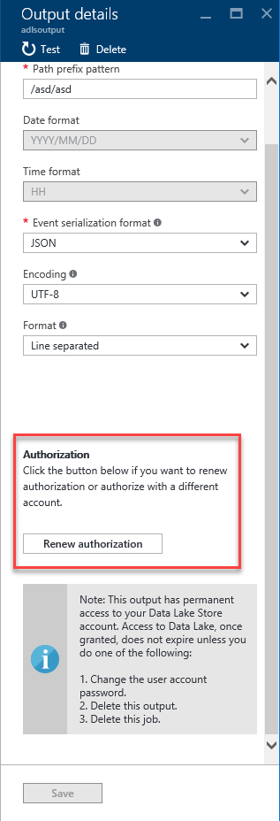

<properties
    pageTitle="Übertragen Sie Analytics Ausgaben: Optionen für die Speicherung, Analyse | Microsoft Azure"
    description="Lernen Sie Stream Analytics Daten Ausgaben Optionen, einschließlich der Power BI für Analyseergebnisse verwendet."
    keywords="Datentransformation, Analyseergebnisse, Datenspeicheroptionen"
    services="stream-analytics,documentdb,sql-database,event-hubs,service-bus,storage"
    documentationCenter="" 
    authors="jeffstokes72"
    manager="jhubbard" 
    editor="cgronlun"/>

<tags
    ms.service="stream-analytics"
    ms.devlang="na"
    ms.topic="article"
    ms.tgt_pltfrm="na"
    ms.workload="data-services"
    ms.date="09/26/2016"
    ms.author="jeffstok"/>

# Übertragen Sie Analytics Ausgaben: Optionen für die Speicherung, Analyse

Erwägen Sie beim Verfassen einer Stream Analytics Position, wie die resultierenden Daten verwendet werden. Wie werden die Ergebnisse des Streams Analytics Auftrags anzeigen und, wo speichern Sie?

Um eine Vielzahl von Mustern Anwendung zu aktivieren, weist Azure Stream Analytics verschiedene Optionen zum Speichern von Ausgabe und Analyseergebnisse anzeigen. Dies erleichtert das Projekt Ausgabe anzuzeigen und Flexibilität im Speicher der Ausgabe Position und Verbrauch für Data Warehouse und andere Zwecke. Keine Ausgabe im Auftrag konfiguriert muss vorhanden sein, bevor der Auftrag gestartet wird und Ereignisse Starten entdeckt. Beispielsweise, wenn Sie als Ausgabe Blob-Speicher verwenden, erstellt der Auftrag nicht Speicher-Konto automatisch. Es muss vom Benutzer erstellt werden, bevor Sie der Auftrag ASA gestartet wird.

## Azure Lake Datenspeicher

Stream Analytics unterstützt [Azure dem Datenspeicher](https://azure.microsoft.com/services/data-lake-store/). Diese Speicher können Sie jeder Größe, Typ und Aufnahme Geschwindigkeit für Betrieb und Allgemeines Analytics Daten zu speichern. Erstellung und Konfiguration der Lake Datenspeicher Ausgaben wird zu diesem Zeitpunkt nur in der klassischen Azure-Portal unterstützt. Darüber hinaus muss Stream Analytics berechtigt sein, Datenspeicher Lake Zugriff auf. Die [Daten dem Ausgabe Artikel](stream-analytics-data-lake-output.md)behandelt Details auf Autorisierung und wie Sie für die Daten dem Store Preview registrieren (falls erforderlich).

### Ein Azure Lake Datenspeicher autorisieren

Wenn dem Datenspeicher als Ausgabe im Verwaltungsportal Azure ausgewählt ist, werden Sie aufgefordert, eine Verbindung mit einer vorhandenen Lake Datenspeicher zu autorisieren.  

  

Füllen Sie dann die Eigenschaften für die Ausgabe Lake Datenspeicher wie folgt:

  

In der nachfolgenden Tabelle listet die Eigenschaftennamen und deren Beschreibung für das Erstellen einer Ausgabe Lake Datenspeicher erforderlich.

<table>
<tbody>
<tr>
<td><B>EIGENSCHAFTSNAME</B></td>
<td><B>BESCHREIBUNG</B></td>
</tr>
<tr>
<td>Die Ausgabealias</td>
<td>Dies ist einen Anzeigenamen ein, die in Abfragen verwendet, um die Abfrageausgabe zu dieser Lake Datenspeicher zu lenken.</td>
</tr>
<tr>
<td>Kontoname</td>
<td>Der Name des Kontos dem Datenspeicher, in dem Sie die Ausgabe senden möchten. Es wird mit einer Dropdown-Liste der Lake Datenspeicher Konten angezeigt, denen der Benutzer auf das Portal angemeldet auf zugreifen kann.</td>
</tr>
<tr>
<td>Pfad Präfix Muster [<I>optional</I>]</td>
<td>Der Dateipfad zum Schreiben von Dateien in der angegebenen Daten dem Store-Konto verwendet.  {Date}, {Time} Beispiel 1: Ordner1/Protokolle / {date} / {time} Beispiel 2: Ordner1/Protokolle / {date}</td>
</tr>
<tr>
<td>Datumsformat [<I>optional</I>]</td>
<td>Wenn das Datum Token in den Pfad Präfix verwendet wird, können Sie das Datumsformat auswählen, in dem Ihre Dateien organisiert sind. Beispiel: JJJJ/MM/TT</td>
</tr>
<tr>
<td>Zeitformat [<I>optional</I>]</td>
<td>Wird das Uhrzeit Token in den Pfad Präfix verwendet, geben Sie das Zeitformat, in dem Ihre Dateien organisiert sind. Aktuell ist der einzige unterstützte Wert HH.</td>
</tr>
<tr>
<td>Das Ereignisformat</td>
<td>Serialisierungsformat für Ausgabedaten. JSON, CSV- und Avro werden unterstützt.</td>
</tr>
<tr>
<td>Codierung</td>
<td>Wenn CSV- oder JSON formatieren zu können, muss eine Codierung angegeben werden. UTF-8 ist der einzige unterstützte Codierung Format zu diesem Zeitpunkt an.</td>
</tr>
<tr>
<td>Trennzeichen</td>
<td>Gilt nur für die CSV-Serialisierung. Stream Analytics unterstützt eine Reihe von üblichen Trennzeichen für die CSV-Daten serialisieren. Unterstützte Werte sind Komma, Semikolon, Leerzeichen, Registerkarte und senkrechten Strich.</td>
</tr>
<tr>
<td>Format</td>
<td>Gilt nur für das JSON-Serialisierung. Zeile getrennt gibt an, dass die Ausgabe formatiert wird, indem Sie jede JSON-Objekt, das durch eine neue Zeile getrennt. Array gibt an, dass das Ergebnis als Array von JSON-Objekten formatiert wird.</td>
</tr>
</tbody>
</table>

### Erneuern Sie Lake Datenspeicher Autorisierung

Sie müssen Ihr Konto Lake Datenspeicher erneut authentifizieren, wenn das Kennwort geändert hat, da Ihre Position der letzten Authentifizierung oder erstellt wurde.

  

## SQL-Datenbank

[Azure SQL-Datenbank](https://azure.microsoft.com/services/sql-database/) kann als Ausgabe verwendet werden, für die Daten, die in der Natur relational ist oder für Applikationen, die Inhalte gehostet werden, in einer relationalen Datenbank abhängig sind. Stream Analytics Aufträge werden in einer vorhandenen Tabelle in einer SQL Azure-Datenbank geschrieben werden.  Beachten Sie, dass das Tabellenschema die Felder und deren Typen die Ausgabe über Ihre Arbeit genau entsprechen muss. Ein [Azure SQL-Data Warehouse](https://azure.microsoft.com/documentation/services/sql-data-warehouse/) kann auch als über die SQL-Datenbank Ausgabe auch die Option Ausgabe angegeben werden (Dies ist ein Vorschaufeature). In der nachfolgenden Tabelle listet die Eigenschaftennamen und deren Beschreibung für die Ausgabe einer SQL-Datenbank zu erstellen.

| Eigenschaftsname | Beschreibung |
|---------------|-------------|
| Die Ausgabealias | Dies ist einen Anzeigenamen ein, die in Abfragen verwendet, um die Abfrageausgabe Zugriff auf diese Datenbank zu lenken. |
| Datenbank | Den Namen der Datenbank, in dem Sie die Ausgabe senden möchten |
| Servername | Der Name des SQL-Datenbankservers |
| Benutzername | Der Benutzername der sowie das Schreiben in der Datenbank zugreifen kann |
| Kennwort | Das Kennwort für die Verbindung mit der Datenbank |
| Tabelle | Der Tabellenname, in dem die Ausgabe geschrieben werden. Der Tabellenname Groß-/Kleinschreibung beachtet wird, und das Schema der in dieser Tabelle sollte genau auf die Anzahl der Felder und deren Typen, die von Ihrem Auftragsausgabe generiert entsprechen. |

> [AZURE.NOTE] Aktuell wird das Angebot Azure SQL-Datenbank für eine Position Ausgabe in Stream Analytics unterstützt. Ein Azure-virtuellen Computern mit SQL Server mit einer Datenbank angefügt wird jedoch nicht unterstützt. Dies ist in zukünftigen Versionen geändert.

## BLOB-Speicher

BLOB-Speicher bietet eine kostengünstigere und skalierbare Lösung für große Mengen von unstrukturierten Daten in der Cloud speichern.  Eine Einleitung Azure Blob-Speicher und seine Verwendung finden Sie in der Dokumentation wie [Blobs verwendet](../storage/storage-dotnet-how-to-use-blobs.md).

In der nachfolgenden Tabelle listet die Eigenschaftennamen und deren Beschreibung für das Erstellen einer Blob-Ausgabe.

<table>
<tbody>
<tr>
<td>EIGENSCHAFTSNAME</td>
<td>BESCHREIBUNG</td>
</tr>
<tr>
<td>Die Ausgabealias</td>
<td>Dies ist einen Anzeigenamen ein, die in Abfragen verwendet, um die Abfrageausgabe zu diesem Blob-Speicher zu lenken.</td>
</tr>
<tr>
<td>Speicher-Konto</td>
<td>Der Name des Speicherkontos, in dem Sie die Ausgabe senden möchten.</td>
</tr>
<tr>
<td>Kontoschlüssel Speicher</td>
<td>Den geheimen Schlüssel mit Speicher-Konto verknüpft ist.</td>
</tr>
<tr>
<td>Speichercontainer</td>
<td>Container stellen eine logische Gruppierung für Blobs in Microsoft Azure Blob-Dienst gespeichert. Wenn Sie einen Blob zum Dienst Blob hochladen, müssen Sie einen Container für die Blob angeben.</td>
</tr>
<tr>
<td>Pfad Präfix Muster [optional]</td>
<td>Der Dateipfad zum Schreiben von Ihrem Blobs im angegebenen Container verwendet. In den Pfad können Sie eine oder mehrere Instanzen der folgenden 2 Variablen verwenden, um die Häufigkeit anzugeben, die Blobs geschrieben werden: {Date}, {Time} Beispiel 1: cluster1/Protokolle / {date} / {time} Beispiel 2: cluster1/Protokolle / {date}</td>
</tr>
<tr>
<td>Datumsformat [optional]</td>
<td>Wenn das Datum Token in den Pfad Präfix verwendet wird, können Sie das Datumsformat auswählen, in dem Ihre Dateien organisiert sind. Beispiel: JJJJ/MM/TT</td>
</tr>
<tr>
<td>Zeitformat [optional]</td>
<td>Wird das Uhrzeit Token in den Pfad Präfix verwendet, geben Sie das Zeitformat, in dem Ihre Dateien organisiert sind. Aktuell ist der einzige unterstützte Wert HH.</td>
</tr>
<tr>
<td>Das Ereignisformat</td>
<td>Serialisierungsformat für Ausgabedaten.  JSON, CSV- und Avro werden unterstützt.</td>
</tr>
<tr>
<td>Codierung</td>
<td>Wenn CSV- oder JSON formatieren zu können, muss eine Codierung angegeben werden. UTF-8 ist der einzige unterstützte Codierung Format zu diesem Zeitpunkt an.</td>
</tr>
<tr>
<td>Trennzeichen</td>
<td>Gilt nur für die CSV-Serialisierung. Stream Analytics unterstützt eine Reihe von üblichen Trennzeichen für die CSV-Daten serialisieren. Unterstützte Werte sind Komma, Semikolon, Leerzeichen, Registerkarte und senkrechten Strich.</td>
</tr>
<tr>
<td>Format</td>
<td>Gilt nur für das JSON-Serialisierung. Zeile getrennt gibt an, dass die Ausgabe formatiert wird, indem Sie jede JSON-Objekt, das durch eine neue Zeile getrennt. Array gibt an, dass das Ergebnis als Array von JSON-Objekten formatiert wird.</td>
</tr>
</tbody>
</table>

## Ereignis-Hub

[Ereignis Hubs](https://azure.microsoft.com/services/event-hubs/) ist eine hochgradig skalierbare Veröffentlichen-Abonnieren Ingestor Ereignis. Sie können mehrere Millionen Ereignisse pro Sekunde sammeln.  Von einem Ereignis-Hub in der Ausgabe können verwendet werden, wenn die Ausgabe eines Auftrags Stream Analytics die Eingabe von einem anderen streaming Auftrag gehört.

Es gibt ein paar Parameter, die erforderlich sind, um das Ereignis Hub Datenstreams als Ausgabe konfigurieren.

| Eigenschaftsname | Beschreibung |
|---------------------------------|------------------------------------------------------------------------------------------------------------------------------------------------------------------------------------------------------------------------------|
| Die Ausgabealias | Dies ist einen Anzeigenamen ein, die in Abfragen verwendet, um die Abfrageausgabe an diesem Ereignis Hub zu lenken. |
| Service Bus Namespace | Ein Namespace Dienstbus ist ein Container für eine Gruppe von Personen messaging. Wenn Sie ein neues Ereignis Hub erstellt haben, erstellt Sie auch einen Namespace Dienstbus |
| Ereignis-Hub | Den Namen der Ausgabe Ereignis Hub |
| Name der Veranstaltung Hub Richtlinie | Die freigegebenen Zugriffsrichtlinie, die auf der Registerkarte Ereignis Hub konfigurieren erstellt werden können. Jede freigegebenen Zugriffsrichtlinie haben einen Namen, die Berechtigungen, die Sie festlegen möchten, und Tastenkombinationen |
| Ereignis Hub Richtlinienschlüssel | Die freigegebene Zugriffstaste verwendet, um Zugriff auf den Namespace Dienstbus authentifizieren |
| Partition Key Column [optional] | Diese Spalte enthält die Partitionsschlüssel für die Ausgabe Ereignis-Hub an. |
| Das Ereignisformat | Serialisierungsformat für Ausgabedaten.  JSON, CSV- und Avro werden unterstützt. |
| Codierung | Für CSV und JSON ist UTF-8 zu diesem Zeitpunkt der einzige unterstützte Codierung format |
| Trennzeichen | Gilt nur für die CSV-Serialisierung. Stream Analytics unterstützt eine Reihe von üblichen Trennzeichen für Serialisieren der Daten im CSV-Format. Unterstützte Werte sind Komma, Semikolon, Leerzeichen, Registerkarte und senkrechten Strich. |
| Format | Gilt nur für das JSON-Typ. Zeile getrennt gibt an, dass die Ausgabe formatiert wird, indem Sie jede JSON-Objekt, das durch eine neue Zeile getrennt. Array gibt an, dass das Ergebnis als Array von JSON-Objekten formatiert wird. |

## Power BI

[Power BI](https://powerbi.microsoft.com/) kann als Ausgabe für ein Projekt Stream Analytics für eine Visualisierung Rich-Nutzung der Analyseergebnisse bereitstellen verwendet werden. Diese Funktion kann zum Betrieb Dashboards, generieren und Metrisch leistungsgesteuert reporting verwendet werden.

### Autorisieren Sie ein Power BI-Konto

1.  Beim Power BI als Ausgabe im Verwaltungsportal Azure ausgewählt ist, werden Sie einen vorhandenen Benutzer der Power BI autorisieren oder zum Erstellen eines neuen Power BI-Kontos aufgefordert werden.  

      

2.  Erstellen Sie ein neues Konto nicht noch mindestens ein, und klicken Sie auf jetzt autorisieren.  Ein Bildschirm ähnlich der folgenden wird angezeigt.  

      

3.  Geben Sie in diesem Schritt die geschäftlichen oder schulnotizbücher für die Ausgabe der Power BI autorisieren. Wenn Sie nicht bereits für Power BI angemeldet sind, wählen Sie jetzt melden Sie sich nach oben. Das geschäftlichen oder schulnotizbücher von Ihnen verwendete Konto für Power BI unterscheiden sich möglicherweise von dem Abonnementkonto Azure-verwenden die aktuell mit dem Sie angemeldet sind.

### Konfigurieren Sie die Eigenschaften der Power BI-Ausgabe

Nachdem Sie das Power BI-Konto authentifiziert haben, können Sie die Eigenschaften für die Power BI-Ausgabe konfigurieren. In der nachfolgenden Tabelle wird die Liste der Eigenschaftennamen und deren Beschreibung Ihrer Power BI-Ausgabe konfigurieren.

| Eigenschaftsname | Beschreibung |
|---------------------------------|------------------------------------------------------------------------------------------------------------------------------------------------------------------------------------------------------------------------------|
| Die Ausgabealias | Dies ist einen Anzeigenamen ein, die in Abfragen verwendet wird, um die Ausgabe der Abfrage auf diese PowerBI Ausgabe umzuleiten. |
| Gruppe-Arbeitsbereich | Zum Aktivieren der Freigabe von Daten mit anderen Benutzern Power BI können Sie Gruppen innerhalb Ihrer Power BI-Konto aktivieren oder wählen Sie "Meine Workspace" aus, wenn Sie nicht in einer Gruppe zu schreiben möchten.  Aktualisieren einer vorhandenen Gruppe erfordert die Power BI-Authentifizierung erneuern. | 
| DataSet-Name | Geben Sie einen Dataset an, die es erwünscht ist, für die Power BI-Ausgabe verwenden |
| Tabellenname | Geben Sie einen Tabellennamen unter Dataset der Ausgabe Power BI. Derzeit kann Power BI-Ausgabe von Stream Analytics stellen nur eine Tabelle in einem Dataset haben. |

Konfigurieren von einer Power BI-Ausgabe und Dashboard eine exemplarische Vorgehensweise finden Sie im Artikel [Azure Stream Analytics und Power BI](stream-analytics-power-bi-dashboard.md) .

> [AZURE.NOTE] Nicht erstellen Sie explizit das Dataset und die Tabelle in der Power BI-Dashboard. Das Dataset und die Tabelle werden automatisch ausgefüllt werden, wenn Sie der Auftrag wird gestartet und der Auftrag beginnt entsprechend Ausgabe in Power BI. Beachten Sie, dass, wenn die Abfrage Auftrag Ergebnisse generieren nicht, das Dataset und die Tabelle nicht erstellt werden. Beachten Sie auch, wenn auf Power BI bereits ein Dataset und die Tabelle mit demselben Namen wie eine dieser Stream Analytics Auftrag bereitgestellt wurde, wird die vorhandenen Daten überschrieben.

### Power BI Autorisierung erneuern

Sie müssen Ihr Konto Power BI erneut authentifizieren, wenn das Kennwort geändert hat, da Ihre Position der letzten Authentifizierung oder erstellt wurde. Wenn mehrstufige Authentifizierung (MFA) auf Ihrem Mandanten Azure Active Directory (AAD) konfiguriert ist, müssen Sie auch Power BI-Autorisierung alle 2 Wochen erneuern. Ein auftretendes Problem dieses Problems ist keine Ausgabe Position und ein "authentifizieren Benutzerfehler" in den Vorgang Protokollen auf:

    

Um dieses Problem zu beheben, beenden Sie Ihre laufenden Auftrag, und wechseln Sie zu Ihrer Power BI-Ausgabe.  Klicken Sie auf den Link "Erneuern Autorisierung" und starten Sie Ihre Aufgabe ab dem letzten beendet Zeitpunkt zur Vermeidung von Datenverlust.

    

## Table Storage

[Azure Table Storage](../storage/storage-introduction.md) bietet hoch verfügbare und hochgradig skalierbar Speicher, damit eine Anwendung automatisch skaliert werden kann, um den Benutzer bei Bedarf entsprechen. Tabellenspeicher ist Microsoft NoSQL Key-Attribut Store mit weniger Einschränkungen für das Schema der für strukturierte Daten nutzen kann. Azure Table Storage kann zum Speichern von Daten für die Beibehaltung und effizienter Abruf verwendet werden.

In der nachfolgenden Tabelle listet die Eigenschaftennamen und deren Beschreibung für die Tabellenausgabe einer erstellen.

| Eigenschaftsname | Beschreibung |
|---------------------|--------------------------------------------------------------------------------------------------------------------------------------------------------------------------------------------------------------------------------------------------------|
| Die Ausgabealias | Dies ist einen Anzeigenamen ein, die in Abfragen verwendet, um die Abfrageausgabe zu diesem Tabellenspeicher zu lenken. |
| Speicher-Konto | Der Name des Speicherkontos, in dem Sie die Ausgabe senden möchten. |
| Kontoschlüssel Speicher | Die Zugriffstaste Speicher-Konto zugeordnet. |
| Tabellenname | Der Name der Tabelle. Die Tabelle wird erstellt erhalten, wenn er nicht vorhanden ist. |
| Partitionsschlüssel | Der Name der Ausgabespalte mit der Partitionsschlüssel. Der Partitionsschlüssel ist ein eindeutiger Bezeichner für die Partition innerhalb einer Tabelle, die im ersten Teil des Primärschlüssels einer Entität bildet. Es ist eine Zeichenfolge, die Größe von bis zu 1 KB sein können. |
| Zeile-Taste | Der Name der Ausgabespalte, die die Taste Zeile enthält. Die Taste Zeile ist ein eindeutiger Bezeichner für eine Entität innerhalb einer bestimmten Partition. Sie bildet den zweiten Teil des Primärschlüssels einer Entität. Die Taste Zeile ist ein Zeichenfolgenwert, der Größe von bis zu 1 KB sein können. |
| Stapelgröße | Die Anzahl der Datensätze für einen Vorgang Stapel. In der Regel die Standardeinstellung ist ausreichend für die meisten Aufträge, schlagen Sie in der [Tabelle Stapel Vorgang Spezifikation](https://msdn.microsoft.com/library/microsoft.windowsazure.storage.table.tablebatchoperation.aspx) Weitere Details zum Ändern dieser Einstellung. |

## Reaktionsgruppendienst Bus Warteschlangen

[Bus Servicewarteschlangen](https://msdn.microsoft.com/library/azure/hh367516.aspx) bieten eine First In Nachrichtenübermittlung für einen oder mehrere verschiedenen Consumer ersten Out (FIFO). In der Regel werden Nachrichten erwartet empfangen und von den Empfängern in der zeitliche Reihenfolge, in der er in der Warteschlange hinzugefügt wurden, und jeder Nachricht empfangen und nur eine Nachricht Consumer verarbeiteten, verarbeitet werden.

In der nachfolgenden Tabelle listet die Eigenschaftennamen und deren Beschreibung für das Erstellen einer Warteschlange Ausgabe.

| Eigenschaftsname | Beschreibung |
|----------------------------|------------------------------------------------------------------------------------------------------------------------------------------------------------------------------------------------------------------------------|
| Die Ausgabealias | Dies ist einen Anzeigenamen ein, die in Abfragen verwendet, um die Abfrageausgabe an diesem Dienst Bus Warteschlange zu lenken. |
| Service Bus Namespace | Ein Namespace Dienstbus ist ein Container für eine Gruppe von Personen messaging. |
| Name der Warteschlange | Der Name der Warteschlange Bus Dienst. |
| Name der Richtlinie Warteschlange | Wenn Sie eine Warteschlange erstellen, können Sie auch Richtlinien gemeinsamen Zugriff auf der Registerkarte Warteschlange konfigurieren erstellen. Jede freigegebenen Zugriffsrichtlinie haben einen Namen, die Berechtigungen, die Sie festlegen möchten, und Tastenkombinationen. |
| Warteschlange Richtlinienschlüssel | Die freigegebene Zugriffstaste verwendet, um Zugriff auf den Namespace Dienstbus authentifizieren |
| Das Ereignisformat | Serialisierungsformat für Ausgabedaten.  JSON, CSV- und Avro werden unterstützt. |
| Codierung | Für CSV und JSON ist UTF-8 zu diesem Zeitpunkt der einzige unterstützte Codierung format |
| Trennzeichen | Gilt nur für die CSV-Serialisierung. Stream Analytics unterstützt eine Reihe von üblichen Trennzeichen für Serialisieren der Daten im CSV-Format. Unterstützte Werte sind Komma, Semikolon, Leerzeichen, Registerkarte und senkrechten Strich. |
| Format | Gilt nur für das JSON-Typ. Zeile getrennt gibt an, dass die Ausgabe formatiert wird, indem Sie jede JSON-Objekt, das durch eine neue Zeile getrennt. Array gibt an, dass das Ergebnis als Array von JSON-Objekten formatiert wird. |

## Service Bus Topics

Während Bus Servicewarteschlangen eine 1: 1-Kommunikationsmethode vom Absender, Empfänger bereitstellen, finden [Service Bus Themen](https://msdn.microsoft.com/library/azure/hh367516.aspx) Sie eine 1: n-Formular Kommunikationsmethode.

In der nachfolgenden Tabelle listet die Eigenschaftennamen und deren Beschreibung für die Tabellenausgabe einer erstellen.

| Eigenschaftsname | Beschreibung |
|----------------------------|---------------------------------------------------------------------------------------------------------------------------------------------------------------------------------------------------------------------------------------------------------------------------------------------------------------------------------------------------------------------------|
| Die Ausgabealias | Dies ist einen Anzeigenamen ein, die in Abfragen verwendet, um die Abfrageausgabe Service Bus Thema zu lenken. |
| Service Bus Namespace | Ein Namespace Dienstbus ist ein Container für eine Gruppe von Personen messaging. Wenn Sie ein neues Ereignis Hub erstellt haben, erstellt Sie auch einen Namespace Dienstbus |
| Name des Themas | Themen handelt es sich um Personen, ähnlich wie Ereignis Hubs und Warteschlangen messaging. Sie sind ausgelegt Ereignisstreams aus einer Reihe von anderen Geräten und-Diensten zu sammeln. Wenn Sie ein Thema erstellt wurde, wird es auch einen bestimmten Namen angegeben. E-Mails von einem Thema stehen nicht zur Verfügung, es sei denn, ein Abonnement wird erstellt, dies sicherzustellen, dass es sind ein oder mehrere Abonnements unter dem Thema |
| Name der Richtlinie Thema | Wenn Sie ein Thema erstellen, können Sie auch Richtlinien gemeinsamen Zugriff auf der Registerkarte Thema konfigurieren erstellen. Jede freigegebenen Zugriffsrichtlinie haben einen Namen, die Berechtigungen, die Sie festlegen möchten, und Tastenkombinationen |
| Thema Richtlinienschlüssel | Die freigegebene Zugriffstaste verwendet, um Zugriff auf den Namespace Dienstbus authentifizieren |
| Das Ereignisformat | Serialisierungsformat für Ausgabedaten.  JSON, CSV- und Avro werden unterstützt. |
| Codierung | Wenn CSV- oder JSON formatieren zu können, muss eine Codierung angegeben werden. UTF-8 ist der einzige unterstützte Codierung Format zu diesem Zeitpunkt |
| Trennzeichen | Gilt nur für die CSV-Serialisierung. Stream Analytics unterstützt eine Reihe von üblichen Trennzeichen für Serialisieren der Daten im CSV-Format. Unterstützte Werte sind Komma, Semikolon, Leerzeichen, Registerkarte und senkrechten Strich. |

## DocumentDB

[Azure DocumentDB](https://azure.microsoft.com/services/documentdb/) ist ein vollständig verwaltete NoSQL Dokument Datenbank-Dienst, der Abfrage und Transaktionen über Schema freie Daten vorhersehbar und zuverlässigen Leistung und schnelle Entwicklung bietet.

In der nachfolgenden Tabelle listet die Eigenschaftennamen und deren Beschreibung für die Ausgabe eines DocumentDB erstellen.

<table>
<tbody>
<tr>
<td>EIGENSCHAFTSNAME</td>
<td>BESCHREIBUNG</td>
</tr>
<tr>
<td>Kontoname</td>
<td>Der Name des Kontos DocumentDB.  Dies kann auch den Endpunkt für das Konto sein.</td>
</tr>
<tr>
<td>Kontoschlüssel</td>
<td>Die freigegebenen Zugriffstaste für das Konto DocumentDB.</td>
</tr>
<tr>
<td>Datenbank</td>
<td>Der Name des DocumentDB-Datenbank.</td>
</tr>
<tr>
<td>Sammlung Namensmuster</td>
<td>Die Websitesammlung Muster für die Sammlungen verwendet werden. Namensformat Auflistung kann mithilfe des Tokens optional {Partition} starten, wo Partitionen von 0 erstellt werden. Z. B. Im folgenden sind gültige Eingaben: MyCollection {Partition} MyCollection Beachten Sie, dass Websitesammlungen vorhanden, bevor Sie den Auftrag Stream Analytics sein müssen wird gestartet, und es wird nicht automatisch erstellt werden.</td>
</tr>
<tr>
<td>Partitionsschlüssel</td>
<td>Der Name des Felds in der Ausgabe Ereignisse verwendet, um die Taste für die Ausgabe über Websitesammlungen Partitionierung anzugeben.</td>
</tr>
<tr>
<td>Dokument-ID</td>
<td>Basiert auf der Namen des Felds in der Ausgabe verwendet, um den Primärschlüssel anzugeben einfügen oder Ereignisse Vorgänge aktualisieren.</td>
</tr>
</tbody>
</table>

## Anfordern von Hilfe
Für weitere Unterstützung zu erhalten versuchen Sie es unsere [Azure Stream Analytics-forum](https://social.msdn.microsoft.com/Forums/en-US/home?forum=AzureStreamAnalytics)

## Nächste Schritte
Sie haben eine Einführung in Stream Analytics, einen verwalteten Dienst für das streaming Analytics auf Daten aus dem Internet der Dinge wurde. Weitere Informationen zu diesem Dienst finden Sie unter:

- [Erste Schritte mit Azure Stream Analytics](stream-analytics-get-started.md)
- [Skalieren Sie Azure Stream Analytics Aufträge](stream-analytics-scale-jobs.md)
- [Azure Stream Analytics Query Language Bezug](https://msdn.microsoft.com/library/azure/dn834998.aspx)
- [Azure Stream Analytics Management REST-API-Referenz](https://msdn.microsoft.com/library/azure/dn835031.aspx)

<!--Link references-->
[stream.analytics.developer.guide]: ../stream-analytics-developer-guide.md
[stream.analytics.scale.jobs]: stream-analytics-scale-jobs.md
[stream.analytics.introduction]: stream-analytics-introduction.md
[stream.analytics.get.started]: stream-analytics-get-started.md
[stream.analytics.query.language.reference]: http://go.microsoft.com/fwlink/?LinkID=513299
[stream.analytics.rest.api.reference]: http://go.microsoft.com/fwlink/?LinkId=517301
