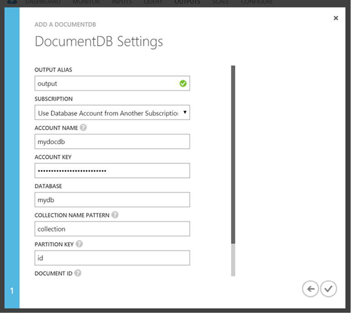

<properties
    pageTitle="JSON-Ausgabe für Stream Analytics | Microsoft Azure"
    description="Erfahren Sie, wie Stream Analytics Azure DocumentDB für die JSON-Ausgabe für Daten Archivierung und Low-Wartezeit Abfragen auf unstrukturierte JSON-Daten angewendet werden kann."
    keywords="JSON-Ausgabe"
    documentationCenter=""
    services="stream-analytics,documentdb"
    authors="jeffstokes72"
    manager="jhubbard"
    editor="cgronlun"/>

<tags
    ms.service="stream-analytics"
    ms.devlang="na"
    ms.topic="article"
    ms.tgt_pltfrm="na"
    ms.workload="data-services"
    ms.date="09/26/2016"
    ms.author="jeffstok"/>

# Ziel Azure DocumentDB für die JSON-Ausgabe von Stream Analytics

Stream Analytics können [Azure DocumentDB](https://azure.microsoft.com/services/documentdb/) für die Aktivierung der Archivierung und mit geringer Verzögerung Datenabfragen auf unstrukturierte JSON-Daten ausgeben, JSON adressieren. Erfahren Sie, wie diese Integration am besten implementiert wird.

Personen, die mit DocumentDB nicht vertraut sind, sehen Sie sich die Schritte [DocumentDBs learning Pfad](https://azure.microsoft.com/documentation/learning-paths/documentdb/) .

## Grundlagen des DocumentDB ein Ziel für die Ausgabe
Die Ausgabe der Azure DocumentDB in Stream Analytics ermöglicht schreiben Ihre Ergebnisse als JSON-Ausgabe in Ihrer DocumentDB Websitesammlung(en) processing Stream. Stream Analytics erstellt Websitesammlungen in Ihrer Datenbank keine stattdessen dass diese vorab zu erstellen. Dies ist, dass die Abrechnung Kosten des DocumentDB Websitesammlungen für Sie transparent sind und so, dass die Leistung, Konsistenz und Kapazität von Ihrer Websitesammlungen direkt über die [APIs DocumentDB](https://msdn.microsoft.com/library/azure/dn781481.aspx)optimiert werden kann. Es empfiehlt sich, mithilfe einer DocumentDB Datenbank pro Projekt streaming Ihrer Websitesammlungen für ein Projekt streaming logisch voneinander zu trennen.

Einige der DocumentDB Auflistung Optionen werden nachfolgend detailliert beschrieben.

## Optimieren von Konsistenz, Verfügbarkeit und Wartezeit

Um Ihren Anforderungen Anwendung zuzuordnen, kann DocumentDB Sie Schnelles optimieren die Datenbank und Websitesammlungen, und nehmen Sie Kompromisse zwischen Konsistenz, Verfügbarkeit und Wartezeit an. Je nach welche Ebenen gelesen Konsistenz Indexeigenschaften Szenario gegen lesen und Schreiben Wartezeit, die Sie eine Konsistenz Ebene für Ihr Datenbankkonto auswählen können. Auch sind standardmäßig, aktiviert DocumentDB synchroner Indizierung auf jede CRUD-Vorgang in Ihrer Websitesammlung. Dies ist eine andere nützliche Option die Leistung Schreiben/Lesen in DocumentDB steuern. Weitere Informationen zu diesem Thema Überprüfen Sie im Artikel [Ändern Ihrer Datenbank und Abfrage Konsistenz Ebenen](../documentdb/documentdb-consistency-levels.md) .

## Wählen Sie eine Leistungsstufe

DocumentDB Websitesammlungen können auf 3 unterschiedliche Performance Ebenen (S1, S2 oder S3) erstellt werden, die den verfügbaren Durchsatz für CRUDs dieser Sammlung zu bestimmen. Darüber hinaus wird die Leistung durch den Berechtigungsstufen Indizierung/Konsistenz Ihrer Websitesammlung beeinflusst. Lizenzinformationen finden Sie [in diesem Artikel](../documentdb/documentdb-performance-levels.md) für diese Leistungsmerkmale im Detail zu verstehen.

## Upserts aus Stream Analytics

Stream Analytics Integration mit DocumentDB können Sie einfügen oder Aktualisieren von Datensätzen in der DocumentDB-Sammlung basierend auf einer bestimmten Dokument-ID-Spalte. Dies wird auch als eine *Upsert*bezeichnet.

Stream Analytics verwendet einen optimistischen Upsert Ansatz, in dem Updates nur fertig sind, wenn Einfügen aufgrund einer Dokument-ID-Konflikt fehlschlägt. Dieses Update erfolgt über Stream Analytics als PATCH, damit es ermöglicht teilweise Updates für das Dokument, d. h. Erweiterung neue Eigenschaften oder ersetzen, die eine vorhandene Eigenschaft inkrementell durchgeführt werden. Beachten Sie, dass sich die Werte der Matrix Eigenschaften im Dokument JSON in der gesamten Datenfeld erste überschrieben, d. h. das Ergebnis wird nicht zusammengeführt.

## In DocumentDB Aufteilen von Daten

DocumentDB Websitesammlungen können Sie Ihre Daten basierend auf den Abfragemuster und die Leistung Anforderungen Ihrer Anwendung unterteilen. Jede Websitesammlung kann bis zu 10GB Daten (maximal) enthalten und aktuell besteht keine Möglichkeit, eine Auflistung von skalieren (oder zum Überlauf). Für die Skalierung, Stream Analytics ermöglicht es Ihnen, sowie das Schreiben in mehrere Websitesammlungen mit einem bestimmten Präfix (siehe unten Verwendungsdetails). Stream Analytics verwendet die konsistente [Partitionsresolver Hash](https://msdn.microsoft.com/library/azure/microsoft.azure.documents.partitioning.hashpartitionresolver.aspx) -Strategie basierend auf dem bereitgestellten PartitionKey Spalte Benutzer, deren Ausgabe Datensätze unterteilen. Die Anzahl der Websitesammlungen mit dem angegebenen Präfix zur Startzeit für das streaming Auftrag dient als die Ausgabe Partitionsanzahl, zu dem schreibt der Auftrag in parallel (DocumentDB Websitesammlungen = Ausgabe Partitions). Für eine einzelne S3-Sammlung mit verzögerte Indizierung dieser Vorgang nur, zu 0.4 die MB/s schreiben Durchsatz zu rechnen ist fügt. Mehrere Websitesammlungen verwenden, können Sie zum Erreichen von höherer Durchsatz und vergrößerte zulassen.

Wenn Sie beabsichtigen, die Partitionsanzahl zukünftig zu erhöhen, müssen Sie Ihre Aufgabe zu beenden, die Daten aus vorhandenen Sammlungen in neue Websitesammlungen Neupartitionierung und starten Sie den Auftrag Stream Analytics neu. Informationen zur Aufteilung erneut Beispiel-Code und PartitionResolver verwenden, wird in einen Beitrag auszuführenden enthalten sein. Die [Partitionierung in DocumentDB](../articles/documentdb-partition-data.md#developing-a-partitioned-application) Artikel enthält auch Details auf diese.

## DocumentDB Einstellungen für die JSON-Ausgabe

Erstellen von DocumentDB als Ausgabe in Stream Analytics generiert eine Aufforderung Informationen wie folgt. Dieser Abschnitt enthält eine Erläuterung der Eigenschaften Definition.

  

-   **Die Ausgabealias** – ein Alias diese Ausgabe in Ihrer Abfrage ASA verweisen  
-   **Kontoname** – den Namen oder den Endpunkt-URI für das Konto DocumentDB.  
-   **Kontoschlüssel** – freigegebenen Tastenkombination für das Konto DocumentDB.  
-   **Datenbank** – das DocumentDB Datenbankname ein.  
-   **Sammlung Namensmuster** – der Websitesammlung ein Muster für die Sammlungen verwendet werden. Namensformat Auflistung kann mithilfe des Tokens optional {Partition} starten, wo Partitionen von 0 erstellt werden. Im folgenden sind die Stichprobe gültige Eingaben:  
   1\) MyCollection – eine Auflistung, die mit der Bezeichnung "MyCollection" vorhanden sein muss.  
   2\) MyCollection {Partition} – solche Websitesammlungen müssen vorhanden sein, – "MyCollection0", "MyCollection1", "MyCollection2" usw..  
-   **Partitionsschlüssel** – den Namen des Felds in der Ausgabe Ereignisse verwendet, um die Taste für die Ausgabe über Websitesammlungen Partitionierung anzugeben. Für die einzelnen Websitesammlung Ausgabe, kann jeder beliebigen Spalte z. B. PartitionId verwendet.  
-   **Dokument-ID** – Optional. Der Name des Felds in der Ausgabe Ereignisse verwendet, um den Primärschlüssel anzugeben, welche einfügen, den oder aktualisieren Sie auf Vorgänge basieren.  
