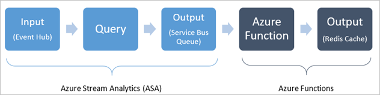
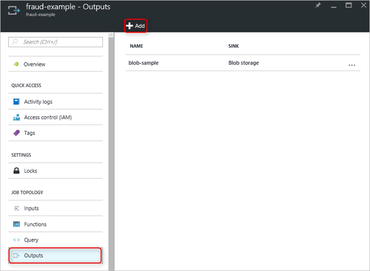
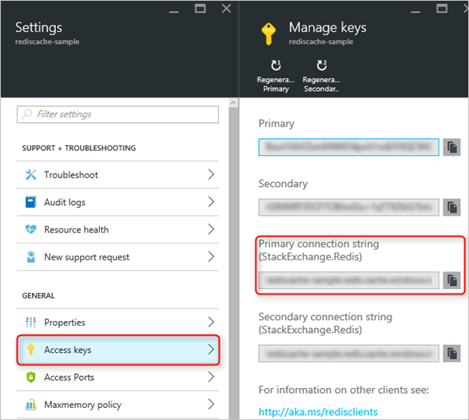
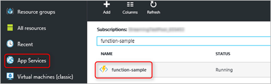
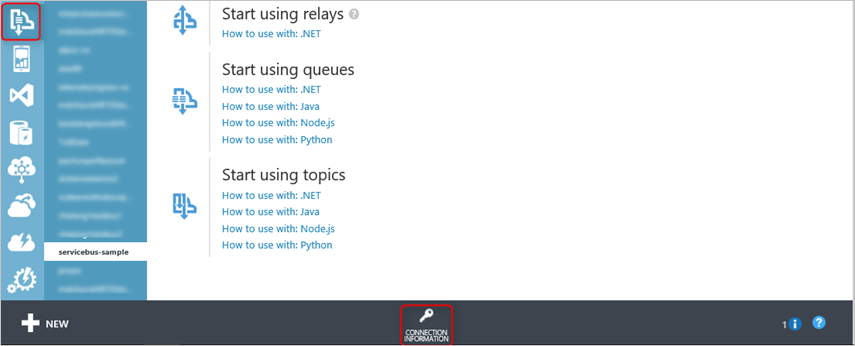
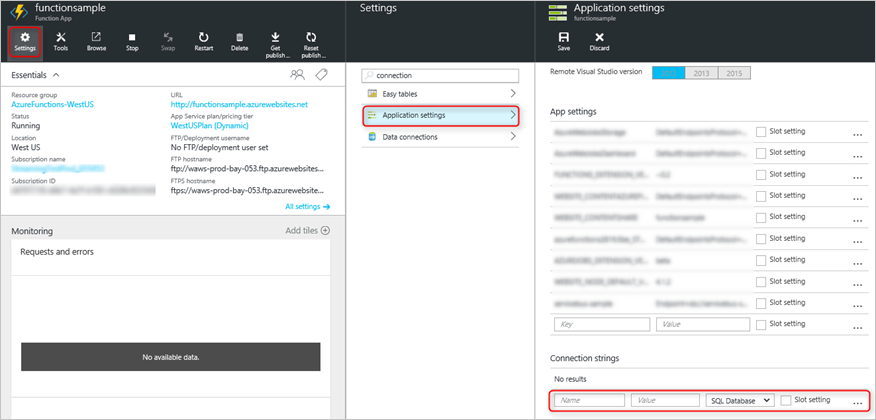
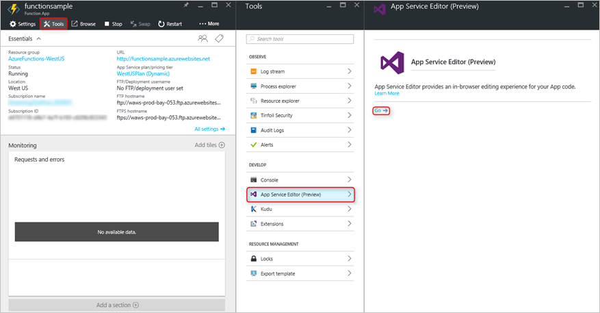
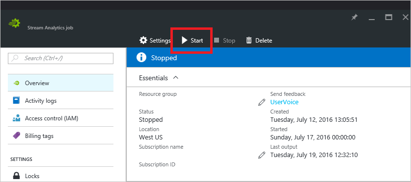
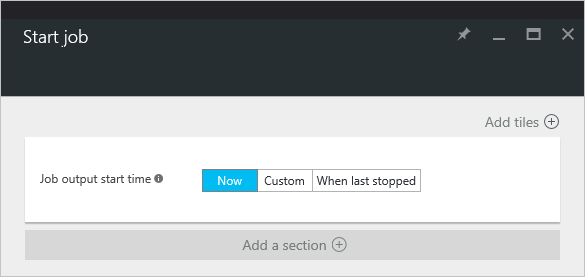
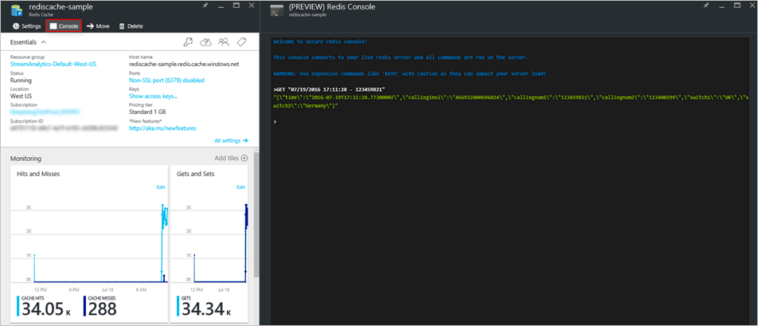

<properties
    pageTitle="Ausgabe an einen Azure Redis Cache, mithilfe von Azure-Funktionen aus Azure Stream Analytics | Microsoft Azure"
    description="Erfahren Sie, wie eine Azure-Funktion verwendet verbunden eine Service Bus Warteschlange, um Azure Redis Cache aus der Ausgabe eines Auftrags Stream Analytics füllen."
    keywords="Datenstream, Redis Cache, Service Bus Warteschlange"
    services="stream-analytics"
    authors="ryancrawcour"
    manager="jhubbard"
    documentationCenter=""
    />

<tags
    ms.service="stream-analytics"
    ms.devlang="na"
    ms.topic="article"
    ms.tgt_pltfrm="na"
    ms.workload="na"
    ms.date="09/26/2016"
    ms.author="ryancraw"/>

# <a name="how-to-store-data-from-azure-stream-analytics-in-an-azure-redis-cache-using-azure-functions"></a>Vorgehensweise zum Speichern von Daten aus Azure Stream Analytics in einem Azure Redis Cache von Azure-Funktionen

Azure Stream Analytics können Sie schnell entwickeln und Bereitstellen von Lösungen kostengünstiger, um in Echtzeit Einsichten von Geräten, Sensoren, Infrastruktur, und Applikationen oder einer beliebigen Stream von Daten zu erhalten. Sie können verschiedene verwenden Fällen wie in Echtzeit Management und Überwachung, Befehl und Steuerelement, Betrugsversuche, verbundenen Autos und viele weitere. In vielen solche Szenarios empfiehlt es sich zum Speichern von Daten nach Azure Stream Analytics in einer verteilten Datenspeicher wie etwa einen Cache Azure Redis ausgegeben.

Nehmen Sie an, dass Sie Teil eines Unternehmens Telekommunikation sind. Sie versuchen, SIM Betrug erkennen, in dem mehrere Anrufe aus der gleichen Identität gleichzeitig in Kürze, jedoch in verschiedenen geografischen Anzeigedauer, Standorten. Sie sollen alle der potenziellen gefälschte Telefonanrufe in einem Cache Azure Redis speichern. In diesem Blog stellen wir Anleitungen auf wie einfach die Aufgabe erledigen ein. 

## <a name="prerequisites"></a>Erforderliche Komponenten
Führen Sie die [Real-Time Betrugsversuche] [ fraud-detection] – Exemplarische Vorgehensweise für ASA

## <a name="architecture-overview"></a>Architektur (Übersicht)


(Siehe vorstehende Abbildung) ermöglicht Stream Analytics streaming Eingabedaten, um die Abfrage und der Ausgabe gesendet werden. Aufgrund der Ausgabe, können Funktionen Azure dann einige Typ des Ereignisses auslösen. 

In diesem Blog liegt der Schwerpunkt auf den Azure-Funktionen Teil dieses Verkaufspipeline oder genauer das Auslösen eines Ereignisses, die gefälschte Daten in den Cache gespeichert sind.
Nach Abschluss der [Betrugsversuche Real-Time] [ fraud-detection] Lernprogramm, stehen Ihnen eine Eingabe (ein Ereignis-Hub), einer Abfrage und eine Ausgabe (BLOB-Speicher) bereits konfiguriert und ausgeführt wird. In diesem Blog ändern wir die Ausgabe, um stattdessen eine Service Bus Warteschlange verwenden. Anschließend wird eine Azure-Funktion Herstellen einer Verbindung mit dieser Warteschlange. 

## <a name="create-and-connect-a-service-bus-queue-output"></a>Erstellen und Verbinden einer Service Bus Warteschlange Ausgabe
Um eine Service Bus Warteschlange zu erstellen, führen Sie die Schritte 1 und 2 des Abschnitts .NET in [Erste Schritte mit Bus Servicewarteschlangen][servicebus-getstarted].
Jetzt verbinden wir die Warteschlange mit den Stream Analytics Auftrag, die in der früheren Betrug Erkennung – Exemplarische Vorgehensweise erstellt wurde.


1. Klicken Sie im Azure-Portal an die **Ausgaben** Blade Ihrer Aufgaben wechseln Sie, und wählen Sie **Hinzufügen** am oberen Rand der Seite.

    

2. Wählen Sie **Service Bus Warteschlange** als die **ignorieren** , und folgen Sie den Anweisungen auf dem Bildschirm. Achten Sie darauf, um den Namespace der Dienst Bus Warteschlange wählen Sie unter [Erste Schritte mit Bus Servicewarteschlangen]erstellt haben[servicebus-getstarted]. Wenn Sie fertig sind, klicken Sie auf die Schaltfläche "rechts".
3. Geben Sie die folgenden Werte ein:
    - **Ereignis Serialisierungsprogramm Format**: JSON
    - **Codierung**: UTF8
    - **FORMAT**: Linie getrennt

4. Klicken Sie auf die Schaltfläche **Erstellen** , um diese Quelle hinzuzufügen oder zu überprüfen, ob Stream Analytics eine Verbindung mit dem Speicherkonto herstellen können.

5. Die Registerkarte **Abfrage** ersetzen Sie die aktuelle Abfrage mit folgenden aus. Ersetzen Sie mit der Ausgabename, den Sie in Schritt 3 erstellte *[IHR SERVICE BUS NAME]* . 

    ```    

        SELECT 
            System.Timestamp as Time, CS1.CallingIMSI, CS1.CallingNum as CallingNum1, 
            CS2.CallingNum as CallingNum2, CS1.SwitchNum as Switch1, CS2.SwitchNum as Switch2

        INTO [YOUR SERVICE BUS NAME]
    
        FROM CallStream CS1 TIMESTAMP BY CallRecTime
        JOIN CallStream CS2 TIMESTAMP BY CallRecTime
            ON CS1.CallingIMSI = CS2.CallingIMSI AND DATEDIFF(ss, CS1, CS2) BETWEEN 1 AND 5
    
        WHERE CS1.SwitchNum != CS2.SwitchNum
    
    ```

## <a name="create-an-azure-redis-cache"></a>Erstellen eines Azure Redis Caches
Erstellen einen Azure Redis Cache gemäß den Abschnitt .NET [So verwenden Azure Redis Cache] [ use-rediscache] bis im Abschnitt ***konfigurieren die Clients Cache***aufgerufen.
Sobald Sie fertig sind, müssen Sie einen neuen Cache für Redis aus. Wählen Sie unter **Alle Einstellungen** **Zugriffstasten** , und notieren Sie sich die ***primäre Verbindungszeichenfolge***aus.



## <a name="create-an-azure-function"></a>Erstellen einer Azure (Funktion)
Führen Sie die [Erstellen Ihrer ersten Azure-Funktion] [ functions-getstarted] Lernprogramm zu den ersten Schritten mit Azure-Funktionen. Wenn Sie bereits eine Azure-Funktion, die Sie verwenden möchten haben, klicken Sie dann fahren Sie mit [Schreiben in Redis Cache](#Writing-to-Redis-Cache)

1. Im Portal wählen Sie App Services aus dem linken Navigationsbereich, und klicken Sie auf der app-Name Azure-Funktion, um die Funktion des app-Website gelangen.
    

2. Klicken Sie auf **neuen Funktion > ServiceBusQueueTrigger – C#-**. Gehen Sie für die folgenden Felder wie folgt vor:
    - **Name der Warteschlange**: denselben Namen wie die von Ihnen eingegebene bei der Erstellung der Warteschlange in die [Erste Schritte mit Bus Servicewarteschlangen] Name[ servicebus-getstarted] (nicht der Name der Dienstbus). Stellen Sie sicher, dass Sie die Warteschlange verwenden, die in die Ausgabe Stream Analytics verbunden ist.
    - **Dienst Verbindung**: Wählen Sie **Hinzufügen einer Verbindungszeichenfolge**aus. Um die Verbindungszeichenfolge zu finden, wechseln Sie zum klassischen Portal, wählen Sie **Dienstbus**, Dienstbus erstellten und **VERBINDUNGSINFORMATIONEN** am unteren Rand des Bildschirms. Stellen Sie sicher, dass Sie auf dem Hauptbildschirm auf dieser Seite befinden. Kopieren und Einfügen der Verbindungszeichenfolge. Geben Sie einen beliebigen Verbindungsnamen können.
    
        
    - **AccessRights**: Wählen Sie **Verwalten**


3. Klicken Sie auf **Erstellen**

## <a name="writing-to-redis-cache"></a>Schreiben in Redis Cache
Wir haben nun eine Azure-Funktion erstellt, die aus einem Dienst Bus Warteschlange liest. Zum Ausführen offen steht lediglich unsere Funktion verwenden, um diese Daten in den Cache Redis zu schreiben. 

1. Wählen Sie aus der neu erstellten **ServiceBusQueueTrigger**, und klicken Sie auf der oberen rechten Ecke auf **Einstellungen für die app (Funktion)** . Wählen Sie **App Service-Einstellungen > Einstellungen > Anwendungseinstellungen**

2. Erstellen Sie im Abschnitt Verbindung Zeichenfolgen in im Abschnitt **Name** einen Namen ein. Fügen Sie die primäre Verbindungszeichenfolge, die Sie im Schritt **Erstellen Sie einen Redis Cache** in den Abschnitt **Wert** gefunden. Wählen Sie **benutzerdefinierte** , in dem sie die **SQL-Datenbank**besagt.

3. Klicken Sie oben auf **Speichern** .

    

4. Jetzt kehren Sie zu der Einstellungen für die App-Dienst, und wählen Sie **Tools > App-Service-Editor (Preview) > auf > wechseln**.

    

5. In einem Editor Ihrer Wahl Erstellen einer benannten **project.json** mit folgenden JSON-Datei, und speichern Sie sie auf die lokale Festplatte.

        {
            "frameworks": {
                "net46": {
                    "dependencies": {
                        "StackExchange.Redis":"1.1.603",
                        "Newtonsoft.Json": "9.0.1"
                    }
                }
            }
        }

6. Laden Sie diese Datei in das Stammverzeichnis Ihrer-Funktion (nicht WWWROOT) hoch. Finden Sie eine Datei mit dem Namen **project.lock.json** automatisch angezeigt werden, bestätigen, dass die Nuget "StackExchange.Redis" verpackt und "Newtonsoft.Json" importiert wurden.

7. Ersetzen Sie in der Datei **run.csx** den vorab generierten Code mit den folgenden Code ein. Ersetzen Sie in der Funktion LazyConnection "Eintrag NAME" durch den Namen, die, den Sie in Schritt 2 des **Speichern von Daten in den Cache Redis**erstellt haben.

````

    using System;
    using System.Threading.Tasks;
    using StackExchange.Redis;
    using Newtonsoft.Json;
    using System.Configuration;
    
    public static void Run(string myQueueItem, TraceWriter log)
    {
        log.Info($"Function processed message: {myQueueItem}");

        // Connection refers to a property that returns a ConnectionMultiplexer
        IDatabase db = Connection.GetDatabase();
        log.Info($"Created database {db}");
    
        // Parse JSON and extract the time
        var message = JsonConvert.DeserializeObject<dynamic>(myQueueItem);
        string time = message.time;
        string callingnum1 = message.callingnum1;

        // Perform cache operations using the cache object...
        // Simple put of integral data types into the cache
        string key = time + " - " + callingnum1;
        db.StringSet(key, myQueueItem);
        log.Info($"Object put in database. Key is {key} and value is {myQueueItem}");

        // Simple get of data types from the cache
        string value = db.StringGet(key);
        log.Info($"Database got: {value}"); 
    }

    // Connect to the Service Bus
    private static Lazy<ConnectionMultiplexer> lazyConnection = 
        new Lazy<ConnectionMultiplexer>(() =>
            {
                var cnn = ConfigurationManager.ConnectionStrings["CONN NAME"].ConnectionString
                return ConnectionMultiplexer.Connect();
            });
    
    public static ConnectionMultiplexer Connection
    {
        get
        {
            return lazyConnection.Value;
        }
    }

````

## <a name="start-the-stream-analytics-job"></a>Starten Sie den Auftrag Stream Analytics

1. Starten Sie die Anwendung telcodatagen.exe. Die Verwendung sieht wie folgt aus:````telcodatagen.exe [#NumCDRsPerHour] [SIM Card Fraud Probability] [#DurationHours]````

2. Klicken Sie aus den vorher Stream Analytics Position in dem Portal auf **Starten** , am oberen Rand der Seite.

    

3. Wählen Sie in den **Auftrag starten** Blade, das angezeigt wird **jetzt** aus, und klicken Sie dann auf die Schaltfläche **Start** am unteren Rand des Bildschirms. Die Position Status ändert sich Felder starten und einige Zeit ändert, um die Ausführung.
 
    

## <a name="run-solution-and-check-results"></a>Führen Sie die Lösung, und Prüfen der Ergebnisse
Wechseln wieder zur Seite **ServiceBusQueueTrigger** , sollte jetzt Log-Anweisungen angezeigt werden. Diese Protokolle zeigen an, dass Sie etwas aus der Warteschlange Service Bus, setzen es in der Datenbank haben und sie sich mit der Zeit als Schlüssel abgerufen!

Um zu überprüfen, dass Ihre Daten in dem Redis Cache, wechseln Sie zur Seite Redis Cache in das neue Portal, (wie im vorherigen Schritt [Erstellen einer Azure Redis Cache](#Create-an-Azure-Redis-Cache) gezeigt), und wählen Sie Console.

Sie können nun schreiben Redis Befehle, um zu bestätigen, dass die Daten im Cache wirklich vorhanden ist.



## <a name="next-steps"></a>Nächste Schritte
Wir sehen der Integration neue Dinge Azure-Funktionen und Stream Analytics zusammen führen können, und wir hoffen, dass diese neue mögliche Werte für Sie freigibt. Wenn Sie über Feedback auf was Sie als Nächstes möchten verfügen, können Sie die [Website Azure UserVoice](https://feedback.azure.com/forums/270577-stream-analytics)verwenden.

Wenn Sie neue Microsoft Azure sind, wir von Ihnen eingeladene Person zu testen, indem Sie für eine [kostenlose Testversion Azure-Konto](https://azure.microsoft.com/pricing/free-trial/)anmelden. Wenn Sie mit Stream Analytics vertraut sind, klicken Sie dann eingeladene wir Ihnen zum [Erstellen Ihrer ersten Stream Analytics Position](stream-analytics-create-a-job.md).

Wenn Sie eine benötigen Hilfe oder Fragen Beitrag in [MSDN](https://social.msdn.microsoft.com/Forums/en-US/home?forum=AzureStreamAnalytics) oder [Stackoverflow](http://stackoverflow.com/questions/tagged/azure-stream-analytics) Foren haben. 

Sie können auch finden Sie unter den folgenden Ressourcen:

- [Azure Funktionen Entwicklerreferenz](../azure-functions/functions-reference.md)
- [Azure Funktionen C#-Entwicklerreferenz](../azure-functions/functions-reference-csharp.md)
- [Azure Funktionen F Nr. Entwicklerreferenz](../azure-functions/functions-reference-fsharp.md)
- [Azure Funktionen NodeJS Entwicklerreferenz](../azure-functions/functions-reference.md)
- [Azure Funktionen Trigger und Bindungen](../azure-functions/functions-triggers-bindings.md)
- [Zum Überwachen der Azure Redis Cache](../redis-cache/cache-how-to-monitor.md)

Wenn auf dem neuesten Stand bei allen neuesten News und Features bleiben möchten, führen Sie die [@AzureStreaming](https://twitter.com/AzureStreaming) auf Twitter.


[fraud-detection]: stream-analytics-real-time-fraud-detection.md
[servicebus-getstarted]: ../service-bus-messaging/service-bus-dotnet-get-started-with-queues.md
[use-rediscache]: ../redis-cache/cache-dotnet-how-to-use-azure-redis-cache.md
[functions-getstarted]: ../azure-functions/functions-create-first-azure-function.md
