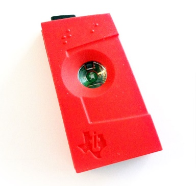
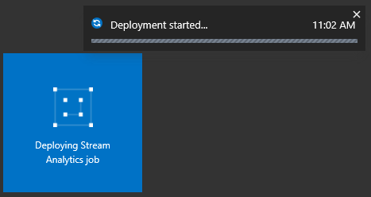
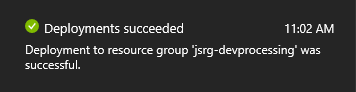
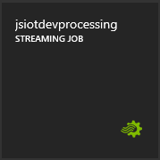
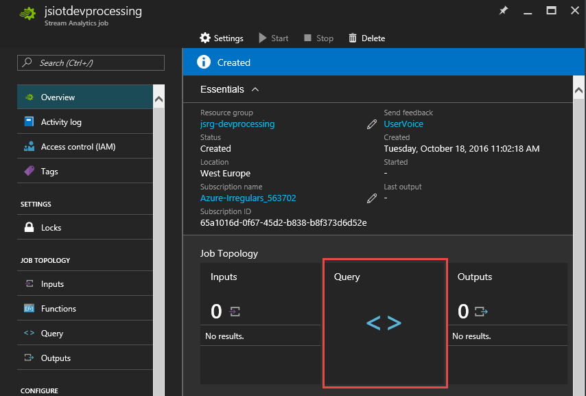
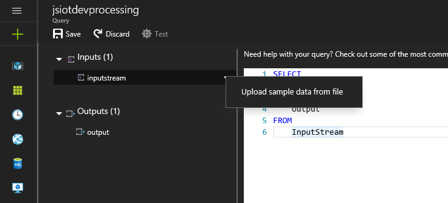
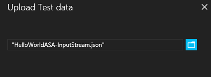
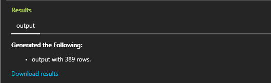

<properties
    pageTitle="Erste Schritte mit Azure Stream Analytics zum Verarbeiten von Daten aus IoT Geräte. | Microsoft Azure"
    description="IoT Sensor Tags und Daten Streams mit Stream Analytics und in Echtzeit Datenverarbeitung"
    keywords="IOT Lösung, erste Schritte mit Iot"
    services="stream-analytics"
    documentationCenter=""
    authors="jeffstokes72"
    manager="jhubbard"
    editor="cgronlun"
/>

<tags
    ms.service="stream-analytics"
    ms.devlang="na"
    ms.topic="hero-article"
    ms.tgt_pltfrm="na"
    ms.workload="data-services"
    ms.date="10/19/2016"
    ms.author="jeffstok"
/>

# Erste Schritte mit Azure Stream Analytics zum Verarbeiten von Daten aus IoT Geräte

In diesem Lernprogramm erfahren Sie, wie Stream-Verarbeitung Logik zum Sammeln von Daten aus dem Internet der Dinge (IoT) Geräte erstellen. Wir verwenden ein praktisches, Internet der Dinge (IoT) Anwendungsfall-, um zu veranschaulichen, wie Sie Ihre Lösung schnell und wirtschaftlich erstellen.

## Erforderliche Komponenten

-   [Azure-Abonnement](https://azure.microsoft.com/pricing/free-trial/)
-   Abfragen und Daten Beispieldateien herunterladbaren aus [GitHub](https://aka.ms/azure-stream-analytics-get-started-iot)

## Szenario

Contoso, also einem Unternehmen, in dem Bereich industrielle Automatisierung verfügt über eine seine Fertigungsprozess vollständig automatische. Die Maschinen in diesem Betrieb weist Sensoren, bei die der Ausgeben von Daten in Echtzeit Streams ist. In diesem Szenario möchte ein Herstellung Floor-Manager in Echtzeit Einsichten aus der Sensordaten Mustern suchen und Aktionen auf diese haben. Wir verwenden die Stream Analytics Query Language (SAQL) über die Sensordaten, um interessante Muster aus dem eingehenden Stream von Daten zu suchen.

Hier werden Daten aus einer Texas Geräte Kategorie Sensorgerät generiert.

Die alle Aspekte der Daten im JSON-Format ist und sieht wie folgt aus:

    {
        "time": "2016-01-26T20:47:53.0000000",  
        "dspl": "sensorE",  
        "temp": 123,  
        "hmdt": 34  
    }  

Sie könnten in einem Szenario praktisches hundert diese Sensoren Generieren von Ereignissen als Stream haben. Idealerweise würde ein Gatewaygerät Code, um diese Ereignisse an [Azure Ereignis Hubs](https://azure.microsoft.com/services/event-hubs/) oder [Azure IoT Hubs](https://azure.microsoft.com/services/iot-hub/)ausgeführt. Ihre Arbeit Stream Analytics würde Aufnahme diese Ereignisse aus Ereignis Hubs und die Streams in Echtzeit Analytics-Abfragen ausführen. Klicken Sie dann können Sie die Ergebnisse an einen des [unterstützt Ausgaben](stream-analytics-define-outputs.md)senden.

Mit diesem Leitfaden für erste Schritte bietet Center für erleichterte Bedienung eine Beispieldatei für die Daten, die von real Sensor Kategorie Geräte aufgezeichnet wurde. Sie können die Beispieldaten Abfragen ausgeführt und Ergebnisse angezeigt. In nachfolgenden Lernprogramme Sie erfahren, wie Sie Ihre Arbeit mit Eingaben verbinden gibt und auf den Azure-Dienst bereitstellen.

## Erstellen eines Auftrags für Stream Analytics

1. Klicken Sie im [Portal Azure](http://portal.azure.com)-klicken Sie auf das Pluszeichen (+), und geben Sie dann **STREAM ANALYTICS** im Textfenster nach rechts. Wählen Sie dann **Stream Analytics Position** in der Ergebnisliste ein.

    

2. Geben Sie einen Namen für die eindeutige Position, und stellen Sie sicher, dass das Abonnement für den Job richtig ist. Klicken Sie dann eine neue Ressourcengruppe erstellen oder Auswählen einer vorhandenes für Ihr Abonnement.

3. Wählen Sie dann einen Speicherort für Ihre Position ein. Zur Verarbeitung Geschwindigkeit und Verringerung der Kosten Daten empfiehlt sich durchstellen am selben Speicherort wie die Ressourcengruppe und vorgesehenen Speicher-Konto auswählen.

    

    > [AZURE.NOTE] Sie sollten dieses Speicherkonto nur einmal pro Region erstellen. Diese Speicher werden alle Stream Analytics Aufträge gemeinsam verwendet werden, die in diesem Bereich erstellt wurden.

4. Aktivieren Sie das Kontrollkästchen, um Ihre Position auf dem Dashboard platzieren, und klicken Sie dann auf **Erstellen**.

    

5. Eine 'Bereitstellung Schritte...' sollte angezeigt werden. angezeigten oben rechts des Browserfensters angezeigt. Bald wird es zu einem fertigen Fenster ändern, wie unten dargestellt.

    

### Erstellen einer Abfrage Azure Stream Analytics

Nachdem Ihre Aufgabe erstellt wird hat es Anzeigedauer zu öffnen und eine Abfrage erstellen. Sie können Ihre Arbeit problemlos zugreifen, indem Sie auf die Kachel dafür.

Klicken Sie im **Auftrag Suchtopologie** klicken Sie auf das Feld **Abfrage** , um den Abfrage-Editor zu wechseln. **Abfrage** -Editor können Sie eine T-SQL-Abfrage eingeben, die die Transformation für eingehende angezeigten Ereignisdaten ausführt.

### Abfrage: Archivieren Sie Ihrer unformatierten Daten

Die einfachste Form der Abfrage ist eine Pass-Through-Abfrage, die alle eingegebenen Daten zu deren Ausgabe vorgesehenen archiviert. Herunterladen der Beispieldatei Daten aus [GitHub](https://aka.ms/azure-stream-analytics-get-started-iot) an einem Speicherort auf Ihrem Computer. 

1. Fügen Sie die Abfrage aus der Datei PassThrough.txt. 

    

2. Klicken Sie auf den drei Punkten neben Ihrer Eingabe, und aktivieren Sie das **Beispieldaten aus Datei hochladen** .

    

3. Ein Bereich auf der rechten Seite wird geöffnet, als Ergebnis, die in diese Datendatei HelloWorldASA-InputStream.json über den heruntergeladenen Speicherort auswählen, und klicken Sie auf **OK** , am unteren Rand des Bereichs.

    

4. Klicken Sie dann klicken Sie auf das Zahnrad **Testen** im oberen Bereich des Fensters links und verarbeiten Sie Ihre Testabfrage, für die Stichprobendataset zu. Wie die Verarbeitung abgeschlossen ist, wird ein Ergebnisfenster unterhalb Ihrer Abfrage geöffnet.

    

### Abfrage: Filtern der Daten auf der Grundlage einer bedingungs

Wir versuchen, um die Ergebnisse auf der Grundlage einer bedingungs filtern. Wir möchten Ergebnisse für nur diese Ereignisse anzeigen, die aus "SensorA". Die Abfrage ist in der Datei Filtering.txt.

Beachten Sie, dass die Groß-/Kleinschreibung beachtet Abfrage einen Zeichenfolgenwert vergleicht. Klicken Sie auf das Zahnrad **Test** erneut aus, um die Abfrage auszuführen. Die Abfrage sollte 389 Zeilen von 1860 Ereignisse zurück.

### Abfrage: Benachrichtigung auslösen ein Business-Workflows

Wir stellen unserer Abfrage ausführlichere. Für jede Art von Sensor möchten wir Durchschnittstemperatur pro 30 Sekunden Fenster Überwachen und Anzeigen der Ergebnisse nur, wenn die Durchschnittstemperatur über 100 Grad ist ein. Wir schreiben die folgende Abfrage, und klicken Sie dann auf **Testen** , um die Ergebnisse anzuzeigen. Die Abfrage ist in der Datei ThresholdAlerting.txt.

Sie sollten jetzt finden Sie unter Ergebnisse, die nur 245 Zeilen und die Namen von Sensoren enthalten, der Mittelwert gemäßigten größer als 100 ist. Diese Abfrage gruppiert den Stream von Ereignissen nach **Dspl**, also den Namen des Sensors, über ein **Fenster Tumbling** von 30 Sekunden. Zeitliche Abfragen müssen unternommen werden wie wir an den Fortschritt. Mithilfe der **Zeitstempel BY** -Klausel haben wir die **OUTPUTTIME** -Spalte, um alle zeitliche Berechnungen Zeiten zuordnen angegeben. Ausführliche Informationen finden Sie im MSDN-Artikel zu [Zeitmanagement](https://msdn.microsoft.com/library/azure/mt582045.aspx) und [Windowing-Funktionen](https://msdn.microsoft.com/library/azure/dn835019.aspx).

### Abfrage: Erkennen Sie Abwesenheit von Ereignissen

Wie können wir eine Abfrage unzureichender der Eingabewerte Ereignisse finden schreiben? Finden Sie uns Uhrzeit der letzten auf, die eine Daten gesendete und dann für die nächsten Minute keinen Ereignisse gesendet. Die Abfrage ist in der Datei AbsenseOfEvent.txt.

Verwenden Sie hier eine **Linke ÄUßERE** Verknüpfung in den gleichen Datenstream (Selbstjoins). Für eine **innere** Verknüpfung wird ein Ergebnis zurückgegeben, nur, wenn eine Übereinstimmung gefunden wird.  Ist ein Ereignis von der linken Seite der Verknüpfung zur Inkonsistenzsuche, wird für eine **Linke ÄUßERE** Verknüpfung eine Zeile mit NULL-WERTEN für alle Spalten des rechten Rands zurückgegeben. Diese Methode ist sehr hilfreich, um eine Abwesenheit von Ereignissen zu finden. Finden Sie unter unseren MSDN-Dokumentation für Weitere Informationen zur [Teilnahme an](https://msdn.microsoft.com/library/azure/dn835026.aspx).

## Abschluss

Der Zweck dieses Lernprogramms ist, um zu veranschaulichen, wie verschiedene Stream Analytics-Abfragesprache Abfragen schreiben und die Ergebnisse im Browser angezeigt. Dies ist jedoch nur ersten Schritte. Sie können noch viel mehr mit Stream Analytics ausführen. Stream Analytics eine Vielzahl von Eingaben unterstützt ausgegeben und können auch Funktionen Azure Computer interessante um zu vereinfachen ein robuste Tools zum Analysieren von Datenstreams. Sie können mithilfe von unserer [learning Karte](https://azure.microsoft.com/documentation/learning-paths/stream-analytics/)mehr zu Stream Analytics untersuchen starten. Weitere Informationen zum Schreiben von Abfragen finden Sie im Artikel über [gängige Abfragemuster](./stream-analytics-stream-analytics-query-patterns.md).
